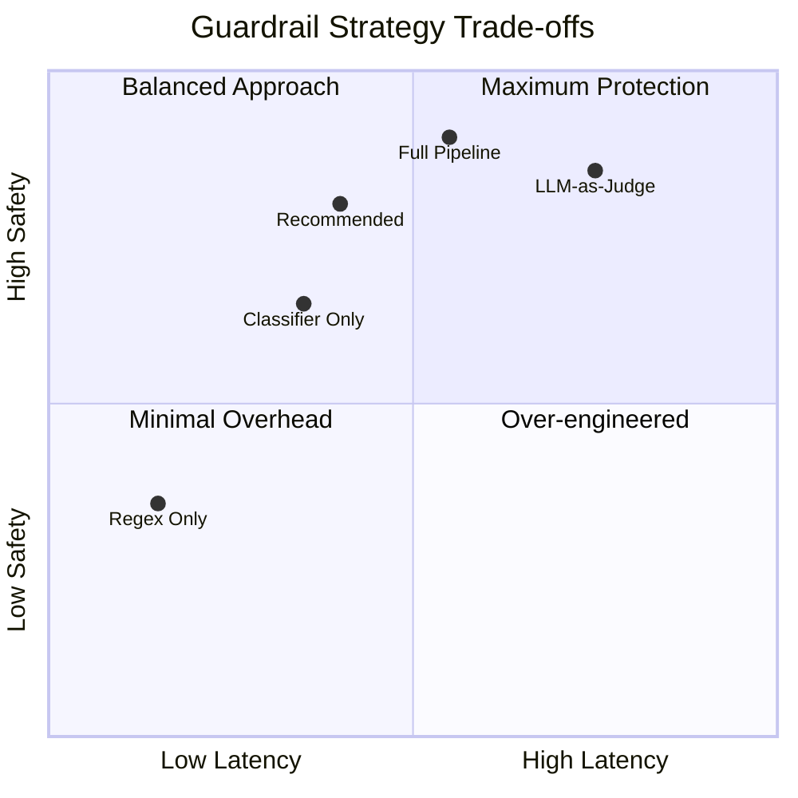

# AI Guardrails & Safety System

A comprehensive defense layer for LLM-based applications that provides multi-stage validation of inputs and outputs to prevent prompt injection, jailbreaks, content policy violations, and sensitive data exposure.

---

## Quick Navigation

| Document | Description |
|----------|-------------|
| [01 - Requirements & Estimations](./01-requirements-and-estimations.md) | Functional, non-functional requirements, capacity planning |
| [02 - High-Level Design](./02-high-level-design.md) | Architecture overview, components, data flows |
| [03 - Low-Level Design](./03-low-level-design.md) | Data models, APIs, core algorithms |
| [04 - Deep Dive & Bottlenecks](./04-deep-dive-and-bottlenecks.md) | Critical component analysis, performance challenges |
| [05 - Scalability & Reliability](./05-scalability-and-reliability.md) | Scaling strategies, fault tolerance |
| [06 - Security & Compliance](./06-security-and-compliance.md) | Threat model, regulatory requirements |
| [07 - Observability](./07-observability.md) | Metrics, tracing, alerting |
| [08 - Interview Guide](./08-interview-guide.md) | Pacing, trap questions, key numbers |

---

## Complexity Rating

| Dimension | Rating | Notes |
|-----------|--------|-------|
| **Algorithm Complexity** | Very High | Multi-stage detection, ML classifiers, policy engines |
| **Scale Complexity** | High | Sub-50ms latency at 10K+ req/sec |
| **Operational Complexity** | Very High | Continuous model updates, policy management |
| **Interview Frequency** | Very High | Core AI safety topic for 2025+ |

---

## Key Characteristics

| Characteristic | Value | Implication |
|----------------|-------|-------------|
| **Latency Budget** | <50ms overhead (p50) | Multi-stage detection must be parallelized |
| **Detection Accuracy** | >95% | High recall critical for safety |
| **False Positive Rate** | <1% | User experience preservation |
| **Throughput** | 10,000+ req/sec/node | Requires efficient model serving |
| **Processing Mode** | Real-time + async | Block attacks immediately, review borderline async |

---

## Five-Layer Defense Architecture

```mermaid
flowchart TB
    subgraph Input["Layer 1: Input Rails"]
        I1[Prompt Injection Detection]
        I2[Jailbreak Pattern Matching]
        I3[Content Moderation]
        I4[PII Detection]
        I5[Topic Classification]
    end

    subgraph Dialog["Layer 2: Dialog Rails"]
        D1[Conversation State Tracking]
        D2[Multi-Turn Attack Detection]
        D3[Instruction Hierarchy]
    end

    subgraph Retrieval["Layer 3: Retrieval Rails"]
        R1[Source Validation]
        R2[Content Relevance]
        R3[Hallucination Grounding]
    end

    subgraph Execution["Layer 4: Execution Rails"]
        E1[Tool Call Validation]
        E2[Parameter Sanitization]
        E3[Action Authorization]
    end

    subgraph Output["Layer 5: Output Rails"]
        O1[Response Moderation]
        O2[PII Redaction]
        O3[Fact Verification]
        O4[Policy Compliance]
    end

    REQ[Request] --> Input
    Input --> Dialog
    Dialog --> Retrieval
    Retrieval --> Execution
    Execution --> LLM[LLM Inference]
    LLM --> Output
    Output --> RES[Response]

    classDef input fill:#e1f5fe,stroke:#01579b,stroke-width:2px
    classDef dialog fill:#fff3e0,stroke:#e65100,stroke-width:2px
    classDef retrieval fill:#e8f5e9,stroke:#2e7d32,stroke-width:2px
    classDef execution fill:#f3e5f5,stroke:#6a1b9a,stroke-width:2px
    classDef output fill:#fffde7,stroke:#f57f17,stroke-width:2px
    classDef endpoint fill:#e0f7fa,stroke:#00695c,stroke-width:2px

    class I1,I2,I3,I4,I5 input
    class D1,D2,D3 dialog
    class R1,R2,R3 retrieval
    class E1,E2,E3 execution
    class O1,O2,O3,O4 output
    class REQ,RES,LLM endpoint
```

---

## Framework Comparison

| Feature | NeMo Guardrails | Guardrails AI | Bedrock Guardrails |
|---------|-----------------|---------------|-------------------|
| **Provider** | NVIDIA (Open Source) | Guardrails AI (Open Source) | AWS (Managed) |
| **License** | Apache 2.0 | Apache 2.0 | Proprietary |
| **Policy Language** | Colang 2.0 DSL | Python validators | Console/API config |
| **Deployment** | Self-hosted, NIM | Self-hosted, SaaS | Fully managed |
| **Rail Types** | Input, Dialog, Retrieval, Execution, Output | Input, Output validators | Input, Output filters |
| **Prompt Injection** | Built-in detector | Community validators | Built-in classifier |
| **Jailbreak Detection** | NIM microservice | Custom validators | Prompt attack filter |
| **PII Detection** | Configurable | Presidio integration | 30+ entity types |
| **Content Moderation** | Aegis safety model | Custom validators | 6 harm categories |
| **Latency Overhead** | ~50ms | ~30-100ms | ~20-50ms |
| **Best For** | Custom policies, agents | Structured output validation | AWS-native apps |

---

## Detection Technique Summary

| Attack Type | Detection Method | Latency | Accuracy |
|-------------|------------------|---------|----------|
| **Prompt Injection** | Regex → Classifier → LLM-judge | 5-50ms | ~95% |
| **Jailbreak Attempts** | Pattern DB + Token confidence (FJD) | 10-30ms | ~92% |
| **Toxicity/Hate** | Multi-label classifier | 5-15ms | ~96% |
| **PII Exposure** | Regex + NER + Validation | 10-25ms | ~94% precision |
| **Topic Violations** | Embedding similarity | 5-15ms | ~90% |
| **Hallucinations** | RAG grounding + Automated reasoning | 50-200ms | ~75% |

---

## When to Use AI Guardrails

| Scenario | Recommendation |
|----------|----------------|
| **Customer-facing chatbots** | Essential - Block harmful content, PII leakage |
| **Internal enterprise assistants** | Recommended - Topic control, data classification |
| **Agentic AI with tool access** | Critical - Execution rails prevent unauthorized actions |
| **RAG applications** | Important - Retrieval rails ensure source quality |
| **Code generation** | Important - Injection detection, secrets scanning |
| **Low-latency inference** | Consider trade-offs - May need lightweight rails only |

---

## Trade-off Visualization

---

## Key Metrics at a Glance

| Metric | Target | Critical Threshold |
|--------|--------|-------------------|
| **Detection Latency (p50)** | <30ms | >100ms |
| **Detection Latency (p99)** | <100ms | >500ms |
| **True Positive Rate** | >95% | <90% |
| **False Positive Rate** | <1% | >5% |
| **Throughput** | 10K req/sec | <1K req/sec |
| **Availability** | 99.99% | <99.9% |

---

## Related Topics

| Topic | Relationship |
|-------|--------------|
| [3.21 - LLM Gateway](../3.21-llm-gateway-prompt-management/00-index.md) | Guardrails integrate as middleware layer |
| [3.15 - RAG System](../3.15-rag-system/00-index.md) | Retrieval rails validate RAG content |
| [3.17 - AI Agent Orchestration](../3.17-ai-agent-orchestration-platform/00-index.md) | Execution rails secure tool calls |
| [3.14 - Vector Database](../3.14-vector-database/00-index.md) | Semantic similarity for injection detection |

---

## Interview Readiness Checklist

- [ ] Can explain five rail types and their purposes
- [ ] Can design multi-stage detection pipeline
- [ ] Understands latency vs. accuracy trade-offs
- [ ] Knows key numbers (latency budgets, accuracy targets)
- [ ] Can discuss prompt injection detection techniques
- [ ] Understands PII detection with NER
- [ ] Can describe policy enforcement architecture
- [ ] Familiar with NeMo Guardrails, Guardrails AI, Bedrock Guardrails
