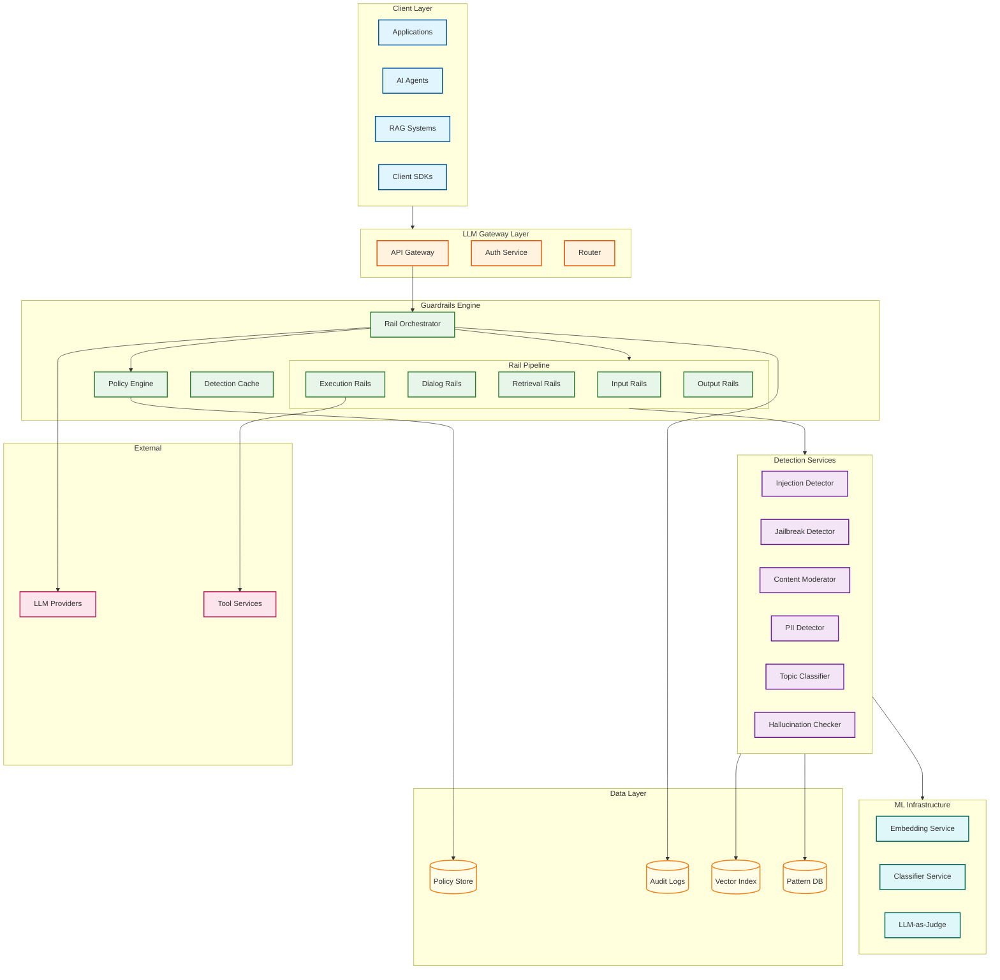
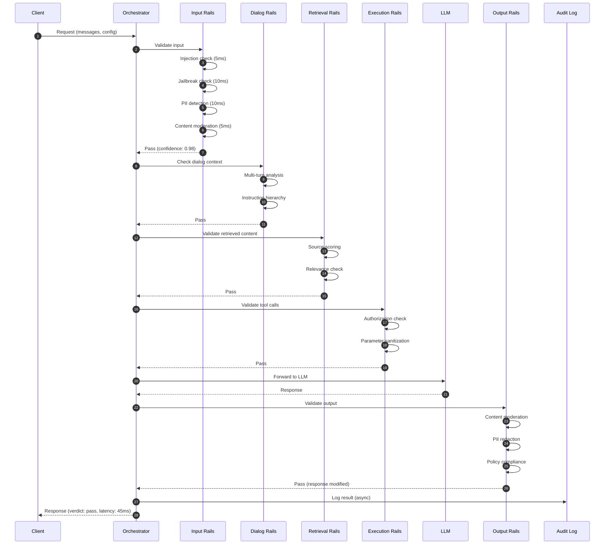
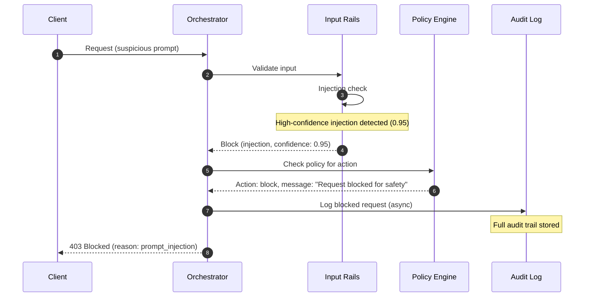
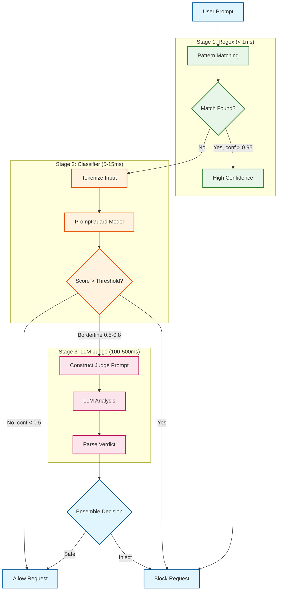
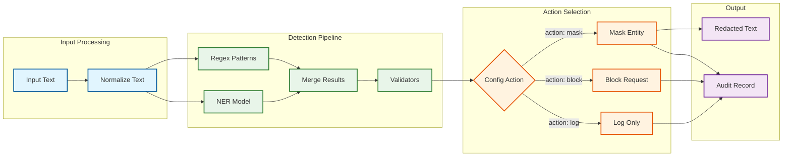
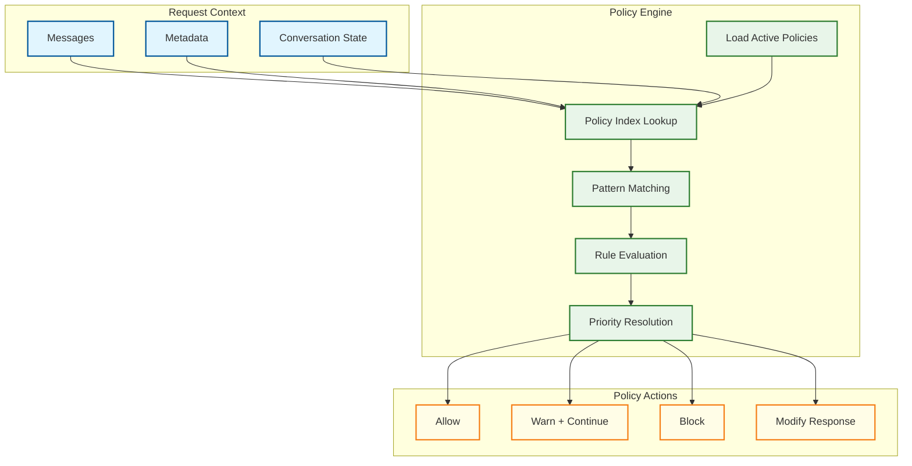
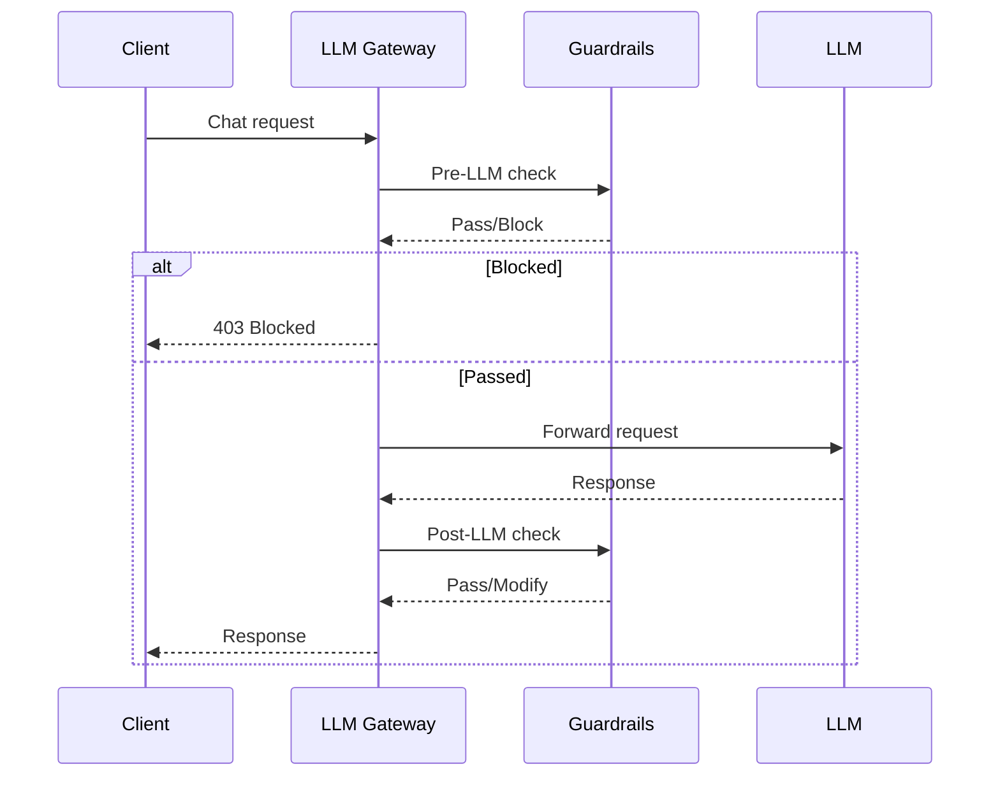
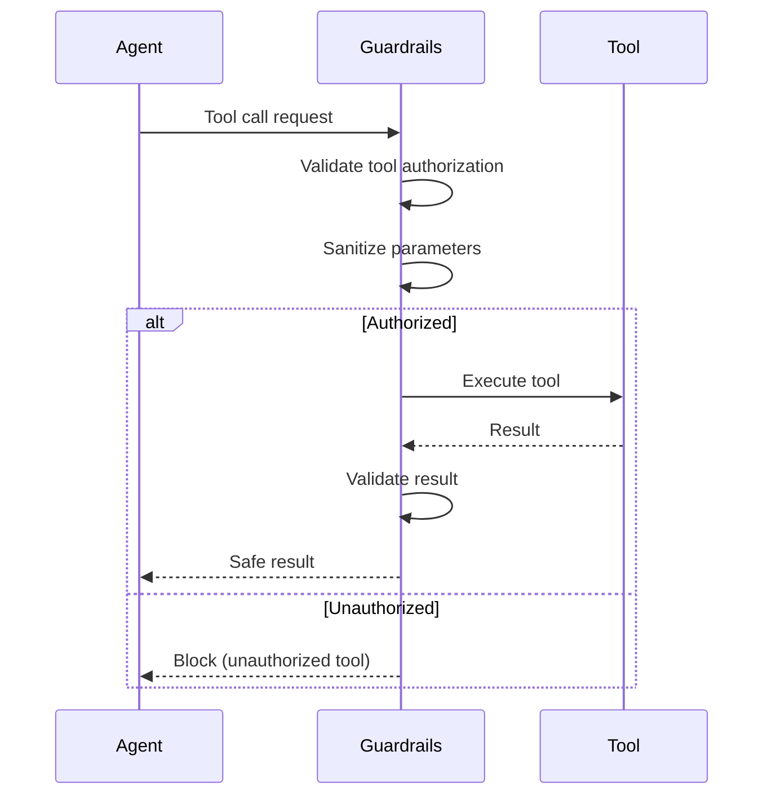
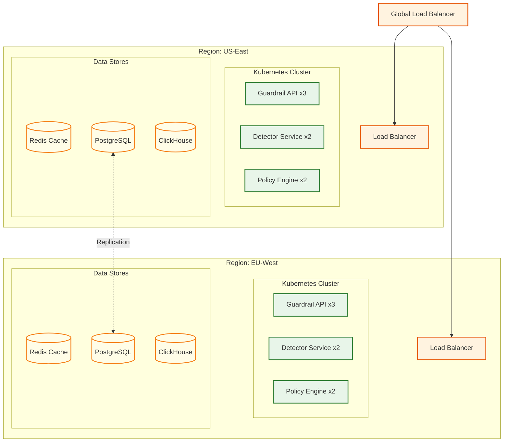

# High-Level Design

## System Architecture Overview

---

## Component Responsibilities

| Component | Layer | Responsibility | Key Technologies |
|-----------|-------|----------------|------------------|
| **Rail Orchestrator** | Guardrails | Coordinate rail execution, early-exit on block | State machine, async pipeline |
| **Input Rails** | Guardrails | Pre-LLM validation of user prompts | Injection/jailbreak/PII detectors |
| **Dialog Rails** | Guardrails | Conversation state, multi-turn safety | Context tracker, instruction hierarchy |
| **Retrieval Rails** | Guardrails | RAG content validation | Source scoring, relevance filter |
| **Execution Rails** | Guardrails | Tool call authorization | Parameter validator, action allowlist |
| **Output Rails** | Guardrails | Post-LLM response filtering | Content mod, PII redaction |
| **Policy Engine** | Guardrails | Declarative rule evaluation | Colang interpreter, rule indexer |
| **Injection Detector** | Detection | Prompt injection classification | Regex + classifier + LLM ensemble |
| **Jailbreak Detector** | Detection | Jailbreak pattern matching | FJD, pattern DB, behavior analysis |
| **Content Moderator** | Detection | Toxicity/harm classification | Multi-label classifier (Aegis-style) |
| **PII Detector** | Detection | Entity extraction and validation | NER + regex + Presidio patterns |
| **Topic Classifier** | Detection | Topic boundary enforcement | Embedding similarity, allowlist |
| **Hallucination Checker** | Detection | Grounding verification | Automated reasoning, RAG alignment |
| **Embedding Service** | ML | Text vectorization | Sentence transformers |
| **Classifier Service** | ML | ML model inference | ONNX runtime, batch inference |
| **LLM-as-Judge** | ML | Complex case evaluation | LLM API with structured output |

---

## Data Flow: Request Processing

### Happy Path (All Rails Pass)

### Blocked Request Flow

---

## Prompt Injection Detection Flow

---

## PII Detection & Redaction Flow

---

## Policy Evaluation Flow

---

## Key Architectural Decisions

| Decision | Choice | Alternatives Considered | Rationale |
|----------|--------|------------------------|-----------|
| **Pipeline Architecture** | Sequential with early-exit | Parallel, waterfall | Block attacks ASAP, reduce unnecessary compute |
| **Detection Strategy** | Multi-stage ensemble | Single model, rules-only | Balance speed (regex), accuracy (classifier), coverage (LLM) |
| **Policy Language** | Declarative DSL (Colang-inspired) | Programmatic, JSON config | Human-readable, auditable, version-controlled |
| **Fail Mode** | Fail-closed (block on error) | Fail-open | Safety-first for guardrail systems |
| **State Management** | Stateless with context pass-through | Session affinity | Simpler scaling, no sticky sessions |
| **Caching** | Embedding + detection result cache | No cache, full cache | Reduce redundant computation, bounded memory |
| **Async vs Sync** | Sync for blocking, async for audit | All sync, all async | User experience + reliability |

---

## Architecture Pattern Checklist

| Pattern | Decision | Notes |
|---------|----------|-------|
| **Sync vs Async** | Sync for detection, async for logging | Blocking must be synchronous |
| **Event-driven vs Request-response** | Request-response with async events | Audit events fire-and-forget |
| **Push vs Pull** | Pull (request-driven) | No background processing needed |
| **Stateless vs Stateful** | Stateless with context | Dialog rails need conversation context passed |
| **Read-heavy vs Write-heavy** | Read-heavy (policies, patterns) | Policies cached, infrequent updates |
| **Real-time vs Batch** | Real-time detection, batch model updates | Models updated offline |
| **Edge vs Origin** | Origin processing | Complex ML models not suited for edge |

---

## Integration Points

### LLM Gateway Integration

### Agent Orchestration Integration

---

## Deployment Architecture

