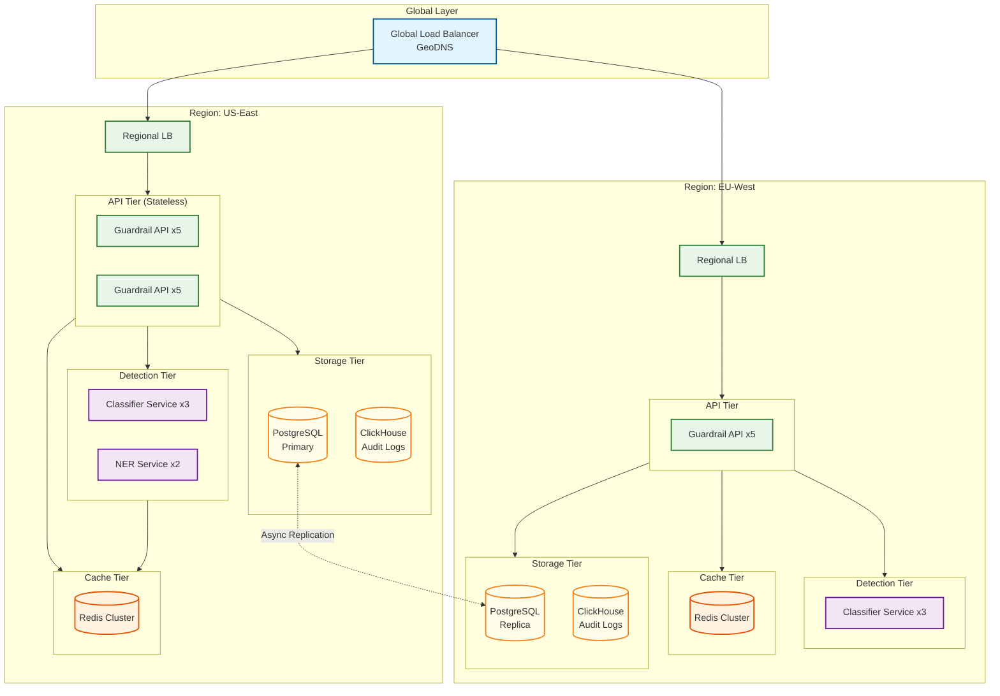
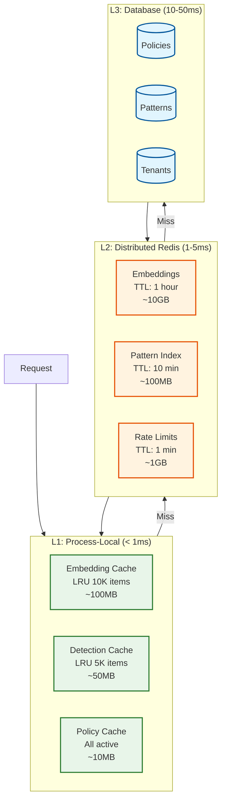
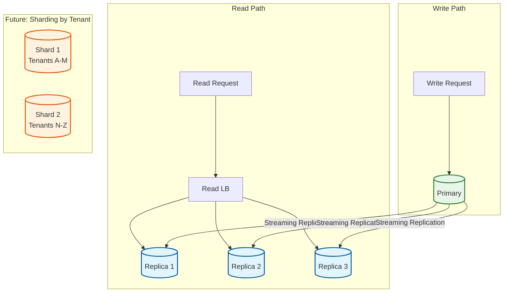
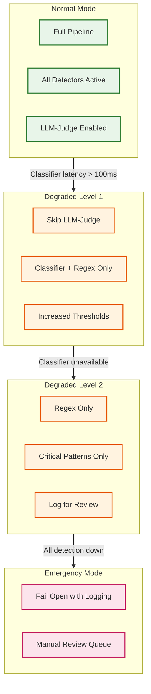
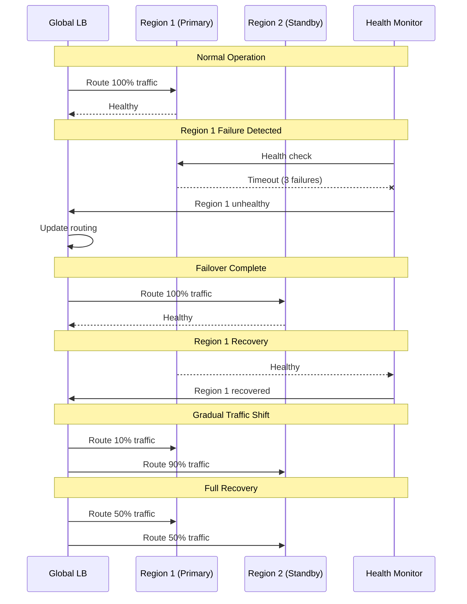

# Scalability & Reliability

## Scaling Architecture Overview



---

## Horizontal Scaling Strategy

### Component Scaling Characteristics

| Component | Scaling Type | Scaling Trigger | Scale Unit | Max Scale |
|-----------|--------------|-----------------|------------|-----------|
| **Guardrail API** | Horizontal | CPU > 70% or p99 > 50ms | +2 pods | 50 pods/region |
| **Classifier Service** | Horizontal | GPU util > 80% or queue depth > 100 | +1 pod | 20 pods/region |
| **NER Service** | Horizontal | CPU > 80% | +1 pod | 10 pods/region |
| **Policy Engine** | Horizontal | CPU > 70% | +1 pod | 10 pods/region |
| **Redis Cache** | Vertical + Sharding | Memory > 80% | +shard or +memory | 6 shards |
| **PostgreSQL** | Read Replicas | Read latency > 10ms | +1 replica | 5 replicas |
| **ClickHouse** | Horizontal | Disk > 70% or query time > 5s | +1 node | 10 nodes |

### Auto-Scaling Configuration

```yaml
# Kubernetes HPA for Guardrail API
apiVersion: autoscaling/v2
kind: HorizontalPodAutoscaler
metadata:
  name: guardrail-api-hpa
spec:
  scaleTargetRef:
    apiVersion: apps/v1
    kind: Deployment
    name: guardrail-api
  minReplicas: 3
  maxReplicas: 50
  metrics:
    - type: Resource
      resource:
        name: cpu
        target:
          type: Utilization
          averageUtilization: 70
    - type: Pods
      pods:
        metric:
          name: http_request_latency_p99
        target:
          type: AverageValue
          averageValue: 50m  # 50ms
  behavior:
    scaleUp:
      stabilizationWindowSeconds: 30
      policies:
        - type: Pods
          value: 4
          periodSeconds: 60
    scaleDown:
      stabilizationWindowSeconds: 300
      policies:
        - type: Percent
          value: 10
          periodSeconds: 60
```

### GPU Scaling for ML Inference

```yaml
# Classifier service with GPU auto-scaling
apiVersion: autoscaling/v2
kind: HorizontalPodAutoscaler
metadata:
  name: classifier-service-hpa
spec:
  scaleTargetRef:
    apiVersion: apps/v1
    kind: Deployment
    name: classifier-service
  minReplicas: 2
  maxReplicas: 20
  metrics:
    - type: External
      external:
        metric:
          name: nvidia_gpu_utilization
        target:
          type: AverageValue
          averageValue: 80
    - type: Pods
      pods:
        metric:
          name: inference_queue_depth
        target:
          type: AverageValue
          averageValue: 100
```

---

## Caching Strategy

### Multi-Layer Cache Architecture



### Cache Invalidation Strategy

| Cache Type | Invalidation Trigger | Strategy | Consistency |
|------------|---------------------|----------|-------------|
| **Embedding Cache** | TTL expiry | Lazy refresh | Eventual (1 hour) |
| **Detection Cache** | Content hash change | Write-through | Strong |
| **Policy Cache** | Policy update event | Pub/sub broadcast | Eventual (5 sec) |
| **Pattern Cache** | Pattern DB update | Version-based | Eventual (10 min) |
| **Rate Limit** | TTL expiry | Sliding window | Strong |

### Cache Implementation

```python
class TieredCache:
    """
    Multi-tier caching with automatic promotion/demotion.
    """

    def __init__(self):
        # L1: Process-local LRU
        self.l1 = LRUCache(maxsize=10000)

        # L2: Redis cluster
        self.l2 = RedisCluster(
            startup_nodes=[{"host": "redis", "port": 6379}],
            decode_responses=True
        )

        # Metrics
        self.hits = {"l1": 0, "l2": 0, "miss": 0}

    async def get(self, key: str, loader: Callable) -> Any:
        """
        Get value with automatic tier fallback.

        Args:
            key: Cache key
            loader: Function to load value on miss
        """
        # L1 lookup
        value = self.l1.get(key)
        if value is not None:
            self.hits["l1"] += 1
            return value

        # L2 lookup
        value = await self.l2.get(key)
        if value is not None:
            self.hits["l2"] += 1
            # Promote to L1
            self.l1[key] = json.loads(value)
            return self.l1[key]

        # Cache miss - load from source
        self.hits["miss"] += 1
        value = await loader()

        # Populate both tiers
        serialized = json.dumps(value)
        await self.l2.setex(key, 3600, serialized)  # 1 hour TTL
        self.l1[key] = value

        return value

    async def invalidate(self, key: str):
        """Invalidate across all tiers."""
        self.l1.pop(key, None)
        await self.l2.delete(key)

        # Broadcast invalidation to other instances
        await self.l2.publish("cache_invalidation", key)
```

---

## Database Scaling

### PostgreSQL Scaling Strategy



### Table Partitioning (Audit Logs)

```sql
-- Time-based partitioning for audit_logs
CREATE TABLE audit_logs (
    id UUID DEFAULT gen_random_uuid(),
    tenant_id UUID NOT NULL,
    request_id UUID NOT NULL,
    verdict VARCHAR(20) NOT NULL,
    created_at TIMESTAMP NOT NULL DEFAULT NOW()
) PARTITION BY RANGE (created_at);

-- Create monthly partitions
CREATE TABLE audit_logs_2026_01 PARTITION OF audit_logs
    FOR VALUES FROM ('2026-01-01') TO ('2026-02-01');

CREATE TABLE audit_logs_2026_02 PARTITION OF audit_logs
    FOR VALUES FROM ('2026-02-01') TO ('2026-03-01');

-- Automatic partition creation job (pg_partman or cron)
-- Drop partitions older than 90 days for compliance
```

### ClickHouse for Analytics

```sql
-- ClickHouse table for high-volume audit analytics
CREATE TABLE audit_analytics ON CLUSTER guardrails_cluster
(
    request_id UUID,
    tenant_id UUID,
    detector String,
    verdict String,
    confidence Float32,
    latency_ms UInt32,
    created_at DateTime
)
ENGINE = ReplicatedMergeTree('/clickhouse/tables/{shard}/audit_analytics', '{replica}')
PARTITION BY toYYYYMM(created_at)
ORDER BY (tenant_id, created_at, detector)
TTL created_at + INTERVAL 90 DAY;

-- Materialized view for real-time aggregations
CREATE MATERIALIZED VIEW detection_stats_mv
ENGINE = SummingMergeTree()
PARTITION BY toYYYYMMDD(created_at)
ORDER BY (tenant_id, detector, verdict, hour)
AS SELECT
    tenant_id,
    detector,
    verdict,
    toStartOfHour(created_at) AS hour,
    count() AS request_count,
    avg(confidence) AS avg_confidence,
    avg(latency_ms) AS avg_latency
FROM audit_analytics
GROUP BY tenant_id, detector, verdict, hour;
```

---

## Reliability & Fault Tolerance

### Failure Scenarios & Recovery

| Failure | Detection | Impact | Recovery | RTO |
|---------|-----------|--------|----------|-----|
| **API Node Crash** | Health check fail | Reduced capacity | Auto-restart + HPA | < 30s |
| **Classifier Service Down** | Circuit breaker | Degraded detection | Fallback to regex-only | < 5s |
| **Redis Cluster Failure** | Connection timeout | Cache miss spike | Failover to replica | < 10s |
| **PostgreSQL Primary Fail** | Replication lag | Write unavailable | Promote replica | < 60s |
| **Region Outage** | Cross-region health | Region offline | DNS failover | < 120s |
| **Model Corruption** | Accuracy degradation | Bad predictions | Rollback to previous | < 5 min |

### Circuit Breaker Pattern

```python
class CircuitBreaker:
    """
    Circuit breaker for external service calls.

    States:
    - CLOSED: Normal operation, requests pass through
    - OPEN: Failing, requests short-circuit to fallback
    - HALF_OPEN: Testing if service recovered
    """

    def __init__(
        self,
        failure_threshold: int = 5,
        recovery_timeout: float = 30.0,
        half_open_requests: int = 3
    ):
        self.failure_threshold = failure_threshold
        self.recovery_timeout = recovery_timeout
        self.half_open_requests = half_open_requests

        self.state = "CLOSED"
        self.failure_count = 0
        self.last_failure_time = 0
        self.half_open_successes = 0

    async def call(
        self,
        func: Callable,
        fallback: Callable,
        *args,
        **kwargs
    ) -> Any:
        """Execute function with circuit breaker protection."""

        if self.state == "OPEN":
            if time.time() - self.last_failure_time > self.recovery_timeout:
                self.state = "HALF_OPEN"
                self.half_open_successes = 0
            else:
                # Circuit open - use fallback
                return await fallback(*args, **kwargs)

        try:
            result = await func(*args, **kwargs)

            if self.state == "HALF_OPEN":
                self.half_open_successes += 1
                if self.half_open_successes >= self.half_open_requests:
                    self.state = "CLOSED"
                    self.failure_count = 0

            return result

        except Exception as e:
            self.failure_count += 1
            self.last_failure_time = time.time()

            if self.failure_count >= self.failure_threshold:
                self.state = "OPEN"

            # Use fallback
            return await fallback(*args, **kwargs)


# Usage
classifier_breaker = CircuitBreaker(failure_threshold=5, recovery_timeout=30)

async def detect_injection(text: str) -> DetectionResult:
    return await classifier_breaker.call(
        func=classifier_service.detect,
        fallback=regex_only_detection,
        text
    )
```

### Graceful Degradation



### Degradation Configuration

```python
class DegradationManager:
    """
    Manage graceful degradation based on system health.
    """

    LEVELS = {
        "NORMAL": {
            "detectors": ["injection", "jailbreak", "pii", "moderation", "topic"],
            "use_llm_judge": True,
            "thresholds": {"injection": 0.8, "jailbreak": 0.85},
            "max_latency_ms": 100,
        },
        "DEGRADED_1": {
            "detectors": ["injection", "jailbreak", "pii", "moderation"],
            "use_llm_judge": False,
            "thresholds": {"injection": 0.9, "jailbreak": 0.9},
            "max_latency_ms": 50,
        },
        "DEGRADED_2": {
            "detectors": ["injection", "pii"],
            "use_llm_judge": False,
            "thresholds": {"injection": 0.95},
            "max_latency_ms": 20,
        },
        "EMERGENCY": {
            "detectors": ["injection"],  # Regex only
            "use_llm_judge": False,
            "fail_mode": "open",  # Allow through, log for review
        },
    }

    def __init__(self):
        self.current_level = "NORMAL"
        self.health_scores = {}

    def evaluate_health(self, metrics: Dict) -> str:
        """Determine degradation level based on metrics."""

        # Check classifier health
        if metrics.get("classifier_available", True) is False:
            return "DEGRADED_2"

        if metrics.get("classifier_latency_p99", 0) > 100:
            return "DEGRADED_1"

        # Check overall error rate
        if metrics.get("error_rate", 0) > 0.1:  # 10%
            return "DEGRADED_1"

        if metrics.get("error_rate", 0) > 0.5:  # 50%
            return "EMERGENCY"

        return "NORMAL"

    def get_config(self) -> Dict:
        """Get current degradation configuration."""
        return self.LEVELS[self.current_level]
```

---

## Disaster Recovery

### Recovery Objectives

| Metric | Target | Notes |
|--------|--------|-------|
| **RTO (Recovery Time)** | < 15 minutes | Time to restore service |
| **RPO (Recovery Point)** | < 1 minute | Maximum data loss |
| **MTTR (Mean Time to Repair)** | < 30 minutes | Average recovery time |

### Multi-Region Failover



### Backup Strategy

| Data Type | Backup Frequency | Retention | Storage |
|-----------|------------------|-----------|---------|
| **Policies** | Real-time (CDC) | 1 year | Cross-region blob |
| **Patterns** | Hourly | 90 days | Cross-region blob |
| **Audit Logs** | Continuous | 90 days | ClickHouse + archive |
| **Configuration** | On change | 30 versions | Git + encrypted blob |
| **ML Models** | On deployment | 10 versions | Model registry |

### Backup Implementation

```python
class DisasterRecovery:
    """
    Disaster recovery procedures.
    """

    async def initiate_failover(self, from_region: str, to_region: str):
        """
        Initiate region failover procedure.
        """
        # 1. Verify target region health
        if not await self._check_region_health(to_region):
            raise FailoverError(f"Target region {to_region} unhealthy")

        # 2. Drain connections from source
        await self._drain_connections(from_region)

        # 3. Promote read replica to primary (if applicable)
        await self._promote_database_replica(to_region)

        # 4. Update DNS/load balancer
        await self._update_routing(to_region)

        # 5. Verify traffic flowing
        await self._verify_traffic(to_region)

        # 6. Send alerts
        await self._notify_failover_complete(from_region, to_region)

    async def restore_from_backup(self, backup_id: str):
        """
        Restore system state from backup.
        """
        # 1. Download backup
        backup = await self._download_backup(backup_id)

        # 2. Validate backup integrity
        if not self._validate_backup(backup):
            raise BackupError("Backup integrity check failed")

        # 3. Restore in correct order (policies, patterns, then config)
        await self._restore_policies(backup.policies)
        await self._restore_patterns(backup.patterns)
        await self._restore_config(backup.config)

        # 4. Invalidate all caches
        await self._invalidate_all_caches()

        # 5. Warm up caches
        await self._warm_caches()

        # 6. Verify system health
        await self._run_health_checks()
```

---

## Load Testing Results

### Benchmark Configuration

| Parameter | Value |
|-----------|-------|
| **Test Duration** | 30 minutes |
| **Concurrent Users** | 1,000 |
| **Request Rate** | 10,000 req/sec |
| **Payload Size** | 500 tokens average |
| **Detectors Enabled** | All (injection, jailbreak, PII, moderation) |

### Results

| Metric | Value | Target | Status |
|--------|-------|--------|--------|
| **Throughput** | 12,500 req/sec | 10,000 | PASS |
| **Latency (p50)** | 18ms | < 30ms | PASS |
| **Latency (p95)** | 35ms | < 50ms | PASS |
| **Latency (p99)** | 65ms | < 100ms | PASS |
| **Error Rate** | 0.02% | < 0.1% | PASS |
| **CPU Utilization** | 72% | < 80% | PASS |
| **Memory Usage** | 68% | < 80% | PASS |

### Scaling Behavior

```
Load vs Latency (p99)
─────────────────────────────────────────
1K req/s  │████░░░░░░░░░░░░░░░░│ 25ms
2K req/s  │█████░░░░░░░░░░░░░░░│ 30ms
5K req/s  │███████░░░░░░░░░░░░░│ 42ms
10K req/s │██████████░░░░░░░░░░│ 65ms
15K req/s │█████████████░░░░░░░│ 85ms (scaled up)
20K req/s │███████████████░░░░░│ 95ms (scaled up)
─────────────────────────────────────────
```
