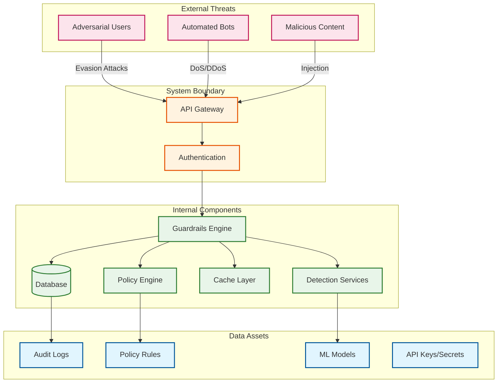
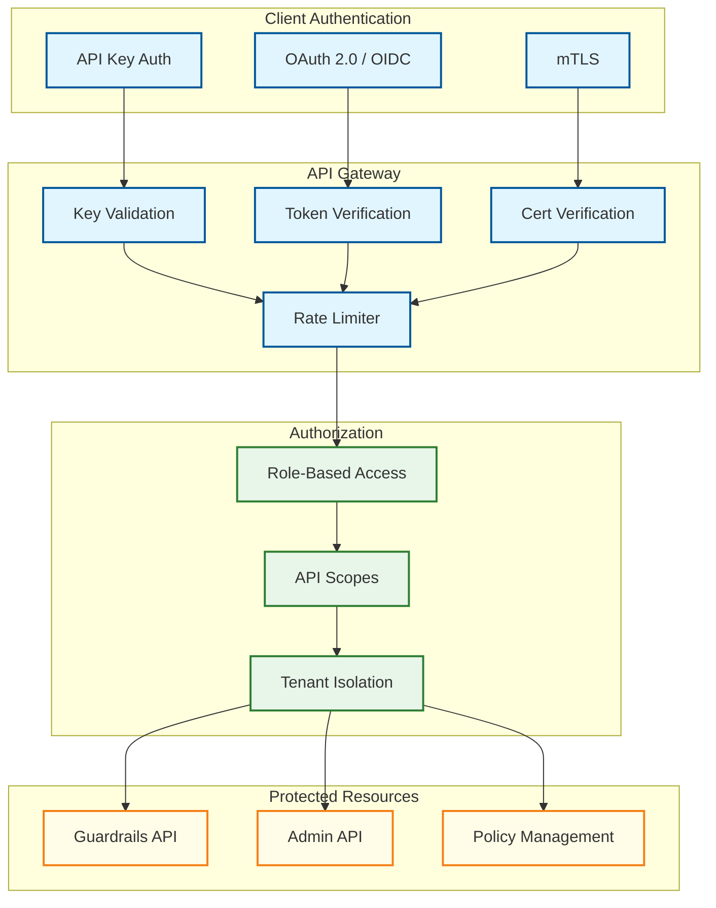
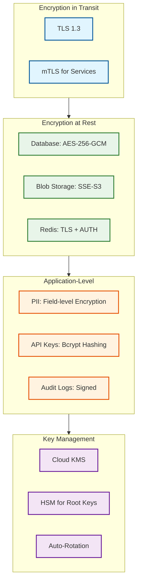
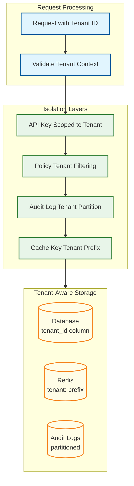
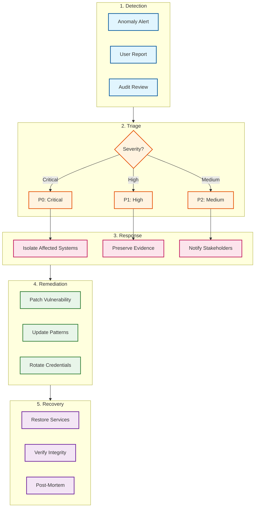

# Security & Compliance

## Threat Model Overview

### Attack Surface Diagram



---

## Threat Matrix

| Threat | Category | Likelihood | Impact | Priority | Mitigation |
|--------|----------|------------|--------|----------|------------|
| **Guardrail Evasion** | Input | High | Critical | P0 | Multi-layer detection, continuous updates |
| **Unicode/Encoding Bypass** | Input | High | High | P0 | Normalization, homoglyph detection |
| **Model Extraction** | Data | Medium | High | P1 | Query rate limiting, anomaly detection |
| **Adversarial Examples** | Input | Medium | High | P1 | Adversarial training, ensemble methods |
| **DDoS on Detection** | Availability | Medium | High | P1 | Rate limiting, circuit breakers, CDN |
| **Policy Manipulation** | Integrity | Low | Critical | P0 | RBAC, audit logging, version control |
| **API Key Compromise** | Access | Medium | High | P1 | Rotation, scoping, anomaly detection |
| **Audit Log Tampering** | Integrity | Low | Critical | P0 | Immutable storage, cryptographic signing |
| **Cross-Tenant Data Leak** | Confidentiality | Low | Critical | P0 | Strict tenant isolation, encryption |
| **Model Poisoning** | Integrity | Low | High | P1 | Signed models, integrity verification |
| **Insider Threat** | Internal | Low | Critical | P1 | Least privilege, audit trails, MFA |

---

## Authentication & Authorization

### Authentication Architecture



### API Key Structure

```python
class APIKeyManager:
    """
    Secure API key management with scoping and rotation.

    Key Format: gr_{tenant_prefix}_{random_32}_{checksum_4}
    Example: gr_acme_a1b2c3d4e5f6g7h8i9j0k1l2m3n4o5p6_x7y8

    Security features:
    - Keys stored as bcrypt hashes
    - Prefix allows quick tenant lookup
    - Checksum prevents typos
    - Short-lived with automatic rotation
    """

    KEY_PREFIX = "gr_"

    def generate_key(self, tenant_id: str, scopes: List[str]) -> APIKey:
        """Generate new API key with scopes."""
        # Generate components
        tenant_prefix = self._get_tenant_prefix(tenant_id)
        random_part = secrets.token_hex(16)
        checksum = self._calculate_checksum(tenant_prefix + random_part)

        # Assemble key
        raw_key = f"{self.KEY_PREFIX}{tenant_prefix}_{random_part}_{checksum}"

        # Store hashed version
        key_hash = bcrypt.hashpw(raw_key.encode(), bcrypt.gensalt())

        api_key = APIKey(
            id=uuid.uuid4(),
            tenant_id=tenant_id,
            key_prefix=f"{self.KEY_PREFIX}{tenant_prefix}_",
            key_hash=key_hash.decode(),
            scopes=scopes,
            created_at=datetime.utcnow(),
            expires_at=datetime.utcnow() + timedelta(days=90),
            last_used_at=None
        )

        self.db.save(api_key)

        # Return raw key (only time it's available)
        return APIKeyResponse(
            key=raw_key,
            id=api_key.id,
            expires_at=api_key.expires_at
        )

    def validate_key(self, raw_key: str) -> Optional[APIKey]:
        """Validate API key and return metadata."""
        # Extract prefix for quick lookup
        if not raw_key.startswith(self.KEY_PREFIX):
            return None

        parts = raw_key.split("_")
        if len(parts) != 4:
            return None

        prefix = f"{parts[0]}_{parts[1]}_"

        # Find candidate keys by prefix
        candidates = self.db.find_by_prefix(prefix)

        for candidate in candidates:
            if bcrypt.checkpw(raw_key.encode(), candidate.key_hash.encode()):
                # Validate not expired
                if candidate.expires_at < datetime.utcnow():
                    return None

                # Update last used
                candidate.last_used_at = datetime.utcnow()
                self.db.update(candidate)

                return candidate

        return None
```

### Role-Based Access Control (RBAC)

| Role | Guardrails API | Policy Read | Policy Write | Admin | Analytics |
|------|---------------|-------------|--------------|-------|-----------|
| **Service** | Full | Read | No | No | No |
| **Developer** | Full | Read | No | No | Read |
| **Policy Admin** | Read | Full | Full | No | Read |
| **Tenant Admin** | Full | Full | Full | Tenant | Full |
| **Platform Admin** | Full | Full | Full | Full | Full |

### Scope-Based Permissions

```yaml
# API Key Scopes
scopes:
  guardrails:check:
    description: "Execute guardrail checks"
    endpoints:
      - POST /v1/guardrails/check

  guardrails:check:streaming:
    description: "Execute streaming guardrail checks"
    endpoints:
      - POST /v1/guardrails/check/stream

  policies:read:
    description: "Read policy configurations"
    endpoints:
      - GET /v1/policies
      - GET /v1/policies/{id}

  policies:write:
    description: "Create and modify policies"
    endpoints:
      - POST /v1/policies
      - PUT /v1/policies/{id}
      - DELETE /v1/policies/{id}

  analytics:read:
    description: "Read analytics and metrics"
    endpoints:
      - GET /v1/analytics/*

  admin:*:
    description: "Full administrative access"
    endpoints:
      - "*"
```

---

## Data Security

### Encryption Architecture



### PII Handling Policy

| Data Type | Storage | Encryption | Retention | Access |
|-----------|---------|------------|-----------|--------|
| **User Prompts** | Audit logs | AES-256-GCM | 90 days | Authorized only |
| **Detected PII** | Hashed only | SHA-256 (one-way) | 90 days | No raw storage |
| **Model Inputs** | Not stored | N/A | Not retained | N/A |
| **API Keys** | Database | Bcrypt hash | Until revoked | System only |
| **Policy Rules** | Database | AES-256 | Versioned | Policy admins |

### Audit Log Integrity

```python
class SecureAuditLogger:
    """
    Tamper-evident audit logging with cryptographic signing.

    Features:
    - Each log entry signed with service key
    - Hash chain links entries (blockchain-lite)
    - Immutable storage (append-only)
    - Cross-region replication
    """

    def __init__(self, signing_key: bytes):
        self.signing_key = signing_key
        self.previous_hash = self._get_latest_hash()

    def log(self, entry: AuditEntry) -> SignedAuditEntry:
        """Create cryptographically signed audit log entry."""
        # Add chain link
        entry.previous_hash = self.previous_hash

        # Create canonical representation
        canonical = self._canonicalize(entry)

        # Sign entry
        signature = hmac.new(
            self.signing_key,
            canonical.encode(),
            hashlib.sha256
        ).hexdigest()

        # Calculate entry hash for chain
        entry_hash = hashlib.sha256(
            (canonical + signature).encode()
        ).hexdigest()

        signed_entry = SignedAuditEntry(
            **entry.__dict__,
            signature=signature,
            entry_hash=entry_hash
        )

        # Update chain
        self.previous_hash = entry_hash

        # Write to immutable storage
        self._write_immutable(signed_entry)

        return signed_entry

    def verify_chain(self, entries: List[SignedAuditEntry]) -> bool:
        """Verify integrity of audit log chain."""
        for i, entry in enumerate(entries):
            # Verify signature
            canonical = self._canonicalize(entry)
            expected_sig = hmac.new(
                self.signing_key,
                canonical.encode(),
                hashlib.sha256
            ).hexdigest()

            if entry.signature != expected_sig:
                return False

            # Verify chain link
            if i > 0:
                if entry.previous_hash != entries[i-1].entry_hash:
                    return False

        return True
```

---

## Tenant Isolation

### Isolation Architecture



### Tenant Context Enforcement

```python
class TenantContext:
    """
    Enforce tenant isolation at all data access points.

    Every database query and cache operation automatically
    filters by tenant_id to prevent cross-tenant data access.
    """

    _current = contextvars.ContextVar('tenant_context')

    @classmethod
    def set(cls, tenant_id: str):
        """Set tenant context for current request."""
        cls._current.set(tenant_id)

    @classmethod
    def get(cls) -> str:
        """Get current tenant ID (raises if not set)."""
        tenant_id = cls._current.get(None)
        if tenant_id is None:
            raise SecurityError("Tenant context not set")
        return tenant_id

    @classmethod
    def require(cls, expected_tenant: str):
        """Verify current context matches expected tenant."""
        actual = cls.get()
        if actual != expected_tenant:
            raise SecurityError(f"Tenant mismatch: {actual} != {expected_tenant}")


class TenantAwareRepository:
    """Base repository with automatic tenant filtering."""

    def __init__(self, db: Database):
        self.db = db

    def find_all(self, **filters) -> List[Model]:
        """Find all records for current tenant."""
        tenant_id = TenantContext.get()
        return self.db.query(
            self.model_class,
            tenant_id=tenant_id,
            **filters
        )

    def find_by_id(self, id: str) -> Optional[Model]:
        """Find by ID, ensuring tenant ownership."""
        tenant_id = TenantContext.get()
        record = self.db.get(self.model_class, id)

        if record and record.tenant_id != tenant_id:
            # Log potential breach attempt
            self._log_access_violation(id, tenant_id)
            return None

        return record

    def create(self, data: Dict) -> Model:
        """Create record with tenant context."""
        tenant_id = TenantContext.get()
        data['tenant_id'] = tenant_id
        return self.db.insert(self.model_class, data)
```

---

## Compliance Requirements

### Regulatory Framework Mapping

| Regulation | Requirement | Implementation |
|------------|-------------|----------------|
| **SOC 2 Type II** | Audit logging | Immutable, signed audit logs |
| **SOC 2 Type II** | Access control | RBAC, MFA, least privilege |
| **SOC 2 Type II** | Encryption | TLS 1.3, AES-256-GCM |
| **GDPR** | Right to erasure | PII not stored (only hashes) |
| **GDPR** | Data minimization | Minimal logging, retention limits |
| **GDPR** | Right to explanation | Explainable blocking decisions |
| **HIPAA** | PHI protection | No PHI stored, PII redaction |
| **HIPAA** | Audit controls | Complete audit trail |
| **PCI-DSS** | Card data protection | Credit card detection and masking |
| **EU AI Act** | High-risk AI transparency | Explainable decisions, human oversight |
| **EU AI Act** | Fundamental rights | Bias monitoring, appeal process |

### GDPR Right to Explanation

```python
class ExplainableGuardrails:
    """
    Provide explanations for guardrail decisions (GDPR compliance).
    """

    def generate_explanation(
        self,
        detection_results: List[DetectionResult],
        policy_results: List[PolicyResult]
    ) -> Explanation:
        """
        Generate human-readable explanation for blocking decision.
        """
        reasons = []

        for result in detection_results:
            if result.verdict == "blocked":
                reasons.append(
                    self._format_detection_reason(result)
                )

        for result in policy_results:
            if result.verdict == "block":
                reasons.append(
                    self._format_policy_reason(result)
                )

        return Explanation(
            summary=self._summarize(reasons),
            detailed_reasons=reasons,
            appeal_instructions=self._get_appeal_instructions(),
            data_subject_rights=self._get_dsr_info()
        )

    def _format_detection_reason(self, result: DetectionResult) -> str:
        """Format detection result into explanation."""
        templates = {
            "injection": "Your message contained patterns that could "
                        "potentially manipulate the AI system.",
            "pii": f"Your message contained personal information "
                  f"({result.details.get('entity_types', [])}) that we "
                  f"protect for privacy reasons.",
            "moderation": "Your message contained content that violates "
                         "our content policies.",
        }
        return templates.get(result.detector_type, "Content policy violation.")
```

### EU AI Act Compliance

```yaml
# High-Risk AI System Requirements (EU AI Act)
ai_act_compliance:
  risk_management:
    - Continuous risk assessment
    - Attack vector monitoring
    - False positive/negative tracking

  data_governance:
    - Training data documentation
    - Bias testing records
    - Model versioning and lineage

  technical_documentation:
    - System architecture docs
    - Algorithm explanations
    - Performance benchmarks

  transparency:
    - User notification of AI involvement
    - Explanation of decisions
    - Appeal process documentation

  human_oversight:
    - Manual review for blocked requests
    - Override capabilities for admins
    - Escalation procedures

  accuracy_robustness:
    - Regular accuracy testing
    - Adversarial robustness testing
    - Continuous monitoring

  logging_requirements:
    - All decisions logged
    - Audit trail for compliance
    - Incident response procedures
```

---

## Security Testing

### Penetration Testing Scope

| Area | Test Type | Frequency |
|------|-----------|-----------|
| **API Security** | OWASP API Top 10 | Quarterly |
| **Evasion Testing** | Adversarial attacks | Monthly |
| **Authentication** | Credential testing | Quarterly |
| **Injection** | SQL, NoSQL, LDAP | Quarterly |
| **Model Security** | Extraction, poisoning | Annually |
| **Infrastructure** | Network, container | Quarterly |

### Adversarial Testing Framework

```python
class AdversarialTestSuite:
    """
    Automated adversarial testing for guardrails.

    Tests guardrail robustness against known attack techniques.
    """

    def __init__(self, guardrails_client: GuardrailsClient):
        self.client = guardrails_client
        self.attack_corpus = self._load_attack_corpus()

    async def run_evasion_tests(self) -> TestReport:
        """Test resistance to evasion attacks."""
        results = []

        for attack in self.attack_corpus:
            # Test original attack
            original_result = await self.client.check(attack.payload)

            # Test variations
            for variant in self._generate_variants(attack):
                variant_result = await self.client.check(variant)
                results.append(TestResult(
                    attack_id=attack.id,
                    attack_type=attack.type,
                    variant=variant,
                    detected=variant_result.verdict == "block",
                    confidence=variant_result.confidence
                ))

        return self._generate_report(results)

    def _generate_variants(self, attack: Attack) -> List[str]:
        """Generate evasion variants of attack payload."""
        variants = []

        # Unicode homoglyphs
        variants.append(self._apply_homoglyphs(attack.payload))

        # Base64 encoding
        variants.append(self._base64_encode(attack.payload))

        # Whitespace injection
        variants.append(self._inject_whitespace(attack.payload))

        # Language translation (if applicable)
        if attack.translatable:
            variants.extend(self._translate_variants(attack.payload))

        return variants
```

---

## Incident Response

### Security Incident Playbook



### Incident Severity Levels

| Severity | Criteria | Response Time | Escalation |
|----------|----------|---------------|------------|
| **P0 Critical** | Data breach, complete bypass | 15 min | CEO, Legal, Security |
| **P1 High** | Partial bypass, elevated risk | 1 hour | VP Engineering, Security |
| **P2 Medium** | Localized issue, workaround exists | 4 hours | Engineering Lead |
| **P3 Low** | Minor issue, no security impact | 24 hours | On-call engineer |
