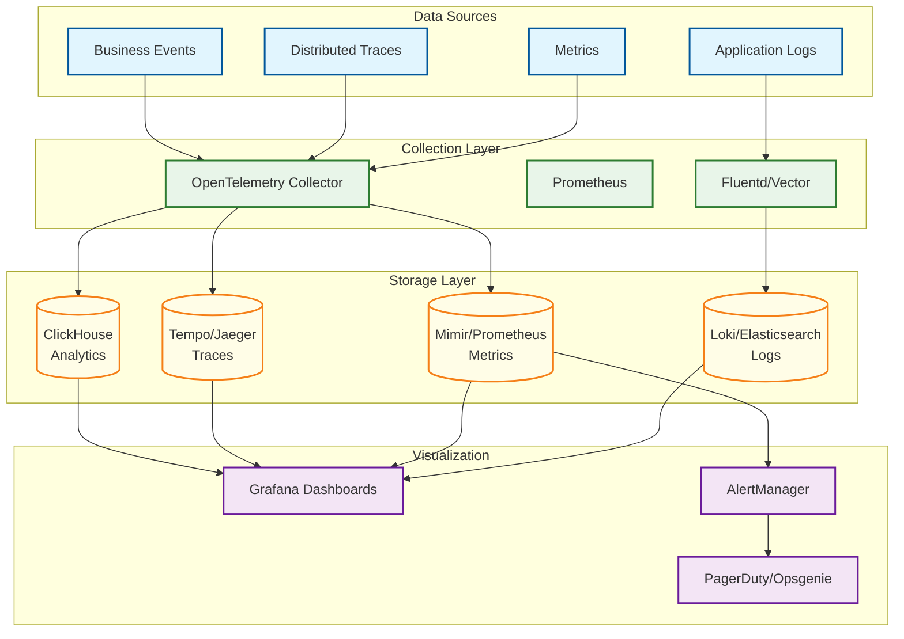
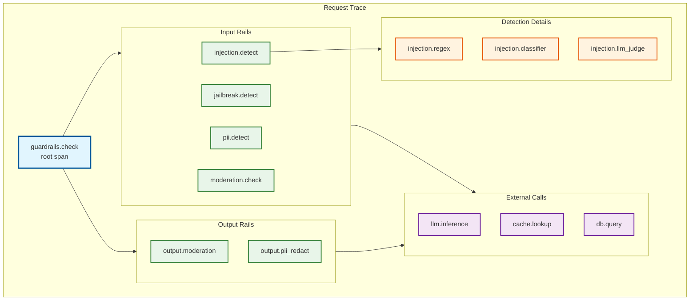

# Observability

## Observability Architecture



---

## Key Metrics

### Request Metrics

```yaml
# Total requests by detector and verdict
guardrails_requests_total:
  type: counter
  labels:
    - tenant_id
    - rail_type     # input, dialog, retrieval, execution, output
    - detector      # injection, jailbreak, pii, moderation, topic
    - verdict       # pass, block, warn
  description: Total guardrail requests processed

# Request latency histogram
guardrails_request_latency_seconds:
  type: histogram
  labels:
    - tenant_id
    - rail_type
    - detector
  buckets: [0.001, 0.005, 0.01, 0.025, 0.05, 0.1, 0.25, 0.5, 1.0]
  description: Guardrail check latency in seconds

# Active requests gauge
guardrails_active_requests:
  type: gauge
  labels:
    - tenant_id
    - rail_type
  description: Currently processing requests
```

### Detection Metrics

```yaml
# Detection confidence distribution
guardrails_detection_confidence:
  type: histogram
  labels:
    - detector
    - verdict
  buckets: [0.1, 0.2, 0.3, 0.4, 0.5, 0.6, 0.7, 0.8, 0.9, 0.95, 0.99]
  description: Confidence score distribution

# Detection stage breakdown
guardrails_detection_stage_latency_seconds:
  type: histogram
  labels:
    - detector
    - stage       # regex, classifier, llm_judge
  buckets: [0.0001, 0.001, 0.005, 0.01, 0.05, 0.1, 0.5]
  description: Latency by detection stage

# PII entities detected
guardrails_pii_entities_total:
  type: counter
  labels:
    - entity_type  # email, ssn, credit_card, phone, name
    - action       # masked, blocked, logged
  description: PII entities detected and actions taken

# Policy evaluations
guardrails_policy_evaluations_total:
  type: counter
  labels:
    - policy_id
    - rule_id
    - matched    # true, false
  description: Policy rule evaluations
```

### System Health Metrics

```yaml
# Cache performance
guardrails_cache_operations_total:
  type: counter
  labels:
    - cache_tier   # l1, l2
    - operation    # hit, miss, evict
    - cache_type   # embedding, detection, policy
  description: Cache operations by tier and type

# Model inference
guardrails_model_inference_seconds:
  type: histogram
  labels:
    - model_name
    - model_version
  buckets: [0.001, 0.005, 0.01, 0.025, 0.05, 0.1, 0.25]
  description: ML model inference latency

# Circuit breaker state
guardrails_circuit_breaker_state:
  type: gauge
  labels:
    - service
  values: # 0=closed, 1=half_open, 2=open
  description: Circuit breaker state

# Queue depths
guardrails_queue_depth:
  type: gauge
  labels:
    - queue_name   # audit_log, detection, policy_update
  description: Current queue depth
```

### Business Metrics

```yaml
# False positive rate (requires labeled data)
guardrails_false_positive_rate:
  type: gauge
  labels:
    - detector
  description: Estimated false positive rate (rolling 24h)

# Attack detection rate
guardrails_attacks_detected_total:
  type: counter
  labels:
    - attack_type
    - severity
  description: Confirmed attacks detected

# User feedback
guardrails_user_feedback_total:
  type: counter
  labels:
    - feedback_type  # false_positive, false_negative, correct
    - detector
  description: User feedback on detection accuracy
```

---

## Distributed Tracing

### Trace Span Hierarchy



### Trace Instrumentation

```python
from opentelemetry import trace
from opentelemetry.trace import Status, StatusCode

tracer = trace.get_tracer("guardrails")

class TracedGuardrails:
    """
    Guardrails with comprehensive distributed tracing.
    """

    async def check(self, request: GuardrailRequest) -> GuardrailResponse:
        with tracer.start_as_current_span(
            "guardrails.check",
            attributes={
                "tenant_id": request.tenant_id,
                "message_count": len(request.messages),
                "rails_enabled": ",".join(request.config.rails_enabled),
            }
        ) as span:
            try:
                # Input rails
                input_result = await self._run_input_rails(request)
                span.set_attribute("input_rails.verdict", input_result.verdict)

                if input_result.verdict == "block":
                    span.set_attribute("blocked_by", "input_rails")
                    return self._create_blocked_response(input_result)

                # Continue with other rails...
                response = await self._process_full_pipeline(request)

                span.set_attribute("final_verdict", response.verdict)
                span.set_attribute("total_latency_ms", response.latency_ms)

                return response

            except Exception as e:
                span.set_status(Status(StatusCode.ERROR, str(e)))
                span.record_exception(e)
                raise

    async def _detect_injection(self, text: str) -> DetectionResult:
        with tracer.start_as_current_span(
            "injection.detect",
            attributes={"text_length": len(text)}
        ) as span:
            # Stage 1: Regex
            with tracer.start_as_current_span("injection.regex") as regex_span:
                regex_result = self._regex_check(text)
                regex_span.set_attribute("matched", regex_result.matched)

                if regex_result.confidence > 0.95:
                    span.set_attribute("stage", "regex")
                    return regex_result

            # Stage 2: Classifier
            with tracer.start_as_current_span("injection.classifier") as clf_span:
                clf_result = await self._classifier_check(text)
                clf_span.set_attribute("confidence", clf_result.confidence)

                if clf_result.confidence > self.config.threshold:
                    span.set_attribute("stage", "classifier")
                    return clf_result

            # Stage 3: LLM Judge (if enabled)
            if self.config.use_llm_judge:
                with tracer.start_as_current_span("injection.llm_judge") as llm_span:
                    llm_result = await self._llm_judge_check(text)
                    llm_span.set_attribute("verdict", llm_result.verdict)
                    span.set_attribute("stage", "llm_judge")
                    return llm_result

            span.set_attribute("stage", "classifier")
            return clf_result
```

### Trace Attributes

| Span | Key Attributes | Purpose |
|------|---------------|---------|
| `guardrails.check` | tenant_id, message_count, rails_enabled, final_verdict | Root span for request |
| `injection.detect` | text_length, stage, verdict, confidence | Injection detection |
| `injection.classifier` | model_name, inference_time_ms, confidence | ML classifier |
| `injection.llm_judge` | model, prompt_tokens, completion_tokens | LLM analysis |
| `pii.detect` | entities_found, entity_types, action | PII detection |
| `policy.evaluate` | policies_checked, rules_matched, verdict | Policy evaluation |
| `cache.lookup` | cache_tier, cache_type, hit | Cache operations |

---

## Logging

### Log Structure

```json
{
  "timestamp": "2026-01-27T10:30:00.123Z",
  "level": "INFO",
  "service": "guardrails-api",
  "trace_id": "abc123def456",
  "span_id": "789ghi",
  "tenant_id": "tenant_acme",
  "request_id": "req_abc123",

  "event": "guardrail_check_complete",

  "data": {
    "verdict": "pass",
    "confidence": 0.95,
    "latency_ms": 42,
    "rails_executed": ["input", "output"],
    "detectors": {
      "injection": {"verdict": "safe", "confidence": 0.98, "stage": "classifier"},
      "pii": {"verdict": "safe", "entities_found": 0}
    },
    "cache_hits": {"l1": 2, "l2": 1, "miss": 1}
  },

  "context": {
    "user_agent": "guardrails-sdk/1.0",
    "ip": "10.0.0.1",
    "region": "us-east-1"
  }
}
```

### Log Levels

| Level | Usage | Examples |
|-------|-------|----------|
| **ERROR** | System failures requiring attention | DB connection failure, model load error |
| **WARN** | Degraded operation, potential issues | High latency, cache miss spike, approaching limits |
| **INFO** | Normal operations, audit trail | Request complete, policy updated, model reloaded |
| **DEBUG** | Detailed troubleshooting | Detection stage details, cache operations |

### Sensitive Data Handling

```python
class SecureLogger:
    """
    Logger with automatic PII redaction and audit compliance.
    """

    # Fields to never log
    REDACT_FIELDS = [
        "api_key", "password", "secret", "token",
        "ssn", "credit_card", "bank_account"
    ]

    # Fields to hash (for correlation without exposure)
    HASH_FIELDS = ["user_id", "email", "ip"]

    def log(self, level: str, event: str, **data):
        """Log event with automatic redaction."""
        sanitized = self._sanitize(data)

        log_entry = {
            "timestamp": datetime.utcnow().isoformat(),
            "level": level,
            "service": self.service_name,
            "trace_id": get_current_trace_id(),
            "event": event,
            "data": sanitized
        }

        self._write(log_entry)

    def _sanitize(self, data: Dict) -> Dict:
        """Recursively sanitize sensitive fields."""
        result = {}

        for key, value in data.items():
            if key.lower() in self.REDACT_FIELDS:
                result[key] = "[REDACTED]"
            elif key.lower() in self.HASH_FIELDS:
                result[key] = self._hash(str(value))
            elif isinstance(value, dict):
                result[key] = self._sanitize(value)
            else:
                result[key] = value

        return result

    def _hash(self, value: str) -> str:
        """One-way hash for correlation."""
        return hashlib.sha256(value.encode()).hexdigest()[:12]
```

---

## Alerting

### Alert Rules

```yaml
groups:
  - name: guardrails_critical
    rules:
      # High error rate
      - alert: GuardrailsHighErrorRate
        expr: |
          sum(rate(guardrails_requests_total{verdict="error"}[5m]))
          / sum(rate(guardrails_requests_total[5m])) > 0.01
        for: 2m
        labels:
          severity: critical
        annotations:
          summary: "Guardrails error rate > 1%"
          description: "Error rate is {{ $value | humanizePercentage }}"

      # Latency degradation
      - alert: GuardrailsHighLatency
        expr: |
          histogram_quantile(0.99, rate(guardrails_request_latency_seconds_bucket[5m])) > 0.2
        for: 5m
        labels:
          severity: critical
        annotations:
          summary: "Guardrails p99 latency > 200ms"
          description: "p99 latency is {{ $value | humanizeDuration }}"

      # Detection service down
      - alert: GuardrailsDetectorDown
        expr: |
          up{job="guardrails-classifier"} == 0
        for: 1m
        labels:
          severity: critical
        annotations:
          summary: "Classifier service is down"

  - name: guardrails_warning
    rules:
      # Elevated false positive rate
      - alert: GuardrailsHighFalsePositives
        expr: |
          guardrails_false_positive_rate > 0.02
        for: 15m
        labels:
          severity: warning
        annotations:
          summary: "False positive rate > 2%"

      # Cache hit rate drop
      - alert: GuardrailsCacheMissHigh
        expr: |
          sum(rate(guardrails_cache_operations_total{operation="miss"}[5m]))
          / sum(rate(guardrails_cache_operations_total[5m])) > 0.3
        for: 10m
        labels:
          severity: warning
        annotations:
          summary: "Cache miss rate > 30%"

      # Unusual block rate spike
      - alert: GuardrailsBlockRateSpike
        expr: |
          rate(guardrails_requests_total{verdict="block"}[5m])
          / rate(guardrails_requests_total{verdict="block"}[1h] offset 1d) > 3
        for: 10m
        labels:
          severity: warning
        annotations:
          summary: "Block rate 3x higher than yesterday"

  - name: guardrails_business
    rules:
      # Potential attack campaign
      - alert: GuardrailsAttackCampaign
        expr: |
          sum(rate(guardrails_attacks_detected_total[5m])) > 100
        for: 5m
        labels:
          severity: warning
        annotations:
          summary: "Elevated attack detection rate"

      # Model accuracy degradation
      - alert: GuardrailsAccuracyDrop
        expr: |
          guardrails_detection_accuracy < 0.92
        for: 30m
        labels:
          severity: warning
        annotations:
          summary: "Detection accuracy below 92%"
```

### Alert Severity Mapping

| Severity | Response Time | Notification | Escalation |
|----------|---------------|--------------|------------|
| **Critical** | Immediate | Page on-call | Auto-escalate after 15 min |
| **Warning** | 1 hour | Slack channel | Manual escalation |
| **Info** | Next business day | Email digest | N/A |

---

## Dashboards

### Executive Dashboard

```yaml
dashboard: guardrails_executive
panels:
  - title: "Safety Overview"
    type: stat
    metrics:
      - name: "Requests Protected"
        query: "sum(increase(guardrails_requests_total[24h]))"
      - name: "Attacks Blocked"
        query: "sum(increase(guardrails_requests_total{verdict='block'}[24h]))"
      - name: "False Positive Rate"
        query: "guardrails_false_positive_rate"
      - name: "Availability"
        query: "avg_over_time(up{job='guardrails'}[24h])"

  - title: "Detection by Type (24h)"
    type: pie
    query: "sum by (detector) (increase(guardrails_requests_total{verdict='block'}[24h]))"

  - title: "Trend: Attacks Detected"
    type: timeseries
    query: "sum(rate(guardrails_requests_total{verdict='block'}[1h])) by (detector)"
    range: 7d
```

### Operations Dashboard

```yaml
dashboard: guardrails_operations
panels:
  - title: "Request Rate"
    type: timeseries
    queries:
      - "sum(rate(guardrails_requests_total[1m]))"
      - "sum(rate(guardrails_requests_total{verdict='block'}[1m]))"

  - title: "Latency Distribution"
    type: heatmap
    query: "sum(rate(guardrails_request_latency_seconds_bucket[5m])) by (le)"

  - title: "Latency Percentiles"
    type: timeseries
    queries:
      - label: "p50"
        query: "histogram_quantile(0.50, rate(guardrails_request_latency_seconds_bucket[5m]))"
      - label: "p95"
        query: "histogram_quantile(0.95, rate(guardrails_request_latency_seconds_bucket[5m]))"
      - label: "p99"
        query: "histogram_quantile(0.99, rate(guardrails_request_latency_seconds_bucket[5m]))"

  - title: "Cache Performance"
    type: timeseries
    queries:
      - label: "L1 Hit Rate"
        query: "sum(rate(guardrails_cache_operations_total{cache_tier='l1',operation='hit'}[5m])) / sum(rate(guardrails_cache_operations_total{cache_tier='l1'}[5m]))"
      - label: "L2 Hit Rate"
        query: "sum(rate(guardrails_cache_operations_total{cache_tier='l2',operation='hit'}[5m])) / sum(rate(guardrails_cache_operations_total{cache_tier='l2'}[5m]))"

  - title: "Error Rate by Component"
    type: timeseries
    query: "sum(rate(guardrails_requests_total{verdict='error'}[5m])) by (rail_type)"

  - title: "Circuit Breaker Status"
    type: stat
    query: "guardrails_circuit_breaker_state"
    thresholds:
      - value: 0
        color: green
        text: "Closed"
      - value: 1
        color: yellow
        text: "Half-Open"
      - value: 2
        color: red
        text: "Open"
```

### Detection Analytics Dashboard

```yaml
dashboard: guardrails_detection_analytics
panels:
  - title: "Detection Confidence Distribution"
    type: histogram
    query: "guardrails_detection_confidence_bucket"
    by: detector

  - title: "Detection Stage Breakdown"
    type: stacked_bar
    query: "sum by (stage) (increase(guardrails_detection_stage_latency_seconds_count[1h]))"

  - title: "PII Entities by Type"
    type: timeseries
    query: "sum(rate(guardrails_pii_entities_total[5m])) by (entity_type)"

  - title: "Attack Types Detected"
    type: pie
    query: "sum by (attack_type) (increase(guardrails_attacks_detected_total[24h]))"

  - title: "False Positive Trend"
    type: timeseries
    queries:
      - label: "Reported FPs"
        query: "sum(rate(guardrails_user_feedback_total{feedback_type='false_positive'}[1h]))"
      - label: "Estimated FP Rate"
        query: "guardrails_false_positive_rate"

  - title: "Policy Rule Matches"
    type: table
    query: "topk(10, sum by (policy_id, rule_id) (increase(guardrails_policy_evaluations_total{matched='true'}[24h])))"
```

---

## Runbooks

### High Latency Runbook

```markdown
# Runbook: High Guardrails Latency

## Symptoms
- Alert: GuardrailsHighLatency
- p99 latency > 200ms

## Diagnosis Steps

1. **Check detection stage breakdown**
   ```promql
   histogram_quantile(0.99, rate(guardrails_detection_stage_latency_seconds_bucket[5m])) by (stage)
   ```
   - If `llm_judge` is high: Check LLM provider status
   - If `classifier` is high: Check ML service health

2. **Check cache hit rates**
   ```promql
   sum(rate(guardrails_cache_operations_total{operation="miss"}[5m])) by (cache_tier)
   ```
   - If L1 miss high: Check memory pressure
   - If L2 miss high: Check Redis cluster

3. **Check queue depths**
   ```promql
   guardrails_queue_depth
   ```
   - If audit_log queue backing up: Scale ClickHouse writers

## Mitigation Steps

1. **Short-term**: Enable degraded mode (skip LLM-judge)
   ```bash
   kubectl set env deployment/guardrails-api DEGRADATION_LEVEL=1
   ```

2. **Scale detection services**
   ```bash
   kubectl scale deployment/guardrails-classifier --replicas=5
   ```

3. **Increase cache TTL temporarily**
   ```bash
   redis-cli CONFIG SET maxmemory-policy allkeys-lru
   ```

## Resolution
- [ ] Identify root cause
- [ ] Apply fix
- [ ] Verify latency normalized
- [ ] Document in post-mortem
```

### False Positive Spike Runbook

```markdown
# Runbook: False Positive Rate Spike

## Symptoms
- Alert: GuardrailsHighFalsePositives
- User complaints about blocked legitimate requests

## Diagnosis Steps

1. **Identify affected detector**
   ```promql
   guardrails_false_positive_rate by (detector)
   ```

2. **Check for recent changes**
   - Pattern database updates
   - Model deployments
   - Policy changes

3. **Sample blocked requests**
   ```sql
   SELECT request_summary, detector, confidence
   FROM audit_logs
   WHERE verdict = 'block'
     AND created_at > NOW() - INTERVAL 1 HOUR
   ORDER BY RANDOM()
   LIMIT 100
   ```

## Mitigation Steps

1. **Raise detection threshold temporarily**
   ```yaml
   config:
     detectors:
       injection:
         threshold: 0.9  # Was 0.8
   ```

2. **Rollback recent model/pattern update**
   ```bash
   kubectl rollout undo deployment/guardrails-classifier
   ```

3. **Enable manual review for borderline**
   ```yaml
   config:
     borderline_action: "warn"  # Instead of "block"
   ```

## Resolution
- [ ] Review FP samples
- [ ] Adjust detection rules/models
- [ ] Verify FP rate normalized
- [ ] Document and improve patterns
```
