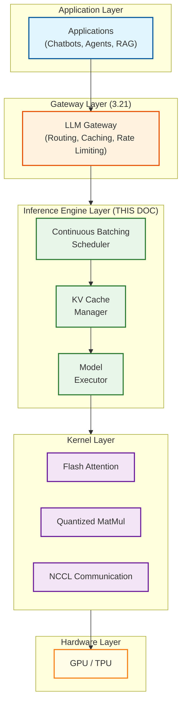
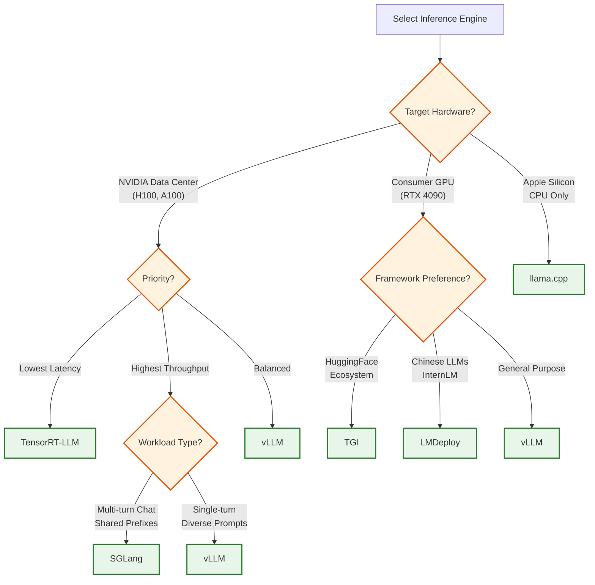

# LLM Inference Engine

## Overview

An **LLM Inference Engine** is the core runtime component that executes large language model inference on GPU hardware. It sits between the serving infrastructure (API gateways, load balancers) and the low-level GPU kernels (Flash Attention, CUDA/Tensor Cores), responsible for **scheduling requests**, **managing KV cache memory**, and **orchestrating model execution** to maximize throughput while meeting latency SLOs.

**Key Differentiator from 3.13 (LLM Training & Inference Architecture):** This document focuses DEEPLY on inference engine internals—how schedulers make iteration-level decisions, how PagedAttention allocates memory blocks, and how speculative decoding verifies draft tokens. The 3.13 document covers high-level training/inference concepts; this document provides implementation-level detail for building or understanding production inference engines.

**Key Differentiator from 3.21 (LLM Gateway):** The Gateway layer handles routing, caching, rate limiting, and multi-provider abstraction ABOVE the inference engine. This document covers what happens INSIDE a single inference engine instance.

---

## System Stack Positioning



---

## Quick Navigation

| Document | Description |
|----------|-------------|
| [01 - Requirements & Estimations](./01-requirements-and-estimations.md) | Functional/non-functional requirements, capacity planning, memory math |
| [02 - High-Level Design](./02-high-level-design.md) | Architecture diagrams, data flow, framework-specific designs |
| [03 - Low-Level Design](./03-low-level-design.md) | Data structures, algorithms (pseudocode), API specifications |
| [04 - Deep Dive & Bottlenecks](./04-deep-dive-and-bottlenecks.md) | PagedAttention internals, disaggregated serving, speculative decoding |
| [05 - Scalability & Reliability](./05-scalability-and-reliability.md) | Scaling strategies, tensor parallelism, fault tolerance |
| [06 - Security & Compliance](./06-security-and-compliance.md) | Memory isolation, weight protection, DoS prevention |
| [07 - Observability](./07-observability.md) | Metrics, tracing, debugging, alerting |
| [08 - Interview Guide](./08-interview-guide.md) | 45-minute pacing, trap questions, key numbers |

---

## Complexity Rating

| Component | Rating | Justification |
|-----------|--------|---------------|
| **Overall** | **Very High** | Combines OS-style memory management, GPU kernel optimization, and real-time scheduling |
| PagedAttention Memory Manager | Very High | Non-contiguous allocation with copy-on-write, reference counting |
| Continuous Batching Scheduler | High | Iteration-level decisions, preemption, priority queues |
| Speculative Decoding | High | Probability matching, draft-verify pipeline, variable acceptance |
| Prefix Caching (RadixAttention) | High | Hash-based matching, reference counting, eviction policies |
| Quantization Pipeline | Medium-High | Calibration, per-channel scaling, kernel integration |
| Multi-GPU Coordination | High | Tensor/pipeline parallelism, NCCL synchronization |
| CUDA Graph Optimization | Medium | Graph capture, fixed batch sizes, fallback logic |

---

## Framework Comparison Matrix (2025-2026)

| Framework | Developer | Primary Innovation | Language | Best For |
|-----------|-----------|-------------------|----------|----------|
| **vLLM** | UC Berkeley / vLLM Team | PagedAttention, Continuous Batching | Python + CUDA | High-throughput serving, general purpose |
| **TensorRT-LLM** | NVIDIA | TensorRT optimization, FP8/FP4 | C++ + Python | Lowest latency on NVIDIA hardware |
| **SGLang** | UC Berkeley | RadixAttention, Zero-overhead scheduler | Python + CUDA | Multi-turn conversations, shared prefixes |
| **TGI** | HuggingFace | Flash-decoding, Rust HTTP layer | Rust + Python | HuggingFace ecosystem integration |
| **LMDeploy** | InternLM / SenseTime | TurboMind engine, persistent batch | Python + CUDA | InternLM models, Chinese LLM ecosystem |
| **llama.cpp** | ggml-org | GGUF format, CPU/Metal support | C++ | Edge deployment, consumer hardware |

### Performance Benchmarks (H100 80GB, Llama-2 70B INT8)

| Framework | Throughput (tokens/s) | TTFT (1K prompt) | TPS/request | Memory Efficiency |
|-----------|----------------------|------------------|-------------|-------------------|
| vLLM 0.8+ | 52,000 | 95ms | 68 | 94% block utilization |
| TensorRT-LLM | 58,000 | 82ms | 72 | 91% (static allocation) |
| SGLang | 55,000 | 88ms | 70 | 96% (radix caching) |
| TGI v3.0 | 48,000 | 110ms | 62 | 90% |
| LMDeploy | 50,000 | 92ms | 65 | 93% |

*Benchmarks vary based on workload characteristics. Numbers represent typical high-throughput scenarios.*

---

## Core Concepts

### Why LLM Inference is Memory-Bound (Not Compute-Bound)

```
Decode Phase Analysis (70B model, batch=1):
─────────────────────────────────────────────
Model weights to read:    70 GB (INT8)
Compute operations:       ~140 GFLOPs (2 * 70B)
H100 memory bandwidth:    3.35 TB/s
H100 FP8 compute:         1,979 TFLOPS

Memory time: 70 GB / 3.35 TB/s = 21ms
Compute time: 140 GFLOPs / 1979 TFLOPS = 0.07ms

Ratio: Memory-bound by ~300x

→ Optimization focus: Increase batch size to amortize weight reads
→ With batch=8: Same 21ms produces 8 tokens = 380 TPS
```

### Key Innovation: PagedAttention

Traditional KV cache allocates contiguous memory for maximum sequence length:
- 4K max context → 4K tokens allocated per request
- 500 avg context → 87.5% memory waste

PagedAttention (vLLM) uses OS-style paging:
- Fixed-size blocks (16 tokens each)
- Allocate on demand as tokens generate
- Near-zero waste (<5% fragmentation)
- Result: **4-10x more concurrent requests**

### Key Innovation: Continuous Batching

Static batching waits for all requests in batch to complete:
- Problem 1: Short sequences wait for long sequences (head-of-line blocking)
- Problem 2: Padding waste for variable-length sequences

Continuous batching operates at iteration level:
- Every decode step: remove finished sequences, add waiting sequences
- No padding, no blocking
- Result: **2-3x throughput improvement**

---

## System Characteristics

| Characteristic | Value | Notes |
|----------------|-------|-------|
| **Traffic Pattern** | Bursty, variable sequence lengths | Enterprise: predictable; Consumer: highly variable |
| **Primary Bottleneck** | GPU memory bandwidth | Decode phase is memory-bound |
| **Secondary Bottleneck** | GPU compute | Prefill phase is compute-bound |
| **Latency Target (TTFT)** | < 200ms p99 | Time to first token |
| **Latency Target (TPS)** | > 50 tokens/sec | Per-request generation speed |
| **Consistency Model** | N/A (stateless) | Each request independent |
| **Availability Target** | 99.9% | Request success rate |
| **Memory Pattern** | Dynamic allocation (PagedAttention) | Block-based KV cache |
| **Scale Unit** | GPU instances | TP for large models, DP for throughput |

---

## When to Use Each Framework



### Decision Matrix

| Scenario | Recommended | Reason |
|----------|-------------|--------|
| Lowest possible latency on NVIDIA | TensorRT-LLM | TensorRT compiler optimizations, FP8 |
| Maximum throughput, general workload | vLLM | PagedAttention, continuous batching |
| Multi-turn chat, RAG with long system prompts | SGLang | RadixAttention prefix caching |
| HuggingFace model, quick deployment | TGI | Native HF integration, Docker images |
| Edge deployment, MacBook, mobile | llama.cpp | GGUF quantization, Metal support |
| Disaggregated prefill/decode | SGLang or NVIDIA Dynamo | First-class P/D disaggregation support |

---

## Key Numbers Reference Card

```
┌─────────────────────────────────────────────────────────────────────┐
│           LLM INFERENCE ENGINE - KEY NUMBERS                        │
├─────────────────────────────────────────────────────────────────────┤
│                                                                     │
│  MEMORY REQUIREMENTS                                                │
│  ───────────────────                                                │
│  Model weights (70B FP16):     140 GB                               │
│  Model weights (70B INT8):      70 GB                               │
│  Model weights (70B INT4):      35 GB                               │
│                                                                     │
│  KV CACHE PER TOKEN                                                 │
│  ──────────────────                                                 │
│  Formula: 2 × layers × kv_heads × head_dim × 2 bytes                │
│  Llama-2 70B: 2 × 80 × 8 × 128 × 2 = 327,680 bytes ≈ 320 KB        │
│  Llama-3 405B: ~1.2 MB per token                                    │
│                                                                     │
│  BLOCK SIZE                                                         │
│  ──────────────                                                     │
│  vLLM default:     16 tokens per block                              │
│  TensorRT-LLM:     Variable (power of 2)                            │
│  SGLang:           16 tokens (radix tree aligned)                   │
│                                                                     │
│  PERFORMANCE TARGETS                                                │
│  ───────────────────                                                │
│  TTFT (p99):           < 200ms                                      │
│  TPS per request:      > 50 tokens/sec                              │
│  Throughput (70B H100): 50,000+ tokens/sec                          │
│                                                                     │
│  OPTIMIZATION FACTORS                                               │
│  ────────────────────                                               │
│  PagedAttention overhead:      ~5% latency                          │
│  PagedAttention savings:       60-95% memory                        │
│  Speculative decoding speedup: 2-3x                                 │
│  CUDA graph overhead:          50μs (vs 500μs Python)               │
│  Prefix cache hit rate:        30-50% (typical workloads)           │
│                                                                     │
│  HARDWARE REFERENCE (H100 SXM)                                      │
│  ─────────────────────────────                                      │
│  Memory:           80 GB HBM3                                       │
│  Bandwidth:        3.35 TB/s                                        │
│  FP8 Compute:      1,979 TFLOPS                                     │
│  NVLink:           900 GB/s                                         │
│                                                                     │
└─────────────────────────────────────────────────────────────────────┘
```

---

## Production Deployment Patterns

| Pattern | Description | When to Use |
|---------|-------------|-------------|
| **Single-Instance vLLM** | One engine per model, continuous batching | Simple deployment, moderate scale |
| **Multi-Instance + Load Balancer** | Multiple engines behind LOR balancer | High availability, horizontal scaling |
| **Tensor Parallel (TP)** | Model sharded across GPUs in one node | Large models (>80GB), latency-sensitive |
| **Pipeline Parallel (PP)** | Model layers distributed across nodes | Very large models (>300GB) |
| **Disaggregated P/D** | Separate prefill and decode workers | Maximum throughput, variable latency OK |
| **Speculative Decoding** | Draft model + target model | Latency-sensitive, good draft model available |

---

## Real-World References

| Company | Inference Stack | Key Innovation | Scale |
|---------|----------------|----------------|-------|
| **OpenAI** | Custom serving | Undisclosed optimizations | Millions of requests/day |
| **Anthropic** | Custom serving | Constitutional AI safety checks | Enterprise scale |
| **Fireworks AI** | FireAttention (proprietary) | 10T+ tokens/day | 10,000+ customers |
| **Together AI** | vLLM-based | 200+ models, sub-100ms | Large-scale inference |
| **Anyscale** | Ray Serve + vLLM | Wide-EP, disaggregated serving | Enterprise |
| **Groq** | LPU hardware | Custom silicon for inference | Fastest single-request latency |

---

## Interview Readiness Checklist

- [ ] Can explain why LLM inference is memory-bound, not compute-bound
- [ ] Understand PagedAttention: blocks, tables, copy-on-write, ref counting
- [ ] Know continuous batching vs static batching trade-offs
- [ ] Can design KV cache memory manager with allocation algorithm
- [ ] Understand speculative decoding: draft, verify, accept/reject
- [ ] Know when speculative decoding helps vs hurts (temperature sensitivity)
- [ ] Can explain tensor parallelism vs pipeline parallelism
- [ ] Understand prefix caching and RadixAttention
- [ ] Know key numbers: KV per token, block size, TTFT targets
- [ ] Can discuss disaggregated prefill/decode architecture

---

## Related Systems

| Topic | Relevance |
|-------|-----------|
| [3.13 LLM Training & Inference Architecture](../3.13-llm-training-inference-architecture/00-index.md) | High-level training/inference concepts |
| [3.21 LLM Gateway / Prompt Management](../3.21-llm-gateway-prompt-management/00-index.md) | Gateway layer above inference engine |
| [3.14 Vector Database](../3.14-vector-database/00-index.md) | Embedding storage for RAG |
| [3.22 AI Guardrails & Safety](../3.22-ai-guardrails-safety-system/00-index.md) | Safety layer integration |
| [2.13 Edge AI/ML Inference](../2.13-edge-ai-ml-inference/00-index.md) | On-device inference patterns |
