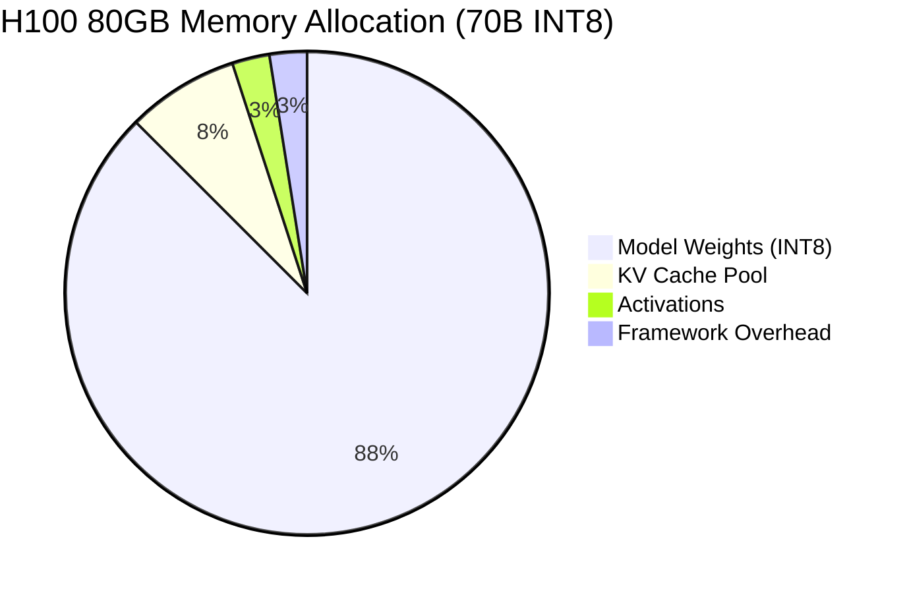

# Requirements and Estimations

## Functional Requirements

### Core Engine Requirements

| ID | Requirement | Description |
|----|-------------|-------------|
| **FR-1** | Iteration-Level Batch Scheduling | Schedule decode tokens at each forward pass; dynamically add/remove sequences from running batch |
| **FR-2** | Non-Contiguous KV Cache Allocation | Allocate KV cache in fixed-size blocks; support fragmented physical memory mapping |
| **FR-3** | Copy-on-Write Block Sharing | Share KV cache blocks between sequences (beam search, prefix cache); copy only on modification |
| **FR-4** | Prefix Cache Management | Store and retrieve computed KV for common prefixes; hash-based lookup with reference counting |
| **FR-5** | Speculative Token Verification | Execute draft-verify-accept pipeline; maintain correctness with probability matching |
| **FR-6** | Preemption and Swap | Evict sequences to CPU memory under pressure; restore without recomputation |
| **FR-7** | Chunked Prefill | Process large prompts in chunks; interleave with decode tokens |
| **FR-8** | Multi-GPU Tensor Parallelism | Shard attention heads and MLP across GPUs; synchronize via AllReduce |
| **FR-9** | Streaming Output | Emit tokens as generated; support Server-Sent Events (SSE) |
| **FR-10** | Sampling Parameter Support | Temperature, top-p, top-k, repetition penalty, stop sequences |

### Out of Scope

| Feature | Reason | Alternative |
|---------|--------|-------------|
| Model training | Separate concern | See 3.13 LLM Training Architecture |
| Load balancing across instances | Gateway responsibility | See 3.21 LLM Gateway |
| Prompt caching (semantic) | Gateway responsibility | See 3.21 LLM Gateway |
| Content moderation | Safety layer | See 3.22 AI Guardrails |
| Model fine-tuning | Offline process | MLOps platforms |

---

## Non-Functional Requirements

### Performance Requirements

| ID | Metric | Target | Justification |
|----|--------|--------|---------------|
| **NFR-1** | Block Allocation Latency | < 1 μs per block | Must not bottleneck iteration (~10ms) |
| **NFR-2** | Scheduler Overhead | < 100 μs per iteration | Python scheduler must be fast |
| **NFR-3** | TTFT (Time to First Token) | < 200 ms (p99) | User-perceived responsiveness |
| **NFR-4** | TPS (Tokens Per Second) | > 50 per request | Acceptable reading speed |
| **NFR-5** | Throughput | > 50,000 tokens/s (70B H100) | Cost efficiency target |
| **NFR-6** | Memory Fragmentation | < 5% under steady state | Maximize concurrent requests |
| **NFR-7** | Prefix Cache Hit Rate | > 30% (typical workloads) | Measurable cost savings |

### Reliability Requirements

| ID | Metric | Target | Notes |
|----|--------|--------|-------|
| **NFR-8** | Request Success Rate | > 99.9% | Excludes client errors |
| **NFR-9** | GPU Recovery Time | < 60 seconds | Model reload after failure |
| **NFR-10** | Preemption Latency | < 10 ms | Swap to CPU without blocking |

### Scalability Requirements

| ID | Metric | Target | Notes |
|----|--------|--------|-------|
| **NFR-11** | Max Concurrent Requests | > 100 per GPU | With typical context lengths |
| **NFR-12** | Max Context Length | 128K+ tokens | Modern long-context models |
| **NFR-13** | Multi-GPU Scaling | Near-linear to 8 GPUs | Tensor parallelism efficiency |

---

## Capacity Estimations

### Memory Budget Calculation

**Reference Model:** Llama-2 70B on H100 80GB (INT8 quantization)

```
┌─────────────────────────────────────────────────────────────────────┐
│                    H100 80GB MEMORY BUDGET                          │
├─────────────────────────────────────────────────────────────────────┤
│                                                                     │
│  Model Weights (70B INT8)                                           │
│  ─────────────────────────                                          │
│  Parameters: 70 billion                                             │
│  Precision: INT8 (1 byte per param)                                 │
│  Total: 70 GB                                                       │
│                                                                     │
│  CUDA Context & Framework Overhead                                  │
│  ─────────────────────────────────                                  │
│  CUDA context: ~1 GB                                                │
│  vLLM/Framework buffers: ~1 GB                                      │
│  Total: ~2 GB                                                       │
│                                                                     │
│  Activation Memory (per batch)                                      │
│  ─────────────────────────────                                      │
│  Hidden size: 8192                                                  │
│  Batch tokens: 8192 (chunked prefill budget)                        │
│  Activations: ~1-2 GB (recomputed per layer)                        │
│                                                                     │
│  KV Cache Pool (REMAINING)                                          │
│  ─────────────────────────                                          │
│  Available: 80 - 70 - 2 - 2 = 6 GB                                  │
│                                                                     │
└─────────────────────────────────────────────────────────────────────┘
```



### KV Cache Capacity Calculation

**Llama-2 70B Architecture:**
- Layers: 80
- KV Heads: 8 (GQA - Grouped Query Attention)
- Head Dimension: 128
- Precision: FP16 (2 bytes)

```
KV Cache Per Token Per Layer:
─────────────────────────────
K: 8 heads × 128 dim × 2 bytes = 2,048 bytes
V: 8 heads × 128 dim × 2 bytes = 2,048 bytes
Total per layer: 4,096 bytes

KV Cache Per Token (All Layers):
────────────────────────────────
80 layers × 4,096 bytes = 327,680 bytes ≈ 320 KB per token

With 6 GB KV Cache Pool:
────────────────────────
Total tokens: 6 GB / 320 KB = 18,750 tokens

Block Size: 16 tokens (vLLM default)
────────────────────────────────────
Blocks available: 18,750 / 16 ≈ 1,172 blocks
Block memory: 16 × 320 KB = 5.12 MB per block
```

### Concurrent Request Capacity

| Context Length | Tokens per Request | Max Concurrent Requests |
|----------------|-------------------|------------------------|
| 512 tokens | 512 | 36 |
| 1,024 tokens | 1,024 | 18 |
| 2,048 tokens | 2,048 | 9 |
| 4,096 tokens | 4,096 | 4 |
| 8,192 tokens | 8,192 | 2 |

*Note: With prefix caching, effective capacity increases 30-50% for workloads with shared prefixes.*

---

## Throughput Modeling

### Roofline Analysis

```
┌─────────────────────────────────────────────────────────────────────┐
│                    ROOFLINE ANALYSIS (H100)                         │
├─────────────────────────────────────────────────────────────────────┤
│                                                                     │
│  Hardware Specs:                                                    │
│  ───────────────                                                    │
│  Memory Bandwidth: 3.35 TB/s                                        │
│  FP8 Compute: 1,979 TFLOPS                                          │
│  Arithmetic Intensity Crossover: 1979 / 3350 ≈ 591 FLOPs/byte       │
│                                                                     │
│  DECODE PHASE (Memory-Bound):                                       │
│  ─────────────────────────────                                      │
│  Batch Size: 1                                                      │
│  Weights to read: 70 GB                                             │
│  FLOPs: 2 × 70B = 140 GFLOPs                                        │
│  Arithmetic Intensity: 140 GFLOPs / 70 GB = 2 FLOPs/byte            │
│                                                                     │
│  Time (memory-limited): 70 GB / 3.35 TB/s = 20.9 ms                 │
│  TPS (batch=1): 1 / 0.0209 = 48 tokens/sec                          │
│                                                                     │
│  Batch Size: 8                                                      │
│  Same weight reads, 8x more output tokens                           │
│  Time: ~21 ms for 8 tokens                                          │
│  TPS (total): 8 / 0.021 = 381 tokens/sec                            │
│  TPS (per request): Still ~48 tokens/sec                            │
│                                                                     │
│  PREFILL PHASE (Compute-Bound):                                     │
│  ──────────────────────────────                                     │
│  Prompt Length: 1,000 tokens                                        │
│  FLOPs: 2 × 70B × 1000 × 6 ≈ 8.4 × 10^14 FLOPs                      │
│  (Factor of 6 accounts for attention + MLP)                         │
│                                                                     │
│  Time (compute-limited): 8.4e14 / 1.979e15 = 425 ms                 │
│  With Flash Attention optimization: ~100-150 ms                     │
│                                                                     │
│  COMBINED THROUGHPUT MODEL:                                         │
│  ──────────────────────────                                         │
│  Avg prompt: 500 tokens, Avg output: 100 tokens                     │
│  Prefill: 75 ms (Flash Attention)                                   │
│  Decode: 100 tokens × 21ms / batch_size                             │
│                                                                     │
│  With batch=8, continuous batching:                                 │
│  Steady-state TPS: ~50,000 tokens/sec (mixture of P+D)              │
│                                                                     │
└─────────────────────────────────────────────────────────────────────┘
```

### Throughput vs Batch Size

| Batch Size | Decode Time (8 tokens) | TPS (total) | TPS (per request) | Latency Impact |
|------------|------------------------|-------------|-------------------|----------------|
| 1 | 21 ms | 48 | 48 | Minimal |
| 4 | 21 ms | 190 | 48 | Minimal |
| 8 | 21 ms | 381 | 48 | Minimal |
| 16 | 22 ms | 727 | 45 | Slight increase |
| 32 | 24 ms | 1,333 | 42 | Noticeable |
| 64 | 28 ms | 2,286 | 36 | Significant |

*Note: At larger batch sizes, KV cache reads start contributing to memory bandwidth.*

---

## SLO Definitions

### Latency SLOs

| Metric | Target | Measurement | Alert Threshold |
|--------|--------|-------------|-----------------|
| TTFT (p50) | < 100 ms | Time from request to first token | > 150 ms |
| TTFT (p99) | < 200 ms | Time from request to first token | > 300 ms |
| ITL (p50) | < 20 ms | Inter-token latency (decode) | > 30 ms |
| ITL (p99) | < 50 ms | Inter-token latency (decode) | > 80 ms |
| E2E (p50) | < 2 sec | Total request time (100 output tokens) | > 3 sec |

### Throughput SLOs

| Metric | Target | Measurement | Alert Threshold |
|--------|--------|-------------|-----------------|
| Request Throughput | > 100 req/s | Requests completed per second | < 80 req/s |
| Token Throughput | > 50,000 tok/s | Output tokens per second | < 40,000 tok/s |
| GPU Utilization | > 70% | Average compute utilization | < 50% |

### Quality SLOs

| Metric | Target | Measurement | Alert Threshold |
|--------|--------|-------------|-----------------|
| Request Success Rate | > 99.9% | Successful / Total requests | < 99.5% |
| Timeout Rate | < 0.1% | Requests exceeding timeout | > 0.5% |
| OOM Rate | < 0.01% | Out-of-memory errors | > 0.1% |

---

## Scaling Estimations

### Horizontal Scaling (More Instances)

| Instances | Total Throughput | Cost Multiplier | Use Case |
|-----------|-----------------|-----------------|----------|
| 1 | 50K tok/s | 1x | Development, low traffic |
| 4 | 200K tok/s | 4x | Production, moderate traffic |
| 16 | 800K tok/s | 16x | High traffic, redundancy |
| 64 | 3.2M tok/s | 64x | Enterprise, global deployment |

### Vertical Scaling (Tensor Parallelism)

| TP Size | GPUs | Model Capacity | Latency | Throughput per GPU |
|---------|------|----------------|---------|-------------------|
| TP=1 | 1 × H100 | 70B INT8 | Baseline | 100% |
| TP=2 | 2 × H100 | 140B INT8 | -20% TTFT | 95% |
| TP=4 | 4 × H100 | 280B INT8 | -35% TTFT | 90% |
| TP=8 | 8 × H100 | 560B INT8 | -45% TTFT | 85% |

*Efficiency loss due to AllReduce communication overhead.*

---

## Cost Modeling

### Per-Token Cost (H100 Cloud Instance)

```
Assumptions:
- H100 cloud cost: $3.50/hour
- Throughput: 50,000 tokens/second
- Utilization: 80%

Tokens per hour: 50,000 × 3600 × 0.80 = 144,000,000 tokens
Cost per 1M tokens: $3.50 / 144 = $0.024

Comparison:
- OpenAI GPT-4o: $2.50 / 1M output tokens
- Claude 3.5 Sonnet: $15.00 / 1M output tokens
- Self-hosted 70B: $0.024 / 1M tokens (60-600x cheaper at scale)
```

### Break-Even Analysis

| Monthly Volume | Self-Hosted Cost | API Cost (GPT-4o) | Savings |
|----------------|-----------------|-------------------|---------|
| 1B tokens | $2,520 + setup | $2,500 | Break-even |
| 10B tokens | $2,520 | $25,000 | 90% savings |
| 100B tokens | $25,200 | $250,000 | 90% savings |

*Self-hosted requires engineering investment for setup, monitoring, and maintenance.*

---

## Capacity Planning Examples

### Example 1: Customer Support Chatbot

```
Traffic Pattern:
- 100,000 conversations/day
- Average 10 turns per conversation
- Average prompt: 500 tokens, output: 100 tokens

Token Volume:
- Input: 100K × 10 × 500 = 500M tokens/day
- Output: 100K × 10 × 100 = 100M tokens/day
- Total: 600M tokens/day = 6,944 tokens/second average

Peak (3x average): 20,832 tokens/second

Infrastructure:
- 1 × H100 instance (50K tok/s capacity)
- 42% average utilization
- Sufficient headroom for peak
```

### Example 2: Code Assistant (IDE Integration)

```
Traffic Pattern:
- 10,000 active developers
- 50 completions per developer per hour
- Average prompt: 2,000 tokens (code context), output: 50 tokens

Token Volume (peak hour):
- Input: 10K × 50 × 2000 = 1B tokens/hour = 278K tokens/second
- Output: 10K × 50 × 50 = 25M tokens/hour = 6,944 tokens/second

Infrastructure:
- Long contexts require more KV cache per request
- Max concurrent: 2,000 tokens context → 9 requests per GPU
- Need: 278K / 50K = 6 × H100 instances minimum
- With 50% headroom: 9 × H100 instances
```

### Example 3: RAG Application with Long Context

```
Traffic Pattern:
- 1,000 queries per minute
- Average prompt: 8,000 tokens (retrieved documents)
- Average output: 500 tokens

Token Volume:
- Input: 1K × 60 × 8000 = 480M tokens/hour = 133K tokens/second
- Output: 1K × 60 × 500 = 30M tokens/hour = 8,333 tokens/second

Concurrent Request Analysis:
- 8K context = ~2 requests per GPU (KV cache limited)
- Prefill time: ~400ms per request
- Need: 1000 / 60 = 17 concurrent requests minimum
- GPUs needed: 17 / 2 = 9 GPUs

Infrastructure:
- 2 × 8-GPU nodes (TP=2 for lower latency)
- Each instance handles 2 concurrent 8K requests
- 8 instances = 16 concurrent requests
```
