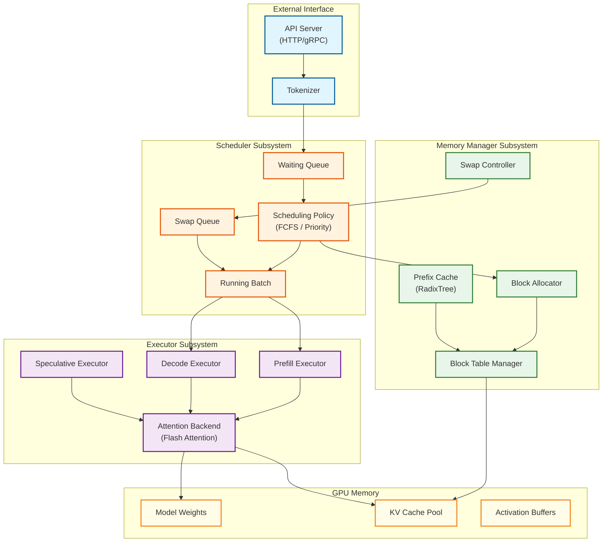
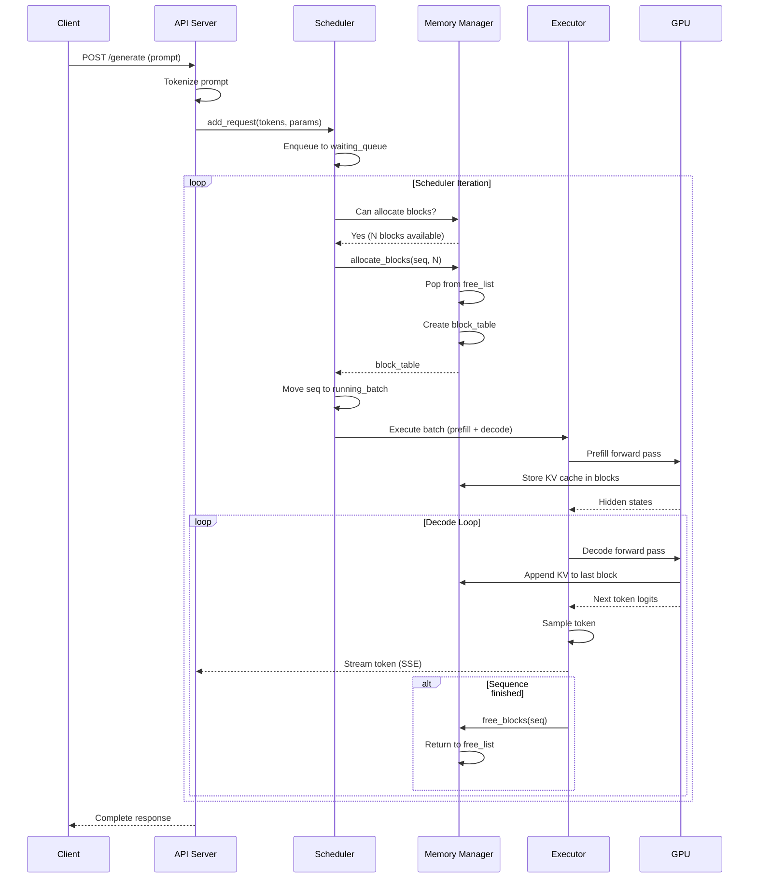
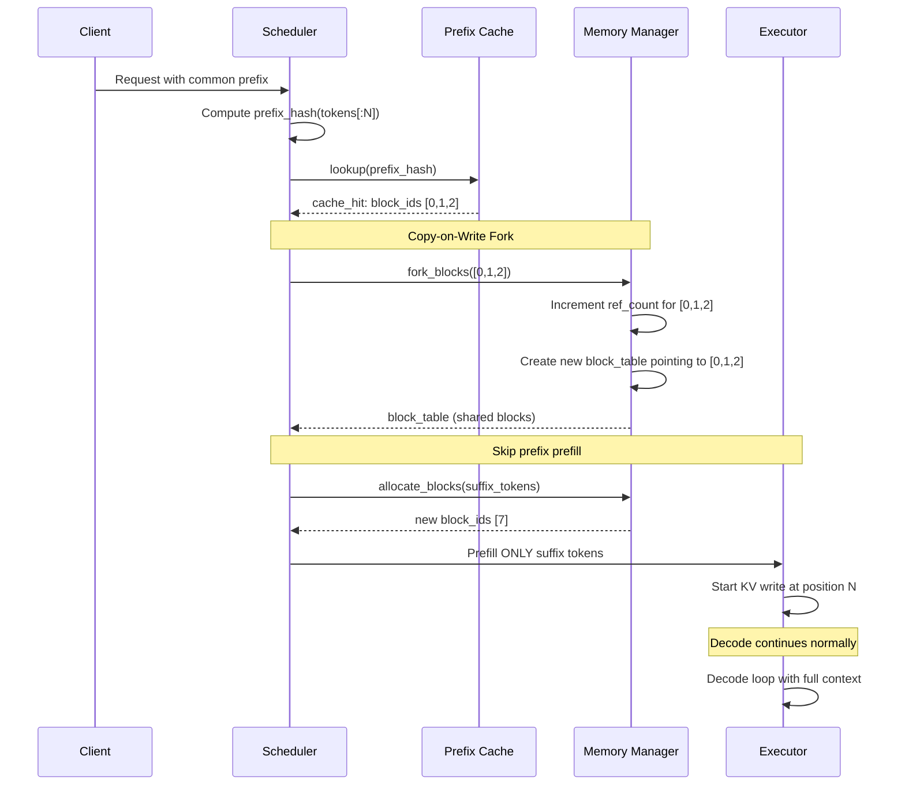
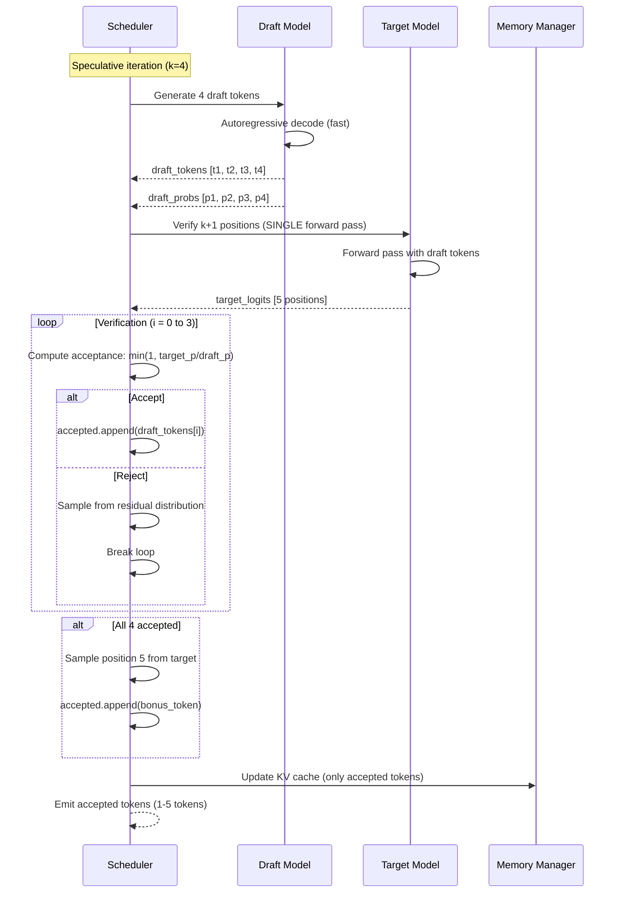
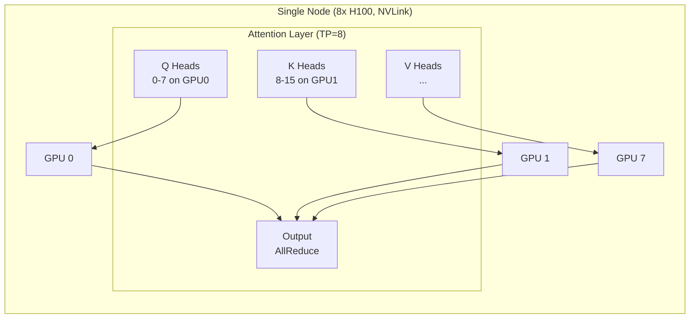
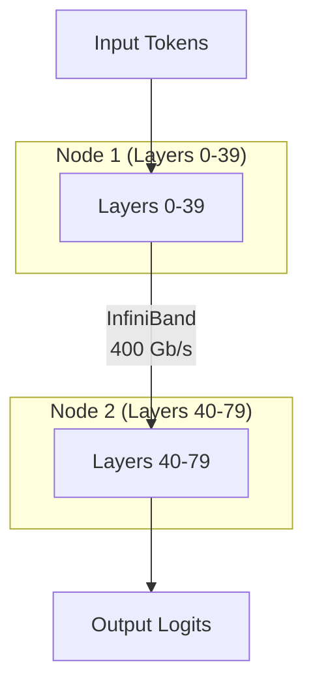

# High-Level Design

## System Architecture

An LLM Inference Engine consists of three core subsystems working together to serve requests efficiently:

1. **Scheduler**: Manages request queues, batching decisions, and preemption
2. **Memory Manager**: Allocates/deallocates KV cache blocks, handles prefix caching
3. **Executor**: Runs model forward passes, coordinates multi-GPU execution



---

## Core Components

### 1. Scheduler Subsystem

The scheduler makes iteration-level decisions about which sequences to process.

| Component | Responsibility |
|-----------|---------------|
| **Waiting Queue** | Holds incoming requests not yet allocated GPU memory |
| **Running Batch** | Sequences actively being processed (have KV cache allocated) |
| **Swap Queue** | Preempted sequences whose KV cache was moved to CPU |
| **Scheduling Policy** | Determines admission, preemption, and execution order |

**Scheduling Policies:**

| Policy | Description | Best For |
|--------|-------------|----------|
| **FCFS** | First-come, first-served | Fair, predictable latency |
| **Priority** | Higher priority requests processed first | SLA differentiation |
| **Shortest Job First** | Process shorter prompts first | Minimize average latency |
| **Preemptive Priority** | Pause low-priority for high-priority | Real-time applications |

### 2. Memory Manager Subsystem

The memory manager handles KV cache allocation using PagedAttention.

| Component | Responsibility |
|-----------|---------------|
| **Block Allocator** | Manages pool of physical blocks (free list, ref counting) |
| **Block Table Manager** | Maps logical blocks to physical blocks per sequence |
| **Prefix Cache** | Stores computed KV for reusable prefixes (hash-based lookup) |
| **Swap Controller** | Handles GPU↔CPU memory transfers for preemption |

**Memory Hierarchy:**

```
┌──────────────────────────────────────────────────────────────┐
│                    GPU HBM (80 GB)                           │
│  ┌─────────────────────────────────────────────────────────┐ │
│  │                 KV Cache Pool (6 GB)                    │ │
│  │  ┌─────┬─────┬─────┬─────┬─────┬─────┬─────┬─────┐     │ │
│  │  │Blk 0│Blk 1│Blk 2│Blk 3│ ... │Blk N│     │     │     │ │
│  │  └─────┴─────┴─────┴─────┴─────┴─────┴─────┴─────┘     │ │
│  │  Each block: 16 tokens × 320 KB = 5.12 MB              │ │
│  └─────────────────────────────────────────────────────────┘ │
└──────────────────────────────────────────────────────────────┘
                              │
                              │ Swap (preemption)
                              ▼
┌──────────────────────────────────────────────────────────────┐
│                    CPU RAM (Swap Space)                      │
│  ┌─────────────────────────────────────────────────────────┐ │
│  │              Swapped KV Cache Blocks                    │ │
│  │  (Sequences preempted due to memory pressure)          │ │
│  └─────────────────────────────────────────────────────────┘ │
└──────────────────────────────────────────────────────────────┘
```

### 3. Executor Subsystem

The executor runs model forward passes with different optimizations.

| Component | Responsibility |
|-----------|---------------|
| **Prefill Executor** | Process prompt tokens (compute-bound, batch across tokens) |
| **Decode Executor** | Generate output tokens (memory-bound, batch across sequences) |
| **Speculative Executor** | Run draft-verify pipeline for latency reduction |
| **Attention Backend** | Execute attention (Flash Attention, PagedAttention kernel) |

---

## Data Flow Diagrams

### Path A: Standard Request (No Caching)



### Path B: Prefix Cache Hit



### Path C: Speculative Decoding



---

## Framework-Specific Architectures

### vLLM Architecture

```
vLLM (Python-based, CUDA kernels)
├── LLMEngine (Main entry point)
│   ├── Scheduler
│   │   ├── SchedulerConfig (max_num_seqs, max_model_len)
│   │   ├── BlockSpaceManager
│   │   │   ├── BlockAllocator (GPU)
│   │   │   ├── BlockAllocator (CPU - for swap)
│   │   │   └── SlidingWindowBlockAllocator (optional)
│   │   └── SchedulingPolicy (FCFS, Priority)
│   │
│   ├── ModelRunner
│   │   ├── ModelLoader (HuggingFace, SafeTensors)
│   │   ├── CUDAGraphRunner (for decode optimization)
│   │   └── WorkerBase (single-GPU worker)
│   │
│   ├── TokenizerGroup
│   │   └── Tokenizer (HuggingFace tokenizers)
│   │
│   └── OutputProcessor
│       ├── Sampler (temperature, top_p, top_k)
│       └── StopChecker (stop sequences, EOS)
│
└── Attention Backend
    ├── PagedAttention (vLLM custom kernel)
    ├── FlashAttention (when available)
    └── FlashInfer (alternative backend)
```

**Key Design Decisions (vLLM):**
- Python scheduler for flexibility
- CUDA kernels for performance-critical paths
- Block size of 16 tokens (balance between fragmentation and overhead)
- CUDA graphs for decode iteration (reduces Python overhead)

### TensorRT-LLM Architecture

```
TensorRT-LLM (C++ runtime, TensorRT compiler)
├── GptSession (Main inference session)
│   ├── Executor
│   │   ├── RequestQueue
│   │   ├── InferRequest
│   │   └── SchedulerPolicy
│   │
│   ├── TensorRT Runtime
│   │   ├── Engine (compiled model)
│   │   ├── ExecutionContext
│   │   └── Plugin Registry
│   │       ├── GptAttentionPlugin
│   │       ├── QuantizationPlugin (FP8/INT8)
│   │       └── LoraPlugin
│   │
│   ├── KV Cache Manager
│   │   ├── BlockManager
│   │   └── PagingConfig
│   │
│   └── NCCL Communicator
│       └── AllReduce, AllGather
│
└── Build Pipeline
    ├── Model Converter (HuggingFace → TRTLLM)
    ├── TensorRT Optimizer
    └── Engine Compiler
```

**Key Design Decisions (TensorRT-LLM):**
- C++ runtime for minimal overhead
- TensorRT compilation for kernel fusion
- Native FP8/FP4 support (Hopper/Blackwell)
- Inflight batching (iteration-level scheduling)

### SGLang Architecture

```
SGLang (Python runtime, FlashInfer backend)
├── Runtime
│   ├── Scheduler
│   │   ├── RadixCache (prefix caching)
│   │   │   ├── RadixTree
│   │   │   └── EvictionPolicy (LRU)
│   │   ├── ChunkPrefillScheduler
│   │   └── TreeAttentionScheduler
│   │
│   ├── ModelRunner
│   │   ├── FlashInferBackend
│   │   │   ├── BatchPrefillKernel
│   │   │   └── BatchDecodeKernel
│   │   └── TokenAttention
│   │
│   ├── Interpreter
│   │   ├── ConstrainedDecoding
│   │   └── StructuredOutput (JSON schema)
│   │
│   └── PrefillDecodeDisaggregation
│       ├── PrefillWorker
│       ├── DecodeWorker
│       └── KVCacheTransfer (RDMA)
│
└── Frontend
    ├── SGLProgram (DSL for structured generation)
    └── OpenAI-compatible API
```

**Key Design Decisions (SGLang):**
- RadixAttention for efficient prefix sharing
- Zero-overhead CPU scheduler
- First-class disaggregated prefill/decode support
- Native structured output (JSON mode)

---

## Key Architectural Decisions

### Decision 1: Continuous Batching vs Static Batching

| Aspect | Static Batching | Continuous Batching |
|--------|----------------|---------------------|
| **Batch Composition** | Fixed at start | Changes every iteration |
| **Padding** | Required for variable lengths | Not needed |
| **Head-of-Line Blocking** | Yes (long sequences block short) | No |
| **GPU Utilization** | Lower (idle during short seq completion) | Higher |
| **Implementation Complexity** | Low | Medium |
| **Throughput** | Baseline | 2-3x improvement |

**Recommendation:** Continuous batching for production. Static batching only for benchmarking.

### Decision 2: PagedAttention vs Contiguous Allocation

| Aspect | Contiguous Allocation | PagedAttention |
|--------|----------------------|----------------|
| **Memory Waste** | 60-90% (max_len - actual_len) | <5% fragmentation |
| **Concurrent Requests** | Few (memory limited) | Many (4-10x more) |
| **Allocation Overhead** | None | ~5% (block table lookup) |
| **Implementation Complexity** | Low | High |
| **Copy-on-Write** | Not possible | Supported |

**Recommendation:** PagedAttention for production. Contiguous only for very short contexts.

### Decision 3: Prefill/Decode Combined vs Disaggregated

| Aspect | Combined | Disaggregated |
|--------|----------|---------------|
| **Architecture** | Single worker pool | Separate prefill and decode workers |
| **TTFT** | Lower (no transfer) | Higher (+5-10ms KV transfer) |
| **Throughput** | Lower | 30-50% higher |
| **GPU Utilization** | Suboptimal (mixed compute/memory) | Optimal (specialized workers) |
| **Complexity** | Lower | Higher (KV cache transfer, routing) |
| **Best For** | Latency-sensitive | Throughput-maximizing |

**Recommendation:** Combined for latency-sensitive workloads. Disaggregated for cost-optimized batch processing.

### Decision 4: Speculative Decoding Usage

| Scenario | Use Speculative? | Reason |
|----------|------------------|--------|
| Greedy decoding (temp=0) | Yes | High acceptance rate (80%+) |
| Low temperature (temp<0.5) | Yes | Good acceptance rate (70%+) |
| High temperature (temp>0.7) | No | Low acceptance rate (<50%) |
| Good draft model available | Yes | Quality draft = high acceptance |
| No draft model | No | Cannot speculate |
| Batch size > 1 | Maybe | Benefits reduce with larger batches |

**Recommendation:** Enable speculative decoding for greedy/low-temperature with matched draft model.

---

## Architecture Pattern Checklist

| Decision | Options | Recommendation |
|----------|---------|----------------|
| Batching Strategy | Static / Continuous | Continuous batching |
| Memory Allocation | Contiguous / Paged | PagedAttention |
| Prefill/Decode | Combined / Disaggregated | Combined (default), Disaggregated (high throughput) |
| Prefix Caching | Disabled / Enabled | Enabled for repetitive workloads |
| Speculative Decoding | Disabled / Enabled | Enabled for low-temperature |
| Multi-GPU Strategy | Tensor Parallel / Pipeline | TP for latency, PP for large models |
| Quantization | FP16 / INT8 / FP8 | FP8 (Hopper), INT8 (Ada), FP16 (baseline) |
| CUDA Graphs | Disabled / Enabled | Enabled for decode |

---

## Multi-GPU Architecture

### Tensor Parallelism (TP)

Tensor parallelism shards model layers across GPUs within a node.



**TP Communication:**
- AllReduce after every attention and MLP layer
- Uses NVLink (900 GB/s) within node
- Latency: ~10-50μs per AllReduce

### Pipeline Parallelism (PP)

Pipeline parallelism distributes layers across nodes.



**PP Communication:**
- Point-to-point send after each stage
- Uses InfiniBand (400 Gb/s) between nodes
- Pipeline bubbles reduce efficiency

### Recommended Configuration

| Model Size | TP | PP | GPUs | Rationale |
|------------|----|----|------|-----------|
| 7B | 1 | 1 | 1 | Fits on single GPU |
| 70B (INT8) | 1 | 1 | 1 | Fits with quantization |
| 70B (FP16) | 2 | 1 | 2 | Requires sharding |
| 405B (INT8) | 8 | 1 | 8 | Full node TP |
| 405B (FP16) | 8 | 2 | 16 | Multi-node required |

**Best Practice:** TP = GPUs per node, PP = number of nodes.
