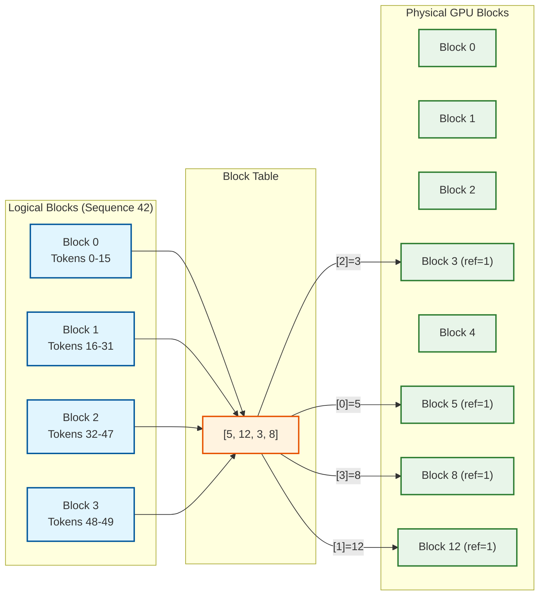
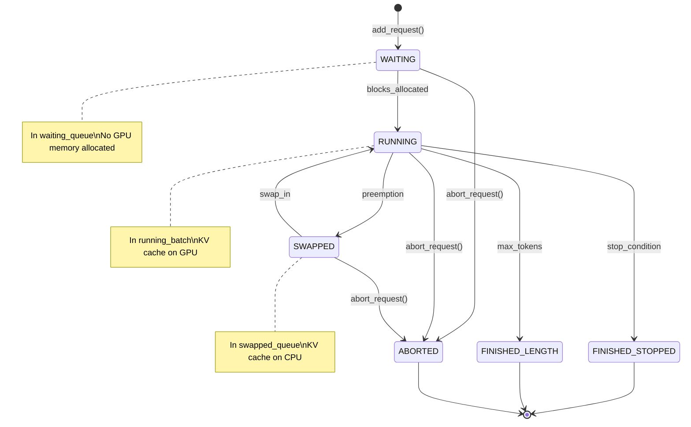

# Low-Level Design

## Core Data Structures

### Block Table and Physical Block

The block table maps logical blocks (per-sequence) to physical blocks (GPU memory).

```
┌─────────────────────────────────────────────────────────────────────┐
│                        DATA STRUCTURES                              │
├─────────────────────────────────────────────────────────────────────┤
│                                                                     │
│  PhysicalBlock:                                                     │
│  ─────────────                                                      │
│      block_id: int              # Unique identifier (0 to N-1)      │
│      ref_count: int             # Number of sequences using this    │
│      is_allocated: bool         # Currently in use                  │
│      last_accessed: timestamp   # For LRU eviction                  │
│                                                                     │
│  BlockTable (per sequence):                                         │
│  ──────────────────────────                                         │
│      sequence_id: int                                               │
│      logical_to_physical: List[int]   # [phys_id_0, phys_id_1, ...] │
│      num_tokens: int                  # Total tokens in sequence    │
│                                                                     │
│  Example:                                                           │
│  ─────────                                                          │
│  Sequence 42, 50 tokens, block_size=16                              │
│  logical_to_physical = [5, 12, 3, 8]  # 4 blocks                    │
│  num_tokens = 50                                                    │
│                                                                     │
│  Block 0 (logical): tokens 0-15   → Physical block 5                │
│  Block 1 (logical): tokens 16-31  → Physical block 12               │
│  Block 2 (logical): tokens 32-47  → Physical block 3                │
│  Block 3 (logical): tokens 48-49  → Physical block 8 (partial)      │
│                                                                     │
└─────────────────────────────────────────────────────────────────────┘
```



### KV Cache Pool Layout

GPU memory layout for KV cache across all layers.

```
┌─────────────────────────────────────────────────────────────────────┐
│                    KV CACHE POOL (GPU MEMORY)                       │
├─────────────────────────────────────────────────────────────────────┤
│                                                                     │
│  Pool Structure:                                                    │
│  ───────────────                                                    │
│  KVCachePool:                                                       │
│      num_layers: int           # 80 for Llama-70B                   │
│      num_blocks: int           # Total physical blocks              │
│      block_size: int           # Tokens per block (16)              │
│      num_kv_heads: int         # KV heads (8 for GQA)               │
│      head_dim: int             # Head dimension (128)               │
│                                                                     │
│      k_cache: Tensor[num_layers, num_blocks, block_size,            │
│                      num_kv_heads, head_dim]                        │
│      v_cache: Tensor[num_layers, num_blocks, block_size,            │
│                      num_kv_heads, head_dim]                        │
│                                                                     │
│  Memory Layout (Llama-70B, 1000 blocks):                            │
│  ─────────────────────────────────────────                          │
│  k_cache shape: [80, 1000, 16, 8, 128] = 1.31 GB (FP16)             │
│  v_cache shape: [80, 1000, 16, 8, 128] = 1.31 GB (FP16)             │
│  Total: 2.62 GB for 16,000 tokens                                   │
│                                                                     │
│  Access Pattern (PagedAttention):                                   │
│  ─────────────────────────────────                                  │
│  For sequence with block_table = [5, 12, 3]:                        │
│      Layer L, Position P:                                           │
│          block_idx = P // block_size                                │
│          block_offset = P % block_size                              │
│          phys_block = block_table[block_idx]                        │
│          k = k_cache[L, phys_block, block_offset, :, :]             │
│          v = v_cache[L, phys_block, block_offset, :, :]             │
│                                                                     │
└─────────────────────────────────────────────────────────────────────┘
```

### Prefix Cache (RadixTree)

Prefix caching stores computed KV for reusable token sequences.

```
┌─────────────────────────────────────────────────────────────────────┐
│                    RADIX TREE FOR PREFIX CACHE                      │
├─────────────────────────────────────────────────────────────────────┤
│                                                                     │
│  RadixNode:                                                         │
│  ──────────                                                         │
│      children: Dict[int, RadixNode]  # token_id → child node        │
│      block_id: Optional[int]         # Physical block (if complete) │
│      ref_count: int                  # Active references            │
│      num_tokens: int                 # Tokens from root to here     │
│                                                                     │
│  Example Tree:                                                      │
│  ─────────────                                                      │
│  System prompt: "You are a helpful assistant."                      │
│  Tokenized: [1, 366, 526, 263, 8444, 20255, 29889]                  │
│                                                                     │
│                    [ROOT]                                           │
│                       │                                             │
│                    [1] (token: <s>)                                 │
│                       │                                             │
│                   [366] (token: "You")                              │
│                       │                                             │
│                   [526] (token: " are")                             │
│                       │                                             │
│                   [263] (token: " a")                               │
│                       │                                             │
│                  [8444] (token: " helpful")                         │
│                       │                                             │
│                 [20255] (token: " assistant")                       │
│                       │                                             │
│                 [29889] ← block_id=7, ref_count=15                  │
│                                                                     │
│  15 concurrent chats share this prefix → ref_count=15               │
│  KV for these 7 tokens stored once in block 7                       │
│                                                                     │
└─────────────────────────────────────────────────────────────────────┘
```

### Sequence State

Complete state for a single sequence in the system.

```
┌─────────────────────────────────────────────────────────────────────┐
│                        SEQUENCE STATE                               │
├─────────────────────────────────────────────────────────────────────┤
│                                                                     │
│  SequenceState:                                                     │
│  ──────────────                                                     │
│      sequence_id: int                                               │
│      request_id: str                # Client-provided ID            │
│      status: enum                   # WAITING/RUNNING/SWAPPED/DONE  │
│                                                                     │
│      # Token state                                                  │
│      prompt_token_ids: List[int]    # Original prompt               │
│      output_token_ids: List[int]    # Generated tokens              │
│      num_computed_tokens: int       # Tokens with KV computed       │
│                                                                     │
│      # Memory state                                                 │
│      block_table: List[int]         # Physical block mapping        │
│      num_blocks: int                # Blocks allocated              │
│                                                                     │
│      # Sampling state                                               │
│      sampling_params: SamplingParams                                │
│      logprobs: List[Dict]           # Token log probabilities       │
│                                                                     │
│      # Lifecycle                                                    │
│      arrival_time: float            # Request arrival               │
│      first_token_time: float        # TTFT measurement              │
│      finish_time: float             # Completion time               │
│                                                                     │
│  Status Transitions:                                                │
│  ───────────────────                                                │
│  WAITING → RUNNING: Blocks allocated, admitted to batch             │
│  RUNNING → SWAPPED: Preempted, KV moved to CPU                      │
│  SWAPPED → RUNNING: Restored from CPU swap                          │
│  RUNNING → FINISHED: EOS or stop condition met                      │
│                                                                     │
└─────────────────────────────────────────────────────────────────────┘
```

---

## Core Algorithms

### Algorithm 1: Block Allocation

```
ALGORITHM allocate_blocks(sequence, num_tokens):
    """
    Allocate physical blocks for a sequence's KV cache.

    Time Complexity: O(num_blocks)
    Space Complexity: O(1) additional
    """

    INPUT:
        sequence: SequenceState
        num_tokens: int  # Tokens needing KV storage

    OUTPUT:
        success: bool
        block_table: List[int] or None

    PROCEDURE:
        # Calculate blocks needed
        num_blocks_needed = CEIL(num_tokens / BLOCK_SIZE)

        # Check capacity
        IF free_list.size() < num_blocks_needed:
            RETURN (False, None)

        # Allocate blocks
        block_table = []
        FOR i IN RANGE(num_blocks_needed):
            block = free_list.pop()
            block.ref_count = 1
            block.is_allocated = True
            block.last_accessed = NOW()
            block_table.APPEND(block.block_id)

        # Update sequence state
        sequence.block_table = block_table
        sequence.num_blocks = num_blocks_needed

        RETURN (True, block_table)
```

### Algorithm 2: Block Deallocation

```
ALGORITHM free_blocks(sequence):
    """
    Return blocks to free list, respecting reference counts.
    Supports Copy-on-Write sharing.

    Time Complexity: O(num_blocks)
    """

    INPUT:
        sequence: SequenceState

    PROCEDURE:
        FOR block_id IN sequence.block_table:
            block = physical_blocks[block_id]
            block.ref_count -= 1

            IF block.ref_count == 0:
                # No more references, return to pool
                block.is_allocated = False
                free_list.push(block_id)

                # Optionally zero memory for security
                IF SECURE_MODE:
                    zero_block_memory(block_id)

        # Clear sequence state
        sequence.block_table = []
        sequence.num_blocks = 0
```

### Algorithm 3: Continuous Batching Scheduler Step

```
ALGORITHM scheduler_step():
    """
    Main scheduler iteration. Called every forward pass.

    Time Complexity: O(running + waiting)
    """

    OUTPUT:
        SchedulerOutput:
            scheduled_seqs: List[SequenceState]
            num_prefill_tokens: int
            num_decode_tokens: int
            blocks_to_swap_in: List[(cpu_block, gpu_block)]
            blocks_to_swap_out: List[(gpu_block, cpu_block)]

    PROCEDURE:
        # PHASE 1: Process finished sequences
        finished_seqs = []
        FOR seq IN running_batch:
            IF seq.is_finished():
                finished_seqs.APPEND(seq)
                free_blocks(seq)

        running_batch.REMOVE_ALL(finished_seqs)

        # PHASE 2: Allocate new block for growing sequences
        FOR seq IN running_batch:
            current_blocks = CEIL(seq.num_computed_tokens / BLOCK_SIZE)
            needed_blocks = CEIL((seq.num_computed_tokens + 1) / BLOCK_SIZE)

            IF needed_blocks > current_blocks:
                # Need one more block for next token
                IF can_allocate(1):
                    append_slot(seq)
                ELSE:
                    # Memory pressure - must preempt
                    victim = select_preemption_victim()
                    swap_out(victim)
                    swapped_queue.APPEND(victim)
                    running_batch.REMOVE(victim)

        # PHASE 3: Try to restore swapped sequences (priority)
        WHILE swapped_queue.NOT_EMPTY():
            seq = swapped_queue.peek()
            IF can_allocate(seq.num_blocks):
                swapped_queue.pop()
                swap_in(seq)
                running_batch.APPEND(seq)
            ELSE:
                BREAK

        # PHASE 4: Admit waiting sequences
        WHILE waiting_queue.NOT_EMPTY():
            seq = waiting_queue.peek()
            blocks_needed = estimate_blocks(seq)

            IF can_allocate(blocks_needed):
                waiting_queue.pop()
                success, _ = allocate_blocks(seq, seq.prompt_tokens)
                seq.status = RUNNING
                running_batch.APPEND(seq)
            ELSE:
                BREAK

        # PHASE 5: Build execution batch
        prefill_seqs = [s for s IN running_batch IF s.is_prefilling()]
        decode_seqs = [s for s IN running_batch IF s.is_decoding()]

        RETURN SchedulerOutput(
            scheduled_seqs = prefill_seqs + decode_seqs,
            num_prefill_tokens = SUM(s.remaining_prefill_tokens for s in prefill_seqs),
            num_decode_tokens = LEN(decode_seqs)
        )
```

### Algorithm 4: Prefix Cache Lookup (RadixAttention)

```
ALGORITHM prefix_cache_lookup(token_ids):
    """
    Find longest matching prefix in radix tree.

    Time Complexity: O(num_tokens)
    Space Complexity: O(1)
    """

    INPUT:
        token_ids: List[int]  # Full prompt tokens

    OUTPUT:
        PrefixMatch:
            matched_length: int
            block_ids: List[int]
            fork_point: RadixNode

    PROCEDURE:
        node = radix_tree.root
        matched_blocks = []
        matched_length = 0
        last_complete_node = node

        FOR token IN token_ids:
            IF token IN node.children:
                node = node.children[token]
                matched_length += 1

                # Every BLOCK_SIZE tokens, we have a complete block
                IF matched_length % BLOCK_SIZE == 0:
                    IF node.block_id IS NOT None:
                        matched_blocks.APPEND(node.block_id)
                        # Increment reference for sharing
                        physical_blocks[node.block_id].ref_count += 1
                        last_complete_node = node
            ELSE:
                # Mismatch - stop matching
                BREAK

        RETURN PrefixMatch(
            matched_length = (matched_length // BLOCK_SIZE) * BLOCK_SIZE,
            block_ids = matched_blocks,
            fork_point = last_complete_node
        )
```

### Algorithm 5: Speculative Decoding with Verification

```
ALGORITHM speculative_decode(context, k=4):
    """
    Generate multiple tokens per iteration using draft model.

    Time Complexity: O(k) draft forwards + O(1) target forward
    Speedup: Up to (k+1)x with perfect acceptance
    """

    INPUT:
        context: List[int]  # Current token sequence
        k: int              # Number of speculative tokens

    OUTPUT:
        accepted_tokens: List[int]  # 1 to k+1 tokens

    PROCEDURE:
        # STEP 1: Draft k tokens autoregressively
        draft_tokens = []
        draft_probs = []
        draft_context = context.copy()

        FOR i IN RANGE(k):
            logits = draft_model.forward(draft_context)
            probs = SOFTMAX(logits[-1])
            token = SAMPLE(probs)

            draft_tokens.APPEND(token)
            draft_probs.APPEND(probs[token])
            draft_context.APPEND(token)

        # STEP 2: Verify all k+1 positions with target model (SINGLE forward)
        verify_context = context + draft_tokens
        target_logits = target_model.forward(verify_context)
        # target_logits shape: [k+1, vocab_size]

        # STEP 3: Accept/Reject with probability matching
        accepted = []
        FOR i IN RANGE(k):
            target_probs = SOFTMAX(target_logits[i])
            p_target = target_probs[draft_tokens[i]]
            p_draft = draft_probs[i]

            # Acceptance probability
            acceptance_prob = MIN(1.0, p_target / p_draft)

            IF RANDOM() < acceptance_prob:
                # Accept draft token
                accepted.APPEND(draft_tokens[i])
            ELSE:
                # Reject: sample from adjusted distribution
                # This ensures output distribution matches autoregressive
                adjusted_probs = MAX(0, target_probs - draft_probs * (p_target / p_draft))
                adjusted_probs = adjusted_probs / SUM(adjusted_probs)
                corrected_token = SAMPLE(adjusted_probs)
                accepted.APPEND(corrected_token)
                BREAK  # Stop at first rejection

        # STEP 4: If all k accepted, sample bonus token from position k+1
        IF LEN(accepted) == k:
            final_probs = SOFTMAX(target_logits[k])
            bonus_token = SAMPLE(final_probs)
            accepted.APPEND(bonus_token)

        RETURN accepted
```

### Algorithm 6: Chunked Prefill Scheduling

```
ALGORITHM chunked_prefill_schedule(max_tokens=8192):
    """
    Interleave prefill chunks with decode tokens.
    Prevents prefill from starving decode requests.

    Time Complexity: O(running_seqs)
    """

    INPUT:
        max_tokens: int  # Maximum tokens per iteration

    OUTPUT:
        ExecutionBatch:
            prefill_requests: List[PrefillRequest]
            decode_requests: List[DecodeRequest]

    PROCEDURE:
        batch = ExecutionBatch()
        tokens_budget = max_tokens

        # PRIORITY 1: Include all decode sequences (1 token each)
        FOR seq IN running_decode_sequences:
            batch.decode_requests.APPEND(
                DecodeRequest(seq, num_tokens=1)
            )
            tokens_budget -= 1

        # PRIORITY 2: Fill remaining budget with prefill chunks
        FOR seq IN running_prefill_sequences:
            remaining = seq.prompt_length - seq.tokens_computed
            chunk_size = MIN(remaining, tokens_budget, MAX_CHUNK_SIZE)

            IF chunk_size > 0:
                batch.prefill_requests.APPEND(
                    PrefillRequest(
                        seq,
                        start_pos = seq.tokens_computed,
                        num_tokens = chunk_size
                    )
                )
                tokens_budget -= chunk_size
                seq.tokens_computed += chunk_size

            IF tokens_budget <= 0:
                BREAK

        RETURN batch
```

### Algorithm 7: Copy-on-Write Block Fork

```
ALGORITHM fork_sequence(source_seq, fork_point):
    """
    Create new sequence sharing KV cache with source.
    Used for beam search and prefix cache hits.

    Time Complexity: O(num_blocks)
    """

    INPUT:
        source_seq: SequenceState
        fork_point: int  # Token position to fork at

    OUTPUT:
        new_seq: SequenceState

    PROCEDURE:
        # Calculate shared blocks
        shared_blocks = fork_point // BLOCK_SIZE

        # Create new sequence with shared block table
        new_seq = SequenceState()
        new_seq.block_table = source_seq.block_table[:shared_blocks].copy()

        # Increment reference counts for shared blocks
        FOR block_id IN new_seq.block_table:
            physical_blocks[block_id].ref_count += 1

        # Mark as needing copy-on-write if source continues
        new_seq.cow_blocks = SET(new_seq.block_table)

        RETURN new_seq


ALGORITHM copy_on_write(seq, block_idx):
    """
    Copy block before modification if shared.

    Time Complexity: O(BLOCK_SIZE) for copy
    """

    INPUT:
        seq: SequenceState
        block_idx: int  # Logical block to modify

    PROCEDURE:
        old_block_id = seq.block_table[block_idx]
        old_block = physical_blocks[old_block_id]

        IF old_block.ref_count > 1:
            # Block is shared - must copy before write
            new_block_id = free_list.pop()

            # Copy KV cache data
            FOR layer IN RANGE(num_layers):
                k_cache[layer, new_block_id] = k_cache[layer, old_block_id].clone()
                v_cache[layer, new_block_id] = v_cache[layer, old_block_id].clone()

            # Update references
            old_block.ref_count -= 1
            physical_blocks[new_block_id].ref_count = 1
            seq.block_table[block_idx] = new_block_id

            # Remove from COW tracking
            seq.cow_blocks.REMOVE(old_block_id)
```

### Algorithm 8: Preemption Victim Selection

```
ALGORITHM select_preemption_victim():
    """
    Select sequence to preempt under memory pressure.

    Policies:
    - FCFS: Preempt most recent (preserve older requests)
    - Priority: Preempt lowest priority
    - Shortest-remaining: Preempt sequence closest to completion
    """

    OUTPUT:
        victim: SequenceState

    PROCEDURE:
        candidates = running_batch.filter(status == RUNNING)

        SWITCH preemption_policy:
            CASE FCFS:
                # Preempt most recently admitted (LIFO)
                victim = MAX(candidates, key=lambda s: s.admit_time)

            CASE PRIORITY:
                # Preempt lowest priority
                victim = MIN(candidates, key=lambda s: s.priority)

            CASE SHORTEST_REMAINING:
                # Preempt closest to completion (minimize wasted work)
                victim = MIN(candidates,
                    key=lambda s: s.max_tokens - len(s.output_tokens))

            CASE RECOMPUTE:
                # Preempt sequence with most recomputable prefix
                # (has prefix cache hit, cheap to restart)
                victim = MAX(candidates, key=lambda s: s.prefix_cache_length)

        RETURN victim
```

---

## API Specifications

### Engine API

```
┌─────────────────────────────────────────────────────────────────────┐
│                       ENGINE API                                    │
├─────────────────────────────────────────────────────────────────────┤
│                                                                     │
│  class LLMEngine:                                                   │
│      """Main inference engine interface."""                         │
│                                                                     │
│      def add_request(                                               │
│          request_id: str,                                           │
│          prompt: Union[str, List[int]],                             │
│          sampling_params: SamplingParams,                           │
│          arrival_time: Optional[float] = None                       │
│      ) -> None:                                                     │
│          """Add request to waiting queue."""                        │
│                                                                     │
│      def abort_request(request_id: str) -> None:                    │
│          """Cancel pending or running request."""                   │
│                                                                     │
│      def step() -> List[RequestOutput]:                             │
│          """Execute one scheduler iteration. Returns outputs."""    │
│                                                                     │
│      def get_num_unfinished_requests() -> int:                      │
│          """Count of waiting + running + swapped requests."""       │
│                                                                     │
│      def has_unfinished_requests() -> bool:                         │
│          """Check if any requests pending."""                       │
│                                                                     │
│                                                                     │
│  class SamplingParams:                                              │
│      """Sampling configuration for generation."""                   │
│                                                                     │
│      temperature: float = 1.0        # Softmax temperature          │
│      top_p: float = 1.0              # Nucleus sampling threshold   │
│      top_k: int = -1                 # Top-k sampling (-1=disabled) │
│      max_tokens: int = 16            # Maximum output tokens        │
│      min_tokens: int = 0             # Minimum output tokens        │
│      stop: List[str] = []            # Stop sequences               │
│      stop_token_ids: List[int] = []  # Stop token IDs               │
│      ignore_eos: bool = False        # Continue past EOS            │
│      presence_penalty: float = 0.0   # Penalize token presence      │
│      frequency_penalty: float = 0.0  # Penalize token frequency     │
│      repetition_penalty: float = 1.0 # Penalize repetition          │
│      logprobs: Optional[int] = None  # Return top-N log probs       │
│      seed: Optional[int] = None      # Random seed for sampling     │
│                                                                     │
│                                                                     │
│  class RequestOutput:                                               │
│      """Output for a completed or streaming request."""             │
│                                                                     │
│      request_id: str                                                │
│      prompt: str                                                    │
│      prompt_token_ids: List[int]                                    │
│      outputs: List[CompletionOutput]                                │
│      finished: bool                                                 │
│      metrics: Optional[RequestMetrics]                              │
│                                                                     │
│                                                                     │
│  class CompletionOutput:                                            │
│      """Single completion output."""                                │
│                                                                     │
│      index: int                      # Output index (for n>1)       │
│      text: str                       # Generated text               │
│      token_ids: List[int]            # Generated token IDs          │
│      cumulative_logprob: float       # Sum of log probabilities     │
│      logprobs: Optional[List[Dict]]  # Per-token log probs          │
│      finish_reason: Optional[str]    # "stop" | "length" | None     │
│                                                                     │
└─────────────────────────────────────────────────────────────────────┘
```

### Internal Scheduler API

```
┌─────────────────────────────────────────────────────────────────────┐
│                    INTERNAL SCHEDULER API                           │
├─────────────────────────────────────────────────────────────────────┤
│                                                                     │
│  class Scheduler:                                                   │
│      """Internal scheduler interface."""                            │
│                                                                     │
│      def schedule() -> SchedulerOutputs:                            │
│          """Run scheduling algorithm, return execution plan."""     │
│                                                                     │
│      def free_seq(seq: Sequence) -> None:                           │
│          """Release all resources for finished sequence."""         │
│                                                                     │
│      def fork_seq(parent: Sequence, child_id: int) -> Sequence:     │
│          """Create child sequence sharing parent's KV cache."""     │
│                                                                     │
│                                                                     │
│  class SchedulerOutputs:                                            │
│      """Execution plan from scheduler."""                           │
│                                                                     │
│      scheduled_seq_groups: List[SequenceGroup]                      │
│      num_batched_tokens: int                                        │
│      blocks_to_swap_in: Dict[int, int]   # cpu_block -> gpu_block   │
│      blocks_to_swap_out: Dict[int, int]  # gpu_block -> cpu_block   │
│      blocks_to_copy: Dict[int, int]      # src_block -> dst_block   │
│                                                                     │
│                                                                     │
│  class BlockSpaceManager:                                           │
│      """Manages physical block allocation."""                       │
│                                                                     │
│      def can_allocate(seq: Sequence) -> AllocStatus:                │
│          """Check if sequence can be allocated."""                  │
│                                                                     │
│      def allocate(seq: Sequence) -> None:                           │
│          """Allocate blocks for sequence."""                        │
│                                                                     │
│      def can_append_slot(seq: Sequence) -> bool:                    │
│          """Check if can add one more block."""                     │
│                                                                     │
│      def append_slot(seq: Sequence) -> Optional[int]:               │
│          """Add one block for next decode token."""                 │
│                                                                     │
│      def fork(parent: Sequence, child: Sequence) -> None:           │
│          """Share blocks with copy-on-write semantics."""           │
│                                                                     │
│      def free(seq: Sequence) -> None:                               │
│          """Release all blocks for sequence."""                     │
│                                                                     │
│      def get_block_table(seq: Sequence) -> List[int]:               │
│          """Get physical block IDs for sequence."""                 │
│                                                                     │
│      def get_num_free_blocks() -> int:                              │
│          """Count available blocks."""                              │
│                                                                     │
└─────────────────────────────────────────────────────────────────────┘
```

---

## Request Lifecycle State Machine


