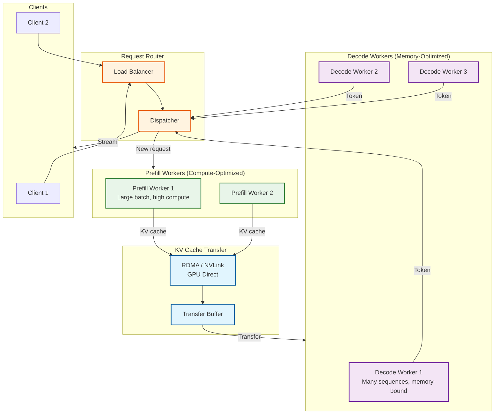

# Deep Dive and Bottlenecks

## Deep Dive 1: PagedAttention Kernel Implementation

### Why PagedAttention is Challenging

Standard attention implementations assume contiguous KV cache memory:

```
Standard Attention (Contiguous):
─────────────────────────────────
K tensor: [batch, seq_len, num_heads, head_dim]
V tensor: [batch, seq_len, num_heads, head_dim]

Memory access: Sequential, cache-friendly
GPU optimization: Highly optimized by Flash Attention
```

PagedAttention introduces indirection:

```
PagedAttention (Non-Contiguous):
─────────────────────────────────
K cache: [num_blocks, block_size, num_heads, head_dim]
V cache: [num_blocks, block_size, num_heads, head_dim]
Block table: [batch, max_blocks]  # Maps sequence to physical blocks

Memory access: Indirect through block table
Challenge: Maintain memory bandwidth efficiency with indirection
```

### PagedAttention Kernel Design

```
┌─────────────────────────────────────────────────────────────────────┐
│                PAGEDATTENTION KERNEL PSEUDOCODE                     │
├─────────────────────────────────────────────────────────────────────┤
│                                                                     │
│  KERNEL paged_attention(                                            │
│      query,        # [batch, num_q_heads, head_dim]                 │
│      k_cache,      # [num_blocks, block_size, num_kv_heads, head]   │
│      v_cache,      # [num_blocks, block_size, num_kv_heads, head]   │
│      block_tables, # [batch, max_num_blocks]                        │
│      context_lens, # [batch]                                        │
│      output        # [batch, num_q_heads, head_dim]                 │
│  ):                                                                 │
│      # Each thread block handles one query head                     │
│      batch_idx = blockIdx.x                                         │
│      head_idx = blockIdx.y                                          │
│                                                                     │
│      # Load query into registers                                    │
│      q = query[batch_idx, head_idx, :]  # [head_dim]                │
│                                                                     │
│      # Initialize accumulators                                      │
│      acc = zeros(head_dim)  # Weighted value sum                    │
│      m = -inf              # Max score for numerical stability      │
│      l = 0                 # Sum of exp(scores) for softmax         │
│                                                                     │
│      context_len = context_lens[batch_idx]                          │
│      num_blocks = CEIL(context_len / BLOCK_SIZE)                    │
│                                                                     │
│      # Process blocks in chunks for memory efficiency               │
│      FOR block_idx IN RANGE(num_blocks):                            │
│          # INDIRECTION: Look up physical block                      │
│          phys_block = block_tables[batch_idx, block_idx]            │
│                                                                     │
│          # Load K block into shared memory                          │
│          k_block = k_cache[phys_block]  # [block_size, kv_heads, d] │
│          __syncthreads()                                            │
│                                                                     │
│          # Compute QK^T for this block                              │
│          # Handle GQA: map q_head to kv_head                        │
│          kv_head = head_idx // (num_q_heads / num_kv_heads)         │
│          scores = matmul(q, k_block[:, kv_head, :].T)               │
│          scores = scores / sqrt(head_dim)                           │
│                                                                     │
│          # Mask padding positions in last block                     │
│          IF block_idx == num_blocks - 1:                            │
│              valid_tokens = context_len % BLOCK_SIZE                │
│              scores[valid_tokens:] = -inf                           │
│                                                                     │
│          # Online softmax update (Flash Attention style)            │
│          m_new = MAX(m, MAX(scores))                                │
│          l = l * exp(m - m_new) + SUM(exp(scores - m_new))          │
│          m = m_new                                                  │
│                                                                     │
│          # Load V block and accumulate                              │
│          v_block = v_cache[phys_block, :, kv_head, :]               │
│          weights = exp(scores - m)                                  │
│          acc = acc * exp(m_old - m) + matmul(weights, v_block)      │
│                                                                     │
│      # Normalize output                                             │
│      output[batch_idx, head_idx, :] = acc / l                       │
│                                                                     │
└─────────────────────────────────────────────────────────────────────┘
```

### Performance Analysis

| Aspect | Standard Attention | PagedAttention | Overhead |
|--------|-------------------|----------------|----------|
| Memory Access Pattern | Sequential | Indirect (block table lookup) | +5-10% latency |
| Memory Efficiency | 10-40% utilization | 95%+ utilization | - |
| Concurrent Requests | Limited by max_len allocation | 4-10x more | - |
| Implementation Complexity | Low | High | - |
| Flash Attention Compatible | Native | Requires adaptation | - |

**Net Impact:** ~5% latency overhead enables 4-10x throughput improvement.

---

## Deep Dive 2: Disaggregated Prefill/Decode Architecture

### The Problem: Mixed Workload Inefficiency

Prefill and decode have fundamentally different characteristics:

```
┌─────────────────────────────────────────────────────────────────────┐
│              PREFILL vs DECODE CHARACTERISTICS                      │
├─────────────────────────────────────────────────────────────────────┤
│                                                                     │
│  PREFILL PHASE:                                                     │
│  ──────────────                                                     │
│  • Process entire prompt in one forward pass                        │
│  • Compute-bound (matrix multiplications dominate)                  │
│  • High arithmetic intensity                                        │
│  • Benefits from large batch sizes (more tokens)                    │
│  • GPU compute utilization: 60-80%                                  │
│                                                                     │
│  DECODE PHASE:                                                      │
│  ─────────────                                                      │
│  • Generate one token per forward pass                              │
│  • Memory-bound (weight reads dominate)                             │
│  • Low arithmetic intensity                                         │
│  • Benefits from large batch sizes (more sequences)                 │
│  • GPU compute utilization: 10-30%                                  │
│                                                                     │
│  COMBINED SERVING PROBLEM:                                          │
│  ─────────────────────────                                          │
│  • Prefill requests block decode (head-of-line)                     │
│  • GPU alternates between compute/memory modes                      │
│  • Neither workload runs optimally                                  │
│  • Unpredictable latency (depends on prefill queue)                 │
│                                                                     │
└─────────────────────────────────────────────────────────────────────┘
```

### Disaggregated Architecture



### KV Cache Transfer Protocol

```
┌─────────────────────────────────────────────────────────────────────┐
│               KV CACHE TRANSFER PROTOCOL                            │
├─────────────────────────────────────────────────────────────────────┤
│                                                                     │
│  STEP 1: Prefill Completion                                         │
│  ─────────────────────────────                                      │
│  Prefill worker computes KV cache for prompt                        │
│  KV size = num_tokens × layers × 2 × kv_heads × head_dim × 2 bytes  │
│  Example: 1000 tokens × 80 × 2 × 8 × 128 × 2 = 328 MB               │
│                                                                     │
│  STEP 2: Transfer Initiation                                        │
│  ───────────────────────────                                        │
│  Prefill worker signals router: "Ready to transfer seq_id=X"        │
│  Router assigns decode worker based on:                             │
│      - Current load (prefer less loaded)                            │
│      - Memory availability                                          │
│      - NUMA locality (same rack preferred)                          │
│                                                                     │
│  STEP 3: GPU Direct Transfer                                        │
│  ───────────────────────────                                        │
│  Options:                                                           │
│  a) NVLink (same node): 900 GB/s, ~0.4ms for 328 MB                 │
│  b) RDMA (cross-node): 400 Gb/s, ~7ms for 328 MB                    │
│  c) PCIe + Network: 100 Gb/s, ~26ms for 328 MB                      │
│                                                                     │
│  STEP 4: Decode Worker Reception                                    │
│  ─────────────────────────────                                      │
│  Decode worker:                                                     │
│  1. Allocates blocks in local KV cache pool                         │
│  2. Receives KV data into allocated blocks                          │
│  3. Creates block table for sequence                                │
│  4. Adds sequence to decode batch                                   │
│                                                                     │
│  STEP 5: Decode Continuation                                        │
│  ─────────────────────────────                                      │
│  Sequence joins decode batch seamlessly                             │
│  Client sees token stream continue without gap                      │
│                                                                     │
└─────────────────────────────────────────────────────────────────────┘
```

### Trade-offs

| Aspect | Combined Architecture | Disaggregated Architecture |
|--------|----------------------|---------------------------|
| **TTFT** | Lower (no transfer) | Higher (+5-15ms transfer) |
| **Throughput** | Baseline | +30-50% improvement |
| **GPU Utilization** | Mixed (suboptimal) | Specialized (optimal) |
| **Latency Variance** | High (prefill interference) | Low (predictable) |
| **Complexity** | Lower | Higher (KV transfer, routing) |
| **Cost Efficiency** | Lower | Higher (better utilization) |

**Recommendation:**
- Combined: Latency-sensitive applications (real-time chat)
- Disaggregated: Throughput-focused workloads (batch processing, APIs)

---

## Deep Dive 3: Speculative Decoding Edge Cases

### Edge Case 1: High Temperature Sampling

```
┌─────────────────────────────────────────────────────────────────────┐
│         SPECULATIVE DECODING AT HIGH TEMPERATURE                    │
├─────────────────────────────────────────────────────────────────────┤
│                                                                     │
│  PROBLEM:                                                           │
│  ─────────                                                          │
│  At high temperature, probability distributions are flat            │
│  Draft model distribution diverges significantly from target        │
│                                                                     │
│  Example (temp=1.5):                                                │
│  Token: "happy"                                                     │
│  Draft prob: 0.05                                                   │
│  Target prob: 0.03                                                  │
│  Acceptance: min(1, 0.03/0.05) = 0.60                               │
│                                                                     │
│  Token: "joyful"                                                    │
│  Draft prob: 0.04                                                   │
│  Target prob: 0.08                                                  │
│  Acceptance: min(1, 0.08/0.04) = 1.0 (always accept)                │
│                                                                     │
│  But "happy" might have been sampled by draft...                    │
│  → 40% chance of rejection on this token                            │
│                                                                     │
│  EMPIRICAL ACCEPTANCE RATES:                                        │
│  ────────────────────────────                                       │
│  Temperature 0.0 (greedy): 85-95% acceptance                        │
│  Temperature 0.3:          75-85% acceptance                        │
│  Temperature 0.7:          55-70% acceptance                        │
│  Temperature 1.0:          40-55% acceptance                        │
│  Temperature 1.5:          25-40% acceptance                        │
│                                                                     │
│  SOLUTION:                                                          │
│  ─────────                                                          │
│  Disable speculative decoding when temperature > 0.7                │
│  Fallback to standard autoregressive decoding                       │
│                                                                     │
│  PSEUDOCODE:                                                        │
│  IF sampling_params.temperature > 0.7:                              │
│      use_speculation = False                                        │
│  ELIF draft_model_quality < threshold:                              │
│      use_speculation = False                                        │
│  ELSE:                                                              │
│      use_speculation = True                                         │
│                                                                     │
└─────────────────────────────────────────────────────────────────────┘
```

### Edge Case 2: Variable Acceptance in Batched Speculative Decoding

```
┌─────────────────────────────────────────────────────────────────────┐
│         BATCHED SPECULATIVE DECODING COMPLEXITY                     │
├─────────────────────────────────────────────────────────────────────┤
│                                                                     │
│  PROBLEM:                                                           │
│  ─────────                                                          │
│  Different sequences in batch accept different numbers of tokens    │
│                                                                     │
│  Example batch (k=4 speculation):                                   │
│  Sequence A: Accepts 4/4 draft tokens + 1 bonus = 5 tokens          │
│  Sequence B: Accepts 2/4 draft tokens + 1 corrected = 3 tokens      │
│  Sequence C: Rejects at position 0 = 1 corrected token              │
│                                                                     │
│  CHALLENGE:                                                         │
│  ──────────                                                         │
│  Must handle variable-length outputs within single batch            │
│  KV cache updates differ per sequence                               │
│  Next iteration starts at different positions                       │
│                                                                     │
│  SOLUTION: Iteration-Level State Tracking                           │
│  ─────────────────────────────────────────                          │
│                                                                     │
│  STRUCT SpeculativeState:                                           │
│      draft_tokens: List[int]         # Proposed tokens              │
│      accepted_count: int             # How many accepted            │
│      needs_correction: bool          # Rejected, need resample      │
│      correction_token: Optional[int] # Corrected token if rejected  │
│                                                                     │
│  PROCEDURE batched_speculative_step(sequences):                     │
│      # Phase 1: Batch draft generation                              │
│      draft_outputs = []                                             │
│      FOR seq IN sequences:                                          │
│          IF seq.use_speculation:                                    │
│              drafts = draft_model.generate(seq.context, k=4)        │
│              draft_outputs.APPEND(drafts)                           │
│          ELSE:                                                      │
│              draft_outputs.APPEND(None)                             │
│                                                                     │
│      # Phase 2: Batch verification (single target forward)          │
│      all_verify_inputs = []                                         │
│      FOR seq, drafts IN ZIP(sequences, draft_outputs):              │
│          IF drafts IS NOT None:                                     │
│              verify_input = seq.context + drafts.tokens             │
│          ELSE:                                                      │
│              verify_input = seq.context                             │
│          all_verify_inputs.APPEND(verify_input)                     │
│                                                                     │
│      target_logits = target_model.batch_forward(all_verify_inputs)  │
│                                                                     │
│      # Phase 3: Per-sequence acceptance (can be parallelized)       │
│      results = []                                                   │
│      FOR seq, drafts, logits IN ZIP(...):                           │
│          IF drafts IS NOT None:                                     │
│              accepted = verify_and_accept(drafts, logits)           │
│          ELSE:                                                      │
│              accepted = sample_single_token(logits)                 │
│          results.APPEND(accepted)                                   │
│                                                                     │
│      RETURN results                                                 │
│                                                                     │
└─────────────────────────────────────────────────────────────────────┘
```

### Edge Case 3: Draft Model Quality Degradation

```
SCENARIO: Draft model distribution shifts during generation

CAUSE:
- Draft model trained on different data distribution
- Long sequences move into out-of-distribution territory
- Certain domains (code, math) have poor draft model coverage

DETECTION:
- Monitor rolling acceptance rate
- If acceptance rate drops below 50% for N iterations:
    → Disable speculation for this sequence

ADAPTIVE SPECULATION:
    def should_speculate(seq, recent_history):
        # Window of last 10 speculation attempts
        if len(recent_history) < 10:
            return True  # Not enough data

        acceptance_rate = sum(recent_history) / len(recent_history)

        if acceptance_rate < 0.5:
            return False  # Speculation not helping
        elif acceptance_rate > 0.8:
            # Increase speculation depth
            seq.speculation_k = min(8, seq.speculation_k + 1)

        return True
```

---

## Bottleneck Analysis

### Bottleneck 1: Block Allocation Contention

**Problem:** Multiple scheduler threads compete for the global free list.

```
SYMPTOM:
- High lock contention under load
- Scheduler iteration latency increases
- 10-50% of scheduler time spent in allocation

CAUSE:
- Single global free_list with mutex
- Every allocation/deallocation acquires lock
- High-frequency operations (every token generation)

SOLUTION: Per-Worker Block Pools

    DESIGN:
    ───────
    Global Pool: [    reserved blocks for rebalancing    ]
    Worker 1:    [ local_pool_1 ] ──> [ steal if empty ]
    Worker 2:    [ local_pool_2 ] ──> [ steal if empty ]
    Worker N:    [ local_pool_N ] ──> [ steal if empty ]

    ALGORITHM:
    def allocate_block(worker_id):
        local_pool = worker_pools[worker_id]

        if local_pool.not_empty():
            return local_pool.pop()  # Fast path, no lock

        # Try to steal from other workers
        for other_worker in round_robin(workers):
            if other_worker.pool.size() > MIN_POOL_SIZE:
                stolen = other_worker.pool.steal_half()
                local_pool.extend(stolen)
                return local_pool.pop()

        # Fall back to global pool (rare)
        with global_lock:
            refill = global_pool.pop(REFILL_SIZE)
            local_pool.extend(refill)
            return local_pool.pop()

RESULTS:
- Lock contention reduced by 90%
- Allocation latency: 500ns → 50ns average
- Occasional steal overhead: 1-5μs
```

### Bottleneck 2: Prefix Cache Eviction Storms

**Problem:** Cache fills up, triggering mass eviction.

```
SYMPTOM:
- Sudden throughput drop
- Cache hit rate drops to 0%
- Many requests recompute common prefixes

CAUSE:
- LRU eviction removes recently unused but frequently needed entries
- Burst of new requests evicts all warm entries
- Cascading effect: more misses → more evictions

SOLUTION: LRU-K / SLRU Hybrid Policy

    DESIGN:
    ───────
    Probationary Segment (20%): New entries, LRU eviction
    Protected Segment (80%):    Frequently accessed, LRU-2 eviction

    ALGORITHM:
    def on_cache_access(entry):
        entry.access_count += 1
        entry.last_access = now()

        if entry.in_probationary and entry.access_count >= 2:
            # Promote to protected
            probationary.remove(entry)
            protected.add(entry)

            # Demote oldest protected if needed
            if protected.size > MAX_PROTECTED:
                oldest = protected.get_lru()
                protected.remove(oldest)
                probationary.add(oldest)
                oldest.access_count = 1

    def evict():
        # Always evict from probationary first
        if probationary.not_empty():
            victim = probationary.get_lru()
            probationary.remove(victim)
            return victim

        # If probationary empty, evict from protected (rare)
        victim = protected.get_lru_2()  # Least recent 2nd access
        protected.remove(victim)
        return victim

RESULTS:
- Eviction storms eliminated
- Frequently-used prefixes stay cached
- Hit rate improves 20-30% for bursty workloads
```

### Bottleneck 3: CUDA Launch Overhead

**Problem:** Python scheduler overhead between iterations.

```
SYMPTOM:
- GPU idle time between iterations
- Low GPU utilization (30-50%)
- Latency floor even at low load

CAUSE:
- Python interpreter overhead: 200-500μs per iteration
- CUDA kernel launch overhead: 5-20μs per kernel
- Memory allocation overhead: 10-50μs

SOLUTION: CUDA Graphs

    CONCEPT:
    ────────
    Record sequence of CUDA operations as a "graph"
    Replay graph with single launch (5μs vs 500μs)

    IMPLEMENTATION:
    def build_cuda_graphs(batch_sizes=[1, 4, 8, 16, 32]):
        graphs = {}
        for batch_size in batch_sizes:
            # Create dummy inputs
            dummy_inputs = create_dummy_batch(batch_size)

            # Warm up
            model.forward(dummy_inputs)

            # Capture
            graph = torch.cuda.CUDAGraph()
            with torch.cuda.graph(graph):
                output = model.forward(dummy_inputs)

            graphs[batch_size] = (graph, dummy_inputs, output)

        return graphs

    def decode_with_graph(real_inputs):
        batch_size = len(real_inputs)

        if batch_size in cuda_graphs:
            graph, dummy_inputs, output = cuda_graphs[batch_size]

            # Copy real inputs to captured buffers
            dummy_inputs.copy_(real_inputs)

            # Replay graph (very fast)
            graph.replay()

            return output.clone()
        else:
            # Fallback to eager mode for unusual batch sizes
            return model.forward(real_inputs)

    LIMITATIONS:
    - Fixed batch sizes (must match captured size)
    - Cannot use dynamic control flow
    - Memory layout must match capture

RESULTS:
- Decode iteration: 500μs → 50μs overhead
- GPU utilization: 50% → 80%
- Especially impactful for small batches
```

### Bottleneck 4: Memory Fragmentation

**Problem:** Free blocks become scattered, unusable for large allocations.

```
SYMPTOM:
- Allocation failures despite free memory
- Cannot admit large-context requests
- Memory utilization appears low but system reports full

CAUSE:
- Variable-length sequences release blocks non-contiguously
- Large requests need many contiguous blocks (not actually required!)
- PagedAttention should handle fragmentation, but some implementations don't

SOLUTION: Virtual Contiguity

    KEY INSIGHT:
    ─────────────
    PagedAttention doesn't need physical contiguity!
    The block table provides virtual-to-physical mapping.
    Any free block can map to any logical position.

    CORRECT IMPLEMENTATION:
    def allocate_blocks(seq, num_blocks):
        # Just grab any free blocks - contiguity not needed
        allocated = []
        for _ in range(num_blocks):
            if free_list.empty():
                return None  # True OOM
            block_id = free_list.pop()  # Any block works
            allocated.append(block_id)

        seq.block_table = allocated  # Non-contiguous is fine!
        return allocated

    WRONG IMPLEMENTATION (causes fragmentation issues):
    def allocate_blocks_wrong(seq, num_blocks):
        # DON'T DO THIS - trying to find contiguous region
        start = find_contiguous_region(num_blocks)
        if start is None:
            return None  # False OOM - blocks exist but scattered
        ...

    VERIFICATION:
    - Check if your framework correctly uses non-contiguous allocation
    - vLLM: Correct (uses any free blocks)
    - Some forks: May have bugs requiring contiguity
```

### Bottleneck Summary

| Bottleneck | Impact | Solution | Improvement |
|------------|--------|----------|-------------|
| Block allocation contention | 10-50% scheduler overhead | Per-worker pools + stealing | 90% reduction |
| Prefix cache eviction storms | Periodic throughput drops | SLRU hybrid policy | 20-30% hit rate improvement |
| CUDA launch overhead | Low GPU utilization | CUDA graphs | 10x iteration overhead reduction |
| Memory fragmentation | False OOM | Ensure non-contiguous allocation | Eliminates false failures |
