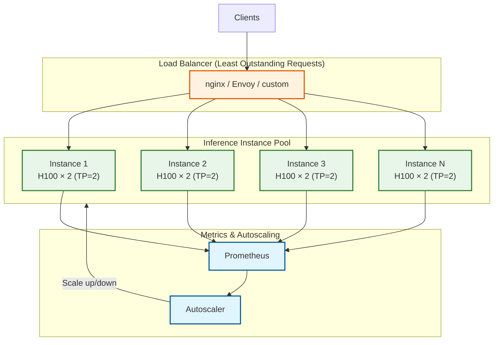
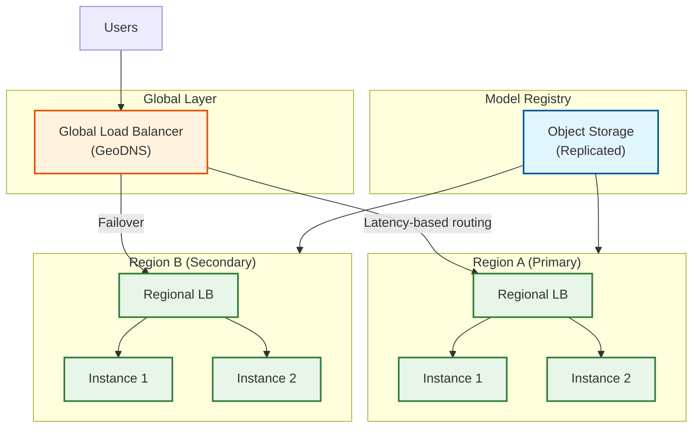

# Scalability and Reliability

## Single-Instance Scaling

### Memory Scaling: KV Cache Quantization

Reduce KV cache memory footprint to serve more concurrent requests.

```
┌─────────────────────────────────────────────────────────────────────┐
│                    KV CACHE QUANTIZATION                            │
├─────────────────────────────────────────────────────────────────────┤
│                                                                     │
│  MEMORY COMPARISON (70B model, per token):                          │
│  ──────────────────────────────────────────                         │
│  FP16 KV: 320 KB/token                                              │
│  FP8 KV:  160 KB/token (2x capacity)                                │
│  INT8 KV: 160 KB/token (2x capacity)                                │
│  INT4 KV: 80 KB/token  (4x capacity, quality tradeoff)              │
│                                                                     │
│  IMPLEMENTATION:                                                    │
│  ───────────────                                                    │
│  Per-Head Quantization (recommended):                               │
│      - Compute scale factor per attention head                      │
│      - Store: quantized_values + scale_per_head                     │
│      - Overhead: 4 bytes per head (negligible)                      │
│                                                                     │
│  QUANTIZATION DURING PREFILL:                                       │
│      def store_kv(key, value, block_id, position):                  │
│          # Compute per-head scales                                  │
│          k_scale = key.abs().max(dim=-1) / 127.0                    │
│          v_scale = value.abs().max(dim=-1) / 127.0                  │
│                                                                     │
│          # Quantize                                                 │
│          k_quant = (key / k_scale).round().clamp(-127, 127).int8()  │
│          v_quant = (value / v_scale).round().clamp(-127, 127).int8()│
│                                                                     │
│          # Store                                                    │
│          k_cache[block_id, position] = k_quant                      │
│          v_cache[block_id, position] = v_quant                      │
│          k_scales[block_id, position] = k_scale                     │
│          v_scales[block_id, position] = v_scale                     │
│                                                                     │
│  DEQUANTIZATION DURING ATTENTION:                                   │
│      def load_kv(block_id, position):                               │
│          k = k_cache[block_id, position].float() * k_scales[...]    │
│          v = v_cache[block_id, position].float() * v_scales[...]    │
│          return k, v                                                │
│                                                                     │
│  QUALITY IMPACT:                                                    │
│  ───────────────                                                    │
│  FP8 KV:  <0.1% perplexity increase (negligible)                    │
│  INT8 KV: <0.5% perplexity increase (acceptable)                    │
│  INT4 KV: 1-3% perplexity increase (use with caution)               │
│                                                                     │
└─────────────────────────────────────────────────────────────────────┘
```

### Compute Scaling: CUDA Graphs

Eliminate CPU overhead in the decode loop.

```
CUDA GRAPHS FOR DECODE OPTIMIZATION
─────────────────────────────────────

CONCEPT:
- Capture entire decode iteration as a CUDA graph
- Replay graph with single kernel launch
- Reduces CPU overhead from 500μs to 50μs

IMPLEMENTATION:
    class CUDAGraphRunner:
        def __init__(self, model, batch_sizes=[1, 2, 4, 8, 16, 32, 64]):
            self.graphs = {}
            self.input_buffers = {}
            self.output_buffers = {}

            for batch_size in batch_sizes:
                self._capture_graph(batch_size)

        def _capture_graph(self, batch_size):
            # Create persistent buffers
            input_ids = torch.zeros(batch_size, 1, dtype=torch.long, device='cuda')
            positions = torch.zeros(batch_size, dtype=torch.long, device='cuda')

            # Warm up (required before capture)
            for _ in range(3):
                _ = self.model.decode_forward(input_ids, positions)

            # Capture graph
            graph = torch.cuda.CUDAGraph()
            with torch.cuda.graph(graph):
                output = self.model.decode_forward(input_ids, positions)

            self.graphs[batch_size] = graph
            self.input_buffers[batch_size] = (input_ids, positions)
            self.output_buffers[batch_size] = output

        def run(self, real_input_ids, real_positions):
            batch_size = len(real_input_ids)

            if batch_size in self.graphs:
                # Copy inputs to captured buffers
                input_ids, positions = self.input_buffers[batch_size]
                input_ids.copy_(real_input_ids)
                positions.copy_(real_positions)

                # Replay graph
                self.graphs[batch_size].replay()

                # Return output (shares memory with captured buffer)
                return self.output_buffers[batch_size]
            else:
                # Fallback to eager execution
                return self.model.decode_forward(real_input_ids, real_positions)

LIMITATIONS:
1. Fixed batch sizes - must match captured graph
2. No dynamic control flow during graph execution
3. All inputs must have same shape as capture
4. Memory addresses are fixed (input buffers reused)

WORKAROUNDS:
- Capture graphs for power-of-2 batch sizes
- Pad to nearest captured size
- Fallback to eager for edge cases
```

### Attention Backend Optimizations

```
ATTENTION BACKEND SELECTION
────────────────────────────

| Backend | Best For | Requirements |
|---------|----------|--------------|
| Flash Attention 2 | Long contexts, high batch | Ampere+ GPU |
| Flash Attention 3 | Hopper optimization | H100/H200 |
| FlashInfer | Variable sequence lengths | CUDA 12+ |
| PagedAttention | Memory efficiency | vLLM integration |
| xFormers | Flexibility | PyTorch ecosystem |

FLASH ATTENTION BENEFITS:
- 2-4x faster than standard attention
- 5-20x memory reduction (no O(n²) attention matrix)
- Fused kernel: QKV projection + attention + output projection

CONFIGURATION:
    # vLLM attention backend selection
    vllm serve model_name \
        --attention-backend FLASH_ATTN \
        --enable-chunked-prefill \
        --max-num-batched-tokens 8192

    # SGLang with FlashInfer
    python -m sglang.launch_server \
        --model model_name \
        --attention-backend flashinfer
```

---

## Multi-Instance Scaling

### Horizontal Scaling Pattern



### Load Balancing Strategies

| Strategy | Description | Best For |
|----------|-------------|----------|
| **Round Robin** | Distribute evenly | Uniform request sizes |
| **Least Connections** | Route to least busy | Variable request sizes |
| **Least Outstanding Requests** | Route to instance with fewest pending | LLM inference (accounts for in-flight) |
| **Weighted** | Proportional to capacity | Heterogeneous instances |
| **Session Affinity** | Same client to same instance | Stateful conversations |

**Recommended: Least Outstanding Requests (LOR)**

```
ALGORITHM least_outstanding_requests_lb():
    """Select instance with fewest in-flight requests."""

    def select_instance():
        min_outstanding = infinity
        selected = None

        for instance in healthy_instances:
            outstanding = instance.pending_requests + instance.active_requests

            if outstanding < min_outstanding:
                min_outstanding = outstanding
                selected = instance

        return selected

    # Health check integration
    def health_check(instance):
        # Check GPU health
        if not instance.gpu_healthy():
            return False

        # Check recent error rate
        if instance.error_rate_5m > 0.01:  # >1% errors
            return False

        # Check latency
        if instance.p99_ttft > 500:  # >500ms TTFT
            return False

        return True
```

### Autoscaling Policies

```
┌─────────────────────────────────────────────────────────────────────┐
│                    AUTOSCALING CONFIGURATION                        │
├─────────────────────────────────────────────────────────────────────┤
│                                                                     │
│  SCALE-UP TRIGGERS:                                                 │
│  ──────────────────                                                 │
│  1. Latency-based:                                                  │
│     IF p99_ttft > 300ms FOR 60 seconds:                             │
│         scale_up(1)                                                 │
│                                                                     │
│  2. Utilization-based:                                              │
│     IF gpu_utilization > 85% FOR 120 seconds:                       │
│         scale_up(1)                                                 │
│                                                                     │
│  3. Queue-based:                                                    │
│     IF waiting_queue_size > 100 FOR 30 seconds:                     │
│         scale_up(2)  # Aggressive scaling                           │
│                                                                     │
│  SCALE-DOWN TRIGGERS:                                               │
│  ────────────────────                                               │
│  1. Utilization-based:                                              │
│     IF gpu_utilization < 30% FOR 600 seconds:                       │
│         scale_down(1)                                               │
│                                                                     │
│  2. Minimum instances:                                              │
│     NEVER scale below min_instances (availability)                  │
│                                                                     │
│  COOLDOWN PERIODS:                                                  │
│  ─────────────────                                                  │
│  Scale-up cooldown:   60 seconds                                    │
│  Scale-down cooldown: 300 seconds                                   │
│                                                                     │
│  INSTANCE WARM-UP:                                                  │
│  ─────────────────                                                  │
│  New instance warm-up: 90 seconds (model loading + warmup)          │
│  Don't route traffic until warm                                     │
│                                                                     │
└─────────────────────────────────────────────────────────────────────┘
```

---

## Tensor Parallelism Scaling

### Intra-Node TP (NVLink)

For models that don't fit on single GPU.

```
TENSOR PARALLELISM WITHIN NODE
──────────────────────────────

TOPOLOGY: 8x H100 SXM connected via NVLink (900 GB/s per GPU)

TP=2 CONFIGURATION (70B FP16):
    GPU 0: Layers 0-79, Heads 0-31
    GPU 1: Layers 0-79, Heads 32-63

    Communication per layer:
    - AllReduce after attention: 2 × batch × seq × hidden
    - AllReduce after MLP: 2 × batch × seq × hidden

    Overhead (1K tokens, batch=1):
    - Data: 2 × 1000 × 8192 × 2 bytes = 32 MB per AllReduce
    - Time: 32 MB / 900 GB/s = 0.036 ms per AllReduce
    - Total: 80 layers × 2 AllReduce × 0.036 ms = 5.7 ms
    - Impact: ~25% latency overhead for 50% memory reduction

TP=4 CONFIGURATION (70B FP16, lower latency):
    Each GPU: 25% of attention heads, 25% of MLP

    Communication overhead: ~10 ms (more AllReduce operations)
    Benefit: 4x memory per GPU, lower per-GPU compute

TP=8 CONFIGURATION (405B model):
    Required for very large models
    Communication overhead: ~15 ms
    Full node utilization

BEST PRACTICE:
- TP = minimum needed to fit model + KV cache
- More TP = lower latency but worse throughput efficiency
- For latency: prefer higher TP
- For throughput: prefer lower TP with more instances
```

### Inter-Node PP (InfiniBand)

For models requiring multiple nodes.

```
PIPELINE PARALLELISM ACROSS NODES
─────────────────────────────────

TOPOLOGY: Multiple nodes connected via InfiniBand (400 Gb/s)

PP=2 CONFIGURATION (405B FP16, 2 nodes):
    Node 1: Layers 0-59 (GPU 0-7, TP=8)
    Node 2: Layers 60-119 (GPU 0-7, TP=8)

    Communication:
    - Point-to-point send after each PP stage
    - Data: batch × seq × hidden = 16 MB per microbatch
    - Time: 16 MB / 50 GB/s = 0.32 ms per transfer

    Pipeline Bubble:
    - Warmup: (PP-1) microbatches
    - Cooldown: (PP-1) microbatches
    - Efficiency: num_microbatches / (num_microbatches + PP - 1)
    - With 8 microbatches, PP=2: 8/9 = 89% efficiency

CONFIGURATION RECOMMENDATIONS:
    | Model Size | TP | PP | Total GPUs |
    |------------|----|----|------------|
    | 7B         | 1  | 1  | 1          |
    | 70B FP16   | 2  | 1  | 2          |
    | 70B INT8   | 1  | 1  | 1          |
    | 405B FP16  | 8  | 2  | 16         |
    | 405B INT8  | 8  | 1  | 8          |

RULE OF THUMB:
- TP = GPUs per node (NVLink communication)
- PP = Number of nodes (InfiniBand communication)
```

---

## Fault Tolerance

### GPU Failure Handling

```
┌─────────────────────────────────────────────────────────────────────┐
│                    GPU FAILURE HANDLING                             │
├─────────────────────────────────────────────────────────────────────┤
│                                                                     │
│  DETECTION MECHANISMS:                                              │
│  ─────────────────────                                              │
│  1. CUDA Error: cudaErrorDeviceUnifiedAddressingNotSupported, etc.  │
│  2. NCCL Timeout: AllReduce doesn't complete within 60s             │
│  3. Health Check Failure: Periodic GPU memory/compute test          │
│  4. Watchdog: No progress in scheduler for 30s                      │
│                                                                     │
│  RESPONSE PROTOCOL:                                                 │
│  ──────────────────                                                 │
│  1. DETECTION (0-5s):                                               │
│     - Error caught by CUDA runtime or NCCL                          │
│     - Instance marked as unhealthy                                  │
│                                                                     │
│  2. ISOLATION (0-1s):                                               │
│     - Stop accepting new requests (health check fails)              │
│     - Load balancer routes away from instance                       │
│                                                                     │
│  3. IN-FLIGHT HANDLING (0-5s):                                      │
│     - Attempt graceful completion of decode sequences               │
│     - If impossible, abort with error response                      │
│     - Client receives 503 with retry hint                           │
│                                                                     │
│  4. RECOVERY (30-90s):                                              │
│     - Restart inference engine process                              │
│     - Reload model weights from disk/cache                          │
│     - Warm up with test requests                                    │
│     - Re-enable in load balancer                                    │
│                                                                     │
│  MULTI-GPU TP FAILURE:                                              │
│  ─────────────────────                                              │
│  If one GPU in TP group fails:                                      │
│  - Entire instance must restart (NCCL requires all ranks)           │
│  - No partial recovery possible                                     │
│  - Consider N+1 redundancy at instance level                        │
│                                                                     │
└─────────────────────────────────────────────────────────────────────┘
```

### Request-Level Fault Tolerance

```
CLIENT-SIDE RETRY STRATEGY
──────────────────────────

RETRY POLICY:
    max_retries = 3
    base_delay = 100ms
    max_delay = 5s
    jitter = 0.1  # 10% randomization

    def request_with_retry(prompt, params):
        for attempt in range(max_retries + 1):
            try:
                response = inference_api.generate(prompt, params)
                return response

            except RetryableError as e:
                if attempt == max_retries:
                    raise

                delay = min(base_delay * (2 ** attempt), max_delay)
                delay *= (1 + random.uniform(-jitter, jitter))
                sleep(delay)

            except NonRetryableError:
                raise  # Don't retry auth errors, invalid params, etc.

RETRYABLE ERRORS:
- 503 Service Unavailable
- 429 Too Many Requests
- 504 Gateway Timeout
- Connection reset
- NCCL timeout

NON-RETRYABLE ERRORS:
- 400 Bad Request
- 401 Unauthorized
- 413 Payload Too Large
- Invalid sampling parameters

STREAMING RETRY CONSIDERATIONS:
- If failure during streaming, client sees partial response
- Options:
  a) Restart from beginning (simple but wasteful)
  b) Resume from last token (requires server support)
  c) Accept partial response (application-dependent)
```

### Graceful Degradation

```
DEGRADATION STRATEGIES
──────────────────────

SCENARIO 1: High Load (queue building up)
    Actions:
    1. Reduce max_tokens limit (faster completion)
    2. Disable speculative decoding (save compute)
    3. Increase batching delay (better throughput)
    4. Reject low-priority requests (503)

SCENARIO 2: Memory Pressure (OOM risk)
    Actions:
    1. Aggressive preemption (swap to CPU)
    2. Reduce max concurrent requests
    3. Shorten context limit
    4. Enable KV cache quantization

SCENARIO 3: Partial Cluster Failure
    Actions:
    1. Route to healthy instances
    2. Accept higher latency (fewer instances)
    3. Enable request queuing at load balancer
    4. Alert operations team

IMPLEMENTATION:
    class DegradationController:
        def check_and_degrade(self, metrics):
            if metrics.queue_size > 100:
                self.reduce_max_tokens(512)  # From 2048

            if metrics.memory_usage > 0.95:
                self.enable_aggressive_preemption()

            if metrics.healthy_instances < self.min_instances:
                self.enable_request_queuing()
                self.alert_oncall()
```

---

## Disaster Recovery

### RTO/RPO for Inference

```
┌─────────────────────────────────────────────────────────────────────┐
│                    DISASTER RECOVERY TARGETS                        │
├─────────────────────────────────────────────────────────────────────┤
│                                                                     │
│  RTO (Recovery Time Objective): 5 minutes                           │
│  ─────────────────────────────────────────                          │
│  Breakdown:                                                         │
│  - Failure detection: 30 seconds                                    │
│  - DNS/LB failover: 30 seconds                                      │
│  - Standby instance activation: 60 seconds                          │
│  - Model loading: 90 seconds (cached weights)                       │
│  - Health check pass: 30 seconds                                    │
│  - Buffer: 60 seconds                                               │
│                                                                     │
│  RPO (Recovery Point Objective): 0 (stateless)                      │
│  ───────────────────────────────────────────────                    │
│  LLM inference is stateless - no data to lose                       │
│  Requests in flight may be lost (client retries)                    │
│                                                                     │
│  STRATEGIES:                                                        │
│  ───────────                                                        │
│  1. Multi-AZ deployment (same region failover)                      │
│  2. Multi-region deployment (geographic failover)                   │
│  3. Warm standby (pre-loaded models, not serving)                   │
│  4. Cold standby (instances ready, models not loaded)               │
│                                                                     │
└─────────────────────────────────────────────────────────────────────┘
```

### Multi-Region Architecture


