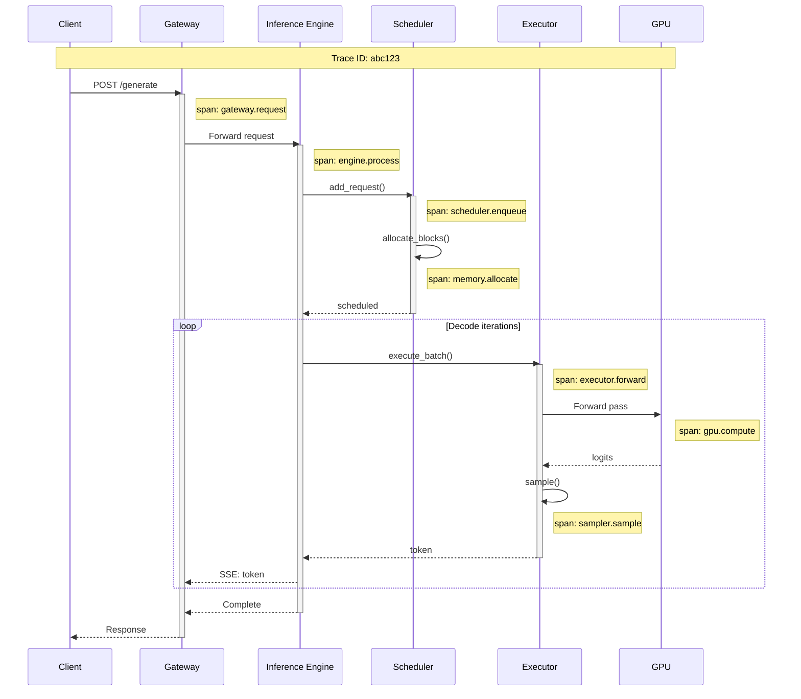

# Observability

## Core Metrics

### Scheduler Metrics

```
┌─────────────────────────────────────────────────────────────────────┐
│                      SCHEDULER METRICS                              │
├─────────────────────────────────────────────────────────────────────┤
│                                                                     │
│  QUEUE METRICS (Gauges):                                            │
│  ───────────────────────                                            │
│  scheduler_waiting_queue_size                                       │
│      Description: Requests waiting for GPU memory allocation        │
│      Labels: none                                                   │
│      Alert: > 100 for 60s → scale up                                │
│                                                                     │
│  scheduler_running_batch_size                                       │
│      Description: Sequences actively being processed                │
│      Labels: none                                                   │
│      Target: Maximize without exceeding memory                      │
│                                                                     │
│  scheduler_swapped_queue_size                                       │
│      Description: Sequences preempted to CPU memory                 │
│      Labels: none                                                   │
│      Alert: > 50 sustained → memory pressure                        │
│                                                                     │
│  TIMING METRICS (Histograms):                                       │
│  ────────────────────────────                                       │
│  scheduler_iteration_latency_seconds                                │
│      Description: Time for one scheduler step                       │
│      Buckets: [0.0001, 0.0005, 0.001, 0.005, 0.01, 0.05]            │
│      Target: p99 < 1ms                                              │
│      Alert: p99 > 5ms → scheduler bottleneck                        │
│                                                                     │
│  scheduler_allocation_latency_seconds                               │
│      Description: Time to allocate blocks for new sequence          │
│      Buckets: [0.00001, 0.0001, 0.0005, 0.001]                      │
│      Target: p99 < 100μs                                            │
│                                                                     │
│  COUNTER METRICS:                                                   │
│  ────────────────                                                   │
│  scheduler_preemptions_total                                        │
│      Description: Total sequences preempted                         │
│      Labels: reason (memory_pressure, priority)                     │
│      Alert: > 10/min sustained → capacity issue                     │
│                                                                     │
│  scheduler_sequences_finished_total                                 │
│      Description: Total sequences completed                         │
│      Labels: finish_reason (stop, length, abort)                    │
│                                                                     │
└─────────────────────────────────────────────────────────────────────┘
```

### Memory Metrics

```
┌─────────────────────────────────────────────────────────────────────┐
│                       MEMORY METRICS                                │
├─────────────────────────────────────────────────────────────────────┤
│                                                                     │
│  KV CACHE METRICS:                                                  │
│  ─────────────────                                                  │
│  kv_cache_blocks_total                                              │
│      Description: Total physical blocks in pool                     │
│      Type: Gauge                                                    │
│                                                                     │
│  kv_cache_blocks_used                                               │
│      Description: Currently allocated blocks                        │
│      Type: Gauge                                                    │
│      Alert: > 95% of total for 60s → memory pressure                │
│                                                                     │
│  kv_cache_utilization_ratio                                         │
│      Description: blocks_used / blocks_total                        │
│      Type: Gauge                                                    │
│      Target: 70-90% for optimal throughput                          │
│                                                                     │
│  PREFIX CACHE METRICS:                                              │
│  ─────────────────────                                              │
│  prefix_cache_entries                                               │
│      Description: Number of cached prefix entries                   │
│      Type: Gauge                                                    │
│                                                                     │
│  prefix_cache_hit_total                                             │
│      Description: Cache hits                                        │
│      Type: Counter                                                  │
│                                                                     │
│  prefix_cache_miss_total                                            │
│      Description: Cache misses                                      │
│      Type: Counter                                                  │
│                                                                     │
│  prefix_cache_hit_rate                                              │
│      Description: hit / (hit + miss) over window                    │
│      Type: Gauge (derived)                                          │
│      Target: > 30% for repetitive workloads                         │
│                                                                     │
│  prefix_cache_evictions_total                                       │
│      Description: Entries evicted due to memory pressure            │
│      Type: Counter                                                  │
│      Alert: > 100/min → cache too small                             │
│                                                                     │
│  GPU MEMORY METRICS:                                                │
│  ───────────────────                                                │
│  gpu_memory_used_bytes                                              │
│      Description: Total GPU memory in use                           │
│      Type: Gauge                                                    │
│      Labels: gpu_id                                                 │
│                                                                     │
│  gpu_memory_allocated_bytes                                         │
│      Description: Memory allocated by framework                     │
│      Type: Gauge                                                    │
│      Labels: gpu_id, category (model, kv_cache, activations)        │
│                                                                     │
└─────────────────────────────────────────────────────────────────────┘
```

### Execution Metrics

```
┌─────────────────────────────────────────────────────────────────────┐
│                      EXECUTION METRICS                              │
├─────────────────────────────────────────────────────────────────────┤
│                                                                     │
│  THROUGHPUT METRICS:                                                │
│  ───────────────────                                                │
│  prefill_tokens_total                                               │
│      Description: Total prompt tokens processed                     │
│      Type: Counter                                                  │
│                                                                     │
│  decode_tokens_total                                                │
│      Description: Total output tokens generated                     │
│      Type: Counter                                                  │
│                                                                     │
│  tokens_per_second                                                  │
│      Description: Throughput over sliding window                    │
│      Type: Gauge                                                    │
│      Labels: phase (prefill, decode, combined)                      │
│      Target: > 50,000 for 70B on H100                               │
│                                                                     │
│  LATENCY METRICS:                                                   │
│  ────────────────                                                   │
│  time_to_first_token_seconds                                        │
│      Description: Time from request to first token                  │
│      Type: Histogram                                                │
│      Buckets: [0.05, 0.1, 0.2, 0.5, 1.0, 2.0, 5.0]                  │
│      Target: p99 < 200ms                                            │
│      Alert: p99 > 500ms → investigate                               │
│                                                                     │
│  inter_token_latency_seconds                                        │
│      Description: Time between consecutive tokens                   │
│      Type: Histogram                                                │
│      Buckets: [0.01, 0.02, 0.05, 0.1, 0.2]                          │
│      Target: p99 < 50ms                                             │
│                                                                     │
│  request_latency_seconds                                            │
│      Description: Total request time                                │
│      Type: Histogram                                                │
│      Labels: output_token_bucket (1-10, 10-50, 50-100, 100+)        │
│                                                                     │
│  SPECULATIVE DECODING METRICS:                                      │
│  ─────────────────────────────                                      │
│  speculative_acceptance_rate                                        │
│      Description: Accepted draft tokens / proposed draft tokens     │
│      Type: Gauge                                                    │
│      Target: > 70% for effective speculation                        │
│      Alert: < 50% → consider disabling                              │
│                                                                     │
│  speculative_tokens_accepted_total                                  │
│      Description: Draft tokens accepted                             │
│      Type: Counter                                                  │
│                                                                     │
│  speculative_tokens_rejected_total                                  │
│      Description: Draft tokens rejected                             │
│      Type: Counter                                                  │
│                                                                     │
│  GPU UTILIZATION:                                                   │
│  ────────────────                                                   │
│  gpu_compute_utilization                                            │
│      Description: GPU SM utilization percentage                     │
│      Type: Gauge                                                    │
│      Labels: gpu_id                                                 │
│      Target: > 70% during active serving                            │
│                                                                     │
│  gpu_memory_bandwidth_utilization                                   │
│      Description: HBM bandwidth utilization                         │
│      Type: Gauge                                                    │
│      Labels: gpu_id                                                 │
│      Note: High during decode (memory-bound)                        │
│                                                                     │
└─────────────────────────────────────────────────────────────────────┘
```

---

## Distributed Tracing

### Request Lifecycle Spans



### Span Definitions

```
TRACE STRUCTURE
───────────────

trace_id: Unique identifier for entire request
span_id: Unique identifier for each operation
parent_span_id: Links child spans to parent

STANDARD SPANS:

1. gateway.request
   - Duration: Full request time
   - Attributes: user_id, model, prompt_tokens, max_tokens

2. engine.process
   - Duration: Engine processing time
   - Attributes: request_id, status

3. scheduler.enqueue
   - Duration: Time in waiting queue
   - Attributes: queue_position

4. memory.allocate
   - Duration: Block allocation time
   - Attributes: blocks_allocated, blocks_available

5. executor.forward
   - Duration: Single forward pass
   - Attributes: batch_size, sequence_lengths

6. gpu.compute
   - Duration: GPU kernel execution
   - Attributes: kernel_name, gpu_id

7. sampler.sample
   - Duration: Token sampling
   - Attributes: temperature, top_p, token_id

EXAMPLE TRACE (JSON):
{
    "trace_id": "abc123",
    "spans": [
        {
            "span_id": "span1",
            "name": "gateway.request",
            "start_time": "2024-01-15T10:00:00.000Z",
            "end_time": "2024-01-15T10:00:02.500Z",
            "attributes": {
                "user_id": "user456",
                "model": "llama-70b",
                "prompt_tokens": 512,
                "output_tokens": 100,
                "status": "success"
            }
        },
        {
            "span_id": "span2",
            "parent_span_id": "span1",
            "name": "engine.process",
            "start_time": "2024-01-15T10:00:00.005Z",
            "end_time": "2024-01-15T10:00:02.495Z",
            "attributes": {
                "ttft_ms": 95,
                "total_tokens": 612
            }
        }
        // ... more spans
    ]
}
```

---

## Debugging Techniques

### Memory Leak Detection

```
SYMPTOM: kv_cache_blocks_used grows without bound

DIAGNOSTIC STEPS:

1. CHECK REFERENCE COUNTS:
   def audit_block_refs():
       orphaned_blocks = []
       for block_id, block in enumerate(physical_blocks):
           if block.is_allocated and block.ref_count == 0:
               orphaned_blocks.append(block_id)

       if orphaned_blocks:
           log.error(f"Orphaned blocks (allocated but 0 refs): {orphaned_blocks}")

       # Sum of ref counts should equal blocks in use
       total_refs = sum(b.ref_count for b in physical_blocks if b.is_allocated)
       expected_refs = sum(len(seq.block_table) for seq in all_sequences)

       if total_refs != expected_refs:
           log.error(f"Ref count mismatch: {total_refs} vs {expected_refs}")

2. TRACK ALLOCATIONS:
   class DebugBlockAllocator:
       def __init__(self):
           self.allocation_log = []

       def allocate(self, seq_id, num_blocks):
           blocks = super().allocate(num_blocks)
           self.allocation_log.append({
               "time": now(),
               "action": "allocate",
               "seq_id": seq_id,
               "blocks": blocks,
               "stack": traceback.format_stack()
           })
           return blocks

       def free(self, seq_id, blocks):
           self.allocation_log.append({
               "time": now(),
               "action": "free",
               "seq_id": seq_id,
               "blocks": blocks
           })
           super().free(blocks)

       def dump_log(self):
           # Find allocations without corresponding frees
           allocated = {}
           for entry in self.allocation_log:
               if entry["action"] == "allocate":
                   allocated[entry["seq_id"]] = entry
               else:
                   allocated.pop(entry["seq_id"], None)

           for seq_id, entry in allocated.items():
               log.warning(f"Leaked allocation for {seq_id}: {entry}")

3. PERIODIC AUDIT:
   Schedule audit_block_refs() every 60 seconds
   Alert if any orphaned blocks detected
```

### Scheduler Stall Diagnosis

```
SYMPTOM: scheduler_iteration_latency_ms spikes

DIAGNOSTIC STEPS:

1. PROFILE SCHEDULER STEP:
   def profiled_scheduler_step():
       timings = {}

       t0 = time.perf_counter()
       finished = collect_finished_sequences()
       timings["collect_finished"] = time.perf_counter() - t0

       t0 = time.perf_counter()
       allocate_for_running()
       timings["allocate_running"] = time.perf_counter() - t0

       t0 = time.perf_counter()
       admit_waiting()
       timings["admit_waiting"] = time.perf_counter() - t0

       t0 = time.perf_counter()
       build_batch()
       timings["build_batch"] = time.perf_counter() - t0

       # Log if any phase exceeds threshold
       for phase, duration in timings.items():
           if duration > 0.001:  # 1ms
               log.warning(f"Scheduler phase {phase} took {duration*1000:.2f}ms")

       return timings

2. CHECK PYTHON GIL:
   - High GIL contention from tokenizer or logging
   - Solution: Move tokenization to separate process

3. CHECK LOCK CONTENTION:
   - Block allocator lock contention
   - Solution: Per-worker block pools

4. CHECK I/O BOTTLENECK:
   - Swap operations blocking scheduler
   - Solution: Async swap, don't block on I/O

COMMON CAUSES:
| Cause | Symptom | Solution |
|-------|---------|----------|
| GIL contention | High Python CPU | Multiprocess tokenizer |
| Lock contention | High wait time | Per-worker pools |
| Swap I/O | Spiky latency | Async swap |
| Large batch | Linear growth | Batch size limit |
```

### Performance Profiling

```
NVIDIA NSIGHT SYSTEMS PROFILING
───────────────────────────────

CAPTURE PROFILE:
    nsys profile -o inference_profile \
        --trace=cuda,nvtx,osrt \
        --cuda-memory-usage=true \
        python serve.py --model llama-70b

ANALYZE:
    nsys stats inference_profile.nsys-rep

KEY THINGS TO LOOK FOR:

1. GPU IDLE TIME:
   - Gaps between kernels = CPU overhead
   - Solution: CUDA graphs, reduce Python

2. MEMORY TRANSFERS:
   - Unexpected H2D or D2H transfers
   - Solution: Pre-allocate, avoid dynamic allocation

3. KERNEL DURATION:
   - Which kernels dominate?
   - Attention kernel should be primary

4. CUDA STREAM UTILIZATION:
   - Are streams overlapping properly?
   - Prefill/decode should overlap when disaggregated

CUSTOM INSTRUMENTATION:
    import torch.cuda.nvtx as nvtx

    def forward_pass(inputs):
        with nvtx.range("prefill"):
            kv = compute_kv(inputs)

        with nvtx.range("decode"):
            for i in range(max_tokens):
                with nvtx.range(f"decode_step_{i}"):
                    token = decode_step(kv)
```

---

## Alerting Configuration

### Critical Alerts (Page-Worthy)

| Alert | Condition | Severity | Action |
|-------|-----------|----------|--------|
| High TTFT | p99_ttft > 500ms for 5min | Critical | Scale up, investigate |
| Memory Exhaustion | kv_cache_utilization > 98% for 2min | Critical | Scale up, reduce batch |
| GPU Failure | gpu_health_check failed | Critical | Failover, restart |
| Request Failures | error_rate > 5% for 3min | Critical | Investigate, rollback |
| Scheduler Stall | iteration_latency > 50ms for 1min | Critical | Restart engine |

### Warning Alerts

| Alert | Condition | Severity | Action |
|-------|-----------|----------|--------|
| Elevated TTFT | p99_ttft > 300ms for 10min | Warning | Monitor, prepare scale |
| Memory Pressure | kv_cache_utilization > 90% for 5min | Warning | Monitor, prepare scale |
| High Preemption | preemption_rate > 5/min for 10min | Warning | Increase capacity |
| Low Cache Hit | prefix_cache_hit_rate < 20% for 30min | Warning | Check workload patterns |
| Speculation Ineffective | acceptance_rate < 50% for 10min | Warning | Consider disabling |

### Alert Configuration Example

```yaml
# Prometheus alerting rules
groups:
  - name: llm_inference_critical
    rules:
      - alert: HighTTFT
        expr: histogram_quantile(0.99, rate(time_to_first_token_seconds_bucket[5m])) > 0.5
        for: 5m
        labels:
          severity: critical
        annotations:
          summary: "High time to first token"
          description: "p99 TTFT is {{ $value }}s, exceeds 500ms threshold"

      - alert: MemoryExhaustion
        expr: kv_cache_blocks_used / kv_cache_blocks_total > 0.98
        for: 2m
        labels:
          severity: critical
        annotations:
          summary: "KV cache near exhaustion"
          description: "KV cache utilization is {{ $value | humanizePercentage }}"

      - alert: GPUFailure
        expr: gpu_health_status == 0
        for: 30s
        labels:
          severity: critical
        annotations:
          summary: "GPU health check failed"
          description: "GPU {{ $labels.gpu_id }} is unhealthy"

  - name: llm_inference_warning
    rules:
      - alert: ElevatedTTFT
        expr: histogram_quantile(0.99, rate(time_to_first_token_seconds_bucket[5m])) > 0.3
        for: 10m
        labels:
          severity: warning
        annotations:
          summary: "Elevated time to first token"

      - alert: MemoryPressure
        expr: kv_cache_blocks_used / kv_cache_blocks_total > 0.90
        for: 5m
        labels:
          severity: warning
        annotations:
          summary: "KV cache under pressure"
```

---

## Dashboard Layout

```
┌─────────────────────────────────────────────────────────────────────┐
│                    LLM INFERENCE DASHBOARD                          │
├─────────────────────────────────────────────────────────────────────┤
│                                                                     │
│  ROW 1: KEY METRICS (Single Stats)                                  │
│  ┌──────────┬──────────┬──────────┬──────────┬──────────┐           │
│  │ TTFT p99 │ TPS      │ GPU Util │ KV Cache │ Error %  │           │
│  │ 145ms    │ 52,340   │ 78%      │ 82%      │ 0.02%    │           │
│  └──────────┴──────────┴──────────┴──────────┴──────────┘           │
│                                                                     │
│  ROW 2: LATENCY CHARTS                                              │
│  ┌─────────────────────────────┬─────────────────────────────┐      │
│  │  TTFT Distribution          │  Inter-Token Latency        │      │
│  │  [Histogram over time]      │  [Line chart p50/p99]       │      │
│  └─────────────────────────────┴─────────────────────────────┘      │
│                                                                     │
│  ROW 3: THROUGHPUT & QUEUES                                         │
│  ┌─────────────────────────────┬─────────────────────────────┐      │
│  │  Tokens/Second              │  Queue Sizes                │      │
│  │  [Stacked: prefill/decode]  │  [Lines: wait/run/swap]     │      │
│  └─────────────────────────────┴─────────────────────────────┘      │
│                                                                     │
│  ROW 4: MEMORY & GPU                                                │
│  ┌─────────────────────────────┬─────────────────────────────┐      │
│  │  KV Cache Utilization       │  GPU Metrics                │      │
│  │  [Gauge + timeline]         │  [Multi-line per GPU]       │      │
│  └─────────────────────────────┴─────────────────────────────┘      │
│                                                                     │
│  ROW 5: CACHE & SPECULATION                                         │
│  ┌─────────────────────────────┬─────────────────────────────┐      │
│  │  Prefix Cache Hit Rate      │  Speculative Acceptance     │      │
│  │  [Line chart]               │  [Line chart + threshold]   │      │
│  └─────────────────────────────┴─────────────────────────────┘      │
│                                                                     │
└─────────────────────────────────────────────────────────────────────┘
```
