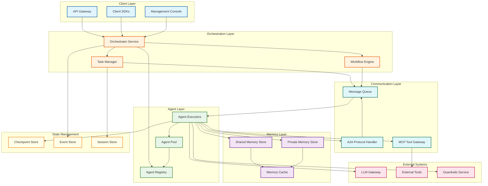
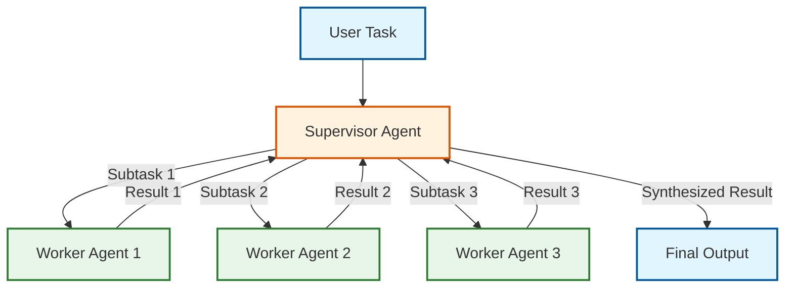
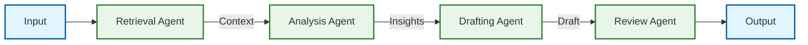
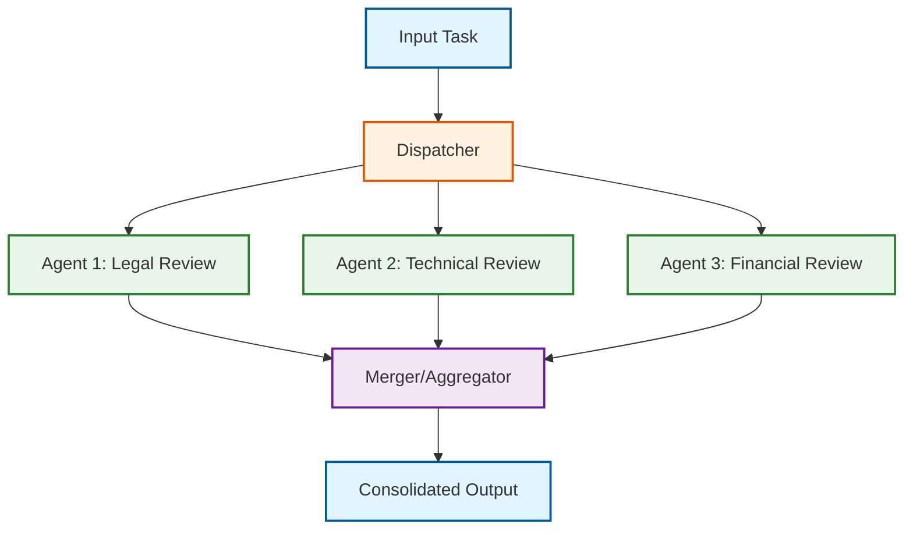
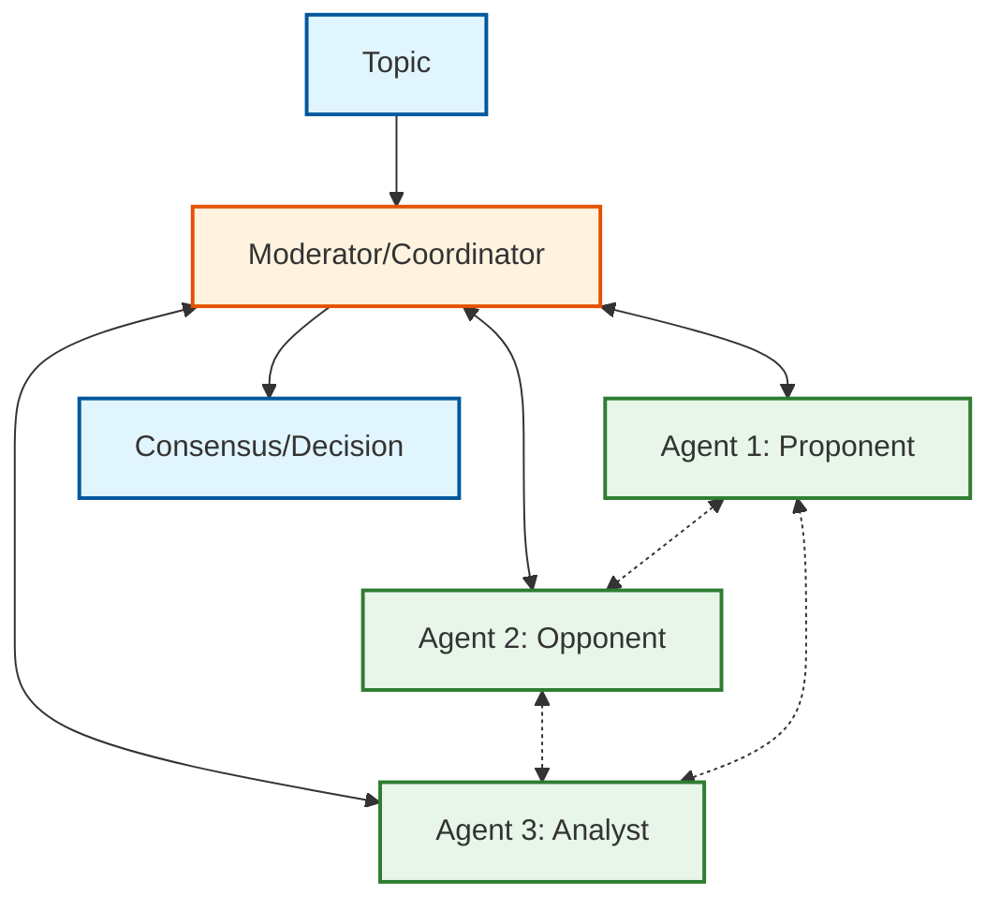
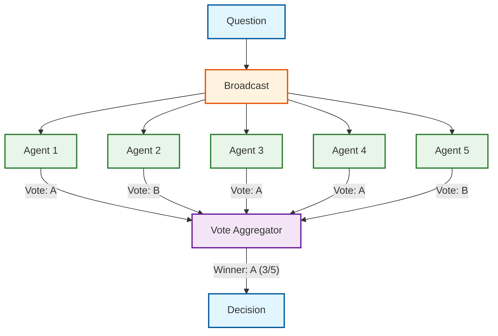
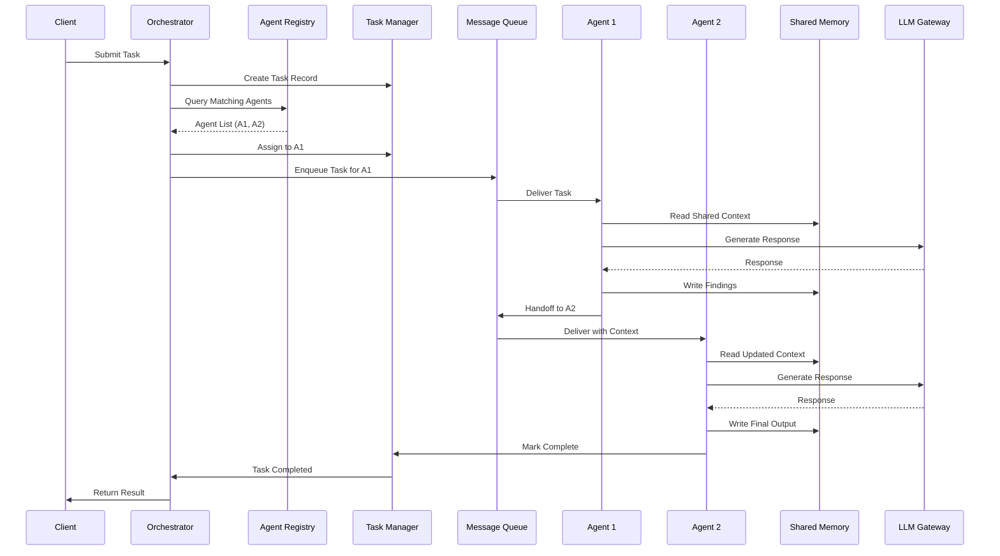
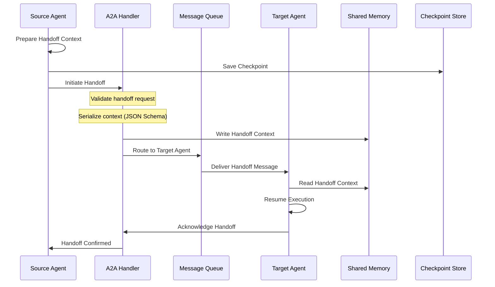

# High-Level Design

## System Architecture



---

## Core Components

### 1. Orchestrator Service

The central brain coordinating multi-agent workflows.

| Responsibility | Description |
|----------------|-------------|
| Task intake | Receive and validate task submissions |
| Workflow planning | Decompose complex tasks into agent-executable units |
| Agent selection | Match tasks to agents based on capabilities |
| Execution coordination | Manage workflow execution across agents |
| Result synthesis | Aggregate outputs from multiple agents |

### 2. Agent Registry

Maintains the catalog of available agents and their capabilities.

| Data | Description |
|------|-------------|
| Agent metadata | ID, name, description, version |
| Capabilities | Skills, domains, supported tools |
| Availability | Status (active/idle/busy/offline) |
| Health metrics | Success rate, latency, cost |
| Access control | Which teams/workflows can use this agent |

### 3. Task Manager

Handles task lifecycle from submission to completion.

| State | Description |
|-------|-------------|
| `pending` | Submitted, awaiting assignment |
| `assigned` | Delegated to agent(s) |
| `in_progress` | Agent(s) actively working |
| `awaiting_handoff` | Ready for next agent |
| `completed` | Successfully finished |
| `failed` | Terminal failure |
| `cancelled` | User-initiated cancellation |

### 4. Workflow Engine

Executes multi-agent workflows following defined patterns.

| Pattern | Implementation |
|---------|----------------|
| Sequential | Linear chain of agents |
| Parallel | Fan-out to multiple agents, fan-in results |
| Conditional | Branch based on intermediate results |
| Hierarchical | Supervisor delegates to workers |
| Iterative | Loop until condition met |

### 5. Communication Layer

Enables inter-agent and agent-tool communication.

| Protocol | Purpose |
|----------|---------|
| **A2A** | Agent-to-agent structured messaging |
| **MCP** | Agent-to-tool invocation |
| **Message Queue** | Async task distribution and results |

### 6. Memory Layer

Manages shared and private context for agents.

| Store | Scope | Use Case |
|-------|-------|----------|
| Shared Memory | Team/workflow-wide | Collaborative context, findings |
| Private Memory | Single agent | Agent-specific reasoning, history |
| Memory Cache | Hot data | Low-latency access to recent context |

---

## Orchestration Patterns

### Pattern 1: Hierarchical (Supervisor-Worker)



**Use Case:** Complex tasks requiring decomposition and quality control.

**Trade-offs:**
| Pro | Con |
|-----|-----|
| Clear accountability | Supervisor bottleneck |
| Quality gates at each level | Higher latency |
| Natural task decomposition | Single point of failure |

### Pattern 2: Sequential Pipeline



**Use Case:** Stage-dependent workflows (research → analyze → draft → review).

**Trade-offs:**
| Pro | Con |
|-----|-----|
| Deterministic execution | Higher end-to-end latency |
| Easy to debug | No parallelization |
| Clear handoff points | Chain breaks if one agent fails |

### Pattern 3: Parallel Fan-Out / Fan-In



**Use Case:** Independent parallel subtasks (multi-perspective analysis).

**Trade-offs:**
| Pro | Con |
|-----|-----|
| High throughput | Merge complexity |
| Latency = slowest agent | Conflict resolution needed |
| Fault-tolerant (partial results) | Resource-intensive |

### Pattern 4: Group Chat / Debate



**Use Case:** Open-ended ideation, adversarial review, consensus building.

**Trade-offs:**
| Pro | Con |
|-----|-----|
| Diverse perspectives | Noisy, hard to control |
| Emergent insights | Requires speaker selection |
| Natural for debates | Unpredictable token usage |

### Pattern 5: Swarm / Voting



**Use Case:** Distributed decision-making, classification consensus.

**Trade-offs:**
| Pro | Con |
|-----|-----|
| Robust to individual errors | High resource usage |
| Democratic decision | Coordination overhead |
| Fault-tolerant | May deadlock on ties |

---

## Data Flow

### Task Execution Flow



### Handoff Flow (A2A Protocol)



---

## Key Architectural Decisions

### 1. Synchronous vs Asynchronous Communication

| Decision | **Asynchronous (Message Queue)** |
|----------|----------------------------------|
| Rationale | Multi-agent workflows are inherently long-running; sync would block resources |
| Implementation | Message queue for task distribution, A2A for agent messages |
| Trade-off | Slightly higher latency, but better resource utilization and fault tolerance |

### 2. Event-Driven vs Request-Response

| Decision | **Hybrid: Event-driven with Request-Response for Critical Paths** |
|----------|------------------------------------------------------------------|
| Rationale | Most operations benefit from events; some require immediate response |
| Implementation | Events for task lifecycle, request-response for agent discovery |
| Trade-off | Complexity of dual patterns, but optimal for different use cases |

### 3. Push vs Pull Model

| Decision | **Pull with Push Notifications** |
|----------|----------------------------------|
| Rationale | Agents pull tasks when ready (backpressure); notifications for priority tasks |
| Implementation | Agents subscribe to queues, poll for work; urgent tasks pushed directly |
| Trade-off | Slightly delayed pickup, but agents never overwhelmed |

### 4. Stateless vs Stateful Services

| Component | State Model |
|-----------|-------------|
| Orchestrator | **Stateless** - All state in external stores |
| Agent Executor | **Stateless** - Context passed with each task |
| Agent Registry | **Stateful** (read-heavy cache, eventual consistency) |
| Shared Memory | **Stateful** - Distributed store with replication |

### 5. Centralized vs Distributed Memory

| Decision | **Distributed with Logical Centralization** |
|----------|---------------------------------------------|
| Rationale | Physical distribution for scale, logical view for consistency |
| Implementation | Distributed store (Cassandra-style) with team-based partitioning |
| Trade-off | Complexity of distributed systems, but necessary for scale |

### 6. Database Choices

| Data Type | Database Choice | Rationale |
|-----------|-----------------|-----------|
| Agent Registry | Document Store | Schema flexibility for capabilities |
| Task Queue | Message Queue | Reliable delivery, ordering |
| Shared Memory | Wide-Column Store | High write throughput, range queries |
| Checkpoints | Object Storage | Large blobs, versioning |
| Events | Append-Only Log | Event sourcing, replay |
| Metrics | Time-Series DB | Efficient aggregations |

---

## Architecture Pattern Checklist

| Pattern | Decision |
|---------|----------|
| Sync vs Async | Async (message queue) |
| Event-driven vs Request-response | Hybrid |
| Push vs Pull | Pull with push notifications |
| Stateless vs Stateful | Stateless services, stateful stores |
| Read-heavy vs Write-heavy | Write-heavy (handoffs, memory) |
| Real-time vs Batch | Real-time orchestration |
| Edge vs Origin | Origin-centric (agents run centrally) |

---

## Integration Points

### LLM Gateway Integration

```
Agent Executor → LLM Gateway → LLM Provider
                     ↓
              Token Accounting
              Model Routing
              Caching
```

### Guardrails Integration

```
Task Input → Input Rails → Agent Execution → Output Rails → Task Output
                               ↓
                          Tool Rails
                          (per MCP call)
```

### MCP Tool Integration

```
Agent → MCP Tool Gateway → Tool Discovery
                              ↓
                         Tool Invocation
                              ↓
                         Result Validation
```

---

## Framework-Specific Implementations

### LangGraph Approach

- **State**: `StateGraph` with typed dictionaries and reducers
- **Edges**: Conditional edges for routing decisions
- **Checkpointing**: `PostgresSaver` for production
- **Multi-agent**: Command pattern for coordinated updates

### CrewAI Approach

- **Agents**: Role-based with goals and backstories
- **Tasks**: Bound to agents with expected outputs
- **Crews**: Sequential or hierarchical process
- **Delegation**: Manager agent with `allow_delegation=True`

### Microsoft Agent Framework Approach

- **Agents**: Plugins + Semantic Functions
- **Orchestration**: Process Framework for workflows
- **Communication**: Async messaging with hand-offs
- **State**: Azure-native distributed state
