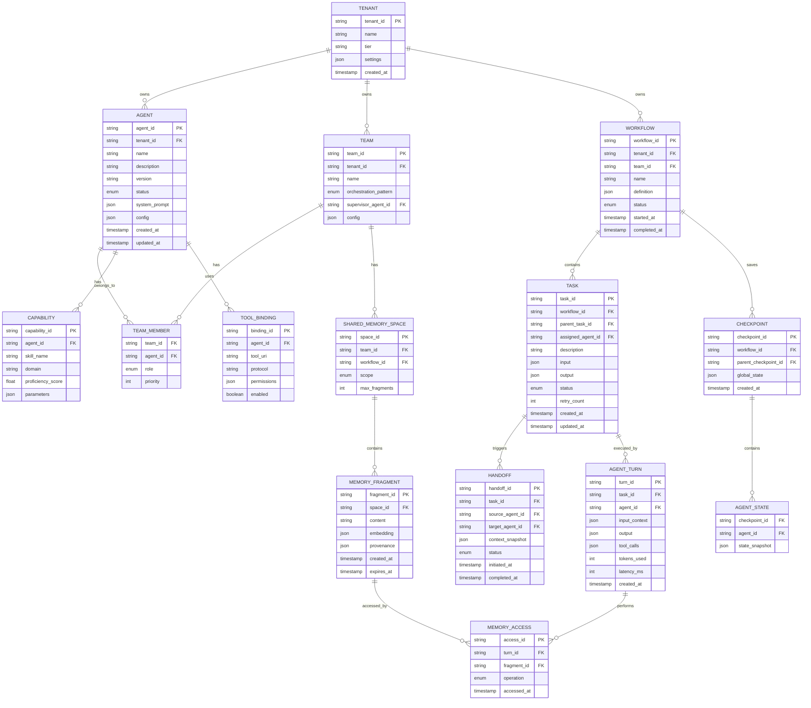

# Low-Level Design

## Data Model

### Entity Relationship Diagram



---

## Schema Definitions

### Agent Registry Schema

```yaml
Agent:
  agent_id: string (UUID)
  tenant_id: string (UUID)
  name: string (max 100)
  description: string (max 1000)
  version: string (semver)
  status: enum [active, idle, busy, offline, deprecated]

  system_prompt: string
  model_preferences:
    primary_model: string
    fallback_models: string[]
    temperature: float (0.0-2.0)
    max_tokens: int

  capabilities:
    - skill_name: string
      domain: string
      proficiency: float (0.0-1.0)
      input_schema: json_schema
      output_schema: json_schema

  tool_bindings:
    - tool_uri: string (MCP URI)
      permissions: string[] (read, write, execute)
      rate_limit: int (calls per minute)

  constraints:
    max_concurrent_tasks: int
    max_context_tokens: int
    timeout_seconds: int

  health:
    success_rate_7d: float
    avg_latency_ms: int
    last_active: timestamp

  metadata:
    created_at: timestamp
    updated_at: timestamp
    created_by: string
    tags: string[]
```

### Task Schema

```yaml
Task:
  task_id: string (UUID)
  workflow_id: string (UUID)
  parent_task_id: string (UUID, nullable)

  description: string
  input:
    user_query: string
    context: object
    constraints: object

  requirements:
    required_capabilities: string[]
    preferred_agents: string[]
    excluded_agents: string[]
    max_cost_tokens: int
    deadline: timestamp

  assignment:
    assigned_agent_id: string
    assigned_at: timestamp
    assignment_reason: string

  execution:
    status: enum [pending, assigned, in_progress, awaiting_handoff, completed, failed, cancelled]
    retry_count: int
    last_error: string

  output:
    result: object
    confidence: float
    tokens_used: int
    latency_ms: int

  metadata:
    created_at: timestamp
    updated_at: timestamp
    completed_at: timestamp
```

### Handoff Context Schema

```yaml
HandoffContext:
  handoff_id: string (UUID)
  source_agent_id: string
  target_agent_id: string

  task_context:
    original_query: string
    task_description: string
    constraints: object

  execution_context:
    steps_completed: object[]
    current_progress: string
    partial_results: object
    decisions_made: object[]

  reasoning_context:
    key_findings: string[]
    assumptions: string[]
    uncertainties: string[]
    recommendations: string[]

  memory_references:
    shared_fragments: string[] (fragment IDs)
    relevant_embeddings: float[][]

  handoff_metadata:
    reason: string
    urgency: enum [low, medium, high, critical]
    expected_action: string

  schema_version: string (for compatibility)
  checksum: string (for integrity)
```

### Memory Fragment Schema

```yaml
MemoryFragment:
  fragment_id: string (UUID)
  space_id: string (UUID)

  content:
    type: enum [text, structured, embedding]
    data: string | object
    embedding: float[] (1536 dimensions)

  provenance:
    created_by_agent: string
    created_during_task: string
    created_at: timestamp
    confidence: float
    sources: string[]

  access_control:
    visibility: enum [private, team, workflow, global]
    allowed_agents: string[]
    denied_agents: string[]

  lifecycle:
    expires_at: timestamp
    retention_policy: string
    last_accessed: timestamp
    access_count: int
```

---

## API Design

### Agent Registration API

```
POST /v1/agents
Authorization: Bearer {token}
Content-Type: application/json

Request:
{
  "name": "Research Agent",
  "description": "Specialized in web research and fact-checking",
  "system_prompt": "You are a research specialist...",
  "capabilities": [
    {
      "skill_name": "web_research",
      "domain": "general",
      "proficiency": 0.9
    }
  ],
  "tool_bindings": [
    {
      "tool_uri": "mcp://tools.example.com/web-search",
      "permissions": ["execute"]
    }
  ]
}

Response (201 Created):
{
  "agent_id": "agt_abc123",
  "status": "active",
  "created_at": "2026-01-27T10:00:00Z"
}
```

### Agent Discovery API

```
GET /v1/agents/discover
Authorization: Bearer {token}

Query Parameters:
  capabilities: string[] (required skills)
  domain: string (optional domain filter)
  min_proficiency: float (default 0.5)
  status: string (default "active")
  limit: int (default 10)

Response (200 OK):
{
  "agents": [
    {
      "agent_id": "agt_abc123",
      "name": "Research Agent",
      "match_score": 0.95,
      "capabilities": [...],
      "health": {
        "success_rate_7d": 0.98,
        "avg_latency_ms": 1200
      }
    }
  ],
  "total": 5
}
```

### Task Submission API

```
POST /v1/tasks
Authorization: Bearer {token}
Content-Type: application/json
Idempotency-Key: {unique-key}

Request:
{
  "workflow_id": "wf_xyz789",
  "description": "Research competitors in the CRM market",
  "input": {
    "user_query": "Who are the top 5 CRM competitors?",
    "context": {
      "industry": "SaaS",
      "region": "North America"
    }
  },
  "requirements": {
    "required_capabilities": ["web_research", "analysis"],
    "max_cost_tokens": 50000,
    "deadline": "2026-01-27T12:00:00Z"
  }
}

Response (202 Accepted):
{
  "task_id": "tsk_def456",
  "status": "pending",
  "estimated_completion": "2026-01-27T10:30:00Z"
}
```

### Handoff API

```
POST /v1/handoffs
Authorization: Bearer {token}
Content-Type: application/json

Request:
{
  "task_id": "tsk_def456",
  "source_agent_id": "agt_abc123",
  "target_agent_id": "agt_xyz789",
  "context": {
    "task_context": {...},
    "execution_context": {...},
    "reasoning_context": {...}
  },
  "reason": "Requires specialized financial analysis",
  "urgency": "medium"
}

Response (200 OK):
{
  "handoff_id": "hnd_ghi012",
  "status": "initiated",
  "estimated_pickup": "2026-01-27T10:05:00Z"
}
```

### Shared Memory API

```
POST /v1/memory/write
Authorization: Bearer {token}
Content-Type: application/json

Request:
{
  "space_id": "spc_team123",
  "content": {
    "type": "structured",
    "data": {
      "finding": "Competitor X has 30% market share",
      "source": "Industry Report 2025",
      "confidence": 0.85
    }
  },
  "visibility": "team"
}

Response (201 Created):
{
  "fragment_id": "frg_jkl345",
  "created_at": "2026-01-27T10:10:00Z"
}

---

GET /v1/memory/search
Authorization: Bearer {token}

Query Parameters:
  space_id: string
  query: string (semantic search)
  limit: int (default 10)
  min_relevance: float (default 0.7)

Response (200 OK):
{
  "fragments": [
    {
      "fragment_id": "frg_jkl345",
      "content": {...},
      "relevance_score": 0.92,
      "provenance": {...}
    }
  ]
}
```

### A2A Protocol Messages

```yaml
# Agent Card (Discovery)
AgentCard:
  agent_id: string
  name: string
  capabilities:
    - skill: string
      description: string
      input_schema: json_schema
      output_schema: json_schema
  endpoint: string (URL)
  protocols: string[] (supported A2A versions)

# Task Request (Agent-to-Agent)
TaskRequest:
  request_id: string
  from_agent: string
  to_agent: string
  task:
    description: string
    input: object
    deadline: timestamp
  context:
    shared_memory_refs: string[]
    conversation_history: object[]
  response_format: json_schema

# Task Response
TaskResponse:
  request_id: string
  from_agent: string
  status: enum [completed, failed, delegated]
  result: object
  metadata:
    tokens_used: int
    latency_ms: int
```

---

## Core Algorithms

### Algorithm 1: Capability-Based Agent Matching

Matches task requirements to available agents based on capabilities.

```
FUNCTION match_agents(task_requirements, available_agents):
    INPUT:
        task_requirements: {
            required_capabilities: list of skill names
            preferred_agents: list of agent IDs (optional)
            excluded_agents: list of agent IDs
            max_cost: int (token budget)
        }
        available_agents: list of Agent objects

    OUTPUT:
        ranked list of (agent_id, match_score) tuples

    ALGORITHM:
        candidates = []

        FOR each agent IN available_agents:
            // Filter excluded agents
            IF agent.id IN task_requirements.excluded_agents:
                CONTINUE

            // Filter by status
            IF agent.status NOT IN [active, idle]:
                CONTINUE

            // Calculate capability match score
            capability_score = 0
            matched_capabilities = 0

            FOR each required_skill IN task_requirements.required_capabilities:
                best_match = find_best_capability_match(agent.capabilities, required_skill)
                IF best_match IS NOT NULL:
                    capability_score += best_match.proficiency
                    matched_capabilities += 1

            // Must match all required capabilities
            IF matched_capabilities < LEN(task_requirements.required_capabilities):
                CONTINUE

            // Normalize capability score
            capability_score = capability_score / LEN(task_requirements.required_capabilities)

            // Calculate health score
            health_score = calculate_health_score(agent.health)

            // Calculate cost score (lower is better)
            cost_score = 1.0 - (agent.avg_tokens_per_task / task_requirements.max_cost)
            cost_score = MAX(0, cost_score)

            // Bonus for preferred agents
            preference_bonus = 0.1 IF agent.id IN task_requirements.preferred_agents ELSE 0

            // Combined score (weights can be tuned)
            final_score = (
                0.5 * capability_score +
                0.25 * health_score +
                0.15 * cost_score +
                0.10 * availability_score(agent) +
                preference_bonus
            )

            candidates.APPEND((agent.id, final_score))

        // Sort by score descending
        candidates.SORT(BY score DESCENDING)

        RETURN candidates

FUNCTION find_best_capability_match(capabilities, required_skill):
    // Exact match first
    FOR cap IN capabilities:
        IF cap.skill_name == required_skill:
            RETURN cap

    // Semantic similarity match (using embeddings)
    best_match = NULL
    best_similarity = 0.7  // Minimum threshold

    required_embedding = get_embedding(required_skill)

    FOR cap IN capabilities:
        cap_embedding = get_embedding(cap.skill_name)
        similarity = cosine_similarity(required_embedding, cap_embedding)
        IF similarity > best_similarity:
            best_similarity = similarity
            best_match = cap

    RETURN best_match

FUNCTION calculate_health_score(health):
    // Weighted combination of health metrics
    success_weight = 0.6
    latency_weight = 0.4

    success_score = health.success_rate_7d
    latency_score = 1.0 - MIN(1.0, health.avg_latency_ms / 5000)  // 5s = 0 score

    RETURN success_weight * success_score + latency_weight * latency_score
```

**Time Complexity:** O(A × C) where A = number of agents, C = number of capabilities per agent
**Space Complexity:** O(A) for candidate list

### Algorithm 2: Dynamic Team Composition

Assembles an optimal team for a multi-agent task.

```
FUNCTION compose_team(task, agent_pool, constraints):
    INPUT:
        task: {
            required_roles: list of role specifications
            orchestration_pattern: enum [hierarchical, parallel, sequential]
            max_team_size: int
            budget: int (total token budget)
        }
        agent_pool: list of available agents
        constraints: {
            diversity_weight: float (prefer different agents)
            cost_weight: float (prefer cheaper agents)
            quality_weight: float (prefer higher proficiency)
        }

    OUTPUT:
        team: list of (role, agent_id) assignments

    ALGORITHM:
        team = []
        remaining_budget = task.budget
        used_agents = SET()

        // Sort roles by criticality (supervisor first for hierarchical)
        IF task.orchestration_pattern == hierarchical:
            sorted_roles = sort_roles_by_criticality(task.required_roles)
        ELSE:
            sorted_roles = task.required_roles

        FOR each role IN sorted_roles:
            // Find matching agents for this role
            candidates = match_agents(role.requirements, agent_pool)

            // Filter already-used agents if diversity required
            IF constraints.diversity_weight > 0:
                candidates = [c FOR c IN candidates IF c.agent_id NOT IN used_agents]

            // Filter by remaining budget
            candidates = [c FOR c IN candidates IF estimate_cost(c.agent_id, role) <= remaining_budget]

            IF LEN(candidates) == 0:
                IF role.required:
                    RAISE InsufficientAgentsError(role)
                ELSE:
                    CONTINUE

            // Score candidates with multi-objective optimization
            scored_candidates = []
            FOR (agent_id, match_score) IN candidates:
                agent = get_agent(agent_id)

                cost_score = 1.0 - (estimate_cost(agent_id, role) / remaining_budget)
                diversity_score = 1.0 IF agent_id NOT IN used_agents ELSE 0.5

                final_score = (
                    constraints.quality_weight * match_score +
                    constraints.cost_weight * cost_score +
                    constraints.diversity_weight * diversity_score
                )

                scored_candidates.APPEND((agent_id, final_score))

            // Select best candidate
            scored_candidates.SORT(BY score DESCENDING)
            selected_agent = scored_candidates[0].agent_id

            team.APPEND({
                "role": role.name,
                "agent_id": selected_agent,
                "expected_cost": estimate_cost(selected_agent, role)
            })

            used_agents.ADD(selected_agent)
            remaining_budget -= estimate_cost(selected_agent, role)

            IF LEN(team) >= task.max_team_size:
                BREAK

        // Validate team completeness
        validate_team_coverage(team, task.required_roles)

        RETURN team

FUNCTION estimate_cost(agent_id, role):
    agent = get_agent(agent_id)

    // Historical average + role complexity factor
    base_cost = agent.health.avg_tokens_per_task
    complexity_factor = role.complexity_multiplier OR 1.0

    RETURN base_cost * complexity_factor
```

**Time Complexity:** O(R × A × log A) where R = number of roles, A = number of agents
**Space Complexity:** O(A) for candidates

### Algorithm 3: Context Summarization for Handoffs

Compresses context to fit within token limits while preserving semantic content.

```
FUNCTION summarize_handoff_context(full_context, target_tokens):
    INPUT:
        full_context: {
            conversation_history: list of messages
            findings: list of key findings
            decisions: list of decisions made
            memory_fragments: list of referenced fragments
        }
        target_tokens: int (maximum tokens for handoff)

    OUTPUT:
        compressed_context: summarized context within token limit

    ALGORITHM:
        current_tokens = count_tokens(full_context)

        IF current_tokens <= target_tokens:
            RETURN full_context

        // Priority-based compression
        compressed = {
            essential: [],
            important: [],
            supplementary: []
        }

        // Always keep: last N turns, all decisions, key findings
        compressed.essential = {
            "last_turns": get_last_n_turns(full_context.conversation_history, 3),
            "decisions": full_context.decisions,
            "key_findings": extract_key_findings(full_context.findings, top_k=5)
        }

        essential_tokens = count_tokens(compressed.essential)
        remaining_tokens = target_tokens - essential_tokens

        IF remaining_tokens <= 0:
            // Emergency compression: summarize essential with LLM
            RETURN llm_summarize(compressed.essential, target_tokens)

        // Add important context if space allows
        compressed.important = {
            "summarized_history": summarize_conversation(
                full_context.conversation_history,
                max_tokens=remaining_tokens * 0.6
            ),
            "relevant_memories": select_top_memories(
                full_context.memory_fragments,
                max_tokens=remaining_tokens * 0.3
            )
        }

        important_tokens = count_tokens(compressed.important)
        remaining_tokens -= important_tokens

        // Add supplementary if space remains
        IF remaining_tokens > 100:
            compressed.supplementary = {
                "background_context": truncate_to_tokens(
                    full_context.background,
                    remaining_tokens
                )
            }

        RETURN flatten_context(compressed)

FUNCTION summarize_conversation(history, max_tokens):
    // Extract key points from conversation
    key_points = []

    FOR message IN history:
        IF message.contains_decision OR message.contains_action:
            key_points.APPEND(extract_key_point(message))

    summary = join_with_transitions(key_points)

    IF count_tokens(summary) > max_tokens:
        // Use LLM to compress further
        summary = llm_summarize(summary, max_tokens)

    RETURN summary

FUNCTION select_top_memories(fragments, max_tokens):
    // Rank by recency and relevance
    scored_fragments = []

    FOR frag IN fragments:
        recency_score = calculate_recency_score(frag.created_at)
        access_score = frag.access_count / MAX_ACCESS_COUNT
        relevance_score = frag.relevance_to_task  // Pre-computed

        score = 0.4 * relevance_score + 0.4 * recency_score + 0.2 * access_score
        scored_fragments.APPEND((frag, score))

    scored_fragments.SORT(BY score DESCENDING)

    // Greedily add until token limit
    selected = []
    current_tokens = 0

    FOR (frag, score) IN scored_fragments:
        frag_tokens = count_tokens(frag.content)
        IF current_tokens + frag_tokens <= max_tokens:
            selected.APPEND(frag)
            current_tokens += frag_tokens

    RETURN selected
```

**Time Complexity:** O(H + F log F) where H = conversation history length, F = number of fragments
**Space Complexity:** O(H + F)

### Algorithm 4: Conflict Resolution (CRDT-Based)

Resolves conflicts when multiple agents write to shared memory.

```
FUNCTION resolve_memory_conflict(existing_fragment, new_fragment, conflict_type):
    INPUT:
        existing_fragment: current memory fragment
        new_fragment: incoming conflicting fragment
        conflict_type: enum [concurrent_write, version_mismatch, semantic_conflict]

    OUTPUT:
        resolved_fragment: merged or selected fragment

    ALGORITHM:
        SWITCH conflict_type:

            CASE concurrent_write:
                // LWW (Last-Writer-Wins) with provenance merge
                IF new_fragment.created_at > existing_fragment.created_at:
                    resolved = new_fragment.COPY()
                    resolved.provenance.previous_versions.APPEND(existing_fragment.id)
                ELSE:
                    resolved = existing_fragment
                    resolved.provenance.rejected_updates.APPEND(new_fragment.id)
                RETURN resolved

            CASE version_mismatch:
                // Three-way merge if base version available
                base_version = get_base_version(existing_fragment, new_fragment)

                IF base_version IS NOT NULL:
                    merged_content = three_way_merge(
                        base_version.content,
                        existing_fragment.content,
                        new_fragment.content
                    )

                    resolved = create_fragment(
                        content=merged_content,
                        provenance={
                            "merged_from": [existing_fragment.id, new_fragment.id],
                            "base_version": base_version.id
                        }
                    )
                ELSE:
                    // Fall back to LWW
                    resolved = RESOLVE(existing_fragment, new_fragment, concurrent_write)

                RETURN resolved

            CASE semantic_conflict:
                // Content contradicts each other
                // Keep both with conflict marker
                resolved = create_fragment(
                    content={
                        "conflict_detected": TRUE,
                        "version_a": existing_fragment.content,
                        "version_b": new_fragment.content,
                        "sources": {
                            "a": existing_fragment.provenance,
                            "b": new_fragment.provenance
                        }
                    },
                    requires_resolution=TRUE
                )

                // Notify orchestrator for human/supervisor resolution
                notify_conflict(resolved)

                RETURN resolved

FUNCTION three_way_merge(base, version_a, version_b):
    // For structured data, merge field by field
    IF IS_OBJECT(base):
        merged = {}
        all_keys = UNION(base.keys, version_a.keys, version_b.keys)

        FOR key IN all_keys:
            base_val = base.GET(key)
            a_val = version_a.GET(key)
            b_val = version_b.GET(key)

            IF a_val == b_val:
                // Both agree
                merged[key] = a_val
            ELSE IF a_val == base_val:
                // Only B changed
                merged[key] = b_val
            ELSE IF b_val == base_val:
                // Only A changed
                merged[key] = a_val
            ELSE:
                // Both changed differently - conflict
                merged[key] = {
                    "conflict": TRUE,
                    "a": a_val,
                    "b": b_val
                }

        RETURN merged

    // For text, use diff-based merge
    ELSE:
        RETURN text_merge(base, version_a, version_b)
```

**Time Complexity:** O(K) where K = number of keys in structured data
**Space Complexity:** O(K)

---

## Agent Lifecycle State Machine


### State Transitions

| From State | To State | Trigger | Action |
|------------|----------|---------|--------|
| Registering | Active | Validation passes | Add to registry, notify discovery |
| Active | Idle | Heartbeat, no tasks | Update availability |
| Idle | Busy | Task assigned | Allocate resources |
| Busy | Active | Task completes | Update metrics, release resources |
| Busy | Offline | Timeout (30s) | Mark unavailable, reassign tasks |
| Offline | Active | 3 successful heartbeats | Restore to pool |
| Any | Deprecated | Manual or auto-deprecation | Stop accepting tasks |

---

## Indexing Strategy

### Primary Indexes

| Table | Index | Type | Purpose |
|-------|-------|------|---------|
| agents | agent_id | Primary | Direct lookup |
| agents | (tenant_id, status) | Composite | Tenant's active agents |
| tasks | task_id | Primary | Direct lookup |
| tasks | (workflow_id, status) | Composite | Workflow's pending tasks |
| memory_fragments | fragment_id | Primary | Direct lookup |
| memory_fragments | (space_id, created_at) | Composite | Time-ordered retrieval |

### Secondary Indexes

| Table | Index | Type | Purpose |
|-------|-------|------|---------|
| agents | capabilities (GIN) | Inverted | Capability search |
| agents | health.success_rate_7d | B-tree | Health-based filtering |
| memory_fragments | embedding | Vector (HNSW) | Semantic search |
| handoffs | (source_agent_id, created_at) | Composite | Agent handoff history |

### Partitioning Strategy

| Table | Partition Key | Strategy |
|-------|---------------|----------|
| tasks | workflow_id | Hash (co-locate workflow tasks) |
| agent_turns | created_at | Time-based (monthly) |
| memory_fragments | space_id | Hash (co-locate team memory) |
| checkpoints | workflow_id | Hash (co-locate workflow state) |

---

## Data Retention Policy

| Data Type | Hot (< 7 days) | Warm (7-90 days) | Cold (> 90 days) | Archive |
|-----------|----------------|------------------|------------------|---------|
| Agent definitions | Full | Full | Full | Full |
| Active tasks | Full | - | - | - |
| Completed tasks | Full | Metadata only | Summary | Delete after 2 years |
| Agent turns | Full | Sampled (10%) | Aggregated | Delete after 1 year |
| Memory fragments | Full | Full | Summary | Delete after 6 months |
| Checkpoints | Full | Last 10 per workflow | Latest only | Delete after 90 days |
