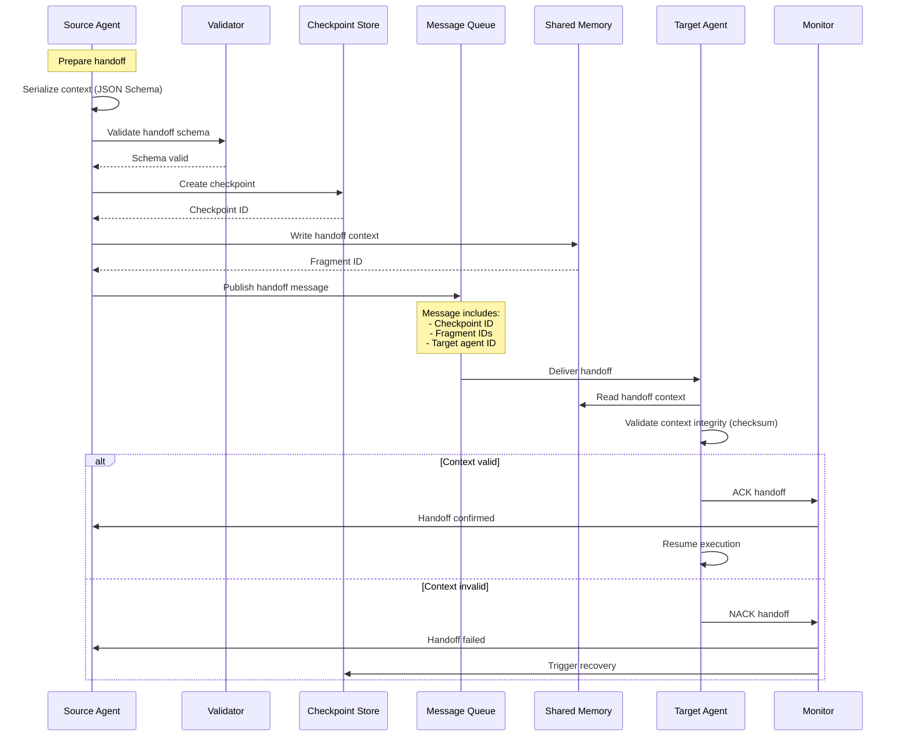
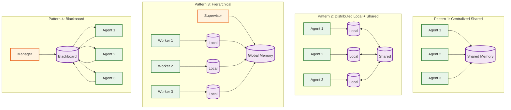
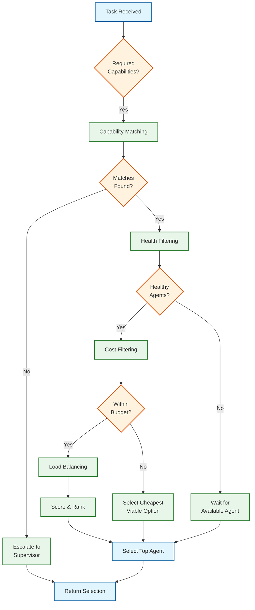

# Deep Dive and Bottlenecks

## Critical Component 1: Handoff Mechanism

### Why This Is Critical

Handoffs are the most fragile point in multi-agent systems. Research shows that **most "agent failures" are actually orchestration and context-transfer issues**. A failed handoff can cause:

- Complete task failure (context lost)
- Repeated work (agent restarts from scratch)
- Inconsistent state (partial updates)
- Cascading failures (downstream agents receive corrupted context)

### How Handoffs Work Internally



### Handoff Context Structure

The handoff context is structured to minimize information loss:

```
HandoffContext:
├── TaskContext (REQUIRED)
│   ├── original_query
│   ├── task_description
│   ├── constraints
│   └── deadline
│
├── ExecutionContext (REQUIRED)
│   ├── steps_completed[]
│   │   ├── step_id
│   │   ├── agent_id
│   │   ├── action
│   │   └── result
│   ├── current_progress
│   ├── partial_results
│   └── decisions_made[]
│
├── ReasoningContext (IMPORTANT)
│   ├── key_findings[]
│   ├── assumptions[]
│   ├── uncertainties[]
│   └── recommendations[]
│
├── MemoryReferences (OPTIONAL)
│   ├── shared_fragment_ids[]
│   └── relevant_embeddings[]
│
└── Metadata
    ├── schema_version
    ├── checksum (SHA-256)
    ├── source_agent_id
    └── handoff_timestamp
```

### Failure Modes and Recovery

| Failure Mode | Detection | Recovery Strategy |
|--------------|-----------|-------------------|
| **Context serialization failure** | Schema validation error | Retry with fallback schema |
| **Network partition during handoff** | ACK timeout (30s) | Retry with exponential backoff |
| **Target agent unavailable** | Health check failure | Route to backup agent |
| **Context too large** | Token limit exceeded | Compress via summarization |
| **Checksum mismatch** | Integrity check fails | Restore from checkpoint |
| **Target agent rejects context** | NACK received | Re-serialize with minimal context |

### Best Practices for Reliable Handoffs

1. **Structured Data Transfer**
   - Never use free-text for handoffs
   - Define JSON Schema for every handoff type
   - Version schemas for backward compatibility

2. **Atomic Operations**
   - Checkpoint before initiating handoff
   - Use two-phase commit for critical handoffs
   - Maintain idempotency with handoff IDs

3. **Graceful Degradation**
   - Define minimum viable context
   - Allow partial handoffs with explicit gaps
   - Provide fallback to supervisor escalation

4. **Observability**
   - Log every handoff with full context
   - Track handoff success rates per agent pair
   - Alert on degraded handoff performance

---

## Critical Component 2: Shared Memory Layer

### Why This Is Critical

Shared memory enables collaboration but introduces distributed systems complexity:

- **Information asymmetry**: Agent A knows something Agent B needs but doesn't have
- **Race conditions**: Concurrent writes can corrupt shared state
- **Stale reads**: Agents may act on outdated information
- **Memory explosion**: Unbounded growth can exhaust resources

### Memory Topology Patterns



### Pattern Comparison

| Pattern | Consistency | Latency | Complexity | Best For |
|---------|-------------|---------|------------|----------|
| **Centralized** | Strong | Medium | Low | Small teams, simple workflows |
| **Distributed Local+Shared** | Eventual | Low | Medium | Performance-critical, large teams |
| **Hierarchical** | Tiered | Variable | Medium | Supervisor-worker patterns |
| **Blackboard** | Eventually consistent | Low-Medium | High | Iterative refinement, debates |

### Memory Fragment Structure

```
MemoryFragment:
├── Identity
│   ├── fragment_id (UUID)
│   ├── space_id (team/workflow scope)
│   └── version (monotonic counter)
│
├── Content
│   ├── type: text | structured | embedding
│   ├── data: actual content
│   └── embedding: float[1536] (for semantic search)
│
├── Provenance (CRITICAL for multi-agent)
│   ├── created_by_agent
│   ├── created_during_task
│   ├── created_at
│   ├── confidence
│   └── sources[] (where this info came from)
│
├── Access Control
│   ├── visibility: private | team | workflow | global
│   ├── allowed_agents[]
│   └── denied_agents[]
│
└── Lifecycle
    ├── expires_at
    ├── retention_policy
    ├── last_accessed
    └── access_count
```

### Consistency vs Performance Trade-offs

| Access Pattern | Consistency | Implementation |
|----------------|-------------|----------------|
| **Write own findings** | Strong (own writes) | Quorum write, local read |
| **Read teammate's findings** | Eventual (100ms lag OK) | Cached read, async sync |
| **Update shared decision** | Strong | Distributed lock, CAS |
| **Search historical context** | Eventual | Periodic index rebuild |

### Information Asymmetry Mitigation

**Problem:** Agent A finds critical information that Agent B needs but hasn't queried.

**Solutions:**

1. **Publish-Subscribe Pattern**
   ```
   Agent A writes "finding: X"
   → Memory layer broadcasts to subscribed agents
   → Agent B receives notification
   → Agent B queries if relevant
   ```

2. **Proactive Summarization**
   ```
   Every N turns:
   → Orchestrator summarizes recent memory updates
   → Broadcasts "context digest" to all active agents
   → Agents incorporate if relevant to their task
   ```

3. **Explicit Dependency Declaration**
   ```
   Task definition includes:
   → "Agent B depends on findings from Agent A"
   → System ensures B waits for A's relevant outputs
   ```

### Failure Modes and Recovery

| Failure | Detection | Recovery |
|---------|-----------|----------|
| Write fails | Write timeout, error response | Retry with backoff, escalate |
| Stale read | Version check, timestamp | Invalidate cache, re-read |
| Memory full | Capacity threshold | Evict cold fragments, summarize |
| Partition | Heartbeat failure | Operate in partition-tolerant mode |
| Corruption | Checksum mismatch | Restore from replicas |

---

## Critical Component 3: Agent Selection and Routing

### Why This Is Critical

Wrong agent selection causes:
- Task failures (incapable agent)
- Excessive costs (over-qualified agent)
- Latency (busy agent, queue delays)
- Quality issues (poor fit for task)

### Selection Algorithm Flow



### Multi-Objective Scoring

Agents are scored using weighted multi-objective optimization:

```
Score = w1 * CapabilityScore
      + w2 * HealthScore
      + w3 * CostScore
      + w4 * AvailabilityScore
      + w5 * AffinityBonus

Where:
- w1 = 0.40 (capability match is most important)
- w2 = 0.25 (reliability matters)
- w3 = 0.15 (cost efficiency)
- w4 = 0.15 (current load)
- w5 = 0.05 (user preferences)

CapabilityScore = Σ(skill_proficiency) / required_skills

HealthScore = 0.6 * success_rate_7d + 0.4 * (1 - latency/5000ms)

CostScore = 1 - (estimated_tokens / budget)

AvailabilityScore = 1 - (current_tasks / max_concurrent)
```

### Load Balancing Strategies

| Strategy | Implementation | Best For |
|----------|----------------|----------|
| **Round Robin** | Rotate through capable agents | Uniform workload |
| **Least Connections** | Route to agent with fewest active tasks | Variable task duration |
| **Weighted** | Route proportionally to agent capacity | Heterogeneous agents |
| **Cost-Aware** | Prefer cheaper agents for simple tasks | Budget optimization |
| **Latency-Aware** | Prefer faster agents | Time-sensitive tasks |

### Cost-Aware Routing

```
IF task.complexity == "simple":
    // Route to cheaper model/agent
    filter_agents(max_cost_per_token < $0.001)

ELSE IF task.complexity == "complex":
    // Route to capable model regardless of cost
    filter_agents(min_capability_score > 0.8)

ELSE:
    // Balanced routing
    optimize_for(cost * 0.4 + quality * 0.6)
```

### Failure Modes

| Failure | Detection | Recovery |
|---------|-----------|----------|
| No capable agents | Empty match result | Escalate, queue, or reject |
| All agents busy | Availability = 0 | Queue with priority, timeout |
| Selected agent fails | Task timeout | Reassign to next-best agent |
| Agent pool shrinking | Capacity threshold | Alert, scale up |

---

## Bottleneck Analysis

### Bottleneck 1: Context Window Explosion

**Problem:** Multi-agent systems accumulate context faster than single-agent systems.

```
Single Agent: Context grows linearly with turns
Multi-Agent: Context grows with agents × turns + handoffs
```

**Impact:**
- Token costs explode
- Latency increases (longer prompts)
- Quality degrades (lost in context)

**Mitigation Strategies:**

| Strategy | Reduction | Trade-off |
|----------|-----------|-----------|
| **Aggressive summarization** | 50-70% | Potential info loss |
| **Relevance filtering** | 40-60% | Requires good embeddings |
| **Sliding window** | Fixed size | Loses old context |
| **Hierarchical memory** | 60-80% | Complexity |
| **Context distillation** | 70-85% | LLM cost for distillation |

### Bottleneck 2: Communication Latency

**Problem:** Inter-agent communication adds overhead.

```
Single Agent: Latency = LLM_call
Multi-Agent: Latency = Σ(LLM_calls) + Σ(handoffs) + Σ(message_routing)
```

**Breakdown:**

| Component | Typical Latency | Optimization |
|-----------|-----------------|--------------|
| Message serialization | 1-5ms | Use binary formats (protobuf) |
| Queue publish/consume | 5-20ms | Use in-memory queues for local |
| Network hop | 10-50ms | Co-locate agents |
| Handoff validation | 10-30ms | Async validation |
| Context deserialization | 5-15ms | Lazy deserialization |

**Mitigation:**
- Parallelize independent agent calls
- Batch small messages
- Use agent affinity (keep related agents close)
- Pre-warm agents for predictable workflows

### Bottleneck 3: State Consistency

**Problem:** Distributed state across agents is hard to keep consistent.

**Manifestations:**
- Agent B reads stale data written by Agent A
- Two agents make conflicting decisions
- Checkpoint corruption during concurrent saves

**CAP Trade-offs:**

| Scenario | Choice | Implementation |
|----------|--------|----------------|
| Shared findings | AP | Eventual consistency, CRDT merge |
| Task assignment | CP | Distributed lock, single writer |
| Checkpoint save | AP | Last-writer-wins, version vector |
| Budget tracking | CP | Strong consistency, atomic ops |

### Bottleneck 4: Orchestrator Scalability

**Problem:** Central orchestrator can become a bottleneck.

```
Single Orchestrator: Limited to X concurrent workflows
Distributed Orchestrator: Coordination overhead
```

**Scaling Approaches:**

| Approach | Pros | Cons |
|----------|------|------|
| **Horizontal partitioning** | Linear scale | Cross-partition coordination |
| **Sharding by tenant** | Isolation | Uneven load |
| **Sharding by workflow type** | Specialized optimization | Routing complexity |
| **Decentralized (supervisor agents)** | Fault-tolerant | Harder to monitor |

---

## Concurrency and Race Conditions

### Race Condition 1: Concurrent Agent Assignment

**Scenario:** Two orchestrator instances try to assign the same task to different agents.

```
Time 0: Orchestrator A reads task T1 (status: pending)
Time 1: Orchestrator B reads task T1 (status: pending)
Time 2: Orchestrator A assigns T1 to Agent X
Time 3: Orchestrator B assigns T1 to Agent Y
Result: Task executed twice!
```

**Solution:** Optimistic locking with version check

```
UPDATE tasks
SET status = 'assigned',
    assigned_agent = :agent_id,
    version = version + 1
WHERE task_id = :task_id
  AND status = 'pending'
  AND version = :expected_version

IF affected_rows == 0:
    // Lost the race, task already assigned
    RETRY with different task
```

### Race Condition 2: Concurrent Memory Writes

**Scenario:** Two agents write conflicting updates to the same memory fragment.

```
Time 0: Agent A reads fragment F (value: "X")
Time 1: Agent B reads fragment F (value: "X")
Time 2: Agent A writes fragment F (value: "Y")
Time 3: Agent B writes fragment F (value: "Z")
Result: Agent A's write lost!
```

**Solution:** CRDT-based conflict resolution (see Algorithm 4 in Low-Level Design)

### Race Condition 3: Handoff During Agent Failure

**Scenario:** Source agent fails mid-handoff before target confirms.

```
Time 0: Agent A initiates handoff to Agent B
Time 1: Agent A writes context to shared memory
Time 2: Agent A crashes before publishing handoff message
Result: Orphaned context, task stuck
```

**Solution:** Two-phase handoff with timeout

```
Phase 1 (Prepare):
  - Source writes context
  - Source creates handoff record (status: preparing)
  - Source publishes handoff message

Phase 2 (Confirm):
  - Target reads context
  - Target validates
  - Target updates handoff (status: accepted)
  - Source receives ACK

Timeout handling:
  - If no ACK in 60s, orchestrator checks handoff status
  - If preparing, restore from checkpoint
  - If accepted but source unaware, proceed normally
```

### Locking Strategies

| Resource | Lock Type | Timeout | Fallback |
|----------|-----------|---------|----------|
| Task assignment | Optimistic | N/A | Retry |
| Memory fragment | Optimistic + CRDT | N/A | Merge |
| Checkpoint save | Pessimistic | 10s | Queue |
| Budget update | Pessimistic | 5s | Reject |
| Agent health update | Eventual | N/A | Overwrite |

---

## Performance Optimization

### Optimization 1: Agent Pooling

**Problem:** Cold-starting agents for each task is expensive.

**Solution:** Maintain a pool of warm agents.

```
Agent Pool:
├── Hot Agents (actively processing): ~30% of pool
├── Warm Agents (loaded, waiting): ~50% of pool
└── Cold Agents (not loaded): ~20% of pool

On task arrival:
1. Check warm pool for matching agent
2. If found, assign immediately
3. If not found, queue task and warm up cold agent

Pool sizing:
- Min pool size = peak_concurrent_tasks × 0.5
- Max pool size = peak_concurrent_tasks × 1.5
```

### Optimization 2: Predictive Pre-warming

**Problem:** Handoffs to cold agents add latency.

**Solution:** Predict next agent and pre-warm.

```
On task assignment to Agent A:
1. Analyze workflow definition
2. Identify likely next agents (Agent B, Agent C)
3. Pre-warm those agents in background
4. When handoff occurs, agent is already warm
```

### Optimization 3: Context Caching

**Problem:** Repeated context retrieval is expensive.

**Solution:** Multi-tier caching.

```
Cache Hierarchy:
├── L1: Agent-local cache (100ms TTL)
├── L2: Team-shared cache (5min TTL)
└── L3: Distributed cache (30min TTL)

Cache key: hash(task_type + required_context + agent_capabilities)

Cache invalidation:
- On memory write: invalidate affected L1/L2 entries
- On handoff: propagate to target agent's L1
```

### Optimization 4: Batch Processing

**Problem:** Many small operations are inefficient.

**Solution:** Batch where possible.

| Operation | Batching Strategy | Latency Trade-off |
|-----------|-------------------|-------------------|
| Memory writes | Batch per agent turn | +50ms, -60% ops |
| Metric emissions | Batch per 10s | +10s lag, -90% ops |
| Checkpoint saves | Batch per workflow step | +1 step lag, -80% ops |
| Agent heartbeats | Batch per node | +5s lag, -95% ops |
