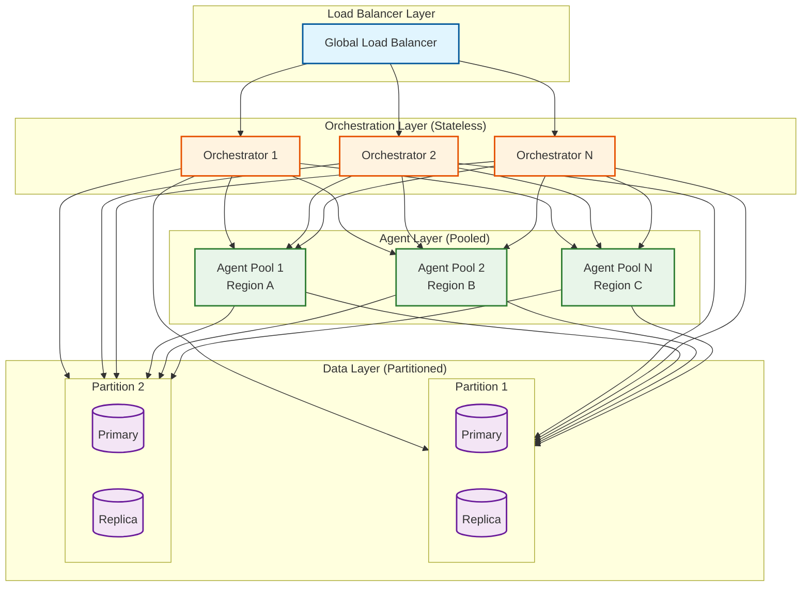
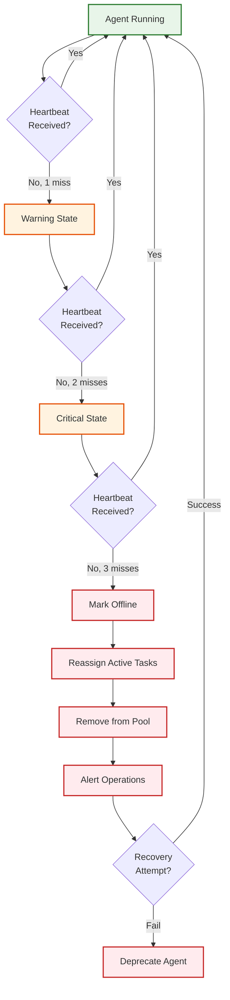
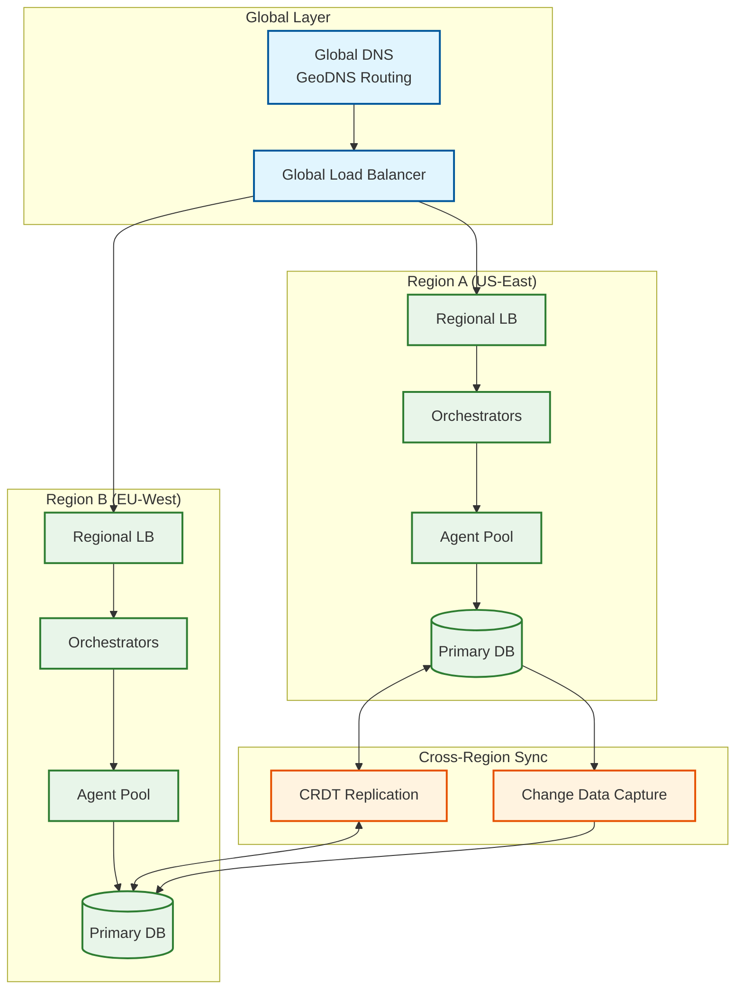

# Scalability and Reliability

## Scalability

### Horizontal Scaling Strategy



### Component Scaling Characteristics

| Component | Scaling Type | Bottleneck | Strategy |
|-----------|--------------|------------|----------|
| **API Gateway** | Horizontal | Connection limits | Add instances, connection pooling |
| **Orchestrator** | Horizontal | CPU (workflow logic) | Stateless, any-node routing |
| **Agent Registry** | Read-heavy horizontal | Cache misses | Multi-tier caching, read replicas |
| **Task Manager** | Horizontal | Queue depth | Partitioned queues, sharding |
| **Agent Executors** | Horizontal | LLM API limits | Agent pooling, rate limiting |
| **Shared Memory** | Horizontal | Write throughput | Partitioning, write coalescing |
| **Message Queue** | Horizontal | Partition count | Topic partitioning, consumer groups |

### Orchestrator Scaling

**Stateless Design:**
- All state externalized to data stores
- Any orchestrator can handle any request
- Session affinity not required

**Auto-scaling Triggers:**

| Metric | Scale-Up | Scale-Down |
|--------|----------|------------|
| CPU utilization | > 70% for 3 min | < 30% for 10 min |
| Request queue depth | > 500 pending | < 50 pending |
| Workflow latency P95 | > 10s | < 2s |

**Scaling Formula:**

```
target_instances = CEIL(
    MAX(
        current_workflows / workflows_per_instance,
        peak_qps / qps_per_instance,
        1 (minimum)
    )
)

Where:
- workflows_per_instance ≈ 100 concurrent
- qps_per_instance ≈ 500
```

### Agent Pool Scaling

**Pool Sizing:**

```
min_pool_size = baseline_concurrent_tasks × 0.7
max_pool_size = peak_concurrent_tasks × 1.3
target_pool_size = current_demand × 1.1 (10% headroom)
```

**Scaling Triggers:**

| Metric | Scale-Up | Scale-Down |
|--------|----------|------------|
| Pool utilization | > 80% for 2 min | < 30% for 15 min |
| Task queue wait time | > 30s | < 5s |
| Agent health | < 90% healthy | N/A |

**Heterogeneous Scaling:**

```
Scale by agent type:
- Research agents: demand-driven (variable)
- Analysis agents: predictive (based on research output)
- Draft agents: lagging (follows analysis)

This prevents over-provisioning specialized agents.
```

### Database Scaling

**Read Replicas:**

| Data Type | Replica Strategy | Lag Tolerance |
|-----------|------------------|---------------|
| Agent registry | 3 read replicas | 1s |
| Task history | 2 read replicas | 5s |
| Memory fragments | 2 read replicas | 500ms |

**Partitioning (Sharding):**

| Data | Partition Key | Strategy | Shard Count |
|------|---------------|----------|-------------|
| Tasks | workflow_id | Hash | 16 |
| Memory | space_id (team) | Hash | 32 |
| Agent turns | created_at | Range (monthly) | Dynamic |
| Checkpoints | workflow_id | Hash | 16 |

**Hot Spot Mitigation:**

```
Problem: Popular workflows/teams create hot partitions

Solutions:
1. Virtual partitions: Split hot keys across multiple physical partitions
2. Write buffering: Coalesce writes before committing
3. Read caching: Aggressive caching for hot read patterns
4. Key salting: Add random prefix for distribution
```

### Caching Strategy

**Multi-Tier Cache:**

```
L1 (Agent-Local): 100MB, 100ms TTL
├── Recent context fragments
├── Tool schemas
└── Agent capabilities

L2 (Node-Shared): 1GB, 5min TTL
├── Team memory cache
├── Workflow definitions
└── Agent registry snapshot

L3 (Distributed): 10GB, 30min TTL
├── Global agent registry
├── Popular memory fragments
└── Semantic search index
```

**Cache Invalidation:**

| Event | Invalidation Scope |
|-------|-------------------|
| Agent update | L1 (local), L2 (node), L3 (global) |
| Memory write | L1 (team's agents), L2 (team's nodes) |
| Handoff | L1 (target agent only) |
| Workflow complete | L1, L2 (workflow's nodes) |

---

## Reliability and Fault Tolerance

### Single Points of Failure (SPOF) Analysis

| Component | SPOF Risk | Mitigation |
|-----------|-----------|------------|
| API Gateway | Medium | Multi-instance, health checks |
| Orchestrator | Low | Stateless, any instance handles |
| Agent Registry | Medium | Replicated, cached |
| Message Queue | High | Clustered, replicated |
| Shared Memory Store | High | Multi-replica, quorum |
| LLM Gateway | External | Multi-provider fallback |

### Redundancy Strategy

**Active-Active (Preferred):**

```
Region A: Full stack (Orchestrators, Agents, Data primary)
Region B: Full stack (Orchestrators, Agents, Data replica)

Traffic: Split 50/50 or based on latency
Failover: Automatic, DNS-based
```

**Active-Passive (Budget):**

```
Region A: Full stack (Active)
Region B: Minimal stack (Warm standby)

Traffic: 100% to Active
Failover: Manual or automated (5-10 min RTO)
```

### Agent Failure Detection and Recovery



**Heartbeat Configuration:**

| Parameter | Value |
|-----------|-------|
| Heartbeat interval | 10s |
| Miss threshold | 3 consecutive |
| Recovery window | 60s |
| Max recovery attempts | 3 |

### Orchestrator Failover

**Stateless Failover:**

```
1. Load balancer detects unhealthy orchestrator (health check fails)
2. Traffic automatically routes to healthy instances
3. In-flight requests may timeout (client retries)
4. No state loss (all state in external stores)
```

**Workflow Recovery:**

```
For each interrupted workflow:
1. Load last checkpoint
2. Identify last completed step
3. Resume from next step
4. If agent was mid-execution:
   a. Check if result was saved
   b. If yes, proceed
   c. If no, re-execute step
```

### Partial Team Degradation

**Graceful Degradation Modes:**

| Scenario | Degradation | User Impact |
|----------|-------------|-------------|
| 1 of N workers fails | Redistribute tasks | Slight latency increase |
| Supervisor fails | Promote worker, simplify workflow | Reduced quality, longer time |
| All workers fail | Supervisor does all work | Significant latency, may timeout |
| Shared memory fails | Fall back to handoff-only | Potential info loss |
| LLM provider fails | Switch provider or queue | Latency, potential cost change |

**Circuit Breaker Pattern:**

```
Circuit Breaker States:
- CLOSED: Normal operation
- OPEN: Failures exceeded threshold, reject requests
- HALF-OPEN: Allow test requests to check recovery

Configuration:
- Failure threshold: 50% in 1 minute
- Open duration: 30 seconds
- Half-open test: 10 requests

Per-Agent Circuit Breakers:
- Each agent has independent circuit breaker
- Prevents cascading failures
- Allows partial system operation
```

### Retry Strategies

| Operation | Retry Count | Backoff | Conditions |
|-----------|-------------|---------|------------|
| Task assignment | 3 | Exponential (1s, 2s, 4s) | Agent unavailable |
| Handoff | 3 | Exponential (2s, 4s, 8s) | Target not ready |
| Memory write | 5 | Fixed 500ms | Transient error |
| LLM call | 3 | Exponential (1s, 2s, 4s) | Rate limit, timeout |
| Checkpoint save | 3 | Fixed 1s | Write conflict |

**Retry with Jitter:**

```
delay = base_delay * (2 ^ attempt) + random(0, 1000ms)

This prevents thundering herd when multiple retries happen simultaneously.
```

### Bulkhead Pattern

**Isolation Boundaries:**

```
Tenant Isolation:
- Each tenant has dedicated resource quotas
- One tenant's overload doesn't affect others

Workflow Type Isolation:
- Separate pools for different workflow types
- Batch workflows don't starve real-time

Agent Type Isolation:
- Separate pools per capability domain
- Research agent failures don't affect drafting
```

**Resource Quotas:**

| Resource | Per-Tenant Limit | Burst |
|----------|------------------|-------|
| Concurrent workflows | 100 | 150 (1 min) |
| Concurrent agents | 50 | 75 (1 min) |
| Memory fragments | 10,000 | N/A |
| Handoffs per minute | 1,000 | 1,500 (spike) |
| LLM tokens per hour | 1,000,000 | 1,500,000 |

---

## Disaster Recovery

### RTO / RPO Targets

| Tier | RTO | RPO | Scenario |
|------|-----|-----|----------|
| **Tier 1: Critical** | 5 min | 0 (no data loss) | Single component failure |
| **Tier 2: Major** | 30 min | 1 min | Zone failure |
| **Tier 3: Catastrophic** | 4 hours | 5 min | Region failure |

### Backup Strategy

**Continuous Backups:**

| Data | Backup Frequency | Retention | Storage |
|------|------------------|-----------|---------|
| Agent definitions | Real-time CDC | 90 days | Cross-region object storage |
| Workflow definitions | Real-time CDC | 90 days | Cross-region object storage |
| Checkpoints | Every 5 min | 7 days | Cross-region object storage |
| Memory fragments | Every 15 min | 30 days | Cross-region object storage |
| Event log | Continuous | 1 year | Cross-region append-only log |

**Point-in-Time Recovery:**

```
Recovery process:
1. Select recovery point (timestamp)
2. Restore data stores to that point
3. Replay event log from that point
4. Validate consistency
5. Resume operations
```

### Multi-Region Strategy

**Active-Active Multi-Region:**



**Conflict Resolution (Cross-Region):**

| Data Type | Conflict Strategy |
|-----------|-------------------|
| Agent definitions | Last-writer-wins (timestamp) |
| Workflow state | Region affinity (workflow runs in one region) |
| Memory fragments | CRDT merge (add-wins set) |
| Checkpoints | Per-region (no conflict) |

**Failover Procedure:**

```
Region A failure detected:

1. Health checks fail (3 consecutive, 30s)
2. Global LB stops routing to Region A
3. DNS TTL expires (60s), clients use Region B
4. Region B handles all traffic

5. For in-flight workflows from Region A:
   a. Detect orphaned workflows (no heartbeat)
   b. Load last checkpoint (replicated to Region B)
   c. Resume in Region B
   d. Notify users of potential 1-5 min data loss

6. When Region A recovers:
   a. Sync data from Region B
   b. Gradually shift traffic back (10% → 25% → 50%)
   c. Full active-active restored
```

### Chaos Engineering

**Failure Injection Tests:**

| Test | Frequency | Blast Radius |
|------|-----------|--------------|
| Kill random orchestrator | Daily | Single instance |
| Kill agent pool node | Daily | 10% of agents |
| Network partition (zone) | Weekly | Single zone |
| Memory store slowdown | Weekly | All writes +500ms |
| LLM provider failure | Monthly | All LLM calls |
| Region failover | Quarterly | Entire region |

**Game Day Runbook:**

```
Pre-Game:
1. Notify stakeholders
2. Ensure monitoring dashboards ready
3. Prepare rollback procedures

During Game:
1. Inject failure
2. Monitor impact (latency, errors, throughput)
3. Verify automatic recovery kicks in
4. Document timeline

Post-Game:
1. Analyze gaps
2. Update runbooks
3. Improve automation
4. Schedule follow-up
```

---

## Capacity Planning

### Growth Model

```
Year 1:
- Tenants: 1,000
- Agents: 75,000
- Tasks/day: 5M
- Storage: 540 TB

Year 3 (10x growth):
- Tenants: 10,000
- Agents: 750,000
- Tasks/day: 50M
- Storage: 5.4 PB

Year 5 (50x growth):
- Tenants: 50,000
- Agents: 3.75M
- Tasks/day: 250M
- Storage: 27 PB
```

### Infrastructure Sizing

**Year 1:**

| Component | Count | Spec |
|-----------|-------|------|
| Orchestrator nodes | 10 | 8 vCPU, 32 GB RAM |
| Agent executor nodes | 50 | 16 vCPU, 64 GB RAM |
| Database (primary) | 3 | 32 vCPU, 256 GB RAM, 10 TB SSD |
| Cache cluster | 10 | 8 vCPU, 64 GB RAM |
| Message queue cluster | 6 | 8 vCPU, 32 GB RAM |
| Object storage | - | 600 TB |

**Year 3 (Scaled):**

| Component | Count | Notes |
|-----------|-------|-------|
| Orchestrator nodes | 50 | Horizontal scale |
| Agent executor nodes | 250 | Horizontal scale |
| Database shards | 16 | Partitioned |
| Cache cluster | 50 | Distributed |
| Message queue partitions | 128 | Increased parallelism |
| Object storage | - | 6 PB |

### Cost Optimization

**Strategies:**

| Strategy | Savings | Trade-off |
|----------|---------|-----------|
| Spot/preemptible for batch agents | 60-70% | May be interrupted |
| Reserved capacity for baseline | 30-40% | Commitment |
| Tiered storage (hot/warm/cold) | 50% storage | Access latency |
| Model routing (cheaper for simple) | 40-60% LLM | Quality on edge cases |
| Agent pooling (amortize cold start) | 20-30% | Memory overhead |
