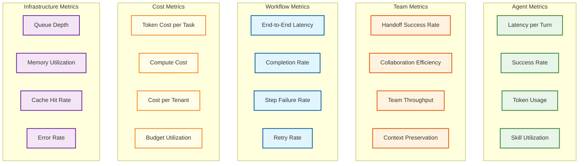
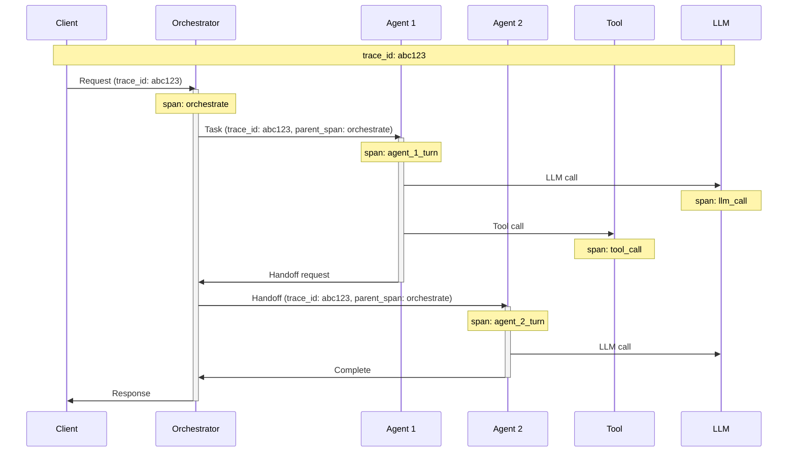
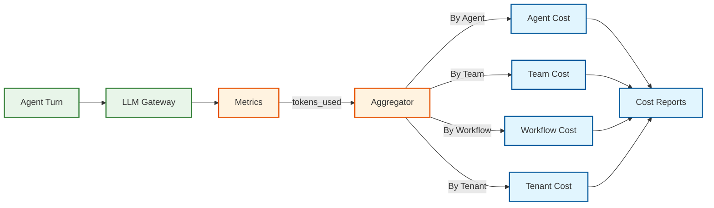

# Observability

## Overview

Multi-agent systems require observability at multiple levels: individual agent performance, team collaboration patterns, workflow execution, and cost attribution. The challenge is correlating events across distributed agents while maintaining actionable insights.

---

## Metrics

### Metric Categories



### Agent-Level Metrics

| Metric | Type | Labels | Description |
|--------|------|--------|-------------|
| `agent_turn_duration_seconds` | Histogram | agent_id, tenant_id, skill | Time for single agent turn |
| `agent_turn_tokens_total` | Counter | agent_id, tenant_id, direction (in/out) | Token usage |
| `agent_task_success_total` | Counter | agent_id, tenant_id, status | Task completion count |
| `agent_tool_calls_total` | Counter | agent_id, tool_name, status | Tool invocation count |
| `agent_health_score` | Gauge | agent_id | Composite health (0-1) |
| `agent_pool_utilization` | Gauge | pool_id | Fraction of agents busy |

### Team-Level Metrics

| Metric | Type | Labels | Description |
|--------|------|--------|-------------|
| `handoff_duration_seconds` | Histogram | source_agent, target_agent | Handoff latency |
| `handoff_success_total` | Counter | source_agent, target_agent, status | Handoff outcomes |
| `context_preservation_score` | Gauge | workflow_id | Semantic fidelity (0-1) |
| `team_collaboration_index` | Gauge | team_id | Efficiency of teamwork |
| `memory_fragment_writes_total` | Counter | team_id, agent_id | Shared memory activity |

### Workflow-Level Metrics

| Metric | Type | Labels | Description |
|--------|------|--------|-------------|
| `workflow_duration_seconds` | Histogram | workflow_type, tenant_id | End-to-end time |
| `workflow_completion_total` | Counter | workflow_type, status | Completion count |
| `workflow_steps_total` | Counter | workflow_id, step, status | Per-step counts |
| `workflow_retries_total` | Counter | workflow_id, step | Retry counts |
| `workflow_agents_used` | Histogram | workflow_type | Agents per workflow |

### Cost Metrics

| Metric | Type | Labels | Description |
|--------|------|--------|-------------|
| `llm_tokens_cost_dollars` | Counter | tenant_id, model, agent_id | Token spend |
| `compute_cost_dollars` | Counter | tenant_id, resource_type | Infrastructure spend |
| `budget_remaining_dollars` | Gauge | tenant_id, budget_type | Remaining budget |
| `cost_per_task_dollars` | Histogram | workflow_type | Task-level cost |

### Infrastructure Metrics (USE Method)

| Resource | Utilization | Saturation | Errors |
|----------|-------------|------------|--------|
| **Orchestrator CPU** | `cpu_utilization_ratio` | `cpu_throttle_seconds` | `orchestrator_errors_total` |
| **Agent Memory** | `memory_utilization_ratio` | `memory_oom_kills_total` | `agent_crashes_total` |
| **Message Queue** | `queue_depth` | `queue_oldest_message_age` | `queue_publish_errors_total` |
| **Database** | `connection_pool_utilization` | `query_queue_depth` | `query_errors_total` |

---

## Logging

### Log Levels Strategy

| Level | When to Use | Examples |
|-------|-------------|----------|
| **ERROR** | Actionable failures requiring investigation | Agent crash, handoff failure, data corruption |
| **WARN** | Degraded performance, approaching limits | High latency, budget 80% used, retry triggered |
| **INFO** | Significant business events | Task started, handoff complete, workflow done |
| **DEBUG** | Detailed execution flow (dev/troubleshooting) | Agent reasoning, tool params, context size |
| **TRACE** | Very detailed, high volume | Every function call, memory access (prod disabled) |

### Structured Log Format

```json
{
  "timestamp": "2026-01-27T10:15:30.123Z",
  "level": "INFO",
  "service": "orchestrator",
  "trace_id": "abc123",
  "span_id": "def456",
  "tenant_id": "tenant_acme",
  "workflow_id": "wf_xyz789",
  "task_id": "tsk_001",
  "agent_id": "agt_research",
  "event": "handoff_initiated",
  "message": "Handoff from research to analysis agent",
  "details": {
    "source_agent": "agt_research",
    "target_agent": "agt_analysis",
    "context_size_tokens": 2500,
    "reason": "research_complete"
  },
  "duration_ms": 45
}
```

### What to Log

**Always Log:**

| Event | Required Fields |
|-------|-----------------|
| Task received | task_id, workflow_id, tenant_id, description |
| Agent assigned | task_id, agent_id, assignment_reason |
| Agent turn started | turn_id, task_id, agent_id, input_size |
| Agent turn completed | turn_id, output_size, tokens_used, latency_ms |
| Tool invocation | tool_name, params (sanitized), result_status |
| Handoff initiated | source, target, context_size, reason |
| Handoff completed | handoff_id, latency_ms, success |
| Workflow completed | workflow_id, total_latency, agents_used, cost |
| Error occurred | error_type, stack_trace, context |

**Never Log:**

- Full user queries (PII risk) - log hash or truncated
- Full LLM responses (cost, PII) - log summary
- API keys, tokens, credentials
- Full memory fragment contents (log IDs only)

### Log Aggregation

```
Log Flow:

Agent → Fluentd/Vector → Message Queue → Log Processor → Storage
                                              ↓
                                         Enrichment
                                         (add tenant, cost)
                                              ↓
                                         Indexing
                                         (Elasticsearch/Loki)
```

**Retention:**

| Log Type | Hot (searchable) | Warm (archived) | Cold |
|----------|------------------|-----------------|------|
| Error logs | 30 days | 90 days | 1 year |
| Info logs | 7 days | 30 days | 90 days |
| Debug logs | 1 day | 7 days | 30 days |
| Audit logs | 90 days | 1 year | 7 years |

---

## Distributed Tracing

### Trace Context Propagation



### Key Spans to Instrument

| Span Name | Parent | Duration Includes |
|-----------|--------|-------------------|
| `workflow.execution` | None (root) | Entire workflow |
| `task.processing` | `workflow.execution` | Single task lifecycle |
| `agent.turn` | `task.processing` | One agent turn |
| `llm.call` | `agent.turn` | LLM inference |
| `tool.invocation` | `agent.turn` | Tool execution |
| `memory.read` | `agent.turn` | Shared memory access |
| `memory.write` | `agent.turn` | Shared memory write |
| `handoff.execute` | `task.processing` | Context transfer |
| `checkpoint.save` | `task.processing` | State persistence |

### Span Attributes

```yaml
Common Attributes:
  tenant_id: string
  workflow_id: string
  task_id: string
  agent_id: string

Agent Turn Span:
  agent.name: string
  agent.version: string
  tokens.input: int
  tokens.output: int
  tools.count: int

Handoff Span:
  handoff.source_agent: string
  handoff.target_agent: string
  handoff.context_size: int
  handoff.reason: string

LLM Call Span:
  llm.model: string
  llm.provider: string
  llm.tokens.prompt: int
  llm.tokens.completion: int
  llm.latency_ms: int
  llm.cached: boolean
```

### Trace Sampling

| Traffic Level | Sampling Rate | Strategy |
|---------------|---------------|----------|
| Normal | 1% | Random |
| Error traces | 100% | Always capture |
| Slow traces (>10s) | 100% | Tail-based |
| Debug mode | 100% | User-triggered |
| High load (>80% capacity) | 0.1% | Reduce load |

---

## Dashboards

### Dashboard 1: Platform Overview

**Purpose:** Executive/SRE view of system health

**Panels:**

| Panel | Visualization | Data |
|-------|---------------|------|
| Workflows/minute | Time series | `workflow_completion_total` rate |
| Active agents | Gauge | `agent_pool_utilization` |
| Error rate | Time series | `workflow_completion_total{status="failed"}` rate |
| P95 latency | Time series | `workflow_duration_seconds` P95 |
| Cost (today) | Single stat | `sum(llm_tokens_cost_dollars)` |
| Top errors | Table | Error log aggregation |

### Dashboard 2: Agent Performance

**Purpose:** Agent health and optimization

**Panels:**

| Panel | Visualization | Data |
|-------|---------------|------|
| Agent health heatmap | Heatmap | `agent_health_score` by agent |
| Turn latency by agent | Bar chart | `agent_turn_duration_seconds` P50/P95 |
| Token efficiency | Table | Tokens per successful task |
| Tool usage breakdown | Pie chart | `agent_tool_calls_total` by tool |
| Agent errors | Time series | `agent_task_success_total{status="failed"}` |
| Skill utilization | Bar chart | Tasks per skill type |

### Dashboard 3: Team Collaboration

**Purpose:** Multi-agent dynamics

**Panels:**

| Panel | Visualization | Data |
|-------|---------------|------|
| Handoff success rate | Gauge | `handoff_success_total` ratio |
| Handoff latency | Time series | `handoff_duration_seconds` P50/P95 |
| Agent interaction graph | Node graph | Handoff counts between agents |
| Context preservation | Time series | `context_preservation_score` |
| Memory fragment growth | Time series | `memory_fragment_writes_total` |
| Team efficiency scores | Leaderboard | `team_collaboration_index` |

### Dashboard 4: Cost Analysis

**Purpose:** Budget management and optimization

**Panels:**

| Panel | Visualization | Data |
|-------|---------------|------|
| Daily spend | Time series | `llm_tokens_cost_dollars` |
| Cost by tenant | Bar chart | Cost aggregated by tenant |
| Cost by model | Pie chart | Cost by LLM model |
| Cost per task | Histogram | `cost_per_task_dollars` distribution |
| Budget burn rate | Gauge | Projected vs actual |
| Top expensive workflows | Table | Workflows ranked by cost |

### Dashboard 5: Workflow Deep Dive

**Purpose:** Debug specific workflow issues

**Panels:**

| Panel | Visualization | Data |
|-------|---------------|------|
| Workflow timeline | Gantt chart | Spans from trace |
| Step success/failure | Flow diagram | Step outcomes |
| Agent turns | Table | Detailed turn-by-turn |
| Token usage breakdown | Stacked bar | Input/output tokens per step |
| Error details | Logs panel | Filtered error logs |
| Related traces | Links | Correlated traces |

---

## Alerting

### Alert Severity Levels

| Severity | Response Time | Notification |
|----------|---------------|--------------|
| **P1 Critical** | Immediate | Page on-call, incident bridge |
| **P2 High** | 15 minutes | Page on-call |
| **P3 Medium** | 1 hour | Slack channel |
| **P4 Low** | Next business day | Email digest |

### Critical Alerts (P1)

| Alert | Condition | Runbook |
|-------|-----------|---------|
| Orchestrator down | No healthy instances | Restart, failover |
| Workflow completion rate < 90% | 10 min window | Investigate errors |
| Agent pool exhausted | 0 available agents | Scale up, check crashes |
| Database unreachable | Connection failures | Failover, check network |
| Budget exhausted | $0 remaining | Notify, pause workflows |

### High Alerts (P2)

| Alert | Condition | Runbook |
|-------|-----------|---------|
| P95 latency > 30s | 5 min window | Check slow agents/LLM |
| Handoff failure rate > 5% | 10 min window | Check target agents |
| Error rate > 2% | 5 min window | Investigate error types |
| Queue depth > 10,000 | Sustained | Scale consumers |
| Memory store latency > 500ms | 5 min window | Check replication |

### Medium Alerts (P3)

| Alert | Condition | Runbook |
|-------|-----------|---------|
| Agent health degraded | < 0.8 for 30 min | Review agent, consider deprecation |
| Cache hit rate < 50% | 1 hour | Tune cache, check patterns |
| Budget 80% consumed | Daily check | Notify tenant, review usage |
| Checkpoint failures | > 1% rate | Check storage |

### Alert Routing

```yaml
P1_Critical:
  channels:
    - pagerduty: on-call-primary
    - slack: #incidents
  escalation:
    - after: 5m
      notify: on-call-secondary
    - after: 15m
      notify: engineering-manager

P2_High:
  channels:
    - pagerduty: on-call-primary
    - slack: #alerts

P3_Medium:
  channels:
    - slack: #platform-alerts
  hours: business_hours_only

P4_Low:
  channels:
    - email: platform-team@company.com
  frequency: daily_digest
```

---

## Runbooks

### Runbook: High Handoff Failure Rate

**Symptoms:**
- `handoff_success_total{status="failed"}` rate > 5%
- Workflows stuck in "awaiting_handoff" state

**Diagnosis:**

```
1. Check which agent pairs are failing:
   QUERY: handoff_failure_rate BY source_agent, target_agent

2. Check target agent health:
   QUERY: agent_health_score{agent_id="<target>"}

3. Check for context size issues:
   QUERY: handoff_context_size_bytes P99

4. Check message queue:
   QUERY: queue_consumer_lag{queue="handoffs"}
```

**Resolution:**

| Cause | Action |
|-------|--------|
| Target agent unhealthy | Replace agent, scale pool |
| Context too large | Increase limits or enable compression |
| Queue backup | Scale consumers, check slow agents |
| Network partition | Check connectivity, failover |

### Runbook: Workflow Latency Spike

**Symptoms:**
- `workflow_duration_seconds` P95 > 30s
- User complaints about slow responses

**Diagnosis:**

```
1. Identify slow workflows:
   QUERY: workflow_duration_seconds BY workflow_id | TOP 10

2. Trace slow workflow:
   QUERY: traces WHERE workflow_id="<id>" AND duration > 30s

3. Find bottleneck span:
   Look for longest span in trace

4. Check LLM latency:
   QUERY: llm_call_duration_seconds P95 BY model
```

**Resolution:**

| Cause | Action |
|-------|--------|
| LLM slow | Switch to faster model, check provider status |
| Agent turn slow | Review agent prompts, reduce context |
| Tool slow | Check external tool, add timeout |
| Queue delay | Scale orchestrators |

### Runbook: Budget Exhaustion

**Symptoms:**
- `budget_remaining_dollars` = 0
- Workflows being rejected

**Immediate Actions:**

```
1. Verify budget status:
   QUERY: budget_remaining_dollars{tenant_id="<id>"}

2. Check spend rate:
   QUERY: rate(llm_tokens_cost_dollars[1h]) BY workflow_type

3. Identify expensive workflows:
   QUERY: cost_per_task_dollars | TOP 10
```

**Resolution:**

| Urgency | Action |
|---------|--------|
| Critical | Increase budget (requires approval) |
| High | Pause non-essential workflows |
| Medium | Route to cheaper models |
| Low | Wait for budget reset |

---

## Cost Attribution

### Token Accounting Flow



### Cost Allocation Model

```yaml
Token Cost Calculation:
  input_cost = input_tokens × model_input_rate
  output_cost = output_tokens × model_output_rate
  total_cost = input_cost + output_cost

Hierarchy Attribution:
  Agent ← Turn (direct)
  Team ← Agent (aggregation)
  Workflow ← Task ← Agent Turn (aggregation)
  Tenant ← Workflow (aggregation)

Shared Costs (Platform):
  Compute, Storage, Network → Allocated by usage weight
```

### Cost Reports

**Daily Cost Report:**

| Dimension | Metrics |
|-----------|---------|
| By Tenant | Total spend, budget %, top workflows |
| By Team | Spend, agents used, efficiency |
| By Workflow Type | Average cost, variance, trends |
| By Agent | Token usage, cost per task |
| By Model | Usage distribution, savings opportunity |

**Anomaly Detection:**

```
Flag when:
- Daily spend > 2× 7-day average
- Single workflow > 10× average cost
- Agent cost > 3× peer average
- Model distribution shifts significantly
```
