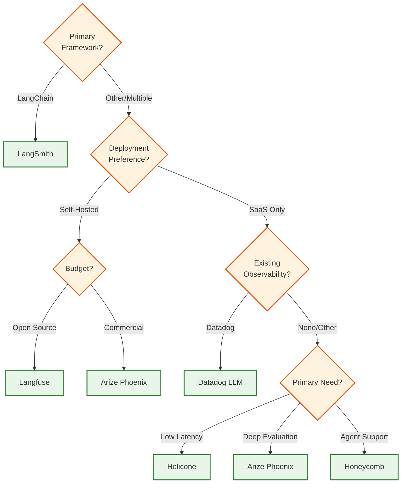
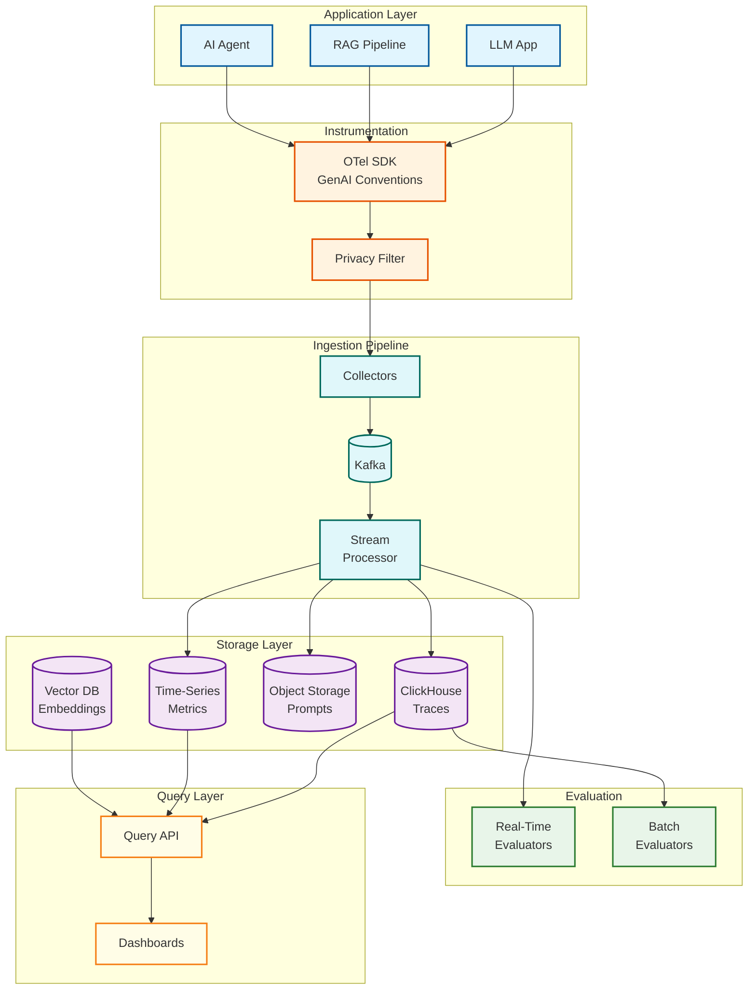

# AI Observability & LLMOps Platform

## System Overview

An AI Observability & LLMOps Platform provides comprehensive monitoring, debugging, and optimization capabilities for LLM-powered applications. Unlike traditional APM systems, it handles the unique challenges of non-deterministic AI outputs, high-cardinality prompt data, expensive evaluation pipelines, and privacy-sensitive content logging.

The platform enables engineering teams to trace LLM calls across complex chains and agents, attribute costs accurately across organizations and teams, detect hallucinations and quality regressions, and continuously evaluate model outputs against business requirements.

**Complexity Rating:** `High`

---

## Quick Navigation

| Document | Description |
|----------|-------------|
| [01 - Requirements & Estimations](./01-requirements-and-estimations.md) | Functional/non-functional requirements, capacity planning |
| [02 - High-Level Design](./02-high-level-design.md) | System architecture, OTel pipeline, data flows |
| [03 - Low-Level Design](./03-low-level-design.md) | Data models, APIs, core algorithms |
| [04 - Deep Dive & Bottlenecks](./04-deep-dive-and-bottlenecks.md) | Critical components, optimization strategies |
| [05 - Scalability & Reliability](./05-scalability-and-reliability.md) | Scaling strategies, fault tolerance |
| [06 - Security & Compliance](./06-security-and-compliance.md) | PII handling, threat model, GDPR |
| [07 - Observability](./07-observability.md) | Meta-observability (monitoring the platform itself) |
| [08 - Interview Guide](./08-interview-guide.md) | Pacing, trap questions, trade-offs |

---

## Key Characteristics

| Characteristic | Description |
|----------------|-------------|
| **OTel-Native** | Built on OpenTelemetry with GenAI semantic conventions for standardized telemetry |
| **High-Cardinality Data** | Prompt/completion content creates unique dimension explosion requiring special handling |
| **Time-Series + Document Hybrid** | Metrics stored in time-series DBs, traces/prompts in columnar stores |
| **Multi-Level Tracing** | Hierarchical spans for chains, agents, tools, and individual LLM calls |
| **Cost Attribution** | Token accounting with hierarchical budgets (organization → team → application → key) |
| **Quality Evaluation** | Automated (LLM-as-Judge, semantic entropy) + human-in-loop assessment |
| **Privacy-First** | PII redaction at multiple layers, selective content logging |

---

## Platform Comparison (2025-2026)

| Platform | Backend | OTel Support | Deployment | Key Strengths |
|----------|---------|--------------|------------|---------------|
| **Langfuse** | ClickHouse | SDK v3 Native | Self-hosted / Cloud | Open-source, deep tracing, prompt management |
| **Arize Phoenix** | Custom | OTel-based | Self-hosted / AX Cloud | Evaluation engine, experiment tracking |
| **Datadog LLM** | Datadog | GenAI conventions v1.37+ | SaaS | Enterprise APM integration, agentic AI support |
| **Helicone** | ClickHouse + Kafka | Proxy-based | Self-hosted / Cloud | ~8ms latency, zero-code integration |
| **LangSmith** | Custom | LangChain SDK | Self-hosted K8s / Cloud | LangChain ecosystem native, LangGraph integration |
| **Honeycomb** | Custom | OTel-native | SaaS | MCP agent support, SLO-based monitoring |
| **Weights & Biases Weave** | Custom | Custom SDK | SaaS | ML experiment integration, @weave.op decorator |

### Platform Selection Decision Tree

---

## Core Capabilities

### Distributed Tracing

End-to-end visibility into LLM application execution:

| Capability | Description |
|------------|-------------|
| **Span Hierarchy** | Parent-child relationships across chains, agents, and tool calls |
| **GenAI Attributes** | Standardized attributes (model, tokens, temperature, finish_reason) |
| **Context Propagation** | Trace ID flows across async boundaries and service calls |
| **Agent Workflow Support** | Long-running traces spanning minutes to hours |

### Token Accounting & Cost Monitoring

Accurate usage tracking and cost attribution:

| Capability | Description |
|------------|-------------|
| **Per-Model Tracking** | Input/output tokens tracked per model and provider |
| **Hierarchical Attribution** | Costs rolled up from request → app → team → org |
| **Real-Time Budgets** | Soft/hard limits with alerts and throttling |
| **Cache Savings** | Track cost reductions from semantic and exact caching |

### Prompt-Completion Linkage

Version control and comparison for prompts:

| Capability | Description |
|------------|-------------|
| **Version Tagging** | Associate traces with prompt versions |
| **A/B Testing** | Compare performance across prompt variants |
| **Production Iteration** | Use real data to refine prompts |
| **Regression Detection** | Alert on quality degradation after changes |

### Hallucination Detection

Automated quality assessment:

| Method | Accuracy | Latency | Cost |
|--------|----------|---------|------|
| **Semantic Entropy** | 70-80% correlation | ~500ms | Low (embedding only) |
| **LLM-as-Judge** | 80-85% correlation | 1-3s | Medium (LLM call) |
| **RAG Groundedness** | 85-90% for RAG | ~200ms | Low |
| **Benchmark Suite** | Varies by benchmark | Batch only | Low |

### Evaluation Loops

Continuous quality assessment:

| Type | Use Case | Latency | Coverage |
|------|----------|---------|----------|
| **Real-Time** | Guardrails, format validation | < 100ms | 100% |
| **Near-Real-Time** | LLM-as-Judge scoring | 1-3s | Sampled |
| **Batch** | Comprehensive analysis, human review | Minutes-hours | Sampled |
| **Human-in-Loop** | Ground truth labeling, edge cases | Async | Selective |

---

## Architecture Overview

---

## Key Metrics Reference

### Latency Targets

| Operation | P50 | P95 | P99 |
|-----------|-----|-----|-----|
| SDK instrumentation overhead | 2ms | 5ms | 10ms |
| Trace ingestion (end-to-end) | 500ms | 2s | 5s |
| Recent trace query (< 24h) | 50ms | 150ms | 300ms |
| Historical query (> 7d) | 500ms | 2s | 5s |
| Real-time evaluation | 50ms | 200ms | 500ms |
| Cost dashboard refresh | 1s | 3s | 5s |

### Throughput Targets

| Metric | Target | Notes |
|--------|--------|-------|
| Span ingestion rate | 100K+ spans/sec | Per cluster |
| Query rate | 10K queries/sec | Dashboard + API |
| Evaluation rate | 5K evals/sec | Real-time evaluators |
| Cost aggregation | < 30s delay | Near real-time |

### Storage Efficiency

| Data Type | Compression Ratio | Retention |
|-----------|-------------------|-----------|
| Traces (ClickHouse) | 10-15x | 90 days |
| Prompts (Object Storage) | 3-5x | 30 days |
| Metrics (Time-Series) | 8-12x | 2 years |
| Evaluation Results | 5-8x | 180 days |

---

## OpenTelemetry GenAI Semantic Conventions

The platform leverages the emerging OpenTelemetry GenAI semantic conventions for standardized attribute naming:

### Core Attributes

| Attribute | Type | Description |
|-----------|------|-------------|
| `gen_ai.system` | string | Provider (openai, anthropic, bedrock) |
| `gen_ai.request.model` | string | Requested model name |
| `gen_ai.response.model` | string | Actual model used |
| `gen_ai.request.temperature` | float | Temperature setting |
| `gen_ai.request.max_tokens` | int | Max tokens requested |
| `gen_ai.usage.input_tokens` | int | Prompt token count |
| `gen_ai.usage.output_tokens` | int | Completion token count |
| `gen_ai.response.finish_reasons` | string[] | Why generation stopped |

### Extended Attributes (Platform-Specific)

| Attribute | Type | Description |
|-----------|------|-------------|
| `llmops.prompt_version` | string | Prompt template version |
| `llmops.cost_usd` | float | Calculated cost |
| `llmops.evaluation_score` | float | Quality score (0-1) |
| `llmops.cache_hit` | boolean | Whether cache was used |
| `llmops.user_feedback` | string | User rating if provided |

---

## Interview Checklist

### Must Know
- [ ] How distributed tracing works for LLM chains and agents
- [ ] Token counting and cost attribution hierarchy
- [ ] Why ClickHouse is preferred over Elasticsearch for traces
- [ ] High-cardinality problem and content-addressed storage solution
- [ ] Difference between real-time and batch evaluation

### Should Know
- [ ] OpenTelemetry GenAI semantic conventions
- [ ] Hallucination detection methods (semantic entropy, LLM-as-Judge)
- [ ] Trace assembly for long-running agent workflows
- [ ] PII redaction strategies and GDPR compliance
- [ ] Adaptive sampling strategies

### Nice to Know
- [ ] Specific platform implementations (Langfuse, Arize, Datadog)
- [ ] MCP (Model Context Protocol) for agent observability
- [ ] Vector database integration for semantic trace search
- [ ] Cost optimization through semantic caching

---

## Related Systems

| System | Relationship |
|--------|--------------|
| [3.21 LLM Gateway](../3.21-llm-gateway-prompt-management/00-index.md) | Upstream source of token/cost data, rate limiting |
| [3.22 AI Guardrails](../3.22-ai-guardrails-safety-system/00-index.md) | Safety signal integration, blocked request tracking |
| [3.23 LLM Inference Engine](../3.23-llm-inference-engine/00-index.md) | Performance metrics (TTFT, TPOT, KV cache) |
| [3.24 Multi-Agent Orchestration](../3.24-multi-agent-orchestration-platform/00-index.md) | Agent workflow trace correlation |
| [3.4 MLOps Platform](../3.4-mlops-platform/00-index.md) | Model lifecycle, experiment tracking |
| [15.2 Distributed Tracing System](../15.2-distributed-tracing-system/00-index.md) | General tracing infrastructure patterns |

---

## References

### Platform Documentation
- [Langfuse Documentation](https://langfuse.com/docs)
- [Arize Phoenix](https://phoenix.arize.com/)
- [Datadog LLM Observability](https://docs.datadoghq.com/llm_observability/)
- [Helicone](https://docs.helicone.ai/)
- [LangSmith](https://docs.langchain.com/langsmith/)
- [Honeycomb LLM Observability](https://docs.honeycomb.io/send-data/llm/)

### Standards
- [OpenTelemetry GenAI Semantic Conventions](https://opentelemetry.io/docs/specs/semconv/gen-ai/)
- [OpenLLMetry Project](https://github.com/traceloop/openllmetry)

### Engineering Blogs
- [ClickHouse for Observability](https://clickhouse.com/blog)
- [Langfuse Architecture (ClickHouse Acquisition)](https://clickhouse.com/blog/clickhouse-acquires-langfuse-open-source-llm-observability)
- [Helicone Architecture](https://www.helicone.ai/blog)
