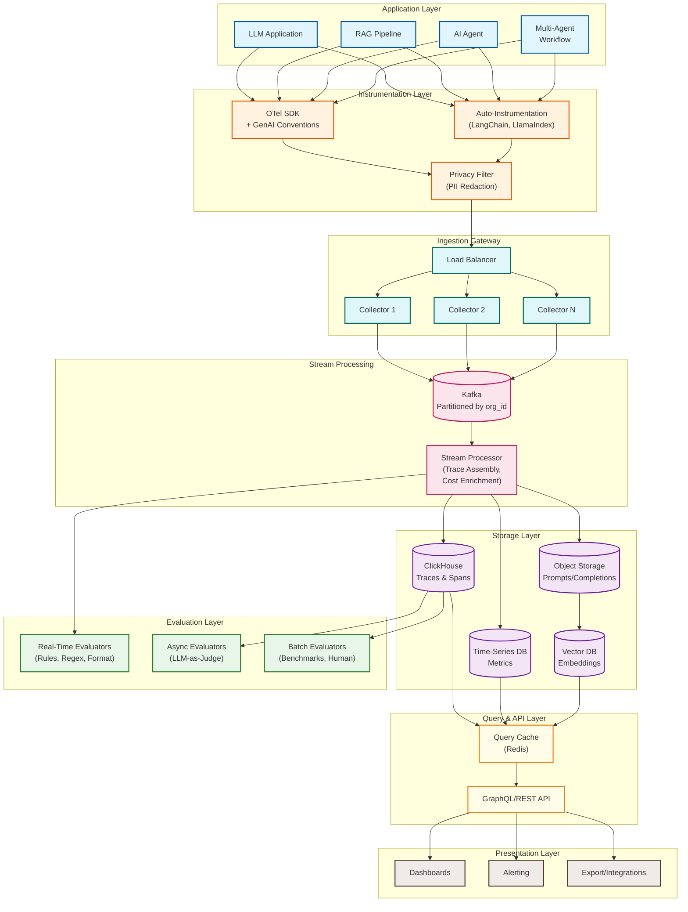
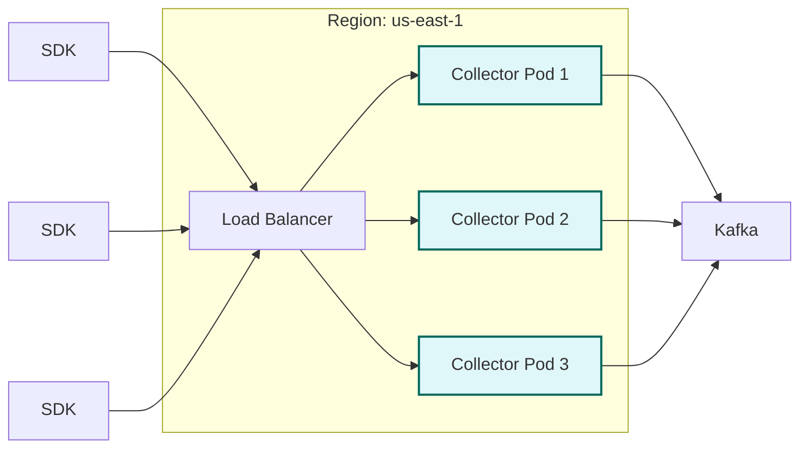
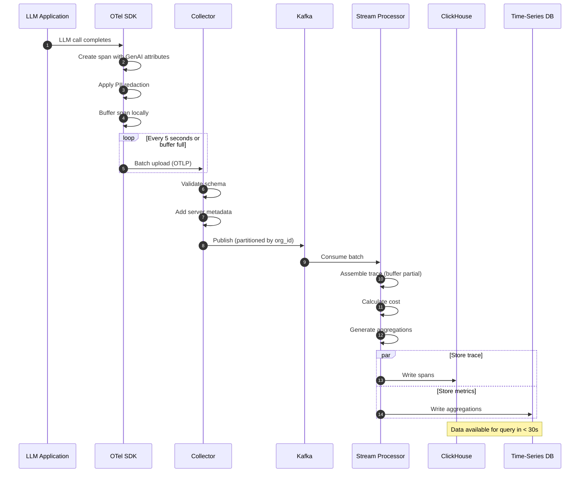
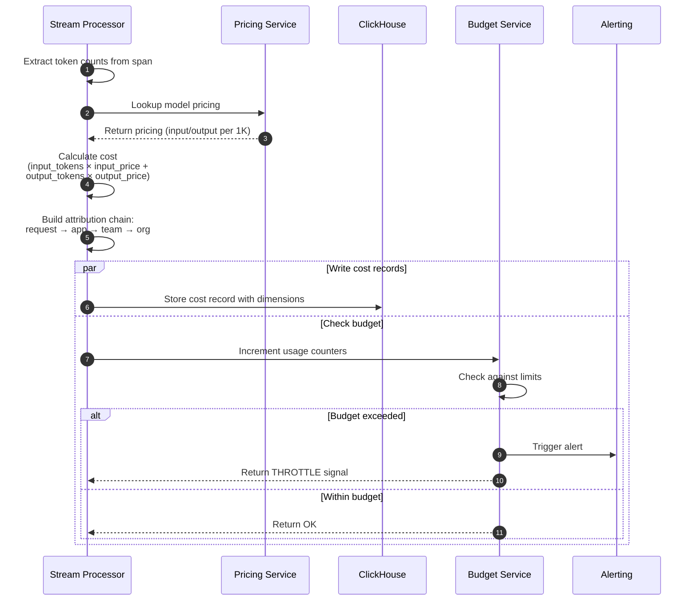
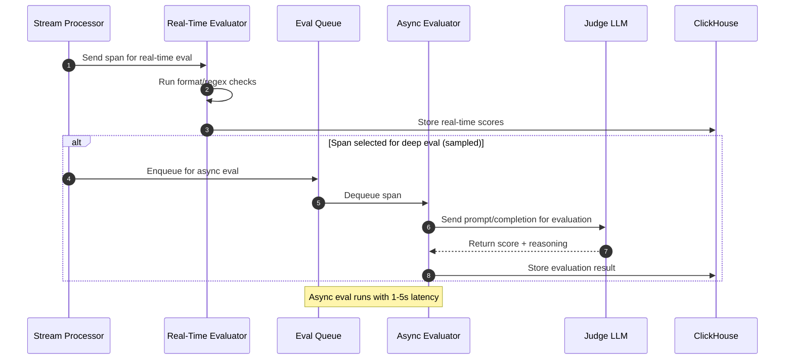
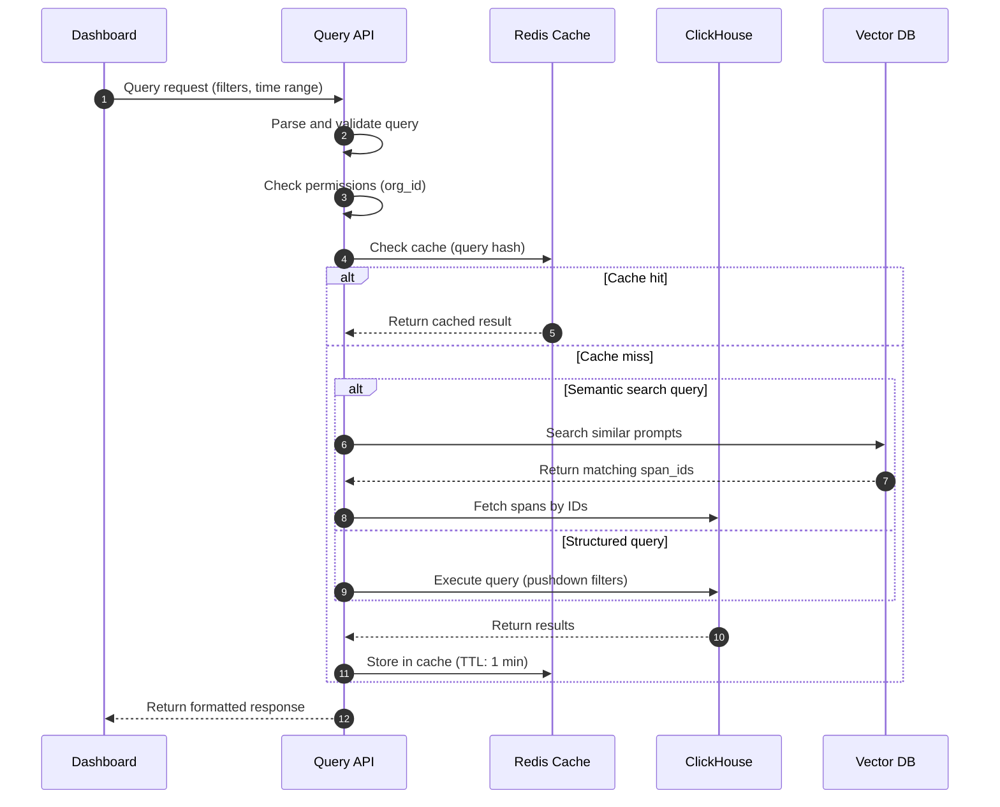
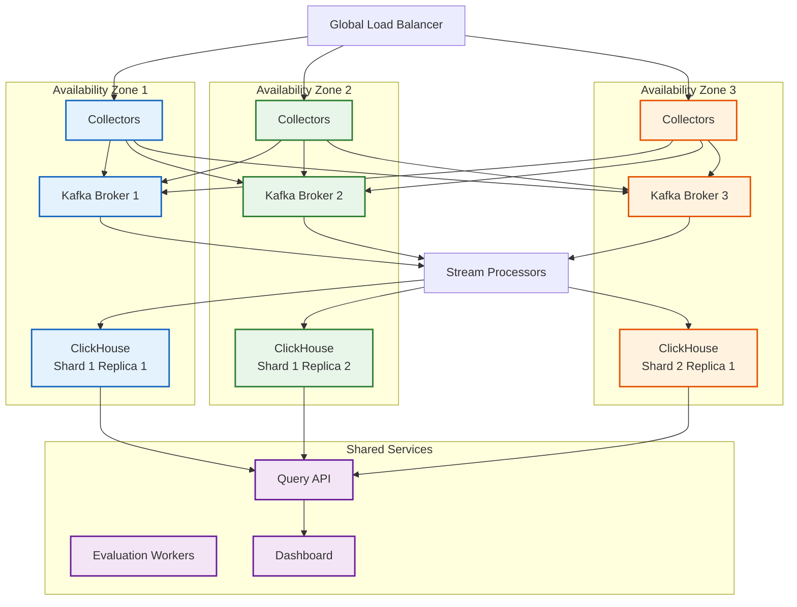

# High-Level Design

## System Architecture



---

## Core Components

### 1. Instrumentation SDK

| Responsibility | Description |
|----------------|-------------|
| **Auto-Instrumentation** | Automatic hooks for popular frameworks (LangChain, LlamaIndex, OpenAI SDK) |
| **Manual Spans** | API for custom trace points and business context |
| **Context Propagation** | Maintain trace context across async boundaries, HTTP calls, queues |
| **Sampling** | Configurable head-based sampling with always-sample rules |
| **Buffering** | Local buffer to handle network blips, batch uploads |
| **PII Filtering** | Client-side redaction before data leaves the application |

**SDK Integration Pattern:**

```
# Pseudocode - SDK Usage
configure_llmops(
    api_key: "llmops_xxx",
    service_name: "my-rag-app",
    sample_rate: 0.1,  # 10% sampling
    pii_redaction: ENABLED,
    flush_interval: 5_SECONDS
)

# Auto-instrumentation captures all LangChain/OpenAI calls
# Manual spans for business context
with trace.span("user_query_processing"):
    span.set_attribute("user_tier", "premium")
    result = chain.invoke(query)
```

### 2. Telemetry Collectors

| Responsibility | Description |
|----------------|-------------|
| **Protocol Support** | OTLP (gRPC/HTTP), proprietary JSON/Protobuf |
| **Validation** | Schema validation, reject malformed spans |
| **Rate Limiting** | Per-organization rate limits to prevent abuse |
| **Enrichment** | Add server-side metadata (received timestamp, geo) |
| **Routing** | Partition by organization for downstream processing |

**Collector Deployment:**



### 3. Stream Processor

| Responsibility | Description |
|----------------|-------------|
| **Trace Assembly** | Reconstruct complete traces from out-of-order spans |
| **Token Counting** | Standardize token counts across providers |
| **Cost Calculation** | Apply model-specific pricing in real-time |
| **Aggregation** | Pre-aggregate metrics for dashboards (per-minute rollups) |
| **Deduplication** | Handle SDK retries, dedupe by span_id |
| **Routing** | Direct spans to appropriate storage tiers |

### 4. Storage Layer

| Store | Data Type | Characteristics | Query Pattern |
|-------|-----------|-----------------|---------------|
| **ClickHouse** | Traces, spans | Columnar, fast aggregations, high compression | Time-range + filters |
| **Time-Series DB** | Metrics, aggregations | Efficient time-range queries, retention policies | Dashboard panels |
| **Object Storage** | Raw prompts/completions | Cost-effective archival, content-addressed | By hash lookup |
| **Vector DB** | Prompt embeddings | ANN search, similarity queries | Semantic search |
| **Redis** | Query cache, sessions | Low-latency reads, TTL-based expiry | Recent/hot data |

### 5. Evaluation Engine

| Tier | Evaluators | Latency | Use Case |
|------|------------|---------|----------|
| **Real-Time** | Regex, format checks, length limits | < 50ms | Inline validation |
| **Near-Real-Time** | LLM-as-Judge (GPT-4o-mini) | 1-3s | Quality scoring |
| **Batch** | Benchmarks, human review, comprehensive analysis | Minutes-hours | Periodic assessment |

### 6. Query Layer

| Responsibility | Description |
|----------------|-------------|
| **Query API** | GraphQL/REST endpoints for trace retrieval and aggregation |
| **Query Optimization** | Push-down predicates, partition pruning |
| **Caching** | Cache frequent dashboard queries, invalidate on new data |
| **Access Control** | Organization/team-scoped queries |
| **Rate Limiting** | Prevent expensive queries from impacting cluster |

---

## Data Flows

### Flow 1: Trace Ingestion



### Flow 2: Cost Attribution



### Flow 3: Evaluation Pipeline



### Flow 4: Query Execution



---

## Key Architectural Decisions

### Decision 1: OpenTelemetry vs Proprietary Instrumentation

| Aspect | OpenTelemetry | Proprietary |
|--------|---------------|-------------|
| **Portability** | Vendor-neutral, switch backends easily | Lock-in to platform |
| **Ecosystem** | Growing library of auto-instrumentations | Custom development needed |
| **Standards** | GenAI semantic conventions emerging | Custom schema |
| **Complexity** | More concepts to learn | Simpler, focused API |
| **Control** | Less control over wire format | Full control |

**Decision: OpenTelemetry with GenAI Semantic Conventions**

**Rationale**: Industry is converging on OTel. GenAI semantic conventions (started April 2024) are maturing. Benefits of ecosystem outweigh complexity costs. Custom extensions possible via attributes.

### Decision 2: ClickHouse vs Elasticsearch for Traces

| Aspect | ClickHouse | Elasticsearch |
|--------|------------|---------------|
| **Compression** | 10-15x (excellent) | 3-5x (good) |
| **Aggregation Speed** | Optimized for analytics | Good, but slower |
| **Full-Text Search** | Limited | Excellent |
| **Cost at Scale** | Lower | Higher |
| **Operational Complexity** | Moderate | Higher |
| **Time-Series Queries** | Excellent | Good |

**Decision: ClickHouse + Vector DB for semantic search**

**Rationale**: Observability workloads are aggregation-heavy, not full-text search heavy. ClickHouse's compression and query speed justify trade-off. Use vector DB for semantic similarity on prompts.

### Decision 3: Streaming vs Batch Processing

| Aspect | Streaming | Batch |
|--------|-----------|-------|
| **Latency** | Seconds | Minutes-hours |
| **Completeness** | May miss late arrivals | Complete view |
| **Complexity** | Higher (state management) | Lower |
| **Cost** | Higher (always running) | Lower (scheduled) |
| **Use Case** | Real-time dashboards, alerts | Billing, reports |

**Decision: Streaming with Batch Reconciliation**

**Rationale**: Users expect near-real-time visibility. Streaming handles 95% of traces. Batch reconciliation corrects edge cases (late arrivals, retries) and provides billing accuracy.

### Decision 4: Prompt Storage Strategy

| Aspect | Store Inline | Content-Addressed |
|--------|--------------|-------------------|
| **Storage Cost** | High (many duplicates) | Low (deduplication) |
| **Query Complexity** | Simple (join-free) | Requires hash lookup |
| **Privacy** | All data in one place | Separate content from metadata |
| **Deduplication** | None | 40-60% savings |

**Decision: Content-Addressed Storage with References**

**Rationale**: Many applications use similar or identical prompts. Content-addressing reduces storage by 40-60%. Separation enables selective retention (delete prompts, keep metadata).

### Decision 5: Multi-Tenancy Model

| Aspect | Shared Cluster | Dedicated Clusters |
|--------|----------------|-------------------|
| **Isolation** | Logical (org_id filtering) | Physical |
| **Cost Efficiency** | High | Lower |
| **Noisy Neighbor** | Risk exists | No risk |
| **Operational Overhead** | Lower | Higher |
| **Compliance** | May not satisfy all | Maximum isolation |

**Decision: Shared Cluster with Strong Logical Isolation + Dedicated Option for Enterprise**

**Rationale**: Most customers accept logical isolation with query enforcement and rate limiting. Offer dedicated clusters for enterprise customers with strict compliance requirements.

---

## Architecture Pattern Checklist

| Pattern | Decision | Notes |
|---------|----------|-------|
| Sync vs Async Communication | **Async** for ingestion, sync for queries | Kafka decouples ingestion from storage |
| Event-Driven vs Request-Response | **Event-Driven** for ingestion, request-response for API | Traces as events, queries as requests |
| Push vs Pull Model | **Push** from SDK, **pull** for evaluation | SDKs push telemetry, evaluators pull from queue |
| Stateless vs Stateful Services | **Stateless** API, **stateful** stream processing | State in Kafka + external stores |
| Read-Heavy vs Write-Heavy | **Write-heavy** ingestion, **read-heavy** dashboards | Separate paths optimized accordingly |
| Real-time vs Batch Processing | **Both** (streaming + batch reconciliation) | Real-time for monitoring, batch for billing |
| Edge vs Origin Processing | **Edge** SDK processing (PII), **origin** enrichment | Privacy at edge, cost calculation at origin |

---

## Integration Points

### Upstream Integrations

| System | Data Received | Integration Method |
|--------|---------------|-------------------|
| [LLM Gateway](../3.21-llm-gateway-prompt-management/00-index.md) | Token counts, cache status, model metadata | Direct span forwarding |
| [AI Guardrails](../3.22-ai-guardrails-safety-system/00-index.md) | Safety verdicts, blocked request info | Span attributes |
| [LLM Inference Engine](../3.23-llm-inference-engine/00-index.md) | TTFT, TPOT, KV cache metrics | Span attributes |
| Application SDKs | Traces, spans, business context | OTLP protocol |

### Downstream Integrations

| System | Data Sent | Integration Method |
|--------|-----------|-------------------|
| Alerting (PagerDuty, Slack) | Threshold violations, anomalies | Webhooks |
| BI Tools (Looker, Tableau) | Aggregated metrics, exports | SQL/API |
| Cost Management | Usage and cost data | API/Exports |
| CI/CD | Evaluation results | API/Webhooks |
| SIEM | Security events, audit logs | Syslog/API |

### API Integration Example

```
# Export traces to external system
GET /v1/traces/export
Authorization: Bearer {api_key}
Accept: application/x-ndjson

Query Parameters:
  start_time: 2026-01-27T00:00:00Z
  end_time: 2026-01-27T23:59:59Z
  format: ndjson|parquet
  include_content: false  # Exclude prompt/completion for privacy

Response: Streaming NDJSON or signed URL to Parquet file
```

---

## Deployment Topology

### Single-Region Deployment



### Multi-Region Deployment

| Region | Role | Data Sync |
|--------|------|-----------|
| us-east-1 | Primary (active-active) | Kafka MirrorMaker |
| eu-west-1 | Primary (active-active) | Kafka MirrorMaker |
| ap-southeast-1 | Secondary (read replica) | Async replication |

**Data Sovereignty**: Each region stores data for local customers only. Cross-region queries require explicit data export/transfer approval.
