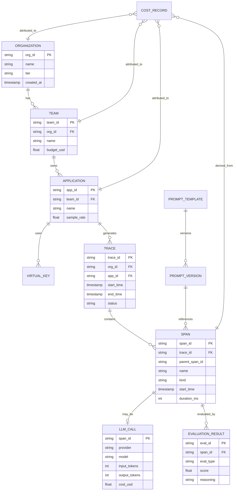

# Low-Level Design

## Data Model

### Entity Relationship Overview



---

## Schema Definitions

### Trace Schema (OTel GenAI Conventions)

```yaml
Trace:
  # Identifiers
  trace_id: string          # 128-bit UUID, hex-encoded
  org_id: string            # Organization identifier
  app_id: string            # Application identifier

  # Timing
  start_time: timestamp     # First span start
  end_time: timestamp       # Last span end (may be null for ongoing)
  duration_ms: int          # Total trace duration

  # Metadata
  status: enum              # [OK, ERROR, INCOMPLETE]
  span_count: int           # Total spans in trace

  # Aggregated metrics
  total_input_tokens: int
  total_output_tokens: int
  total_cost_usd: float

  # Business context
  user_id_hash: string      # One-way hash of user ID
  session_id: string        # Session identifier

  # Collection of spans
  spans: Span[]
```

### Span Schema

```yaml
Span:
  # Core identifiers
  span_id: string           # 64-bit UUID, hex-encoded
  trace_id: string          # Parent trace
  parent_span_id: string    # Parent span (null for root)

  # Naming
  name: string              # Operation name (e.g., "llm.chat", "tool.search")
  kind: enum                # [INTERNAL, CLIENT, SERVER, PRODUCER, CONSUMER]

  # Timing
  start_time: timestamp     # Span start (nanosecond precision)
  end_time: timestamp       # Span end
  duration_ns: int          # Duration in nanoseconds

  # Status
  status_code: enum         # [UNSET, OK, ERROR]
  status_message: string    # Error message if status=ERROR

  # Standard attributes
  attributes: map<string, any>

  # Events (logs within span)
  events: SpanEvent[]

  # Links to related spans
  links: SpanLink[]

SpanEvent:
  name: string
  timestamp: timestamp
  attributes: map<string, any>

SpanLink:
  trace_id: string
  span_id: string
  attributes: map<string, any>
```

### GenAI Semantic Convention Attributes

```yaml
# Provider and Model
gen_ai.system: string                    # "openai", "anthropic", "bedrock"
gen_ai.request.model: string             # Requested model name
gen_ai.response.model: string            # Actual model used (may differ)

# Request parameters
gen_ai.request.temperature: float        # 0.0 - 2.0
gen_ai.request.top_p: float             # 0.0 - 1.0
gen_ai.request.top_k: int               # Top-k sampling
gen_ai.request.max_tokens: int          # Max output tokens
gen_ai.request.stop_sequences: string[] # Stop sequences
gen_ai.request.frequency_penalty: float
gen_ai.request.presence_penalty: float

# Response metadata
gen_ai.response.finish_reasons: string[] # ["stop", "length", "tool_calls"]
gen_ai.response.id: string               # Provider response ID

# Token usage
gen_ai.usage.input_tokens: int           # Prompt tokens
gen_ai.usage.output_tokens: int          # Completion tokens
gen_ai.usage.total_tokens: int           # Total tokens

# Tool/Function calls
gen_ai.tool.name: string                 # Tool name
gen_ai.tool.description: string          # Tool description
gen_ai.tool.parameters: string           # JSON schema
```

### Platform-Specific Extension Attributes

```yaml
# LLMOps extensions (prefixed with llmops.)
llmops.prompt_version: string           # Prompt template version
llmops.prompt_template_id: string       # Template identifier
llmops.cost_usd: float                  # Calculated cost
llmops.cost_input_usd: float            # Input token cost
llmops.cost_output_usd: float           # Output token cost
llmops.cache_hit: boolean               # Whether cached
llmops.cache_type: string               # "exact", "semantic", "prefix"
llmops.evaluation_score: float          # Quality score (0-1)
llmops.evaluation_type: string          # Evaluation method used
llmops.user_feedback: string            # "thumbs_up", "thumbs_down"
llmops.feedback_comment: string         # User feedback text

# Content (stored separately, referenced by hash)
llmops.prompt_hash: string              # SHA-256 of prompt content
llmops.completion_hash: string          # SHA-256 of completion content
llmops.has_pii_redaction: boolean       # Whether PII was redacted
```

### Cost Record Schema

```yaml
CostRecord:
  # Primary key
  record_id: string                     # UUID
  timestamp: timestamp                  # Minute-level granularity

  # Dimensions (for GROUP BY)
  org_id: string
  team_id: string
  app_id: string
  virtual_key_hash: string              # Hashed API key
  model: string                         # Model name
  provider: string                      # Provider name
  environment: string                   # "production", "staging", "development"

  # Metrics (aggregated per minute)
  input_tokens: int
  output_tokens: int
  total_tokens: int
  cost_usd: float
  request_count: int
  error_count: int

  # Cache metrics
  cache_hits: int
  cache_savings_usd: float

  # Derived metrics
  avg_tokens_per_request: float
  avg_cost_per_request: float
  error_rate: float
```

### Evaluation Result Schema

```yaml
EvaluationResult:
  # Identifiers
  evaluation_id: string                 # UUID
  span_id: string                       # FK to evaluated span
  trace_id: string                      # FK to parent trace

  # Evaluator metadata
  evaluator:
    type: enum                          # [RULE, LLM_JUDGE, HUMAN, MODEL, BENCHMARK]
    evaluator_id: string                # Specific evaluator identifier
    evaluator_version: string           # Version of evaluator
    model: string                       # If LLM_JUDGE, which model

  # Results
  metrics:
    score: float                        # 0.0 - 1.0
    label: string                       # Optional classification
    reasoning: string                   # Explanation (for LLM_JUDGE)
    raw_output: string                  # Full evaluator output

  # Dimensions
  eval_type: enum                       # [HALLUCINATION, RELEVANCE, COHERENCE,
                                        #  SAFETY, FACTUALITY, HELPFULNESS, CUSTOM]

  # Performance
  latency_ms: int                       # Evaluation latency
  cost_usd: float                       # Cost if LLM_JUDGE

  # Metadata
  created_at: timestamp
  confidence: float                     # Evaluator's confidence (0-1)

  # Ground truth (if available)
  ground_truth:
    label: string
    annotator_id: string
    annotation_time: timestamp
```

### Prompt Version Schema

```yaml
PromptVersion:
  # Identifiers
  version_id: string                    # UUID
  template_id: string                   # Parent template
  version_number: int                   # Sequential version

  # Content
  content_hash: string                  # SHA-256 of content
  content_ref: string                   # Object storage reference

  # Metadata
  name: string                          # Human-readable name
  description: string
  variables: string[]                   # Template variables

  # Lifecycle
  status: enum                          # [DRAFT, ACTIVE, DEPRECATED, ARCHIVED]
  created_at: timestamp
  created_by: string
  activated_at: timestamp

  # A/B testing
  traffic_allocation: float             # 0.0 - 1.0
  experiment_id: string                 # A/B test identifier
```

---

## ClickHouse Table Design

### Spans Table

```sql
CREATE TABLE spans (
    -- Identifiers
    span_id String,
    trace_id String,
    parent_span_id Nullable(String),

    -- Organization context
    org_id LowCardinality(String),
    app_id LowCardinality(String),

    -- Span metadata
    name LowCardinality(String),
    kind Enum8('INTERNAL' = 0, 'CLIENT' = 1, 'SERVER' = 2, 'PRODUCER' = 3, 'CONSUMER' = 4),
    status_code Enum8('UNSET' = 0, 'OK' = 1, 'ERROR' = 2),
    status_message String,

    -- Timing
    start_time DateTime64(9),
    end_time DateTime64(9),
    duration_ns UInt64,

    -- GenAI attributes (denormalized for query performance)
    gen_ai_system LowCardinality(Nullable(String)),
    gen_ai_model LowCardinality(Nullable(String)),
    gen_ai_input_tokens Nullable(UInt32),
    gen_ai_output_tokens Nullable(UInt32),
    gen_ai_finish_reason LowCardinality(Nullable(String)),

    -- Cost (calculated during ingestion)
    cost_usd Nullable(Float32),

    -- LLMOps extensions
    prompt_version LowCardinality(Nullable(String)),
    prompt_hash Nullable(String),
    completion_hash Nullable(String),
    cache_hit Bool DEFAULT false,
    cache_type LowCardinality(Nullable(String)),

    -- Flexible attributes (for additional context)
    attributes Map(LowCardinality(String), String),

    -- Ingestion metadata
    received_at DateTime64(3) DEFAULT now64(3)
)
ENGINE = ReplicatedMergeTree('/clickhouse/tables/{shard}/spans', '{replica}')
PARTITION BY toYYYYMMDD(start_time)
ORDER BY (org_id, app_id, start_time, trace_id, span_id)
TTL start_time + INTERVAL 90 DAY
SETTINGS index_granularity = 8192;

-- Secondary index for trace lookup
ALTER TABLE spans ADD INDEX idx_trace_id trace_id TYPE bloom_filter GRANULARITY 4;

-- Secondary index for error queries
ALTER TABLE spans ADD INDEX idx_status_code status_code TYPE set(3) GRANULARITY 4;
```

### Cost Aggregations Table

```sql
CREATE TABLE cost_hourly (
    -- Time bucket
    hour DateTime,

    -- Dimensions
    org_id LowCardinality(String),
    team_id LowCardinality(String),
    app_id LowCardinality(String),
    model LowCardinality(String),
    provider LowCardinality(String),

    -- Aggregated metrics
    input_tokens SimpleAggregateFunction(sum, UInt64),
    output_tokens SimpleAggregateFunction(sum, UInt64),
    cost_usd SimpleAggregateFunction(sum, Float64),
    request_count SimpleAggregateFunction(sum, UInt64),
    error_count SimpleAggregateFunction(sum, UInt64),
    cache_hits SimpleAggregateFunction(sum, UInt64),
    cache_savings_usd SimpleAggregateFunction(sum, Float64),

    -- Latency percentiles
    latency_p50 AggregateFunction(quantile(0.5), UInt32),
    latency_p95 AggregateFunction(quantile(0.95), UInt32),
    latency_p99 AggregateFunction(quantile(0.99), UInt32)
)
ENGINE = ReplicatedAggregatingMergeTree('/clickhouse/tables/{shard}/cost_hourly', '{replica}')
PARTITION BY toYYYYMM(hour)
ORDER BY (org_id, hour, model)
TTL hour + INTERVAL 2 YEAR;

-- Materialized view to populate aggregations
CREATE MATERIALIZED VIEW cost_hourly_mv TO cost_hourly AS
SELECT
    toStartOfHour(start_time) AS hour,
    org_id,
    team_id,
    app_id,
    gen_ai_model AS model,
    gen_ai_system AS provider,
    sum(gen_ai_input_tokens) AS input_tokens,
    sum(gen_ai_output_tokens) AS output_tokens,
    sum(cost_usd) AS cost_usd,
    count() AS request_count,
    countIf(status_code = 'ERROR') AS error_count,
    countIf(cache_hit = true) AS cache_hits,
    sumIf(cost_usd, cache_hit = true) AS cache_savings_usd,
    quantileState(0.5)(duration_ns / 1000000) AS latency_p50,
    quantileState(0.95)(duration_ns / 1000000) AS latency_p95,
    quantileState(0.99)(duration_ns / 1000000) AS latency_p99
FROM spans
WHERE gen_ai_model IS NOT NULL
GROUP BY hour, org_id, team_id, app_id, model, provider;
```

---

## API Design

### Trace Ingestion API (OTLP Compatible)

```yaml
POST /v1/traces
Content-Type: application/x-protobuf
Authorization: Bearer {api_key}
X-LLMOps-Org-Id: org_123  # Optional, derived from API key

Request Body: OTel ExportTraceServiceRequest (protobuf)

Response (202 Accepted):
{
  "partial_success": {
    "rejected_spans": 0,
    "error_message": ""
  }
}

Response (400 Bad Request):
{
  "error": {
    "code": "INVALID_SCHEMA",
    "message": "Span missing required attribute: trace_id",
    "details": [...]
  }
}

Response (429 Too Many Requests):
{
  "error": {
    "code": "RATE_LIMITED",
    "message": "Rate limit exceeded for org_123",
    "retry_after_seconds": 30
  }
}
```

### Trace Query API

```yaml
POST /v1/traces/query
Authorization: Bearer {api_key}
Content-Type: application/json

Request:
{
  "time_range": {
    "start": "2026-01-27T00:00:00Z",
    "end": "2026-01-27T23:59:59Z"
  },
  "filters": [
    {"field": "gen_ai_model", "op": "eq", "value": "gpt-4o"},
    {"field": "gen_ai_input_tokens", "op": "gt", "value": 1000},
    {"field": "status_code", "op": "eq", "value": "ERROR"}
  ],
  "search": {
    "type": "semantic",  # or "keyword"
    "query": "user asked about refund policy",
    "threshold": 0.8
  },
  "select": ["trace_id", "start_time", "duration_ns", "cost_usd", "gen_ai_model"],
  "aggregations": [
    {"type": "count"},
    {"type": "avg", "field": "duration_ns"},
    {"type": "sum", "field": "cost_usd"}
  ],
  "group_by": ["gen_ai_model", "status_code"],
  "order_by": [{"field": "cost_usd", "direction": "DESC"}],
  "limit": 100,
  "offset": 0,
  "include_spans": true
}

Response (200 OK):
{
  "results": [
    {
      "trace_id": "abc123...",
      "start_time": "2026-01-27T10:30:00.123Z",
      "duration_ns": 2500000000,
      "cost_usd": 0.0245,
      "gen_ai_model": "gpt-4o",
      "spans": [...]  # if include_spans=true
    }
  ],
  "total_count": 1500,
  "aggregations": {
    "count": 1500,
    "avg_duration_ns": 1800000000,
    "sum_cost_usd": 234.56
  },
  "groups": [
    {"gen_ai_model": "gpt-4o", "status_code": "OK", "count": 1200},
    {"gen_ai_model": "gpt-4o", "status_code": "ERROR", "count": 300}
  ],
  "query_stats": {
    "execution_time_ms": 45,
    "rows_scanned": 50000,
    "cache_hit": false
  }
}
```

### Cost Analytics API

```yaml
GET /v1/cost/summary
Authorization: Bearer {api_key}

Query Parameters:
  start_date: 2026-01-01 (required)
  end_date: 2026-01-31 (required)
  group_by: model,team (comma-separated: org, team, app, model, provider)
  granularity: day (hour, day, week, month)
  include_breakdown: true

Response (200 OK):
{
  "summary": {
    "total_cost_usd": 15420.50,
    "total_input_tokens": 854200000,
    "total_output_tokens": 687850000,
    "total_tokens": 1542050000,
    "request_count": 1028700,
    "avg_cost_per_request": 0.015,
    "cache_savings_usd": 2340.00
  },
  "breakdown": [
    {
      "model": "gpt-4o",
      "team": "ml-platform",
      "cost_usd": 8500.00,
      "tokens": 850000000,
      "percentage": 55.1,
      "trend": "+12.3%"  # vs previous period
    },
    {
      "model": "claude-3-sonnet",
      "team": "ml-platform",
      "cost_usd": 4200.00,
      "tokens": 420000000,
      "percentage": 27.2,
      "trend": "-5.2%"
    }
  ],
  "time_series": [
    {
      "date": "2026-01-01",
      "cost_usd": 450.00,
      "tokens": 45000000,
      "request_count": 30000
    }
  ],
  "budget_status": {
    "limit_usd": 20000.00,
    "used_usd": 15420.50,
    "remaining_usd": 4579.50,
    "utilization_percent": 77.1,
    "projected_end_of_month": 18500.00
  }
}
```

### Evaluation API

```yaml
POST /v1/evaluations
Authorization: Bearer {api_key}
Content-Type: application/json

Request:
{
  "span_id": "span_abc123",
  "evaluator_type": "LLM_JUDGE",  # RULE, LLM_JUDGE, BENCHMARK
  "eval_types": ["HALLUCINATION", "RELEVANCE"],
  "input": {
    "prompt": "What is the refund policy?",
    "completion": "Our refund policy allows returns within 30 days...",
    "context": "...",  # For RAG groundedness
    "expected_output": "..."  # For correctness
  },
  "config": {
    "model": "gpt-4o-mini",  # For LLM_JUDGE
    "temperature": 0.0,
    "custom_criteria": "Check if dates mentioned are accurate"
  }
}

Response (200 OK):
{
  "evaluation_id": "eval_xyz789",
  "results": [
    {
      "eval_type": "HALLUCINATION",
      "score": 0.85,
      "label": "low_hallucination",
      "reasoning": "Response is grounded in the provided context. The 30-day policy matches the documentation.",
      "confidence": 0.92
    },
    {
      "eval_type": "RELEVANCE",
      "score": 0.95,
      "label": "highly_relevant",
      "reasoning": "Response directly answers the user's question about refund policy.",
      "confidence": 0.88
    }
  ],
  "metadata": {
    "latency_ms": 1250,
    "cost_usd": 0.002,
    "evaluator_model": "gpt-4o-mini"
  }
}

# Batch evaluation
POST /v1/evaluations/batch
{
  "span_ids": ["span_1", "span_2", "span_3"],
  "evaluator_type": "LLM_JUDGE",
  "eval_types": ["HALLUCINATION"],
  "async": true  # Return job ID, poll for results
}

Response (202 Accepted):
{
  "job_id": "job_123",
  "status_url": "/v1/evaluations/batch/job_123"
}
```

### Prompt Version API

```yaml
# Create new version
POST /v1/prompts/{template_id}/versions
{
  "content": "You are a helpful assistant. Answer the user's question about {{topic}}.",
  "name": "v2-more-concise",
  "description": "Shorter system prompt for faster responses",
  "variables": ["topic"],
  "traffic_allocation": 0.0  # Start with 0%, gradually increase
}

# Activate version for A/B testing
PATCH /v1/prompts/{template_id}/versions/{version_id}
{
  "status": "ACTIVE",
  "traffic_allocation": 0.1  # 10% of traffic
}

# Get version performance
GET /v1/prompts/{template_id}/versions/{version_id}/metrics
Response:
{
  "version_id": "v2",
  "metrics": {
    "request_count": 5000,
    "avg_latency_ms": 850,
    "avg_cost_usd": 0.012,
    "avg_tokens": 1200,
    "evaluation_scores": {
      "hallucination": 0.92,
      "relevance": 0.88
    },
    "user_feedback": {
      "thumbs_up": 420,
      "thumbs_down": 35,
      "satisfaction_rate": 0.923
    }
  },
  "comparison_to_control": {
    "latency_delta_percent": -8.5,
    "cost_delta_percent": -12.0,
    "quality_delta_percent": +2.3,
    "statistical_significance": 0.95
  }
}
```

---

## Core Algorithms

### Algorithm 1: Token Cost Attribution

```
FUNCTION calculate_and_attribute_cost(span):
    INPUT: span with GenAI attributes
    OUTPUT: cost_usd, attribution_chain

    // Step 1: Extract token counts
    input_tokens = span.attributes["gen_ai.usage.input_tokens"] OR 0
    output_tokens = span.attributes["gen_ai.usage.output_tokens"] OR 0
    model = span.attributes["gen_ai.response.model"]
    provider = span.attributes["gen_ai.system"]

    // Step 2: Lookup pricing (cached, refreshed hourly)
    pricing = CACHE_LOOKUP("pricing", provider, model)
    IF pricing IS NULL:
        pricing = DATABASE_LOOKUP(provider, model)
        CACHE_SET("pricing", provider, model, pricing, TTL=3600)

    // Step 3: Calculate base cost
    input_cost = (input_tokens / 1000) * pricing.input_per_1k_tokens
    output_cost = (output_tokens / 1000) * pricing.output_per_1k_tokens
    base_cost = input_cost + output_cost

    // Step 4: Apply modifiers
    final_cost = base_cost

    // Check for cached response
    IF span.attributes["llmops.cache_hit"] == true:
        cache_type = span.attributes["llmops.cache_type"]
        IF cache_type == "exact":
            final_cost = 0  // No LLM call made
        ELSE IF cache_type == "prefix":
            final_cost = base_cost * pricing.prefix_cache_discount  // e.g., 0.25
        ELSE IF cache_type == "semantic":
            final_cost = 0  // No LLM call made

    // Check for batch API (if applicable)
    IF span.attributes["gen_ai.request.batch"] == true:
        final_cost = final_cost * pricing.batch_discount  // e.g., 0.5

    // Step 5: Build attribution chain
    attribution = {
        "span_id": span.span_id,
        "trace_id": span.trace_id,
        "app_id": span.attributes["app_id"],
        "team_id": LOOKUP_TEAM(span.attributes["app_id"]),
        "org_id": span.attributes["org_id"],
        "model": model,
        "provider": provider,
        "input_tokens": input_tokens,
        "output_tokens": output_tokens,
        "cost_usd": final_cost,
        "timestamp": span.start_time
    }

    // Step 6: Record at each level (for aggregation)
    FOR level IN ["span", "app", "team", "org"]:
        INCREMENT_COST_COUNTER(
            level: level,
            entity_id: attribution[level + "_id"],
            model: model,
            cost: final_cost,
            tokens: input_tokens + output_tokens,
            timestamp: TRUNCATE_TO_MINUTE(span.start_time)
        )

    // Step 7: Check budget
    budget = GET_BUDGET(attribution.org_id, attribution.team_id)
    current_usage = GET_CURRENT_USAGE(attribution.org_id, attribution.team_id)

    IF current_usage + final_cost > budget.hard_limit:
        EMIT_ALERT("BUDGET_EXCEEDED", attribution)
        RETURN (final_cost, attribution, BUDGET_EXCEEDED)
    ELSE IF current_usage + final_cost > budget.soft_limit:
        EMIT_ALERT("BUDGET_WARNING", attribution)

    RETURN (final_cost, attribution, OK)

TIME_COMPLEXITY: O(1) - constant time lookups and calculations
SPACE_COMPLEXITY: O(1) - fixed size attribution record
```

### Algorithm 2: Hallucination Detection via Semantic Entropy

```
FUNCTION detect_hallucination_semantic_entropy(prompt, completion, context, n_samples=5):
    INPUT:
        prompt: string - Original user prompt
        completion: string - LLM response to evaluate
        context: string (optional) - Retrieved context for RAG
        n_samples: int - Number of alternative completions to generate
    OUTPUT:
        score: float (0.0 = hallucination, 1.0 = grounded)
        confidence: float (0.0 - 1.0)
        reasoning: string

    // Step 1: Generate multiple completions for the same prompt
    alternative_completions = []
    FOR i IN 1..n_samples:
        alt = LLM_GENERATE(
            prompt: prompt,
            context: context,
            temperature: 0.7,  // Higher temperature for diversity
            max_tokens: LEN(completion) * 1.5
        )
        alternative_completions.APPEND(alt)

    // Step 2: Compute embeddings for all completions
    target_embedding = EMBED(completion)
    alt_embeddings = [EMBED(c) FOR c IN alternative_completions]

    // Step 3: Cluster alternatives to find semantic groups
    // Using simple centroid-based clustering
    cluster_center = MEAN(alt_embeddings)
    cluster_distances = [COSINE_DISTANCE(e, cluster_center) FOR e IN alt_embeddings]
    avg_cluster_spread = MEAN(cluster_distances)

    // Step 4: Measure target's distance from cluster
    target_distance = COSINE_DISTANCE(target_embedding, cluster_center)

    // Step 5: Calculate semantic entropy
    // Low entropy = alternatives agree, high confidence
    // High entropy = alternatives disagree, lower confidence
    semantic_entropy = avg_cluster_spread

    // Step 6: Determine hallucination score
    IF semantic_entropy < 0.1:  // High agreement among alternatives
        IF target_distance < 0.15:
            score = 0.95  // Target matches consensus - low hallucination risk
            reasoning = "Response aligns with semantic consensus of alternatives"
        ELSE:
            score = 0.3   // Target deviates from consensus - potential hallucination
            reasoning = "Response deviates significantly from semantic consensus"
    ELSE IF semantic_entropy < 0.3:  // Moderate agreement
        score = 0.7 - (target_distance * 0.5)
        score = CLAMP(score, 0.3, 0.8)
        reasoning = "Moderate semantic spread; response partially aligned"
    ELSE:  // High entropy - LLM uncertain, hard to judge
        score = 0.5
        reasoning = "High semantic entropy; inconclusive hallucination detection"

    // Step 7: Boost confidence if context is provided (RAG case)
    IF context IS NOT NULL:
        context_embedding = EMBED(context)
        grounding_score = COSINE_SIMILARITY(target_embedding, context_embedding)

        IF grounding_score > 0.7:
            score = MAX(score, grounding_score)
            reasoning += "; Response well-grounded in provided context"

    // Step 8: Calculate confidence based on entropy
    confidence = 1.0 - semantic_entropy
    confidence = CLAMP(confidence, 0.3, 0.95)

    RETURN {
        "score": score,
        "confidence": confidence,
        "reasoning": reasoning,
        "semantic_entropy": semantic_entropy,
        "cluster_spread": avg_cluster_spread,
        "target_distance": target_distance
    }

TIME_COMPLEXITY: O(n_samples * embedding_time + clustering_time)
                 ≈ O(n * 100ms) = ~500ms for n=5
SPACE_COMPLEXITY: O(n_samples * embedding_dimension)
                  ≈ O(5 * 1536) = ~30KB
```

### Algorithm 3: Content-Addressed Prompt Storage

```
FUNCTION store_prompt_content(prompt, completion, span_id):
    INPUT:
        prompt: string - Prompt content
        completion: string - Completion content
        span_id: string - Reference to parent span
    OUTPUT:
        prompt_hash: string
        completion_hash: string
        storage_decision: enum

    // Step 1: Normalize content for consistent hashing
    normalized_prompt = NORMALIZE(prompt)  // Trim, normalize whitespace
    normalized_completion = NORMALIZE(completion)

    // Step 2: Compute exact hashes
    prompt_hash = SHA256(normalized_prompt)
    completion_hash = SHA256(normalized_completion)

    // Step 3: Check if exact match exists (deduplication)
    existing_prompt = LOOKUP_BY_HASH(prompt_hash)
    IF existing_prompt IS NOT NULL:
        // Just add reference, don't store content again
        ADD_REFERENCE(prompt_hash, span_id)
        prompt_decision = "REFERENCE_EXISTING"
    ELSE:
        // Step 4: Check for near-duplicates using LSH
        prompt_embedding = EMBED(normalized_prompt)
        lsh_bucket = LOCALITY_SENSITIVE_HASH(prompt_embedding, buckets=1_000_000)

        similar_prompts = LOOKUP_BY_LSH_BUCKET(lsh_bucket)

        IF similar_prompts IS NOT EMPTY:
            most_similar = FIND_MOST_SIMILAR(similar_prompts, prompt_embedding, threshold=0.95)
            IF most_similar IS NOT NULL:
                // Store as delta from similar prompt
                delta = COMPUTE_DIFF(most_similar.content, normalized_prompt)
                STORE_DELTA(prompt_hash, most_similar.hash, delta)
                prompt_decision = "STORE_DELTA"
            ELSE:
                STORE_FULL(prompt_hash, normalized_prompt, prompt_embedding, lsh_bucket)
                prompt_decision = "STORE_FULL"
        ELSE:
            STORE_FULL(prompt_hash, normalized_prompt, prompt_embedding, lsh_bucket)
            prompt_decision = "STORE_FULL"

    // Step 5: Store completion (similar logic, but usually unique)
    completion_decision = STORE_FULL(completion_hash, normalized_completion)

    // Step 6: Link to span
    UPDATE_SPAN(span_id, {
        "prompt_hash": prompt_hash,
        "completion_hash": completion_hash
    })

    RETURN {
        "prompt_hash": prompt_hash,
        "completion_hash": completion_hash,
        "prompt_storage": prompt_decision,
        "completion_storage": completion_decision,
        "space_saved_bytes": CALCULATE_SAVINGS(prompt_decision, normalized_prompt)
    }

TIME_COMPLEXITY: O(embedding_time + hash_time + lookup_time)
                 ≈ O(100ms + 1ms + 10ms) = ~110ms
SPACE_COMPLEXITY: O(content_size + embedding_size)
```

### Algorithm 4: Adaptive Trace Sampling

```
FUNCTION should_sample_trace(context):
    INPUT:
        context: {
            trace_id: string,
            org_id: string,
            app_id: string,
            span_attributes: map,
            error: boolean,
            estimated_cost: float,
            latency_hint: int (ms)
        }
    OUTPUT:
        should_sample: boolean
        sample_rate: float
        reason: string

    // Step 1: Always sample important traces
    IF context.error == true:
        RETURN {sample: true, rate: 1.0, reason: "ALWAYS_SAMPLE_ERROR"}

    IF context.estimated_cost > HIGH_COST_THRESHOLD:  // e.g., $0.10
        RETURN {sample: true, rate: 1.0, reason: "ALWAYS_SAMPLE_HIGH_COST"}

    IF context.latency_hint > SLOW_REQUEST_THRESHOLD:  // e.g., 30s
        RETURN {sample: true, rate: 1.0, reason: "ALWAYS_SAMPLE_SLOW"}

    // Step 2: Get base sample rate from configuration
    base_rate = GET_CONFIG_SAMPLE_RATE(context.app_id)
    IF base_rate IS NULL:
        base_rate = GET_ORG_DEFAULT_RATE(context.org_id)
    IF base_rate IS NULL:
        base_rate = 0.1  // Default 10%

    // Step 3: Adjust for current traffic volume
    current_qps = GET_CURRENT_QPS(context.app_id, window=60s)
    target_qps = GET_TARGET_TRACE_QPS(context.app_id)  // e.g., 1000 traces/min

    IF current_qps * base_rate > target_qps:
        // Reduce rate to stay within target
        volume_factor = target_qps / (current_qps * base_rate)
        volume_factor = CLAMP(volume_factor, 0.01, 1.0)
    ELSE:
        volume_factor = 1.0

    // Step 4: Apply priority boosting
    priority_boost = 1.0

    // Boost new prompt versions (for A/B testing)
    IF context.span_attributes["llmops.prompt_version"] IN ACTIVE_EXPERIMENTS:
        priority_boost = priority_boost * 5.0

    // Boost specific users (for debugging)
    IF context.span_attributes["user_id"] IN DEBUG_USER_LIST:
        priority_boost = priority_boost * 10.0

    // Step 5: Calculate effective sample rate
    effective_rate = base_rate * volume_factor * priority_boost
    effective_rate = CLAMP(effective_rate, 0.001, 1.0)

    // Step 6: Make deterministic decision (head-based sampling)
    // Using trace_id ensures all spans of same trace sampled together
    hash_value = HASH(context.trace_id) MOD 10000
    threshold = effective_rate * 10000

    should_sample = hash_value < threshold

    RETURN {
        sample: should_sample,
        rate: effective_rate,
        reason: FORMAT("BASE={} VOL={} BOOST={}", base_rate, volume_factor, priority_boost)
    }

TIME_COMPLEXITY: O(1) - all lookups are cached
SPACE_COMPLEXITY: O(1)
```

### Algorithm 5: Trace Assembly for Agent Workflows

```
FUNCTION assemble_traces(span_stream, config):
    INPUT:
        span_stream: continuous stream of spans
        config: {
            assembly_timeout: duration (default 5 minutes),
            max_spans_per_trace: int (default 10000),
            partial_emit_threshold: int (default 100 spans)
        }
    OUTPUT:
        complete_trace_stream: stream of assembled traces

    // State: buffered partial traces
    trace_buffers = MAP<trace_id, TraceBuffer>

    FUNCTION TraceBuffer:
        spans: LIST<Span>
        first_seen: timestamp
        last_updated: timestamp
        root_span: Span (nullable)
        expected_child_count: int (estimated)

    FOR EACH span IN span_stream:
        trace_id = span.trace_id

        // Step 1: Get or create buffer
        IF trace_id NOT IN trace_buffers:
            trace_buffers[trace_id] = NEW TraceBuffer(
                spans: [],
                first_seen: NOW(),
                last_updated: NOW()
            )

        buffer = trace_buffers[trace_id]

        // Step 2: Add span to buffer
        buffer.spans.APPEND(span)
        buffer.last_updated = NOW()

        // Track root span
        IF span.parent_span_id IS NULL:
            buffer.root_span = span

        // Step 3: Check for trace completion
        IF is_trace_complete(buffer):
            assembled = build_trace_tree(buffer)
            EMIT(complete_trace_stream, assembled)
            DELETE trace_buffers[trace_id]
            CONTINUE

        // Step 4: Check for timeout (long-running agents)
        IF NOW() - buffer.first_seen > config.assembly_timeout:
            // Emit partial trace
            assembled = build_trace_tree(buffer)
            assembled.status = "PARTIAL_TIMEOUT"
            EMIT(complete_trace_stream, assembled)
            DELETE trace_buffers[trace_id]
            CONTINUE

        // Step 5: Check for buffer overflow
        IF LEN(buffer.spans) > config.max_spans_per_trace:
            // Emit what we have, keep buffer for more
            assembled = build_trace_tree(buffer)
            assembled.status = "PARTIAL_OVERFLOW"
            EMIT(complete_trace_stream, assembled)
            // Keep recent spans in buffer
            buffer.spans = buffer.spans[-100:]

    FUNCTION is_trace_complete(buffer) -> boolean:
        // A trace is complete if:
        // 1. Root span exists and has ended
        // 2. All spans have ended
        // 3. No span is expecting children (heuristic)

        IF buffer.root_span IS NULL:
            RETURN false

        IF buffer.root_span.end_time IS NULL:
            RETURN false

        FOR span IN buffer.spans:
            IF span.end_time IS NULL:
                RETURN false

        // Check time gap - if no new spans for 30s after root ended
        IF NOW() - buffer.last_updated > 30s AND buffer.root_span.end_time IS NOT NULL:
            RETURN true

        RETURN false

    FUNCTION build_trace_tree(buffer) -> Trace:
        // Build parent-child relationships
        span_map = MAP<span_id, Span>
        FOR span IN buffer.spans:
            span_map[span.span_id] = span

        // Attach children to parents
        FOR span IN buffer.spans:
            IF span.parent_span_id IS NOT NULL:
                parent = span_map[span.parent_span_id]
                IF parent IS NOT NULL:
                    parent.children.APPEND(span)

        // Calculate trace-level metrics
        trace = NEW Trace(
            trace_id: buffer.spans[0].trace_id,
            root_span: buffer.root_span,
            span_count: LEN(buffer.spans),
            start_time: MIN(span.start_time FOR span IN buffer.spans),
            end_time: MAX(span.end_time FOR span IN buffer.spans),
            total_tokens: SUM(span.gen_ai_input_tokens + span.gen_ai_output_tokens),
            total_cost: SUM(span.cost_usd)
        )

        RETURN trace

TIME_COMPLEXITY: O(n) per trace where n = number of spans
SPACE_COMPLEXITY: O(active_traces * avg_spans_per_trace)
                  For 10K active traces with 100 spans each = ~10M spans in memory
```

---

## Indexing Strategy

### ClickHouse Indexes

| Table | Partition Key | Primary Key (Order By) | TTL | Notes |
|-------|---------------|------------------------|-----|-------|
| `spans` | `toYYYYMMDD(start_time)` | `(org_id, app_id, start_time, trace_id)` | 90 days | Hot path for queries |
| `spans_by_trace` | `toYYYYMMDD(start_time)` | `(trace_id, span_id)` | 90 days | Trace reconstruction |
| `cost_hourly` | `toYYYYMM(hour)` | `(org_id, hour, model)` | 2 years | Cost dashboards |
| `eval_results` | `toYYYYMMDD(created_at)` | `(span_id, eval_type)` | 180 days | Evaluation queries |

### Secondary Indexes

```sql
-- Bloom filter for trace_id lookups
ALTER TABLE spans ADD INDEX idx_trace_id trace_id TYPE bloom_filter GRANULARITY 4;

-- Set index for status filtering
ALTER TABLE spans ADD INDEX idx_status status_code TYPE set(3) GRANULARITY 4;

-- MinMax for cost range queries
ALTER TABLE spans ADD INDEX idx_cost cost_usd TYPE minmax GRANULARITY 4;
```

### Vector Index for Semantic Search

| Index | Type | Parameters | Use Case |
|-------|------|------------|----------|
| Prompt embeddings | HNSW | M=16, efConstruction=200 | Find similar prompts |
| Completion embeddings | HNSW | M=16, efConstruction=200 | Find similar outputs |

```sql
-- Vector index creation (in vector database)
CREATE INDEX prompt_embedding_idx ON prompts
USING hnsw (embedding vector_cosine_ops)
WITH (m = 16, ef_construction = 200);
```
