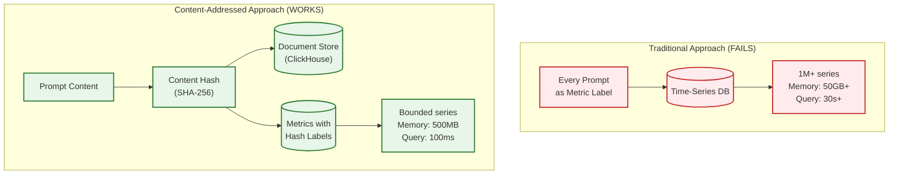
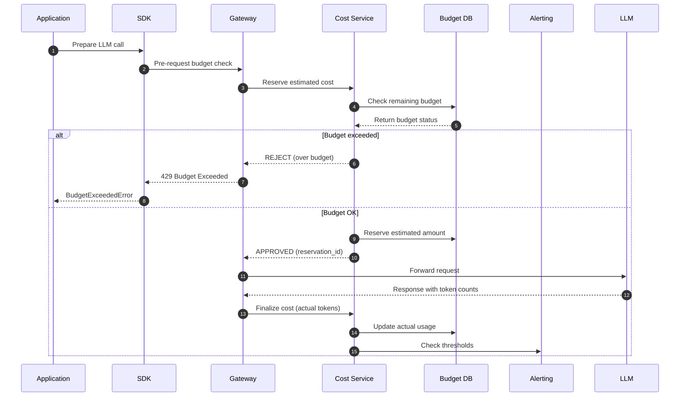
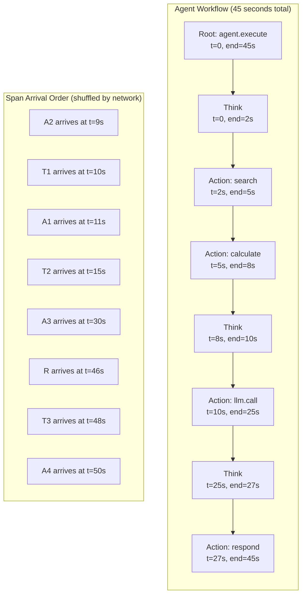

# Deep Dive and Bottlenecks

## Critical Component 1: High-Cardinality Label Management

### Why This Is Critical

Traditional observability systems use labels/tags for aggregation and filtering. However, LLM observability creates a **cardinality explosion** problem:

| Data Type | Cardinality | Problem |
|-----------|-------------|---------|
| Model name | ~50 | Low - no issue |
| Provider | ~10 | Low - no issue |
| Organization | ~1,000 | Medium - manageable |
| Application | ~100,000 | High - starting to hurt |
| **Prompt content** | **Billions** | **Explosive - breaks systems** |
| User ID | ~10 million | Very high - needs careful handling |

**Impact of unbounded cardinality:**
- Time-series databases (Prometheus, InfluxDB) create one series per unique label combination
- 1 million unique prompts = 1 million time series = memory explosion
- Query performance degrades exponentially
- Storage costs skyrocket

### How Traditional Approaches Fail



### Solution: Content-Addressed Storage

**Core Insight:** Store content separately, reference by hash.

```
ARCHITECTURE:

┌─────────────────────────────────────────────────────────────┐
│ Incoming Span with Prompt/Completion                        │
└─────────────────────────┬───────────────────────────────────┘
                          │
                          ▼
┌─────────────────────────────────────────────────────────────┐
│ Step 1: Hash Content                                        │
│   prompt_hash = SHA256(normalize(prompt))                   │
│   completion_hash = SHA256(normalize(completion))           │
└─────────────────────────┬───────────────────────────────────┘
                          │
          ┌───────────────┴───────────────┐
          ▼                               ▼
┌─────────────────────┐       ┌─────────────────────────────┐
│ Content Store       │       │ Metrics/Spans Store          │
│ (Object Storage)    │       │ (ClickHouse/Time-Series)     │
│                     │       │                              │
│ Key: prompt_hash    │       │ Labels:                      │
│ Value: {            │       │   - org_id (low card)        │
│   content: "...",   │       │   - model (low card)         │
│   embedding: [...], │       │   - prompt_hash (deduped)    │
│   refs: [span_ids]  │       │   - completion_hash (deduped)│
│ }                   │       │                              │
└─────────────────────┘       └─────────────────────────────┘
```

### Deduplication Benefits

| Scenario | Storage Without Dedup | Storage With Dedup | Savings |
|----------|----------------------|-------------------|---------|
| Same prompt, 1M calls | 1M × 2KB = 2GB | 1 × 2KB = 2KB | 99.9999% |
| Similar prompts (95% same) | 100K × 2KB = 200MB | 100K × 100B delta = 10MB | 95% |
| Completely unique | 100K × 2KB = 200MB | 100K × 2KB = 200MB | 0% |
| **Typical production mix** | **10GB/day** | **4GB/day** | **60%** |

### Implementation Details

**Near-Duplicate Detection using LSH:**

```
FUNCTION find_near_duplicates(prompt_embedding, threshold=0.95):
    // Locality-Sensitive Hashing for fast similarity search

    // Step 1: Generate LSH signature
    lsh_signature = []
    FOR i IN 1..num_hash_functions:  // e.g., 128 hash functions
        // Random hyperplane projection
        hyperplane = RANDOM_UNIT_VECTOR(embedding_dim)
        projection = DOT_PRODUCT(prompt_embedding, hyperplane)
        lsh_signature.APPEND(1 IF projection >= 0 ELSE 0)

    // Step 2: Divide into bands
    num_bands = 16
    rows_per_band = num_hash_functions / num_bands  // 8 rows per band

    candidate_buckets = []
    FOR band_idx IN 0..num_bands:
        band_signature = lsh_signature[band_idx * rows_per_band : (band_idx+1) * rows_per_band]
        bucket_key = HASH(band_signature)
        candidate_buckets.APPEND(bucket_key)

    // Step 3: Find candidates from any matching band
    candidates = SET()
    FOR bucket IN candidate_buckets:
        candidates.UNION(LOOKUP_BUCKET(bucket))

    // Step 4: Verify with exact similarity
    near_duplicates = []
    FOR candidate IN candidates:
        similarity = COSINE_SIMILARITY(prompt_embedding, candidate.embedding)
        IF similarity >= threshold:
            near_duplicates.APPEND(candidate)

    RETURN near_duplicates
```

### Trade-offs

| Approach | Storage | Query Complexity | Debugging | Privacy |
|----------|---------|------------------|-----------|---------|
| Store inline | Very High | Simple joins | Easy | All in one place |
| Hash + reference | Low | Hash lookup | Extra step | Separable |
| Hash + semantic dedup | Very Low | Complex (LSH) | May lose exact content | Separable |

**Recommendation:** Hash + reference for most use cases. Add semantic dedup for high-volume, cost-sensitive deployments.

---

## Critical Component 2: Real-Time Cost Tracking

### Why This Is Critical

LLM API costs can spiral quickly:
- GPT-4 at $30/1M input tokens, $60/1M output tokens
- A runaway agent loop can cost $1000s in minutes
- Multi-tenant platforms need accurate per-customer billing
- Budget enforcement must be real-time to prevent overspend

### Architecture for Real-Time Cost



### Cost Calculation Pipeline

```
PIPELINE: Real-Time Cost Tracking

Stage 1: PRE-REQUEST ESTIMATION (Optional, for strict budgets)
┌─────────────────────────────────────────────────────────────┐
│ Input: prompt_tokens (known), max_tokens (configured)       │
│ Estimate: max_cost = (prompt_tokens × input_price) +        │
│                      (max_tokens × output_price)            │
│ Action: Reserve max_cost against budget                     │
└─────────────────────────────────────────────────────────────┘
                              │
                              ▼
Stage 2: POST-REQUEST FINALIZATION
┌─────────────────────────────────────────────────────────────┐
│ Input: actual input_tokens, output_tokens from response     │
│ Calculate: actual_cost = (input_tokens × input_price) +     │
│                          (output_tokens × output_price)     │
│ Action: Update counters, release unused reservation         │
└─────────────────────────────────────────────────────────────┘
                              │
                              ▼
Stage 3: AGGREGATION (Near real-time)
┌─────────────────────────────────────────────────────────────┐
│ Aggregate by: minute → hour → day → month                   │
│ Dimensions: org, team, app, model, provider                 │
│ Storage: Time-series DB for dashboards                      │
└─────────────────────────────────────────────────────────────┘
                              │
                              ▼
Stage 4: RECONCILIATION (Batch, hourly)
┌─────────────────────────────────────────────────────────────┐
│ Compare: streaming totals vs. batch re-aggregation          │
│ Correct: any discrepancies from retries, late arrivals      │
│ Output: billing-accurate cost records                       │
└─────────────────────────────────────────────────────────────┘
```

### Handling Concurrent Requests

**Problem:** Multiple requests arrive simultaneously, each checking budget before any complete.

```
Time    Request 1         Request 2         Budget (limit: $100)
t=0     Check: $80 OK     -                 Used: $80, Avail: $20
t=1     Reserve: $15      Check: $80 OK     Reserved: $15, Avail: $5
t=2     -                 Reserve: $15      CONFLICT! Both reserved
t=3     Use: $12          Use: $14          Actual: $106 > $100!
```

**Solution: Pessimistic Reservation with Sliding Window**

```
FUNCTION check_and_reserve_budget(org_id, team_id, estimated_cost):
    // Use Redis for atomic operations

    key = FORMAT("budget:{}:{}", org_id, team_id)
    reservation_key = FORMAT("reservation:{}:{}", org_id, team_id)

    // Atomic check-and-reserve
    REDIS_TRANSACTION:
        current_used = REDIS_GET(key) OR 0
        current_reserved = REDIS_GET(reservation_key) OR 0
        budget_limit = GET_BUDGET_LIMIT(org_id, team_id)

        total_committed = current_used + current_reserved + estimated_cost

        IF total_committed > budget_limit:
            RETURN REJECT("Budget would be exceeded")

        // Reserve with TTL (in case request never completes)
        reservation_id = UUID()
        REDIS_HSET(reservation_key, reservation_id, estimated_cost)
        REDIS_EXPIRE(reservation_key, 300)  // 5 minute TTL

        RETURN APPROVE(reservation_id)

FUNCTION finalize_cost(reservation_id, actual_cost):
    // Release reservation, record actual cost
    REDIS_HDEL(reservation_key, reservation_id)
    REDIS_INCRBY(budget_key, actual_cost)
```

### Budget Hierarchy

```
ORGANIZATION: Acme Corp ($10,000/month)
│
├── TEAM: ML Platform ($5,000/month)
│   ├── APP: Chat Assistant ($2,000)
│   │   ├── Virtual Key: prod-chat-001 ($1,500)
│   │   └── Virtual Key: staging-chat-001 ($500)
│   └── APP: Search Optimizer ($3,000)
│
├── TEAM: Product ($3,000/month)
│   └── APP: Feature Suggestion ($3,000)
│
└── TEAM: Research ($2,000/month)
    └── (no individual limits)
```

**Enforcement Rules:**
1. Request blocked if ANY level in hierarchy exceeds limit
2. Alerts sent at 50%, 80%, 90%, 100% of each level
3. Hard limit at organization level, soft limits below
4. Carry-over: unused budget does NOT roll over

---

## Critical Component 3: Trace Assembly for Agent Workflows

### Why This Is Critical

Modern AI agents differ from traditional request-response:

| Characteristic | Traditional API | AI Agent |
|----------------|-----------------|----------|
| Duration | Milliseconds | Minutes to hours |
| Span count | 1-5 | 10-1000+ |
| Arrival order | Sequential | Highly out-of-order |
| Completion signal | Response received | Complex heuristics |
| Parent discovery | Immediate | May be delayed |

### Trace Assembly Challenges



### Trace Assembly State Machine

```
STATE: BUFFERING
  Entry: First span of trace_id arrives
  Buffer: Store in memory with timeout
  Transitions:
    → COMPLETE: when is_complete() returns true
    → PARTIAL_TIMEOUT: when age > assembly_timeout
    → PARTIAL_OVERFLOW: when span_count > max_spans

STATE: COMPLETE
  Entry: Trace determined complete
  Action: Build tree, calculate aggregates, emit trace
  Cleanup: Remove from buffer

STATE: PARTIAL_TIMEOUT
  Entry: Trace timed out waiting for spans
  Action: Build partial tree, mark as INCOMPLETE, emit
  Cleanup: Remove from buffer (or keep minimal state for late arrivals)

STATE: PARTIAL_OVERFLOW
  Entry: Too many spans to buffer
  Action: Emit current spans, keep recent 100 in buffer
  Continue: Accept more spans, emit periodically
```

### Completeness Detection Heuristics

```
FUNCTION is_trace_complete(buffer) -> (complete: bool, confidence: float):
    // Heuristic 1: Root span completed
    IF buffer.root_span IS NULL:
        RETURN (false, 0.0)  // No root yet

    IF buffer.root_span.end_time IS NULL:
        RETURN (false, 0.1)  // Root still running

    // Heuristic 2: All spans have end times
    open_spans = COUNT(span FOR span IN buffer.spans WHERE span.end_time IS NULL)
    IF open_spans > 0:
        RETURN (false, 0.3)  // Still have open spans

    // Heuristic 3: Gap since last span
    time_since_last = NOW() - buffer.last_updated
    IF time_since_last < 5s:
        RETURN (false, 0.5)  // May have more coming

    IF time_since_last > 30s:
        RETURN (true, 0.95)  // Probably done

    // Heuristic 4: All parent_ids resolved
    unresolved_parents = 0
    FOR span IN buffer.spans:
        IF span.parent_span_id IS NOT NULL:
            IF span.parent_span_id NOT IN buffer.span_ids:
                unresolved_parents += 1

    IF unresolved_parents > 0:
        RETURN (false, 0.4)  // Missing parent spans

    // Heuristic 5: Root span duration matches child span total
    root_duration = buffer.root_span.duration_ns
    child_duration = SUM(span.duration_ns FOR span IN buffer.spans WHERE span != root)
    duration_ratio = child_duration / root_duration

    IF duration_ratio > 0.8:
        RETURN (true, 0.9)  // Children fill most of root duration

    // Default: probably complete if we got here
    RETURN (true, 0.7)
```

### Memory Management for Long-Running Traces

**Problem:** Agent traces can run for hours, accumulating thousands of spans.

**Solution: Tiered buffering**

```
TIER 1: In-Memory (Hot)
  - Traces < 5 minutes old
  - Traces with < 100 spans
  - Capacity: ~1M spans across ~10K traces

TIER 2: Redis/Disk (Warm)
  - Traces 5-60 minutes old
  - Traces with 100-1000 spans
  - Spill from memory when capacity exceeded

TIER 3: Streaming Emit (Cold)
  - Traces > 60 minutes
  - Emit partial traces every 100 spans
  - Keep only last 100 spans in buffer for context
```

---

## Bottleneck Analysis

### Bottleneck 1: Ingestion Backpressure

**Symptom:** Kafka consumer lag growing, traces delayed 10+ seconds

**Root Causes:**
1. Spike in traffic (10x normal)
2. Slow downstream (ClickHouse write stall)
3. Complex enrichment (pricing lookup timeout)

**Mitigation Strategies:**

| Strategy | Implementation | Trade-off |
|----------|----------------|-----------|
| Adaptive sampling | Reduce sample rate when lag > threshold | Lose trace coverage |
| Queue partitioning | More Kafka partitions, more consumers | Operational complexity |
| Shed load | Drop low-priority traces | Data loss |
| Backpressure signal | Return 429 to SDKs | Client-side buffering |

**Monitoring Queries:**

```sql
-- Kafka consumer lag
kafka_consumer_lag_sum{consumer_group="trace-processor"} > 100000

-- Write latency spike
histogram_quantile(0.99, rate(clickhouse_write_duration_seconds_bucket[5m])) > 5
```

### Bottleneck 2: Query Performance on Large Time Ranges

**Symptom:** Dashboard queries timing out for 30-day views

**Root Causes:**
1. Scanning too much data (no partition pruning)
2. High-cardinality GROUP BY
3. No pre-aggregation for common queries

**Mitigation Strategies:**

| Strategy | Implementation | Trade-off |
|----------|----------------|-----------|
| Pre-aggregation | Materialized views for hourly/daily | Storage cost, schema rigidity |
| Partition pruning | Ensure queries include partition key | Query complexity |
| Query result caching | Cache with 1-minute TTL | Staleness |
| Query limits | Max 7 days raw, 90 days aggregated | Flexibility |

**ClickHouse Optimization:**

```sql
-- Before: Full table scan
SELECT model, sum(cost_usd)
FROM spans
WHERE start_time >= now() - INTERVAL 30 DAY
GROUP BY model;

-- After: Use pre-aggregated table
SELECT model, sum(cost_usd)
FROM cost_daily
WHERE date >= today() - 30
GROUP BY model;

-- Speedup: 100x (30 days of daily rows vs. billions of spans)
```

### Bottleneck 3: Evaluation Pipeline Latency

**Symptom:** LLM-as-Judge evaluations backlogging, 10+ minute delays

**Root Causes:**
1. LLM API rate limits
2. Token-heavy evaluations
3. Sequential processing

**Mitigation Strategies:**

| Strategy | Implementation | Trade-off |
|----------|----------------|-----------|
| Parallel evaluation | Multiple workers, provider parallelism | Cost, rate limits |
| Smaller judge model | GPT-4o-mini vs GPT-4o | Lower accuracy |
| Aggressive sampling | Evaluate 1% of spans | Lower coverage |
| Cached evaluations | Hash prompt+completion, reuse scores | May miss nuances |
| Tiered evaluation | Fast rules first, LLM for uncertain | Complexity |

**Evaluation Pipeline Optimization:**

```
BEFORE:
  Every span → LLM Judge → Score
  Latency: 2s per span
  Cost: $0.002 per span
  At 1M spans/day: 23 days to evaluate, $2000/day

AFTER (Tiered):
  Every span → Rule Engine (5ms) → Score if confident
    ↓ (10% uncertain)
  Sample 10% → Fast LLM (gpt-4o-mini, 200ms) → Score if confident
    ↓ (5% still uncertain)
  Sample 5% → Full LLM (gpt-4o, 2s) → Score

  Effective latency: 20ms average
  Effective cost: $50/day
  Coverage: 100% get some score, 5% get premium evaluation
```

---

## Performance Optimizations

### Optimization 1: Columnar Compression for Spans

ClickHouse compression strategies:

| Column | Type | Encoding | Compression | Ratio |
|--------|------|----------|-------------|-------|
| org_id | LowCardinality | Dictionary | LZ4 | 50:1 |
| model | LowCardinality | Dictionary | LZ4 | 100:1 |
| start_time | DateTime64 | Delta | LZ4 | 10:1 |
| duration_ns | UInt64 | Delta | LZ4 | 8:1 |
| input_tokens | UInt32 | Gorilla | LZ4 | 5:1 |
| attributes | Map | - | ZSTD | 3:1 |
| **Overall** | | | | **10-15:1** |

**Configuration:**

```sql
CREATE TABLE spans (
    ...
)
ENGINE = MergeTree()
SETTINGS
    index_granularity = 8192,
    min_bytes_for_wide_part = 10485760,
    compress_block_size = 65536;

-- Use ZSTD for cold data
ALTER TABLE spans MODIFY SETTING storage_policy = 'tiered';
```

### Optimization 2: Bloom Filters for Trace Lookup

```sql
-- Create bloom filter index on trace_id
ALTER TABLE spans
ADD INDEX idx_trace_bloom trace_id
TYPE bloom_filter(0.01)  -- 1% false positive rate
GRANULARITY 4;

-- Query with trace_id now skips non-matching granules
SELECT * FROM spans WHERE trace_id = 'abc123...';
-- Before: Scans all granules in partition
-- After: Checks bloom filter, skips 99%+ of granules
```

### Optimization 3: Prompt Embedding Caching

```
CACHE STRATEGY for Embeddings:

Layer 1: In-Memory LRU (per worker)
  - Size: 10,000 embeddings (~15MB at 1.5KB each)
  - TTL: 1 hour
  - Hit rate: 60-80% (common prompts)

Layer 2: Redis Cluster
  - Size: 1 million embeddings (~1.5GB)
  - TTL: 24 hours
  - Hit rate: 90-95%

Layer 3: Compute (embedding model)
  - Only for cache misses
  - Batch requests for efficiency
```

**Cache Key Design:**

```
// Don't use raw prompt as key (too long, variable)
cache_key = SHA256(normalize(prompt))

// Store embedding with metadata
cache_value = {
    embedding: float[768],
    model: "text-embedding-3-small",
    computed_at: timestamp,
    prompt_length: int
}
```

### Optimization 4: Query Push-Down

```
BEFORE (Application-side filtering):
  Query: SELECT * FROM spans WHERE org_id = 'org123'
  Fetch: 1M rows from ClickHouse
  Filter: In application, keep 10K rows

AFTER (Push-down to ClickHouse):
  Query: SELECT * FROM spans
         WHERE org_id = 'org123'
         AND start_time >= now() - INTERVAL 1 HOUR
         AND model = 'gpt-4o'
         LIMIT 1000
  Fetch: 1K rows from ClickHouse (using indexes)

Improvement: 1000x less data transfer
```

### Optimization 5: Async Evaluation with Priority Queues

```
QUEUE STRUCTURE:

High Priority Queue (process immediately):
  - Error spans (need debugging insight)
  - High-cost spans (> $0.10)
  - Flagged by real-time rules

Medium Priority Queue (process within 1 minute):
  - Random sample (10%)
  - Spans with user feedback
  - A/B test variants

Low Priority Queue (process within 1 hour):
  - Remaining sampled spans
  - Batch evaluation jobs

PROCESSING:
  - High: 10 workers, dedicated
  - Medium: 5 workers, shared
  - Low: 2 workers, best-effort
```
