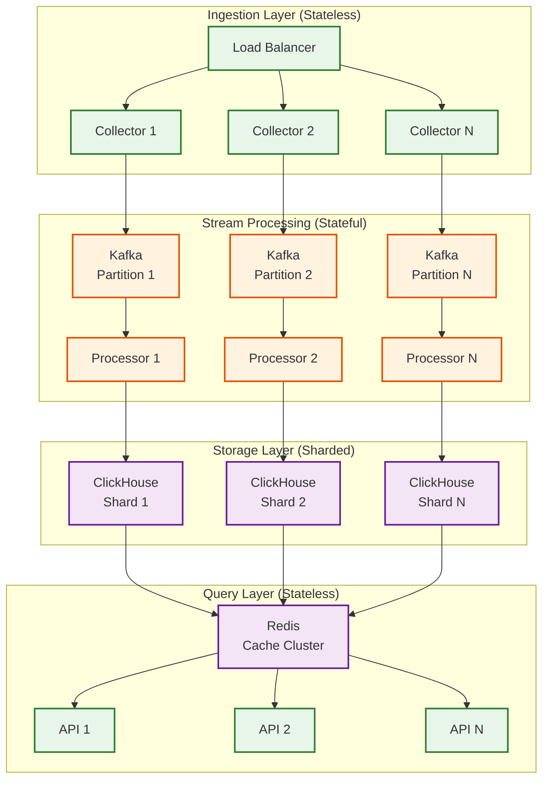
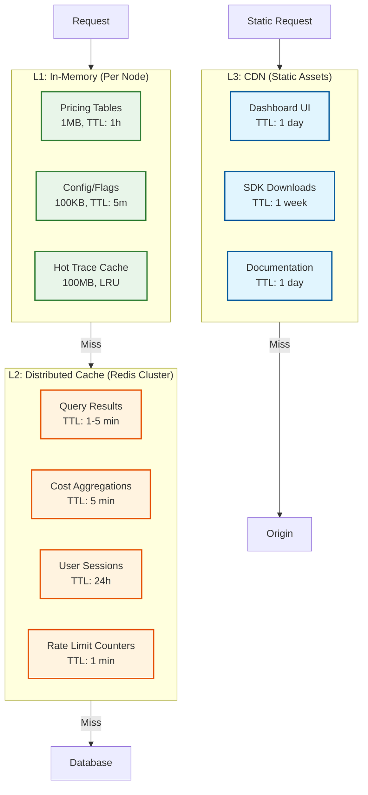
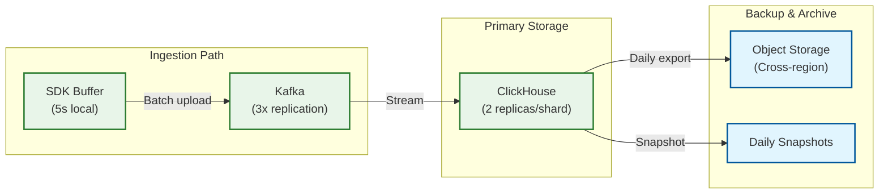
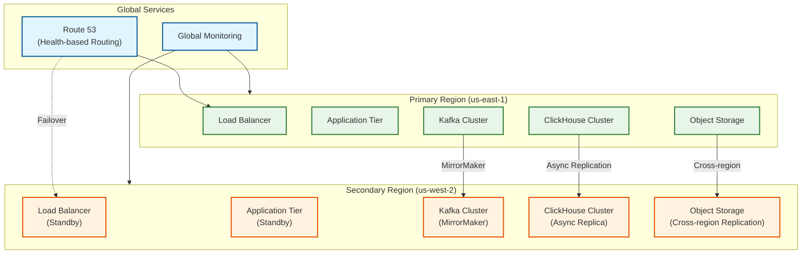

# Scalability and Reliability

## Scalability

### Horizontal Scaling Strategy



### Component Scaling Characteristics

| Component | Scaling Type | Bottleneck | Scale Trigger | Strategy |
|-----------|--------------|------------|---------------|----------|
| **Collectors** | Horizontal | Network I/O, CPU | QPS > 10K/instance | Add instances, DNS LB |
| **Kafka** | Horizontal | Disk I/O, Partitions | Lag > 100K messages | Add partitions (requires rebalance) |
| **Stream Processors** | Horizontal | Memory (buffering) | Consumer lag | Scale with partition count |
| **ClickHouse** | Horizontal + Vertical | Disk I/O, Memory | Query latency P99 > 5s | Add shards, add replicas |
| **Query API** | Horizontal | CPU (query parsing) | QPS > 5K/instance | Add instances |
| **Evaluation Workers** | Horizontal | External API limits | Queue depth > 10K | Add workers (respect rate limits) |
| **Redis Cache** | Horizontal | Memory | Evictions > 1K/min | Add nodes to cluster |

### Sharding Strategy

| Data Type | Shard Key | Rationale | Distribution |
|-----------|-----------|-----------|--------------|
| **Traces/Spans** | `org_id` | Query locality, tenant isolation | Hash-based |
| **Cost Aggregations** | `org_id + time_bucket` | Time-range queries, tenant reports | Composite |
| **Prompt Content** | `content_hash` | Even distribution, deduplication | Hash-based |
| **Embeddings** | `embedding_hash` | Even distribution | Hash-based |
| **Evaluation Results** | `trace_id` | Co-locate with trace data | Hash-based |

**ClickHouse Sharding Configuration:**

```xml
<clickhouse>
    <remote_servers>
        <llmops_cluster>
            <shard>
                <replica>
                    <host>clickhouse-shard1-replica1</host>
                    <port>9000</port>
                </replica>
                <replica>
                    <host>clickhouse-shard1-replica2</host>
                    <port>9000</port>
                </replica>
            </shard>
            <shard>
                <replica>
                    <host>clickhouse-shard2-replica1</host>
                    <port>9000</port>
                </replica>
                <replica>
                    <host>clickhouse-shard2-replica2</host>
                    <port>9000</port>
                </replica>
            </shard>
        </llmops_cluster>
    </remote_servers>
</clickhouse>
```

```sql
-- Distributed table
CREATE TABLE spans_distributed AS spans
ENGINE = Distributed(
    llmops_cluster,
    default,
    spans,
    cityHash64(org_id)  -- Shard key
);
```

### Caching Strategy



### Cache Invalidation Strategy

| Cache Type | Invalidation Method | Trigger |
|------------|---------------------|---------|
| Query results | TTL-based (1-5 min) | Time expiry |
| Cost aggregations | TTL + event-based | New cost records |
| Pricing tables | Event-based | Admin update |
| Configuration | Pub/sub broadcast | Config change |
| Trace lookups | LRU eviction | Cache full |

### Auto-Scaling Configuration

```yaml
# Kubernetes HPA for Query API
apiVersion: autoscaling/v2
kind: HorizontalPodAutoscaler
metadata:
  name: query-api-hpa
spec:
  scaleTargetRef:
    apiVersion: apps/v1
    kind: Deployment
    name: query-api
  minReplicas: 5
  maxReplicas: 50
  metrics:
    - type: Resource
      resource:
        name: cpu
        target:
          type: Utilization
          averageUtilization: 70
    - type: Pods
      pods:
        metric:
          name: http_requests_per_second
        target:
          type: AverageValue
          averageValue: "5000"
  behavior:
    scaleUp:
      stabilizationWindowSeconds: 60
      policies:
        - type: Pods
          value: 4
          periodSeconds: 60
    scaleDown:
      stabilizationWindowSeconds: 300
      policies:
        - type: Percent
          value: 10
          periodSeconds: 60
```

---

## Reliability and Fault Tolerance

### Single Points of Failure Analysis

| Component | SPOF Risk | Impact | Mitigation |
|-----------|-----------|--------|------------|
| Load Balancer | Low | All ingestion stops | Multi-AZ LB, health checks |
| Kafka | Medium | Data buffering fails | Multi-broker, replication=3 |
| ZooKeeper (Kafka) | Medium | Kafka coordination fails | 3-node ensemble, separate AZs |
| ClickHouse | Medium | Queries fail, data loss | Replicated tables, multi-shard |
| Redis Cache | Low | Cache misses increase | Cluster mode, sentinel failover |
| Query API | Low | Dashboard unavailable | Stateless, multi-instance |
| Evaluation Engine | Medium | Quality scores delayed | Circuit breakers, fallback |

### Data Durability Strategy



| Data Type | Replication | Backup Frequency | Retention | RPO |
|-----------|-------------|------------------|-----------|-----|
| Kafka topics | 3 replicas | N/A (live) | 7 days | 0 (sync) |
| ClickHouse tables | 2 replicas | Daily | 90 days hot, 2 years cold | 1 minute |
| Object storage | Cross-region | Continuous | 7 years | 0 (sync) |
| Redis cache | 2 replicas | Hourly snapshot | N/A (reconstructable) | N/A |

### Failure Modes and Recovery

| Failure Scenario | Detection | Impact | Recovery |
|------------------|-----------|--------|----------|
| **Single collector down** | Health check (10s) | Minimal (LB routes around) | Auto-heal via Kubernetes |
| **Kafka broker down** | ISR < min (30s) | Partition unavailable briefly | Leader election (< 30s) |
| **ClickHouse node down** | Query errors (10s) | Replica serves reads | Manual or auto replica promotion |
| **Ingestion backpressure** | Consumer lag (1 min) | Trace delay increases | Scale processors, adaptive sampling |
| **Evaluation API timeout** | Timeout counter (1 min) | Quality scores delayed | Circuit breaker, skip evaluation |
| **Full storage** | Disk usage > 90% | Writes fail | Emergency TTL reduction, scale storage |

### Circuit Breaker Configuration

```yaml
# Circuit breaker for LLM evaluation service
circuit_breaker:
  name: llm_evaluation

  # Failure detection
  failure_threshold_percentage: 50  # 50% failures trigger open
  slow_call_threshold_percentage: 80  # 80% slow calls trigger open
  slow_call_duration_ms: 5000  # Calls > 5s are "slow"
  minimum_calls: 20  # Minimum calls before evaluating
  sliding_window_size: 100  # Last 100 calls
  sliding_window_type: COUNT_BASED

  # State transitions
  wait_duration_in_open_state_ms: 30000  # 30s in open state
  permitted_calls_in_half_open_state: 10  # Test calls in half-open

  # Fallback behavior
  fallback:
    action: SKIP_EVALUATION
    log_for_retry: true
    metrics_label: "fallback"

# Circuit breaker for external embedding API
circuit_breaker:
  name: embedding_api
  failure_threshold_percentage: 30
  slow_call_duration_ms: 500
  wait_duration_in_open_state_ms: 10000
  fallback:
    action: USE_CACHED_EMBEDDING
    cache_stale_duration_ms: 3600000  # 1 hour stale OK
```

### Retry Strategy

```yaml
# Retry configuration for critical operations
retry_policies:
  # ClickHouse writes
  clickhouse_write:
    max_attempts: 5
    initial_backoff_ms: 100
    max_backoff_ms: 10000
    backoff_multiplier: 2
    retryable_errors:
      - NETWORK_ERROR
      - TIMEOUT
      - TABLE_LOCKED
    non_retryable_errors:
      - QUOTA_EXCEEDED
      - INVALID_DATA

  # Kafka publish
  kafka_publish:
    max_attempts: 3
    initial_backoff_ms: 50
    acks: "all"  # Wait for all replicas
    retries: 3
    retry_backoff_ms: 100

  # External API calls
  external_api:
    max_attempts: 3
    initial_backoff_ms: 1000
    max_backoff_ms: 30000
    backoff_multiplier: 2
    timeout_ms: 30000
    add_jitter: true
    jitter_factor: 0.2
```

### Graceful Degradation Modes

| Degradation Level | Trigger | Behavior |
|-------------------|---------|----------|
| **Level 0: Normal** | All systems healthy | Full functionality |
| **Level 1: Reduced Evaluation** | Eval queue > 100K | Skip non-critical evaluations |
| **Level 2: Reduced Sampling** | Ingestion lag > 1M | Reduce sample rate to 1% |
| **Level 3: Essential Only** | Storage > 90% | Accept traces but skip content storage |
| **Level 4: Read-Only** | Critical failure | Stop ingestion, allow reads only |

---

## Disaster Recovery

### RTO and RPO Targets

| Tier | Scenario | RTO | RPO | Strategy |
|------|----------|-----|-----|----------|
| **Tier 1** | Single component failure | 5 min | 1 min | Auto-failover |
| **Tier 2** | Availability zone failure | 30 min | 5 min | Cross-AZ replicas |
| **Tier 3** | Region failure | 4 hours | 30 min | DR region activation |
| **Tier 4** | Data corruption | 24 hours | 24 hours | Point-in-time recovery |

### Multi-Region Strategy



### Failover Procedure

```
REGION FAILOVER RUNBOOK

Pre-conditions:
  - Primary region health check failing for > 5 minutes
  - Secondary region data lag < 30 minutes
  - Failover approved by on-call lead

Step 1: Verify secondary health (2 min)
  [ ] Check secondary Kafka cluster health
  [ ] Check secondary ClickHouse cluster health
  [ ] Check secondary application tier ready
  [ ] Verify data replication lag acceptable

Step 2: Stop writes to primary (1 min)
  [ ] Update Kafka MirrorMaker to stop replication
  [ ] Drain remaining messages (wait for lag = 0)
  [ ] Mark primary as read-only in config

Step 3: Promote secondary (5 min)
  [ ] Promote secondary Kafka to primary
  [ ] Promote secondary ClickHouse replicas
  [ ] Update application configs to use local resources

Step 4: Update DNS (5 min)
  [ ] Update Route 53 health check to secondary
  [ ] Wait for DNS propagation
  [ ] Verify traffic flowing to secondary

Step 5: Validate (10 min)
  [ ] Check ingestion metrics (spans/second)
  [ ] Check query latency
  [ ] Check dashboard functionality
  [ ] Notify stakeholders

Total estimated time: 23 minutes
```

### Backup Strategy

| Data Type | Backup Method | Frequency | Retention | Location |
|-----------|---------------|-----------|-----------|----------|
| Kafka topics | MirrorMaker | Continuous | 7 days | DR region |
| ClickHouse | Native backup | Daily | 30 days | Object storage |
| Configuration | Git + encrypted S3 | On change | Forever | Multi-region S3 |
| Secrets | Vault snapshots | Hourly | 7 days | Encrypted S3 |
| Redis | RDB snapshots | Hourly | 24 hours | Local + S3 |

---

## Capacity Planning

### Growth Model

| Metric | Year 1 | Year 2 | Year 3 | Year 5 |
|--------|--------|--------|--------|--------|
| Organizations | 1,000 | 2,500 | 5,000 | 15,000 |
| Applications | 100,000 | 300,000 | 600,000 | 2,000,000 |
| LLM Calls/Day | 1B | 3B | 8B | 25B |
| Peak QPS | 50,000 | 150,000 | 400,000 | 1,200,000 |
| Storage/Year | 900 TB | 2.7 PB | 7.2 PB | 22.5 PB |
| Kafka Partitions | 100 | 300 | 800 | 2,400 |
| ClickHouse Shards | 4 | 12 | 32 | 100 |
| API Instances | 20 | 60 | 160 | 500 |

### Infrastructure Scaling Triggers

| Metric | Current Capacity | Scale Trigger | Scale Action |
|--------|------------------|---------------|--------------|
| Ingestion QPS | 60K/cluster | > 50K sustained | Add collector instances |
| Kafka partitions | 100 | Consumer lag > 100K | Add partitions + consumers |
| ClickHouse storage | 80% | > 70% | Add shards |
| Query latency P99 | 5s | > 3s sustained | Add replicas, optimize queries |
| Evaluation backlog | 50K | > 30K | Add evaluation workers |

### Cost Optimization Strategies

| Strategy | Savings | Trade-off |
|----------|---------|-----------|
| Tiered storage (hot/warm/cold) | 40% | Query latency for old data |
| Aggressive TTL | 30% | Less historical data |
| Sampling increase | 50% | Reduced trace coverage |
| Reserved instances | 30% | Commit to capacity |
| Spot instances (evaluation) | 60% | May be interrupted |
