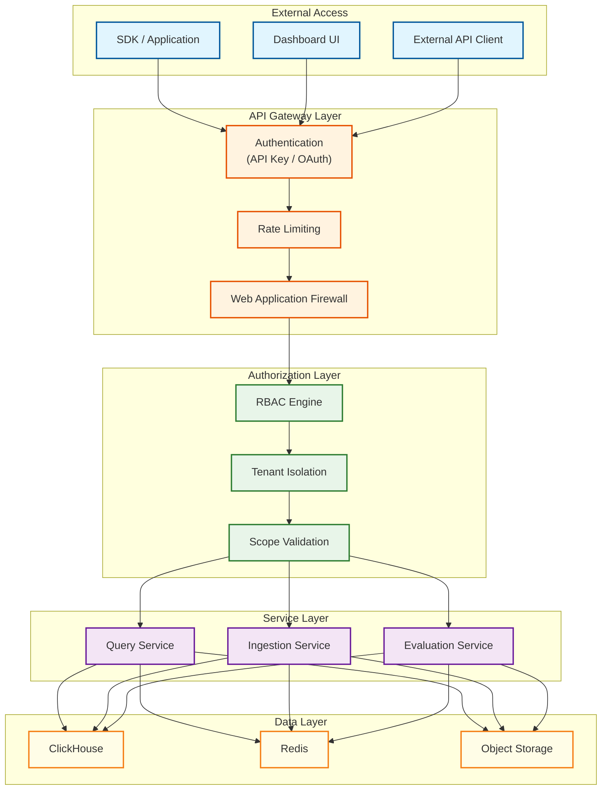
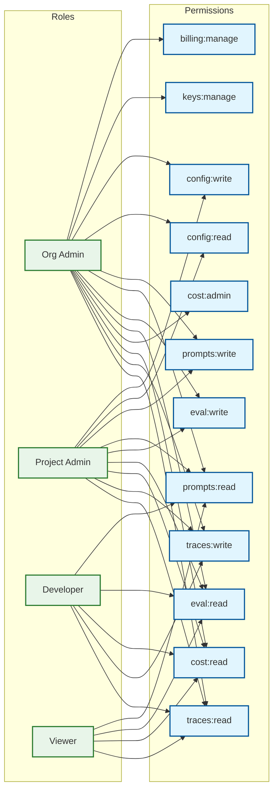
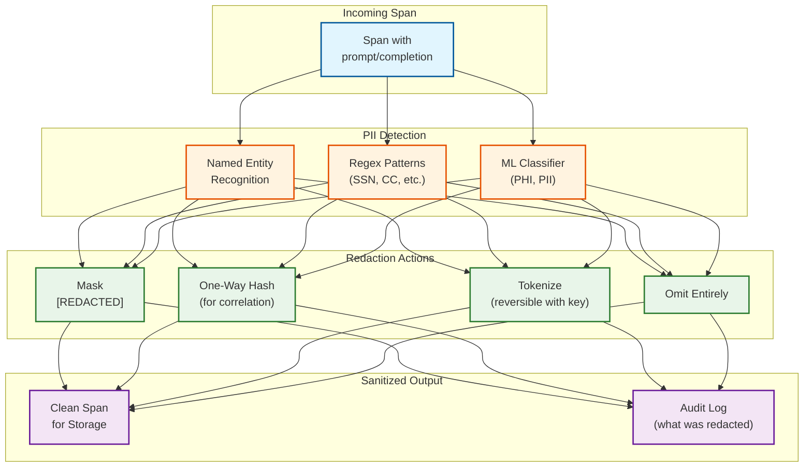
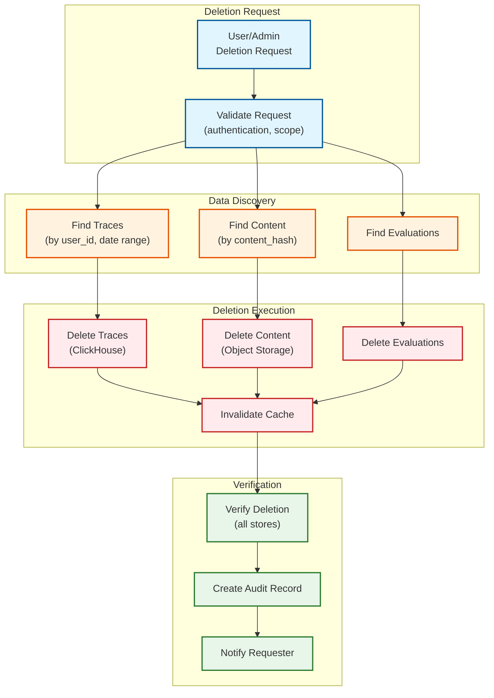

# Security and Compliance

## Authentication and Authorization

### Multi-Layer Security Architecture



### API Key Types and Scopes

| Key Type | Prefix | Scope | Use Case | TTL |
|----------|--------|-------|----------|-----|
| **Organization Admin** | `llmops_org_` | Full organization access | Admin operations, billing | 1 year |
| **Project Key** | `llmops_proj_` | Single project read/write | Application instrumentation | 90 days |
| **Read-Only Key** | `llmops_ro_` | Query only, no writes | Dashboard embedding | 30 days |
| **Evaluation Key** | `llmops_eval_` | Evaluation endpoint only | CI/CD integration | 30 days |
| **Ingestion Key** | `llmops_ing_` | Trace ingestion only | SDK authentication | 90 days |

**Key Format:**

```
llmops_{type}_{org_id_short}_{random_32_chars}

Example: llmops_proj_acme_a1b2c3d4e5f6g7h8i9j0k1l2m3n4o5p6
```

### RBAC Model



| Role | Description | Typical User |
|------|-------------|--------------|
| **Org Admin** | Full access including billing, key management | CTO, Platform Lead |
| **Project Admin** | Project configuration, data access | Tech Lead |
| **Developer** | Query, create traces, view evaluations | Engineers |
| **Viewer** | Read-only dashboard access | Stakeholders |

### OAuth 2.0 / OIDC Integration

```yaml
# OAuth 2.0 configuration for SSO
oauth2:
  providers:
    - name: okta
      issuer: https://company.okta.com
      client_id: ${OKTA_CLIENT_ID}
      client_secret: ${OKTA_CLIENT_SECRET}
      scopes: ["openid", "profile", "email", "groups"]
      claim_mappings:
        org_id: "custom:org_id"
        roles: "groups"

    - name: azure_ad
      issuer: https://login.microsoftonline.com/{tenant_id}/v2.0
      client_id: ${AZURE_CLIENT_ID}
      client_secret: ${AZURE_CLIENT_SECRET}
      scopes: ["openid", "profile", "email"]

  session:
    cookie_name: llmops_session
    cookie_secure: true
    cookie_http_only: true
    cookie_same_site: strict
    max_age_seconds: 86400  # 24 hours
    refresh_threshold_seconds: 3600  # Refresh if < 1 hour remaining
```

---

## Data Security

### PII in Prompts and Completions

**The Challenge:** LLM telemetry inherently contains user data embedded in prompts and completions.

| Data Type | Examples | Risk Level |
|-----------|----------|------------|
| Direct PII | Names, emails, phone numbers | High |
| Indirect PII | IP addresses, device IDs | Medium |
| Sensitive Content | Medical info, financial data | Very High |
| Business Confidential | Trade secrets, strategies | High |
| User-Generated Content | Questions, feedback | Medium |

### PII Detection and Redaction Pipeline



### Redaction Strategies by Data Type

| Data Type | Detection Method | Redaction Action | Example |
|-----------|------------------|------------------|---------|
| Email | Regex | Mask | `john@example.com` → `[EMAIL_REDACTED]` |
| Phone | Regex | Mask | `555-123-4567` → `[PHONE_REDACTED]` |
| SSN | Regex | Mask | `123-45-6789` → `[SSN_REDACTED]` |
| Credit Card | Regex + Luhn | Mask | `4111-1111-1111-1111` → `[CC_REDACTED]` |
| Names | NER | Pseudonymize | `John Smith` → `User_A7B3` |
| Addresses | NER | Generalize | `123 Main St, NYC` → `[LOCATION]` |
| User ID | Config-based | Hash | `user_123` → `a1b2c3d4...` |
| IP Address | Regex | Truncate | `192.168.1.100` → `192.168.1.0/24` |

### Redaction Implementation

```
FUNCTION redact_pii(content, config):
    INPUT:
        content: string (prompt or completion)
        config: redaction configuration
    OUTPUT:
        redacted_content: string
        redaction_report: list of redactions

    redaction_report = []

    // Step 1: Regex-based detection (fast, precise patterns)
    FOR pattern IN config.regex_patterns:
        matches = REGEX_FIND_ALL(content, pattern.regex)
        FOR match IN matches:
            redacted_content = REPLACE(
                content,
                match,
                FORMAT("[{}_REDACTED]", pattern.type)
            )
            redaction_report.APPEND({
                type: pattern.type,
                action: "MASK",
                position: match.position,
                hash: SHA256(match.text)  // For audit correlation
            })

    // Step 2: NER-based detection (ML model)
    entities = NER_MODEL.detect(content)
    FOR entity IN entities:
        IF entity.type IN config.ner_types_to_redact:
            IF entity.confidence >= config.ner_confidence_threshold:
                action = config.ner_actions[entity.type]

                IF action == "MASK":
                    replacement = FORMAT("[{}_REDACTED]", entity.type)
                ELSE IF action == "HASH":
                    replacement = FORMAT("{}_{}", entity.type, SHA256(entity.text)[:8])
                ELSE IF action == "PSEUDONYMIZE":
                    replacement = GET_PSEUDONYM(entity.text, entity.type)

                redacted_content = REPLACE(content, entity.text, replacement)
                redaction_report.APPEND({
                    type: entity.type,
                    action: action,
                    confidence: entity.confidence,
                    hash: SHA256(entity.text)
                })

    // Step 3: Custom patterns (organization-specific)
    FOR custom_pattern IN config.custom_patterns:
        matches = REGEX_FIND_ALL(content, custom_pattern.regex)
        FOR match IN matches:
            redacted_content = REPLACE(content, match, custom_pattern.replacement)
            redaction_report.APPEND({
                type: "CUSTOM:" + custom_pattern.name,
                action: custom_pattern.action
            })

    RETURN (redacted_content, redaction_report)
```

### Encryption Strategy

| Layer | Encryption Type | Key Management | Scope |
|-------|-----------------|----------------|-------|
| **In Transit** | TLS 1.3 | Auto-rotated certs | All traffic |
| **At Rest (ClickHouse)** | AES-256-GCM | Cluster key | Full disk encryption |
| **At Rest (Object Storage)** | AES-256-GCM | Per-bucket keys | All objects |
| **Application-Level** | AES-256-GCM | Per-org keys | Sensitive fields |
| **API Keys** | Argon2id | N/A (hashed) | Key storage |

**Per-Organization Encryption:**

```
ARCHITECTURE: Envelope Encryption

Master Key (HSM-backed)
    │
    ├── Org Key: org_123 (encrypted by Master)
    │   ├── Prompt content (encrypted by Org Key)
    │   └── Completion content (encrypted by Org Key)
    │
    └── Org Key: org_456 (encrypted by Master)
        ├── Prompt content (encrypted by Org Key)
        └── Completion content (encrypted by Org Key)

Benefits:
- Org-level isolation
- Key rotation without re-encrypting all data
- Regulatory compliance (data deletion = key deletion)
```

---

## Threat Model

### Threat 1: Prompt Injection via Telemetry

**Attack Vector:** Attacker crafts malicious prompts that get stored in the observability system and execute when viewed by operators in the dashboard.

```
Example Attack:
  Prompt: "Hello <script>stealCookies()</script>"
  Risk: XSS when displayed in dashboard
```

**Mitigations:**

| Mitigation | Implementation |
|------------|----------------|
| Content Security Policy | `Content-Security-Policy: script-src 'self'` |
| HTML Sanitization | Sanitize all content before display |
| Output Encoding | Encode special characters in UI |
| No eval() | Never execute stored content |

### Threat 2: Data Exfiltration via Query API

**Attack Vector:** Attacker with valid API key extracts large volumes of sensitive data.

```
Example Attack:
  - Obtain read-only API key (phishing, leaked)
  - Query for all traces in last 90 days
  - Export to external system
```

**Mitigations:**

| Mitigation | Implementation |
|------------|----------------|
| Query result limits | Max 10,000 rows per query |
| Rate limiting | 100 queries/minute per key |
| Audit logging | Log all queries with response size |
| Anomaly detection | Alert on unusual query patterns |
| IP allowlisting | Optional IP restrictions per key |
| Export approval | Bulk exports require admin approval |

### Threat 3: Cost Manipulation Attack

**Attack Vector:** Competitor sends fake telemetry to inflate target's costs.

```
Example Attack:
  - Obtain or guess target's ingestion API key
  - Send millions of fake spans with high token counts
  - Inflate target's reported costs and trigger alerts
```

**Mitigations:**

| Mitigation | Implementation |
|------------|----------------|
| API key validation | Validate every request |
| Token count limits | Reject spans with unrealistic token counts |
| Rate limiting | Per-key ingestion limits |
| Anomaly detection | Flag sudden usage spikes |
| Source verification | Validate SDK signature (optional) |

### Threat 4: Insider Threat

**Attack Vector:** Employee with access abuses privileges to access customer data.

**Mitigations:**

| Mitigation | Implementation |
|------------|----------------|
| Least privilege | Minimal access by default |
| Just-in-time access | Time-bound elevated access |
| Audit logging | Log all admin actions |
| Separation of duties | No single person can access + export |
| Regular access reviews | Quarterly access audits |

### Threat 5: Supply Chain Attack

**Attack Vector:** Malicious code in SDK or dependencies exfiltrates data.

**Mitigations:**

| Mitigation | Implementation |
|------------|----------------|
| Dependency scanning | Automated vulnerability scanning |
| SDK code review | Open-source SDKs for transparency |
| Package signing | Sign official SDK releases |
| SRI hashes | Subresource integrity for CDN assets |
| Vendor security reviews | SOC 2 Type II for third parties |

---

## Compliance

### Regulatory Compliance Matrix

| Regulation | Applicability | Key Requirements | Impact on LLMOps |
|------------|---------------|------------------|------------------|
| **GDPR** | EU users | Data minimization, right to erasure, DPO | PII redaction, deletion workflows |
| **CCPA** | California users | Disclosure, opt-out, data access | Privacy policy, data export |
| **HIPAA** | Healthcare (US) | PHI protection, BAAs | Enhanced encryption, access controls |
| **SOC 2 Type II** | Enterprise customers | Security controls, audit trail | Comprehensive logging, access reviews |
| **ISO 27001** | Global enterprises | ISMS, risk management | Security program documentation |
| **EU AI Act** | EU AI applications | Transparency, risk assessment | Model observability requirements |

### GDPR Compliance Implementation

| GDPR Requirement | Implementation |
|------------------|----------------|
| **Lawful Basis** | Legitimate interest (observability for service operation) |
| **Data Minimization** | Configurable content logging (metadata only option) |
| **Purpose Limitation** | Data used only for observability, not marketing |
| **Storage Limitation** | Configurable retention (default 90 days) |
| **Right to Access** | Self-service data export API |
| **Right to Erasure** | Deletion by user_id, trace_id, or date range |
| **Data Portability** | Export in JSON, Parquet formats |
| **Breach Notification** | 72-hour notification process |

### Data Retention Policies

| Data Type | Default Retention | GDPR Minimum | HIPAA Minimum | Configurable |
|-----------|-------------------|--------------|---------------|--------------|
| Raw traces | 90 days | Delete on request | 6 years | Yes |
| Prompt content | 30 days | Delete on request | 6 years | Yes |
| Aggregated metrics | 2 years | Anonymized OK | 6 years | No |
| Evaluation results | 180 days | Delete on request | 6 years | Yes |
| Audit logs | 7 years | 1 year minimum | 6 years | No |
| Cost records | 7 years | 1 year minimum | N/A | No |

### Data Deletion Workflow



### Audit Logging

```yaml
AuditEvent:
  event_id: uuid
  timestamp: ISO8601 (nanosecond precision)
  event_type: string  # e.g., "trace.query", "config.update", "key.create"

  actor:
    type: enum [USER, SERVICE, API_KEY, SYSTEM]
    id: string
    email: string (if user)
    ip_address: string
    user_agent: string

  organization:
    org_id: string
    org_name: string

  resource:
    type: enum [TRACE, EVALUATION, CONFIG, API_KEY, USER, ORGANIZATION]
    id: string
    name: string (optional)

  action:
    type: enum [CREATE, READ, UPDATE, DELETE, QUERY, EXPORT]
    detail: string

  request:
    path: string
    method: string
    query_params: map (sanitized)
    body_hash: string (for non-GET)

  response:
    status_code: int
    data_size_bytes: int
    row_count: int (for queries)

  outcome: enum [SUCCESS, FAILURE, DENIED]

  metadata:
    source_region: string
    request_id: string
    trace_id: string (for correlation)
```

**Audit Log Retention:**

- Hot storage: 30 days (queryable in real-time)
- Warm storage: 1 year (queryable with delay)
- Archive: 7 years (legal hold, retrieval on request)

### Security Certifications Roadmap

| Certification | Status | Target Date | Scope |
|---------------|--------|-------------|-------|
| SOC 2 Type I | Planned | Q2 2026 | Platform + operations |
| SOC 2 Type II | Planned | Q4 2026 | Platform + operations |
| ISO 27001 | Planned | Q2 2027 | Organization-wide |
| HIPAA BAA | Available | Current | Healthcare customers |
| GDPR DPA | Available | Current | EU customers |
