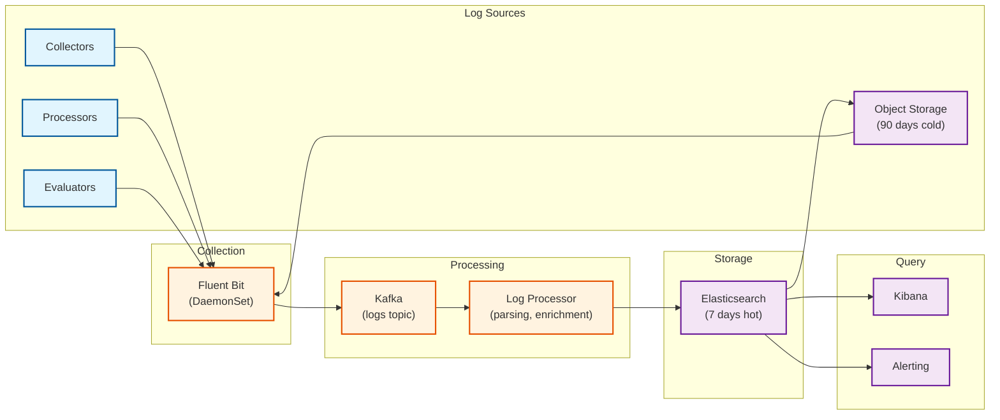

# Observability (Meta-Observability)

## Overview

An observability platform must itself be observable. This section defines how to monitor, trace, and alert on the LLMOps platform's own health and performance.

**Key Principle:** Use the same patterns we recommend to customers—structured logging, distributed tracing, and meaningful metrics.

---

## Core Metrics

### Ingestion Metrics

| Metric | Type | Labels | Description | Alert Threshold |
|--------|------|--------|-------------|-----------------|
| `llmops_spans_received_total` | Counter | `org_id`, `app_id`, `status` | Total spans received | Rate drops > 50% |
| `llmops_spans_processed_total` | Counter | `org_id`, `status` | Spans successfully processed | Error rate > 1% |
| `llmops_spans_dropped_total` | Counter | `reason` | Spans dropped (validation, rate limit) | Any increase |
| `llmops_ingestion_latency_seconds` | Histogram | `stage` | Time from receive to storage | P99 > 30s |
| `llmops_ingestion_queue_depth` | Gauge | `topic`, `partition` | Kafka queue depth | > 100K messages |
| `llmops_ingestion_batch_size` | Histogram | `collector_id` | Spans per batch | < 10 avg (inefficient) |
| `llmops_sampling_rate` | Gauge | `org_id`, `app_id` | Current effective sampling rate | < 0.01 (too aggressive) |

### Query Metrics

| Metric | Type | Labels | Description | Alert Threshold |
|--------|------|--------|-------------|-----------------|
| `llmops_query_duration_seconds` | Histogram | `query_type`, `org_id` | Query execution time | P99 > 10s |
| `llmops_query_rows_scanned` | Histogram | `query_type` | Rows scanned per query | P99 > 10M |
| `llmops_query_rows_returned` | Histogram | `query_type` | Rows returned per query | > 100K (warn) |
| `llmops_query_errors_total` | Counter | `error_type`, `query_type` | Query failures | Rate > 1% |
| `llmops_query_cache_hit_rate` | Gauge | `cache_layer` | Cache hit percentage | < 50% |
| `llmops_query_rate` | Gauge | `org_id` | Queries per second | > 1K/s per org (noisy neighbor) |

### Evaluation Metrics

| Metric | Type | Labels | Description | Alert Threshold |
|--------|------|--------|-------------|-----------------|
| `llmops_evaluations_total` | Counter | `eval_type`, `evaluator`, `status` | Evaluations executed | Error rate > 5% |
| `llmops_evaluation_latency_seconds` | Histogram | `eval_type`, `evaluator` | Evaluation duration | P99 > 10s |
| `llmops_evaluation_queue_depth` | Gauge | `priority` | Pending evaluations | > 50K |
| `llmops_evaluation_cost_usd_total` | Counter | `model`, `eval_type` | LLM-as-Judge cost | Daily > budget |
| `llmops_evaluation_score_distribution` | Histogram | `eval_type` | Score distribution | Bimodal (quality issue) |
| `llmops_circuit_breaker_state` | Gauge | `service` | 0=closed, 1=half-open, 2=open | Any open |

### Storage Metrics

| Metric | Type | Labels | Description | Alert Threshold |
|--------|------|--------|-------------|-----------------|
| `llmops_storage_bytes` | Gauge | `store`, `tier`, `org_id` | Storage usage | > 90% capacity |
| `llmops_storage_rows_total` | Gauge | `table` | Row counts | Growth > 20%/day |
| `llmops_clickhouse_queries_total` | Counter | `query_type`, `status` | ClickHouse query count | Error rate > 0.1% |
| `llmops_clickhouse_insert_latency_seconds` | Histogram | `table` | Write latency | P99 > 5s |
| `llmops_compaction_duration_seconds` | Histogram | `table` | Merge/compaction time | P99 > 300s |
| `llmops_replication_lag_seconds` | Gauge | `shard`, `replica` | Replica lag | > 60s |

### Cost Tracking Metrics

| Metric | Type | Labels | Description | Alert Threshold |
|--------|------|--------|-------------|-----------------|
| `llmops_cost_usd_total` | Counter | `org_id`, `model`, `provider` | Tracked LLM costs | Daily > org budget |
| `llmops_cost_attribution_accuracy` | Gauge | - | Streaming vs batch match | < 99.5% |
| `llmops_budget_utilization` | Gauge | `org_id`, `team_id` | Budget percentage used | > 90% |
| `llmops_budget_exceeded_total` | Counter | `org_id`, `team_id` | Budget exceeded events | Any |

---

## Distributed Tracing (Internal)

### Span Hierarchy

```mermaid
flowchart TB
    subgraph Ingestion["Ingestion Trace"]
        I1["ingestion.receive<br/>50ms"]
        I2["ingestion.validate<br/>5ms"]
        I3["ingestion.enrich<br/>10ms"]
        I4["ingestion.publish<br/>20ms"]
    end

    subgraph Processing["Processing Trace"]
        P1["processor.consume<br/>5ms"]
        P2["processor.assemble<br/>50ms"]
        P3["processor.calculate_cost<br/>2ms"]
        P4["processor.store<br/>100ms"]
    end

    subgraph Query["Query Trace"]
        Q1["query.receive<br/>1ms"]
        Q2["query.parse<br/>5ms"]
        Q3["query.authorize<br/>10ms"]
        Q4["query.cache_check<br/>2ms"]
        Q5["query.execute<br/>200ms"]
        Q6["query.format<br/>20ms"]
    end

    I1 --> I2 --> I3 --> I4
    P1 --> P2 --> P3 --> P4
    Q1 --> Q2 --> Q3 --> Q4 --> Q5 --> Q6

    classDef fast fill:#e8f5e9,stroke:#2e7d32,stroke-width:2px
    classDef medium fill:#fff3e0,stroke:#e65100,stroke-width:2px
    classDef slow fill:#ffebee,stroke:#c62828,stroke-width:2px

    class I2,I3,P1,P3,Q1,Q2,Q4 fast
    class I1,I4,P2,Q3,Q6 medium
    class P4,Q5 slow
```



### Key Spans to Instrument

| Span Name | Description | Key Attributes |
|-----------|-------------|----------------|
| `ingestion.receive` | SDK batch received | `batch_size`, `org_id`, `sdk_version` |
| `ingestion.validate` | Schema validation | `valid_count`, `invalid_count`, `error_types` |
| `ingestion.enrich` | Add metadata (cost, etc.) | `enrichment_type`, `cache_hit` |
| `ingestion.publish` | Write to Kafka | `partition`, `offset`, `size_bytes` |
| `processor.consume` | Read from Kafka | `lag`, `batch_size` |
| `processor.assemble` | Trace assembly | `trace_id`, `span_count`, `complete` |
| `processor.calculate_cost` | Cost calculation | `model`, `tokens`, `cost_usd` |
| `processor.store` | Write to ClickHouse | `table`, `rows`, `size_bytes` |
| `query.parse` | Parse query request | `query_type`, `complexity` |
| `query.authorize` | Check permissions | `org_id`, `user_id`, `allowed` |
| `query.execute` | Run against storage | `rows_scanned`, `cache_hit` |
| `evaluation.run` | Execute evaluator | `eval_type`, `model`, `score` |

### OpenTelemetry Configuration

```yaml
# OpenTelemetry Collector configuration for internal tracing
receivers:
  otlp:
    protocols:
      grpc:
        endpoint: 0.0.0.0:4317
      http:
        endpoint: 0.0.0.0:4318

processors:
  batch:
    timeout: 5s
    send_batch_size: 1000

  # Sample internal traces at lower rate
  probabilistic_sampler:
    sampling_percentage: 10

  # Add resource attributes
  resource:
    attributes:
      - key: service.namespace
        value: llmops
        action: upsert
      - key: deployment.environment
        value: ${ENVIRONMENT}
        action: upsert

exporters:
  # Export to our own platform (dogfooding)
  otlp/self:
    endpoint: llmops-collector.internal:4317
    tls:
      insecure: false

  # Also export to Jaeger for internal debugging
  jaeger:
    endpoint: jaeger-collector.internal:14250
    tls:
      insecure: true

service:
  pipelines:
    traces:
      receivers: [otlp]
      processors: [batch, probabilistic_sampler, resource]
      exporters: [otlp/self, jaeger]
```

---

## Logging Strategy

### Structured Log Format

```json
{
  "timestamp": "2026-01-27T10:30:00.123456789Z",
  "level": "INFO",
  "logger": "ingestion.collector",
  "message": "Batch processed successfully",

  "trace_id": "abc123def456",
  "span_id": "789ghi",
  "request_id": "req_xyz",

  "org_id": "org_123",
  "app_id": "app_456",

  "data": {
    "batch_size": 150,
    "valid_spans": 148,
    "invalid_spans": 2,
    "processing_time_ms": 45
  },

  "context": {
    "service": "collector",
    "instance": "collector-pod-abc",
    "version": "1.2.3",
    "region": "us-east-1"
  }
}
```

### Log Levels and Retention

| Level | Use Case | Examples | Retention |
|-------|----------|----------|-----------|
| **ERROR** | Failures requiring attention | Query failed, storage write error | 90 days |
| **WARN** | Degraded but functional | High latency, rate limiting | 30 days |
| **INFO** | Normal operations | Request processed, batch completed | 7 days |
| **DEBUG** | Detailed debugging | Query plan, cache details | 1 day |
| **TRACE** | Verbose tracing | Individual span processing | 4 hours |

### Log Aggregation Pipeline



---

## Dashboards

### Dashboard 1: Platform Health Overview

| Panel | Metric / Query | Visualization |
|-------|----------------|---------------|
| **Ingestion Rate** | `rate(llmops_spans_received_total[5m])` | Time series |
| **Error Rate** | `rate(llmops_spans_processed_total{status="error"}[5m]) / rate(llmops_spans_received_total[5m])` | Gauge (target < 1%) |
| **Ingestion Latency P99** | `histogram_quantile(0.99, rate(llmops_ingestion_latency_seconds_bucket[5m]))` | Time series |
| **Kafka Consumer Lag** | `sum(llmops_ingestion_queue_depth)` | Time series + alert |
| **Query Latency P95** | `histogram_quantile(0.95, rate(llmops_query_duration_seconds_bucket[5m]))` | Time series |
| **Storage Utilization** | `llmops_storage_bytes / llmops_storage_capacity_bytes` | Gauge per store |
| **Active Organizations** | `count(count by (org_id)(llmops_spans_received_total))` | Stat |
| **Circuit Breaker Status** | `llmops_circuit_breaker_state` | Status map |

### Dashboard 2: Customer Usage & Cost

| Panel | Metric / Query | Visualization |
|-------|----------------|---------------|
| **Top 10 Orgs by Volume** | `topk(10, sum by (org_id)(rate(llmops_spans_received_total[1h])))` | Bar chart |
| **Cost by Model** | `sum by (model)(llmops_cost_usd_total)` | Pie chart |
| **Budget Utilization** | `llmops_budget_utilization` | Heatmap by org |
| **Evaluation Coverage** | `rate(llmops_evaluations_total[1h]) / rate(llmops_spans_processed_total[1h])` | Gauge |
| **LLM-as-Judge Cost** | `increase(llmops_evaluation_cost_usd_total[24h])` | Time series |
| **Cache Hit Rate** | `llmops_query_cache_hit_rate` | Time series |

### Dashboard 3: Evaluation Pipeline

| Panel | Metric / Query | Visualization |
|-------|----------------|---------------|
| **Evaluation Queue Depth** | `llmops_evaluation_queue_depth` by priority | Stacked area |
| **Evaluation Latency** | `histogram_quantile(0.95, rate(llmops_evaluation_latency_seconds_bucket[5m]))` | Time series by eval_type |
| **Evaluator Success Rate** | `rate(llmops_evaluations_total{status="success"}[5m]) / rate(llmops_evaluations_total[5m])` | Gauge |
| **Score Distribution** | `llmops_evaluation_score_distribution` | Histogram |
| **Circuit Breaker State** | `llmops_circuit_breaker_state{service=~"eval.*"}` | Status indicators |
| **LLM API Latency** | External API latency | Time series |

### Dashboard 4: ClickHouse Performance

| Panel | Metric / Query | Visualization |
|-------|----------------|---------------|
| **Insert Rate** | `rate(llmops_clickhouse_insert_rows_total[5m])` | Time series |
| **Insert Latency** | `histogram_quantile(0.99, rate(llmops_clickhouse_insert_latency_seconds_bucket[5m]))` | Time series |
| **Query Performance** | Query latency by type | Time series |
| **Replication Lag** | `llmops_replication_lag_seconds` | Gauge per replica |
| **Disk Usage** | Disk usage by shard | Stacked bar |
| **Active Merges** | Background merge activity | Time series |

---

## Alerting

### Critical Alerts (P1 - Page Immediately)

| Alert | Condition | Duration | Runbook |
|-------|-----------|----------|---------|
| **Ingestion Stopped** | `rate(llmops_spans_received_total[5m]) == 0` | 5 min | Check collectors, Kafka, load balancer |
| **All Queries Failing** | `rate(llmops_query_errors_total[5m]) / rate(llmops_query_total[5m]) > 0.5` | 5 min | Check ClickHouse, rollback recent changes |
| **Storage Critical** | `llmops_storage_bytes / llmops_storage_capacity_bytes > 0.95` | 10 min | Emergency cleanup, scale storage |
| **All Evaluators Down** | `llmops_circuit_breaker_state{service="evaluation"} == 2` for all instances | 5 min | Check external API, circuit breaker |
| **Data Loss Risk** | `llmops_replication_lag_seconds > 300` | 10 min | Check replica health, network |

### High Alerts (P2 - Respond Within 1 Hour)

| Alert | Condition | Duration | Runbook |
|-------|-----------|----------|---------|
| **High Ingestion Latency** | `histogram_quantile(0.99, llmops_ingestion_latency_seconds) > 30` | 15 min | Scale processors, check Kafka |
| **Query Latency Degraded** | `histogram_quantile(0.95, llmops_query_duration_seconds) > 5` | 15 min | Check ClickHouse load, optimize queries |
| **Kafka Lag Growing** | `llmops_ingestion_queue_depth > 100000` | 10 min | Scale consumers |
| **Budget Exceeded** | `llmops_budget_exceeded_total increase > 0` | Immediate | Notify customer, check runaway usage |
| **Cache Hit Rate Low** | `llmops_query_cache_hit_rate < 0.3` | 30 min | Check cache health, query patterns |

### Warning Alerts (P3 - Next Business Day)

| Alert | Condition | Duration | Runbook |
|-------|-----------|----------|---------|
| **Elevated Error Rate** | `rate(llmops_spans_processed_total{status="error"}[1h]) > 0.01 * rate(llmops_spans_received_total[1h])` | 1 hour | Investigate error types |
| **Storage Growth Unusual** | Daily growth > 1.5x average | 1 day | Check for noisy tenant |
| **Evaluation Backlog** | `llmops_evaluation_queue_depth > 10000` | 1 hour | Scale evaluators |
| **Cost Spike** | Daily cost > 1.5x 7-day average | 1 day | Investigate source |

### Alert Configuration Example (Prometheus)

```yaml
groups:
  - name: llmops-critical
    rules:
      - alert: IngestionStopped
        expr: rate(llmops_spans_received_total[5m]) == 0
        for: 5m
        labels:
          severity: critical
          team: platform
        annotations:
          summary: "No spans received in last 5 minutes"
          description: "Ingestion pipeline appears to be down. Check collectors and Kafka."
          runbook_url: "https://runbooks.internal/llmops/ingestion-stopped"

      - alert: StorageCritical
        expr: llmops_storage_bytes / llmops_storage_capacity_bytes > 0.95
        for: 10m
        labels:
          severity: critical
          team: platform
        annotations:
          summary: "Storage utilization > 95%"
          description: "{{ $labels.store }} storage at {{ $value | humanizePercentage }}"
          runbook_url: "https://runbooks.internal/llmops/storage-critical"

  - name: llmops-high
    rules:
      - alert: HighIngestionLatency
        expr: histogram_quantile(0.99, rate(llmops_ingestion_latency_seconds_bucket[5m])) > 30
        for: 15m
        labels:
          severity: high
          team: platform
        annotations:
          summary: "Ingestion latency P99 > 30s"
          description: "Current P99: {{ $value | humanizeDuration }}"
          runbook_url: "https://runbooks.internal/llmops/high-latency"
```

---

## Runbooks

### Runbook: Ingestion Stopped

```
ALERT: IngestionStopped
SEVERITY: Critical
ON-CALL: Platform Team

SYMPTOMS:
  - rate(llmops_spans_received_total[5m]) == 0
  - Dashboard shows no incoming data
  - Customer reports traces not appearing

DIAGNOSIS STEPS:

1. Check collector pods
   kubectl get pods -n llmops -l app=collector
   - All pods should be Running
   - Check for recent restarts

2. Check collector logs
   kubectl logs -n llmops -l app=collector --tail=100
   - Look for connection errors, OOM, panics

3. Check load balancer health
   aws elbv2 describe-target-health --target-group-arn $TG_ARN
   - All targets should be healthy

4. Check Kafka connectivity
   kubectl exec -it collector-pod -- kafkacat -b kafka:9092 -L
   - Should list topics and partitions

5. Check SDK connectivity (from test client)
   curl -X POST https://ingest.llmops.io/v1/traces \
     -H "Authorization: Bearer $TEST_KEY" \
     -d '{"resourceSpans":[]}'
   - Should return 202 or 200

MITIGATION:

If collector pods are down:
  kubectl rollout restart deployment/collector -n llmops

If Kafka is unreachable:
  Check Kafka broker health in Kafka dashboard
  Restart broker if needed (with replication, safe)

If load balancer issue:
  Check security groups, target health
  May need to recreate target group registration

ESCALATION:
  If not resolved in 15 minutes, escalate to Platform Lead
  If customer-reported, notify Customer Success immediately
```

### Runbook: Query Latency Degraded

```
ALERT: QueryLatencyDegraded
SEVERITY: High
ON-CALL: Platform Team

SYMPTOMS:
  - histogram_quantile(0.95, llmops_query_duration_seconds) > 5s
  - Dashboard feels slow
  - API timeouts reported

DIAGNOSIS STEPS:

1. Identify slow queries
   SELECT query, elapsed, read_rows, read_bytes
   FROM system.query_log
   WHERE event_time > now() - INTERVAL 1 HOUR
     AND elapsed > 5
   ORDER BY elapsed DESC
   LIMIT 20

2. Check ClickHouse system metrics
   - CPU utilization: should be < 70%
   - Memory usage: should be < 80%
   - Disk I/O: check for saturation

3. Check for recent changes
   - Any new query patterns?
   - Recent schema changes?
   - New customers with high volume?

4. Check cache hit rate
   - llmops_query_cache_hit_rate should be > 50%
   - Low hit rate = more DB load

MITIGATION:

If specific query is slow:
  - Add indexes if missing
  - Optimize query (add filters, reduce time range)
  - Add to deny list if abusive

If overall load is high:
  - Scale read replicas
  - Increase cache TTL temporarily
  - Enable query result caching

If single customer is noisy:
  - Apply per-org rate limiting
  - Contact customer about query patterns

RESOLUTION:
  - Document root cause
  - Add prevention (rate limits, query optimization)
  - Update dashboards with new query patterns
```
