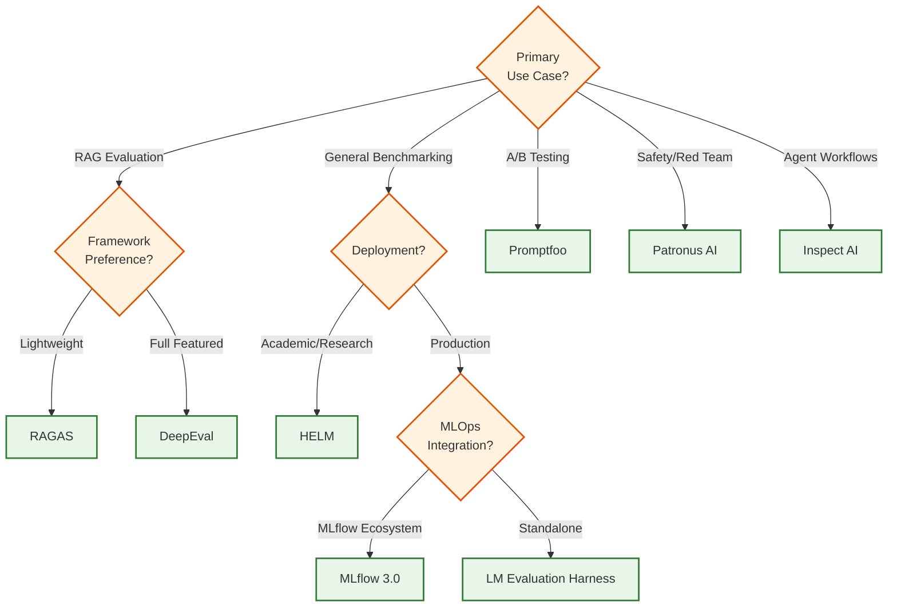
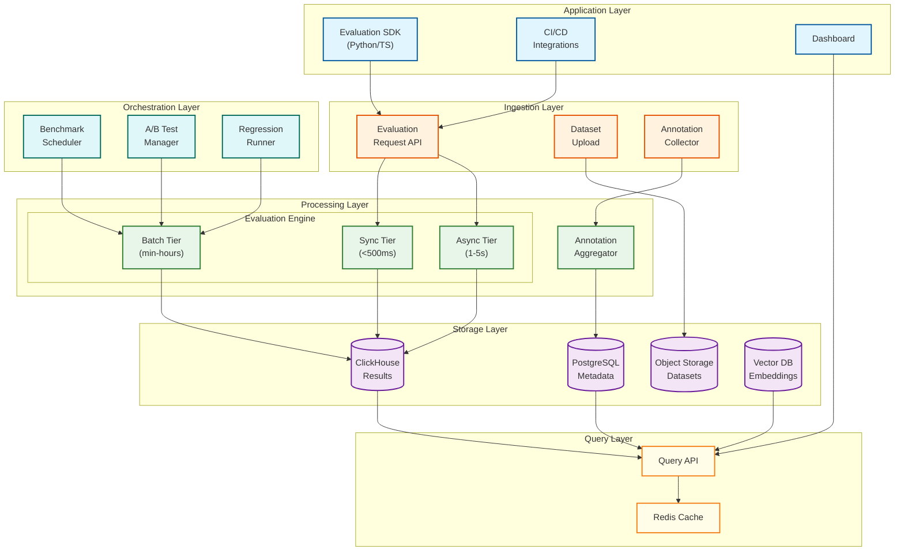

# AI Model Evaluation & Benchmarking Platform

## System Overview

An AI Model Evaluation & Benchmarking Platform provides systematic quality assessment, ground truth management, and benchmarking capabilities for LLM applications. Unlike observability platforms (which focus on runtime monitoring and debugging), this system emphasizes measuring model quality through automated evaluation, human annotation, standardized benchmarks, and A/B testing.

The platform enables teams to evaluate model outputs using LLM-as-Judge, programmatic metrics, and human feedback; manage versioned datasets with ground truth; run benchmark suites like MMLU and HumanEval; conduct statistically rigorous A/B tests; and detect quality regressions in CI/CD pipelines.

**Complexity Rating:** `High`

---

## Quick Navigation

| Document | Description |
|----------|-------------|
| [01 - Requirements & Estimations](./01-requirements-and-estimations.md) | Functional/non-functional requirements, capacity planning |
| [02 - High-Level Design](./02-high-level-design.md) | System architecture, evaluation pipelines, data flows |
| [03 - Low-Level Design](./03-low-level-design.md) | Data models, APIs, core algorithms |
| [04 - Deep Dive & Bottlenecks](./04-deep-dive-and-bottlenecks.md) | Critical components, cost optimization |
| [05 - Scalability & Reliability](./05-scalability-and-reliability.md) | Scaling strategies, fault tolerance |
| [06 - Security & Compliance](./06-security-and-compliance.md) | Data protection, EU AI Act, audit trails |
| [07 - Observability](./07-observability.md) | Meta-observability (monitoring the platform itself) |
| [08 - Interview Guide](./08-interview-guide.md) | Pacing, trap questions, trade-offs |

---

## Key Characteristics

| Characteristic | Description |
|----------------|-------------|
| **Multi-Evaluator Architecture** | Combines LLM-as-Judge, programmatic scorers, and human annotation |
| **Dataset-Centric** | Versioned test datasets with ground truth management |
| **Benchmark Native** | First-class support for standard suites (MMLU, HumanEval, HellaSwag) |
| **Statistical Rigor** | A/B testing with frequentist and Bayesian significance testing |
| **Cost-Aware** | Tiered evaluation strategies to manage LLM-as-Judge expenses |
| **CI/CD Integration** | Regression testing gates for model and prompt changes |
| **Human-in-the-Loop** | Annotation workflows with inter-annotator agreement tracking |

---

## Evaluation vs Observability

| Aspect | Evaluation (This System) | Observability (3.25) |
|--------|--------------------------|----------------------|
| **Primary Goal** | Measure quality systematically | Monitor runtime behavior |
| **Timing** | Pre-production + periodic | Production real-time |
| **Ground Truth** | Required for many evaluations | Not applicable |
| **Human Involvement** | Core workflow (annotation) | Exception handling |
| **Datasets** | Curated test sets | Production traffic |
| **Output** | Quality scores, benchmarks | Traces, metrics, alerts |

---

## Platform Comparison (2025-2026)

| Platform | Type | Strengths | Best For |
|----------|------|-----------|----------|
| **DeepEval** | OSS Framework | 14+ metrics, Pytest-like, G-Eval | CI/CD integration, RAG evaluation |
| **RAGAS** | OSS Framework | RAG Triad metrics, agentic extensions | RAG-specific evaluation |
| **LM Evaluation Harness** | OSS Framework | 250+ tasks, powers Open LLM Leaderboard | Standardized benchmarking |
| **Promptfoo** | OSS Tool | A/B testing, security testing, 51K+ users | Prompt comparison, red teaming |
| **HELM** | Academic | Holistic evaluation, VHELM/HEIM multimodal | Research, comprehensive benchmarks |
| **Patronus AI** | Commercial | Lynx evaluator, safety-first | Enterprise safety evaluation |
| **MLflow 3.0** | OSS Platform | GenAI evals, hallucination detection | MLOps integration |
| **Inspect AI** | OSS Framework | Agentic evaluation, UK AI Safety Institute | Agent workflow testing |

### Platform Selection Decision Tree

---

## Core Capabilities

### LLM-as-Judge Evaluation

Automated quality assessment using LLMs:

| Method | Description | Accuracy | Cost |
|--------|-------------|----------|------|
| **G-Eval** | Chain-of-thought prompting with rubrics | 80-85% human agreement | $0.002/eval |
| **Pairwise Comparison** | Judge picks better of two outputs | 85%+ for relative ranking | $0.003/eval |
| **Reference-Free** | Score without ground truth | 75-80% correlation | $0.002/eval |
| **Multi-Criteria** | Score across multiple dimensions | Varies by criterion | $0.005/eval |

### Benchmark Suite Management

Standard evaluation suites:

| Benchmark | Tasks | Domain | Metrics |
|-----------|-------|--------|---------|
| **MMLU** | 57 subjects, 14K+ questions | General knowledge | Accuracy |
| **MMLU-Pro** | Harder variant, 10 options | Advanced reasoning | Accuracy |
| **HumanEval** | 164 problems | Code generation | Pass@k |
| **HellaSwag** | 10K sentences | Commonsense | Accuracy |
| **TruthfulQA** | 817 questions | Factuality | MC1/MC2/Bleu |
| **GSM8K** | 8.5K problems | Math reasoning | Exact match |
| **GPQA** | Graduate-level science | Expert knowledge | Accuracy |

### Human Annotation System

Structured labeling workflows:

| Capability | Description |
|------------|-------------|
| **Task Management** | Create annotation projects with instructions and schemas |
| **Multi-Annotator** | Assign items to multiple annotators for agreement |
| **Agreement Metrics** | Krippendorff's Alpha, Cohen's Kappa, Fleiss' Kappa |
| **Calibration** | Intersperse known items to detect quality degradation |
| **Consensus Resolution** | Adjudication workflows for disagreements |
| **Ground Truth Export** | Resolved annotations become ground truth |

### A/B Testing Framework

Statistically rigorous experimentation:

| Feature | Description |
|---------|-------------|
| **Experiment Configuration** | Define variants, traffic allocation, primary metrics |
| **Statistical Methods** | Frequentist (t-test) and Bayesian analysis |
| **Guardrail Metrics** | Safety thresholds that halt experiments |
| **Sequential Testing** | Early stopping with valid p-values |
| **Effect Size** | Cohen's d for practical significance |

### Regression Testing Engine

CI/CD integration for quality gates:

| Feature | Description |
|---------|-------------|
| **Baseline Management** | Store expected scores for comparison |
| **Threshold Alerts** | Fail builds on significant degradation |
| **Diff Reports** | Highlight changed test cases |
| **Prompt Versioning** | Track which prompt version produced which scores |
| **Model Versioning** | Evaluate new model versions against baselines |

---

## Architecture Overview

---

## Key Metrics Reference

### Latency Targets

| Operation | P50 | P95 | P99 |
|-----------|-----|-----|-----|
| Sync evaluation (programmatic) | 20ms | 100ms | 200ms |
| Sync evaluation (fast LLM) | 200ms | 500ms | 1s |
| Async evaluation (full LLM-as-Judge) | 1.5s | 3s | 5s |
| Batch benchmark (per 1K items) | 60s | 120s | 180s |
| Dataset upload (per 100MB) | 5s | 15s | 30s |
| Results query | 50ms | 200ms | 500ms |

### Throughput Targets

| Metric | Target | Notes |
|--------|--------|-------|
| Sync evaluations | 1K/sec | Programmatic + fast LLM |
| Async evaluations | 10K/sec | Queue-based processing |
| Benchmark throughput | 1M test cases/hour | Parallelized across workers |
| Human annotations | 10K/hour | Across annotator pool |
| Dataset versions | 100/hour | Upload + validation |

### Cost Targets

| Evaluation Type | Cost per Eval | Notes |
|-----------------|---------------|-------|
| Programmatic (BLEU/ROUGE) | $0.00001 | Compute only |
| BERTScore | $0.0001 | Embedding compute |
| LLM-as-Judge (GPT-4o-mini) | $0.0005 | API cost |
| LLM-as-Judge (GPT-4o) | $0.003 | API cost |
| Human annotation | $0.10-0.50 | Per item, varies by complexity |

---

## Evaluation Metrics Taxonomy

### Classical Metrics (Reference-Based)

| Metric | Type | Best For |
|--------|------|----------|
| **BLEU** | n-gram overlap | Translation, short text |
| **ROUGE** | Recall-based overlap | Summarization |
| **METEOR** | Enhanced BLEU | Translation (handles synonyms) |
| **Exact Match** | String equality | QA, classification |
| **F1 Score** | Overlap precision/recall | Token-level comparison |

### Semantic Metrics (Embedding-Based)

| Metric | Type | Best For |
|--------|------|----------|
| **BERTScore** | Contextual embedding similarity | Any text comparison |
| **Semantic Similarity** | Sentence embedding cosine | Paraphrase detection |
| **Entailment Score** | NLI-based | Faithfulness checking |

### LLM-Based Metrics (Judge-Based)

| Metric | Type | Best For |
|--------|------|----------|
| **G-Eval** | CoT with rubric | General quality |
| **Faithfulness** | Groundedness to context | RAG evaluation |
| **Relevance** | Answer-to-question fit | QA, RAG |
| **Coherence** | Logical flow | Long-form content |
| **Safety** | Harmful content detection | All applications |

### RAG-Specific Metrics (RAG Triad)

| Metric | Measures | Direction |
|--------|----------|-----------|
| **Context Precision** | Relevant chunks retrieved | Query → Context |
| **Context Recall** | All relevant info retrieved | Query → Context |
| **Faithfulness** | Response grounded in context | Context → Response |
| **Answer Relevancy** | Response addresses query | Query → Response |

---

## Interview Checklist

### Must Know
- [ ] Difference between evaluation and observability platforms
- [ ] LLM-as-Judge (G-Eval) methodology and cost implications
- [ ] Tiered evaluation strategy (programmatic → LLM → human)
- [ ] Inter-annotator agreement metrics (Krippendorff's Alpha)
- [ ] A/B testing statistical significance (frequentist vs Bayesian)
- [ ] Standard benchmarks (MMLU, HumanEval, HellaSwag)

### Should Know
- [ ] RAG Triad evaluation (Faithfulness, Context Relevance, Answer Relevancy)
- [ ] BERTScore vs BLEU/ROUGE trade-offs
- [ ] Human annotation workflow design
- [ ] Benchmark suite orchestration and parallelization
- [ ] Regression testing in CI/CD pipelines
- [ ] Cost optimization strategies for LLM-as-Judge

### Nice to Know
- [ ] Specific platform implementations (DeepEval, RAGAS, HELM)
- [ ] Agentic evaluation challenges (multi-step, tool use)
- [ ] EU AI Act implications for model evaluation
- [ ] Multimodal evaluation (VHELM, HEIM)
- [ ] Semantic entropy for hallucination detection

---

## Related Systems

| System | Relationship |
|--------|--------------|
| [3.25 AI Observability](../3.25-ai-observability-llmops-platform/00-index.md) | Runtime monitoring; evaluation results can enrich traces |
| [3.4 MLOps Platform](../3.4-mlops-platform/00-index.md) | Model registry; evaluation scores inform promotion decisions |
| [3.15 RAG System](../3.15-rag-system/00-index.md) | RAG pipelines are primary evaluation targets |
| [3.17 Agent Orchestration](../3.17-ai-agent-orchestration-platform/00-index.md) | Agent workflows require specialized evaluation |
| [3.22 AI Guardrails](../3.22-ai-guardrails-safety-system/00-index.md) | Safety evaluators overlap with guardrail rules |

---

## References

### Open-Source Frameworks
- [DeepEval Documentation](https://docs.confident-ai.com/)
- [RAGAS Documentation](https://docs.ragas.io/)
- [LM Evaluation Harness](https://github.com/EleutherAI/lm-evaluation-harness)
- [Promptfoo](https://www.promptfoo.dev/docs/)
- [HELM - Stanford CRFM](https://crfm.stanford.edu/helm/)
- [Inspect AI](https://inspect.ai-safety-institute.org.uk/)

### Research & Standards
- [G-Eval Paper: Using LLMs for NLG Evaluation](https://arxiv.org/abs/2303.16634)
- [RAGAS: Automated Evaluation of RAG](https://arxiv.org/abs/2309.15217)
- [Judging LLM-as-a-Judge](https://arxiv.org/abs/2306.05685)
- [OpenAI-Anthropic Joint Safety Evaluation (Dec 2025)](https://openai.com/index/openai-anthropic-safety-evaluation/)

### Engineering Blogs
- [Confident AI Blog (DeepEval)](https://www.confident-ai.com/blog)
- [Patronus AI Research](https://www.patronus.ai/blog)
- [Arize AI Evaluation Best Practices](https://arize.com/blog/)
- [Eugene Yan - Evaluating LLM Applications](https://eugeneyan.com/writing/llm-evaluators/)
