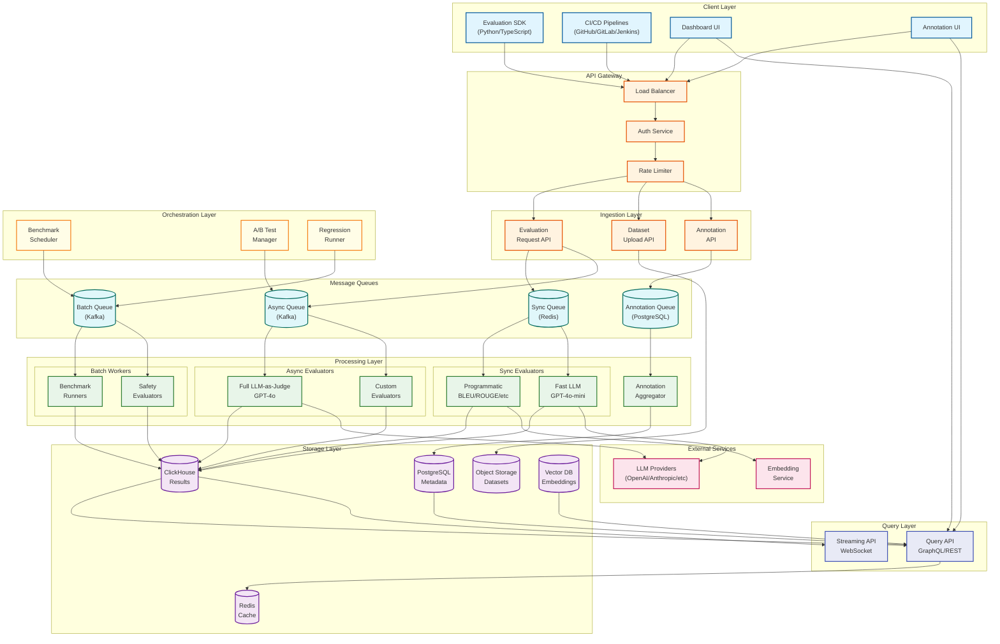
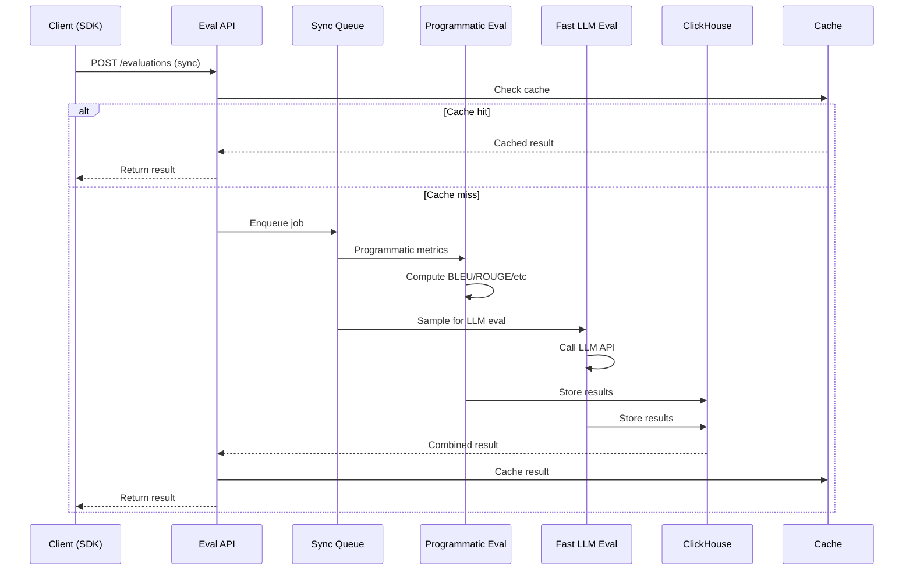
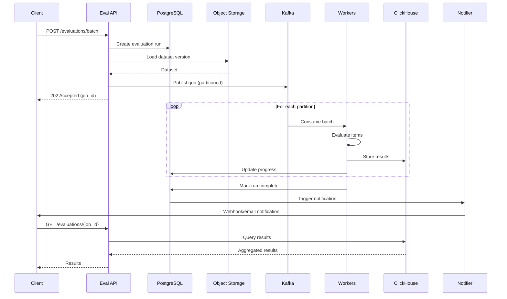
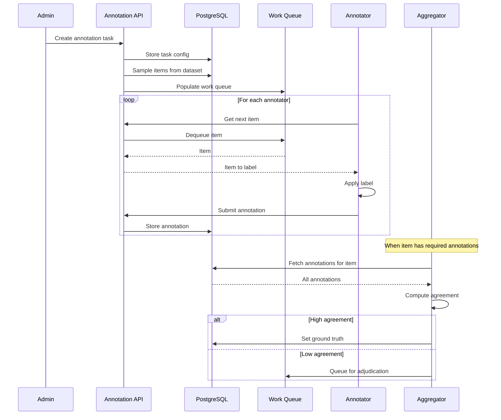
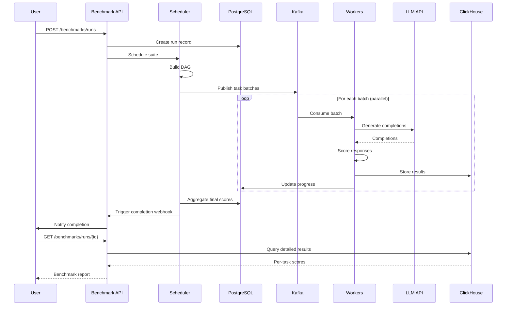
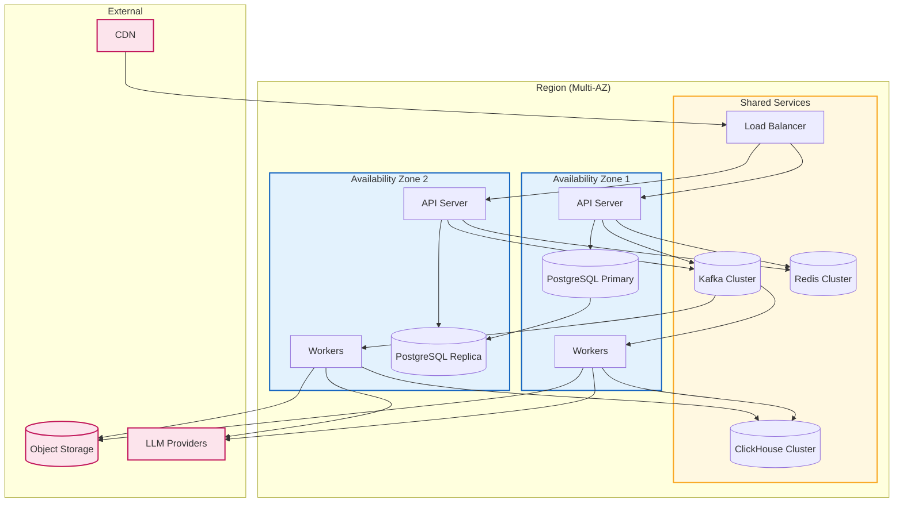

# High-Level Design

## System Architecture

The AI Model Evaluation & Benchmarking Platform follows a layered architecture with clear separation between ingestion, processing, orchestration, storage, and query layers.



---

## Core Components

### 1. Evaluation SDK

The primary interface for developers integrating evaluation into their workflows.

**Capabilities:**
- Python-first with TypeScript bindings
- Decorator-based annotation: `@evaluate(metrics=["faithfulness"])`
- Batch evaluation API for datasets
- Async/await support for non-blocking calls
- Auto-retry with exponential backoff
- Local caching to reduce API calls

**Example Usage:**
```
# Pseudocode - not actual implementation code
client = EvalClient(api_key="...")

# Single evaluation
result = client.evaluate(
    input="What is the capital of France?",
    output="Paris is the capital of France.",
    expected="Paris",
    metrics=["exactMatch", "faithfulness"]
)

# Batch evaluation
results = client.evaluate_dataset(
    dataset_id="ds_123",
    version="v2",
    metrics=["faithfulness", "relevance"],
    sample_rate=0.1  # 10% sampling
)
```

### 2. Dataset Management Service

Handles versioned test datasets with ground truth.

**Capabilities:**
| Feature | Description |
|---------|-------------|
| **CRUD Operations** | Create, read, update, delete datasets |
| **Versioning** | Immutable snapshots, version history |
| **Ground Truth** | Link expected outputs to test cases |
| **Sampling** | Random, stratified, weighted sampling |
| **Validation** | Schema enforcement, format checks |
| **Import/Export** | CSV, JSON, Parquet support |

**Data Flow:**
1. User uploads dataset via API or UI
2. Service validates format and schema
3. Data stored in object storage with metadata in PostgreSQL
4. Version record created with unique version ID
5. Dataset becomes available for evaluation runs

### 3. Evaluation Engine

The core processing component that executes evaluations across multiple tiers.

**Tier Architecture:**

| Tier | Latency | Cost | Coverage | Use Case |
|------|---------|------|----------|----------|
| **Sync Programmatic** | <100ms | Free | 100% | Format checks, BLEU/ROUGE |
| **Sync Fast LLM** | 200-500ms | $0.0005 | Sampled | Quick quality screening |
| **Async Full LLM** | 1-5s | $0.003 | Sampled | Comprehensive G-Eval |
| **Batch** | Minutes | Varies | Full | Benchmark suites |

**Evaluator Types:**

| Type | Examples | Implementation |
|------|----------|----------------|
| **Programmatic** | BLEU, ROUGE, Exact Match, F1 | Deterministic computation |
| **Embedding-Based** | BERTScore, Semantic Similarity | Vector similarity |
| **LLM-as-Judge** | G-Eval, Faithfulness, Relevance | LLM API calls |
| **Ensemble** | Weighted combination | Aggregation logic |
| **Human** | Expert labels | Annotation system |

### 4. Human Annotation System

Manages labeling workflows and collects human judgments.

**Components:**

| Component | Function |
|-----------|----------|
| **Task Manager** | Create/configure annotation tasks |
| **Work Queue** | Distribute items to annotators |
| **Annotation UI** | Web interface for labeling |
| **Quality Monitor** | Track annotator performance |
| **Aggregator** | Compute agreement, resolve consensus |

**Workflow:**
1. Admin creates annotation task with instructions and label schema
2. System samples items from dataset or evaluation results
3. Items distributed to annotator work queues
4. Annotators label items via UI
5. Aggregator computes inter-annotator agreement
6. High-agreement items become ground truth
7. Disagreements routed to expert adjudication

### 5. Benchmark Orchestrator

Schedules and executes standardized benchmark suites.

**Supported Suites:**

| Suite | Tasks | Test Cases | Metrics |
|-------|-------|------------|---------|
| MMLU | 57 subjects | 14,042 | Accuracy |
| MMLU-Pro | Extended MMLU | 12,032 | Accuracy |
| HumanEval | Coding | 164 | Pass@k |
| HellaSwag | Commonsense | 10,042 | Accuracy |
| TruthfulQA | Factuality | 817 | MC1, MC2 |
| GSM8K | Math | 8,500 | Exact Match |

**Orchestration Features:**
- DAG-based task scheduling
- Parallel execution with resource limits
- Progress tracking and ETA estimation
- Partial failure handling (continue on error)
- Result aggregation and normalization

### 6. A/B Testing Framework

Enables statistically rigorous comparison of model variants.

**Experiment Configuration:**
- Define variants (control, treatment)
- Set traffic allocation percentages
- Choose primary metric and guardrails
- Select statistical method (frequentist/Bayesian)
- Set significance thresholds

**Statistical Methods:**

| Method | Use Case | Output |
|--------|----------|--------|
| **Frequentist (t-test)** | Traditional hypothesis testing | p-value, confidence interval |
| **Bayesian** | Probability of improvement | P(B > A), credible interval |
| **Sequential** | Early stopping | Boundary crossing |

### 7. Regression Testing Engine

Integrates with CI/CD to detect quality degradation.

**Workflow:**
1. Developer pushes code change (model or prompt)
2. CI/CD pipeline triggers regression test
3. Engine runs evaluation on predefined test suite
4. Results compared against stored baseline
5. Pass/fail determined by threshold rules
6. Results reported back to CI/CD system

**Threshold Types:**

| Type | Description | Example |
|------|-------------|---------|
| **Absolute** | Score must exceed value | Accuracy > 0.85 |
| **Relative** | Score must not drop | Current >= Baseline - 0.02 |
| **Statistical** | Significant degradation | p-value < 0.05 for decrease |

---

## Data Flows

### Sync Evaluation Flow

For real-time evaluation in CI/CD or interactive use.



**Latency Budget:**
| Step | Time |
|------|------|
| API validation | 5ms |
| Cache check | 2ms |
| Queue enqueue | 3ms |
| Programmatic eval | 20ms |
| Fast LLM eval (if sampled) | 300ms |
| Result storage | 10ms |
| Response | 5ms |
| **Total (cache miss, programmatic only)** | ~50ms |
| **Total (cache miss, with LLM)** | ~350ms |

### Batch Evaluation Flow

For comprehensive dataset evaluation.



### Human Annotation Flow

For collecting human labels.



### Benchmark Execution Flow

For running standardized benchmark suites.



---

## Key Architectural Decisions

### 1. Storage Strategy

| Data Type | Storage | Rationale |
|-----------|---------|-----------|
| **Metadata** (orgs, datasets, experiments) | PostgreSQL | Relational, ACID, foreign keys |
| **Evaluation results** | ClickHouse | Time-series, fast aggregation, compression |
| **Datasets** (test cases) | Object Storage | Large files, cheap, durable |
| **Embeddings** | Vector DB | ANN search for semantic similarity |
| **Cache** | Redis | Low latency, TTL support |

**ClickHouse for Results:**
- Columnar storage for efficient aggregation (avg score by model, date, etc.)
- High compression (10-15x) for cost efficiency
- Materialized views for pre-computed dashboards
- Time-based partitioning for retention policies

### 2. Sync vs Async Evaluation

| Scenario | Approach | Rationale |
|----------|----------|-----------|
| CI/CD gates | Sync | Blocking, need immediate result |
| Interactive UI | Sync (fast path) | User waiting for response |
| Comprehensive eval | Async | Not time-critical |
| Benchmark suites | Async (batch) | Large volume, scheduled |
| Human annotation | Async | Inherently asynchronous |

**Sync Implementation:**
- Direct request-response
- Timeout: 5 seconds
- Fallback: Return partial results if LLM times out

**Async Implementation:**
- Return job ID immediately
- Poll or webhook for completion
- Kafka for reliable queue processing

### 3. Multi-Tenancy Model

| Aspect | Approach | Rationale |
|--------|----------|-----------|
| **Data Isolation** | Row-level security | Cost-efficient, simpler ops |
| **Compute Isolation** | Shared workers | Cost-efficient |
| **Rate Limiting** | Per-org limits | Fair usage |
| **Enterprise Option** | Dedicated DB | Strict isolation requirements |

**Row-Level Security:**
- All tables include `org_id` column
- Database policies enforce org_id filtering
- API layer adds org_id to all queries
- Cross-org queries prevented at DB level

### 4. LLM Provider Strategy

| Strategy | Implementation |
|----------|----------------|
| **Multi-Provider** | Support OpenAI, Anthropic, local models |
| **Fallback** | If primary fails, try secondary |
| **Cost Routing** | Route to cheapest provider meeting quality threshold |
| **Caching** | Cache identical prompt+input combinations |
| **Batching** | Batch API calls where supported |

### 5. Event-Driven Architecture

| Event | Producers | Consumers |
|-------|-----------|-----------|
| `evaluation.requested` | API | Workers |
| `evaluation.completed` | Workers | Aggregator, Notifier |
| `dataset.uploaded` | API | Indexer, Validator |
| `benchmark.started` | Scheduler | Workers |
| `annotation.submitted` | UI | Aggregator |
| `experiment.concluded` | A/B Manager | Notifier |

---

## Component Interactions

### Read Path (Query Results)

```
Dashboard → Query API → Cache (hit?) → ClickHouse → Aggregation → Response
```

**Optimization:**
- Hot queries cached in Redis (TTL: 5 min)
- Materialized views for common aggregations
- Query result pagination to limit data transfer

### Write Path (Store Results)

```
Worker → Kafka → ClickHouse (batched insert) → Materialized View Update
```

**Optimization:**
- Batch inserts (1000 rows at a time)
- Async acknowledgment
- Buffer in Kafka for backpressure handling

### Annotation Path

```
Annotator UI → API → PostgreSQL → Work Queue → Aggregator → Ground Truth
```

**Optimization:**
- Optimistic locking for concurrent annotations
- Pre-fetch next items while labeling current
- Async agreement computation

---

## Technology Choices

| Component | Technology | Alternatives Considered |
|-----------|------------|------------------------|
| **Primary Database** | PostgreSQL | MySQL, CockroachDB |
| **Results Store** | ClickHouse | TimescaleDB, Druid |
| **Object Storage** | S3-compatible | GCS, Azure Blob |
| **Message Queue** | Kafka | RabbitMQ, SQS |
| **Cache** | Redis | Memcached |
| **Vector DB** | Pinecone/Milvus | Weaviate, Qdrant |
| **API** | REST + GraphQL | gRPC |
| **SDK Languages** | Python, TypeScript | Go, Java |

---

## Deployment Architecture


