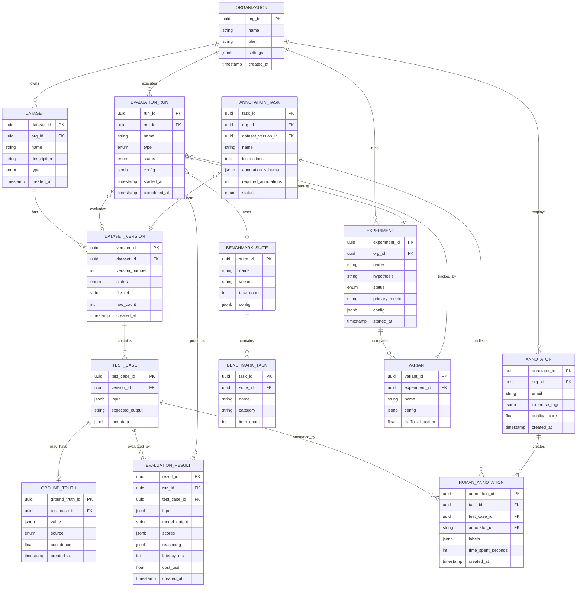

# Low-Level Design

## Data Model

### Entity Relationship Diagram



---

## Schema Definitions

### PostgreSQL Schemas

#### Organization & Dataset Schemas

```yaml
Organization:
  org_id: uuid [PK, default: gen_random_uuid()]
  name: string [not null, max: 255]
  slug: string [unique, not null, max: 100]
  plan: enum [FREE, STARTER, PROFESSIONAL, ENTERPRISE]
  settings:
    default_evaluators: string[]
    cost_budget_monthly_usd: float
    data_retention_days: int
  billing_email: string
  created_at: timestamp [default: now()]
  updated_at: timestamp

Dataset:
  dataset_id: uuid [PK, default: gen_random_uuid()]
  org_id: uuid [FK -> Organization, not null]
  name: string [not null, max: 255]
  description: text
  type: enum [EVALUATION, BENCHMARK, GOLDEN_SET, ANNOTATION_QUEUE]
  tags: string[]
  created_at: timestamp [default: now()]
  updated_at: timestamp
  created_by: string

  indexes:
    - (org_id, name) [unique]
    - (org_id, created_at)

DatasetVersion:
  version_id: uuid [PK, default: gen_random_uuid()]
  dataset_id: uuid [FK -> Dataset, not null]
  version_number: int [not null]
  status: enum [DRAFT, PUBLISHED, DEPRECATED]
  file_uri: string [not null]  # s3://bucket/org_id/dataset_id/v1/data.parquet
  file_format: enum [CSV, JSON, JSONL, PARQUET]
  row_count: int
  schema_hash: string [32 chars]  # SHA-256 of column names/types
  validation_status: enum [PENDING, VALID, INVALID]
  validation_errors: jsonb
  created_at: timestamp [default: now()]
  created_by: string

  indexes:
    - (dataset_id, version_number) [unique]
    - (dataset_id, status)

TestCase:
  test_case_id: uuid [PK, default: gen_random_uuid()]
  version_id: uuid [FK -> DatasetVersion, not null]
  row_index: int [not null]  # Position in source file
  input: jsonb [not null]
    # Flexible schema:
    # prompt: string
    # context: string (optional)
    # system_prompt: string (optional)
    # conversation: array (optional)
  expected_output: text  # Ground truth (nullable)
  metadata: jsonb
    # category: string
    # difficulty: string
    # tags: string[]
  created_at: timestamp [default: now()]

  indexes:
    - (version_id, row_index) [unique]
    - (version_id) [for bulk operations]

GroundTruth:
  ground_truth_id: uuid [PK, default: gen_random_uuid()]
  test_case_id: uuid [FK -> TestCase, not null, unique]
  value: jsonb [not null]
    # answer: string
    # acceptable_answers: string[]
    # rubric: object
  source: enum [HUMAN_CONSENSUS, EXPERT, AUTOMATED, IMPORTED]
  confidence: float [0.0-1.0]
  annotation_task_id: uuid [FK -> AnnotationTask, nullable]
  created_at: timestamp [default: now()]
  updated_at: timestamp
```

#### Evaluation Schemas

```yaml
EvaluationRun:
  run_id: uuid [PK, default: gen_random_uuid()]
  org_id: uuid [FK -> Organization, not null]
  name: string [max: 255]
  type: enum [SINGLE, BATCH, BENCHMARK, AB_TEST, REGRESSION]
  status: enum [PENDING, RUNNING, COMPLETED, FAILED, CANCELLED]

  # What to evaluate
  dataset_version_id: uuid [FK -> DatasetVersion, nullable]
  benchmark_suite_id: uuid [FK -> BenchmarkSuite, nullable]

  # Configuration
  config: jsonb
    evaluators:
      - type: string  # "faithfulness", "relevance", etc.
        config: object
    model:
      name: string
      version: string
      provider: string
    sampling:
      rate: float
      strategy: string  # "random", "stratified"
    llm_judge:
      model: string
      temperature: float

  # Experiment linkage
  experiment_id: uuid [FK -> Experiment, nullable]
  variant_id: uuid [FK -> Variant, nullable]

  # Results summary
  total_items: int
  completed_items: int
  failed_items: int
  summary_scores: jsonb  # {"faithfulness": 0.85, "relevance": 0.92}
  total_cost_usd: float

  # Timing
  started_at: timestamp
  completed_at: timestamp
  created_at: timestamp [default: now()]
  created_by: string

  # Regression baseline
  baseline_run_id: uuid [FK -> EvaluationRun, nullable]

  indexes:
    - (org_id, created_at)
    - (org_id, status)
    - (experiment_id)
    - (dataset_version_id)
```

#### Experiment Schemas

```yaml
Experiment:
  experiment_id: uuid [PK, default: gen_random_uuid()]
  org_id: uuid [FK -> Organization, not null]
  name: string [not null, max: 255]
  hypothesis: text
  type: enum [AB_TEST, MULTI_ARM_BANDIT, PROMPT_COMPARISON, MODEL_COMPARISON]
  status: enum [DRAFT, RUNNING, PAUSED, CONCLUDED, ARCHIVED]

  # Metrics
  primary_metric: string [not null]  # "faithfulness"
  guardrail_metrics: string[]  # ["safety", "cost"]

  # Statistical config
  config: jsonb
    method: string  # "frequentist", "bayesian", "sequential"
    significance_level: float  # 0.05
    minimum_sample_size: int
    maximum_duration_days: int

  # Results
  conclusion: jsonb
    winner: string  # variant_id or "no_winner"
    confidence: float
    effect_size: float
    p_value: float (for frequentist)
    probability_of_improvement: float (for bayesian)

  started_at: timestamp
  concluded_at: timestamp
  created_at: timestamp [default: now()]
  created_by: string

  indexes:
    - (org_id, status)
    - (org_id, created_at)

Variant:
  variant_id: uuid [PK, default: gen_random_uuid()]
  experiment_id: uuid [FK -> Experiment, not null]
  name: string [not null]  # "control", "treatment_a"
  is_control: boolean [default: false]

  # What differs in this variant
  config: jsonb
    model:
      name: string
      version: string
    prompt_version: string
    system_prompt: string
    parameters: object

  # Traffic allocation
  traffic_allocation: float [0.0-1.0, not null]

  # Running totals (denormalized for performance)
  sample_count: int [default: 0]
  metric_sum: float [default: 0.0]
  metric_sum_squares: float [default: 0.0]

  created_at: timestamp [default: now()]

  indexes:
    - (experiment_id, name) [unique]
```

#### Annotation Schemas

```yaml
AnnotationTask:
  task_id: uuid [PK, default: gen_random_uuid()]
  org_id: uuid [FK -> Organization, not null]
  dataset_version_id: uuid [FK -> DatasetVersion, nullable]

  name: string [not null, max: 255]
  description: text
  instructions: text [not null]  # Detailed labeling instructions

  # Label schema
  annotation_schema: jsonb
    type: string  # "classification", "rating", "ranking", "text"
    options:  # For classification
      - value: string
        label: string
        description: string
    scale:  # For rating
      min: int
      max: int
      labels: object
    fields:  # For complex annotations
      - name: string
        type: string
        required: boolean

  # Workflow config
  required_annotations_per_item: int [default: 3]
  allow_skip: boolean [default: true]
  time_limit_seconds: int [nullable]

  # Sampling
  sampling_config: jsonb
    strategy: string  # "random", "stratified", "priority"
    sample_size: int
    filter: object

  status: enum [DRAFT, ACTIVE, PAUSED, COMPLETED]

  # Progress
  total_items: int
  completed_items: int

  created_at: timestamp [default: now()]
  created_by: string

  indexes:
    - (org_id, status)

HumanAnnotation:
  annotation_id: uuid [PK, default: gen_random_uuid()]
  task_id: uuid [FK -> AnnotationTask, not null]
  test_case_id: uuid [FK -> TestCase, not null]
  annotator_id: uuid [FK -> Annotator, not null]

  # The actual labels
  labels: jsonb
    # Structure depends on annotation_schema
    # Example: {"quality": "good", "score": 4, "feedback": "..."}

  # Metadata
  time_spent_seconds: int
  skipped: boolean [default: false]
  flagged: boolean [default: false]
  flag_reason: text

  # Computed (after aggregation)
  agreement_score: float [nullable]  # How much this aligns with others

  created_at: timestamp [default: now()]

  indexes:
    - (task_id, test_case_id)
    - (annotator_id, task_id)
    - (task_id, created_at)

  constraints:
    - (task_id, test_case_id, annotator_id) [unique]

Annotator:
  annotator_id: uuid [PK, default: gen_random_uuid()]
  org_id: uuid [FK -> Organization, not null]
  user_id: uuid [FK -> User, nullable]  # Internal user or external
  email: string [not null]
  name: string

  # Expertise
  expertise_tags: string[]  # ["medical", "legal", "coding"]
  languages: string[]

  # Quality tracking
  quality_score: float [0.0-1.0, default: 0.5]
  total_annotations: int [default: 0]
  agreement_rate: float [nullable]

  status: enum [ACTIVE, INACTIVE, BLOCKED]

  created_at: timestamp [default: now()]

  indexes:
    - (org_id, email) [unique]
    - (org_id, status)
```

### ClickHouse Schemas

#### Evaluation Results Table

```sql
CREATE TABLE evaluation_results (
    -- Identifiers
    result_id UUID,
    run_id UUID,
    org_id LowCardinality(String),
    test_case_id UUID,

    -- Model info
    model_name LowCardinality(String),
    model_version LowCardinality(Nullable(String)),
    model_provider LowCardinality(String),

    -- Prompt info
    prompt_version LowCardinality(Nullable(String)),
    prompt_hash FixedString(32),  -- Content hash for dedup

    -- Input/Output (truncated for storage efficiency)
    input_preview String,  -- First 1000 chars
    output_preview String,  -- First 1000 chars
    input_hash FixedString(32),
    output_hash FixedString(32),

    -- Scores (denormalized for fast aggregation)
    score_overall Nullable(Float32),
    score_faithfulness Nullable(Float32),
    score_relevance Nullable(Float32),
    score_coherence Nullable(Float32),
    score_safety Nullable(Float32),
    score_fluency Nullable(Float32),

    -- Custom scores (sparse columns)
    custom_scores Map(String, Float32),

    -- Evaluator metadata
    evaluator_type Enum8(
        'PROGRAMMATIC' = 0,
        'LLM_JUDGE' = 1,
        'HUMAN' = 2,
        'ENSEMBLE' = 3,
        'EMBEDDING' = 4
    ),
    evaluator_model LowCardinality(Nullable(String)),
    evaluator_version LowCardinality(Nullable(String)),

    -- Performance
    latency_ms UInt32,
    input_tokens UInt32,
    output_tokens UInt32,
    total_tokens UInt32,
    cost_usd Nullable(Float32),

    -- Experiment linkage
    experiment_id Nullable(UUID),
    variant_id Nullable(UUID),

    -- Status
    status Enum8('SUCCESS' = 0, 'FAILED' = 1, 'TIMEOUT' = 2, 'SKIPPED' = 3),
    error_message Nullable(String),

    -- Time
    created_at DateTime64(3, 'UTC'),

    -- Projection for dashboard queries
    INDEX idx_scores (score_overall, score_faithfulness, score_relevance) TYPE minmax GRANULARITY 4
)
ENGINE = ReplicatedMergeTree('/clickhouse/tables/{shard}/eval_results', '{replica}')
PARTITION BY toYYYYMM(created_at)
ORDER BY (org_id, run_id, created_at, result_id)
TTL created_at + INTERVAL 2 YEAR
SETTINGS index_granularity = 8192;
```

#### Materialized Views for Aggregation

```sql
-- Run-level aggregates (updated on insert)
CREATE MATERIALIZED VIEW evaluation_run_stats
ENGINE = ReplicatedAggregatingMergeTree('/clickhouse/tables/{shard}/run_stats', '{replica}')
ORDER BY (org_id, run_id)
AS SELECT
    org_id,
    run_id,
    model_name,

    countState() as total_count,
    countIfState(status = 'SUCCESS') as success_count,
    countIfState(status = 'FAILED') as failed_count,

    avgState(score_overall) as avg_overall,
    avgState(score_faithfulness) as avg_faithfulness,
    avgState(score_relevance) as avg_relevance,

    quantileState(0.5)(score_overall) as p50_overall,
    quantileState(0.95)(score_overall) as p95_overall,

    avgState(latency_ms) as avg_latency_ms,
    sumState(cost_usd) as total_cost_usd,
    sumState(total_tokens) as total_tokens,

    minState(created_at) as started_at,
    maxState(created_at) as completed_at
FROM evaluation_results
GROUP BY org_id, run_id, model_name;

-- Daily org-level summary
CREATE MATERIALIZED VIEW daily_org_stats
ENGINE = ReplicatedSummingMergeTree('/clickhouse/tables/{shard}/daily_stats', '{replica}')
ORDER BY (org_id, date, model_name)
AS SELECT
    org_id,
    toDate(created_at) as date,
    model_name,

    count() as evaluation_count,
    sum(cost_usd) as total_cost_usd,
    sum(total_tokens) as total_tokens,
    avg(score_overall) as avg_score
FROM evaluation_results
GROUP BY org_id, date, model_name;
```

---

## API Design

### Evaluation API

```yaml
# Create single evaluation
POST /v1/evaluations
  Request:
    input: string | object  # Prompt or structured input
    output: string  # Model response to evaluate
    expected_output: string (optional)  # Ground truth
    context: string (optional)  # For RAG evaluation
    metrics: string[]  # ["faithfulness", "relevance", "coherence"]
    config:
      sync: boolean (default: true)  # Sync or async
      evaluator_model: string (default: "gpt-4o-mini")
      custom_rubrics: object (optional)
    metadata:
      model_name: string
      model_version: string
      prompt_version: string
  Response:
    evaluation_id: string
    status: "completed" | "pending"
    scores:
      faithfulness: float
      relevance: float
      coherence: float
    reasoning:
      faithfulness: string
      relevance: string
    latency_ms: int
    cost_usd: float
    created_at: string (ISO 8601)

# Get evaluation result
GET /v1/evaluations/{evaluation_id}
  Response:
    # Same as POST response

# Create batch evaluation
POST /v1/evaluations/batch
  Request:
    dataset_version_id: string
    metrics: string[]
    config:
      sample_rate: float (default: 1.0)
      sample_strategy: "random" | "stratified"
      evaluator_model: string
      parallelism: int (default: 10)
    webhook_url: string (optional)
  Response:
    job_id: string
    status: "queued"
    estimated_completion: string (ISO 8601)
    total_items: int

# Get batch job status
GET /v1/evaluations/batch/{job_id}
  Response:
    job_id: string
    status: "queued" | "running" | "completed" | "failed"
    progress:
      total: int
      completed: int
      failed: int
    summary_scores:
      faithfulness:
        mean: float
        p50: float
        p95: float
      relevance:
        mean: float
        p50: float
        p95: float
    total_cost_usd: float
    started_at: string
    completed_at: string

# List evaluation runs
GET /v1/evaluations
  Query:
    limit: int (default: 20, max: 100)
    offset: int (default: 0)
    status: string (optional)
    type: string (optional)
    dataset_version_id: string (optional)
    experiment_id: string (optional)
    created_after: string (ISO 8601, optional)
    created_before: string (ISO 8601, optional)
  Response:
    runs: EvaluationRun[]
    total: int
    has_more: boolean
```

### Dataset API

```yaml
# Create dataset
POST /v1/datasets
  Request:
    name: string
    description: string (optional)
    type: "EVALUATION" | "BENCHMARK" | "GOLDEN_SET"
    tags: string[] (optional)
  Response:
    dataset_id: string
    name: string
    type: string
    created_at: string

# Upload dataset version
POST /v1/datasets/{dataset_id}/versions
  Request:
    Content-Type: multipart/form-data
    file: File (CSV, JSON, JSONL, or Parquet)
    description: string (optional)
  Response:
    version_id: string
    version_number: int
    status: "validating"
    row_count: int
    file_uri: string
    created_at: string

# Get dataset version
GET /v1/datasets/{dataset_id}/versions/{version_number}
  Response:
    version_id: string
    version_number: int
    status: "DRAFT" | "PUBLISHED" | "DEPRECATED"
    row_count: int
    schema:
      columns:
        - name: string
          type: string
    validation_status: "PENDING" | "VALID" | "INVALID"
    validation_errors: string[] (if invalid)
    created_at: string

# List test cases
GET /v1/datasets/{dataset_id}/versions/{version_number}/cases
  Query:
    limit: int (default: 50, max: 1000)
    offset: int (default: 0)
    filter: JSON (optional, for metadata filtering)
  Response:
    cases: TestCase[]
    total: int
    has_more: boolean

# Sample from dataset
POST /v1/datasets/{dataset_id}/versions/{version_number}/sample
  Request:
    size: int
    strategy: "random" | "stratified"
    stratify_by: string (optional, column name)
    seed: int (optional)
  Response:
    cases: TestCase[]
    sample_size: int
```

### Experiment API

```yaml
# Create experiment
POST /v1/experiments
  Request:
    name: string
    hypothesis: string (optional)
    type: "AB_TEST" | "PROMPT_COMPARISON" | "MODEL_COMPARISON"
    primary_metric: string  # "faithfulness"
    guardrail_metrics: string[] (optional)
    config:
      method: "frequentist" | "bayesian" | "sequential"
      significance_level: float (default: 0.05)
      minimum_sample_size: int (optional)
    variants:
      - name: string
        is_control: boolean
        traffic_allocation: float
        config:
          model: object (optional)
          prompt_version: string (optional)
  Response:
    experiment_id: string
    name: string
    status: "DRAFT"
    variants: Variant[]
    created_at: string

# Start experiment
POST /v1/experiments/{experiment_id}/start
  Response:
    status: "RUNNING"
    started_at: string

# Get experiment results
GET /v1/experiments/{experiment_id}/results
  Response:
    experiment_id: string
    status: "RUNNING" | "CONCLUDED"
    primary_metric: string
    variants:
      - variant_id: string
        name: string
        sample_size: int
        metrics:
          primary:
            mean: float
            std: float
            confidence_interval: [float, float]
          guardrails:
            - metric: string
              mean: float
              passed: boolean
    analysis:
      winner: string | null
      p_value: float (frequentist)
      probability_of_improvement: float (bayesian)
      effect_size: float
      is_significant: boolean
      recommendation: string

# Conclude experiment
POST /v1/experiments/{experiment_id}/conclude
  Request:
    winner: string (variant_id or "no_winner")
    notes: string (optional)
  Response:
    status: "CONCLUDED"
    conclusion:
      winner: string
      declared_at: string
      declared_by: string
```

### Annotation API

```yaml
# Create annotation task
POST /v1/annotations/tasks
  Request:
    name: string
    dataset_version_id: string
    instructions: string
    annotation_schema:
      type: "classification" | "rating" | "ranking" | "text"
      options: object[] (for classification)
      scale: object (for rating)
    required_annotations_per_item: int (default: 3)
    sampling_config:
      strategy: "random" | "stratified"
      sample_size: int
  Response:
    task_id: string
    name: string
    status: "DRAFT"
    total_items: int
    created_at: string

# Get next item to annotate
GET /v1/annotations/tasks/{task_id}/next
  Response:
    item_id: string
    test_case:
      input: object
      output: string (if evaluating model output)
    annotation_schema: object
    instructions: string
    position: int
    total_remaining: int

# Submit annotation
POST /v1/annotations/tasks/{task_id}/items/{item_id}
  Request:
    labels: object  # Matches annotation_schema
    time_spent_seconds: int
    flagged: boolean (optional)
    flag_reason: string (optional)
  Response:
    annotation_id: string
    next_item_id: string | null

# Get task progress
GET /v1/annotations/tasks/{task_id}/progress
  Response:
    total_items: int
    completed_items: int
    items_with_consensus: int
    agreement_metrics:
      krippendorff_alpha: float
      fleiss_kappa: float
    annotator_stats:
      - annotator_id: string
        annotations_count: int
        agreement_rate: float
        average_time_seconds: float

# Export ground truth
POST /v1/annotations/tasks/{task_id}/export
  Request:
    consensus_threshold: float (default: 0.8)
    format: "JSON" | "CSV"
  Response:
    download_url: string
    expires_at: string
    item_count: int
```

### Benchmark API

```yaml
# List available benchmark suites
GET /v1/benchmarks/suites
  Response:
    suites:
      - suite_id: string
        name: string
        version: string
        task_count: int
        total_items: int
        categories: string[]

# Start benchmark run
POST /v1/benchmarks/runs
  Request:
    suite_id: string
    model:
      name: string
      version: string (optional)
      provider: string
      config: object (optional)
    tasks: string[] (optional, subset of tasks)
    parallelism: int (default: 10)
    webhook_url: string (optional)
  Response:
    run_id: string
    status: "QUEUED"
    suite: object
    estimated_completion: string

# Get benchmark run results
GET /v1/benchmarks/runs/{run_id}
  Response:
    run_id: string
    status: "QUEUED" | "RUNNING" | "COMPLETED" | "FAILED"
    suite:
      name: string
      version: string
    model:
      name: string
    progress:
      total_tasks: int
      completed_tasks: int
      total_items: int
      completed_items: int
    results:
      overall_score: float
      tasks:
        - task_name: string
          category: string
          score: float
          items_evaluated: int
          items_correct: int
    cost_usd: float
    started_at: string
    completed_at: string

# Compare benchmark runs
POST /v1/benchmarks/compare
  Request:
    run_ids: string[]
  Response:
    models:
      - run_id: string
        model_name: string
        overall_score: float
    comparison:
      - task_name: string
        scores:
          - run_id: string
            score: float
    winner: string (run_id with best overall)
```

---

## Core Algorithms

### Algorithm 1: G-Eval (LLM-as-Judge with Chain-of-Thought)

```
FUNCTION g_eval(input, output, criteria, judge_model):
    """
    Evaluate model output using LLM-as-Judge with Chain-of-Thought.
    Based on the G-Eval paper methodology.

    INPUT:
        input: string - Original prompt/context
        output: string - Model response to evaluate
        criteria: list of Criterion objects
            - name: string
            - description: string
            - rubric: map<int, string> (1-5 scale descriptions)
        judge_model: string - Model to use for judging (e.g., "gpt-4o-mini")

    OUTPUT:
        scores: map<string, float> - Normalized scores (0-1) per criterion
        reasoning: map<string, string> - Explanation per criterion
        tokens_used: int - Total tokens consumed
        cost_usd: float - Estimated cost
    """

    scores = {}
    reasoning = {}
    total_tokens = 0

    FOR criterion IN criteria:
        // Step 1: Construct evaluation prompt with CoT instruction
        eval_prompt = """
            You are an expert evaluator assessing AI responses.

            ## Criterion: {criterion.name}
            {criterion.description}

            ## Scoring Rubric
            1 - {criterion.rubric[1]}
            2 - {criterion.rubric[2]}
            3 - {criterion.rubric[3]}
            4 - {criterion.rubric[4]}
            5 - {criterion.rubric[5]}

            ## Original Input
            {input}

            ## AI Response to Evaluate
            {output}

            ## Your Task
            1. Carefully analyze the response against the criterion
            2. Think step-by-step about specific strengths and weaknesses
            3. Cite specific examples from the response
            4. Assign a score from 1-5 based on the rubric

            Respond in JSON format:
            {{
                "analysis": "Your step-by-step analysis...",
                "score": <1-5>,
                "key_observations": ["observation1", "observation2"]
            }}
        """

        // Step 2: Call LLM with low temperature for consistency
        response = LLM_API_CALL(
            model: judge_model,
            messages: [{"role": "user", "content": eval_prompt}],
            temperature: 0.0,
            max_tokens: 500,
            response_format: {"type": "json_object"}
        )

        total_tokens += response.usage.total_tokens

        // Step 3: Parse response
        parsed = JSON_PARSE(response.content)

        // Step 4: Validate score
        IF parsed.score < 1 OR parsed.score > 5:
            parsed.score = CLAMP(parsed.score, 1, 5)

        // Step 5: Normalize to 0-1 range
        normalized_score = (parsed.score - 1) / 4.0

        scores[criterion.name] = normalized_score
        reasoning[criterion.name] = parsed.analysis

    // Calculate cost based on model pricing
    cost_usd = CALCULATE_COST(judge_model, total_tokens)

    RETURN {
        scores: scores,
        reasoning: reasoning,
        tokens_used: total_tokens,
        cost_usd: cost_usd
    }

// Helper: Standard criteria definitions
FAITHFULNESS_CRITERION = Criterion(
    name: "faithfulness",
    description: "How well the response is grounded in the provided context.
                  A faithful response only contains information that can be
                  directly supported by the context.",
    rubric: {
        1: "Response contains multiple claims not supported by context",
        2: "Response contains some unsupported claims",
        3: "Response is mostly faithful with minor unsupported details",
        4: "Response is highly faithful with rare minor issues",
        5: "Response is completely grounded in the provided context"
    }
)

TIME_COMPLEXITY: O(n_criteria) - Linear in number of criteria
SPACE_COMPLEXITY: O(n_criteria) - Store results per criterion
COST: ~$0.001-0.003 per criterion (depends on judge model)
```

### Algorithm 2: Krippendorff's Alpha (Inter-Annotator Agreement)

```
FUNCTION calculate_krippendorff_alpha(annotations, value_type):
    """
    Calculate Krippendorff's Alpha for inter-annotator agreement.
    Supports nominal, ordinal, interval, and ratio measurement levels.

    INPUT:
        annotations: list of Annotation objects
            - item_id: string
            - annotator_id: string
            - value: any (label for nominal, number for others)
        value_type: enum [NOMINAL, ORDINAL, INTERVAL, RATIO]

    OUTPUT:
        alpha: float (-1 to 1)
            - 1.0 = Perfect agreement
            - 0.0 = Agreement equivalent to chance
            - <0 = Systematic disagreement
        interpretation: string
    """

    // Step 1: Build coincidence matrix
    // Rows and columns are unique values
    // Cell (i,j) counts pairs of values from same item

    items = DISTINCT(annotations, BY: item_id)
    values = DISTINCT(annotations, BY: value)
    n_values = LENGTH(values)

    // Create value-to-index mapping
    value_index = {}
    FOR i, v IN ENUMERATE(values):
        value_index[v] = i

    // Initialize coincidence matrix
    coincidences = MATRIX(n_values, n_values, default: 0)

    // Step 2: Fill coincidence matrix
    FOR item IN items:
        item_annotations = FILTER(annotations, WHERE: item_id == item)
        n_annotators = LENGTH(item_annotations)

        IF n_annotators < 2:
            CONTINUE  // Need at least 2 for agreement

        // Count pairs of values for this item
        FOR i IN 0..n_annotators-1:
            FOR j IN i+1..n_annotators:
                v1 = item_annotations[i].value
                v2 = item_annotations[j].value
                idx1 = value_index[v1]
                idx2 = value_index[v2]

                // Symmetric matrix
                coincidences[idx1][idx2] += 1
                IF idx1 != idx2:
                    coincidences[idx2][idx1] += 1

    // Step 3: Calculate marginal frequencies
    n_pairs = SUM(coincidences) / 2  // Total pairs (diagonal counted once)
    marginals = []
    FOR i IN 0..n_values:
        marginals[i] = SUM(coincidences[i]) / 2

    // Step 4: Calculate observed disagreement (Do)
    observed_disagreement = 0
    FOR i IN 0..n_values:
        FOR j IN 0..n_values:
            IF i != j:
                distance = METRIC_DISTANCE(values[i], values[j], value_type)
                observed_disagreement += coincidences[i][j] * distance

    Do = observed_disagreement / (2 * n_pairs) IF n_pairs > 0 ELSE 0

    // Step 5: Calculate expected disagreement (De)
    expected_disagreement = 0
    n_total = SUM(marginals)

    FOR i IN 0..n_values:
        FOR j IN 0..n_values:
            IF i != j:
                distance = METRIC_DISTANCE(values[i], values[j], value_type)
                expected = (marginals[i] * marginals[j]) / (n_total * (n_total - 1))
                expected_disagreement += expected * distance

    De = expected_disagreement * 2

    // Step 6: Calculate alpha
    IF De == 0:
        alpha = 1.0  // Perfect agreement or no variation
    ELSE:
        alpha = 1 - (Do / De)

    // Step 7: Interpret result
    interpretation = INTERPRET_ALPHA(alpha)

    RETURN {
        alpha: alpha,
        interpretation: interpretation,
        n_items: LENGTH(items),
        n_annotators: LENGTH(DISTINCT(annotations, BY: annotator_id)),
        n_pairs: n_pairs
    }

FUNCTION METRIC_DISTANCE(v1, v2, value_type):
    """Calculate distance between two values based on measurement type."""

    IF value_type == NOMINAL:
        RETURN 0 IF v1 == v2 ELSE 1

    ELSE IF value_type == ORDINAL:
        // Use rank-based distance
        // Requires knowing the full ordered set
        rank1 = ORDINAL_RANK(v1)
        rank2 = ORDINAL_RANK(v2)
        RETURN ABS(rank1 - rank2)

    ELSE IF value_type == INTERVAL:
        // Squared difference
        RETURN (v1 - v2) ** 2

    ELSE IF value_type == RATIO:
        // Ratio-based distance
        IF v1 + v2 == 0:
            RETURN 0
        RETURN ((v1 - v2) / (v1 + v2)) ** 2

FUNCTION INTERPRET_ALPHA(alpha):
    """Standard interpretation guidelines."""
    IF alpha >= 0.80:
        RETURN "Good reliability - suitable for most applications"
    ELSE IF alpha >= 0.67:
        RETURN "Moderate reliability - acceptable for exploratory research"
    ELSE IF alpha >= 0.40:
        RETURN "Fair reliability - requires caution in interpretation"
    ELSE:
        RETURN "Poor reliability - not suitable for making conclusions"

TIME_COMPLEXITY: O(n * k^2) where n = items, k = annotators per item
SPACE_COMPLEXITY: O(v^2) where v = unique values
```

### Algorithm 3: A/B Test Statistical Significance

```
FUNCTION calculate_ab_significance(control, treatment, method, alpha):
    """
    Calculate statistical significance for A/B test results.
    Supports frequentist and Bayesian methods.

    INPUT:
        control: list of float - Metric values for control group
        treatment: list of float - Metric values for treatment group
        method: enum [FREQUENTIST, BAYESIAN]
        alpha: float - Significance level (default 0.05)

    OUTPUT:
        significant: boolean
        metrics: object (depends on method)
        recommendation: string
    """

    // Calculate basic statistics
    n_control = LENGTH(control)
    n_treatment = LENGTH(treatment)

    mean_control = MEAN(control)
    mean_treatment = MEAN(treatment)
    std_control = STD_DEV(control)
    std_treatment = STD_DEV(treatment)

    // Effect size (Cohen's d)
    pooled_std = SQRT(
        ((n_control - 1) * std_control**2 + (n_treatment - 1) * std_treatment**2) /
        (n_control + n_treatment - 2)
    )
    cohens_d = (mean_treatment - mean_control) / pooled_std IF pooled_std > 0 ELSE 0

    IF method == FREQUENTIST:
        RETURN frequentist_test(control, treatment, alpha, cohens_d)
    ELSE:
        RETURN bayesian_test(control, treatment, cohens_d)

FUNCTION frequentist_test(control, treatment, alpha, cohens_d):
    """
    Welch's t-test (handles unequal variances).
    """

    n_control = LENGTH(control)
    n_treatment = LENGTH(treatment)
    mean_control = MEAN(control)
    mean_treatment = MEAN(treatment)
    var_control = VARIANCE(control)
    var_treatment = VARIANCE(treatment)

    // Standard error of difference
    se = SQRT(var_control/n_control + var_treatment/n_treatment)

    IF se == 0:
        RETURN {
            significant: mean_treatment != mean_control,
            p_value: 0 IF mean_treatment != mean_control ELSE 1,
            ...
        }

    // T-statistic
    t_stat = (mean_treatment - mean_control) / se

    // Welch-Satterthwaite degrees of freedom
    df = (var_control/n_control + var_treatment/n_treatment)**2 /
         ((var_control/n_control)**2/(n_control-1) +
          (var_treatment/n_treatment)**2/(n_treatment-1))

    // Two-tailed p-value
    p_value = 2 * (1 - T_CDF(ABS(t_stat), df))

    // Confidence interval for difference
    t_critical = T_INV(1 - alpha/2, df)
    diff = mean_treatment - mean_control
    ci_lower = diff - t_critical * se
    ci_upper = diff + t_critical * se

    // Is it significant?
    significant = p_value < alpha

    // Interpret
    IF significant:
        IF mean_treatment > mean_control:
            recommendation = "Treatment is significantly BETTER than control"
        ELSE:
            recommendation = "Treatment is significantly WORSE than control"
    ELSE:
        recommendation = "No significant difference detected"

    RETURN {
        significant: significant,
        method: "frequentist",
        p_value: p_value,
        t_statistic: t_stat,
        degrees_of_freedom: df,
        mean_difference: diff,
        confidence_interval: [ci_lower, ci_upper],
        confidence_level: 1 - alpha,
        effect_size: cohens_d,
        effect_interpretation: INTERPRET_COHENS_D(cohens_d),
        sample_sizes: {control: n_control, treatment: n_treatment},
        recommendation: recommendation
    }

FUNCTION bayesian_test(control, treatment, cohens_d):
    """
    Bayesian A/B testing with conjugate normal-inverse-gamma prior.
    """

    n_control = LENGTH(control)
    n_treatment = LENGTH(treatment)
    mean_control = MEAN(control)
    mean_treatment = MEAN(treatment)
    var_control = VARIANCE(control)
    var_treatment = VARIANCE(treatment)

    // Use weakly informative priors
    // Prior: mu ~ Normal(0, 1000), sigma^2 ~ InverseGamma(0.001, 0.001)
    prior_mu = 0
    prior_kappa = 0.001
    prior_alpha = 0.001
    prior_beta = 0.001

    // Posterior for control
    post_control = UPDATE_POSTERIOR(control, prior_mu, prior_kappa, prior_alpha, prior_beta)

    // Posterior for treatment
    post_treatment = UPDATE_POSTERIOR(treatment, prior_mu, prior_kappa, prior_alpha, prior_beta)

    // Monte Carlo sampling to estimate P(treatment > control)
    n_samples = 10000
    control_samples = SAMPLE_POSTERIOR(post_control, n_samples)
    treatment_samples = SAMPLE_POSTERIOR(post_treatment, n_samples)

    // Calculate metrics
    diff_samples = treatment_samples - control_samples
    prob_improvement = SUM(diff_samples > 0) / n_samples

    expected_lift = MEAN(diff_samples)
    expected_lift_pct = expected_lift / ABS(mean_control) * 100 IF mean_control != 0 ELSE 0

    // Credible interval (95%)
    ci_lower = PERCENTILE(diff_samples, 2.5)
    ci_upper = PERCENTILE(diff_samples, 97.5)

    // Risk analysis
    risk_control = MEAN([MAX(0, -d) FOR d IN diff_samples])  # Expected loss if wrong
    risk_treatment = MEAN([MAX(0, d) FOR d IN diff_samples])

    // Is it significant?
    significant = prob_improvement > 0.95 OR prob_improvement < 0.05

    // Recommendation
    IF prob_improvement > 0.95:
        recommendation = "High confidence treatment is BETTER (>95%)"
    ELSE IF prob_improvement < 0.05:
        recommendation = "High confidence treatment is WORSE (<5%)"
    ELSE IF prob_improvement > 0.80:
        recommendation = "Moderate evidence treatment is better, consider more data"
    ELSE IF prob_improvement < 0.20:
        recommendation = "Moderate evidence treatment is worse, consider more data"
    ELSE:
        recommendation = "Insufficient evidence, continue experiment"

    RETURN {
        significant: significant,
        method: "bayesian",
        probability_improvement: prob_improvement,
        probability_degradation: 1 - prob_improvement,
        expected_lift: expected_lift,
        expected_lift_percent: expected_lift_pct,
        credible_interval: [ci_lower, ci_upper],
        credible_level: 0.95,
        risk_of_choosing_control: risk_control,
        risk_of_choosing_treatment: risk_treatment,
        effect_size: cohens_d,
        sample_sizes: {control: n_control, treatment: n_treatment},
        recommendation: recommendation
    }

FUNCTION INTERPRET_COHENS_D(d):
    abs_d = ABS(d)
    IF abs_d < 0.2:
        RETURN "Negligible effect"
    ELSE IF abs_d < 0.5:
        RETURN "Small effect"
    ELSE IF abs_d < 0.8:
        RETURN "Medium effect"
    ELSE:
        RETURN "Large effect"

TIME_COMPLEXITY: O(n) for frequentist, O(n + samples) for Bayesian
SPACE_COMPLEXITY: O(n) for data, O(samples) for Bayesian
```

### Algorithm 4: Benchmark Suite DAG Scheduling

```
FUNCTION schedule_benchmark_suite(suite, resources):
    """
    Schedule benchmark suite execution using DAG-based orchestration.
    Optimizes for parallelism while respecting dependencies and resource limits.

    INPUT:
        suite: BenchmarkSuite object
            - tasks: list of BenchmarkTask
                - id: string
                - name: string
                - dependencies: string[] (task IDs)
                - item_count: int
                - estimated_seconds: int
            - max_parallelism: int
        resources: ResourceConfig
            - max_concurrent_llm_calls: int
            - max_workers: int

    OUTPUT:
        execution_plan: list of Batch objects
            - batch_id: int
            - tasks: list of task IDs
            - estimated_duration: int
        total_estimated_duration: int
    """

    // Step 1: Build dependency graph
    graph = DirectedGraph()

    FOR task IN suite.tasks:
        graph.add_node(task.id, task)
        FOR dep IN task.dependencies:
            graph.add_edge(dep, task.id)  // dep must complete before task

    // Step 2: Validate DAG (no cycles)
    IF graph.has_cycle():
        RAISE InvalidDAGError("Benchmark suite contains circular dependencies")

    // Step 3: Calculate topological levels (longest path from any root)
    levels = {}
    FOR node IN graph.topological_sort():
        predecessors = graph.predecessors(node)
        IF LENGTH(predecessors) == 0:
            levels[node] = 0
        ELSE:
            levels[node] = MAX([levels[p] FOR p IN predecessors]) + 1

    // Step 4: Group tasks by level and sort by estimated duration (longest first)
    level_groups = GROUP_BY(suite.tasks, BY: levels[task.id])
    FOR level, tasks IN level_groups:
        level_groups[level] = SORT(tasks, BY: estimated_seconds, DESC)

    // Step 5: Create execution batches with bin packing
    execution_plan = []
    max_parallel = MIN(suite.max_parallelism, resources.max_workers)

    FOR level IN SORTED(level_groups.keys()):
        tasks = level_groups[level]

        // Bin pack tasks into batches
        current_batch = []
        current_load = 0
        batch_id = LENGTH(execution_plan) + 1

        FOR task IN tasks:
            task_load = ESTIMATE_LOAD(task, resources)

            IF current_load + task_load <= max_parallel AND LENGTH(current_batch) < max_parallel:
                current_batch.append(task.id)
                current_load += task_load
            ELSE:
                // Start new batch
                IF LENGTH(current_batch) > 0:
                    execution_plan.append(Batch(
                        batch_id: batch_id,
                        tasks: current_batch,
                        estimated_duration: ESTIMATE_BATCH_DURATION(current_batch, suite.tasks)
                    ))
                    batch_id += 1

                current_batch = [task.id]
                current_load = task_load

        // Don't forget last batch of level
        IF LENGTH(current_batch) > 0:
            execution_plan.append(Batch(
                batch_id: batch_id,
                tasks: current_batch,
                estimated_duration: ESTIMATE_BATCH_DURATION(current_batch, suite.tasks)
            ))

    // Step 6: Calculate total duration
    // Batches in same level run in parallel; levels run sequentially
    total_duration = SUM([batch.estimated_duration FOR batch IN execution_plan])

    RETURN {
        execution_plan: execution_plan,
        total_estimated_duration: total_duration,
        total_batches: LENGTH(execution_plan),
        total_tasks: LENGTH(suite.tasks)
    }

FUNCTION ESTIMATE_LOAD(task, resources):
    """Estimate resource load for a task (0-1 normalized)."""
    // Based on item count and LLM call requirements
    llm_calls_per_second = task.item_count / task.estimated_seconds
    load = llm_calls_per_second / resources.max_concurrent_llm_calls
    RETURN MIN(load, 1.0)

FUNCTION ESTIMATE_BATCH_DURATION(task_ids, all_tasks):
    """Batch duration = max duration of any task in batch."""
    tasks = [t FOR t IN all_tasks IF t.id IN task_ids]
    RETURN MAX([t.estimated_seconds FOR t IN tasks])

// Execution engine
FUNCTION execute_benchmark(suite, execution_plan, model_config):
    """Execute benchmark according to plan."""

    results = {}

    FOR batch IN execution_plan:
        // Execute tasks in batch in parallel
        batch_results = PARALLEL_EXECUTE(
            [execute_task(suite.get_task(tid), model_config) FOR tid IN batch.tasks]
        )

        // Check for failures
        FOR result IN batch_results:
            IF result.status == FAILED:
                LOG_ERROR(f"Task {result.task_id} failed: {result.error}")
                // Continue with other tasks (graceful degradation)

            results[result.task_id] = result

    // Aggregate results
    overall_score = AGGREGATE_SCORES(results, suite.aggregation_method)

    RETURN {
        results: results,
        overall_score: overall_score,
        tasks_completed: LENGTH([r FOR r IN results.values() IF r.status == SUCCESS]),
        tasks_failed: LENGTH([r FOR r IN results.values() IF r.status == FAILED])
    }

TIME_COMPLEXITY: O(T + E) for DAG construction, O(T log T) for sorting
    where T = tasks, E = dependency edges
SPACE_COMPLEXITY: O(T + E)
```

---

## Metrics Computation

### Classical Metrics

```
FUNCTION compute_bleu(candidate, reference, max_n=4):
    """
    BLEU score (Bilingual Evaluation Understudy).
    Measures n-gram precision with brevity penalty.
    """

    // Tokenize
    candidate_tokens = TOKENIZE(candidate)
    reference_tokens = TOKENIZE(reference)

    // Calculate n-gram precisions
    precisions = []
    FOR n IN 1..max_n:
        candidate_ngrams = GET_NGRAMS(candidate_tokens, n)
        reference_ngrams = GET_NGRAMS(reference_tokens, n)

        // Count matches
        matches = 0
        FOR ngram IN candidate_ngrams:
            IF ngram IN reference_ngrams:
                matches += MIN(
                    COUNT(ngram, candidate_ngrams),
                    COUNT(ngram, reference_ngrams)
                )

        precision = matches / LENGTH(candidate_ngrams) IF LENGTH(candidate_ngrams) > 0 ELSE 0
        precisions.append(precision)

    // Geometric mean of precisions
    IF MIN(precisions) == 0:
        RETURN 0

    geo_mean = EXP(SUM([LOG(p) FOR p IN precisions]) / LENGTH(precisions))

    // Brevity penalty
    c = LENGTH(candidate_tokens)
    r = LENGTH(reference_tokens)
    bp = EXP(1 - r/c) IF c < r ELSE 1

    RETURN bp * geo_mean


FUNCTION compute_rouge_l(candidate, reference):
    """
    ROUGE-L: Longest Common Subsequence based metric.
    """

    candidate_tokens = TOKENIZE(candidate)
    reference_tokens = TOKENIZE(reference)

    // LCS length using dynamic programming
    lcs_length = LCS(candidate_tokens, reference_tokens)

    // Precision and recall
    precision = lcs_length / LENGTH(candidate_tokens) IF LENGTH(candidate_tokens) > 0 ELSE 0
    recall = lcs_length / LENGTH(reference_tokens) IF LENGTH(reference_tokens) > 0 ELSE 0

    // F1 score
    IF precision + recall == 0:
        RETURN 0

    f1 = 2 * precision * recall / (precision + recall)
    RETURN f1


FUNCTION compute_bertscore(candidate, reference, model="bert-base"):
    """
    BERTScore: Token-level semantic similarity using BERT embeddings.
    """

    // Get contextual embeddings
    candidate_embeddings = BERT_ENCODE(candidate, model)  // [seq_len, hidden_dim]
    reference_embeddings = BERT_ENCODE(reference, model)

    // Compute pairwise cosine similarity
    similarity_matrix = COSINE_SIMILARITY(candidate_embeddings, reference_embeddings)

    // Precision: max similarity for each candidate token
    precision = MEAN([MAX(row) FOR row IN similarity_matrix])

    // Recall: max similarity for each reference token
    recall = MEAN([MAX(col) FOR col IN TRANSPOSE(similarity_matrix)])

    // F1
    IF precision + recall == 0:
        RETURN 0

    f1 = 2 * precision * recall / (precision + recall)
    RETURN f1
```

### Semantic Similarity

```
FUNCTION compute_semantic_similarity(text1, text2, embedding_model):
    """
    Sentence-level semantic similarity using embeddings.
    """

    // Get sentence embeddings
    embedding1 = EMBED(text1, embedding_model)
    embedding2 = EMBED(text2, embedding_model)

    // Cosine similarity
    dot_product = DOT(embedding1, embedding2)
    norm1 = NORM(embedding1)
    norm2 = NORM(embedding2)

    similarity = dot_product / (norm1 * norm2) IF norm1 > 0 AND norm2 > 0 ELSE 0

    // Map from [-1, 1] to [0, 1]
    normalized = (similarity + 1) / 2

    RETURN normalized
```
