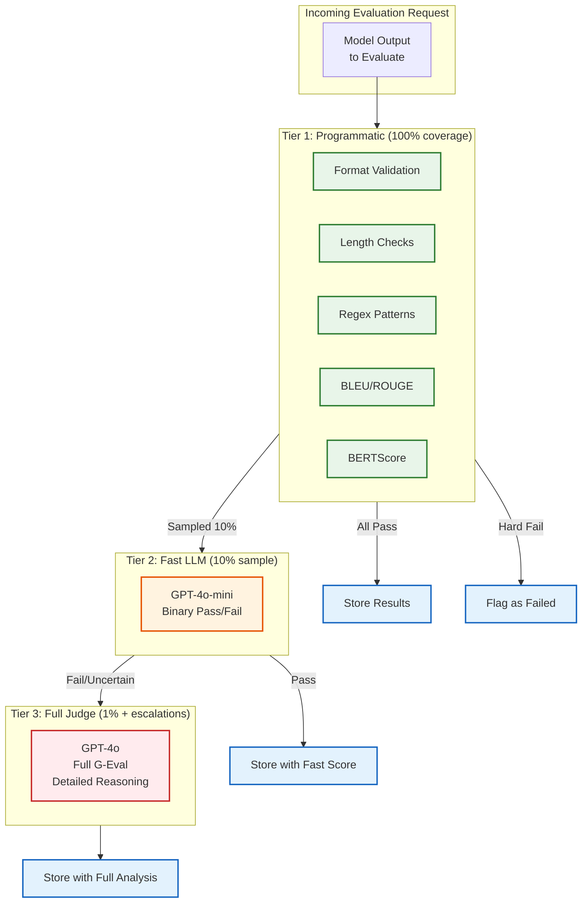
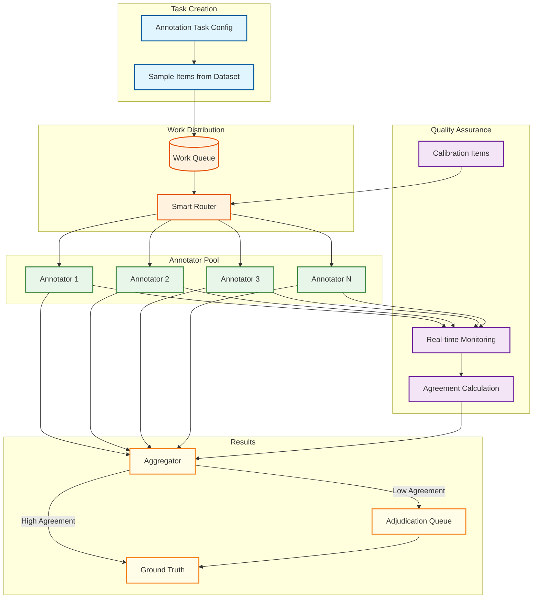
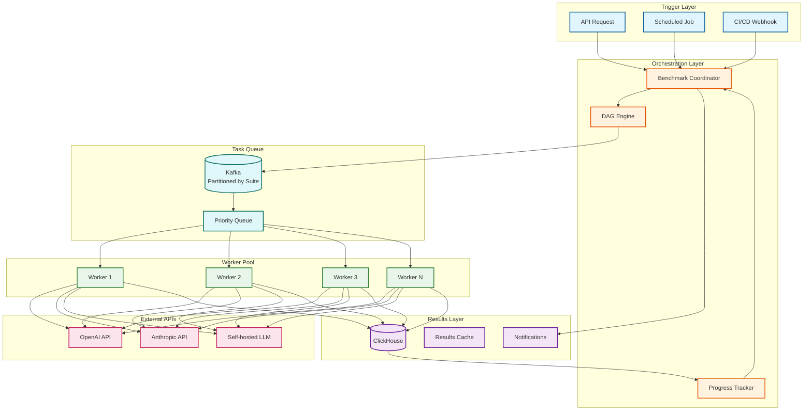

# Deep Dive & Bottlenecks

## Critical Component 1: LLM-as-Judge Cost Management

### The Core Challenge

LLM-as-Judge is the most powerful evaluation method but also the most expensive. At scale, unoptimized usage can lead to unsustainable costs.

**Cost Analysis:**

| Model | Input Cost (1M tokens) | Output Cost (1M tokens) | Avg Eval Cost | Daily Cost (10M evals) | Monthly Cost |
|-------|------------------------|-------------------------|---------------|------------------------|--------------|
| GPT-4o | $2.50 | $10.00 | $0.003 | $30,000 | $900,000 |
| GPT-4o-mini | $0.15 | $0.60 | $0.0005 | $5,000 | $150,000 |
| Claude 3 Haiku | $0.25 | $1.25 | $0.0006 | $6,000 | $180,000 |
| Llama 3 70B (self-hosted) | ~$0.10 | ~$0.10 | $0.0002 | $2,000 | $60,000 |

**Key Insight:** Using GPT-4o for all evaluations at 10M/day = $900K/month. This is rarely justified.

### Tiered Evaluation Strategy

The solution is a multi-tier approach where each tier has different cost-accuracy trade-offs:



**Tier Details:**

| Tier | Coverage | Latency | Cost/Eval | Purpose |
|------|----------|---------|-----------|---------|
| **Tier 1: Programmatic** | 100% | <50ms | ~$0.00001 | Format validation, basic quality gates |
| **Tier 2: Fast LLM** | 10% random | 200-500ms | ~$0.0005 | Quick quality screening |
| **Tier 3: Full Judge** | 1% + failures | 1-3s | ~$0.003 | Comprehensive analysis |

**Cost Calculation with Tiering:**

| Tier | Volume (10M base) | Cost/Eval | Total |
|------|-------------------|-----------|-------|
| Tier 1 | 10M | $0.00001 | $100 |
| Tier 2 | 1M (10% sample) | $0.0005 | $500 |
| Tier 3 | 150K (1% + 5% failures) | $0.003 | $450 |
| **Total** | | | **$1,050/day** |

**Monthly Cost: ~$32K** (96% reduction from baseline)

### Additional Optimization Strategies

#### 1. Semantic Caching

Cache evaluation results for identical or semantically similar input/output pairs.

```
FUNCTION get_or_evaluate(input, output, metrics):
    // Generate cache key
    cache_key = HASH(input + output + SORTED(metrics))

    // Check exact match cache
    cached = CACHE.get(cache_key)
    IF cached AND cached.age < MAX_CACHE_AGE:
        RETURN cached.result

    // Check semantic similarity cache (for LLM-as-Judge)
    IF metrics CONTAINS "llm_judge":
        embedding = EMBED(input + output)
        similar = VECTOR_SEARCH(embedding, threshold=0.98)
        IF similar:
            RETURN similar.result

    // Compute evaluation
    result = evaluate(input, output, metrics)

    // Store in cache
    CACHE.set(cache_key, result, ttl=CACHE_TTL)
    STORE_EMBEDDING(embedding, result)

    RETURN result
```

**Cache Hit Rates (Typical):**
| Scenario | Exact Match | Semantic Match | Total Savings |
|----------|-------------|----------------|---------------|
| CI/CD (repeated tests) | 60-80% | 10-15% | 70-95% |
| Production sampling | 10-20% | 20-30% | 30-50% |
| Benchmark runs | 90%+ | N/A | 90%+ (after first run) |

#### 2. Batch Processing

Group similar evaluations and send in batches where APIs support it.

```
FUNCTION batch_evaluate(items, batch_size=20):
    batches = CHUNK(items, batch_size)
    results = []

    FOR batch IN batches:
        // Construct batched prompt
        batch_prompt = """
        Evaluate the following {len(batch)} responses:

        {FOR i, item IN ENUMERATE(batch):}
        === Response {i+1} ===
        Input: {item.input}
        Output: {item.output}
        {END FOR}

        Provide scores for each response in JSON array format.
        """

        response = LLM_CALL(batch_prompt)
        results.extend(PARSE_BATCH_RESPONSE(response))

    RETURN results
```

**Batch Efficiency:**
| Batch Size | Tokens per Item | API Calls | Cost Reduction |
|------------|-----------------|-----------|----------------|
| 1 | 500 | 100 | 0% (baseline) |
| 10 | 200 (amortized overhead) | 10 | 60% |
| 20 | 150 (amortized overhead) | 5 | 70% |

#### 3. Model Routing

Route to cheaper models for simpler evaluations.

```
FUNCTION route_evaluation(input, output, required_accuracy):
    complexity = ESTIMATE_COMPLEXITY(input, output)

    IF complexity == LOW:
        // Simple format check, factual verification
        RETURN {model: "gpt-4o-mini", expected_accuracy: 0.85}

    ELSE IF complexity == MEDIUM:
        // Standard quality assessment
        RETURN {model: "gpt-4o-mini", expected_accuracy: 0.80}

    ELSE:  // HIGH
        // Nuanced judgment, edge cases
        RETURN {model: "gpt-4o", expected_accuracy: 0.90}

FUNCTION ESTIMATE_COMPLEXITY(input, output):
    // Heuristics:
    // - Length: longer = more complex
    // - Domain: technical/medical = more complex
    // - Ambiguity: subjective criteria = more complex

    score = 0
    score += LENGTH(output) / 1000  // Normalize length
    score += DOMAIN_COMPLEXITY[DETECT_DOMAIN(input)]
    score += AMBIGUITY_SCORE(EXTRACT_CRITERIA(input))

    IF score < 2: RETURN LOW
    ELSE IF score < 5: RETURN MEDIUM
    ELSE: RETURN HIGH
```

#### 4. Incremental Evaluation

Start with cheap evaluators, escalate only on failure/uncertainty.

```
FUNCTION incremental_evaluate(input, output, target_confidence=0.9):
    scores = {}
    confidence = 0

    // Stage 1: Programmatic (free)
    scores.bleu = compute_bleu(output, expected)
    scores.bertscore = compute_bertscore(output, expected)

    IF scores.bleu > 0.8 AND scores.bertscore > 0.85:
        RETURN {scores, confidence: 0.7, tier: 1}

    // Stage 2: Fast LLM (cheap)
    fast_result = fast_llm_eval(input, output)
    scores.fast_quality = fast_result.score

    IF fast_result.score > 0.8 AND fast_result.confidence > 0.9:
        RETURN {scores, confidence: 0.85, tier: 2}

    // Stage 3: Full judge (expensive)
    full_result = full_llm_eval(input, output)
    scores.update(full_result.scores)

    RETURN {scores, confidence: 0.95, tier: 3}
```

---

## Critical Component 2: Human Annotation Scalability

### The Core Challenge

Human annotation is essential for ground truth and calibration but faces several scalability challenges:

1. **Annotator fatigue** - Quality degrades over long sessions
2. **Inter-annotator disagreement** - Subjective tasks have natural variance
3. **Queue management** - Fair distribution across annotators
4. **Quality assurance** - Detecting and handling low-quality annotations

### Annotation Workflow Architecture



### Fatigue Mitigation

```
// Session management
MAX_SESSION_DURATION = 60 minutes
MAX_ITEMS_PER_SESSION = 50
BREAK_REMINDER_INTERVAL = 20 minutes

FUNCTION manage_annotator_session(annotator_id):
    session = GET_CURRENT_SESSION(annotator_id)

    // Enforce session limits
    IF session.duration > MAX_SESSION_DURATION:
        RETURN {action: "FORCE_BREAK", reason: "Session time limit"}

    IF session.items_completed > MAX_ITEMS_PER_SESSION:
        RETURN {action: "FORCE_BREAK", reason: "Item limit reached"}

    // Suggest breaks
    IF session.duration > BREAK_REMINDER_INTERVAL AND NOT session.break_taken:
        RETURN {action: "SUGGEST_BREAK"}

    // Monitor quality degradation
    recent_accuracy = GET_CALIBRATION_ACCURACY(annotator_id, last_n=10)
    IF recent_accuracy < session.initial_accuracy * 0.8:
        RETURN {action: "QUALITY_WARNING", suggestion: "Take a break"}

    RETURN {action: "CONTINUE"}
```

### Calibration Items

Intersperse known-answer items to track annotator quality in real-time.

```
FUNCTION create_annotation_queue(task, items, annotators):
    queue = []
    calibration_items = GET_CALIBRATION_SET(task.domain)

    // Insert calibration items at strategic points
    // - At the start (warm-up)
    // - Every N items (quality check)
    // - After breaks (recalibration)

    FOR annotator IN annotators:
        annotator_queue = []

        // Warm-up calibration
        annotator_queue.extend(SAMPLE(calibration_items, 3))

        // Main items with interspersed calibration
        for i, item IN ENUMERATE(ASSIGN_ITEMS(items, annotator)):
            annotator_queue.append(item)

            // Insert calibration every 10 items
            IF (i + 1) % 10 == 0:
                annotator_queue.append(SAMPLE(calibration_items, 1))

        queue[annotator.id] = annotator_queue

    RETURN queue

FUNCTION evaluate_calibration_response(annotator_id, item_id, response):
    expected = GET_GROUND_TRUTH(item_id)

    is_correct = COMPARE(response, expected, threshold=0.8)

    // Update annotator quality score
    UPDATE_QUALITY_SCORE(annotator_id, is_correct)

    // Alert if quality drops
    IF GET_RECENT_ACCURACY(annotator_id) < 0.7:
        ALERT_SUPERVISOR(annotator_id, "Quality degradation detected")
        PAUSE_ANNOTATOR(annotator_id)
```

### Smart Routing

Assign items to annotators based on expertise and workload.

```
FUNCTION route_item_to_annotator(item, available_annotators):
    scores = []

    FOR annotator IN available_annotators:
        score = 0

        // Expertise match
        item_domain = DETECT_DOMAIN(item)
        IF item_domain IN annotator.expertise_tags:
            score += 3

        // Language match
        item_language = DETECT_LANGUAGE(item)
        IF item_language IN annotator.languages:
            score += 2

        // Quality score (historical)
        score += annotator.quality_score * 2

        // Workload balancing (penalize overloaded annotators)
        current_load = GET_QUEUE_SIZE(annotator.id)
        score -= current_load * 0.1

        // Avoid repeated exposure (diversity)
        similar_items_annotated = COUNT_SIMILAR_ITEMS(annotator.id, item)
        score -= similar_items_annotated * 0.5

        scores.append({annotator, score})

    // Select top annotator
    RETURN MAX(scores, BY: score).annotator
```

### Agreement Calculation and Consensus

```
FUNCTION compute_agreement_and_consensus(item_id, annotations):
    """
    Calculate agreement and determine ground truth consensus.
    """

    IF LENGTH(annotations) < 2:
        RETURN {status: "INSUFFICIENT", consensus: None}

    // Calculate pairwise agreement
    values = [a.label FOR a IN annotations]
    annotation_type = DETECT_TYPE(values)  // NOMINAL, ORDINAL, etc.

    // Compute Krippendorff's Alpha for this item
    alpha = COMPUTE_ALPHA_SINGLE_ITEM(annotations, annotation_type)

    // Determine consensus
    IF annotation_type == NOMINAL:
        // Majority vote
        vote_counts = COUNT_BY(values)
        majority_value, majority_count = MAX(vote_counts.items(), BY: count)
        majority_ratio = majority_count / LENGTH(annotations)

        IF majority_ratio >= 0.67:  // 2/3 majority
            RETURN {
                status: "CONSENSUS",
                consensus: majority_value,
                confidence: majority_ratio,
                alpha: alpha
            }

    ELSE IF annotation_type IN [ORDINAL, INTERVAL]:
        // Check if values are within acceptable range
        mean_value = MEAN(values)
        std_value = STD(values)

        IF std_value < ACCEPTABLE_STD_THRESHOLD:
            RETURN {
                status: "CONSENSUS",
                consensus: ROUND(mean_value),
                confidence: 1 - (std_value / MAX_POSSIBLE_STD),
                alpha: alpha
            }

    // No consensus - needs adjudication
    RETURN {
        status: "NEEDS_ADJUDICATION",
        consensus: None,
        annotations: annotations,
        alpha: alpha
    }

FUNCTION adjudicate(item_id, annotations, adjudicator_id):
    """
    Expert adjudication for items without consensus.
    """

    // Present all annotations to adjudicator
    adjudication_result = GET_ADJUDICATOR_DECISION(
        adjudicator_id,
        item_id,
        annotations
    )

    // Create ground truth
    SET_GROUND_TRUTH(item_id, {
        value: adjudication_result.value,
        source: "EXPERT",
        confidence: 0.95,
        original_annotations: annotations,
        adjudicator_id: adjudicator_id
    })

    // Update annotator quality scores based on agreement with expert
    FOR annotation IN annotations:
        is_correct = annotation.label == adjudication_result.value
        UPDATE_ANNOTATOR_QUALITY(annotation.annotator_id, is_correct)
```

---

## Critical Component 3: Benchmark Orchestration at Scale

### The Core Challenge

Running comprehensive benchmark suites like MMLU (57 tasks, 14,000+ questions) requires:
1. Efficient parallelization
2. Resource management (LLM API rate limits)
3. Fault tolerance (partial failures shouldn't abort entire run)
4. Progress tracking and ETA estimation

### Benchmark Execution Architecture



### Parallelization Strategy

```
// MMLU Example Configuration
MMLU_CONFIG = {
    suite_name: "MMLU",
    version: "2024-01",
    tasks: 57,
    total_questions: 14042,

    // Resource limits
    max_parallelism: 20,  // Concurrent tasks
    max_llm_calls_per_second: 50,  // API rate limit
    batch_size_per_task: 50,  // Questions per API call (if batching)

    // Timing estimates
    avg_seconds_per_question: 2,  // Including API latency
    estimated_total_time: 14042 * 2 / 20 = 1404 seconds ≈ 24 minutes
}

FUNCTION execute_benchmark(config, model):
    // Step 1: Create run record
    run = CREATE_RUN(config, model)

    // Step 2: Build execution DAG
    tasks = LOAD_BENCHMARK_TASKS(config.suite_name)
    dag = BUILD_DAG(tasks)  // Usually flat for MMLU (no dependencies)

    // Step 3: Create batches respecting rate limits
    batches = create_rate_limited_batches(
        tasks,
        config.max_parallelism,
        config.max_llm_calls_per_second
    )

    // Step 4: Execute batches
    FOR batch IN batches:
        // Execute in parallel with timeout
        results = PARALLEL_EXECUTE_WITH_TIMEOUT(
            [execute_task(task, model) FOR task IN batch],
            timeout=300  // 5 minute timeout per batch
        )

        // Handle partial failures
        FOR result IN results:
            IF result.status == SUCCESS:
                STORE_RESULT(run.id, result)
            ELSE:
                LOG_FAILURE(run.id, result)
                RETRY_QUEUE.add(result.task_id) IF result.retryable

        // Update progress
        UPDATE_PROGRESS(run.id, completed=SUM(results.success))

    // Step 5: Retry failures
    retry_results = RETRY_WITH_BACKOFF(RETRY_QUEUE)
    STORE_RESULTS(run.id, retry_results)

    // Step 6: Aggregate and finalize
    final_scores = AGGREGATE_SCORES(run.id)
    FINALIZE_RUN(run.id, final_scores)

    RETURN run

FUNCTION create_rate_limited_batches(tasks, max_parallel, max_rps):
    """Create batches that respect rate limits."""

    // Estimate LLM calls per task
    calls_per_task = [ESTIMATE_CALLS(task) FOR task IN tasks]

    batches = []
    current_batch = []
    current_calls = 0

    FOR i, task IN ENUMERATE(tasks):
        task_calls = calls_per_task[i]

        // Check if adding this task exceeds limits
        IF (LENGTH(current_batch) < max_parallel AND
            current_calls + task_calls <= max_rps):
            current_batch.append(task)
            current_calls += task_calls
        ELSE:
            // Start new batch
            batches.append(current_batch)
            current_batch = [task]
            current_calls = task_calls

    // Don't forget last batch
    IF current_batch:
        batches.append(current_batch)

    RETURN batches
```

### Fault Tolerance

```
FUNCTION execute_task_with_fault_tolerance(task, model, run_id):
    """Execute a single benchmark task with comprehensive error handling."""

    MAX_RETRIES = 3
    RETRY_DELAY_BASE = 1  // seconds

    FOR attempt IN 1..MAX_RETRIES:
        TRY:
            // Set timeout based on task size
            timeout = MAX(30, task.item_count * 0.5)  // At least 30s, +0.5s per item

            result = EXECUTE_WITH_TIMEOUT(
                execute_task_items(task, model),
                timeout
            )

            // Validate result
            IF result.completed_items < task.item_count * 0.9:
                RAISE PartialCompletionError(
                    f"Only {result.completed_items}/{task.item_count} completed"
                )

            RETURN {
                status: "SUCCESS",
                task_id: task.id,
                score: result.score,
                items: result.items,
                latency: result.latency
            }

        CATCH RateLimitError:
            // Back off and retry
            delay = RETRY_DELAY_BASE * (2 ** attempt) + RANDOM(0, 1)
            LOG_WARNING(f"Rate limited on {task.id}, retrying in {delay}s")
            SLEEP(delay)
            CONTINUE

        CATCH TimeoutError:
            // Log and potentially split task
            LOG_WARNING(f"Timeout on {task.id}")
            IF attempt < MAX_RETRIES:
                // Try with smaller batch size
                task.batch_size = task.batch_size / 2
                CONTINUE
            ELSE:
                RETURN {status: "TIMEOUT", task_id: task.id, partial_result: result}

        CATCH APIError AS e:
            IF e.is_retryable():
                delay = RETRY_DELAY_BASE * (2 ** attempt)
                SLEEP(delay)
                CONTINUE
            ELSE:
                RETURN {status: "FAILED", task_id: task.id, error: str(e)}

        CATCH Exception AS e:
            LOG_ERROR(f"Unexpected error on {task.id}: {e}")
            RETURN {status: "FAILED", task_id: task.id, error: str(e)}

    // Exhausted retries
    RETURN {status: "FAILED", task_id: task.id, error: "Max retries exceeded"}
```

### Progress Tracking and ETA

```
FUNCTION update_progress(run_id, task_result):
    """Update progress and recalculate ETA."""

    run = GET_RUN(run_id)

    // Update counters
    run.completed_tasks += 1
    run.completed_items += task_result.item_count

    // Track timing for ETA
    task_duration = task_result.latency
    run.task_durations.append(task_duration)

    // Calculate ETA using exponential moving average
    alpha = 0.3  // Weight for recent observations
    avg_duration = EMA(run.task_durations, alpha)

    remaining_tasks = run.total_tasks - run.completed_tasks
    estimated_remaining = remaining_tasks * avg_duration

    // Adjust for parallelism
    effective_parallelism = MIN(
        run.config.max_parallelism,
        remaining_tasks
    )
    estimated_wall_time = estimated_remaining / effective_parallelism

    run.eta = NOW() + SECONDS(estimated_wall_time)
    run.progress_percent = (run.completed_items / run.total_items) * 100

    SAVE(run)

    // Emit progress event
    EMIT_EVENT("benchmark.progress", {
        run_id: run_id,
        progress_percent: run.progress_percent,
        eta: run.eta,
        completed_tasks: run.completed_tasks,
        total_tasks: run.total_tasks
    })
```

---

## Bottleneck Analysis

### Identified Bottlenecks

| Bottleneck | Symptom | Root Cause | Impact |
|------------|---------|------------|--------|
| **LLM API Rate Limits** | 429 errors, slow execution | Provider throttling | 50-80% throughput reduction |
| **LLM API Latency** | High P99 evaluation time | Network, model load | Poor user experience |
| **Result Aggregation** | Memory pressure, slow dashboards | Large result sets | Query timeouts |
| **Dataset Loading** | Slow benchmark start | Object storage latency | Delayed execution |
| **Human Annotation Queue** | Stale items, unfair distribution | Poor routing | Low annotator utilization |

### Mitigation Strategies

#### LLM API Rate Limits

```
MITIGATION: Multi-Provider Load Balancing

FUNCTION get_llm_provider(request):
    providers = [
        {name: "openai", rate_remaining: GET_RATE_REMAINING("openai"), cost: 1.0},
        {name: "anthropic", rate_remaining: GET_RATE_REMAINING("anthropic"), cost: 1.2},
        {name: "self_hosted", rate_remaining: INFINITY, cost: 0.5}
    ]

    // Filter by capability
    capable = [p FOR p IN providers IF CAN_HANDLE(p, request)]

    // Sort by rate availability, then cost
    sorted_providers = SORT(capable, BY: [-rate_remaining, cost])

    IF sorted_providers[0].rate_remaining > 0:
        RETURN sorted_providers[0]
    ELSE:
        // All rate limited - queue for later
        QUEUE_FOR_LATER(request)
        RETURN None
```

#### Result Aggregation

```
MITIGATION: Streaming Aggregation with Materialized Views

// Instead of computing aggregates on-query, pre-compute them

// ClickHouse materialized view for run summaries
CREATE MATERIALIZED VIEW run_stats_mv
ENGINE = AggregatingMergeTree()
ORDER BY (org_id, run_id)
AS SELECT
    org_id,
    run_id,
    avgState(score_overall) as avg_overall,
    countState() as total_count,
    sumState(cost_usd) as total_cost
FROM evaluation_results
GROUP BY org_id, run_id;

// Query uses pre-aggregated data
FUNCTION get_run_summary(run_id):
    RETURN QUERY("""
        SELECT
            avgMerge(avg_overall) as avg_score,
            countMerge(total_count) as total_items,
            sumMerge(total_cost) as total_cost
        FROM run_stats_mv
        WHERE run_id = {run_id}
    """)
```

#### Dataset Loading

```
MITIGATION: Pre-warming and Caching

FUNCTION prepare_benchmark_run(suite_id, model):
    // Pre-load dataset into memory/cache before execution starts

    ASYNC:
        // Warm object storage cache
        dataset_urls = GET_DATASET_URLS(suite_id)
        FOR url IN dataset_urls:
            PREFETCH(url)  // Triggers CDN/cache population

        // Pre-parse common formats
        FOR task IN GET_BENCHMARK_TASKS(suite_id):
            PARSE_AND_CACHE(task.dataset)

    // Start execution after warm-up
    WAIT_FOR_ASYNC()
    RETURN execute_benchmark(suite_id, model)
```

#### Human Annotation Queue

```
MITIGATION: Dynamic Rebalancing

FUNCTION rebalance_annotation_queue():
    // Run periodically (every 5 minutes)

    annotators = GET_ACTIVE_ANNOTATORS()
    pending_items = GET_PENDING_ITEMS()

    // Calculate fair share
    fair_share = LENGTH(pending_items) / LENGTH(annotators)

    FOR annotator IN annotators:
        current_queue = GET_QUEUE(annotator.id)
        queue_size = LENGTH(current_queue)

        IF queue_size > fair_share * 1.5:
            // Overloaded - redistribute
            excess = current_queue[fair_share:]
            REMOVE_FROM_QUEUE(annotator.id, excess)
            REDISTRIBUTE(excess, annotators)

        ELSE IF queue_size < fair_share * 0.5:
            // Underloaded - assign more
            needed = fair_share - queue_size
            available = GET_UNASSIGNED_ITEMS(needed)
            ADD_TO_QUEUE(annotator.id, available)

    // Age-based prioritization
    FOR item IN GET_OLD_ITEMS(age > 1 hour):
        BOOST_PRIORITY(item)
```

---

## Performance Optimization Summary

| Component | Optimization | Expected Improvement |
|-----------|--------------|---------------------|
| LLM-as-Judge | Tiered evaluation | 95% cost reduction |
| LLM-as-Judge | Semantic caching | 30-50% fewer API calls |
| LLM-as-Judge | Batch processing | 60-70% cost reduction |
| Annotation | Calibration items | 20% quality improvement |
| Annotation | Smart routing | 30% faster completion |
| Benchmark | Parallel execution | 10-20x faster |
| Benchmark | Pre-warming | 50% faster start |
| Query | Materialized views | 100x faster aggregations |
