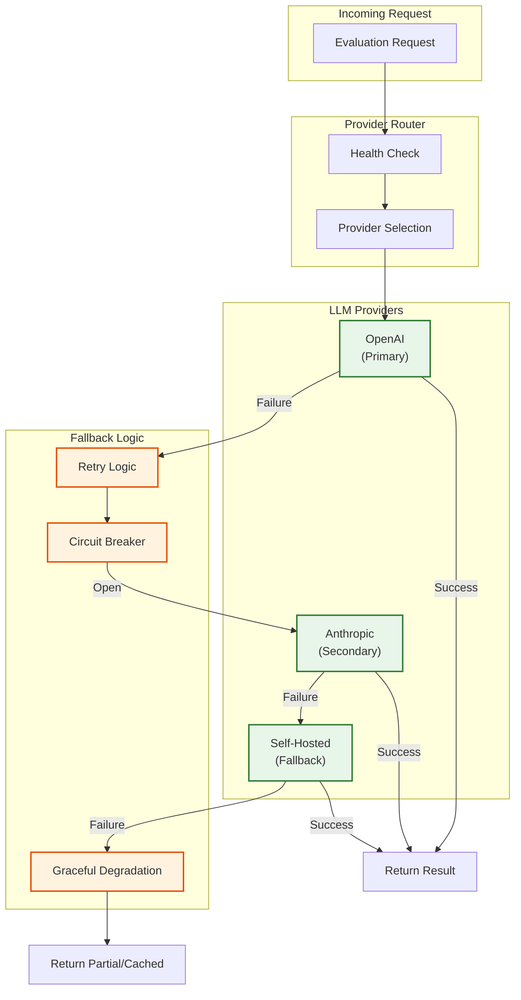
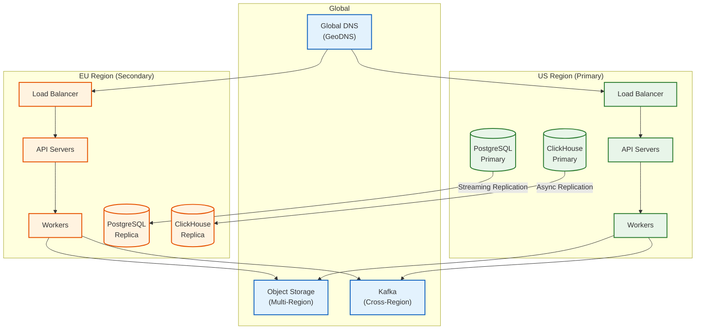

# Scalability & Reliability

## Horizontal Scaling Strategy

### Component Scaling Matrix

| Component | Scaling Trigger | Strategy | Max Scale | Notes |
|-----------|-----------------|----------|-----------|-------|
| **Evaluation API** | QPS > 500/pod | Add pods | 50 pods | Stateless, behind LB |
| **Sync Workers** | Queue depth > 1K | Add workers | 100 workers | CPU-bound |
| **Async Workers** | Queue depth > 10K | Add workers | 200 workers | I/O-bound (LLM API) |
| **Batch Workers** | Active runs > 50 | Add workers | 50 workers | Memory-intensive |
| **Annotation Service** | Concurrent annotators > 500 | Add pods | 20 pods | Session state in Redis |
| **PostgreSQL** | CPU > 70%, connections > 80% | Read replicas | 5 replicas | Write to primary only |
| **ClickHouse** | Disk > 70%, query latency > 5s | Add shards | 10 shards | Shard by org_id |
| **Redis** | Memory > 80% | Add nodes | 6 nodes | Cluster mode |

### Auto-Scaling Configuration

```yaml
# Evaluation API Auto-Scaling
evaluation_api:
  min_replicas: 3
  max_replicas: 50
  metrics:
    - type: Resource
      resource:
        name: cpu
        target:
          type: Utilization
          averageUtilization: 70
    - type: External
      external:
        metric:
          name: http_requests_per_second
        target:
          type: AverageValue
          averageValue: 500
  scale_up:
    stabilization_window: 60s
    policies:
      - type: Pods
        value: 4
        period: 60s
  scale_down:
    stabilization_window: 300s
    policies:
      - type: Percent
        value: 10
        period: 60s

# Async Worker Auto-Scaling
async_workers:
  min_replicas: 10
  max_replicas: 200
  metrics:
    - type: External
      external:
        metric:
          name: kafka_consumer_lag
          selector:
            topic: evaluation-async
        target:
          type: AverageValue
          averageValue: 100  # Scale when lag > 100 per worker
  scale_up:
    stabilization_window: 30s
    policies:
      - type: Pods
        value: 10
        period: 30s
```

### Stateless Service Design

```
// All evaluation services are stateless
// State stored in external systems

SERVICE evaluation_api:
    // No local state
    // Session data in Redis
    // Request context in headers

    FUNCTION handle_request(request):
        // Extract org_id from auth token
        org_id = AUTH.validate_and_extract(request.headers.authorization)

        // All state lookups go to external stores
        run = POSTGRES.get_run(request.run_id)
        cache = REDIS.get(cache_key(request))

        // Processing is stateless
        result = process(request, run, cache)

        // Persist to external stores
        CLICKHOUSE.insert(result)
        REDIS.set(cache_key(request), result)

        RETURN result
```

---

## Database Scaling

### PostgreSQL Scaling

**Read Replica Strategy:**

```
                    ┌─────────────────┐
                    │   Primary       │
                    │   (Writes)      │
                    └────────┬────────┘
                             │
              ┌──────────────┼──────────────┐
              │              │              │
        ┌─────▼─────┐  ┌─────▼─────┐  ┌─────▼─────┐
        │ Replica 1 │  │ Replica 2 │  │ Replica 3 │
        │ (Reads)   │  │ (Reads)   │  │ (Reads)   │
        └───────────┘  └───────────┘  └───────────┘
              │              │              │
              └──────────────┴──────────────┘
                             │
                    ┌────────▼────────┐
                    │  Read Load      │
                    │  Balancer       │
                    └─────────────────┘
```

**Connection Pooling:**

```yaml
# PgBouncer configuration
pgbouncer:
  pool_mode: transaction
  max_client_conn: 10000
  default_pool_size: 50
  reserve_pool_size: 10
  reserve_pool_timeout: 3

  # Per-database limits
  databases:
    evaluation:
      pool_size: 100
    annotation:
      pool_size: 50
```

### ClickHouse Sharding

**Sharding Strategy:**

```sql
-- Distributed table for cross-shard queries
CREATE TABLE evaluation_results_distributed ON CLUSTER 'eval_cluster'
AS evaluation_results
ENGINE = Distributed(
    'eval_cluster',           -- Cluster name
    'default',                -- Database
    'evaluation_results',     -- Local table
    cityHash64(org_id)        -- Sharding key
);

-- Shard assignment based on org_id hash
-- Ensures all data for an org is on same shard
-- Enables efficient org-scoped queries
```

**Shard Configuration:**

| Shard | Org ID Hash Range | Replicas | Storage |
|-------|-------------------|----------|---------|
| Shard 1 | 0 - 20% | 2 | 50TB |
| Shard 2 | 20% - 40% | 2 | 50TB |
| Shard 3 | 40% - 60% | 2 | 50TB |
| Shard 4 | 60% - 80% | 2 | 50TB |
| Shard 5 | 80% - 100% | 2 | 50TB |

### Object Storage Scaling

Object storage (for datasets) scales automatically. Optimization focuses on access patterns:

```
// Multi-tier storage for datasets
FUNCTION store_dataset(org_id, dataset_id, data):
    // Hot tier: Frequently accessed (< 30 days)
    // Warm tier: Occasional access (30-90 days)
    // Cold tier: Archival (> 90 days)

    path = f"s3://datasets/{org_id}/{dataset_id}/v{version}"

    // Store with lifecycle policy
    S3.put_object(
        bucket: "datasets",
        key: path,
        body: data,
        storage_class: "STANDARD",  // Starts in hot tier
        lifecycle: {
            transition_to_ia: 30,    // Infrequent Access after 30 days
            transition_to_glacier: 90  // Glacier after 90 days
        }
    )

    // Enable CDN for frequently accessed datasets
    IF is_benchmark_dataset(dataset_id):
        CDN.invalidate(path)
        CDN.prefetch(path)
```

---

## Reliability & Fault Tolerance

### Single Points of Failure (SPOF) Analysis

| Component | SPOF Risk | Mitigation | Failover Time |
|-----------|-----------|------------|---------------|
| Evaluation API | Low | Multiple pods behind LB | Instant |
| PostgreSQL Primary | Medium | Standby with auto-failover | 30-60s |
| ClickHouse | Low | Replicated tables | Instant |
| Kafka | Low | Multi-broker cluster | Instant |
| Redis | Low | Cluster mode | Instant |
| LLM Provider | High | Multi-provider routing | Instant |

### LLM Provider Failover



**Circuit Breaker Implementation:**

```
CLASS CircuitBreaker:
    STATE: CLOSED | OPEN | HALF_OPEN
    failure_threshold: int = 5
    recovery_timeout: duration = 60s
    half_open_max_calls: int = 3

    FUNCTION call(provider, request):
        IF self.state == OPEN:
            IF NOW() > self.opened_at + self.recovery_timeout:
                self.state = HALF_OPEN
                self.half_open_calls = 0
            ELSE:
                RAISE CircuitOpenError()

        TRY:
            result = provider.call(request)
            self.on_success()
            RETURN result
        CATCH Exception AS e:
            self.on_failure(e)
            RAISE

    FUNCTION on_success():
        IF self.state == HALF_OPEN:
            self.half_open_calls += 1
            IF self.half_open_calls >= self.half_open_max_calls:
                self.state = CLOSED
                self.failure_count = 0
        ELSE:
            self.failure_count = 0

    FUNCTION on_failure(error):
        self.failure_count += 1
        IF self.failure_count >= self.failure_threshold:
            self.state = OPEN
            self.opened_at = NOW()
            ALERT("Circuit breaker opened for {provider}")
```

### Retry Strategies

| Operation | Retry Strategy | Max Retries | Backoff |
|-----------|----------------|-------------|---------|
| LLM API Call | Exponential | 3 | 1s, 2s, 4s |
| Database Write | Linear | 3 | 100ms |
| Kafka Publish | Exponential | 5 | 500ms, 1s, 2s, 4s, 8s |
| Cache Read | None | 0 | N/A (fallback to DB) |
| Benchmark Task | Exponential | 3 | 5s, 15s, 45s |

```
FUNCTION retry_with_backoff(operation, config):
    FOR attempt IN 1..config.max_retries:
        TRY:
            RETURN operation()
        CATCH RetryableError AS e:
            IF attempt == config.max_retries:
                RAISE

            delay = calculate_delay(attempt, config)
            LOG(f"Retry {attempt}/{config.max_retries} after {delay}s: {e}")
            SLEEP(delay)

FUNCTION calculate_delay(attempt, config):
    IF config.strategy == EXPONENTIAL:
        base = config.initial_delay
        delay = base * (2 ** (attempt - 1))
        jitter = RANDOM(0, delay * 0.1)
        RETURN MIN(delay + jitter, config.max_delay)
    ELSE:  // LINEAR
        RETURN config.initial_delay * attempt
```

### Graceful Degradation

```
FUNCTION evaluate_with_degradation(request):
    """
    Graceful degradation when systems are overloaded or failing.
    """

    // Level 1: Full evaluation
    TRY:
        RETURN full_evaluation(request)
    CATCH LLMUnavailable:
        LOG("LLM unavailable, falling back to programmatic")

    // Level 2: Programmatic only
    TRY:
        result = programmatic_evaluation(request)
        result.degraded = true
        result.degradation_reason = "LLM unavailable"
        RETURN result
    CATCH EvaluatorError:
        LOG("Programmatic evaluation failed")

    // Level 3: Cached result
    cached = CACHE.get(hash(request))
    IF cached:
        cached.degraded = true
        cached.degradation_reason = "Using cached result"
        cached.cache_age = NOW() - cached.created_at
        RETURN cached

    // Level 4: Accept without evaluation
    RETURN {
        status: "ACCEPTED_WITHOUT_EVAL",
        degraded: true,
        degradation_reason: "All evaluation methods unavailable",
        scores: {},
        message: "Request accepted but not evaluated. Will be processed when system recovers."
    }
```

### Bulkhead Pattern

Isolate failures to prevent cascade:

```
// Separate thread pools for different evaluation types
THREAD_POOLS = {
    sync_eval: ThreadPool(size=100, queue=1000),
    async_eval: ThreadPool(size=200, queue=10000),
    benchmark: ThreadPool(size=50, queue=500),
    annotation: ThreadPool(size=50, queue=2000)
}

FUNCTION submit_evaluation(request):
    pool_name = determine_pool(request.type)
    pool = THREAD_POOLS[pool_name]

    TRY:
        future = pool.submit(evaluate, request)
        RETURN future
    CATCH QueueFullError:
        // This pool is overloaded, but others still work
        RETURN reject_with_retry_after(request, estimate_recovery_time(pool))
```

---

## Disaster Recovery

### Recovery Objectives

| Data Type | RPO (Recovery Point) | RTO (Recovery Time) | Strategy |
|-----------|----------------------|---------------------|----------|
| Evaluation Results | 1 hour | 30 minutes | ClickHouse replication + daily backup |
| Datasets | 0 (immutable) | 15 minutes | Cross-region object storage |
| Annotations | 1 hour | 30 minutes | PostgreSQL streaming replication |
| Experiments | 1 hour | 30 minutes | PostgreSQL streaming replication |
| Configuration | 5 minutes | 15 minutes | Etcd/ConfigMap + Git backup |

### Backup Strategy

```
// Automated backup schedule
BACKUP_SCHEDULE = {
    postgresql: {
        full_backup: "0 2 * * 0",       // Weekly Sunday 2 AM
        incremental: "0 2 * * 1-6",     // Daily 2 AM (except Sunday)
        wal_archive: "continuous",       // Continuous WAL archiving
        retention: "30 days"
    },
    clickhouse: {
        full_backup: "0 3 * * 0",       // Weekly Sunday 3 AM
        incremental: "0 3 * * 1-6",     // Daily 3 AM
        retention: "14 days"
    },
    redis: {
        rdb_snapshot: "0 * * * *",      // Hourly
        aof_rewrite: "0 4 * * *",       // Daily 4 AM
        retention: "7 days"
    }
}

FUNCTION perform_backup(component):
    // Create backup
    backup_id = create_backup(component)

    // Upload to cross-region storage
    upload_to_backup_storage(backup_id, region="us-west-2")
    upload_to_backup_storage(backup_id, region="eu-west-1")

    // Verify backup integrity
    verify_backup(backup_id)

    // Clean old backups
    cleanup_old_backups(component, BACKUP_SCHEDULE[component].retention)

    // Update backup manifest
    update_manifest(backup_id)
```

### Multi-Region Architecture



### Failover Procedure

```
PROCEDURE regional_failover(failed_region, target_region):
    """
    Failover from failed region to target region.
    """

    // Step 1: Detect failure (automated)
    // - Health checks failing
    // - Latency > threshold
    // - Error rate > threshold

    LOG("Initiating failover from {failed_region} to {target_region}")

    // Step 2: Stop writes to failed region
    pause_writes(failed_region)

    // Step 3: Wait for replication lag to clear
    wait_for_replication(target_region, timeout=60s)

    // Step 4: Promote secondary databases
    IF is_postgres_replica(target_region):
        promote_postgres_replica(target_region)

    IF is_clickhouse_replica(target_region):
        promote_clickhouse_replica(target_region)

    // Step 5: Update DNS
    update_dns(target_region, ttl=30)

    // Step 6: Verify services
    verify_services(target_region)

    // Step 7: Resume traffic
    resume_traffic(target_region)

    // Step 8: Notify
    notify_oncall("Failover complete: {failed_region} -> {target_region}")

    RETURN {
        status: "complete",
        duration: elapsed_time,
        data_loss: calculate_data_loss()
    }
```

---

## Load Testing & Capacity Planning

### Load Testing Scenarios

| Scenario | Duration | Load Pattern | Success Criteria |
|----------|----------|--------------|------------------|
| Baseline | 30 min | 100% steady | P99 < 1s, errors < 0.1% |
| Peak | 30 min | 5x baseline | P99 < 3s, errors < 1% |
| Spike | 5 min | 10x baseline | No crashes, graceful degradation |
| Soak | 24 hours | 80% baseline | No memory leaks, stable latency |
| Chaos | 2 hours | 100% baseline + failures | Automatic recovery, no data loss |

### Capacity Planning Model

```
FUNCTION calculate_capacity(target_qps, growth_rate, planning_horizon_months):
    """
    Calculate required capacity for future growth.
    """

    // Current capacity per component
    current_capacity = {
        api_pods: 10,
        async_workers: 50,
        pg_connections: 500,
        ch_storage_tb: 10
    }

    // Capacity per unit
    capacity_per_unit = {
        api_pods: 500,        // QPS per pod
        async_workers: 100,   // Evals per worker per minute
        pg_connections: 10,   // Connections per worker
        ch_storage_tb: 0.1    // TB per month at current scale
    }

    // Project growth
    months = planning_horizon_months
    growth_multiplier = (1 + growth_rate) ** months

    future_qps = target_qps * growth_multiplier
    future_evals_per_day = future_qps * 86400

    // Calculate required capacity
    required = {
        api_pods: CEIL(future_qps / capacity_per_unit.api_pods),
        async_workers: CEIL(future_evals_per_day / (capacity_per_unit.async_workers * 60 * 24)),
        pg_connections: required.async_workers * capacity_per_unit.pg_connections,
        ch_storage_tb: current_capacity.ch_storage_tb + (capacity_per_unit.ch_storage_tb * months * growth_multiplier)
    }

    // Add 30% buffer
    buffered = {k: CEIL(v * 1.3) FOR k, v IN required}

    RETURN {
        current: current_capacity,
        required: required,
        recommended: buffered,
        growth_multiplier: growth_multiplier
    }
```

### Cost Estimation

| Component | Unit Cost | Current Usage | Projected (12mo) | Monthly Cost |
|-----------|-----------|---------------|------------------|--------------|
| API Pods | $100/pod | 10 | 30 | $3,000 |
| Worker Pods | $80/pod | 50 | 150 | $12,000 |
| PostgreSQL | $2,000/instance | 2 | 4 | $8,000 |
| ClickHouse | $3,000/node | 4 | 10 | $30,000 |
| Redis | $500/node | 3 | 6 | $3,000 |
| Object Storage | $23/TB | 50TB | 200TB | $4,600 |
| LLM API Calls | $0.001 avg | 10M/day | 50M/day | $1,500K |
| **Total** | | | | **~$1.56M/mo** |

*Note: LLM API costs dominate. Optimization strategies in Deep Dive section can reduce this by 90%+.*
