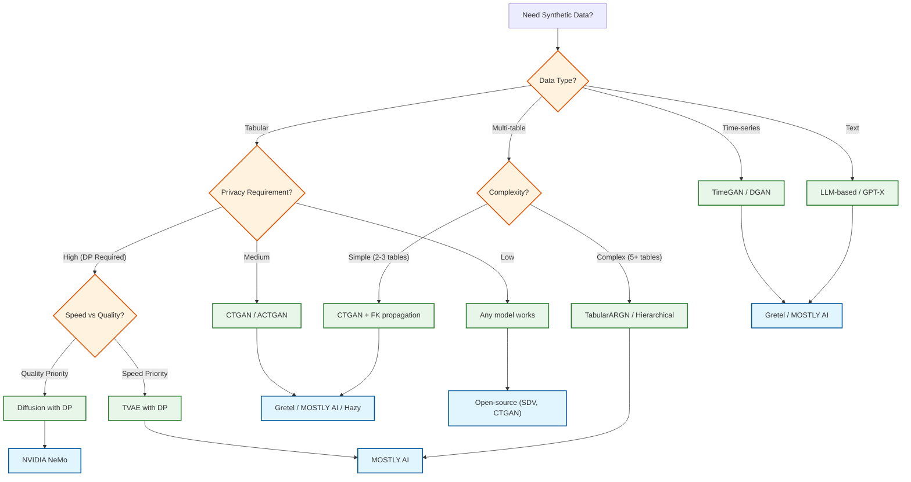
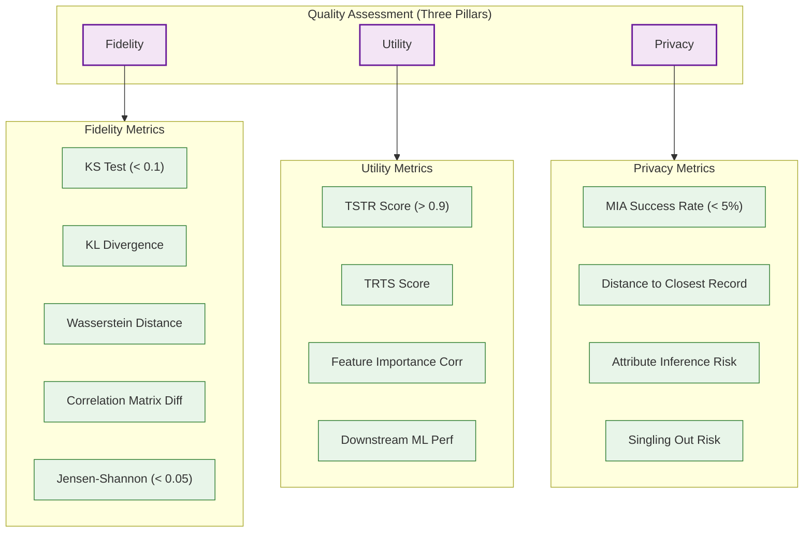
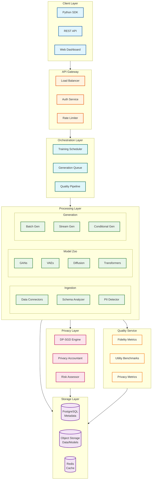

# Synthetic Data Generation Platform

## System Overview

A **Synthetic Data Generation Platform** creates artificial datasets that preserve the statistical properties and patterns of real data while mathematically guaranteeing privacy protection. Unlike traditional anonymization (masking, k-anonymity), synthetic data has no 1:1 correspondence with real records—it is generated from learned distributions, making re-identification mathematically bounded.

The platform supports multiple generative model architectures (GANs, VAEs, Diffusion Models, Transformers) to handle diverse data types including tabular, time-series, text, and relational multi-table structures. Core use cases include ML training data augmentation, privacy-safe data sharing, edge case generation for testing, and bias mitigation through targeted oversampling.

**Complexity Rating:** `Very High`

This system is complex due to:
- Multi-objective optimization (fidelity vs utility vs privacy trade-off)
- Diverse generative model architectures with different strengths
- Privacy guarantees requiring formal mathematical frameworks (Differential Privacy)
- Relational data complexity (multi-table foreign key preservation)
- GPU-intensive training requiring distributed systems expertise

---

## Quick Navigation

| Document | Description |
|----------|-------------|
| [01 - Requirements & Estimations](./01-requirements-and-estimations.md) | Functional/Non-functional requirements, capacity planning |
| [02 - High-Level Design](./02-high-level-design.md) | System architecture, data flows, component interactions |
| [03 - Low-Level Design](./03-low-level-design.md) | Data models, API specifications, core algorithms |
| [04 - Deep Dive & Bottlenecks](./04-deep-dive-and-bottlenecks.md) | Critical components, optimizations, failure modes |
| [05 - Scalability & Reliability](./05-scalability-and-reliability.md) | Scaling strategies, fault tolerance, disaster recovery |
| [06 - Security & Compliance](./06-security-and-compliance.md) | Privacy guarantees, threat model, regulatory compliance |
| [07 - Observability](./07-observability.md) | Metrics, logging, tracing, alerting |
| [08 - Interview Guide](./08-interview-guide.md) | Pacing, trade-offs, trap questions |

---

## Key Characteristics

| Aspect | Description |
|--------|-------------|
| **Privacy-First Design** | Differential Privacy (DP) integrated into training, providing mathematical privacy guarantees with configurable epsilon/delta budgets |
| **Multi-Model Architecture** | Model zoo supporting GANs (CTGAN, ACTGAN), VAEs (TVAE), Diffusion Models, and Transformer-based generators—routing to optimal model per use case |
| **Three-Pillar Quality** | Automated assessment of Fidelity (statistical similarity), Utility (ML performance), and Privacy (attack resistance) |
| **Relational Data Support** | Multi-table generation preserving foreign key integrity through hierarchical generation with topological ordering |
| **Conditional Generation** | Generate data matching specific constraints (edge cases, minority classes) for targeted augmentation and bias mitigation |
| **Enterprise-Grade** | Multi-tenant isolation, GPU cluster orchestration, connector ecosystem, audit trails |

---

## Platform Comparison

| Platform | Model Types | Differential Privacy | Multi-Table | Deployment | Key Strength |
|----------|-------------|---------------------|-------------|------------|--------------|
| **Gretel Navigator** | TabularARGN, ACTGAN, DGAN, LLM-based | Yes (DP-SGD) | Yes | Cloud/Hybrid | Compound AI with LLM (Mistral-7b fine-tuned) |
| **MOSTLY AI** | TabularARGN, PyTorch-based | Yes (built-in) | Yes | Cloud/On-prem/Air-gapped | Enterprise (SOC2/ISO27001), 100x faster training |
| **NVIDIA NeMo** | NeMo Data Designer, Safe Synthesizer | Yes (HIPAA/GDPR compliant) | Limited | Cloud/On-prem | NVIDIA ecosystem, Nemotron models |
| **Hazy** | GANs, Bayesian Networks | Yes | Yes | Cloud/On-prem | Financial services focus |
| **Tonic** | Statistical methods, ML-based | Limited | Yes | Cloud | Developer experience, CI/CD integration |
| **Synthesized** | Multiple generators | Yes | Yes | Cloud | Data science workflow integration |

### Platform Selection Decision Tree

---

## Core Capabilities

### Generative Model Zoo

| Model | Architecture | Best For | Fidelity | Speed | Privacy Integration |
|-------|--------------|----------|----------|-------|---------------------|
| **CTGAN** | GAN with mode-specific normalization | Tabular, mixed types | Good | Fast | Medium (DP-SGD) |
| **TVAE** | Variational Autoencoder | Tabular, probabilistic | Good | Fast | Easy (DP-VAE) |
| **ACTGAN** | Auxiliary Classifier GAN | Tabular with labels | Better | Medium | Medium |
| **TabularARGN** | Autoregressive Transformer | Complex distributions | Better | Medium | Medium |
| **DDPM** | Denoising Diffusion Probabilistic Model | Highest fidelity needed | Best | Slow | Good |
| **TimeGAN** | GAN + RNN | Time-series, sequences | Good | Medium | Medium |
| **Transformer-LLM** | Fine-tuned LLM (Mistral/GPT) | Text, mixed modalities | Best | Slow | Variable |

### Quality Assessment Framework

### Privacy Mechanisms

| Mechanism | How It Works | Use Case |
|-----------|--------------|----------|
| **DP-SGD** | Gradient clipping + calibrated noise during training | Training-time privacy guarantee |
| **PATE** | Teacher ensemble voting with noise | Transfer learning, knowledge distillation |
| **Rare Category Protection** | Minimum k-anonymity for minority classes | Protect rare diseases, minorities |
| **Extreme Value Capping** | Truncate outliers before training | Reduce uniqueness fingerprinting |
| **Privacy Budget Accounting** | Track cumulative epsilon/delta spend | Limit total privacy leakage |

---

## Architecture Overview

---

## Use Case Matrix

| Use Case | Primary Goal | Model Recommendation | Privacy Level |
|----------|--------------|---------------------|---------------|
| **ML Training Augmentation** | Increase training data volume | CTGAN, TVAE | Medium |
| **Privacy-Safe Data Sharing** | Share data across organizations | TVAE with DP, Diffusion with DP | High |
| **Edge Case Generation** | Generate rare scenarios | Conditional CTGAN | Medium |
| **Bias Mitigation** | Balance underrepresented classes | Targeted oversampling | Medium |
| **Test Data Generation** | Create realistic test datasets | CTGAN, ACTGAN | Low-Medium |
| **Data Monetization** | Sell synthetic versions | Diffusion with DP | High |
| **Regulatory Compliance** | GDPR/HIPAA safe analytics | DP-enabled models | High |

---

## Key Metrics Reference

| Metric Category | Metric | Target | Description |
|-----------------|--------|--------|-------------|
| **Fidelity** | KS Test | < 0.1 | Max CDF difference per column |
| **Fidelity** | Jensen-Shannon | < 0.05 | Symmetric distribution divergence |
| **Fidelity** | Correlation Matrix Diff | < 0.1 | Frobenius norm of correlation difference |
| **Utility** | TSTR Score | > 0.9× baseline | Train synthetic, test real |
| **Utility** | Feature Importance Corr | > 0.8 | Pearson correlation of importances |
| **Privacy** | MIA Success Rate | < 5% | Membership inference attack resistance |
| **Privacy** | DCR | > threshold | Distance to closest real record |
| **Latency** | Training (1M rows) | < 4 hours | CTGAN baseline |
| **Latency** | Generation (100K rows) | < 5 minutes | Batch generation |
| **Latency** | Quality Check | < 10 minutes | Full fidelity/utility/privacy suite |

---

## Interview Preparation Checklist

### Must Know
- [ ] Difference between anonymization and synthetic data generation
- [ ] GAN vs VAE vs Diffusion trade-offs
- [ ] Differential Privacy basics (epsilon, delta, composition)
- [ ] Three pillars of quality: Fidelity, Utility, Privacy
- [ ] Privacy-utility trade-off concept
- [ ] TSTR (Train Synthetic, Test Real) evaluation methodology

### Should Know
- [ ] CTGAN architecture (mode-specific normalization, conditional generator)
- [ ] DP-SGD mechanics (gradient clipping, noise calibration)
- [ ] Multi-table generation with FK preservation
- [ ] Privacy budget accounting and composition theorems
- [ ] Membership Inference Attack (MIA) and defenses
- [ ] Rare category and extreme value protection

### Nice to Know
- [ ] TabularARGN autoregressive generation
- [ ] Diffusion model denoising process
- [ ] RDP (Rényi Differential Privacy) for tighter accounting
- [ ] CycleGAN for domain transfer
- [ ] TimeGAN for temporal data
- [ ] Model collapse in GANs and mitigation strategies

---

## Related Systems

| System | Relationship |
|--------|--------------|
| [3.16 Feature Store](../3.16-feature-store/00-index.md) | Synthetic data feeds feature stores for ML training |
| [3.4 MLOps Platform](../3.4-mlops-platform/00-index.md) | Training orchestration patterns |
| [3.15 RAG System](../3.15-rag-system/00-index.md) | Text generation comparison (retrieval vs generative) |
| [3.26 AI Model Evaluation](../3.26-ai-model-evaluation-benchmarking-platform/00-index.md) | Quality assessment patterns |
| [3.22 AI Guardrails](../3.22-ai-guardrails-safety-system/00-index.md) | PII detection, content safety |

---

## References

### Industry Platforms
- [Gretel AI Documentation](https://docs.gretel.ai/) - Navigator, TabularARGN, ACTGAN
- [MOSTLY AI Platform](https://mostly.ai/features) - Enterprise synthetic data
- [NVIDIA NeMo Data Designer](https://docs.nvidia.com/launchpad/ai/synthetic-data-generator/latest/) - Safe Synthesizer

### Research & Standards
- [AWS: Evaluating Synthetic Data Quality](https://aws.amazon.com/blogs/machine-learning/how-to-evaluate-the-quality-of-the-synthetic-data-measuring-from-the-perspective-of-fidelity-utility-and-privacy/)
- [Frontiers: Comprehensive Evaluation Framework 2025](https://www.frontiersin.org/journals/digital-health/articles/10.3389/fdgth.2025.1576290/full)
- [CTGAN/TVAE Analysis](https://thesai.org/Publications/ViewPaper?Volume=15&Issue=4&Code=IJACSA&SerialNo=125)
- [Privacy-Preserving Synthetic Data (PMC)](https://pmc.ncbi.nlm.nih.gov/articles/PMC11958975/)
- [Synthetic Data for Bias Mitigation](https://futureagi.com/blogs/synthetic-data-generation-bias-2025)

### Open Source
- [SDV (Synthetic Data Vault)](https://github.com/sdv-dev/SDV) - Open-source synthetic data library
- [Gretel Synthetics](https://github.com/gretelai/gretel-synthetics) - DP-enabled generators
- [CTGAN](https://github.com/sdv-dev/CTGAN) - Reference implementation
