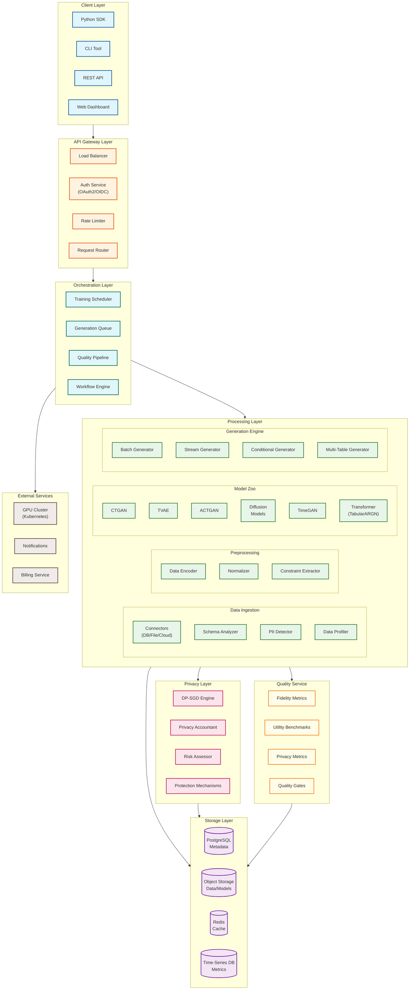
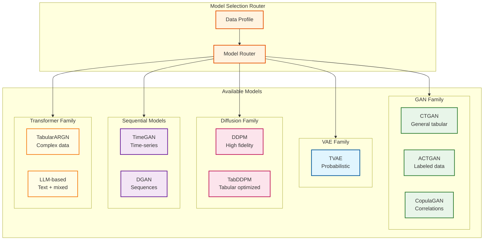
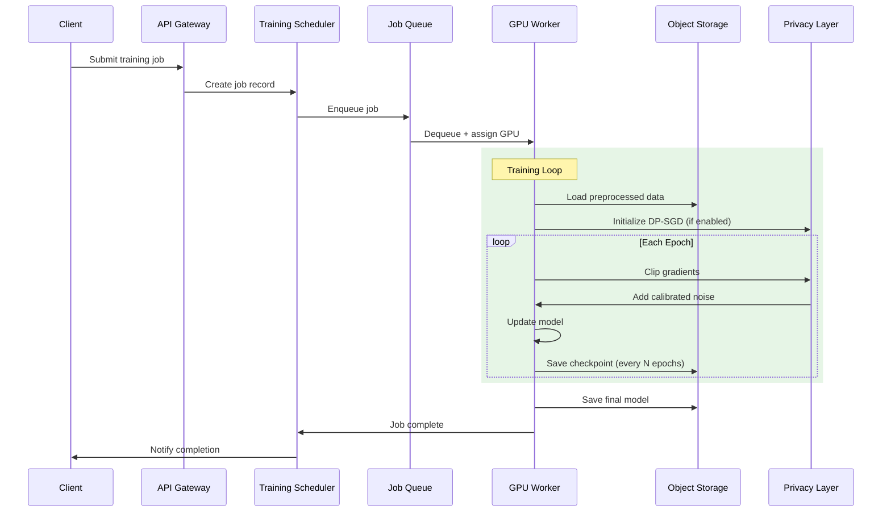
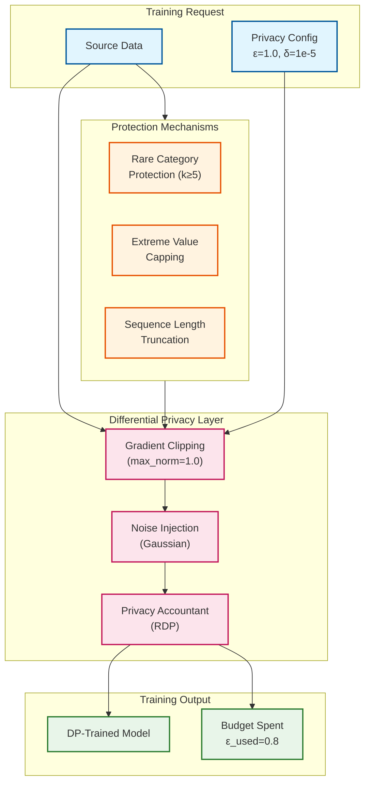
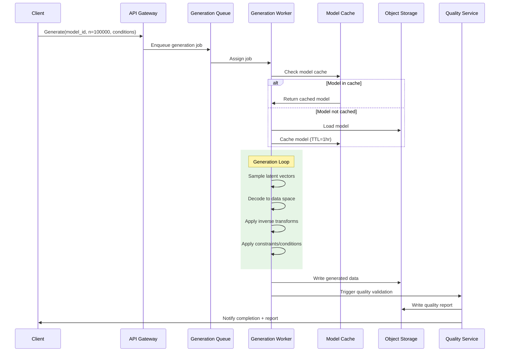
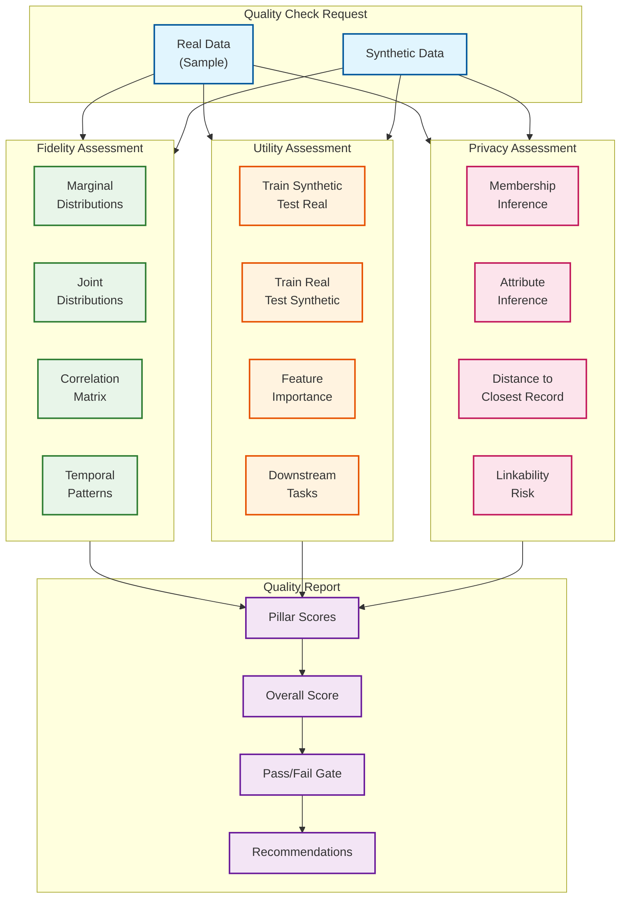
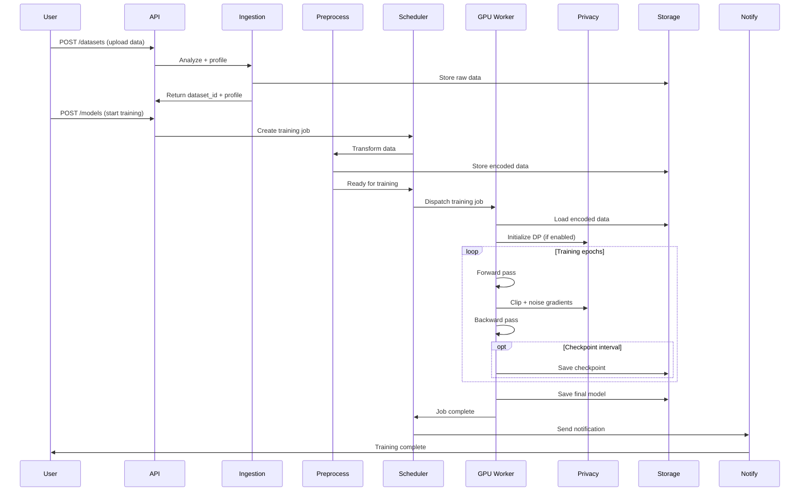
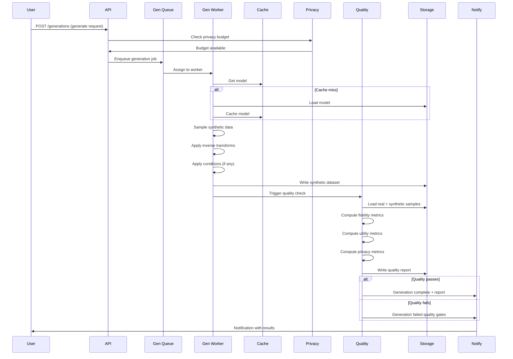
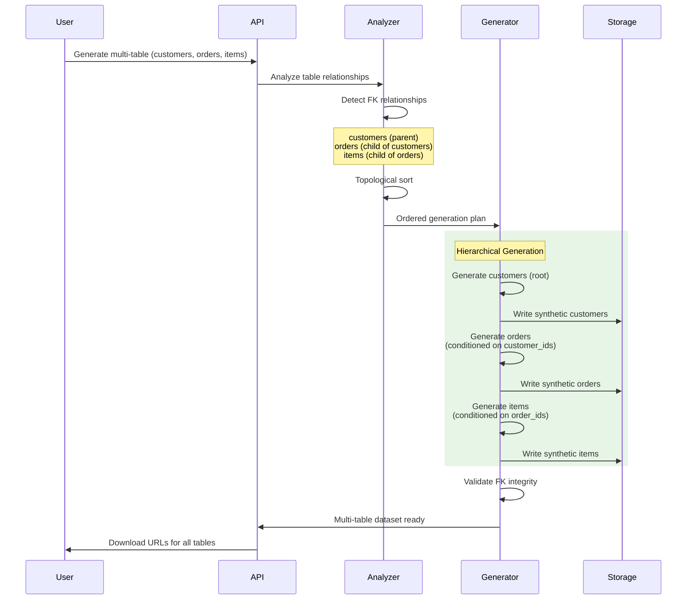

# High-Level Design

## System Architecture



---

## Core Components

### 1. Data Ingestion Layer

**Purpose:** Connect to data sources, analyze schemas, detect PII, and profile data characteristics.

```mermaid
flowchart LR
    subgraph Sources["Data Sources"]
        DB["Databases"]
        FILES["Files"]
        CLOUD["Cloud Storage"]
        STREAM["Streaming"]
    end

    subgraph Connectors["Connector Layer"]
        PG_CONN["PostgreSQL"]
        MYSQL_CONN["MySQL"]
        SNOW_CONN["Snowflake"]
        PARQ_CONN["Parquet"]
        CSV_CONN["CSV"]
        S3_CONN["S3/GCS/Azure"]
    end

    subgraph Analysis["Analysis Pipeline"]
        SCHEMA["Schema Detection"]
        TYPE["Type Inference"]
        STATS["Statistics"]
        PII["PII Detection"]
        REL["Relationship Detection"]
    end

    subgraph Output["Analysis Output"]
        META["Metadata Record"]
        PROFILE["Data Profile"]
        WARNINGS["Privacy Warnings"]
    end

    Sources --> Connectors --> Analysis --> Output

    classDef source fill:#e1f5fe,stroke:#01579b,stroke-width:2px
    classDef conn fill:#e8f5e9,stroke:#2e7d32,stroke-width:2px
    classDef analysis fill:#fff3e0,stroke:#e65100,stroke-width:2px
    classDef output fill:#f3e5f5,stroke:#6a1b9a,stroke-width:2px

    class DB,FILES,CLOUD,STREAM source
    class PG_CONN,MYSQL_CONN,SNOW_CONN,PARQ_CONN,CSV_CONN,S3_CONN conn
    class SCHEMA,TYPE,STATS,PII,REL analysis
    class META,PROFILE,WARNINGS output
```



**Capabilities:**
- Automatic schema detection and type inference
- Data profiling: cardinality, distributions, null rates
- PII detection using regex patterns and ML models
- Foreign key inference via column overlap analysis
- Multi-table relationship mapping

**Example Usage:**
```
// Ingest from PostgreSQL
dataset = ingest(
    source_type: "postgresql",
    connection: "host=db.example.com;database=sales",
    tables: ["customers", "orders", "products"],
    sample_rate: 0.1  // Profile on 10% sample
)

// Result includes:
// - Schema per table
// - Column statistics
// - PII warnings (email, phone detected)
// - Inferred FK relationships
```

### 2. Preprocessing Layer

**Purpose:** Transform raw data into model-ready format with appropriate encodings.

**Data Type Encoding:**

| Data Type | Encoding Method | Reconstruction |
|-----------|-----------------|----------------|
| Categorical (low cardinality, < 20) | One-hot encoding | Argmax |
| Categorical (high cardinality, ≥ 20) | Embedding + sampling | Nearest neighbor |
| Continuous (numeric) | Mode-specific normalization (GMM) | Inverse transform |
| DateTime | Cyclical encoding (sin/cos) + linear | Decode components |
| Text (short) | Token embedding | Detokenize |
| Boolean | Binary encoding | Threshold |

**Mode-Specific Normalization (CTGAN):**
Continuous columns are modeled as Gaussian Mixture Models (GMM) to handle multi-modal distributions. Each value is encoded as (mode, normalized_value).

```
// Preprocessing pipeline
preprocessed = preprocess(
    dataset: raw_data,
    config: {
        categorical_encoder: "embedding",
        numerical_normalizer: "mode_specific",  // GMM-based
        datetime_encoder: "cyclical",
        text_handler: "tokenize",
        constraint_extraction: true
    }
)
```

### 3. Model Zoo

**Purpose:** Provide multiple generative model architectures optimized for different data characteristics.



**Model Selection Criteria:**

| Criterion | CTGAN | TVAE | Diffusion | TimeGAN | TabularARGN |
|-----------|-------|------|-----------|---------|-------------|
| Training speed | Fast | Fast | Slow | Medium | Medium |
| Fidelity | Good | Good | Best | Good | Better |
| Mode coverage | Medium | High | High | High | High |
| DP integration | Medium | Easy | Medium | Hard | Medium |
| Memory usage | Low | Low | High | Medium | Medium |
| Stability | Medium | High | High | Medium | High |

### 4. Training Orchestration

**Purpose:** Manage distributed GPU training, checkpointing, and hyperparameter optimization.



**Training Configuration:**
```
training_config = {
    model_type: "CTGAN",
    epochs: 300,
    batch_size: 500,
    generator_lr: 2e-4,
    discriminator_lr: 2e-4,
    discriminator_steps: 1,

    // Distributed training
    distributed: {
        strategy: "DDP",  // Distributed Data Parallel
        num_gpus: 4,
        checkpoint_interval: 50
    },

    // Privacy (optional)
    privacy: {
        enabled: true,
        epsilon: 1.0,
        delta: 1e-5,
        max_grad_norm: 1.0
    }
}
```

### 5. Privacy Layer

**Purpose:** Provide mathematical privacy guarantees through Differential Privacy and related mechanisms.



**Privacy Mechanisms:**

| Mechanism | Description | When Applied |
|-----------|-------------|--------------|
| **DP-SGD** | Clip gradients, add calibrated Gaussian noise | During training |
| **Privacy Accountant** | Track cumulative ε/δ spend using RDP | Per batch |
| **Rare Category Protection** | Remove categories with < k occurrences | Preprocessing |
| **Extreme Value Capping** | Truncate outliers beyond P1/P99 | Preprocessing |
| **Sequence Truncation** | Limit sequence lengths | Multi-table preprocessing |

### 6. Generation Engine

**Purpose:** Sample synthetic data from trained models with support for batch, streaming, and conditional generation.



**Generation Modes:**

| Mode | Use Case | Latency | Implementation |
|------|----------|---------|----------------|
| **Batch** | Dataset creation | Minutes | Generate N rows to file |
| **Streaming** | Real-time API | < 100ms | Pre-warmed model, single-row sampling |
| **Conditional** | Edge cases, targeting | Variable | Rejection sampling or conditional model |
| **Augmentation** | Class balancing | Variable | Generate specific subpopulations |
| **Multi-table** | Relational data | Minutes | Hierarchical FK propagation |

**Conditional Generation Example:**
```
// Generate edge cases: high-income elderly with rare disease
synthetic = generate(
    model_id: "model_123",
    n_samples: 10000,
    conditions: {
        "age": { "operator": ">", "value": 65 },
        "income": { "operator": ">", "value": 200000 },
        "disease": { "operator": "=", "value": "rare_condition_x" }
    },
    seed: 42  // Reproducibility
)
```

### 7. Quality Assessment Service

**Purpose:** Evaluate synthetic data across three pillars: Fidelity, Utility, and Privacy.



---

## Data Flow Diagrams

### Training Flow



### Generation Flow



### Multi-Table Generation Flow



---

## Key Architectural Decisions

### 1. Async-First Architecture

| Aspect | Decision | Rationale |
|--------|----------|-----------|
| Training jobs | Fully async | GPU jobs take hours; sync would timeout |
| Generation (batch) | Async with polling | Large datasets take minutes |
| Generation (streaming) | Sync | Sub-second latency required |
| Quality checks | Async | Compute-intensive; queue for throughput |

### 2. Model Artifact Storage

| Decision | Choice | Alternatives Considered |
|----------|--------|-------------------------|
| Storage backend | Object Storage (S3/GCS) | Distributed FS, HDFS |
| Model format | PyTorch checkpoints | ONNX, SavedModel |
| Versioning | Immutable versions | Mutable with history |
| Caching | Redis + local disk | Memcached, no caching |

**Rationale:** Object storage provides durability, scalability, and cost-effectiveness. PyTorch format for training continuity. Immutable versions for auditability.

### 3. Privacy Budget Management

| Decision | Choice | Rationale |
|----------|--------|-----------|
| Budget granularity | Per-dataset | Allow dataset-specific policies |
| Accounting method | Rényi DP (RDP) | Tighter bounds than basic composition |
| Budget enforcement | Pre-check before generation | Prevent overspending |
| Budget persistence | Strongly consistent (PostgreSQL) | Critical for compliance |

### 4. Quality Gate Strategy

| Gate Type | When Applied | Failure Action |
|-----------|--------------|----------------|
| Pre-training | Before training starts | Reject if data too small or PII detected |
| Post-training | After model trained | Warn if loss not converged |
| Post-generation | After data generated | Block release if quality < threshold |
| On-demand | Manual trigger | Detailed report |

### Architecture Pattern Checklist

| Pattern | Decision | Notes |
|---------|----------|-------|
| Sync vs Async | Async for training/batch gen, sync for streaming | Long-running jobs require async |
| Event-driven vs Request-response | Hybrid - events for job status, request-response for API | Best of both worlds |
| Push vs Pull | Pull for job workers (poll queue) | Workers control concurrency |
| Stateless vs Stateful | Stateless API, stateful workers (GPU memory) | Scale API independently |
| Read-heavy vs Write-heavy | Write-heavy (generation creates large datasets) | Optimize for write throughput |
| Real-time vs Batch | Batch primary, real-time optional | Cost-effective for generation |
| Edge vs Origin | Origin processing (GPU required) | Can't run GANs at edge |

---

## Technology Choices

### Compute Layer

| Component | Technology | Rationale |
|-----------|------------|-----------|
| GPU orchestration | Kubernetes + GPU operator | Industry standard, auto-scaling |
| Job scheduling | Kubernetes Jobs / Argo Workflows | Native K8s, DAG support |
| Distributed training | PyTorch DDP / DeepSpeed | Efficient multi-GPU |
| Spot instance management | Custom controller | 70% cost savings |

### Storage Layer

| Component | Technology | Rationale |
|-----------|------------|-----------|
| Metadata | PostgreSQL | ACID, relational, mature |
| Data/models | Object Storage (S3-compatible) | Scalable, cost-effective |
| Cache | Redis Cluster | Sub-ms latency, model caching |
| Time-series metrics | InfluxDB / TimescaleDB | Efficient metrics storage |

### Processing Layer

| Component | Technology | Rationale |
|-----------|------------|-----------|
| ML framework | PyTorch | Flexibility, DP libraries |
| Data processing | Pandas / Polars | Fast in-memory processing |
| Encoding | scikit-learn + custom | Standard transformers |
| Privacy | Opacus (PyTorch DP) | Facebook's DP library |

### API Layer

| Component | Technology | Rationale |
|-----------|------------|-----------|
| API framework | FastAPI | Async, OpenAPI, Python native |
| Authentication | OAuth2 / OIDC | Industry standard |
| Rate limiting | Redis-based | Distributed, fast |
| SDK | Python SDK | Primary user base |
