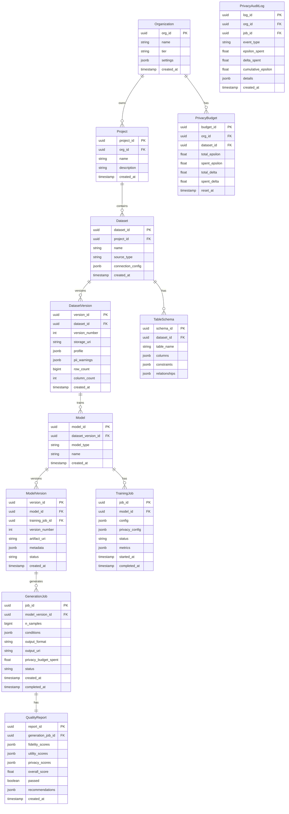

# Low-Level Design

## Data Model

### Entity-Relationship Diagram



### Core Entity Schemas

#### Dataset Version

```yaml
DatasetVersion:
  version_id: uuid (PK)
  dataset_id: uuid (FK -> Dataset)
  version_number: int
  storage_uri: string  # s3://bucket/datasets/{dataset_id}/{version}/
  row_count: bigint
  column_count: int
  profile:
    columns:
      - name: string
        dtype: enum [int, float, string, datetime, boolean]
        semantic_type: enum [numeric, categorical, datetime, text, id, pii_email, pii_phone, pii_ssn, ...]
        cardinality: int
        null_rate: float
        min: any
        max: any
        mean: float (numeric only)
        std: float (numeric only)
        distribution: enum [normal, uniform, bimodal, long_tail, ...]
        sample_values: array
    relationships:
      - source_table: string
        source_column: string
        target_table: string
        target_column: string
        cardinality: enum [one_to_one, one_to_many, many_to_many]
  pii_warnings:
    - column: string
      pii_type: enum [email, phone, ssn, credit_card, name, address, ...]
      confidence: float
      recommendation: string
  created_at: timestamp
  created_by: uuid
```

#### Training Job

```yaml
TrainingJob:
  job_id: uuid (PK)
  model_id: uuid (FK -> Model)
  status: enum [PENDING, PREPROCESSING, TRAINING, POSTPROCESSING, COMPLETED, FAILED, CANCELLED]
  config:
    model_type: enum [CTGAN, TVAE, ACTGAN, DIFFUSION, TIMEGAN, TRANSFORMER]
    epochs: int (default: 300)
    batch_size: int (default: 500)
    embedding_dim: int (default: 128)
    generator_dim: array[int] (default: [256, 256])
    discriminator_dim: array[int] (default: [256, 256])
    generator_lr: float (default: 2e-4)
    discriminator_lr: float (default: 2e-4)
    discriminator_steps: int (default: 1)
    pac: int (default: 10)  # PAC-GAN parameter
  privacy_config:
    enabled: boolean (default: false)
    epsilon: float (default: 1.0)
    delta: float (default: 1e-5)
    max_grad_norm: float (default: 1.0)
    noise_multiplier: float (auto-calculated)
    accounting_mode: enum [RDP, GDP, BASIC] (default: RDP)
  distributed_config:
    num_gpus: int (default: 1)
    strategy: enum [NONE, DDP, FSDP] (default: DDP)
    checkpoint_interval: int (default: 50)
  metrics:
    loss_history: array[float]
    discriminator_loss: float
    generator_loss: float
    privacy_spent:
      epsilon: float
      delta: float
    training_time_seconds: int
  artifact_uri: string
  error_message: string
  started_at: timestamp
  completed_at: timestamp
  created_at: timestamp
```

#### Generation Job

```yaml
GenerationJob:
  job_id: uuid (PK)
  model_version_id: uuid (FK -> ModelVersion)
  status: enum [PENDING, GENERATING, VALIDATING, COMPLETED, FAILED]
  n_samples: bigint
  conditions:  # Optional conditional generation
    - column: string
      operator: enum [=, !=, >, <, >=, <=, IN, BETWEEN]
      value: any
      values: array (for IN)
      min: any (for BETWEEN)
      max: any (for BETWEEN)
  output_config:
    format: enum [PARQUET, CSV, JSON]
    compression: enum [NONE, GZIP, SNAPPY]
    partition_by: array[string]
  seed: int  # For reproducibility
  output_uri: string
  quality_report_id: uuid
  privacy_budget_spent: float
  rows_generated: bigint
  error_message: string
  created_at: timestamp
  completed_at: timestamp
```

#### Quality Report

```yaml
QualityReport:
  report_id: uuid (PK)
  generation_job_id: uuid (FK -> GenerationJob)
  fidelity_scores:
    overall: float  # 0-1, higher is better
    per_column:
      - column: string
        ks_statistic: float
        ks_pvalue: float
        kl_divergence: float
        wasserstein_distance: float
        jensen_shannon: float
    correlation:
      matrix_diff_frobenius: float
      top_correlations_preserved: float
    pairwise:
      mutual_information_ratio: float
  utility_scores:
    overall: float
    tstr:  # Train Synthetic, Test Real
      model: string  # e.g., "LogisticRegression"
      metric: string  # e.g., "accuracy"
      real_score: float
      synthetic_score: float
      ratio: float
    trts:  # Train Real, Test Synthetic
      ratio: float
    feature_importance:
      correlation: float
      top_k_overlap: float
  privacy_scores:
    overall: float
    membership_inference:
      attack_model: string
      success_rate: float  # Lower is better, target < 0.05
      baseline_rate: float  # Random guess
    attribute_inference:
      sensitive_columns: array[string]
      inference_accuracy: float
    dcr:  # Distance to Closest Record
      mean_distance: float
      min_distance: float
      percentile_5: float
    exact_matches: int  # Should be 0
    linkability_risk: float
  overall_score: float  # Weighted combination
  passed: boolean
  gate_results:
    - gate: string
      threshold: float
      value: float
      passed: boolean
  recommendations: array[string]
  computed_at: timestamp
```

---

## API Design

### RESTful API Endpoints

#### Datasets API

```yaml
# List datasets
GET /v1/datasets
  Query:
    project_id: uuid (optional)
    page: int (default: 1)
    limit: int (default: 20)
  Response:
    datasets: array[DatasetSummary]
    pagination: { page, limit, total }

# Create dataset (upload or connect)
POST /v1/datasets
  Request:
    project_id: uuid
    name: string
    source_type: enum [upload, postgresql, mysql, snowflake, s3, ...]
    # For upload:
    file: multipart (CSV, Parquet, JSON)
    # For database connection:
    connection:
      host: string
      port: int
      database: string
      username: string
      password: string (encrypted)
      tables: array[string]
    # Options:
    sample_rows: int (for profiling, default: 100000)
  Response:
    dataset_id: uuid
    version_id: uuid
    profile: DatasetProfile
    pii_warnings: array[PIIWarning]
    status: string

# Get dataset details
GET /v1/datasets/{dataset_id}
  Response:
    dataset: Dataset
    versions: array[DatasetVersionSummary]
    latest_models: array[ModelSummary]

# Get dataset version profile
GET /v1/datasets/{dataset_id}/versions/{version_id}
  Response:
    version: DatasetVersion
    profile: DatasetProfile
    pii_warnings: array[PIIWarning]
```

#### Models API

```yaml
# Train a new model
POST /v1/models
  Request:
    dataset_version_id: uuid
    name: string (optional)
    model_type: enum [CTGAN, TVAE, ACTGAN, DIFFUSION, TIMEGAN, TRANSFORMER]
    config:
      epochs: int
      batch_size: int
      # ... model-specific config
    privacy_config:  # Optional
      enabled: boolean
      epsilon: float
      delta: float
  Response:
    model_id: uuid
    training_job_id: uuid
    status: string
    estimated_duration: string

# Get model details
GET /v1/models/{model_id}
  Response:
    model: Model
    versions: array[ModelVersionSummary]
    training_jobs: array[TrainingJobSummary]

# Get training job status
GET /v1/models/{model_id}/training-jobs/{job_id}
  Response:
    job: TrainingJob
    metrics: TrainingMetrics
    logs_url: string

# List available model types
GET /v1/models/types
  Response:
    types:
      - name: "CTGAN"
        description: "Conditional Tabular GAN for mixed-type tabular data"
        supports_dp: true
        supports_conditional: true
        recommended_for: ["tabular", "mixed_types"]
        config_schema: JSONSchema
```

#### Generations API

```yaml
# Generate synthetic data
POST /v1/generations
  Request:
    model_version_id: uuid
    n_samples: bigint
    conditions: array[Condition]  # Optional
    output_format: enum [PARQUET, CSV, JSON]
    seed: int  # Optional, for reproducibility
    run_quality_check: boolean (default: true)
  Response:
    job_id: uuid
    status: string
    estimated_duration: string

# Get generation job status
GET /v1/generations/{job_id}
  Response:
    job: GenerationJob
    download_url: string (if completed)
    quality_report_id: uuid

# Stream synthetic data (real-time API)
POST /v1/generations/stream
  Request:
    model_version_id: uuid
    n_samples: int (max: 1000)
    conditions: array[Condition]
  Response:
    data: array[Record]
    privacy_budget_spent: float

# Get quality report
GET /v1/generations/{job_id}/quality-report
  Response:
    report: QualityReport
```

#### Privacy API

```yaml
# Get privacy budget
GET /v1/privacy/budgets
  Query:
    dataset_id: uuid (optional)
  Response:
    budgets:
      - dataset_id: uuid
        total_epsilon: float
        spent_epsilon: float
        remaining_epsilon: float
        total_delta: float
        spent_delta: float

# Get privacy audit log
GET /v1/privacy/audit-log
  Query:
    dataset_id: uuid (optional)
    start_date: datetime
    end_date: datetime
  Response:
    logs: array[PrivacyAuditLog]
    summary:
      total_epsilon_spent: float
      total_generations: int
```

#### Quality API

```yaml
# Run quality check on existing data
POST /v1/quality/check
  Request:
    real_data_uri: string
    synthetic_data_uri: string
    config:
      fidelity_checks: array[string]
      utility_checks: array[string]
      privacy_checks: array[string]
  Response:
    report_id: uuid
    status: string

# Get quality report
GET /v1/quality/reports/{report_id}
  Response:
    report: QualityReport

# Compare multiple synthetic datasets
POST /v1/quality/compare
  Request:
    real_data_uri: string
    synthetic_data_uris: array[string]
    labels: array[string]
  Response:
    comparison: QualityComparison
```

---

## Core Algorithms

### 1. CTGAN Training Algorithm

```
ALGORITHM CTGAN_Train(data, config, privacy_config)
    INPUT:
        data: preprocessed tabular data (encoded)
        config: { epochs, batch_size, embedding_dim, gen_dim, disc_dim, lr }
        privacy_config: { enabled, epsilon, delta, max_grad_norm }
    OUTPUT:
        trained_generator: Generator model

    // Initialize models
    generator = Generator(
        input_dim: config.embedding_dim + cond_dim,
        output_dim: data.encoded_dim,
        hidden_dims: config.gen_dim
    )
    discriminator = Discriminator(
        input_dim: data.encoded_dim + cond_dim,
        hidden_dims: config.disc_dim
    )

    // Initialize optimizers
    gen_optimizer = Adam(generator.parameters(), lr=config.lr)
    disc_optimizer = Adam(discriminator.parameters(), lr=config.lr)

    // Initialize DP if enabled
    IF privacy_config.enabled THEN
        privacy_engine = PrivacyEngine(
            module: discriminator,
            optimizer: disc_optimizer,
            sample_rate: config.batch_size / data.size,
            target_epsilon: privacy_config.epsilon,
            target_delta: privacy_config.delta,
            max_grad_norm: privacy_config.max_grad_norm
        )

    // Build conditional sampler (for handling imbalanced categorical columns)
    cond_sampler = ConditionalSampler(data)

    FOR epoch IN 1 TO config.epochs DO
        FOR batch IN DataLoader(data, batch_size=config.batch_size) DO

            // === Train Discriminator ===
            FOR step IN 1 TO config.discriminator_steps DO
                // Sample real data with conditions
                real_batch, conditions = cond_sampler.sample(batch)

                // Generate fake data
                noise = sample_normal(batch_size, config.embedding_dim)
                fake_batch = generator(concat(noise, conditions))

                // Discriminator loss (Wasserstein with gradient penalty)
                real_validity = discriminator(concat(real_batch, conditions))
                fake_validity = discriminator(concat(fake_batch.detach(), conditions))

                gradient_penalty = compute_gradient_penalty(
                    discriminator, real_batch, fake_batch, conditions
                )

                disc_loss = -mean(real_validity) + mean(fake_validity) + 10 * gradient_penalty

                disc_optimizer.zero_grad()

                IF privacy_config.enabled THEN
                    // DP-SGD: gradients are automatically clipped and noised
                    disc_loss.backward()
                    disc_optimizer.step()
                ELSE
                    disc_loss.backward()
                    disc_optimizer.step()
            END FOR

            // === Train Generator ===
            noise = sample_normal(batch_size, config.embedding_dim)
            conditions = cond_sampler.sample_conditions(batch_size)
            fake_batch = generator(concat(noise, conditions))

            fake_validity = discriminator(concat(fake_batch, conditions))
            gen_loss = -mean(fake_validity)

            gen_optimizer.zero_grad()
            gen_loss.backward()
            gen_optimizer.step()

        END FOR  // batch loop

        // Checkpoint
        IF epoch MOD checkpoint_interval == 0 THEN
            save_checkpoint(generator, discriminator, epoch)

        // Log metrics
        log_metrics(epoch, gen_loss, disc_loss, privacy_engine.get_epsilon())

    END FOR  // epoch loop

    RETURN generator
END ALGORITHM
```

### 2. Mode-Specific Normalization (CTGAN Preprocessing)

```
ALGORITHM ModeSpecificNormalization(column, n_modes=10)
    INPUT:
        column: continuous values
        n_modes: number of Gaussian components
    OUTPUT:
        encoded: normalized values with mode indicators
        transformer: fitted transformer for inverse

    // Fit Gaussian Mixture Model
    gmm = GaussianMixture(n_components=n_modes)
    gmm.fit(column)

    // For each value, determine mode and normalize within that mode
    encoded_values = []
    mode_indicators = []

    FOR value IN column DO
        // Find most likely mode
        mode_probs = gmm.predict_proba(value)
        selected_mode = argmax(mode_probs)

        // Normalize within mode
        mode_mean = gmm.means[selected_mode]
        mode_std = sqrt(gmm.covariances[selected_mode])
        normalized = (value - mode_mean) / (4 * mode_std)  // Clip to [-1, 1]
        normalized = clip(normalized, -0.99, 0.99)

        // One-hot encode mode
        mode_onehot = one_hot(selected_mode, n_modes)

        encoded_values.append(normalized)
        mode_indicators.append(mode_onehot)
    END FOR

    // Concatenate: [normalized_value, mode_one_hot]
    encoded = concat(encoded_values, mode_indicators, axis=1)

    transformer = { gmm: gmm, n_modes: n_modes }
    RETURN encoded, transformer
END ALGORITHM

ALGORITHM InverseModeSpecificNormalization(encoded, transformer)
    INPUT:
        encoded: [normalized_value, mode_one_hot]
        transformer: { gmm, n_modes }
    OUTPUT:
        original_values: reconstructed continuous values

    original_values = []

    FOR row IN encoded DO
        normalized_value = row[0]
        mode_onehot = row[1:n_modes+1]
        selected_mode = argmax(mode_onehot)

        mode_mean = transformer.gmm.means[selected_mode]
        mode_std = sqrt(transformer.gmm.covariances[selected_mode])

        original = normalized_value * (4 * mode_std) + mode_mean
        original_values.append(original)
    END FOR

    RETURN original_values
END ALGORITHM
```

### 3. Differential Privacy SGD (DP-SGD)

```
ALGORITHM DP_SGD_Step(model, batch, optimizer, privacy_config)
    INPUT:
        model: neural network
        batch: training batch
        optimizer: SGD/Adam optimizer
        privacy_config: { max_grad_norm, noise_multiplier }
    OUTPUT:
        updated model with DP guarantee

    // 1. Compute per-sample gradients
    per_sample_gradients = []
    FOR sample IN batch DO
        loss = compute_loss(model, sample)
        grad = compute_gradient(loss, model.parameters())
        per_sample_gradients.append(grad)
    END FOR

    // 2. Clip gradients (bound sensitivity)
    clipped_gradients = []
    FOR grad IN per_sample_gradients DO
        grad_norm = L2_norm(grad)
        clip_factor = min(1.0, privacy_config.max_grad_norm / grad_norm)
        clipped = grad * clip_factor
        clipped_gradients.append(clipped)
    END FOR

    // 3. Aggregate clipped gradients
    aggregated_grad = mean(clipped_gradients)

    // 4. Add calibrated Gaussian noise
    noise_scale = privacy_config.noise_multiplier * privacy_config.max_grad_norm / batch_size
    noise = sample_normal(shape=aggregated_grad.shape, std=noise_scale)
    noisy_grad = aggregated_grad + noise

    // 5. Update model
    optimizer.zero_grad()
    set_gradients(model, noisy_grad)
    optimizer.step()

    RETURN model
END ALGORITHM

ALGORITHM PrivacyAccountant_RDP(noise_multiplier, sample_rate, num_steps)
    INPUT:
        noise_multiplier: σ (noise scale)
        sample_rate: q (batch_size / dataset_size)
        num_steps: T (number of training iterations)
    OUTPUT:
        epsilon: privacy budget spent
        delta: privacy parameter

    // Compute RDP for a single step
    FUNCTION rdp_single_step(alpha):
        // Subsampled Gaussian mechanism RDP
        RETURN alpha * sample_rate^2 / (2 * noise_multiplier^2)
    END FUNCTION

    // Compose over T steps
    alpha_range = [1.5, 2, 3, 4, 5, 6, 8, 16, 32, 64]
    rdp_values = []

    FOR alpha IN alpha_range DO
        rdp = num_steps * rdp_single_step(alpha)
        rdp_values.append((alpha, rdp))
    END FOR

    // Convert RDP to (ε, δ)-DP
    target_delta = 1e-5
    epsilon = infinity

    FOR (alpha, rdp) IN rdp_values DO
        eps = rdp + log(1/target_delta) / (alpha - 1)
        epsilon = min(epsilon, eps)
    END FOR

    RETURN epsilon, target_delta
END ALGORITHM
```

### 4. Model Selection Router

```
ALGORITHM SelectModel(data_profile, requirements)
    INPUT:
        data_profile: {
            n_rows, n_columns,
            categorical_columns, numerical_columns, datetime_columns, text_columns,
            has_sequences, has_relationships,
            high_cardinality_count, missing_rate
        }
        requirements: {
            priority: enum [SPEED, QUALITY, PRIVACY],
            privacy_level: enum [NONE, LOW, MEDIUM, HIGH],
            max_training_time: hours,
            fidelity_target: float
        }
    OUTPUT:
        recommended_model: string
        config_suggestions: dict

    // Decision tree for model selection
    candidates = []

    // Check for time-series data
    IF data_profile.has_sequences THEN
        candidates.append(("TimeGAN", 0.8))
        candidates.append(("DGAN", 0.7))

    // Check for text-heavy data
    ELSE IF len(data_profile.text_columns) > len(data_profile.numerical_columns) THEN
        candidates.append(("TRANSFORMER", 0.9))
        candidates.append(("LLM_BASED", 0.8))

    // Check for relational multi-table
    ELSE IF data_profile.has_relationships THEN
        candidates.append(("TRANSFORMER", 0.85))  // TabularARGN handles complex
        candidates.append(("CTGAN", 0.7))  // With hierarchical generation

    // Standard tabular data
    ELSE
        // Privacy-first selection
        IF requirements.privacy_level == HIGH THEN
            candidates.append(("TVAE", 0.9))  // Easiest DP integration
            candidates.append(("DIFFUSION", 0.8))  // Good with DP

        // Quality-first selection
        ELSE IF requirements.priority == QUALITY THEN
            candidates.append(("DIFFUSION", 0.95))
            candidates.append(("TRANSFORMER", 0.85))
            candidates.append(("CTGAN", 0.75))

        // Speed-first selection
        ELSE IF requirements.priority == SPEED THEN
            candidates.append(("CTGAN", 0.9))
            candidates.append(("TVAE", 0.85))

        // Balanced default
        ELSE
            candidates.append(("CTGAN", 0.85))
            candidates.append(("TVAE", 0.8))
            candidates.append(("ACTGAN", 0.75))
    END IF

    // Adjust scores based on data characteristics
    FOR (model, score) IN candidates DO
        // Penalize CTGAN for very high cardinality
        IF model == "CTGAN" AND data_profile.high_cardinality_count > 10 THEN
            score = score * 0.9

        // Boost TVAE for high missing rates (handles uncertainty better)
        IF model == "TVAE" AND data_profile.missing_rate > 0.1 THEN
            score = score * 1.1

        // Penalize slow models if time-constrained
        estimated_time = estimate_training_time(model, data_profile)
        IF estimated_time > requirements.max_training_time THEN
            score = score * 0.5
    END FOR

    // Select best model
    recommended = max(candidates, key=lambda x: x[1])

    // Generate config suggestions
    config = generate_default_config(recommended.model, data_profile)

    RETURN recommended.model, config
END ALGORITHM
```

### 5. Multi-Table Generation

```
ALGORITHM GenerateMultiTable(models, schema_graph, n_samples_root)
    INPUT:
        models: dict of table_name -> trained_generator
        schema_graph: {
            tables: [table_name, ...],
            relationships: [
                { parent: table, child: table, fk_column: column, pk_column: column }
            ]
        }
        n_samples_root: number of root table records
    OUTPUT:
        generated_tables: dict of table_name -> DataFrame

    // Step 1: Build dependency graph and topological sort
    dependency_graph = build_dependency_graph(schema_graph.relationships)
    generation_order = topological_sort(dependency_graph)
    // Result: parents before children, e.g., [customers, orders, order_items]

    generated_tables = {}

    // Step 2: Generate tables in order
    FOR table IN generation_order DO

        IF is_root_table(table, dependency_graph) THEN
            // Root table: generate unconditionally
            synthetic = models[table].generate(n_samples_root)
            generated_tables[table] = synthetic

        ELSE
            // Child table: generate conditioned on parent FKs
            parent_relations = get_parent_relations(table, schema_graph)

            // Determine how many child records per parent
            // Based on learned cardinality distribution
            cardinality_dist = learn_cardinality_distribution(
                original_data[table],
                parent_relations
            )

            synthetic_rows = []

            FOR parent_rel IN parent_relations DO
                parent_table = parent_rel.parent
                parent_data = generated_tables[parent_table]

                FOR parent_row IN parent_data DO
                    parent_pk = parent_row[parent_rel.pk_column]

                    // Sample number of children for this parent
                    n_children = sample_from_distribution(cardinality_dist)

                    // Generate children conditioned on parent
                    children = models[table].generate_conditional(
                        n_samples: n_children,
                        conditions: {parent_rel.fk_column: parent_pk}
                    )

                    synthetic_rows.extend(children)
                END FOR
            END FOR

            generated_tables[table] = DataFrame(synthetic_rows)
        END IF

    END FOR

    // Step 3: Validate referential integrity
    FOR rel IN schema_graph.relationships DO
        child_fks = set(generated_tables[rel.child][rel.fk_column])
        parent_pks = set(generated_tables[rel.parent][rel.pk_column])

        IF NOT child_fks.is_subset(parent_pks) THEN
            RAISE IntegrityError("FK constraint violated: " + rel)
        END IF
    END FOR

    RETURN generated_tables
END ALGORITHM
```

### 6. Quality Assessment

```
ALGORITHM ComputeQualityReport(real_data, synthetic_data, config)
    INPUT:
        real_data: original dataset (or sample)
        synthetic_data: generated dataset
        config: { fidelity_checks, utility_checks, privacy_checks }
    OUTPUT:
        report: QualityReport

    report = QualityReport()

    // === FIDELITY METRICS ===
    report.fidelity_scores = {}

    FOR column IN real_data.columns DO
        IF column.dtype == NUMERIC THEN
            // KS Test for continuous distributions
            ks_stat, ks_pvalue = ks_test(real_data[column], synthetic_data[column])
            kl_div = kl_divergence(
                histogram(real_data[column]),
                histogram(synthetic_data[column])
            )
            wasserstein = wasserstein_distance(real_data[column], synthetic_data[column])

        ELSE  // Categorical
            // Jensen-Shannon for discrete distributions
            js_div = jensen_shannon(
                value_counts(real_data[column]),
                value_counts(synthetic_data[column])
            )
            kl_div = kl_divergence(...)
        END IF

        report.fidelity_scores.per_column.append({
            column: column,
            ks_statistic: ks_stat,
            kl_divergence: kl_div,
            jensen_shannon: js_div
        })
    END FOR

    // Correlation matrix comparison
    real_corr = real_data.corr()
    synth_corr = synthetic_data.corr()
    corr_diff = frobenius_norm(real_corr - synth_corr)
    report.fidelity_scores.correlation.matrix_diff = corr_diff

    report.fidelity_scores.overall = compute_fidelity_score(report.fidelity_scores)

    // === UTILITY METRICS ===
    report.utility_scores = {}

    // TSTR: Train on Synthetic, Test on Real
    FOR model IN [LogisticRegression, RandomForest, XGBoost] DO
        // Split real data
        real_train, real_test = train_test_split(real_data, test_size=0.2)

        // Train on real
        model_real = model.fit(real_train.X, real_train.y)
        score_real = model_real.score(real_test.X, real_test.y)

        // Train on synthetic
        model_synth = model.fit(synthetic_data.X, synthetic_data.y)
        score_synth = model_synth.score(real_test.X, real_test.y)

        tstr_ratio = score_synth / score_real

        report.utility_scores.tstr.append({
            model: model.name,
            real_score: score_real,
            synthetic_score: score_synth,
            ratio: tstr_ratio
        })
    END FOR

    report.utility_scores.overall = mean([x.ratio FOR x IN report.utility_scores.tstr])

    // === PRIVACY METRICS ===
    report.privacy_scores = {}

    // Membership Inference Attack (MIA)
    mia_model = train_mia_classifier(real_data, synthetic_data)
    mia_success_rate = evaluate_mia(mia_model, real_data, synthetic_data)
    report.privacy_scores.mia_success_rate = mia_success_rate

    // Distance to Closest Record (DCR)
    dcr_values = []
    FOR synth_row IN synthetic_data DO
        min_dist = infinity
        FOR real_row IN real_data DO
            dist = euclidean_distance(synth_row, real_row)
            min_dist = min(min_dist, dist)
        END FOR
        dcr_values.append(min_dist)
    END FOR
    report.privacy_scores.dcr_mean = mean(dcr_values)
    report.privacy_scores.dcr_min = min(dcr_values)
    report.privacy_scores.dcr_p5 = percentile(dcr_values, 5)

    // Exact matches
    report.privacy_scores.exact_matches = count_exact_matches(real_data, synthetic_data)

    report.privacy_scores.overall = compute_privacy_score(report.privacy_scores)

    // === OVERALL SCORE ===
    weights = config.get('weights', { fidelity: 0.4, utility: 0.4, privacy: 0.2 })
    report.overall_score = (
        weights.fidelity * report.fidelity_scores.overall +
        weights.utility * report.utility_scores.overall +
        weights.privacy * report.privacy_scores.overall
    )

    // === QUALITY GATES ===
    report.gate_results = []
    gates = [
        { name: "fidelity_ks", metric: max_ks_stat, threshold: 0.15, comparison: "<" },
        { name: "utility_tstr", metric: mean_tstr, threshold: 0.8, comparison: ">" },
        { name: "privacy_mia", metric: mia_success_rate, threshold: 0.1, comparison: "<" },
        { name: "privacy_exact", metric: exact_matches, threshold: 0, comparison: "=" }
    ]

    FOR gate IN gates DO
        passed = evaluate_gate(gate)
        report.gate_results.append({ gate: gate.name, passed: passed })
    END FOR

    report.passed = all(g.passed FOR g IN report.gate_results)

    RETURN report
END ALGORITHM
```

---

## Database Indexes and Partitioning

### PostgreSQL Indexes

```sql
-- Dataset lookups by organization and project
CREATE INDEX idx_datasets_org_project ON datasets(org_id, project_id);

-- Version lookups
CREATE INDEX idx_dataset_versions_dataset ON dataset_versions(dataset_id, version_number DESC);

-- Model lookups
CREATE INDEX idx_models_dataset_version ON models(dataset_version_id);
CREATE INDEX idx_model_versions_model ON model_versions(model_id, version_number DESC);

-- Job status queries (frequently queried for running jobs)
CREATE INDEX idx_training_jobs_status ON training_jobs(status) WHERE status IN ('PENDING', 'TRAINING');
CREATE INDEX idx_generation_jobs_status ON generation_jobs(status) WHERE status IN ('PENDING', 'GENERATING');

-- Privacy audit logs (time-range queries)
CREATE INDEX idx_privacy_audit_org_time ON privacy_audit_logs(org_id, created_at DESC);

-- Quality reports by generation job
CREATE INDEX idx_quality_reports_gen ON quality_reports(generation_job_id);
```

### Table Partitioning

```sql
-- Partition privacy audit logs by month (high volume, time-series queries)
CREATE TABLE privacy_audit_logs (
    log_id UUID PRIMARY KEY,
    org_id UUID NOT NULL,
    created_at TIMESTAMP NOT NULL,
    ...
) PARTITION BY RANGE (created_at);

-- Create monthly partitions
CREATE TABLE privacy_audit_logs_2025_01 PARTITION OF privacy_audit_logs
    FOR VALUES FROM ('2025-01-01') TO ('2025-02-01');
CREATE TABLE privacy_audit_logs_2025_02 PARTITION OF privacy_audit_logs
    FOR VALUES FROM ('2025-02-01') TO ('2025-03-01');
-- ... continue for each month

-- Partition generation jobs by org_id (multi-tenant isolation)
CREATE TABLE generation_jobs (
    job_id UUID,
    org_id UUID NOT NULL,
    ...
    PRIMARY KEY (org_id, job_id)
) PARTITION BY HASH (org_id);

-- Create hash partitions
CREATE TABLE generation_jobs_p0 PARTITION OF generation_jobs
    FOR VALUES WITH (MODULUS 8, REMAINDER 0);
-- ... create 8 partitions for distribution
```

---

## Error Handling

### Error Codes

| Code | Category | Description | User Message |
|------|----------|-------------|--------------|
| `E001` | Validation | Invalid dataset format | "Dataset must be CSV, Parquet, or JSON format" |
| `E002` | Validation | Dataset too small | "Dataset must have at least 1000 rows for training" |
| `E003` | Validation | Column type mismatch | "Column {col} has inconsistent types" |
| `E010` | Training | Model convergence failure | "Training did not converge. Try adjusting epochs or learning rate" |
| `E011` | Training | Out of memory | "Dataset too large for available GPU memory. Try reducing batch size" |
| `E012` | Training | Privacy budget exceeded | "Requested epsilon exceeds remaining budget ({remaining})" |
| `E020` | Generation | Model not found | "Model version {id} not found or not ready" |
| `E021` | Generation | Condition invalid | "Condition on column {col} is invalid: {reason}" |
| `E022` | Generation | Quality check failed | "Generated data failed quality gates: {details}" |
| `E030` | Privacy | Budget exhausted | "Privacy budget exhausted for dataset {id}. Reset budget or use different dataset" |
| `E040` | System | GPU unavailable | "No GPU resources available. Job queued." |
| `E041` | System | Storage full | "Storage quota exceeded. Delete unused datasets or upgrade plan" |

### Retry Strategy

| Operation | Max Retries | Backoff | Conditions |
|-----------|-------------|---------|------------|
| Training job | 3 | Exponential (1m, 5m, 15m) | GPU preemption, transient errors |
| Generation job | 2 | Fixed (30s) | Transient storage errors |
| Quality check | 2 | Fixed (1m) | Timeout, resource contention |
| API calls | 3 | Exponential (1s, 2s, 4s) | 5xx errors, timeouts |
