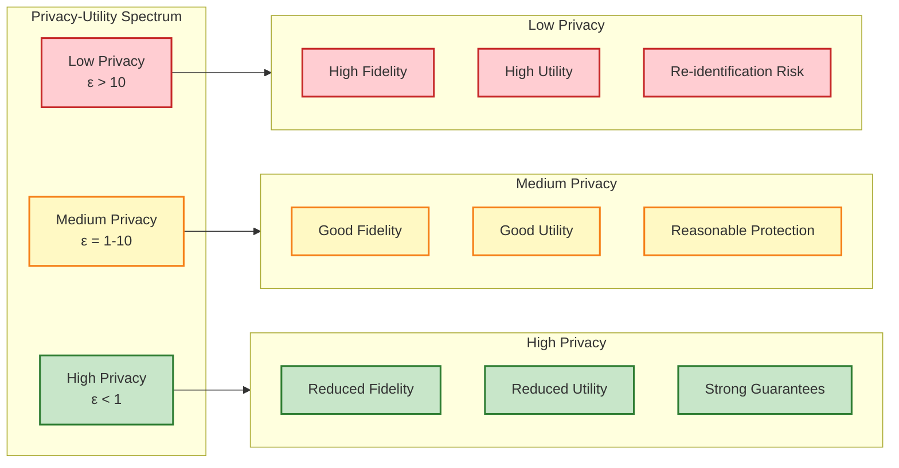
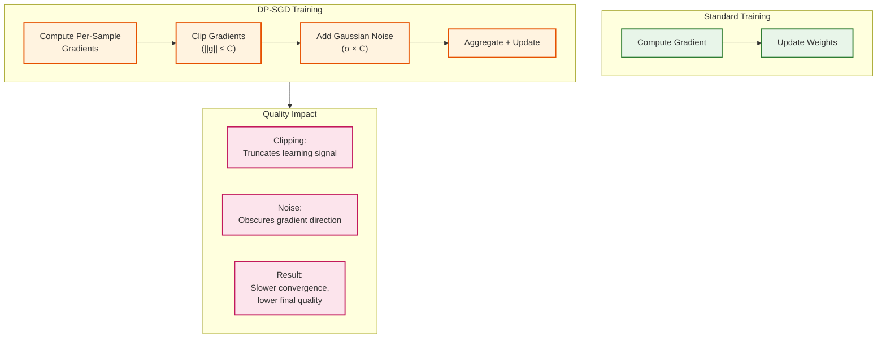
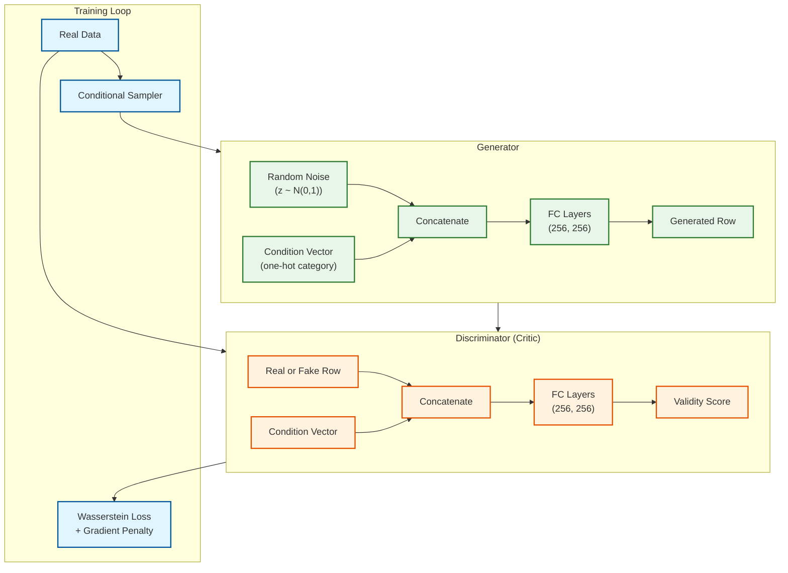
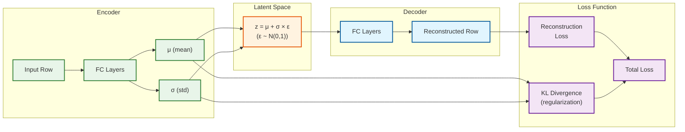
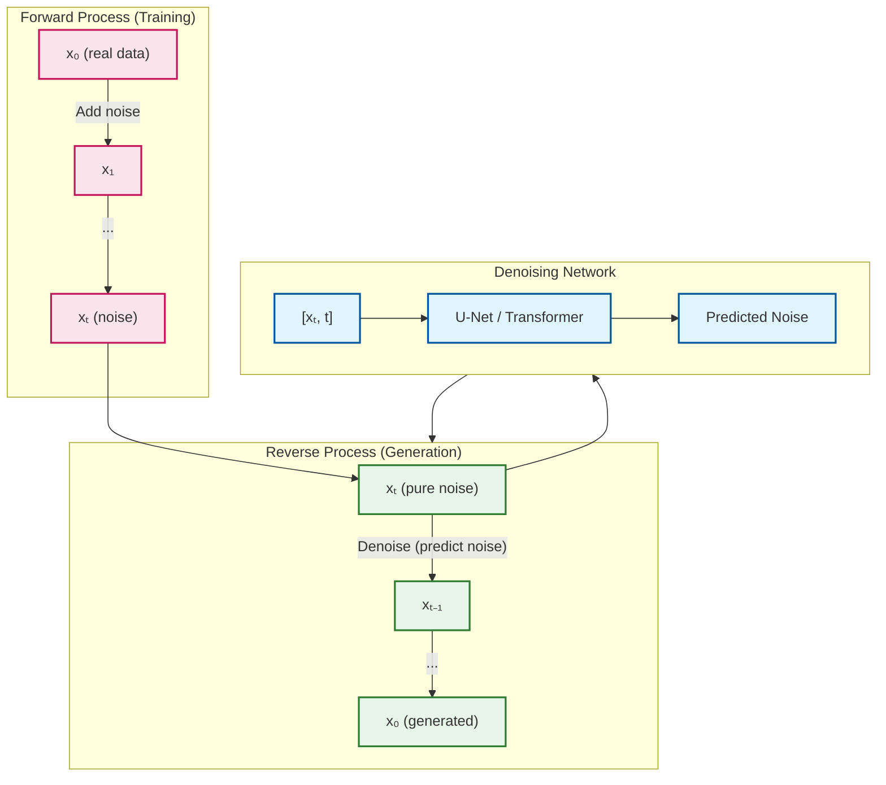
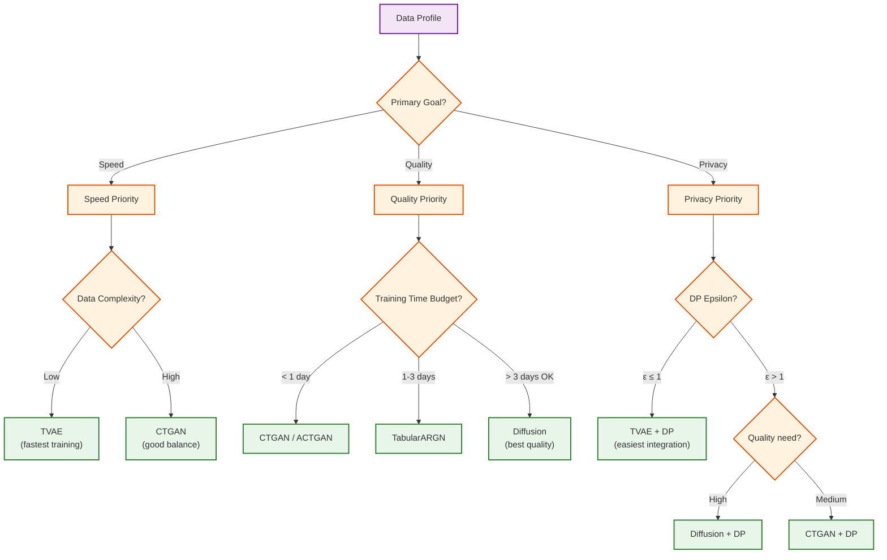
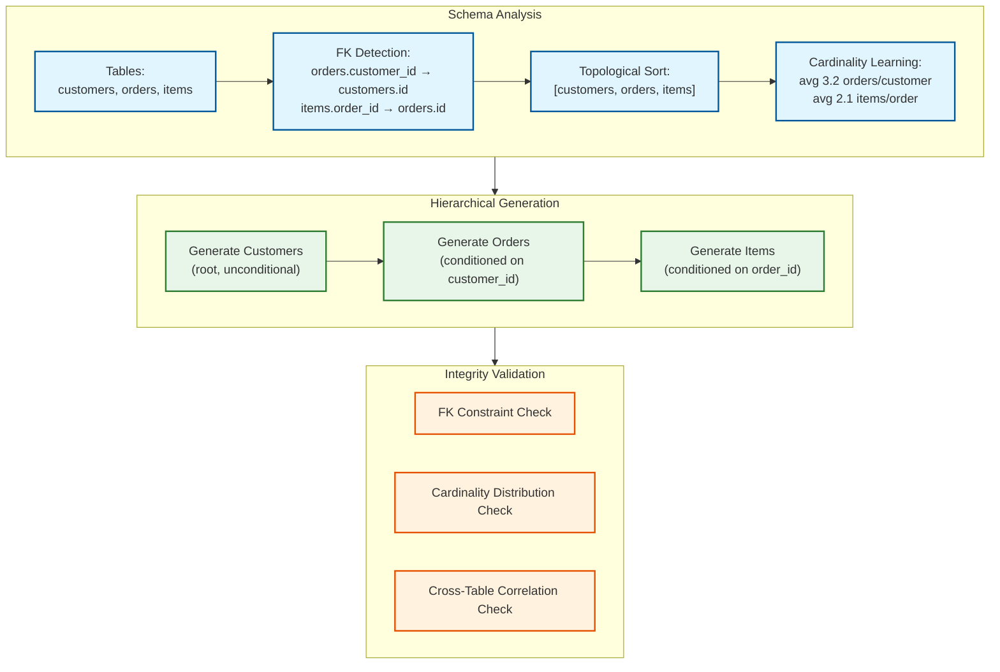
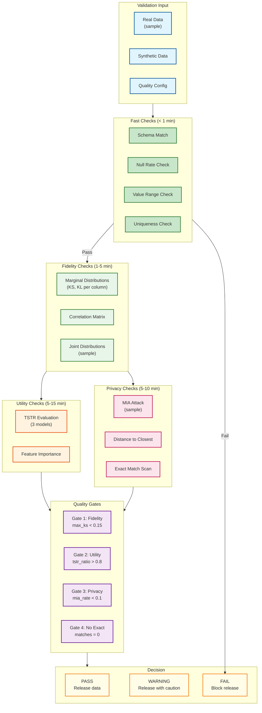

# Deep Dive and Bottlenecks

## Critical Component 1: Privacy-Utility Trade-off

### The Core Challenge

The fundamental challenge in synthetic data generation is the **privacy-utility trade-off**: stronger privacy guarantees mathematically require reducing the fidelity of generated data. This is not a limitation of implementation—it's a theorem-level constraint.



### Understanding Epsilon (ε)

Epsilon (ε) is the privacy budget parameter in Differential Privacy. Mathematically:

> For any two datasets D and D' differing in one record, and any output S:
> P(Algorithm(D) = S) ≤ e^ε × P(Algorithm(D') = S)

**Practical Interpretation:**

| Epsilon (ε) | Interpretation | Use Case |
|-------------|----------------|----------|
| ε ≤ 0.1 | Very strong privacy; attacker learns almost nothing | Highly sensitive medical/financial data |
| ε = 1 | Strong privacy; gold standard | General PII protection |
| ε = 1-10 | Moderate privacy; reasonable protection | Internal analytics, testing |
| ε > 10 | Weak privacy; similar to no DP | Low-sensitivity data augmentation |

### How DP-SGD Affects Quality



### Optimization Strategies

#### Strategy 1: Noise Multiplier Tuning

The noise multiplier (σ) directly controls the privacy-utility trade-off:

```
ALGORITHM TuneNoiseMultiplier(target_epsilon, target_delta, dataset_size, epochs, batch_size)
    // Binary search for optimal noise multiplier
    sigma_low = 0.1
    sigma_high = 100.0

    WHILE sigma_high - sigma_low > 0.01 DO
        sigma_mid = (sigma_low + sigma_high) / 2
        epsilon = compute_epsilon(
            sigma: sigma_mid,
            sample_rate: batch_size / dataset_size,
            steps: epochs * (dataset_size / batch_size),
            delta: target_delta
        )

        IF epsilon > target_epsilon THEN
            sigma_low = sigma_mid  // Need more noise
        ELSE
            sigma_high = sigma_mid  // Can use less noise
        END IF
    END WHILE

    RETURN sigma_high  // Err on side of more privacy
END ALGORITHM
```

#### Strategy 2: Adaptive Clipping

Instead of fixed gradient clipping norm, adapt based on gradient distribution:

```
ALGORITHM AdaptiveClipping(gradients, target_quantile=0.5)
    // Clip at median gradient norm (or other quantile)
    norms = [L2_norm(g) FOR g IN gradients]
    adaptive_clip = percentile(norms, target_quantile * 100)

    clipped = []
    FOR g IN gradients DO
        clip_factor = min(1.0, adaptive_clip / L2_norm(g))
        clipped.append(g * clip_factor)
    END FOR

    RETURN clipped, adaptive_clip
END ALGORITHM
```

#### Strategy 3: Privacy Budget Allocation

For multiple generation requests, allocate budget wisely:

| Allocation Strategy | Description | Best For |
|---------------------|-------------|----------|
| **Equal Split** | Divide ε equally across N generations | Unknown future needs |
| **Decaying** | More budget early, less later | Exploratory then production |
| **Task-Based** | Allocate based on task importance | Known generation plan |
| **Adaptive** | Reserve pool, allocate on-demand | Dynamic workloads |

### Trade-off Quantification

Based on research benchmarks (2025 studies):

| ε | TSTR Score (% of non-DP) | MIA Success Rate | Recommendation |
|---|--------------------------|------------------|----------------|
| ∞ (no DP) | 100% | 15-25% | Only for non-sensitive data |
| 10 | 95-98% | 8-12% | Internal analytics |
| 3 | 90-95% | 5-8% | Balanced default |
| 1 | 80-90% | 3-5% | Recommended for PII |
| 0.1 | 60-75% | <2% | Highly sensitive only |

---

## Critical Component 2: Generative Model Selection and Training

### The Challenge

Different generative models have fundamentally different trade-offs. Choosing wrong can mean:
- Training for days when hours would suffice
- Poor fidelity despite long training
- Mode collapse (GAN-specific)
- Privacy integration difficulties

### Model Architecture Deep Dive

#### CTGAN: Conditional Tabular GAN



**Key CTGAN Innovations:**

1. **Mode-Specific Normalization**: Handles multi-modal continuous distributions via GMM encoding
2. **Conditional Generator**: Samples conditions to handle imbalanced categories
3. **Training-by-Sampling**: Ensures all categories get trained, not just frequent ones
4. **PAC-GAN**: Groups samples to reduce discriminator overfitting

**CTGAN Failure Modes:**

| Failure | Symptom | Mitigation |
|---------|---------|------------|
| Mode collapse | Same values repeated | Increase discriminator steps, reduce LR |
| Vanishing gradients | Loss plateaus early | Use Wasserstein loss, gradient penalty |
| Category imbalance | Rare categories never generated | Training-by-sampling, oversample |
| High cardinality | Poor embedding quality | Use larger embedding dim, more epochs |

#### TVAE: Tabular Variational Autoencoder



**TVAE Advantages:**
- More stable training (no adversarial dynamics)
- Natural uncertainty quantification
- Easier DP integration (single forward pass)
- Smooth latent space for interpolation

**TVAE Limitations:**
- Often lower fidelity than GANs for complex distributions
- Blurrier outputs (posterior collapse)
- Mode averaging instead of capturing

#### Diffusion Models (TabDDPM)



**Diffusion Model Advantages:**
- Highest fidelity (matches/exceeds real data distributions)
- Stable training (no mode collapse)
- Good diversity and coverage
- Natural handling of mixed types

**Diffusion Model Limitations:**
- Very slow generation (1000 steps typically)
- High memory requirements
- Longer training times
- Complex DP integration

### Model Selection Decision Tree



### Training Stability Patterns

```
ALGORITHM StableTraining(model_type, data, config)
    // Common stability patterns across model types

    // 1. Learning rate warmup
    lr_schedule = WarmupSchedule(
        warmup_steps: config.epochs * 0.1,
        peak_lr: config.learning_rate,
        decay: "cosine"
    )

    // 2. Gradient clipping (even without DP)
    max_grad_norm = 1.0

    // 3. Early stopping with patience
    best_metric = infinity
    patience_counter = 0
    patience = 50

    FOR epoch IN 1 TO config.epochs DO
        train_one_epoch(model, data, lr_schedule)

        // Validation
        val_metric = compute_validation_metric(model, val_data)

        IF val_metric < best_metric THEN
            best_metric = val_metric
            patience_counter = 0
            save_checkpoint(model, "best")
        ELSE
            patience_counter += 1
            IF patience_counter >= patience THEN
                PRINT("Early stopping at epoch", epoch)
                BREAK
            END IF
        END IF

        // Model-specific stability checks
        IF model_type == "CTGAN" THEN
            // Check for mode collapse
            IF discriminator_accuracy > 0.95 THEN
                WARN("Potential mode collapse detected")
                reduce_discriminator_lr(factor=0.5)
            END IF
        END IF
    END FOR

    RETURN load_checkpoint("best")
END ALGORITHM
```

---

## Critical Component 3: Multi-Table Relational Data

### The Challenge

Generating multi-table data while preserving:
1. **Referential Integrity**: All FK values exist in parent tables
2. **Cardinality Distribution**: 1:N relationships have realistic N distribution
3. **Cross-Table Correlations**: Customer attributes correlate with their order patterns
4. **Temporal Consistency**: Order dates after customer registration dates

### Hierarchical Generation Architecture



### Cardinality Preservation Algorithm

```
ALGORITHM LearnAndSampleCardinality(parent_data, child_data, fk_column)
    INPUT:
        parent_data: parent table records
        child_data: child table records
        fk_column: foreign key column name
    OUTPUT:
        cardinality_sampler: function to sample # of children per parent

    // Count children per parent
    child_counts = {}
    FOR row IN child_data DO
        parent_id = row[fk_column]
        child_counts[parent_id] = child_counts.get(parent_id, 0) + 1
    END FOR

    // Fit distribution to counts
    count_values = list(child_counts.values())

    // Try multiple distributions, select best fit
    distributions = [
        Poisson(mean(count_values)),
        NegativeBinomial(fit(count_values)),
        ZeroInflatedPoisson(fit(count_values)),
        Empirical(count_values)
    ]

    best_dist = select_by_ks_test(distributions, count_values)

    FUNCTION cardinality_sampler():
        RETURN max(0, round(best_dist.sample()))
    END FUNCTION

    RETURN cardinality_sampler
END ALGORITHM

ALGORITHM GenerateChildTable(parent_data, child_model, cardinality_sampler, fk_column)
    synthetic_children = []

    FOR parent_row IN parent_data DO
        parent_id = parent_row["id"]
        n_children = cardinality_sampler()

        IF n_children > 0 THEN
            // Generate children conditioned on parent
            children = child_model.generate(
                n_samples: n_children,
                conditions: {fk_column: parent_id}
            )

            // Optionally: inherit/correlate parent attributes
            FOR child IN children DO
                child = apply_parent_correlations(child, parent_row)
            END FOR

            synthetic_children.extend(children)
        END IF
    END FOR

    RETURN DataFrame(synthetic_children)
END ALGORITHM
```

### Cross-Table Correlation Preservation

```
ALGORITHM PreserveParentChildCorrelations(parent_table, child_table, relationships)
    // Learn conditional distributions P(child_attr | parent_attr)

    correlation_models = {}

    FOR rel IN relationships DO
        parent_cols = rel.parent_columns  // e.g., [income_bracket, region]
        child_cols = rel.child_columns    // e.g., [order_amount, category]

        // Train conditional model
        joined_data = join(parent_table, child_table, on=rel.fk)
        features = joined_data[parent_cols]
        targets = joined_data[child_cols]

        // Use a simple model (decision tree, Bayesian network)
        model = ConditionalModel()
        model.fit(features, targets)

        correlation_models[rel.name] = model
    END FOR

    RETURN correlation_models
END ALGORITHM

ALGORITHM ApplyParentCorrelations(child_row, parent_row, correlation_model)
    // Adjust child attributes based on parent
    parent_features = extract_features(parent_row)
    adjustments = correlation_model.predict(parent_features)

    FOR col, adjustment IN adjustments DO
        child_row[col] = apply_adjustment(child_row[col], adjustment)
    END FOR

    RETURN child_row
END ALGORITHM
```

---

## Critical Component 4: Quality Validation Pipeline

### The Challenge

Automated quality assessment must:
1. Run efficiently (not block generation for hours)
2. Provide actionable feedback
3. Balance false positives (blocking good data) vs false negatives (releasing bad data)
4. Handle different quality requirements per use case

### Quality Gate Architecture



### Tiered Validation Strategy

| Tier | Checks | Time | When Used |
|------|--------|------|-----------|
| **Quick** | Schema, nulls, ranges, exact matches | < 1 min | Every generation |
| **Standard** | + Marginals, correlations, DCR | < 10 min | Default production |
| **Full** | + TSTR, MIA attack, joint distributions | < 30 min | Sensitive data, releases |
| **Deep** | + Multiple ML models, extensive privacy | < 2 hrs | Compliance audits |

### Sampling Strategies for Efficiency

```
ALGORITHM EfficientQualityCheck(real_data, synth_data, config)
    // Use sampling to reduce computation while maintaining accuracy

    // 1. Determine sample sizes
    n_real = len(real_data)
    n_synth = len(synth_data)

    IF n_real > 100000 THEN
        real_sample_size = 100000
        synth_sample_size = 100000
    ELSE
        real_sample_size = n_real
        synth_sample_size = min(n_synth, n_real * 2)
    END IF

    // 2. Stratified sampling to preserve distributions
    real_sample = stratified_sample(real_data, n=real_sample_size)
    synth_sample = stratified_sample(synth_data, n=synth_sample_size)

    // 3. Run checks with confidence intervals
    results = {}

    // KS Test with bootstrap confidence
    FOR col IN columns DO
        ks_values = []
        FOR i IN 1 TO 100 DO  // Bootstrap
            r_boot = bootstrap_sample(real_sample[col])
            s_boot = bootstrap_sample(synth_sample[col])
            ks_stat, _ = ks_test(r_boot, s_boot)
            ks_values.append(ks_stat)
        END FOR
        results[col] = {
            ks_mean: mean(ks_values),
            ks_ci_95: percentile(ks_values, [2.5, 97.5])
        }
    END FOR

    // 4. Parallel execution for independent checks
    results.fidelity = parallel_execute([
        check_marginals(real_sample, synth_sample),
        check_correlations(real_sample, synth_sample),
    ])

    results.privacy = parallel_execute([
        run_mia_attack(real_sample, synth_sample),
        compute_dcr(real_sample, synth_sample),
        scan_exact_matches(real_data, synth_data)  // Full data for this
    ])

    RETURN results
END ALGORITHM
```

---

## Bottleneck Analysis

### Top 5 Bottlenecks and Mitigations

| Rank | Bottleneck | Symptom | Root Cause | Mitigation |
|------|------------|---------|------------|------------|
| 1 | **GPU training time** | Jobs take days | Large data, complex models | Distributed training, progressive resolution, spot instances |
| 2 | **Memory during training** | OOM errors | High cardinality categoricals | Embedding instead of one-hot, gradient checkpointing |
| 3 | **Generation throughput** | Slow batch generation | Sequential sampling | Parallel sampling, GPU batch generation, model caching |
| 4 | **Quality check latency** | Slow validation | Full TSTR, MIA on large data | Sample-based validation, tiered checks |
| 5 | **Privacy accounting overhead** | Slow DP training | Per-sample gradient computation | Virtual batching, optimized Opacus |

### Mitigation Deep Dives

#### GPU Training Optimization

```
ALGORITHM OptimizedTraining(data, model, config)
    // 1. Progressive resolution training
    // Start with smaller model, gradually increase
    stages = [
        { gen_dim: [128], disc_dim: [128], epochs: 50 },
        { gen_dim: [256], disc_dim: [256], epochs: 100 },
        { gen_dim: [256, 256], disc_dim: [256, 256], epochs: 150 }
    ]

    FOR stage IN stages DO
        model = resize_model(model, stage.gen_dim, stage.disc_dim)
        train(model, data, epochs=stage.epochs)
    END FOR

    // 2. Mixed precision training
    scaler = GradScaler()
    WITH autocast():
        loss = compute_loss(model, batch)
    scaler.scale(loss).backward()
    scaler.step(optimizer)
    scaler.update()

    // 3. Distributed Data Parallel
    IF num_gpus > 1 THEN
        model = DistributedDataParallel(model)
        data_sampler = DistributedSampler(data)
    END IF

    // 4. Spot instance handling
    ON preemption_signal():
        save_checkpoint(model, epoch, optimizer)
        RAISE PreemptionException()

    ON resume():
        model, epoch, optimizer = load_checkpoint()
        CONTINUE training from epoch
END ALGORITHM
```

#### Memory Optimization

```
ALGORITHM MemoryOptimizedPreprocessing(data)
    // 1. Use embeddings for high-cardinality categoricals
    FOR col IN categorical_columns DO
        IF cardinality(col) > 100 THEN
            // Embedding instead of one-hot
            embedding_dim = min(50, cardinality(col) // 2)
            encoders[col] = EmbeddingEncoder(dim=embedding_dim)
        ELSE
            encoders[col] = OneHotEncoder()
        END IF
    END FOR

    // 2. Gradient checkpointing for large models
    model = enable_gradient_checkpointing(model)

    // 3. Memory-mapped data loading
    data_loader = MemoryMappedDataLoader(
        data_path: data_uri,
        batch_size: config.batch_size,
        prefetch: 2
    )

    // 4. Clear cache periodically
    every_n_batches = 100
    IF batch_idx % every_n_batches == 0 THEN
        torch.cuda.empty_cache()
    END IF
END ALGORITHM
```

#### Generation Throughput Optimization

```
ALGORITHM FastBatchGeneration(model, n_samples, batch_size=10000)
    // 1. Pre-load and cache model
    model = model.to(device="cuda")
    model.eval()
    torch.cuda.synchronize()

    // 2. Parallel batch generation
    generated = []
    n_batches = ceil(n_samples / batch_size)

    WITH torch.no_grad():
        FOR batch_idx IN range(n_batches) DO
            // Generate noise in batch
            batch_size_actual = min(batch_size, n_samples - len(generated))
            noise = torch.randn(batch_size_actual, latent_dim, device="cuda")

            // Forward pass (GPU-accelerated)
            fake = model.generator(noise)

            // Async transfer to CPU
            generated.append(fake.cpu())
        END FOR

    // 3. Parallel inverse transform (CPU)
    WITH ThreadPoolExecutor(workers=8) AS executor:
        results = executor.map(inverse_transform, generated)

    RETURN concatenate(results)
END ALGORITHM
```

---

## Race Conditions and Concurrency

### Identified Race Conditions

| Scenario | Risk | Mitigation |
|----------|------|------------|
| **Concurrent privacy budget updates** | Overspend epsilon | Optimistic locking with version check |
| **Multiple generation jobs same model** | Model cache corruption | Read-only model loading, copy-on-write |
| **Parallel quality checks** | Resource contention | Job queue with concurrency limits |
| **Training checkpoint writes** | Corrupted checkpoints | Atomic writes, temp + rename |

### Privacy Budget Locking

```
ALGORITHM SpendPrivacyBudget(org_id, dataset_id, epsilon_requested)
    // Optimistic locking to prevent overspend

    MAX_RETRIES = 3
    FOR attempt IN 1 TO MAX_RETRIES DO
        // Read current budget with version
        budget = SELECT * FROM privacy_budgets
                 WHERE org_id = org_id AND dataset_id = dataset_id

        remaining = budget.total_epsilon - budget.spent_epsilon

        IF epsilon_requested > remaining THEN
            RAISE InsufficientBudgetError(requested=epsilon_requested, remaining=remaining)
        END IF

        // Attempt atomic update with version check
        result = UPDATE privacy_budgets
                 SET spent_epsilon = spent_epsilon + epsilon_requested,
                     version = version + 1
                 WHERE org_id = org_id
                   AND dataset_id = dataset_id
                   AND version = budget.version

        IF result.rows_affected == 1 THEN
            // Success - log audit
            INSERT INTO privacy_audit_logs (...)
            RETURN budget.spent_epsilon + epsilon_requested
        ELSE
            // Version conflict - retry
            SLEEP(random(10, 100) ms)
        END IF
    END FOR

    RAISE ConcurrencyError("Failed to acquire budget lock")
END ALGORITHM
```
