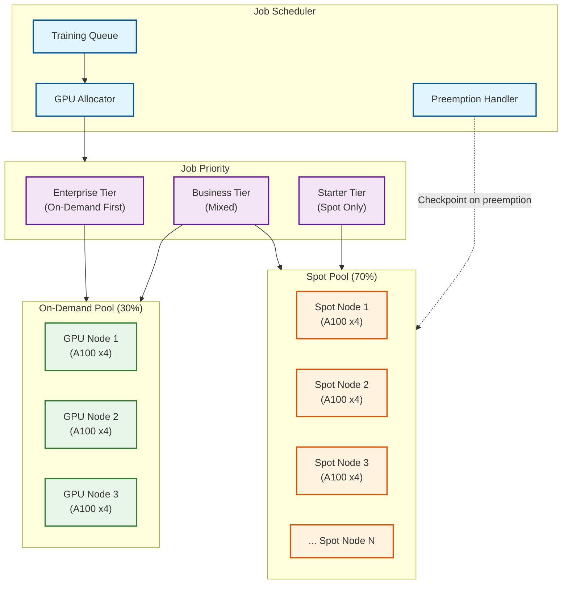
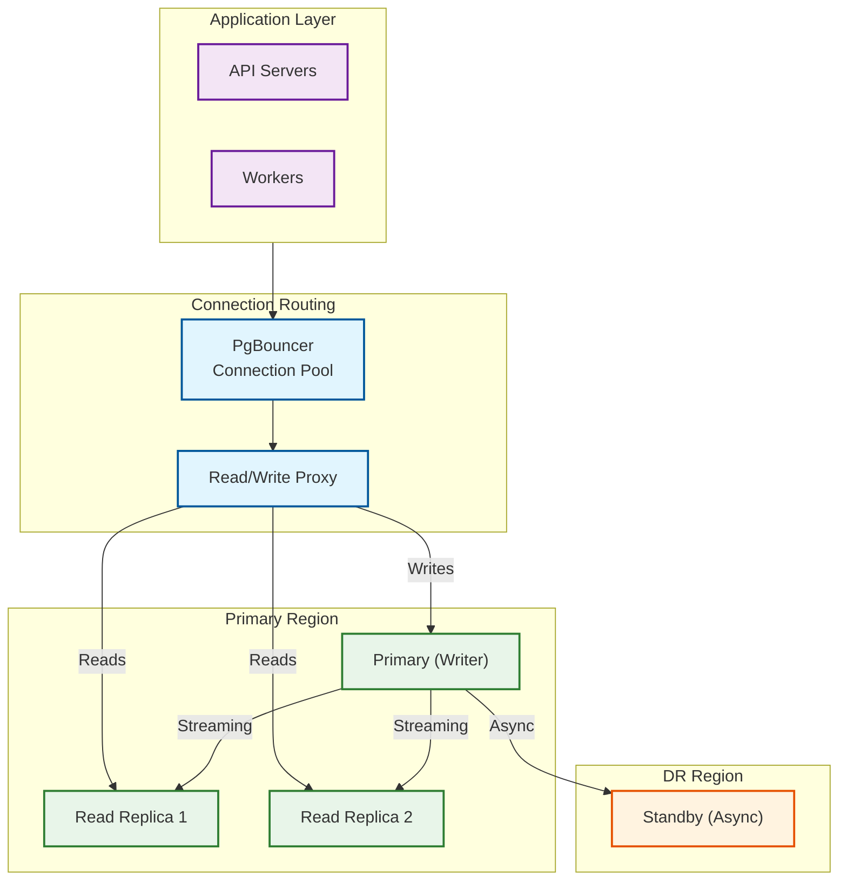
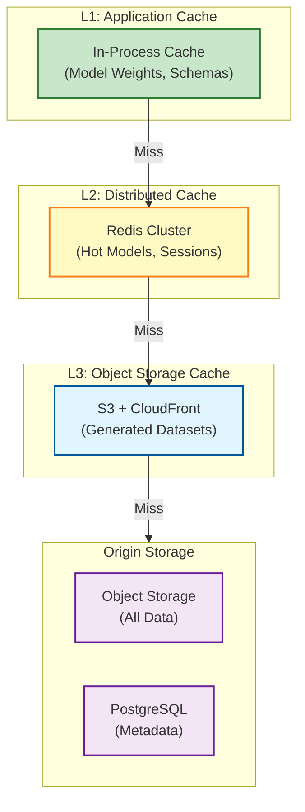
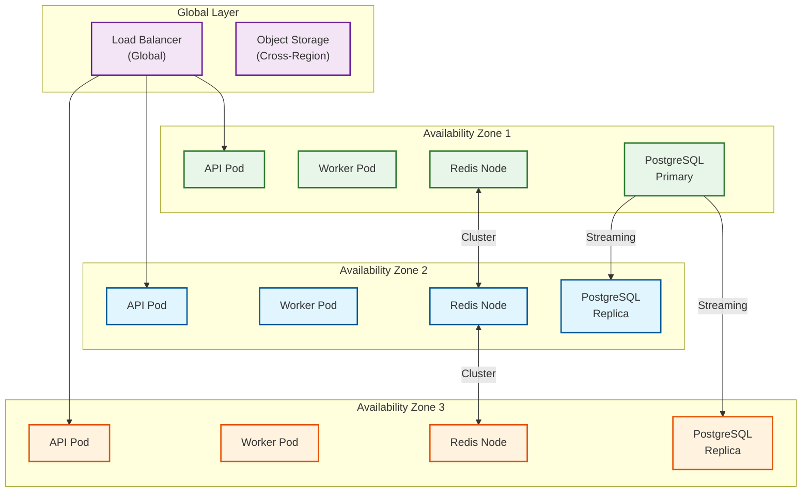
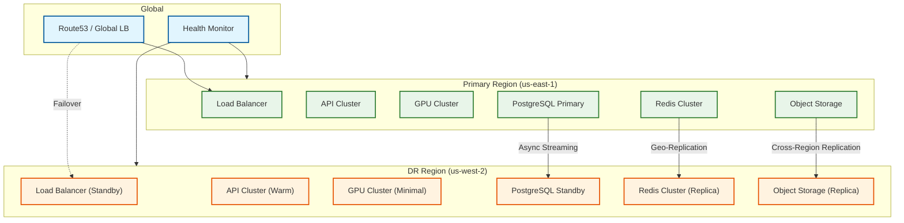

# Scalability and Reliability

## Horizontal Scaling Strategy

### Component Scaling Matrix

| Component | Scaling Trigger | Strategy | Min | Max | Notes |
|-----------|-----------------|----------|-----|-----|-------|
| API Gateway | Request rate > 1000/s | Pod autoscaling | 3 | 20 | Stateless, scale freely |
| Training Workers | Queue depth > 10 | GPU node autoscaling | 0 | 100 | Spot instances, preemptible |
| Generation Workers | Queue depth > 50 | CPU/GPU pod scaling | 2 | 50 | Model caching important |
| Quality Workers | Validation queue > 20 | CPU pod scaling | 2 | 30 | Parallelizable |
| Metadata DB | Connection count, CPU | Read replicas | 1 | 5 | Primary + replicas |
| Object Storage | N/A | Managed service | - | - | Scales automatically |
| Redis Cache | Memory usage > 80% | Cluster nodes | 3 | 12 | Redis Cluster |

### GPU Cluster Architecture



### Spot Instance Management

```
ALGORITHM SpotInstanceManager()
    // Strategy: Maximize spot usage while ensuring job completion

    // 1. Diversify across instance types and zones
    spot_config = {
        instance_types: ["a100", "a10g", "v100"],  // Fallback options
        zones: ["us-east-1a", "us-east-1b", "us-east-1c"],
        max_price: 0.7 * on_demand_price
    }

    // 2. Checkpoint aggressively
    checkpoint_interval = 15 minutes  // More frequent than usual

    // 3. Handle preemption gracefully
    ON spot_preemption_warning(node, time_remaining):
        // Typically 2 minutes warning
        jobs = get_jobs_on_node(node)
        FOR job IN jobs DO
            IF time_remaining > 60 seconds THEN
                trigger_checkpoint(job)
                requeue_job(job, priority=HIGH)
            ELSE
                // Not enough time - emergency save
                save_emergency_state(job)
                requeue_job(job, priority=URGENT)
            END IF
        END FOR

    // 4. Maintain minimum on-demand capacity for urgent jobs
    on_demand_minimum = max(3, total_capacity * 0.2)

    // 5. Cost tracking
    hourly_cost_limit = budget / hours_remaining
    IF current_hourly_rate > hourly_cost_limit THEN
        scale_down_spot(target_rate=hourly_cost_limit * 0.9)
    END IF
END ALGORITHM
```

---

## Database Scaling

### PostgreSQL Scaling Strategy



### Read/Write Separation

| Query Type | Route To | Consistency | Use Case |
|------------|----------|-------------|----------|
| Privacy budget reads | Primary | Strong | Critical for correctness |
| Privacy budget writes | Primary | Strong | ACID required |
| Job status reads | Replicas | Eventual (< 1s lag) | Dashboard, polling |
| Job creation | Primary | Strong | Must be durable |
| Quality report reads | Replicas | Eventual | Non-critical |
| Audit log writes | Primary | Strong | Compliance |

### Partitioning Strategy

```sql
-- Generation jobs: Partition by org_id (tenant isolation)
-- Benefits: Faster queries, easier data management per tenant

CREATE TABLE generation_jobs (
    job_id UUID,
    org_id UUID NOT NULL,
    created_at TIMESTAMP NOT NULL,
    ...
) PARTITION BY HASH (org_id);

-- Create 16 partitions for good distribution
CREATE TABLE generation_jobs_p00 PARTITION OF generation_jobs
    FOR VALUES WITH (MODULUS 16, REMAINDER 0);
-- ... through p15

-- Privacy audit logs: Partition by time (range queries)
CREATE TABLE privacy_audit_logs (
    log_id UUID,
    org_id UUID NOT NULL,
    created_at TIMESTAMP NOT NULL,
    ...
) PARTITION BY RANGE (created_at);

-- Monthly partitions with automatic creation
-- Old partitions can be archived/dropped
```

---

## Caching Strategy

### Multi-Layer Cache Architecture



### Cache Configuration

| Cache Layer | Content | TTL | Size | Eviction |
|-------------|---------|-----|------|----------|
| L1 (Local) | Model weights (hot) | 30 min | 10 GB per worker | LRU |
| L1 (Local) | Parsed schemas | 1 hour | 100 MB | LRU |
| L2 (Redis) | Model metadata | 1 hour | 1 GB | LRU |
| L2 (Redis) | Session tokens | 30 min | 100 MB | TTL |
| L2 (Redis) | Quality reports (recent) | 1 hour | 5 GB | LRU |
| L3 (CDN) | Generated datasets (public) | 24 hours | Unlimited | TTL |

### Model Caching Strategy

```
ALGORITHM ModelCacheManager()
    // Key insight: Models are expensive to load, frequently reused

    // 1. Predict which models will be used
    hot_models = predict_hot_models(
        criteria: [
            recent_generations(window=1h),
            scheduled_jobs(window=4h),
            model_age < 7 days
        ]
    )

    // 2. Pre-warm cache during low-traffic periods
    SCHEDULE daily at 03:00:
        FOR model IN hot_models DO
            IF NOT in_cache(model) THEN
                load_to_cache(model, tier=L2)
            END IF
        END FOR

    // 3. Promote on access
    ON model_access(model_id):
        IF in_cache(model_id, tier=L2) THEN
            promote_to_L1(model_id)
        ELSE
            load_to_L1(model_id)
            async_load_to_L2(model_id)
        END IF

    // 4. Memory pressure handling
    ON memory_pressure(tier, usage_percent):
        IF usage_percent > 90% THEN
            evict_lru(tier, target_percent=70%)
        END IF
END ALGORITHM
```

---

## Fault Tolerance

### Single Points of Failure (SPOF) Analysis

| Component | SPOF Risk | Mitigation | Impact if Failed |
|-----------|-----------|------------|------------------|
| API Gateway | Medium | Multi-AZ, multiple pods | API unavailable |
| Metadata DB | High | Primary + standby + replicas | All operations blocked |
| Job Queue | High | Redis Cluster with persistence | Jobs not processed |
| Object Storage | Low | Managed service (11 9s) | Data unavailable |
| GPU Cluster | Medium | Multi-zone, auto-scaling | Training delayed |
| Privacy Accountant | High | Strongly consistent DB | Generation blocked |

### Redundancy Architecture



### Circuit Breaker Implementation

```
ALGORITHM CircuitBreaker(service_name, config)
    state = CLOSED
    failure_count = 0
    last_failure_time = null
    success_count_in_half_open = 0

    config = {
        failure_threshold: 5,
        reset_timeout: 30 seconds,
        half_open_requests: 3
    }

    FUNCTION call(request):
        IF state == OPEN THEN
            IF now() - last_failure_time > config.reset_timeout THEN
                state = HALF_OPEN
                success_count_in_half_open = 0
            ELSE
                RAISE CircuitOpenError(retry_after=config.reset_timeout)
            END IF
        END IF

        TRY
            result = execute_request(request)

            IF state == HALF_OPEN THEN
                success_count_in_half_open += 1
                IF success_count_in_half_open >= config.half_open_requests THEN
                    state = CLOSED
                    failure_count = 0
                END IF
            ELSE
                failure_count = 0
            END IF

            RETURN result

        CATCH error:
            failure_count += 1
            last_failure_time = now()

            IF failure_count >= config.failure_threshold THEN
                state = OPEN
                alert("Circuit opened for " + service_name)
            END IF

            RAISE error
    END FUNCTION
END ALGORITHM
```

### Services with Circuit Breakers

| Service | Failure Threshold | Reset Timeout | Fallback |
|---------|-------------------|---------------|----------|
| GPU Cluster | 3 failures | 60s | Queue job, use spot pool |
| Object Storage | 5 failures | 30s | Return cached if available |
| Quality Service | 3 failures | 45s | Skip quality, warn user |
| Notification Service | 10 failures | 120s | Queue for retry |

---

## Retry and Backoff Strategies

### Retry Configuration by Operation

| Operation | Max Retries | Initial Delay | Max Delay | Strategy |
|-----------|-------------|---------------|-----------|----------|
| Training job | 3 | 1 min | 15 min | Exponential + jitter |
| Generation batch | 2 | 30s | 2 min | Exponential |
| Quality check | 2 | 1 min | 5 min | Exponential |
| API calls | 3 | 1s | 10s | Exponential |
| DB transactions | 3 | 100ms | 1s | Exponential |
| Model load | 2 | 5s | 30s | Linear |

### Retry Implementation

```
ALGORITHM RetryWithBackoff(operation, config)
    config = {
        max_retries: 3,
        initial_delay: 1 second,
        max_delay: 60 seconds,
        exponential_base: 2,
        jitter: true,
        retryable_errors: [TimeoutError, TransientError, RateLimitError]
    }

    FOR attempt IN 1 TO config.max_retries + 1 DO
        TRY
            result = operation()
            RETURN result

        CATCH error:
            IF error NOT IN config.retryable_errors THEN
                RAISE error  // Non-retryable, fail immediately
            END IF

            IF attempt > config.max_retries THEN
                RAISE MaxRetriesExceeded(original_error=error)
            END IF

            // Calculate delay with exponential backoff
            delay = config.initial_delay * (config.exponential_base ^ (attempt - 1))
            delay = min(delay, config.max_delay)

            // Add jitter to prevent thundering herd
            IF config.jitter THEN
                delay = delay * (0.5 + random() * 0.5)
            END IF

            log("Retry {attempt}/{max_retries}, waiting {delay}s", error)
            SLEEP(delay)
    END FOR
END ALGORITHM
```

---

## Graceful Degradation

### Degradation Levels

| Level | Trigger | Disabled Features | User Impact |
|-------|---------|-------------------|-------------|
| **Normal** | All healthy | None | Full functionality |
| **Level 1** | Quality service slow | Skip optional quality checks | Faster generation, less validation |
| **Level 2** | GPU capacity low | Disable diffusion models | CTGAN/TVAE only, slightly lower quality |
| **Level 3** | High load | Disable streaming generation | Batch only, async responses |
| **Level 4** | Critical | Disable new training | Generation from existing models only |
| **Level 5** | Emergency | Read-only mode | View existing data only |

### Degradation Implementation

```
ALGORITHM GracefulDegradation()
    // Monitor system health and adjust behavior

    health_scores = {
        gpu_cluster: check_gpu_availability(),
        quality_service: check_quality_latency(),
        database: check_db_connections(),
        storage: check_storage_latency(),
        queue_depth: check_queue_depth()
    }

    overall_health = weighted_average(health_scores)

    // Determine degradation level
    IF overall_health > 0.9 THEN
        level = NORMAL
    ELSE IF overall_health > 0.7 THEN
        level = LEVEL_1
    ELSE IF overall_health > 0.5 THEN
        level = LEVEL_2
    ELSE IF overall_health > 0.3 THEN
        level = LEVEL_3
    ELSE IF overall_health > 0.1 THEN
        level = LEVEL_4
    ELSE
        level = LEVEL_5
    END IF

    // Apply degradation policies
    SWITCH level:
        CASE LEVEL_1:
            quality_config.skip_optional = true

        CASE LEVEL_2:
            model_config.disable = ["DIFFUSION", "TRANSFORMER"]
            notify_users("Temporarily limited to fast models")

        CASE LEVEL_3:
            api_config.disable_streaming = true
            notify_users("Streaming generation temporarily disabled")

        CASE LEVEL_4:
            training_config.accept_new = false
            notify_users("New training temporarily paused")

        CASE LEVEL_5:
            api_config.read_only = true
            notify_users("System in read-only mode")

    // Log and alert
    IF level != previous_level THEN
        alert("Degradation level changed: {previous} -> {level}")
        log_degradation_event(level, health_scores)
    END IF
END ALGORITHM
```

---

## Disaster Recovery

### Recovery Objectives

| Data Type | RPO | RTO | Backup Frequency |
|-----------|-----|-----|------------------|
| Trained models | 1 hour | 15 min | Continuous to DR |
| Metadata | 5 min | 30 min | Streaming replication |
| Privacy budgets | 0 (sync) | 5 min | Synchronous replication |
| Audit logs | 1 hour | 1 hour | Hourly backup |
| Generated datasets | N/A | N/A | Regeneratable |
| Source datasets | 24 hours | 4 hours | Daily backup |

### Multi-Region Architecture



### Failover Procedure

```
ALGORITHM DisasterRecoveryFailover()
    // Automated failover with manual confirmation for critical steps

    // Phase 1: Detection (automated)
    ON primary_region_unhealthy(duration > 5 minutes):
        alert_oncall("Primary region unhealthy, initiating DR assessment")

        // Verify it's not a monitoring false positive
        IF NOT confirm_outage_from_multiple_probes() THEN
            RETURN
        END IF

    // Phase 2: Preparation
    PARALLEL:
        // Promote DR database
        DR_DB.promote_to_primary()

        // Scale up DR compute
        DR_API.scale(replicas=primary_replica_count)
        DR_GPU.scale(replicas=minimum_required)

        // Verify DR data freshness
        lag = check_replication_lag()
        IF lag > acceptable_lag THEN
            alert("Potential data loss: {lag} seconds")
        END IF

    // Phase 3: Traffic Switch (requires manual approval for production)
    IF environment == PRODUCTION THEN
        approval = wait_for_manual_approval(timeout=10 minutes)
        IF NOT approval THEN
            alert("DR failover not approved, staying on primary")
            RETURN
        END IF
    END IF

    // Switch DNS
    DNS.update_record(target=DR_LB.address, ttl=60)

    // Phase 4: Verification
    WAIT 2 minutes  // DNS propagation
    health = check_dr_region_health()

    IF health.is_healthy THEN
        alert("Failover complete. DR region serving traffic.")
        update_status_page("Operating from backup region")
    ELSE
        alert("DR region unhealthy after failover!")
        initiate_emergency_response()
    END IF

    // Phase 5: Post-Failover
    // Disable writes to old primary to prevent split-brain
    PRIMARY_DB.set_read_only(true)

    // Start data reconciliation process
    schedule_data_reconciliation()
END ALGORITHM
```

### Backup Strategy

| Backup Type | Frequency | Retention | Storage |
|-------------|-----------|-----------|---------|
| PostgreSQL WAL | Continuous | 7 days | S3 (cross-region) |
| PostgreSQL Full | Daily | 30 days | S3 (cross-region) |
| Model Artifacts | On creation | Forever | S3 (versioned) |
| Audit Logs | Hourly | 7 years | S3 Glacier |
| Configuration | On change | 90 days | Git + S3 |
