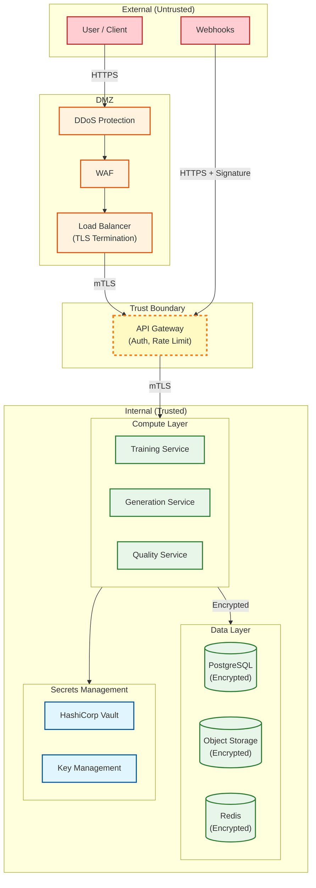
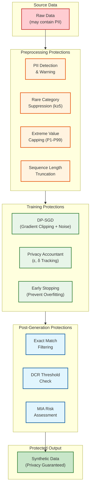

# Security and Compliance

## Data Classification

### Sensitivity Levels

| Data Type | Sensitivity | Encryption at Rest | Encryption in Transit | Access Control | Retention |
|-----------|-------------|-------------------|----------------------|----------------|-----------|
| Source datasets | **Critical** | AES-256 (customer key) | TLS 1.3 | Strict RBAC | Customer-defined |
| Trained models | **High** | AES-256 | TLS 1.3 | RBAC | Follows source |
| Generated datasets | **Medium** | AES-256 | TLS 1.3 | RBAC | Customer-defined |
| Privacy budgets | **High** | AES-256 | TLS 1.3 | Admin only | Forever |
| Audit logs | **High** | AES-256 | TLS 1.3 | Admin only | 7 years |
| Quality reports | **Low** | AES-256 | TLS 1.3 | RBAC | 90 days |
| API keys/tokens | **Critical** | AES-256 (HSM) | TLS 1.3 | Owner only | Until revoked |

### Data Flow Security



---

## Authentication and Authorization

### Authentication Methods

| Method | Use Case | Token Lifetime | MFA Required |
|--------|----------|----------------|--------------|
| **OAuth 2.0 / OIDC** | Web dashboard, SSO | Access: 1h, Refresh: 7d | Yes (Enterprise) |
| **API Keys** | Server-to-server | Until revoked | N/A |
| **Service Tokens** | Internal services | 24h (auto-rotate) | N/A |
| **Temporary Credentials** | SDK sessions | 1h | Optional |

### API Key Security

```
ALGORITHM SecureAPIKeyManagement()
    // Key generation
    FUNCTION generate_api_key():
        // Format: prefix_base64(random_32_bytes)_checksum
        prefix = "synth_"
        random_bytes = secure_random(32)
        key_body = base64_encode(random_bytes)
        checksum = crc32(key_body)[-4:]
        full_key = prefix + key_body + "_" + checksum

        // Store hash only
        key_hash = bcrypt(full_key, rounds=12)
        store_in_db(key_hash, metadata)

        RETURN full_key  // Shown once, never stored

    // Key validation
    FUNCTION validate_api_key(provided_key):
        // Extract and verify checksum first (fast rejection)
        parts = provided_key.split("_")
        IF NOT verify_checksum(parts) THEN
            RETURN INVALID
        END IF

        // Rate-limited hash lookup
        rate_limit(ip_address, limit=100/min)

        key_hash = bcrypt_hash(provided_key)
        record = lookup_by_hash_prefix(key_hash[:20])

        IF record AND bcrypt_verify(provided_key, record.hash) THEN
            IF record.is_revoked THEN
                RETURN REVOKED
            END IF
            update_last_used(record)
            RETURN VALID(record.org_id, record.permissions)
        END IF

        RETURN INVALID
END ALGORITHM
```

### Role-Based Access Control (RBAC)

| Role | Permissions | Scope |
|------|-------------|-------|
| **Owner** | All operations, billing, user management | Organization |
| **Admin** | All operations except billing | Organization |
| **Data Scientist** | Create datasets, train models, generate data | Projects assigned |
| **Analyst** | View datasets, generate data (existing models) | Projects assigned |
| **Viewer** | Read-only access to reports | Projects assigned |
| **Service Account** | API access per assigned permissions | Scoped by API key |

### Permission Matrix

| Resource | Owner | Admin | Data Scientist | Analyst | Viewer |
|----------|-------|-------|----------------|---------|--------|
| Create project | Yes | Yes | No | No | No |
| Upload dataset | Yes | Yes | Yes | No | No |
| View dataset | Yes | Yes | Yes | Yes | Yes |
| Delete dataset | Yes | Yes | Yes (own) | No | No |
| Train model | Yes | Yes | Yes | No | No |
| Generate data | Yes | Yes | Yes | Yes | No |
| View quality report | Yes | Yes | Yes | Yes | Yes |
| Manage privacy budget | Yes | Yes | No | No | No |
| View audit logs | Yes | Yes | No | No | No |
| Manage users | Yes | Yes (non-owner) | No | No | No |

---

## Privacy Threat Model

### Synthetic Data Specific Threats

| Threat | Attack Vector | Likelihood | Impact | Mitigation |
|--------|---------------|------------|--------|------------|
| **Membership Inference** | Attacker determines if specific record was in training | Medium | High | DP training, MIA testing |
| **Model Inversion** | Reconstruct training data from model | Low | Critical | DP training, model access controls |
| **Attribute Inference** | Infer sensitive attributes from synthetic data | Medium | High | Rare category protection |
| **Linkability Attack** | Link synthetic records to real individuals | Low | Critical | Ensure no exact matches, DP |
| **Training Data Extraction** | Extract memorized training data | Low | Critical | DP, regularization |
| **Privacy Budget Exhaustion** | Repeatedly query to exhaust budget | Medium | Medium | Budget tracking, rate limiting |

### Privacy Attack Simulation

```
ALGORITHM PrivacyAttackSimulation(real_data, synthetic_data, model)
    results = {}

    // 1. Membership Inference Attack (MIA)
    // Train classifier to distinguish "in training" vs "not in training"
    train_members = sample(real_data, n=1000)  // Known training data
    non_members = generate_holdout(n=1000)      // Never seen by model

    // Features: model confidence, loss, etc.
    mia_features_members = extract_mia_features(model, train_members)
    mia_features_non = extract_mia_features(model, non_members)

    mia_classifier = train_classifier(
        X=[mia_features_members, mia_features_non],
        y=[1] * 1000 + [0] * 1000
    )

    // Evaluate attack success
    mia_accuracy = mia_classifier.test_accuracy()
    results.mia_success_rate = mia_accuracy - 0.5  // Above random guess

    // 2. Attribute Inference Attack
    sensitive_cols = identify_sensitive_columns(real_data)
    FOR col IN sensitive_cols DO
        // Can attacker predict sensitive attribute better with synthetic?
        baseline = predict_without_synthetic(col, real_data)
        with_synthetic = predict_with_synthetic(col, real_data, synthetic_data)

        results.attribute_inference[col] = {
            baseline: baseline.accuracy,
            with_synthetic: with_synthetic.accuracy,
            advantage: with_synthetic.accuracy - baseline.accuracy
        }
    END FOR

    // 3. Record Linkage Attack
    // Find closest synthetic record to each real record
    linkages = []
    FOR real_row IN sample(real_data, 1000) DO
        closest = find_closest(real_row, synthetic_data)
        distance = euclidean_distance(real_row, closest)
        linkages.append(distance)
    END FOR

    results.linkage_risk = {
        mean_distance: mean(linkages),
        min_distance: min(linkages),
        p5_distance: percentile(linkages, 5)
    }

    // 4. Exact Match Check
    results.exact_matches = count_exact_matches(real_data, synthetic_data)

    // Generate risk assessment
    results.risk_level = assess_risk(results)
    results.recommendations = generate_recommendations(results)

    RETURN results
END ALGORITHM
```

### Privacy Protection Mechanisms



---

## Compliance Framework

### Regulatory Mapping

| Regulation | Requirement | Implementation |
|------------|-------------|----------------|
| **GDPR** | Right to erasure | Delete source data, retrain models, or prove DP guarantees make erasure unnecessary |
| **GDPR** | Data minimization | Generate only required attributes |
| **GDPR** | Lawful basis | Consent or legitimate interest for synthetic data creation |
| **GDPR** | Privacy by design | DP integration, privacy-first architecture |
| **HIPAA** | De-identification (Safe Harbor) | DP training, remove direct identifiers, validate expert determination |
| **HIPAA** | Minimum necessary | Configurable attribute generation |
| **CCPA** | Consumer opt-out | Remove from training data, regenerate |
| **CCPA** | Data inventory | Comprehensive audit logging |
| **SOC 2** | Security controls | Encryption, access controls, monitoring |
| **ISO 27001** | Information security | ISMS implementation |

### GDPR-Specific Implementation

```
ALGORITHM GDPRCompliance()
    // Data Subject Rights Implementation

    // Right to Access (Article 15)
    FUNCTION handle_access_request(subject_id):
        // Synthetic data has no 1:1 mapping, but we log what training data was used
        training_datasets = get_datasets_containing_subject(subject_id)
        models_trained = get_models_from_datasets(training_datasets)

        RETURN {
            datasets_used: training_datasets,
            models_trained: models_trained,
            synthetic_generated: "Not applicable - no individual records",
            privacy_budget_used: get_budget_for_datasets(training_datasets)
        }

    // Right to Erasure (Article 17)
    FUNCTION handle_erasure_request(subject_id):
        // Option 1: If DP was used with strong epsilon, erasure may not be required
        // (mathematically, the individual's influence is bounded)
        IF all_models_dp_compliant(subject_id, epsilon_threshold=1.0) THEN
            RETURN {
                status: "COMPLIANT",
                reason: "DP guarantees limit individual influence",
                epsilon_values: get_epsilon_values()
            }
        END IF

        // Option 2: Delete source data and retrain
        affected_datasets = get_datasets_containing_subject(subject_id)
        affected_models = get_models_from_datasets(affected_datasets)

        FOR dataset IN affected_datasets DO
            remove_subject_from_dataset(dataset, subject_id)
        END FOR

        FOR model IN affected_models DO
            schedule_retraining(model)
            mark_as_pending_erasure(model)
        END FOR

        RETURN {
            status: "IN_PROGRESS",
            affected_datasets: affected_datasets,
            retraining_scheduled: affected_models
        }

    // Data Portability (Article 20)
    FUNCTION handle_portability_request(subject_id):
        // Export format: JSON per GDPR guidelines
        subject_data = extract_subject_data(subject_id)
        RETURN json_export(subject_data)
END ALGORITHM
```

### HIPAA De-identification Validation

```
ALGORITHM HIPAAValidation(synthetic_data, config)
    // Safe Harbor Method: Verify all 18 identifiers are removed/protected

    identifiers = [
        "names", "geographic_data", "dates", "phone_numbers",
        "fax_numbers", "email_addresses", "ssn", "mrn",
        "health_plan_beneficiary", "account_numbers", "certificate_numbers",
        "vehicle_identifiers", "device_identifiers", "urls",
        "ip_addresses", "biometric_identifiers", "photos", "other_unique"
    ]

    violations = []

    FOR identifier IN identifiers DO
        IF detect_identifier(synthetic_data, identifier) THEN
            violations.append(identifier)
        END IF
    END FOR

    // Additional statistical tests
    IF config.privacy_epsilon > 3.0 THEN
        violations.append("epsilon_too_high_for_hipaa")
    END IF

    // Expert Determination path
    IF len(violations) > 0 AND config.expert_determination THEN
        // Document statistical analysis showing low re-identification risk
        reident_risk = compute_reidentification_risk(synthetic_data)
        IF reident_risk < 0.05 THEN  // 5% threshold
            RETURN {
                compliant: true,
                method: "expert_determination",
                risk_level: reident_risk,
                documentation: generate_expert_report()
            }
        END IF
    END IF

    RETURN {
        compliant: len(violations) == 0,
        violations: violations,
        method: "safe_harbor" IF len(violations) == 0 ELSE "non_compliant"
    }
END ALGORITHM
```

---

## Audit Logging

### Audit Log Schema

```yaml
AuditLog:
  log_id: uuid
  timestamp: datetime (UTC)
  org_id: uuid
  user_id: uuid (nullable for system events)
  action: enum
  resource_type: enum [dataset, model, generation, privacy_budget, user, ...]
  resource_id: uuid
  details:
    # Action-specific details
    before_state: jsonb (for updates)
    after_state: jsonb (for updates)
    parameters: jsonb (for operations)
  ip_address: string
  user_agent: string
  request_id: uuid (for tracing)
  result: enum [success, failure, denied]
  error_message: string (if failure)

Actions:
  - dataset.created
  - dataset.deleted
  - dataset.accessed
  - model.trained
  - model.deleted
  - generation.created
  - generation.downloaded
  - privacy_budget.spent
  - privacy_budget.reset
  - user.created
  - user.permissions_changed
  - user.login
  - user.login_failed
  - api_key.created
  - api_key.revoked
```

### Immutable Audit Trail

```
ALGORITHM ImmutableAuditLog()
    // Ensure audit logs cannot be tampered with

    // 1. Write-once storage
    FUNCTION write_audit_log(event):
        log_entry = {
            ...event,
            timestamp: now_utc(),
            log_id: uuid(),
            sequence_number: get_next_sequence()
        }

        // Hash chain for tamper detection
        previous_hash = get_previous_log_hash()
        log_entry.previous_hash = previous_hash
        log_entry.hash = sha256(serialize(log_entry))

        // Write to append-only storage
        append_to_log(log_entry)

        // Async replicate to tamper-proof storage
        async_replicate_to_worm_storage(log_entry)

        RETURN log_entry.log_id

    // 2. Verification
    FUNCTION verify_audit_chain(start_sequence, end_sequence):
        logs = get_logs_range(start_sequence, end_sequence)

        FOR i IN 1 TO len(logs) - 1 DO
            current = logs[i]
            previous = logs[i - 1]

            // Verify hash chain
            IF current.previous_hash != previous.hash THEN
                RETURN { valid: false, break_at: i }
            END IF

            // Verify self-hash
            computed_hash = sha256(serialize(current, exclude=['hash']))
            IF computed_hash != current.hash THEN
                RETURN { valid: false, tampered_at: i }
            END IF
        END FOR

        RETURN { valid: true }

    // 3. Retention and archival
    SCHEDULE daily:
        logs_to_archive = get_logs_older_than(90 days)
        archive_to_cold_storage(logs_to_archive)  // S3 Glacier

        // Keep 7 years for compliance
        logs_to_delete = get_archived_older_than(7 years)
        permanent_delete(logs_to_delete)  // With approval
END ALGORITHM
```

---

## Threat Model (STRIDE Analysis)

| Threat | Category | Attack Scenario | Likelihood | Impact | Mitigation |
|--------|----------|-----------------|------------|--------|------------|
| **Spoofing** | Identity | Stolen API key used to access data | Medium | High | Key rotation, IP allowlisting, MFA |
| **Tampering** | Data | Modify trained model to bias outputs | Low | High | Model signing, integrity checks |
| **Repudiation** | Audit | User denies generating data | Medium | Medium | Immutable audit logs, non-repudiation |
| **Information Disclosure** | Privacy | Training data leaked via model | Medium | Critical | DP training, MIA testing |
| **Denial of Service** | Availability | GPU exhaustion attack | Medium | Medium | Quotas, rate limiting, auto-scaling |
| **Elevation of Privilege** | Authorization | Analyst gains admin access | Low | High | RBAC, least privilege, audit |

### Security Controls by Layer

| Layer | Controls |
|-------|----------|
| **Network** | WAF, DDoS protection, private subnets, VPN for admin |
| **Application** | Input validation, parameterized queries, CSP headers |
| **Data** | Encryption at rest/transit, key rotation, access logging |
| **Identity** | MFA, SSO, short-lived tokens, principle of least privilege |
| **Monitoring** | SIEM integration, anomaly detection, real-time alerts |

---

## Incident Response

### Security Incident Classification

| Severity | Definition | Response Time | Examples |
|----------|------------|---------------|----------|
| **P1 - Critical** | Active data breach, system compromise | 15 min | Training data exfiltration, credential leak |
| **P2 - High** | Potential breach, significant vulnerability | 1 hour | Privacy budget bypass, auth vulnerability |
| **P3 - Medium** | Security degradation, policy violation | 4 hours | Excessive failed logins, policy drift |
| **P4 - Low** | Minor security issue, improvement needed | 24 hours | Outdated dependencies, minor misconfiguration |

### Incident Response Procedure

```
ALGORITHM SecurityIncidentResponse(incident)
    // Phase 1: Detection & Triage (Target: 15 min)
    severity = classify_severity(incident)
    notify_security_team(severity)

    IF severity IN [P1, P2] THEN
        page_oncall_immediately()
        start_incident_bridge()
    END IF

    // Phase 2: Containment (Target: 1 hour for P1)
    SWITCH incident.type:
        CASE "credential_compromise":
            revoke_all_sessions(affected_user)
            rotate_api_keys(affected_org)
            IF scope == "service_account" THEN
                rotate_all_service_credentials()
            END IF

        CASE "data_exfiltration":
            isolate_affected_systems()
            block_suspicious_ips()
            preserve_forensic_evidence()

        CASE "privacy_breach":
            pause_affected_generation_jobs()
            quarantine_affected_models()
            notify_dpo()  // Data Protection Officer

    // Phase 3: Investigation
    evidence = collect_evidence(incident)
    timeline = reconstruct_timeline(evidence)
    root_cause = analyze_root_cause(timeline)

    // Phase 4: Remediation
    fix = develop_fix(root_cause)
    deploy_fix(fix, with_testing=true)
    verify_fix(fix)

    // Phase 5: Notification (if required)
    IF incident.involves_pii AND incident.confirmed_breach THEN
        // GDPR: 72 hours to notify authority
        notify_supervisory_authority(within=72 hours)
        prepare_user_notifications()
    END IF

    // Phase 6: Post-Incident
    write_post_mortem(incident)
    update_runbooks()
    schedule_retrospective()

    RETURN incident_report
END ALGORITHM
```
