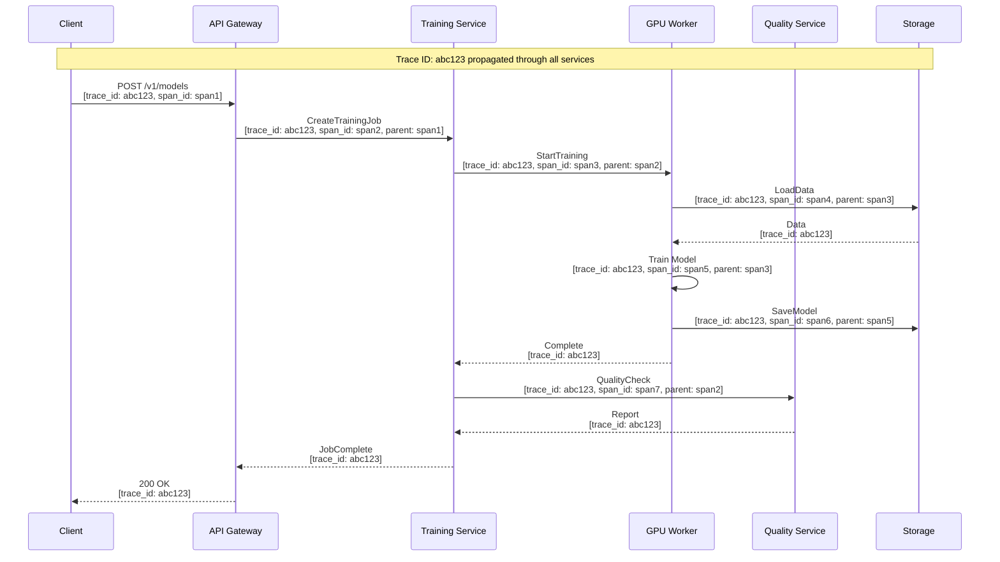

# Observability

## Observability Strategy

This document covers **platform observability** (monitoring the synthetic data generation platform itself), not ML model monitoring. The goal is to ensure visibility into system health, performance, and operations.

---

## Core Metrics Framework

### RED Method (Request-Oriented)

| Service | Rate | Errors | Duration |
|---------|------|--------|----------|
| API Gateway | `api_requests_total` | `api_errors_total` | `api_request_duration_seconds` |
| Training Service | `training_jobs_started_total` | `training_jobs_failed_total` | `training_job_duration_seconds` |
| Generation Service | `generation_requests_total` | `generation_errors_total` | `generation_duration_seconds` |
| Quality Service | `quality_checks_total` | `quality_check_failures_total` | `quality_check_duration_seconds` |
| Privacy Service | `privacy_budget_checks_total` | `privacy_budget_exceeded_total` | `privacy_check_duration_seconds` |

### USE Method (Resource-Oriented)

| Resource | Utilization | Saturation | Errors |
|----------|-------------|------------|--------|
| GPU Cluster | `gpu_utilization_percent` | `gpu_memory_used_percent` | `gpu_errors_total` |
| CPU Workers | `cpu_utilization_percent` | `cpu_throttle_seconds` | `cpu_errors_total` |
| Memory | `memory_used_bytes` | `memory_pressure_events` | `oom_kills_total` |
| Storage | `storage_used_bytes` | `storage_iops_throttled` | `storage_errors_total` |
| Database | `db_connection_utilization` | `db_waiting_queries` | `db_errors_total` |
| Queue | `queue_depth` | `queue_oldest_message_age_seconds` | `queue_failures_total` |

---

## Metric Definitions

### API Metrics

```yaml
# Request metrics
api_requests_total:
  type: counter
  description: "Total API requests"
  labels:
    - endpoint    # /v1/models, /v1/generations, etc.
    - method      # GET, POST, DELETE
    - status_code # 200, 400, 500, etc.
    - org_id

api_request_duration_seconds:
  type: histogram
  description: "API request latency"
  buckets: [0.01, 0.05, 0.1, 0.25, 0.5, 1, 2.5, 5, 10]
  labels:
    - endpoint
    - method

api_request_size_bytes:
  type: histogram
  description: "Request body size"
  buckets: [100, 1000, 10000, 100000, 1000000, 10000000]
  labels:
    - endpoint

api_response_size_bytes:
  type: histogram
  description: "Response body size"
  buckets: [100, 1000, 10000, 100000, 1000000, 10000000]
  labels:
    - endpoint
```

### Training Metrics

```yaml
training_jobs_total:
  type: counter
  description: "Total training jobs"
  labels:
    - org_id
    - model_type    # CTGAN, TVAE, DIFFUSION
    - status        # started, completed, failed
    - tier          # enterprise, business, starter

training_job_duration_seconds:
  type: histogram
  description: "Training job duration"
  buckets: [60, 300, 900, 1800, 3600, 7200, 14400, 28800, 86400]
  labels:
    - model_type
    - tier

training_epochs_total:
  type: counter
  description: "Training epochs completed"
  labels:
    - job_id
    - model_type

training_loss:
  type: gauge
  description: "Current training loss"
  labels:
    - job_id
    - loss_type     # generator, discriminator, total

training_gpu_memory_used_bytes:
  type: gauge
  description: "GPU memory usage during training"
  labels:
    - job_id
    - gpu_id

training_checkpoint_size_bytes:
  type: gauge
  description: "Size of training checkpoint"
  labels:
    - job_id
```

### Generation Metrics

```yaml
generation_requests_total:
  type: counter
  description: "Total generation requests"
  labels:
    - org_id
    - model_type
    - mode          # batch, streaming, conditional
    - status        # completed, failed

generation_rows_total:
  type: counter
  description: "Total rows generated"
  labels:
    - org_id
    - model_type

generation_duration_seconds:
  type: histogram
  description: "Generation duration"
  buckets: [1, 5, 10, 30, 60, 120, 300, 600, 1800]
  labels:
    - model_type
    - mode

generation_rows_per_second:
  type: gauge
  description: "Generation throughput"
  labels:
    - job_id
    - model_type
```

### Privacy Metrics

```yaml
privacy_budget_remaining:
  type: gauge
  description: "Remaining privacy budget (epsilon)"
  labels:
    - org_id
    - dataset_id

privacy_budget_spent_total:
  type: counter
  description: "Cumulative epsilon spent"
  labels:
    - org_id
    - dataset_id

privacy_budget_checks_total:
  type: counter
  description: "Privacy budget check requests"
  labels:
    - org_id
    - result        # allowed, denied

privacy_mia_risk_score:
  type: gauge
  description: "Membership inference attack success rate"
  labels:
    - generation_job_id
```

### Quality Metrics

```yaml
quality_check_duration_seconds:
  type: histogram
  description: "Quality check duration"
  buckets: [10, 30, 60, 120, 300, 600, 1200]
  labels:
    - check_type    # full, standard, quick

quality_fidelity_score:
  type: gauge
  description: "Fidelity score (0-1)"
  labels:
    - generation_job_id

quality_utility_score:
  type: gauge
  description: "Utility score (0-1)"
  labels:
    - generation_job_id

quality_privacy_score:
  type: gauge
  description: "Privacy score (0-1)"
  labels:
    - generation_job_id

quality_gate_pass_rate:
  type: gauge
  description: "Percentage of generations passing quality gates"
  labels:
    - org_id
    - gate_name     # fidelity, utility, privacy
```

---

## Logging Strategy

### Log Levels and Guidelines

| Level | When to Use | Examples |
|-------|-------------|----------|
| **ERROR** | Unexpected failures requiring attention | Job failures, DB errors, auth failures |
| **WARN** | Degraded but recoverable situations | Retry attempts, near-quota, slow queries |
| **INFO** | Significant business events | Job start/complete, generation finish |
| **DEBUG** | Detailed operational info | Request details, cache hits/misses |
| **TRACE** | Very detailed debugging | Function entry/exit, data transformations |

### Structured Log Format

```json
{
  "timestamp": "2025-01-15T10:30:45.123Z",
  "level": "INFO",
  "service": "generation-service",
  "instance_id": "gen-worker-5",
  "trace_id": "abc123def456",
  "span_id": "span789",
  "org_id": "org_123",
  "user_id": "user_456",
  "message": "Generation job completed",
  "context": {
    "job_id": "job_789",
    "model_type": "CTGAN",
    "rows_generated": 100000,
    "duration_seconds": 45.2,
    "quality_passed": true
  }
}
```

### Log Retention

| Log Type | Hot Storage | Warm Storage | Cold Storage | Total Retention |
|----------|-------------|--------------|--------------|-----------------|
| Application logs | 7 days | 30 days | 90 days | 90 days |
| Security/audit logs | 30 days | 1 year | 6 years | 7 years |
| Training logs | 7 days | 30 days | - | 30 days |
| Access logs | 14 days | 60 days | 1 year | 1 year |
| Error logs | 30 days | 90 days | 1 year | 1 year |

### PII Handling in Logs

```
ALGORITHM PIIRedactionInLogs(log_message)
    // Never log PII - redact or hash

    // 1. Known PII patterns
    patterns = [
        (EMAIL_REGEX, "[EMAIL_REDACTED]"),
        (PHONE_REGEX, "[PHONE_REDACTED]"),
        (SSN_REGEX, "[SSN_REDACTED]"),
        (CREDIT_CARD_REGEX, "[CC_REDACTED]")
    ]

    redacted = log_message
    FOR (pattern, replacement) IN patterns DO
        redacted = regex_replace(redacted, pattern, replacement)
    END FOR

    // 2. Sensitive field names (in structured logs)
    sensitive_fields = ["password", "api_key", "token", "secret", "ssn", "credit_card"]
    FOR field IN sensitive_fields DO
        IF field IN log_message THEN
            log_message[field] = "[REDACTED]"
        END IF
    END FOR

    // 3. Data values (never log actual data records)
    IF "data_sample" IN log_message THEN
        log_message["data_sample"] = "[SAMPLE_REDACTED]"
        log_message["data_sample_hash"] = sha256(log_message["data_sample"])[:8]
    END IF

    RETURN redacted
END ALGORITHM
```

---

## Distributed Tracing

### Trace Context Propagation



### Key Spans to Instrument

| Service | Span Name | Attributes |
|---------|-----------|------------|
| API Gateway | `http.request` | method, path, status_code, org_id |
| Training Service | `training.job` | job_id, model_type, epochs, has_dp |
| Training Service | `training.epoch` | epoch_number, loss, duration |
| Generation Service | `generation.batch` | job_id, n_samples, model_type |
| Generation Service | `generation.sampling` | batch_size, duration |
| Quality Service | `quality.check` | check_type, metrics_computed |
| Privacy Service | `privacy.budget_check` | org_id, dataset_id, epsilon_requested |
| Storage | `storage.read` | object_key, size_bytes |
| Storage | `storage.write` | object_key, size_bytes |
| Database | `db.query` | query_type, table, duration |

---

## Alerting

### Alert Severity Levels

| Severity | Response Time | Notification | Examples |
|----------|---------------|--------------|----------|
| **P1 - Critical** | 5 min | Page on-call | Service down, data breach, privacy violation |
| **P2 - High** | 30 min | Page on-call | High error rate, degraded performance |
| **P3 - Medium** | 4 hours | Slack/Email | Elevated latency, resource warnings |
| **P4 - Low** | Next business day | Email | Capacity planning, optimization opportunities |

### Alert Rules

```yaml
# P1 - Critical Alerts
- alert: ServiceDown
  expr: up{service=~"api|training|generation"} == 0
  for: 2m
  severity: P1
  annotations:
    summary: "{{ $labels.service }} service is down"
    runbook: "https://wiki/runbooks/service-down"

- alert: PrivacyBudgetOverspend
  expr: privacy_budget_spent_total > privacy_budget_total
  for: 0m  # Immediate
  severity: P1
  annotations:
    summary: "Privacy budget exceeded for {{ $labels.dataset_id }}"
    runbook: "https://wiki/runbooks/privacy-overspend"

- alert: HighErrorRate
  expr: |
    sum(rate(api_errors_total[5m])) /
    sum(rate(api_requests_total[5m])) > 0.1
  for: 5m
  severity: P1
  annotations:
    summary: "API error rate above 10%"

# P2 - High Alerts
- alert: TrainingJobsBacklog
  expr: training_queue_depth > 100
  for: 15m
  severity: P2
  annotations:
    summary: "Training job queue backlog: {{ $value }} jobs"

- alert: GPUUtilizationLow
  expr: avg(gpu_utilization_percent) < 30
  for: 30m
  severity: P2
  annotations:
    summary: "GPU utilization below 30% - wasting resources"

- alert: QualityGateFailureSpike
  expr: |
    sum(rate(quality_gate_failures_total[1h])) /
    sum(rate(quality_checks_total[1h])) > 0.2
  for: 15m
  severity: P2
  annotations:
    summary: "Quality gate failure rate above 20%"

# P3 - Medium Alerts
- alert: HighLatencyP99
  expr: |
    histogram_quantile(0.99, rate(api_request_duration_seconds_bucket[5m])) > 5
  for: 15m
  severity: P3
  annotations:
    summary: "API P99 latency above 5 seconds"

- alert: StorageApproachingLimit
  expr: storage_used_bytes / storage_total_bytes > 0.8
  for: 1h
  severity: P3
  annotations:
    summary: "Storage usage above 80%"

- alert: PrivacyBudgetLow
  expr: privacy_budget_remaining / privacy_budget_total < 0.1
  for: 1h
  severity: P3
  annotations:
    summary: "Privacy budget below 10% for {{ $labels.dataset_id }}"

# P4 - Low Alerts
- alert: SlowQueries
  expr: |
    histogram_quantile(0.95, rate(db_query_duration_seconds_bucket[1h])) > 1
  for: 4h
  severity: P4
  annotations:
    summary: "Database queries averaging over 1 second"
```

---

## Dashboards

### System Overview Dashboard

```
┌─────────────────────────────────────────────────────────────────────────────┐
│ SYNTHETIC DATA PLATFORM - OVERVIEW                              [24h] [7d]  │
├───────────────────────────┬───────────────────────────┬─────────────────────┤
│ TRAINING JOBS             │ GENERATION JOBS           │ QUALITY CHECKS      │
│ ████████████░░ 847/1000   │ ██████████████░ 3,892     │ ██████████████ 3,754│
│ Success: 98.2%            │ Success: 99.1%            │ Pass Rate: 94.3%    │
│ Avg Duration: 3.2h        │ Avg Duration: 4.2m        │ Avg Duration: 6.1m  │
├───────────────────────────┴───────────────────────────┴─────────────────────┤
│ API REQUESTS (last 24h)                                                      │
│ ┌────────────────────────────────────────────────────────────────────────┐  │
│ │                    ∧                                    ∧              │  │
│ │  ∧      ∧        ∧   ∧     ∧                          ∧   ∧          │  │
│ │ ∧ ∧    ∧ ∧      ∧     ∧   ∧ ∧    ∧      ∧    ∧      ∧     ∧   ∧    │  │
│ │∧   ∧  ∧   ∧    ∧       ∧ ∧   ∧  ∧ ∧    ∧ ∧  ∧ ∧    ∧       ∧ ∧ ∧  │  │
│ └────────────────────────────────────────────────────────────────────────┘  │
│ Peak: 12,450 req/h | Avg: 8,320 req/h | Error Rate: 0.3%                    │
├─────────────────────────────────────────────────────────────────────────────┤
│ GPU CLUSTER                                                                  │
│ ┌──────────────┬──────────────┬──────────────┬──────────────┐              │
│ │ GPU 1        │ GPU 2        │ GPU 3        │ GPU 4        │              │
│ │ ████████░░   │ ██████████   │ █████████░   │ ████████░░   │              │
│ │ 78% / 32GB   │ 95% / 38GB   │ 89% / 35GB   │ 76% / 30GB   │              │
│ └──────────────┴──────────────┴──────────────┴──────────────┘              │
│ On-Demand: 4 | Spot: 12 | Queue Depth: 23                                   │
└─────────────────────────────────────────────────────────────────────────────┘
```

### Quality Monitoring Dashboard

```
┌─────────────────────────────────────────────────────────────────────────────┐
│ SYNTHETIC DATA QUALITY MONITORING                               [24h]       │
├───────────────────────────────────────┬─────────────────────────────────────┤
│ QUALITY SCORES (Last 100 Jobs)        │ QUALITY BY MODEL TYPE               │
│                                       │                                     │
│ Fidelity:   ████████████░░ 0.91      │ CTGAN:     ████████░░ 0.89         │
│ Utility:    ███████████░░░ 0.87      │ TVAE:      ███████░░░ 0.85         │
│ Privacy:    █████████████░ 0.95      │ Diffusion: ██████████ 0.94         │
│                                       │ TimeGAN:   ████████░░ 0.88         │
│ Overall:    ████████████░░ 0.91      │                                     │
├───────────────────────────────────────┴─────────────────────────────────────┤
│ QUALITY GATE RESULTS                                                         │
│ ┌────────────────────────────────────────────────────────────────────────┐  │
│ │ Gate              │ Pass Rate │ Threshold │ Avg Value │ Trend          │  │
│ │ Fidelity (KS)     │ 96.2%     │ < 0.15    │ 0.08      │ ↗ improving    │  │
│ │ Utility (TSTR)    │ 91.5%     │ > 0.80    │ 0.87      │ → stable       │  │
│ │ Privacy (MIA)     │ 99.1%     │ < 0.10    │ 0.04      │ → stable       │  │
│ │ Privacy (Exact)   │ 100%      │ = 0       │ 0         │ → stable       │  │
│ └────────────────────────────────────────────────────────────────────────┘  │
├─────────────────────────────────────────────────────────────────────────────┤
│ QUALITY FAILURES (Last 24h)                                                  │
│ ┌────────────────────────────────────────────────────────────────────────┐  │
│ │ job_id          │ org       │ model │ failed_gate │ value  │ threshold │  │
│ │ job_abc123      │ acme_corp │ CTGAN │ fidelity_ks │ 0.18   │ < 0.15    │  │
│ │ job_def456      │ beta_inc  │ TVAE  │ utility_tstr│ 0.74   │ > 0.80    │  │
│ │ job_ghi789      │ gamma_llc │ CTGAN │ fidelity_ks │ 0.16   │ < 0.15    │  │
│ └────────────────────────────────────────────────────────────────────────┘  │
└─────────────────────────────────────────────────────────────────────────────┘
```

### Privacy Budget Dashboard

```
┌─────────────────────────────────────────────────────────────────────────────┐
│ PRIVACY BUDGET MONITORING                                       [Live]      │
├─────────────────────────────────────────────────────────────────────────────┤
│ ORGANIZATION BUDGETS                                                         │
│ ┌────────────────────────────────────────────────────────────────────────┐  │
│ │ Organization    │ Dataset          │ Used    │ Remaining │ Status      │  │
│ │ acme_corp       │ customers        │ ████░░  │ ε=4.2/10  │ OK          │  │
│ │ acme_corp       │ transactions     │ ███████ │ ε=1.5/10  │ ⚠ LOW       │  │
│ │ beta_inc        │ patient_records  │ ██░░░░  │ ε=7.8/10  │ OK          │  │
│ │ gamma_llc       │ financial        │ █████░░ │ ε=3.1/10  │ OK          │  │
│ └────────────────────────────────────────────────────────────────────────┘  │
├─────────────────────────────────────────────────────────────────────────────┤
│ BUDGET CONSUMPTION (Last 7 Days)                                             │
│ ┌────────────────────────────────────────────────────────────────────────┐  │
│ │  ε                                                                      │  │
│ │ 2.0 ┤        ▄▄                                                        │  │
│ │ 1.5 ┤   ▄▄   ██   ▄▄                        ▄▄                        │  │
│ │ 1.0 ┤   ██   ██   ██        ▄▄   ▄▄   ▄▄   ██   ▄▄                    │  │
│ │ 0.5 ┤▄▄ ██   ██   ██   ▄▄   ██   ██   ██   ██   ██   ▄▄              │  │
│ │ 0.0 ┼──────────────────────────────────────────────────────────────────│  │
│ │       Mon   Tue   Wed   Thu   Fri   Sat   Sun                          │  │
│ └────────────────────────────────────────────────────────────────────────┘  │
│ Total ε spent this week: 8.7 | Avg per generation: 0.12                     │
├─────────────────────────────────────────────────────────────────────────────┤
│ RECENT BUDGET EVENTS                                                         │
│ 10:45:23 [INFO]  acme_corp/transactions: ε=0.5 spent (job_xyz)              │
│ 10:32:11 [WARN]  beta_inc/patients: Budget below 20% threshold              │
│ 10:15:47 [INFO]  gamma_llc/financial: ε=0.3 spent (job_abc)                 │
│ 09:58:33 [INFO]  acme_corp/customers: ε=0.8 spent (job_def)                 │
└─────────────────────────────────────────────────────────────────────────────┘
```

---

## On-Call Runbooks

### High Training Job Failure Rate

```markdown
## Runbook: High Training Job Failure Rate

### Trigger
Alert: training_job_failure_rate > 10% over 15 minutes

### Impact
Training jobs are failing at an elevated rate, blocking customer workflows

### Investigation Steps

1. **Check recent failures:**
   ```sql
   SELECT job_id, org_id, model_type, error_message, created_at
   FROM training_jobs
   WHERE status = 'FAILED'
   AND created_at > NOW() - INTERVAL '1 hour'
   ORDER BY created_at DESC
   LIMIT 20;
   ```

2. **Categorize failures:**
   - OOM errors → GPU memory pressure
   - Timeout errors → Slow training, need more epochs
   - Data errors → Invalid source data
   - System errors → Infrastructure issue

3. **Check GPU cluster health:**
   ```bash
   kubectl get pods -l app=training-worker
   kubectl top pods -l app=training-worker
   ```

4. **Check for common issues:**
   - [ ] GPU driver issues
   - [ ] Storage connectivity
   - [ ] Memory pressure
   - [ ] Network issues

### Mitigation

**For OOM errors:**
- Scale down batch size for affected jobs
- Add more GPU nodes

**For timeout errors:**
- Increase timeout limits
- Check for slow storage

**For data errors:**
- Notify affected customers
- Check ingestion pipeline

### Escalation
If unresolved after 30 minutes, escalate to Platform Engineering
```

### Privacy Budget Exceeded

```markdown
## Runbook: Privacy Budget Exceeded

### Trigger
Alert: privacy_budget_spent > privacy_budget_total

### Impact
CRITICAL: Privacy guarantee potentially violated

### Immediate Actions

1. **Stop all generation for affected dataset:**
   ```bash
   curl -X POST https://api/v1/admin/datasets/{dataset_id}/pause-generation
   ```

2. **Identify affected generations:**
   ```sql
   SELECT generation_job_id, epsilon_spent, created_at
   FROM privacy_audit_logs
   WHERE dataset_id = '{dataset_id}'
   AND created_at > (SELECT last_reset_at FROM privacy_budgets WHERE dataset_id = '{dataset_id}')
   ORDER BY created_at DESC;
   ```

3. **Notify security team immediately**

4. **Assess impact:**
   - How much over budget?
   - What data was generated?
   - Who downloaded it?

### Root Cause Analysis
- Race condition in budget check?
- Manual override used?
- System bug?

### Resolution
1. Fix root cause
2. Consider revoking affected synthetic data
3. Reset budget if appropriate
4. Update audit log

### Escalation
Immediate escalation to Security + DPO
```
