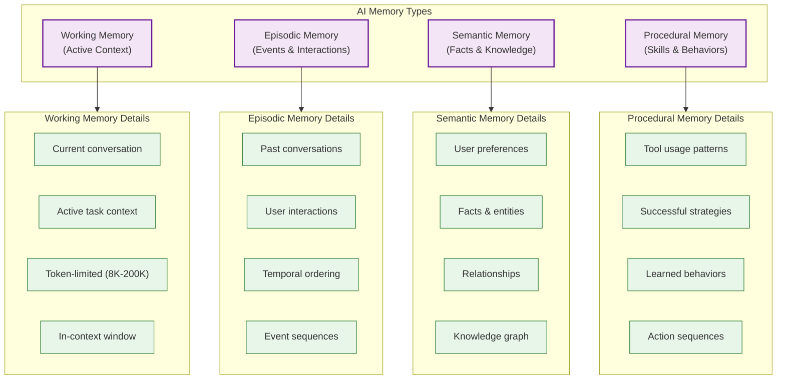
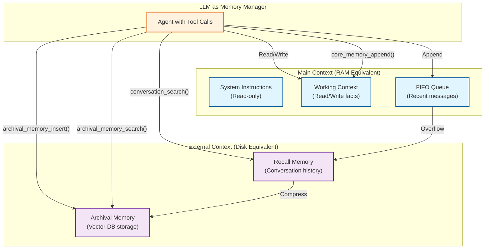
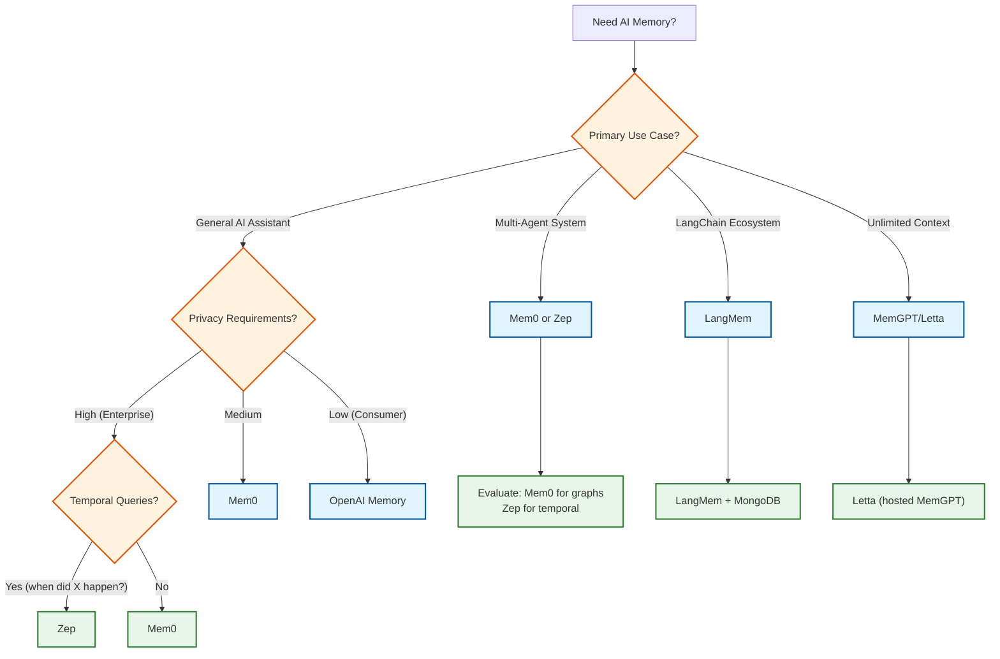
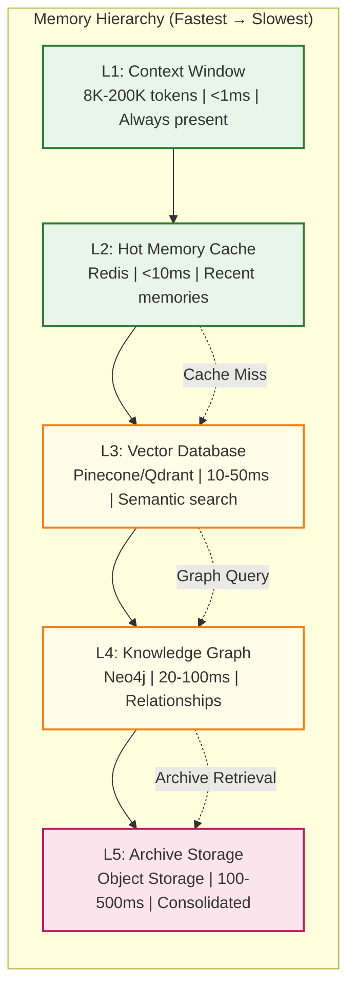

# AI Memory Management System

## System Overview

An **AI Memory Management System** provides persistent, contextual memory capabilities for LLMs and AI agents, enabling them to maintain conversation history, learn from interactions, and retrieve relevant context beyond the limitations of the context window. Unlike stateless LLM inference where each request is independent, memory systems bridge conversations across sessions, learn user preferences over time, and enable agents to build knowledge graphs from interactions.

The system orchestrates the complete memory lifecycle: **formation** (extracting memories from conversations), **storage** (hybrid vector + graph databases), **retrieval** (semantic + relational + temporal search), **consolidation** (compressing old memories), and **forgetting** (importance-based decay). Core platforms include Mem0 (graph-based memory), MemGPT/Letta (OS-inspired virtual context), Zep (temporal knowledge graphs), and LangMem (LangChain integration).

**Complexity Rating:** `Very High`

This system is complex due to:
- Multi-tier memory architecture (working, episodic, semantic, procedural) with different storage and retrieval patterns
- Hybrid storage combining vector databases, knowledge graphs, and relational stores
- Memory lifecycle management with consolidation, decay, and forgetting mechanisms
- Sub-100ms retrieval latency requirements at scale
- Multi-agent memory isolation and sharing with conflict resolution
- Temporal reasoning and bi-temporal data modeling for "when did X happen?" queries

---

## Quick Navigation

| Document | Description |
|----------|-------------|
| [01 - Requirements & Estimations](./01-requirements-and-estimations.md) | Functional/Non-functional requirements, capacity planning |
| [02 - High-Level Design](./02-high-level-design.md) | System architecture, data flows, component interactions |
| [03 - Low-Level Design](./03-low-level-design.md) | Data models, API specifications, core algorithms |
| [04 - Deep Dive & Bottlenecks](./04-deep-dive-and-bottlenecks.md) | Critical components, optimizations, failure modes |
| [05 - Scalability & Reliability](./05-scalability-and-reliability.md) | Scaling strategies, fault tolerance, disaster recovery |
| [06 - Security & Compliance](./06-security-and-compliance.md) | Privacy, threat model, regulatory compliance |
| [07 - Observability](./07-observability.md) | Metrics, logging, tracing, alerting |
| [08 - Interview Guide](./08-interview-guide.md) | Pacing, trade-offs, trap questions |

---

## Key Characteristics

| Aspect | Description |
|--------|-------------|
| **Cognitive-Inspired Architecture** | Memory types mirror human cognition: working (active context), episodic (events), semantic (facts), procedural (skills) |
| **Hybrid Storage Model** | Vector databases for semantic similarity, graph databases for relationships, relational for metadata |
| **Sub-100ms Retrieval** | Real-time memory injection into LLM prompts without perceptible latency |
| **Memory Lifecycle** | Formation → Evolution → Consolidation → Forgetting with importance-based decay |
| **Multi-Agent Support** | Private/shared memory scopes, handoff context, tenant isolation |
| **Self-Editing Memory** | Agents can update their own memories (MemGPT pattern) |

---

## Memory Type Taxonomy

### Memory Type Comparison

| Memory Type | Storage | Capacity | Lifetime | Retrieval | Example |
|-------------|---------|----------|----------|-----------|---------|
| **Working** | In-context (LLM window) | 8K-200K tokens | Session | Implicit (always present) | Current conversation |
| **Episodic** | Vector DB | Millions of events | Persistent | Semantic similarity | "Last Tuesday's meeting" |
| **Semantic** | Graph DB + Vector | Millions of facts | Persistent | Graph traversal + similarity | "User prefers dark mode" |
| **Procedural** | Action store | Thousands of patterns | Persistent | Pattern matching | "User likes code in Python" |

---

## Platform Comparison

| Platform | Memory Model | Storage Backend | Key Innovation | Benchmark Performance |
|----------|--------------|-----------------|----------------|----------------------|
| **Mem0** | Graph-based with entity extraction | Neo4j + Vector DB | Two-stage extraction pipeline (entities → relationships) | 26% improvement over OpenAI baseline, 91% lower latency |
| **MemGPT/Letta** | OS-inspired virtual context | Tiered (context → archival) | Self-editing memory, LLM-driven paging | 93.4% DMR accuracy |
| **Zep** | Temporal knowledge graph | PostgreSQL + pgvector | Bi-temporal modeling (event time + ingestion time) | 94.8% DMR accuracy, 18.5% LongMemEval improvement |
| **LangMem** | LangChain-integrated | Configurable (MongoDB, Vector DBs) | Episodic/semantic/procedural types, namespace-based | LangGraph native integration |
| **OpenAI Memory** | Saved memories + chat history | Managed (internal) | Cross-session continuity, user control | Production-validated |
| **Claude Memory** | File-based (CLAUDE.md) | Markdown files | Transparency, interpretability | Context-aware retrieval |

### MemGPT Virtual Context Architecture

---

## Platform Selection Decision Tree

---

## Memory Hierarchy (OS Analogy)

---

## Core Capabilities

### Memory Formation

| Stage | Process | Technology |
|-------|---------|------------|
| **Extraction** | LLM identifies entities, facts, events from conversation | GPT-4o-mini, Claude Haiku |
| **Embedding** | Convert text to vectors for semantic search | text-embedding-3-small, 1536 dimensions |
| **Relationship** | Build graph edges between entities | LLM-based relation extraction |
| **Scoring** | Calculate initial importance score | Recency + Relevance + Source |
| **Storage** | Write to appropriate memory tier | Vector DB + Graph DB |

### Memory Retrieval

| Method | Use Case | Latency |
|--------|----------|---------|
| **Vector Similarity** | "Find memories about user's coding preferences" | 10-30ms |
| **Graph Traversal** | "What's related to Python projects?" | 20-50ms |
| **Temporal Query** | "What did user say last week?" | 30-100ms |
| **Hybrid Fusion** | Combine all methods with RRF | 50-100ms |

### Memory Lifecycle

| Phase | Trigger | Action |
|-------|---------|--------|
| **Formation** | New conversation turn | Extract, embed, store |
| **Access** | LLM query | Retrieve, rank, inject |
| **Consolidation** | Token budget exceeded OR age threshold | Summarize, archive originals |
| **Forgetting** | Importance below threshold | Decay score, eventually delete |

---

## Key Metrics Reference

| Metric Category | Metric | Target | Description |
|-----------------|--------|--------|-------------|
| **Latency** | Memory retrieval (p95) | < 100ms | Time from query to ranked results |
| **Latency** | Memory write | < 200ms | Time to extract, embed, and store |
| **Latency** | Consolidation job | < 30s | Async batch consolidation |
| **Quality** | Retrieval relevance | > 90% | Human-labeled relevance assessment |
| **Quality** | Extraction accuracy | > 85% | Entity/fact extraction correctness |
| **Scale** | Memories per user | 1,000 avg | Typical user memory count |
| **Scale** | Total memories | 10B | Platform-wide at 10M users |
| **Benchmark** | Mem0 vs baseline | +26% | LLM-as-Judge improvement |
| **Benchmark** | Zep DMR accuracy | 94.8% | Deep Memory Retrieval benchmark |
| **Benchmark** | Zep LongMemEval | +18.5% | Accuracy improvement over baseline |

---

## Interview Preparation Checklist

### Must Know
- [ ] Difference between memory and RAG (dynamic vs static, personalized vs generic)
- [ ] Four memory types: working, episodic, semantic, procedural
- [ ] MemGPT's OS-inspired architecture (context as RAM, archival as disk)
- [ ] Importance scoring formula: recency × frequency × relevance
- [ ] Why hybrid storage (vector + graph) is necessary
- [ ] Memory lifecycle: formation → consolidation → forgetting

### Should Know
- [ ] Ebbinghaus forgetting curve and decay mechanisms
- [ ] Bi-temporal modeling in Zep (event time vs ingestion time)
- [ ] Hybrid retrieval with RRF (Reciprocal Rank Fusion)
- [ ] Multi-agent memory scopes (private, shared, global)
- [ ] Memory injection into LLM prompts
- [ ] Memory extraction using smaller LLMs

### Nice to Know
- [ ] Mem0's two-stage extraction pipeline
- [ ] MemGPT's self-editing memory with tool calls
- [ ] Spaced repetition concepts for memory reinforcement
- [ ] Cross-attention networks for retrieval optimization
- [ ] CLAUDE.md file-based memory approach
- [ ] Privacy implications of stored memories

---

## Related Systems

| System | Relationship |
|--------|--------------|
| [3.14 Vector Database](../3.14-vector-database/00-index.md) | Core storage for episodic memory embeddings |
| [3.15 RAG System](../3.15-rag-system/00-index.md) | Complementary (RAG for static knowledge, Memory for dynamic) |
| [3.17 AI Agent Orchestration](../3.17-ai-agent-orchestration-platform/00-index.md) | Memory consumer for single-agent systems |
| [3.21 LLM Gateway](../3.21-llm-gateway-prompt-management/00-index.md) | Memory injection into prompts |
| [3.24 Multi-Agent Orchestration](../3.24-multi-agent-orchestration-platform/00-index.md) | Shared memory for agent handoffs |

---

## References

### Industry Platforms
- [Mem0 Documentation](https://docs.mem0.ai/) - Graph-based memory layer
- [Letta (MemGPT) Documentation](https://docs.letta.com/) - OS-inspired virtual context
- [Zep Documentation](https://docs.getzep.com/) - Temporal knowledge graphs
- [LangMem SDK](https://github.com/langchain-ai/langmem) - LangChain memory integration

### Research & Papers
- [MemGPT: Towards LLMs as Operating Systems](https://arxiv.org/abs/2310.08560) - Virtual context management
- [Zep: Temporal Knowledge Graph Architecture](https://arxiv.org/abs/2501.13956) - Bi-temporal modeling
- [Mem0: Production-Ready AI Agents with Scalable Memory](https://arxiv.org/abs/2504.19413) - Graph-based memory
- [Memory in the Age of AI Agents](https://arxiv.org/abs/2512.13564) - Comprehensive survey

### Concepts
- Ebbinghaus Forgetting Curve - Memory decay research
- Spaced Repetition Systems - Memory reinforcement patterns
- KVzip, Dynamic Memory Sparsification - Compression techniques
