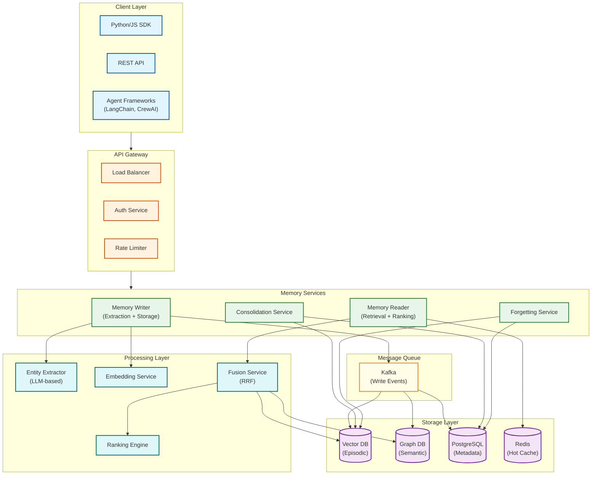
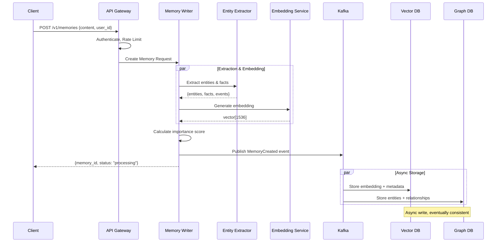
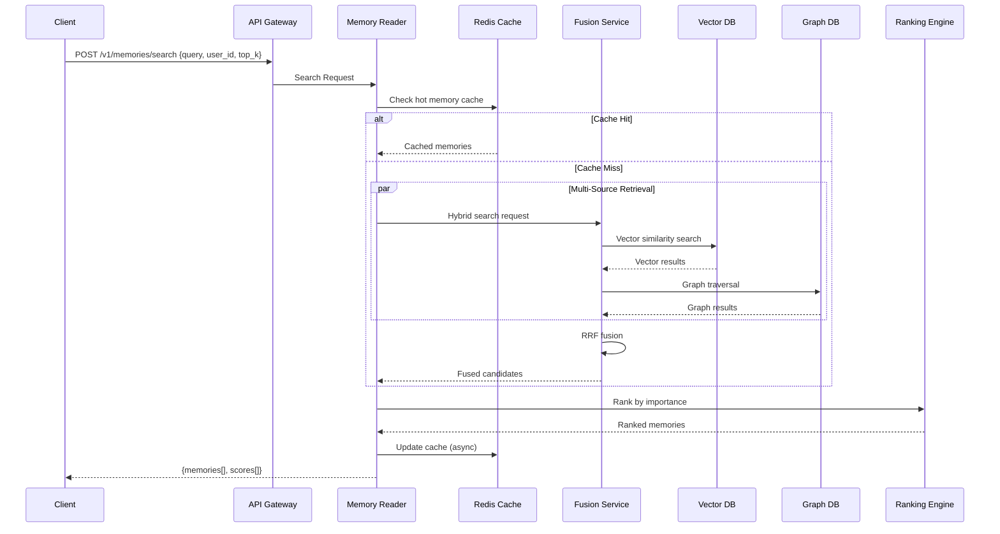
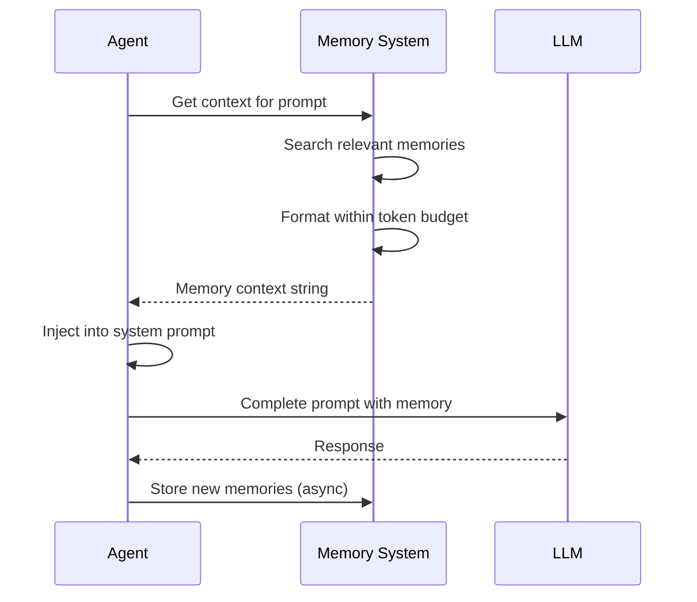
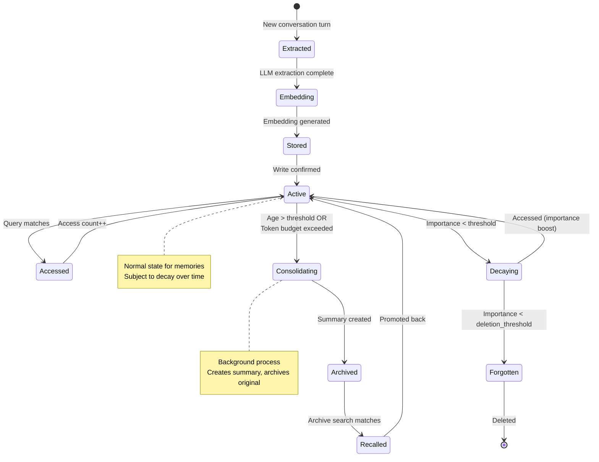
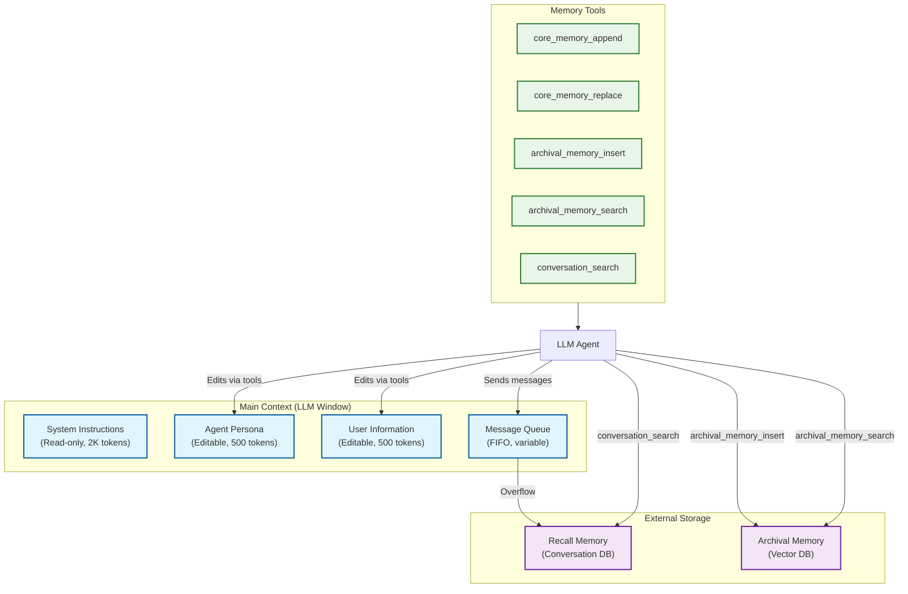
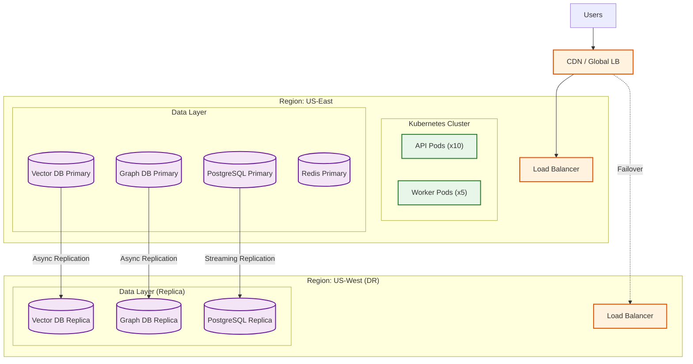

# High-Level Design

## System Architecture



---

## Component Descriptions

### Client Layer

| Component | Purpose | Integration |
|-----------|---------|-------------|
| **Python/JS SDK** | Native language bindings | `mem0.add()`, `mem0.search()` |
| **REST API** | HTTP interface for any language | Standard REST endpoints |
| **Agent Frameworks** | LangChain, CrewAI, Letta integrations | Memory tools for agents |

### API Gateway

| Component | Purpose | Configuration |
|-----------|---------|---------------|
| **Load Balancer** | Distribute traffic | Round-robin with health checks |
| **Auth Service** | Validate API keys, JWT | Per-request authentication |
| **Rate Limiter** | Protect from abuse | 1000 req/min per user |

### Memory Services

| Service | Responsibility | Scaling |
|---------|----------------|---------|
| **Memory Writer** | Extract, embed, store memories | Horizontal, queue-backed |
| **Memory Reader** | Retrieve, rank, return memories | Horizontal, cache-heavy |
| **Consolidation Service** | Compress old memories | Background workers |
| **Forgetting Service** | Decay and delete memories | Scheduled jobs |

### Processing Layer

| Component | Technology | Latency |
|-----------|------------|---------|
| **Entity Extractor** | GPT-4o-mini, Claude Haiku | 50-100ms |
| **Embedding Service** | text-embedding-3-small | 20-50ms |
| **Ranking Engine** | Custom scoring algorithm | 5-10ms |
| **Fusion Service** | Reciprocal Rank Fusion | 5ms |

### Storage Layer

| Store | Data | Technology Options |
|-------|------|-------------------|
| **Vector DB** | Embeddings, episodic memories | Pinecone, Weaviate, Qdrant, pgvector |
| **Graph DB** | Entities, relationships | Neo4j, Memgraph, Neptune |
| **PostgreSQL** | Metadata, user info, sessions | PostgreSQL with pgvector |
| **Redis** | Hot memory cache | Redis Cluster |

---

## Data Flow: Memory Formation



### Formation Pipeline Steps

| Step | Input | Output | Latency |
|------|-------|--------|---------|
| 1. Receive | Conversation turn | Validated request | 5ms |
| 2. Extract | Raw text | Entities, facts, events | 50-100ms |
| 3. Embed | Text content | 1536-dim vector | 20-50ms |
| 4. Score | Memory + context | Importance score | 5ms |
| 5. Queue | Memory object | Event published | 5ms |
| 6. Store | Event | Persisted data | Async |
| **Total (sync)** | | | **85-165ms** |

---

## Data Flow: Memory Retrieval



### Retrieval Pipeline Steps

| Step | Input | Output | Latency |
|------|-------|--------|---------|
| 1. Parse | Query string | Validated request | 2ms |
| 2. Cache Check | user_id + query hash | Hit or miss | 2ms |
| 3. Embed Query | Query text | Query vector | 20ms |
| 4. Vector Search | Query vector | Top-K candidates | 15-30ms |
| 5. Graph Traversal | Recent memory IDs | Related memories | 20-40ms |
| 6. RRF Fusion | Multiple result sets | Unified ranking | 5ms |
| 7. Importance Rank | Candidates | Final ranking | 5ms |
| 8. Format | Memories | Response | 2ms |
| **Total** | | | **70-105ms** |

---

## Data Flow: Context Injection



### Context Injection Format

```
<system>
You are a helpful assistant with access to the user's memory.

<user_memories>
- User prefers Python for coding tasks
- User's name is Alex, works at TechCorp
- Last week, user asked about Kubernetes deployment
- User is working on a machine learning project
</user_memories>

Use this context to personalize your responses.
</system>
```

---

## Memory Lifecycle State Machine



### State Transitions

| From | To | Trigger | Action |
|------|-----|---------|--------|
| Extracted | Embedding | Extraction complete | Generate embedding |
| Embedding | Stored | Embedding ready | Write to storage |
| Stored | Active | Write confirmed | Available for retrieval |
| Active | Accessed | Query match | Increment access count |
| Active | Consolidating | Age/budget trigger | Start consolidation job |
| Consolidating | Archived | Summary created | Archive original |
| Active | Decaying | Low importance | Apply decay function |
| Decaying | Forgotten | Below threshold | Schedule deletion |
| Decaying | Active | Access | Boost importance |

---

## Key Architectural Decisions

### Decision 1: Hybrid Storage Model

| Option | Pros | Cons | Decision |
|--------|------|------|----------|
| **Vector-only** | Simple, fast similarity search | No relationship queries | |
| **Graph-only** | Rich relationships | Poor semantic search | |
| **Hybrid (Vector + Graph)** | Best of both | Complexity, sync needed | **Selected** |

**Rationale:** Different query patterns require different storage. "Find memories about Python" uses vector similarity. "What else do I know about this project?" uses graph traversal. Hybrid enables both.

### Decision 2: Retrieval Strategy

| Option | Pros | Cons | Decision |
|--------|------|------|----------|
| **Dense only** | Fast, simple | Misses keyword matches | |
| **Sparse only** | Exact matches | Misses semantic | |
| **Hybrid (Dense + Sparse + Temporal)** | Best recall | Latency cost | **Selected** |

**Rationale:** Memory queries are diverse. "meeting with Sarah" needs keyword match. "discussions about scaling" needs semantic. "last week's conversation" needs temporal. Fusion with RRF combines all.

### Decision 3: Consolidation Trigger

| Option | Pros | Cons | Decision |
|--------|------|------|----------|
| **Time-based** | Predictable | May consolidate prematurely | |
| **Token budget** | Efficient for LLM | May delay needed consolidation | |
| **Hybrid (Time OR Budget)** | Balanced | More complex | **Selected** |

**Rationale:** Time-based ensures old memories don't linger. Budget-based ensures active users don't hit limits. Combining catches both scenarios.

### Decision 4: Async vs Sync Writes

| Option | Pros | Cons | Decision |
|--------|------|------|----------|
| **Synchronous** | Immediate consistency | Higher latency | |
| **Asynchronous** | Lower latency | Eventual consistency | **Selected** |

**Rationale:** Memory writes shouldn't block agent responses. Users expect immediate responses, and memories being available on the *next* turn is acceptable.

### Decision 5: Memory Extraction Model

| Option | Pros | Cons | Decision |
|--------|------|------|----------|
| **Large LLM (GPT-4)** | Best accuracy | Expensive, slow | |
| **Small LLM (GPT-4o-mini)** | Good accuracy, fast, cheap | Slightly lower quality | **Selected** |
| **Fine-tuned model** | Best for domain | Training overhead | For enterprise |

**Rationale:** Extraction is high-volume. Small models provide 85%+ accuracy at 10x lower cost and 5x lower latency.

---

## Technology Choices

### Vector Database Selection

| Technology | Use Case | Pros | Cons |
|------------|----------|------|------|
| **Pinecone** | Managed, high-scale | Serverless, auto-scaling | Vendor lock-in |
| **Weaviate** | Self-hosted, hybrid | Vector + BM25, GraphQL | Ops overhead |
| **Qdrant** | Performance-critical | Rust, low latency | Smaller ecosystem |
| **pgvector** | PostgreSQL integration | Single database | Scale limits |

**Recommendation:** Pinecone for managed production, pgvector for startups/cost-sensitive.

### Graph Database Selection

| Technology | Use Case | Pros | Cons |
|------------|----------|------|------|
| **Neo4j** | Full-featured graphs | Rich query language | Cost at scale |
| **Memgraph** | Real-time graphs | Performance | Smaller community |
| **Neptune** | AWS ecosystem | Managed | AWS lock-in |

**Recommendation:** Neo4j for feature richness, Memgraph for latency-critical.

### Message Queue Selection

| Technology | Use Case | Pros | Cons |
|------------|----------|------|------|
| **Kafka** | High-throughput events | Durability, replay | Complexity |
| **Redis Streams** | Low-latency | Simple, fast | Less durable |
| **SQS** | AWS managed | Serverless | AWS-only |

**Recommendation:** Kafka for durability and event replay (consolidation auditing).

---

## MemGPT Virtual Context Architecture

The MemGPT approach treats the LLM as an "operating system" that manages its own memory:



### MemGPT Memory Tools

| Tool | Purpose | When Used |
|------|---------|-----------|
| `core_memory_append` | Add to persona/human block | Learn new permanent facts |
| `core_memory_replace` | Update persona/human block | Correct outdated information |
| `archival_memory_insert` | Store to vector DB | Save important details for later |
| `archival_memory_search` | Query vector DB | Retrieve specific past information |
| `conversation_search` | Search conversation history | Find what was discussed when |

---

## Architecture Pattern Checklist

| Pattern | Decision | Rationale |
|---------|----------|-----------|
| **Sync vs Async** | Async writes, sync reads | Writes shouldn't block responses |
| **Event-driven vs Request-response** | Both | Events for writes, request-response for reads |
| **Push vs Pull** | Pull (query-based) | Memories retrieved on demand |
| **Stateless vs Stateful services** | Stateless | State in storage layer |
| **Read-heavy vs Write-heavy** | Read-heavy (5:1) | More retrievals than new memories |
| **Real-time vs Batch** | Real-time reads, batch consolidation | Different latency requirements |
| **Edge vs Origin** | Origin (centralized) | Memory must be consistent |

---

## Integration Points

### LangChain Integration

```python
from langchain.memory import Mem0Memory

memory = Mem0Memory(
    api_key="...",
    user_id="user_123"
)

# In agent
agent = create_react_agent(
    llm=llm,
    tools=tools,
    memory=memory  # Automatic memory injection
)
```

### Direct API Integration

```python
import mem0

client = mem0.Client(api_key="...")

# Add memory
client.add(
    messages=[{"role": "user", "content": "I prefer Python"}],
    user_id="user_123"
)

# Search
results = client.search(
    query="coding preferences",
    user_id="user_123",
    limit=5
)

# Get context for prompt
context = client.get_context(
    query="help with coding",
    user_id="user_123",
    max_tokens=500
)
```

---

## Deployment Architecture


