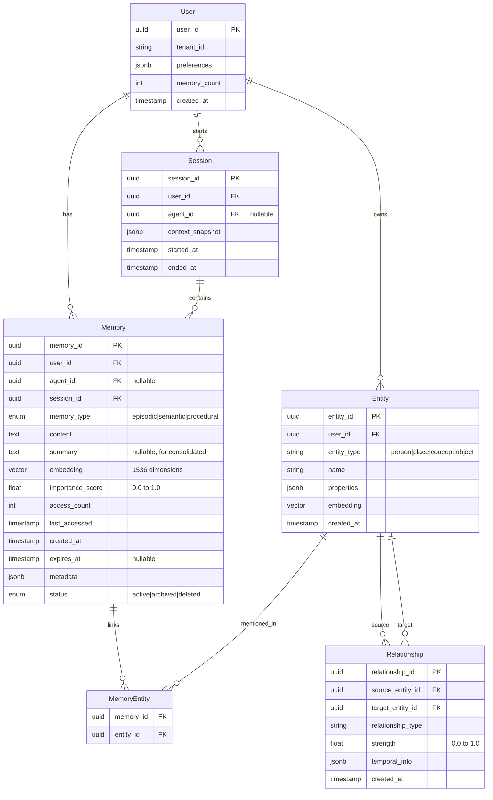

# Low-Level Design

## Data Models

### Memory Entity Schema



### Core Entity Definitions

#### Memory

```yaml
Memory:
  memory_id: uuid           # Primary key, UUID v7 for time-ordering
  user_id: uuid             # Owner user (required for isolation)
  agent_id: uuid            # Optional, for multi-agent systems
  session_id: uuid          # Conversation session reference

  memory_type: enum
    - EPISODIC              # Events, conversations
    - SEMANTIC              # Facts, knowledge
    - PROCEDURAL            # Learned behaviors

  content: text             # Raw memory content (max 100KB)
  summary: text             # Compressed version (for archived)

  embedding: vector[1536]   # Semantic embedding
  embedding_model: string   # Model used (for versioning)

  importance_score: float   # 0.0 to 1.0, used for ranking and decay
  access_count: int         # Times retrieved
  last_accessed: timestamp  # For recency calculation

  created_at: timestamp
  expires_at: timestamp     # Optional TTL

  metadata: jsonb
    source: enum            # user_input | extraction | consolidation
    confidence: float       # Extraction confidence
    tags: string[]          # User-defined tags
    entities: uuid[]        # Linked entity IDs
    turn_id: uuid           # Conversation turn reference

  status: enum
    - ACTIVE                # Normal state
    - ARCHIVED              # Consolidated, compressed
    - DELETED               # Soft delete
```

#### Entity (for Knowledge Graph)

```yaml
Entity:
  entity_id: uuid
  user_id: uuid             # Owner for isolation

  entity_type: enum
    - PERSON                # Names, contacts
    - PLACE                 # Locations
    - ORGANIZATION          # Companies, teams
    - CONCEPT               # Abstract ideas
    - OBJECT                # Physical items
    - EVENT                 # Happenings
    - PREFERENCE            # User preferences

  name: string              # Entity name
  canonical_name: string    # Normalized form for dedup

  properties: jsonb         # Type-specific attributes
    # PERSON: {title, company, relationship}
    # PLACE: {address, coordinates}
    # PREFERENCE: {category, value, confidence}

  embedding: vector[1536]   # For semantic matching
  mention_count: int        # Frequency

  created_at: timestamp
  updated_at: timestamp
```

#### Relationship (Graph Edges)

```yaml
Relationship:
  relationship_id: uuid
  source_entity_id: uuid
  target_entity_id: uuid

  relationship_type: string # Flexible, e.g., "works_at", "likes", "related_to"

  strength: float           # 0.0 to 1.0
  confidence: float         # Extraction confidence

  temporal_info: jsonb
    valid_from: timestamp   # When relationship started
    valid_to: timestamp     # When ended (null = ongoing)
    event_time: timestamp   # When the event occurred
    ingestion_time: timestamp # When we learned about it

  source_memories: uuid[]   # Memories that established this

  created_at: timestamp
  updated_at: timestamp
```

---

## Database Indexes

### Vector Database (Episodic Memories)

```sql
-- HNSW index for fast approximate nearest neighbor
CREATE INDEX idx_memory_embedding ON memories
USING hnsw (embedding vector_cosine_ops)
WITH (m = 16, ef_construction = 64);

-- Metadata filtering support
CREATE INDEX idx_memory_user_type ON memories (user_id, memory_type);
CREATE INDEX idx_memory_user_created ON memories (user_id, created_at DESC);
CREATE INDEX idx_memory_user_importance ON memories (user_id, importance_score DESC);

-- Status filter for active memories only
CREATE INDEX idx_memory_user_active ON memories (user_id)
WHERE status = 'ACTIVE';
```

### Graph Database (Neo4j)

```cypher
// Entity indexes
CREATE INDEX entity_user_id FOR (e:Entity) ON (e.user_id);
CREATE INDEX entity_type FOR (e:Entity) ON (e.entity_type);
CREATE INDEX entity_name FOR (e:Entity) ON (e.canonical_name);

// Full-text search on entity names
CREATE FULLTEXT INDEX entity_name_fulltext FOR (e:Entity) ON EACH [e.name];

// Relationship indexes
CREATE INDEX rel_type FOR ()-[r:RELATES]-() ON (r.relationship_type);
```

### PostgreSQL (Metadata)

```sql
-- Primary queries
CREATE INDEX idx_session_user ON sessions (user_id, started_at DESC);
CREATE INDEX idx_memory_session ON memories (session_id);

-- JSONB metadata queries
CREATE INDEX idx_memory_metadata ON memories USING GIN (metadata);

-- Consolidation candidates
CREATE INDEX idx_memory_consolidation ON memories (user_id, created_at)
WHERE status = 'ACTIVE' AND importance_score < 0.5;
```

---

## API Design

### Memory Management APIs

#### Create Memory

```yaml
POST /v1/memories
Authorization: Bearer {api_key}

Request:
  user_id: string           # Required
  agent_id: string          # Optional
  content: string           # Memory content (required)
  memory_type: enum         # Optional, auto-detected if not provided
  metadata: object          # Optional
    tags: string[]
    source: string

Response:
  memory_id: string
  status: "processing" | "complete"
  importance_score: float
  extracted_entities: object[]
    entity_id: string
    name: string
    type: string

Example:
  POST /v1/memories
  {
    "user_id": "user_123",
    "content": "I prefer using Python for data science projects. My name is Alex.",
    "metadata": {"source": "conversation"}
  }

  Response:
  {
    "memory_id": "mem_abc123",
    "status": "processing",
    "importance_score": 0.75,
    "extracted_entities": [
      {"entity_id": "ent_1", "name": "Python", "type": "CONCEPT"},
      {"entity_id": "ent_2", "name": "Alex", "type": "PERSON"}
    ]
  }
```

#### Search Memories

```yaml
POST /v1/memories/search
Authorization: Bearer {api_key}

Request:
  user_id: string           # Required
  query: string             # Search query
  top_k: int                # Number of results (default: 10, max: 100)
  memory_types: string[]    # Filter by type
  time_range: object        # Optional temporal filter
    start: timestamp
    end: timestamp
  min_importance: float     # Filter by importance (0.0-1.0)
  include_archived: bool    # Include archived memories

Response:
  memories: object[]
    memory_id: string
    content: string
    memory_type: string
    importance_score: float
    relevance_score: float
    created_at: timestamp
    metadata: object
  total_count: int
  query_time_ms: int

Example:
  POST /v1/memories/search
  {
    "user_id": "user_123",
    "query": "coding preferences",
    "top_k": 5,
    "memory_types": ["SEMANTIC", "PROCEDURAL"]
  }
```

#### Get Context for Prompt

```yaml
POST /v1/memories/context
Authorization: Bearer {api_key}

Request:
  user_id: string           # Required
  query: string             # Current user message
  max_tokens: int           # Token budget (default: 500)
  format: enum              # "markdown" | "xml" | "json"

Response:
  context: string           # Formatted memory context
  memories_used: int
  tokens_used: int
  truncated: bool

Example Response:
  {
    "context": "<user_context>\n- Name: Alex\n- Prefers Python for coding\n- Working on ML project\n</user_context>",
    "memories_used": 3,
    "tokens_used": 45,
    "truncated": false
  }
```

#### Update Memory

```yaml
PATCH /v1/memories/{memory_id}
Authorization: Bearer {api_key}

Request:
  content: string           # New content
  importance_score: float   # Override score
  metadata: object          # Merge metadata
  status: enum              # "active" | "archived" | "deleted"

Response:
  memory_id: string
  updated: bool
  new_importance_score: float
```

#### Trigger Consolidation

```yaml
POST /v1/memories/consolidate
Authorization: Bearer {api_key}

Request:
  user_id: string
  strategy: enum            # "age_based" | "importance_based" | "token_budget"
  threshold: object         # Strategy-specific
    max_age_days: int       # For age_based
    min_importance: float   # For importance_based
    target_tokens: int      # For token_budget

Response:
  job_id: string
  estimated_memories: int
  estimated_time_seconds: int
```

### Graph APIs

#### Query Related Memories

```yaml
POST /v1/memories/related
Authorization: Bearer {api_key}

Request:
  user_id: string
  memory_id: string         # Starting memory
  relationship_types: string[] # Filter relationships
  max_depth: int            # Graph traversal depth (default: 2)
  limit: int                # Max results

Response:
  related_memories: object[]
    memory_id: string
    content: string
    relationship_path: string[]  # How it's connected
    depth: int
```

---

## Core Algorithms

### Memory Extraction Algorithm

```
ALGORITHM ExtractMemories(conversation_turn, user_context)
═══════════════════════════════════════════════════════════

INPUT:
  conversation_turn: string     # Current message
  user_context: object          # Existing user info

OUTPUT:
  memories: list[Memory]

PROCEDURE:

1. BUILD EXTRACTION PROMPT
   ┌─────────────────────────────────────────────────────────┐
   │ prompt = """                                            │
   │ Extract key information from this conversation turn.    │
   │                                                         │
   │ User context: {user_context}                            │
   │ Message: {conversation_turn}                            │
   │                                                         │
   │ Extract:                                                │
   │ 1. Facts (semantic): Permanent truths about user        │
   │ 2. Events (episodic): What happened, when               │
   │ 3. Preferences (procedural): How user likes things done │
   │                                                         │
   │ Return JSON: {facts: [], events: [], preferences: []}   │
   │ """                                                     │
   └─────────────────────────────────────────────────────────┘

2. CALL EXTRACTION LLM
   response = llm.generate(prompt, model="gpt-4o-mini")
   extracted = parse_json(response)

3. CREATE MEMORY OBJECTS
   memories = []

   FOR fact IN extracted.facts DO
       memory = Memory(
           memory_type: SEMANTIC,
           content: fact.description,
           importance_score: fact.confidence * 0.8,
           metadata: {
               source: "extraction",
               confidence: fact.confidence,
               entities: extract_entity_ids(fact)
           }
       )
       memories.append(memory)
   END FOR

   FOR event IN extracted.events DO
       memory = Memory(
           memory_type: EPISODIC,
           content: event.description,
           importance_score: 0.6,  # Events start medium
           metadata: {
               source: "extraction",
               timestamp: event.time,
               participants: event.actors
           }
       )
       memories.append(memory)
   END FOR

   FOR pref IN extracted.preferences DO
       memory = Memory(
           memory_type: PROCEDURAL,
           content: pref.description,
           importance_score: pref.confidence * 0.9,  # Preferences valued
           metadata: {
               source: "extraction",
               category: pref.category
           }
       )
       memories.append(memory)
   END FOR

4. DEDUPLICATE
   FOR memory IN memories DO
       existing = find_similar(memory, threshold=0.95)
       IF existing THEN
           existing.access_count += 1
           existing.importance_score = boost(existing.importance_score)
           REMOVE memory FROM memories
       END IF
   END FOR

5. RETURN memories

COMPLEXITY: O(n) where n = number of extracted items
LATENCY: 50-100ms (LLM call dominant)
```

### Importance Scoring Algorithm

```
ALGORITHM ComputeImportanceScore(memory, context)
═════════════════════════════════════════════════

INPUT:
  memory: Memory object
  context: Current query context

OUTPUT:
  score: float (0.0 to 1.0)

CONSTANTS:
  RECENCY_WEIGHT = 0.3
  FREQUENCY_WEIGHT = 0.3
  RELEVANCE_WEIGHT = 0.4
  DECAY_CONSTANT = 30 days  # Half-life for recency

PROCEDURE:

1. CALCULATE RECENCY SCORE
   ┌────────────────────────────────────────────────────┐
   │ age_days = (now() - memory.last_accessed).days    │
   │ recency_score = exp(-age_days / DECAY_CONSTANT)   │
   │                                                    │
   │ # Boost if accessed recently                       │
   │ IF age_days < 1 THEN                              │
   │     recency_score = min(1.0, recency_score * 1.2) │
   │ END IF                                            │
   └────────────────────────────────────────────────────┘

2. CALCULATE FREQUENCY SCORE
   ┌────────────────────────────────────────────────────┐
   │ # Logarithmic to prevent runaway scores           │
   │ frequency_score = log(1 + memory.access_count)    │
   │                   / log(1 + MAX_ACCESS_COUNT)     │
   │                                                    │
   │ # Cap at 1.0                                      │
   │ frequency_score = min(1.0, frequency_score)       │
   └────────────────────────────────────────────────────┘

3. CALCULATE RELEVANCE SCORE
   ┌────────────────────────────────────────────────────┐
   │ IF context.embedding EXISTS THEN                  │
   │     relevance_score = cosine_similarity(          │
   │         memory.embedding,                         │
   │         context.embedding                         │
   │     )                                             │
   │ ELSE                                              │
   │     relevance_score = 0.5  # Default when no ctx  │
   │ END IF                                            │
   └────────────────────────────────────────────────────┘

4. APPLY TYPE-BASED BOOST
   ┌────────────────────────────────────────────────────┐
   │ type_boost = 1.0                                  │
   │                                                    │
   │ IF memory.memory_type == SEMANTIC THEN            │
   │     type_boost = 1.1  # Facts are valuable        │
   │ ELSE IF memory.memory_type == PROCEDURAL THEN     │
   │     type_boost = 1.15  # Preferences very valuable│
   │ END IF                                            │
   └────────────────────────────────────────────────────┘

5. APPLY USER-MARKED BOOST
   ┌────────────────────────────────────────────────────┐
   │ IF memory.metadata.user_marked_important THEN     │
   │     user_boost = 1.5                              │
   │ ELSE                                              │
   │     user_boost = 1.0                              │
   │ END IF                                            │
   └────────────────────────────────────────────────────┘

6. COMBINE SCORES
   ┌────────────────────────────────────────────────────┐
   │ base_score = (RECENCY_WEIGHT * recency_score) +   │
   │              (FREQUENCY_WEIGHT * frequency_score) +│
   │              (RELEVANCE_WEIGHT * relevance_score)  │
   │                                                    │
   │ final_score = base_score * type_boost * user_boost│
   │ final_score = min(1.0, final_score)               │
   └────────────────────────────────────────────────────┘

7. RETURN final_score

COMPLEXITY: O(1)
LATENCY: <1ms (cosine similarity pre-computed during retrieval)
```

### Hybrid Retrieval Algorithm

```
ALGORITHM HybridRetrieve(query, user_id, top_k, options)
════════════════════════════════════════════════════════

INPUT:
  query: string                 # Search query
  user_id: string               # User for isolation
  top_k: int                    # Number of results
  options: object
    include_graph: bool         # Enable graph traversal
    include_temporal: bool      # Enable time filtering
    time_range: [start, end]    # Optional time filter

OUTPUT:
  memories: list[Memory]        # Ranked results

PROCEDURE:

1. EMBED QUERY
   ┌────────────────────────────────────────────────────┐
   │ query_embedding = embed(query)  # 20ms            │
   └────────────────────────────────────────────────────┘

2. VECTOR SIMILARITY SEARCH (Dense Retrieval)
   ┌────────────────────────────────────────────────────┐
   │ vector_results = vector_db.search(                │
   │     embedding: query_embedding,                   │
   │     filter: {user_id: user_id, status: "ACTIVE"}, │
   │     limit: top_k * 3  # Over-fetch for fusion     │
   │ )                                                  │
   │                                                    │
   │ # Returns: [{memory_id, score, content}, ...]     │
   │ # Latency: 15-30ms                                │
   └────────────────────────────────────────────────────┘

3. KEYWORD SEARCH (Sparse Retrieval) - Optional
   ┌────────────────────────────────────────────────────┐
   │ IF options.include_sparse THEN                    │
   │     sparse_results = text_search.bm25(            │
   │         query: query,                             │
   │         filter: {user_id: user_id},               │
   │         limit: top_k * 2                          │
   │     )                                             │
   │ END IF                                            │
   │ # Latency: 10-20ms                                │
   └────────────────────────────────────────────────────┘

4. GRAPH TRAVERSAL
   ┌────────────────────────────────────────────────────┐
   │ IF options.include_graph THEN                     │
   │     # Get recent memory IDs as starting points    │
   │     recent_ids = get_recent_memories(user_id, 5)  │
   │                                                    │
   │     # Traverse relationships                      │
   │     graph_results = graph_db.query("""            │
   │         MATCH (m:Memory)-[r:RELATES*1..2]-(n:Memory)│
   │         WHERE m.memory_id IN $recent_ids          │
   │           AND n.user_id = $user_id                │
   │         RETURN n, length(r) as depth              │
   │         ORDER BY depth, n.importance_score DESC   │
   │         LIMIT $limit                              │
   │     """, recent_ids, user_id, top_k * 2)         │
   │ END IF                                            │
   │ # Latency: 20-40ms                                │
   └────────────────────────────────────────────────────┘

5. TEMPORAL FILTERING
   ┌────────────────────────────────────────────────────┐
   │ IF options.include_temporal AND time_range THEN   │
   │     temporal_results = filter_by_time(            │
   │         vector_results + graph_results,           │
   │         time_range.start,                         │
   │         time_range.end                            │
   │     )                                             │
   │ END IF                                            │
   └────────────────────────────────────────────────────┘

6. RECIPROCAL RANK FUSION (RRF)
   ┌────────────────────────────────────────────────────┐
   │ # RRF formula: score = Σ 1/(k + rank_i)          │
   │ # where k = 60 (standard constant)                │
   │                                                    │
   │ K = 60                                            │
   │ fused_scores = {}                                 │
   │                                                    │
   │ FOR result_set IN [vector, sparse, graph] DO      │
   │     FOR rank, memory IN enumerate(result_set) DO  │
   │         IF memory.id NOT IN fused_scores THEN     │
   │             fused_scores[memory.id] = 0           │
   │         END IF                                    │
   │         fused_scores[memory.id] += 1 / (K + rank) │
   │     END FOR                                       │
   │ END FOR                                           │
   └────────────────────────────────────────────────────┘

7. IMPORTANCE-BASED RERANKING
   ┌────────────────────────────────────────────────────┐
   │ FOR memory_id, rrf_score IN fused_scores DO       │
   │     memory = fetch_memory(memory_id)              │
   │     importance = compute_importance(memory, query)│
   │                                                    │
   │     # Final score combines retrieval + importance │
   │     final_score = (0.6 * rrf_score) +             │
   │                   (0.4 * importance)              │
   │                                                    │
   │     memory.final_score = final_score              │
   │ END FOR                                           │
   └────────────────────────────────────────────────────┘

8. RETURN top_k memories sorted by final_score DESC

COMPLEXITY: O(n log n) for sorting, O(1) for vector search
TOTAL LATENCY: 50-100ms
```

### Memory Consolidation Algorithm

```
ALGORITHM ConsolidateMemories(user_id, strategy, config)
════════════════════════════════════════════════════════

INPUT:
  user_id: string
  strategy: enum {AGE_BASED, IMPORTANCE_BASED, TOKEN_BUDGET}
  config: object
    max_age_days: int           # For AGE_BASED
    importance_threshold: float # For IMPORTANCE_BASED
    target_token_count: int     # For TOKEN_BUDGET

OUTPUT:
  job_result: object
    consolidated_count: int
    archived_count: int
    tokens_saved: int

PROCEDURE:

1. SELECT CONSOLIDATION CANDIDATES
   ┌────────────────────────────────────────────────────┐
   │ IF strategy == AGE_BASED THEN                     │
   │     candidates = SELECT * FROM memories           │
   │         WHERE user_id = user_id                   │
   │           AND status = 'ACTIVE'                   │
   │           AND created_at < now() - max_age_days   │
   │         ORDER BY created_at ASC                   │
   │                                                    │
   │ ELSE IF strategy == IMPORTANCE_BASED THEN         │
   │     candidates = SELECT * FROM memories           │
   │         WHERE user_id = user_id                   │
   │           AND status = 'ACTIVE'                   │
   │           AND importance_score < threshold        │
   │         ORDER BY importance_score ASC             │
   │                                                    │
   │ ELSE IF strategy == TOKEN_BUDGET THEN             │
   │     # Get all memories sorted by importance       │
   │     all_memories = SELECT * FROM memories         │
   │         WHERE user_id = user_id                   │
   │           AND status = 'ACTIVE'                   │
   │         ORDER BY importance_score DESC            │
   │                                                    │
   │     # Find cutoff where tokens exceed budget      │
   │     running_tokens = 0                            │
   │     FOR memory IN all_memories DO                 │
   │         running_tokens += token_count(memory)     │
   │         IF running_tokens > target_token_count THEN│
   │             candidates.append(memory)             │
   │         END IF                                    │
   │     END FOR                                       │
   │ END IF                                            │
   └────────────────────────────────────────────────────┘

2. CLUSTER SIMILAR MEMORIES
   ┌────────────────────────────────────────────────────┐
   │ # Group by semantic similarity for better summaries│
   │ clusters = []                                     │
   │ clustered = set()                                 │
   │                                                    │
   │ FOR memory IN candidates DO                       │
   │     IF memory.id IN clustered THEN CONTINUE       │
   │                                                    │
   │     # Find similar memories                       │
   │     similar = vector_db.search(                   │
   │         embedding: memory.embedding,              │
   │         filter: {id IN candidates, id != memory.id},│
   │         threshold: 0.85                           │
   │     )                                             │
   │                                                    │
   │     cluster = [memory] + similar                  │
   │     clusters.append(cluster)                      │
   │     clustered.update([m.id for m in cluster])    │
   │ END FOR                                           │
   └────────────────────────────────────────────────────┘

3. SUMMARIZE CLUSTERS
   ┌────────────────────────────────────────────────────┐
   │ FOR cluster IN clusters DO                        │
   │     IF len(cluster) == 1 THEN                     │
   │         # Single memory, just archive as-is       │
   │         archive_memory(cluster[0])                │
   │         CONTINUE                                  │
   │     END IF                                        │
   │                                                    │
   │     # Create summary using LLM                    │
   │     contents = [m.content for m in cluster]       │
   │     summary_prompt = f"""                         │
   │         Summarize these related memories into a   │
   │         single concise memory that preserves      │
   │         key information:                          │
   │                                                    │
   │         Memories:                                 │
   │         {contents}                                │
   │                                                    │
   │         Summary (max 200 words):                  │
   │     """                                           │
   │                                                    │
   │     summary = llm.generate(summary_prompt)        │
   └────────────────────────────────────────────────────┘

4. CREATE CONSOLIDATED MEMORY
   ┌────────────────────────────────────────────────────┐
   │     # Aggregate importance from cluster           │
   │     max_importance = max(m.importance for m in cluster)│
   │     total_access = sum(m.access_count for m in cluster)│
   │                                                    │
   │     consolidated = Memory(                        │
   │         memory_type: SEMANTIC,  # Summaries are facts│
   │         content: summary,                         │
   │         importance_score: max_importance * 0.9,   │
   │         access_count: total_access,               │
   │         metadata: {                               │
   │             source: "consolidation",              │
   │             original_memories: [m.id for m in cluster],│
   │             original_count: len(cluster)          │
   │         }                                         │
   │     )                                             │
   │                                                    │
   │     # Generate embedding for summary              │
   │     consolidated.embedding = embed(summary)       │
   │                                                    │
   │     # Save consolidated memory                    │
   │     save_memory(consolidated)                     │
   └────────────────────────────────────────────────────┘

5. ARCHIVE ORIGINAL MEMORIES
   ┌────────────────────────────────────────────────────┐
   │     FOR memory IN cluster DO                      │
   │         memory.status = 'ARCHIVED'                │
   │         memory.metadata.consolidated_into = consolidated.id│
   │         update_memory(memory)                     │
   │     END FOR                                       │
   │ END FOR                                           │
   └────────────────────────────────────────────────────┘

6. RETURN job_result

COMPLEXITY: O(n²) for clustering, O(n) for summarization
LATENCY: 5-30s depending on candidate count
```

### Ebbinghaus Forgetting Algorithm

```
ALGORITHM ApplyForgetting(user_id, config)
══════════════════════════════════════════

INPUT:
  user_id: string
  config: object
    decay_constant: float       # Days for half-life (default: 30)
    min_importance: float       # Deletion threshold (default: 0.05)
    boost_on_access: float      # Access boost factor (default: 1.2)

OUTPUT:
  result: object
    decayed_count: int
    deleted_count: int
    boosted_count: int

PROCEDURE:

1. GET ACTIVE MEMORIES
   ┌────────────────────────────────────────────────────┐
   │ memories = SELECT * FROM memories                 │
   │     WHERE user_id = user_id                       │
   │       AND status = 'ACTIVE'                       │
   └────────────────────────────────────────────────────┘

2. APPLY EBBINGHAUS DECAY
   ┌────────────────────────────────────────────────────┐
   │ current_time = now()                              │
   │                                                    │
   │ FOR memory IN memories DO                         │
   │     # Calculate time since last access            │
   │     time_elapsed = (current_time - memory.last_accessed)│
   │     days_elapsed = time_elapsed.total_days()      │
   │                                                    │
   │     # Compute stability based on access pattern   │
   │     # More accesses = more stable = slower decay  │
   │     stability = compute_stability(memory)         │
   │                                                    │
   │     # Ebbinghaus formula: R = e^(-t/S)           │
   │     # R = retention, t = time, S = stability      │
   │     retention = exp(-days_elapsed / stability)    │
   │                                                    │
   │     # Apply retention to importance score         │
   │     new_importance = memory.importance_score * retention│
   │                                                    │
   │     memory.importance_score = new_importance      │
   │ END FOR                                           │
   └────────────────────────────────────────────────────┘

3. COMPUTE STABILITY
   ┌────────────────────────────────────────────────────┐
   │ FUNCTION compute_stability(memory):               │
   │     # Base stability from config                  │
   │     base_stability = config.decay_constant        │
   │                                                    │
   │     # Access count increases stability            │
   │     access_factor = log(1 + memory.access_count)  │
   │     access_boost = 1 + (access_factor * 0.3)      │
   │                                                    │
   │     # Memory type affects stability               │
   │     IF memory.memory_type == SEMANTIC THEN        │
   │         type_factor = 1.5   # Facts are stable    │
   │     ELSE IF memory.memory_type == PROCEDURAL THEN │
   │         type_factor = 1.3   # Preferences stable  │
   │     ELSE  # EPISODIC                              │
   │         type_factor = 1.0   # Events decay faster │
   │     END IF                                        │
   │                                                    │
   │     # User-marked important memories are stable   │
   │     IF memory.metadata.user_marked_important THEN │
   │         user_factor = 2.0                         │
   │     ELSE                                          │
   │         user_factor = 1.0                         │
   │     END IF                                        │
   │                                                    │
   │     RETURN base_stability * access_boost *        │
   │            type_factor * user_factor              │
   └────────────────────────────────────────────────────┘

4. HANDLE ACCESSED MEMORIES (Spaced Repetition)
   ┌────────────────────────────────────────────────────┐
   │ # Check for recently accessed memories            │
   │ # These should be boosted, not decayed            │
   │ recently_accessed = SELECT memory_id FROM access_log│
   │     WHERE accessed_at > last_forgetting_run       │
   │                                                    │
   │ FOR memory_id IN recently_accessed DO             │
   │     memory = get_memory(memory_id)                │
   │                                                    │
   │     # Boost importance on access                  │
   │     memory.importance_score *= config.boost_on_access│
   │     memory.importance_score = min(1.0, memory.importance_score)│
   │                                                    │
   │     # Update last accessed                        │
   │     memory.last_accessed = get_access_time(memory_id)│
   │                                                    │
   │     boosted_count++                               │
   │ END FOR                                           │
   └────────────────────────────────────────────────────┘

5. DELETE LOW-IMPORTANCE MEMORIES
   ┌────────────────────────────────────────────────────┐
   │ FOR memory IN memories DO                         │
   │     IF memory.importance_score < config.min_importance THEN│
   │         # Soft delete (mark for permanent deletion)│
   │         memory.status = 'DELETED'                 │
   │         memory.deleted_at = current_time          │
   │         deleted_count++                           │
   │     ELSE                                          │
   │         # Update decayed importance               │
   │         update_memory(memory)                     │
   │         decayed_count++                           │
   │     END IF                                        │
   │ END FOR                                           │
   └────────────────────────────────────────────────────┘

6. RETURN result

COMPLEXITY: O(n) for all memories
LATENCY: 1-5s depending on memory count
RUN FREQUENCY: Daily batch job or on-access incremental
```

---

## Error Handling

### Error Codes

| Code | Name | Description | Client Action |
|------|------|-------------|---------------|
| 400 | INVALID_REQUEST | Malformed request | Fix request |
| 401 | UNAUTHORIZED | Invalid API key | Check credentials |
| 403 | FORBIDDEN | User isolation violation | Check user_id |
| 404 | MEMORY_NOT_FOUND | Memory doesn't exist | Handle gracefully |
| 409 | DUPLICATE_MEMORY | Near-duplicate detected | Use existing |
| 429 | RATE_LIMITED | Too many requests | Backoff and retry |
| 500 | INTERNAL_ERROR | Server error | Retry with backoff |
| 503 | SERVICE_UNAVAILABLE | Temporary outage | Retry later |

### Graceful Degradation

| Failure | Fallback Behavior |
|---------|-------------------|
| Vector DB unavailable | Return cached hot memories |
| Graph DB unavailable | Skip graph traversal, vector-only |
| Embedding service down | Queue for async processing |
| LLM extraction fails | Store raw content, extract later |
| Consolidation fails | Keep original memories |
