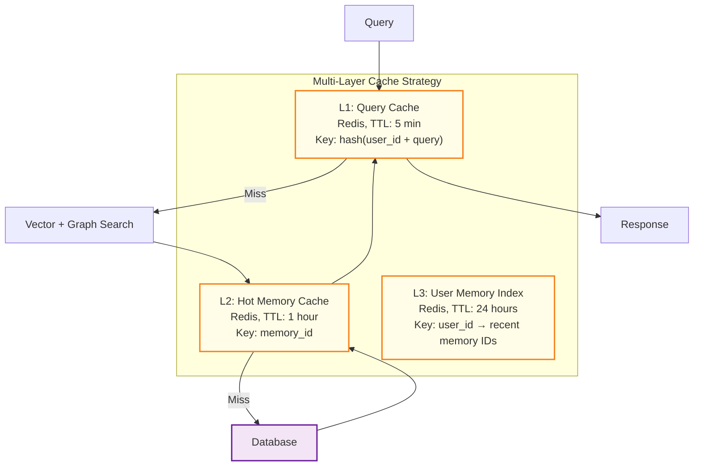
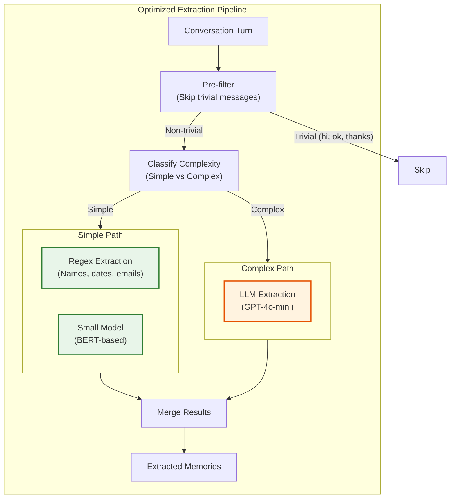
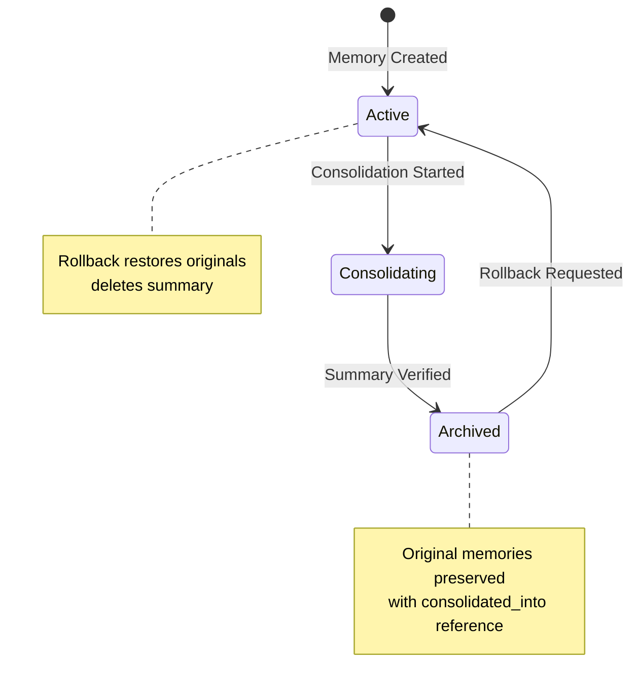
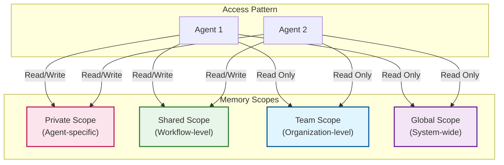
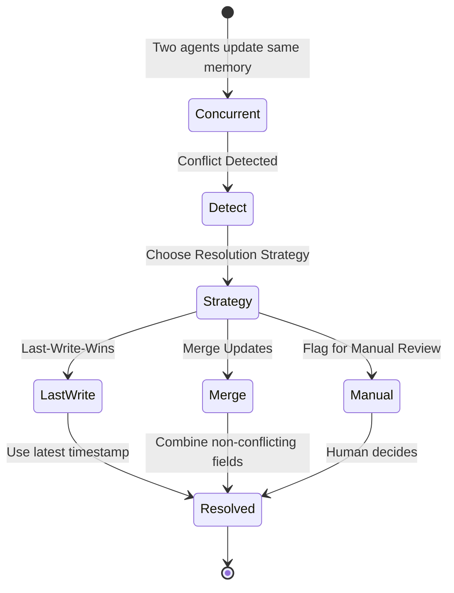

# Deep Dive and Bottlenecks

## Critical Component 1: Memory Retrieval Latency

### The Challenge

Memory retrieval must complete within 100ms (p95) to not perceptibly delay LLM responses. This includes:
- Query embedding generation (20ms)
- Multi-source retrieval (vector + graph) (30-60ms)
- Fusion and ranking (10ms)
- Network overhead (10ms)

**Budget breakdown:**

```
┌──────────────────────────────────────────────────────────────┐
│               100ms Latency Budget                          │
├──────────────────────────────────────────────────────────────┤
│ Query Embedding     │████████████████████│ 20ms             │
│ Vector Search       │██████████████████████████│ 30ms       │
│ Graph Traversal     │██████████████████████████│ 30ms       │
│ RRF Fusion          │████│ 5ms                              │
│ Importance Ranking  │████│ 5ms                              │
│ Network             │██████████│ 10ms                       │
└──────────────────────────────────────────────────────────────┘
```

### Vector Search Optimization

#### HNSW Index Tuning

| Parameter | Description | Low Latency | High Recall | Balanced |
|-----------|-------------|-------------|-------------|----------|
| `M` | Connections per layer | 8 | 32 | 16 |
| `ef_construction` | Build-time exploration | 32 | 200 | 100 |
| `ef_search` | Query-time exploration | 32 | 200 | 64 |

**Trade-off:**
- Higher `M` and `ef` = better recall, slower queries
- Lower values = faster queries, may miss relevant memories

**Recommendation:** Start with balanced, tune based on recall metrics.

#### Quantization for Memory Efficiency

```
Original: 1536 × 4 bytes = 6.14 KB per vector
Product Quantization (PQ): 1536 → 128 bytes = 128 B per vector
Savings: 48x reduction

Impact on recall: ~5% degradation
Impact on latency: 2-3x improvement at scale
```

**When to use:** When vector count exceeds 100M and latency is critical.

### Graph Traversal Optimization

#### Depth Limits

```
Depth 1: Direct relationships       ~10ms, 10-50 results
Depth 2: Friends-of-friends         ~30ms, 50-200 results
Depth 3: Extended network           ~100ms, 200-1000 results (risky)
```

**Recommendation:** Limit to depth 2 for real-time queries. Use depth 3 only for batch/async.

#### Selective Traversal

```
ALGORITHM OptimizedGraphTraversal(start_nodes, max_depth, limit)

1. Use importance-weighted edges
   - Traverse high-strength relationships first
   - Prune edges below strength threshold (0.3)

2. Early termination
   - Stop when limit reached
   - Stop when traversal returns diminishing results

3. Parallel BFS
   - Traverse multiple start nodes concurrently
   - Merge results with deduplication
```

### Caching Strategy



**Cache Hit Rates (Target):**
- L1 Query Cache: 30-40% (repeated queries)
- L2 Hot Memory: 60-70% (frequently accessed)
- L3 User Index: 80-90% (recent user activity)

### Parallel Query Execution

```
SEQUENTIAL (150ms total):
  Query Embed → Vector Search → Graph Search → Fusion
      20ms          40ms            40ms        10ms

PARALLEL (70ms total):
  Query Embed → ┬─ Vector Search ─┬─ Fusion
      20ms      │      40ms       │   10ms
                └─ Graph Search ──┘
                       40ms
```

**Implementation:** Use async/await with concurrent futures for independent operations.

---

## Critical Component 2: Memory Extraction Quality

### The Challenge

LLM-based extraction must balance:
- **Accuracy:** Extract relevant facts, not noise (target: >85%)
- **Recall:** Don't miss important information (target: >90%)
- **Latency:** Complete within 100ms (target for small models)
- **Cost:** Minimize tokens processed

### Extraction Quality Metrics

| Metric | Definition | Target |
|--------|------------|--------|
| **Precision** | Extracted facts that are actually relevant | >85% |
| **Recall** | Relevant facts that were extracted | >90% |
| **F1 Score** | Harmonic mean of precision and recall | >87% |
| **Entity Accuracy** | Correctly identified entity types | >90% |
| **Relationship Accuracy** | Correctly identified relationships | >80% |

### Model Selection Trade-offs

| Model | Latency | Cost/1K tokens | Accuracy | Use Case |
|-------|---------|----------------|----------|----------|
| GPT-4 | 500ms | $0.03 | 95% | High-value, complex |
| GPT-4o-mini | 80ms | $0.00015 | 88% | **Default (recommended)** |
| Claude Haiku | 100ms | $0.00025 | 87% | Alternative |
| Fine-tuned BERT | 20ms | Self-hosted | 82% | High-volume, simple |

### Extraction Pipeline Optimization



### Confidence Thresholds

```
ALGORITHM FilterByConfidence(extracted_items)

FOR item IN extracted_items DO
    IF item.confidence < 0.5 THEN
        DISCARD(item)  # Too uncertain
    ELSE IF item.confidence < 0.7 THEN
        FLAG_FOR_REVIEW(item)  # Human review queue
    ELSE IF item.confidence < 0.9 THEN
        STORE_WITH_LOWER_IMPORTANCE(item)
    ELSE
        STORE_NORMALLY(item)
    END IF
END FOR
```

### Human-in-the-Loop Correction

For high-value applications:

1. **Flagging:** Low-confidence extractions queued for review
2. **Correction UI:** Allow users to confirm/edit/delete memories
3. **Feedback Loop:** Corrections improve extraction prompts
4. **Active Learning:** Periodically fine-tune extraction model

---

## Critical Component 3: Consolidation Without Data Loss

### The Challenge

Consolidation must:
- Reduce storage and token usage
- Preserve important information
- Be reversible (audit trail)
- Not block retrieval during processing

### Information Loss Risk Matrix

| Original Content | Risk Level | Mitigation |
|------------------|------------|------------|
| Specific dates/times | High | Always preserve temporal metadata |
| Names/entities | High | Extract to graph before summarizing |
| Numerical data | High | Include in summary explicitly |
| Emotional context | Medium | Note sentiment in metadata |
| Routine interactions | Low | Safe to heavily summarize |

### Consolidation Quality Metrics

```
ALGORITHM MeasureConsolidationQuality(original_cluster, summary)

1. SEMANTIC PRESERVATION
   original_embedding = average(embed(m) for m in original_cluster)
   summary_embedding = embed(summary)
   semantic_similarity = cosine(original_embedding, summary_embedding)

   ASSERT semantic_similarity > 0.85

2. ENTITY PRESERVATION
   original_entities = extract_entities(original_cluster)
   summary_entities = extract_entities(summary)
   entity_coverage = len(summary_entities ∩ original_entities) /
                     len(original_entities)

   ASSERT entity_coverage > 0.9

3. FACT PRESERVATION
   original_facts = extract_facts(original_cluster)
   summary_facts = extract_facts(summary)

   # Use LLM to judge if facts are preserved
   fact_preservation = llm_judge(original_facts, summary_facts)

   ASSERT fact_preservation > 0.8
```

### Rollback Mechanism



**Rollback procedure:**
1. Fetch summary memory
2. Get `original_memories` from metadata
3. Update original memories: `status = ACTIVE`
4. Delete summary memory
5. Log rollback for audit

### Consolidation Scheduling

```
┌────────────────────────────────────────────────────────────┐
│                Consolidation Triggers                      │
├────────────────────────────────────────────────────────────┤
│                                                            │
│  TOKEN BUDGET TRIGGER:                                     │
│  ┌──────────────────────────────────────┐                 │
│  │ IF user_total_tokens > 100,000 THEN │                 │
│  │     trigger_consolidation()          │                 │
│  │ END IF                               │                 │
│  └──────────────────────────────────────┘                 │
│                                                            │
│  AGE-BASED TRIGGER:                                        │
│  ┌──────────────────────────────────────┐                 │
│  │ Daily job: consolidate memories      │                 │
│  │ WHERE age > 30 days                  │                 │
│  │ AND importance_score < 0.5           │                 │
│  └──────────────────────────────────────┘                 │
│                                                            │
│  SIMILARITY-BASED TRIGGER:                                 │
│  ┌──────────────────────────────────────┐                 │
│  │ IF cluster_size > 5                  │                 │
│  │ AND similarity > 0.9                 │                 │
│  │     consolidate_cluster()            │                 │
│  └──────────────────────────────────────┘                 │
│                                                            │
└────────────────────────────────────────────────────────────┘
```

---

## Critical Component 4: Multi-Agent Memory Sharing

### The Challenge

Multi-agent systems require:
- **Isolation:** Agent A shouldn't access Agent B's private memories
- **Sharing:** Agents in same workflow need shared context
- **Handoff:** Transferring context between agents cleanly
- **Conflict Resolution:** Handling concurrent updates

### Memory Scope Model



### Handoff Context Structure

```yaml
HandoffContext:
  handoff_id: uuid
  source_agent_id: string
  target_agent_id: string
  timestamp: timestamp

  task_context:
    original_query: string          # What user asked
    task_description: string        # High-level task
    constraints: object             # Any limitations

  execution_context:
    steps_completed: list           # What's been done
    current_progress: string        # Summary of progress
    partial_results: object         # Intermediate outputs
    decisions_made: list            # Key decisions with rationale

  memory_context:
    relevant_memory_ids: uuid[]     # Memories to transfer
    summary: string                 # Compressed context
    key_facts: list                 # Most important facts
    user_preferences: object        # Relevant preferences

  integrity:
    checksum: string                # For validation
    schema_version: string
```

### Conflict Resolution



**Resolution strategies by field:**

| Field | Strategy | Rationale |
|-------|----------|-----------|
| `content` | Manual review | Content changes need human judgment |
| `importance_score` | Max wins | Higher importance should be preserved |
| `access_count` | Sum | Additive metric |
| `metadata.tags` | Union | Tags from both agents |
| `last_accessed` | Max | Most recent time |

---

## Bottleneck Analysis

### Bottleneck 1: Embedding Generation at Scale

| Symptom | Cause | Mitigation |
|---------|-------|------------|
| Memory write latency > 200ms | Embedding API slow | Batch embeddings, async processing |
| High embedding costs | Too many embeddings | Deduplicate before embedding |
| Embedding API rate limits | High volume | Multiple API keys, self-hosted model |

**Solution: Async Embedding Pipeline**

```
WRITE PATH:
  Client → API → Store raw content immediately
                ↓
              Return memory_id (status: "processing")
                ↓
              Async: Queue embedding job
                ↓
              Worker: Generate embedding
                ↓
              Worker: Update memory with embedding
                ↓
              Memory status: "complete"
```

### Bottleneck 2: Vector Search at Scale (>1B vectors)

| Symptom | Cause | Mitigation |
|---------|-------|------------|
| Search latency > 100ms | Index too large | Shard by user_id, ANN approximation |
| Memory usage too high | Vectors in RAM | Product quantization, disk-based index |
| Cold start slow | Loading index | Pre-warmed replicas |

**Solution: User-Based Sharding**

```
Total vectors: 10B
Shards: 100
Vectors per shard: 100M

Routing:
  shard_id = hash(user_id) % 100

Benefits:
  - User queries hit single shard
  - Horizontal scaling by adding shards
  - Isolation between users
```

### Bottleneck 3: Graph Traversal Explosion

| Symptom | Cause | Mitigation |
|---------|-------|------------|
| Graph query timeout | Deep traversal | Limit depth to 2 |
| Too many results | Dense graph | Importance-based pruning |
| High memory usage | Materializing paths | Streaming results |

**Solution: Importance-Weighted Pruning**

```
ALGORITHM PrunedTraversal(start, depth_limit, importance_threshold)

visited = set()
queue = [(start, 0)]  # (node, depth)
results = []

WHILE queue NOT EMPTY DO
    node, depth = queue.pop()

    IF node IN visited OR depth > depth_limit THEN
        CONTINUE
    END IF

    visited.add(node)

    # Only traverse edges above importance threshold
    edges = get_edges(node).filter(e => e.strength > importance_threshold)

    # Sort by strength, take top-K
    edges = sorted(edges, by=strength, desc=True)[:TOP_K]

    FOR edge IN edges DO
        queue.append((edge.target, depth + 1))
        results.append(edge.target_memory)
    END FOR
END WHILE

RETURN results
```

### Bottleneck 4: Storage Growth

| Symptom | Cause | Mitigation |
|---------|-------|------------|
| Storage costs increasing | Unbounded growth | Aggressive consolidation |
| Query performance degrading | Too many memories | Importance-based archiving |
| Backup times increasing | Large dataset | Incremental backups, tiered storage |

**Solution: Tiered Storage with Auto-Migration**

```
┌─────────────────────────────────────────────────────────────┐
│                    Storage Tiers                            │
├─────────────────────────────────────────────────────────────┤
│                                                             │
│  HOT TIER (0-7 days):                                      │
│  ┌─────────────────────────────────────────────────┐       │
│  │ Storage: NVMe SSD                               │       │
│  │ Cost: $$$                                       │       │
│  │ Latency: <10ms                                  │       │
│  │ Use: Active memories, recent conversations     │       │
│  └─────────────────────────────────────────────────┘       │
│                                                             │
│  WARM TIER (7-30 days):                                    │
│  ┌─────────────────────────────────────────────────┐       │
│  │ Storage: SSD                                    │       │
│  │ Cost: $$                                        │       │
│  │ Latency: 20-50ms                                │       │
│  │ Use: Moderately accessed memories              │       │
│  └─────────────────────────────────────────────────┘       │
│                                                             │
│  COLD TIER (30+ days):                                     │
│  ┌─────────────────────────────────────────────────┐       │
│  │ Storage: Object Storage (S3)                    │       │
│  │ Cost: $                                         │       │
│  │ Latency: 100-500ms                              │       │
│  │ Use: Archived, consolidated memories           │       │
│  └─────────────────────────────────────────────────┘       │
│                                                             │
└─────────────────────────────────────────────────────────────┘
```

---

## Race Conditions

### Race Condition 1: Concurrent Memory Updates

**Scenario:** Two agents update the same memory simultaneously.

```
Agent A: READ memory_123 (importance: 0.5)
Agent B: READ memory_123 (importance: 0.5)
Agent A: WRITE memory_123 (importance: 0.7)  # A's update
Agent B: WRITE memory_123 (importance: 0.6)  # B overwrites A!
```

**Solution: Optimistic Locking with Version**

```sql
UPDATE memories
SET importance_score = 0.7, version = version + 1
WHERE memory_id = 'memory_123' AND version = 5;

-- If rows_affected = 0, retry with fresh read
```

### Race Condition 2: Consolidation During Retrieval

**Scenario:** Retrieval returns memory IDs that get archived mid-request.

```
Retrieval: SEARCH returns [mem_1, mem_2, mem_3]
Consolidation: ARCHIVE mem_2 (status → ARCHIVED)
Retrieval: FETCH mem_2 → Returns archived/empty!
```

**Solution: Read-Through with Fallback**

```
ALGORITHM SafeFetch(memory_id)

memory = fetch(memory_id)

IF memory.status == 'ARCHIVED' THEN
    # Check if consolidated
    IF memory.metadata.consolidated_into EXISTS THEN
        # Return the consolidated version
        return fetch(memory.metadata.consolidated_into)
    END IF
END IF

RETURN memory
```

### Race Condition 3: Forgetting Accessed Memory

**Scenario:** Forgetting job deletes memory being accessed.

```
Forgetting: memory.importance < threshold → DELETE
Access: INCREMENT access_count on deleted memory → ERROR
```

**Solution: Soft Delete with Grace Period**

```
1. Soft delete: status = 'DELETED', deleted_at = now()
2. Grace period: 24 hours before hard delete
3. Access during grace period: Restore memory
4. Hard delete job: Remove memories WHERE deleted_at < now() - 24h
```

---

## Failure Scenarios

### Failure 1: Vector Database Unavailable

**Impact:** Cannot perform semantic search

**Fallback:**
1. Return cached results from Redis
2. If cache empty, return recent memories (by timestamp)
3. Queue query for retry when service recovers

### Failure 2: LLM Extraction Service Down

**Impact:** Cannot extract memories from conversations

**Fallback:**
1. Store raw conversation content
2. Queue for extraction when service recovers
3. Use regex for basic extraction (names, dates)

### Failure 3: Graph Database Unavailable

**Impact:** Cannot perform relationship queries

**Fallback:**
1. Skip graph traversal
2. Use vector-only retrieval
3. Retrieve entities from memory metadata

### Failure 4: Memory Write Fails

**Impact:** Lost memory

**Fallback:**
1. Write to local buffer/queue
2. Retry with exponential backoff
3. If persistent failure, alert and log for manual recovery
