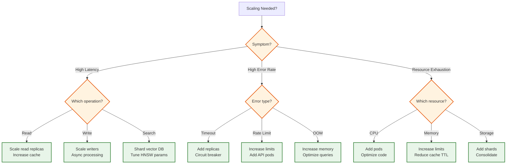
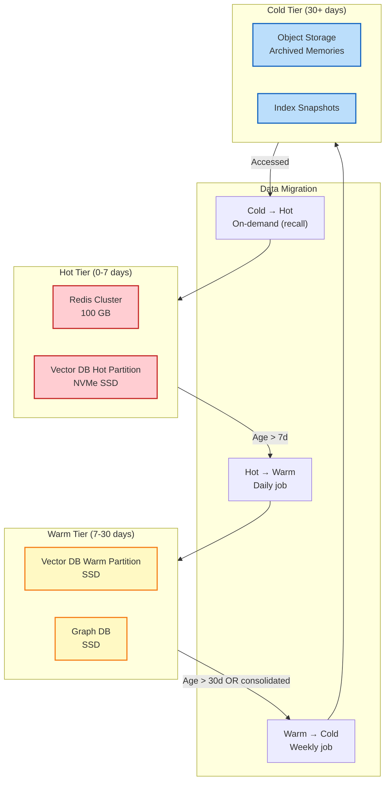
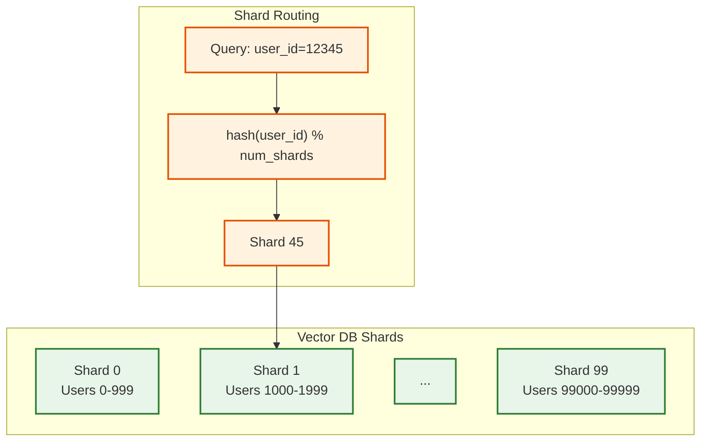
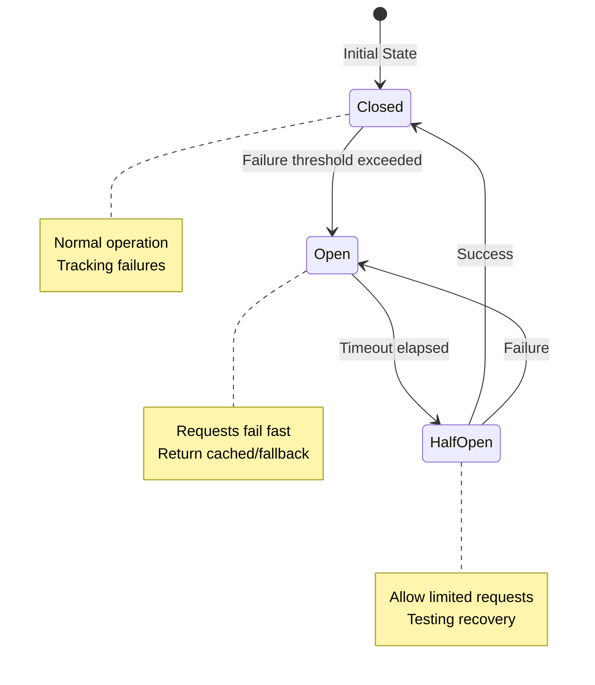
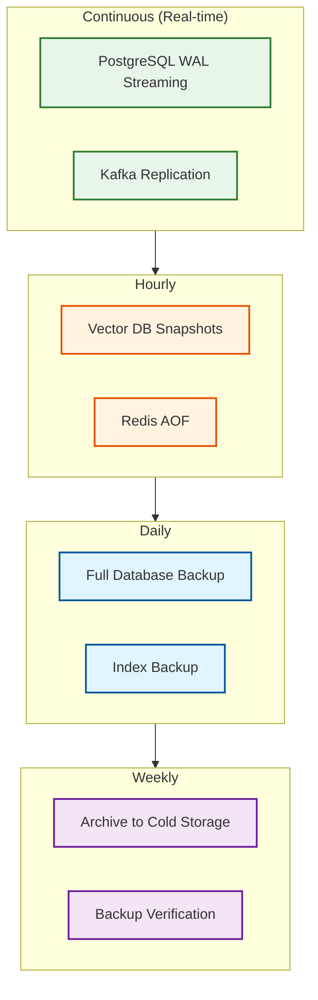
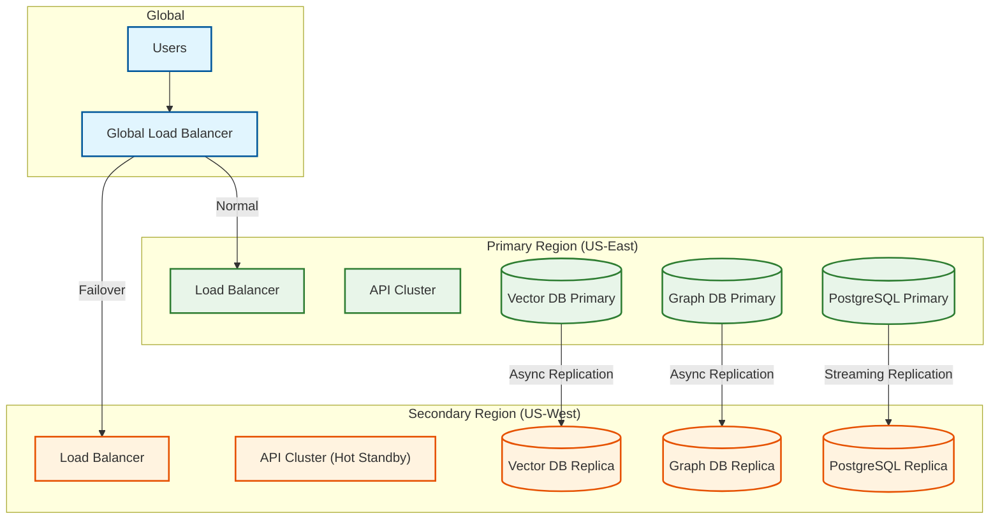

# Scalability and Reliability

## Horizontal Scaling Strategy

### Component-Level Scaling

| Component | Scaling Trigger | Strategy | Max Scale |
|-----------|-----------------|----------|-----------|
| **API Gateway** | CPU > 70% or QPS > 1000/pod | HPA with pod autoscaling | 100 pods |
| **Memory Writer** | Queue depth > 100 | Scale workers, batch processing | 50 workers |
| **Memory Reader** | Latency p95 > 80ms | Add read replicas, increase cache | 100 pods |
| **Vector DB** | Index size > 1B per shard | Shard by user_id | 100 shards |
| **Graph DB** | Edge count > 100M per partition | Partition by tenant | 50 partitions |
| **Embedding Service** | Queue depth > 50 | GPU auto-scaling | 20 GPUs |
| **Redis Cache** | Memory > 80% | Add nodes to cluster | 100 GB cluster |

### Scaling Decision Tree



---

## Multi-Tier Storage Architecture



### Tier Characteristics

| Tier | Storage Type | Latency | Cost/GB/Month | Data |
|------|--------------|---------|---------------|------|
| **Hot** | NVMe SSD + Redis | <10ms | $0.50 | Recent 7 days, frequently accessed |
| **Warm** | SSD | 20-50ms | $0.20 | 7-30 days, moderately accessed |
| **Cold** | Object Storage | 100-500ms | $0.02 | >30 days, archived/consolidated |

### Promotion/Demotion Policies

```
ALGORITHM TierMigration()

# DEMOTION: Hot → Warm
FOR memory IN hot_tier DO
    IF memory.age > 7 days AND memory.access_count < 3 THEN
        migrate_to_warm(memory)
    END IF
END FOR

# DEMOTION: Warm → Cold
FOR memory IN warm_tier DO
    IF memory.age > 30 days OR memory.status == 'ARCHIVED' THEN
        migrate_to_cold(memory)
    END IF
END FOR

# PROMOTION: Cold → Hot (on access)
FUNCTION on_memory_access(memory_id):
    memory = fetch(memory_id)
    IF memory.tier == 'COLD' THEN
        async promote_to_hot(memory)
    END IF
    RETURN memory
```

---

## Sharding Strategies

### User-Based Sharding (Primary)



**Benefits:**
- All user memories in single shard (query locality)
- No cross-shard queries for normal operations
- Easy to add shards as user base grows

**Shard sizing:**
- Target: 100M vectors per shard
- With 10B total vectors: 100 shards
- Rebalancing: Consistent hashing for minimal data movement

### Time-Based Partitioning (Secondary)

For temporal queries:

```sql
-- Partition table by month
CREATE TABLE memories (
    memory_id UUID,
    user_id UUID,
    created_at TIMESTAMP,
    ...
) PARTITION BY RANGE (created_at);

CREATE TABLE memories_2025_01 PARTITION OF memories
    FOR VALUES FROM ('2025-01-01') TO ('2025-02-01');

CREATE TABLE memories_2025_02 PARTITION OF memories
    FOR VALUES FROM ('2025-02-01') TO ('2025-03-01');
```

**Benefits:**
- Fast temporal queries ("last month's memories")
- Easy partition pruning
- Simple archival (drop old partitions)

### Hybrid Sharding for Multi-Agent

```
Shard Key: (tenant_id, agent_scope)

Examples:
  - Private memory: shard_key = "tenant_123:agent_456"
  - Shared memory: shard_key = "tenant_123:shared"
  - Global memory: shard_key = "global"

Routing:
  IF scope == PRIVATE:
      shard = hash(tenant_id + agent_id) % private_shards
  ELSE IF scope == SHARED:
      shard = hash(tenant_id) % shared_shards
  ELSE:
      shard = hash(memory_id) % global_shards
```

---

## Fault Tolerance

### Replication Strategy

| Component | Replication | Consistency | Failover Time |
|-----------|-------------|-------------|---------------|
| **Vector DB** | 3 replicas | Async | 30s (automatic) |
| **Graph DB** | 3 replicas | Sync (quorum) | 60s (automatic) |
| **PostgreSQL** | 1 primary + 2 read | Sync to 1 | 30s (automatic) |
| **Redis** | 3 node cluster | Async | 10s (automatic) |
| **Kafka** | 3 replicas | ISR=2 | 30s (automatic) |

### Circuit Breaker Pattern



**Configuration:**
```yaml
circuit_breaker:
  vector_db:
    failure_threshold: 5          # Failures before opening
    success_threshold: 3          # Successes to close
    timeout: 30s                  # Time in open state
    fallback: return_cached_results

  embedding_service:
    failure_threshold: 3
    success_threshold: 2
    timeout: 60s
    fallback: queue_for_later

  graph_db:
    failure_threshold: 5
    success_threshold: 3
    timeout: 30s
    fallback: skip_graph_traversal
```

### Graceful Degradation Levels

| Level | Trigger | Behavior | User Impact |
|-------|---------|----------|-------------|
| **L0: Normal** | All systems healthy | Full functionality | None |
| **L1: Degraded** | One backend slow | Skip slow backend | Slightly reduced quality |
| **L2: Partial** | One backend down | Use cached data | May miss recent memories |
| **L3: Minimal** | Multiple backends down | Read-only, cached only | Stale data, no writes |
| **L4: Emergency** | Critical failure | Static response | "Memory temporarily unavailable" |

### Retry Strategy

```
ALGORITHM RetryWithBackoff(operation, max_retries, base_delay)

FOR attempt = 1 TO max_retries DO
    TRY
        result = execute(operation)
        RETURN result

    CATCH retriable_error
        IF attempt == max_retries THEN
            THROW error  # Give up
        END IF

        # Exponential backoff with jitter
        delay = base_delay * (2 ^ attempt)
        jitter = random(0, delay * 0.1)
        sleep(delay + jitter)

    CATCH non_retriable_error
        THROW error  # Don't retry
    END TRY
END FOR

# Retriable: timeout, connection error, 503
# Non-retriable: 400, 401, 403, 404
```

---

## Disaster Recovery

### Recovery Objectives

| Metric | Target | Justification |
|--------|--------|---------------|
| **RPO (Recovery Point Objective)** | 5 minutes | Max data loss acceptable |
| **RTO (Recovery Time Objective)** | 15 minutes | Max downtime acceptable |
| **MTTR (Mean Time To Recovery)** | 10 minutes | Average recovery time |

### Backup Strategy



### Multi-Region Architecture



### Failover Procedure

```
PROCEDURE RegionFailover()

1. DETECT FAILURE
   - Health checks fail for >30 seconds
   - Alert triggered to on-call

2. VALIDATE FAILURE (30 seconds)
   - Confirm not a false positive
   - Check from multiple vantage points

3. INITIATE FAILOVER (automatic)
   - Global LB routes to secondary
   - Secondary promoted to primary

4. DATA SYNC CHECK
   - Verify replication lag
   - If lag > RPO, alert for potential data loss

5. VALIDATE SECONDARY
   - Run health checks
   - Verify read/write operations

6. COMMUNICATION
   - Update status page
   - Notify affected users

7. POST-FAILOVER
   - Investigate root cause
   - Plan failback when primary recovers

TOTAL TIME: ~5 minutes (automated), ~15 minutes (with manual validation)
```

---

## Cost Optimization

### Resource Right-Sizing

| Component | Over-provisioned Sign | Optimization |
|-----------|----------------------|--------------|
| **API Pods** | CPU < 30% consistently | Reduce pod count or size |
| **Vector DB** | Memory < 50% | Use smaller instance type |
| **Redis** | Memory < 40% | Reduce cluster size |
| **Embedding GPU** | Utilization < 50% | Use spot instances |

### Cost-Saving Strategies

| Strategy | Savings | Trade-off |
|----------|---------|-----------|
| **Spot instances for workers** | 70% | May be interrupted |
| **Reserved instances for stable load** | 40% | 1-3 year commitment |
| **Tiered storage (hot/warm/cold)** | 60% | Cold access latency |
| **Aggressive consolidation** | 30% | Potential info loss |
| **Embedding model downgrade** | 50% | Slightly lower quality |
| **Product quantization** | 40% | ~5% recall reduction |

### Cost Monitoring Dashboard

```
┌────────────────────────────────────────────────────────────┐
│                   Monthly Cost Breakdown                   │
├────────────────────────────────────────────────────────────┤
│                                                            │
│  Vector DB:        ████████████████████  $25,000 (50%)    │
│  Compute:          ████████            $8,000 (16%)      │
│  Graph DB:         █████               $5,000 (10%)      │
│  Embedding API:    ████                $4,000 (8%)       │
│  PostgreSQL:       ███                 $3,000 (6%)       │
│  Redis:            ██                  $2,000 (4%)       │
│  Network:          ██                  $2,000 (4%)       │
│  Object Storage:   █                   $1,000 (2%)       │
│                                                            │
│  TOTAL:                                $50,000/month      │
│                                                            │
│  Cost per user: $0.005/month                              │
│  Cost per query: $0.0001                                  │
│                                                            │
└────────────────────────────────────────────────────────────┘
```

### Cost Alerts

| Alert | Threshold | Action |
|-------|-----------|--------|
| Daily cost spike | >120% of average | Investigate unusual usage |
| Storage growth | >10%/week | Review consolidation |
| Embedding costs | >$500/day | Check for extraction loops |
| Spot interruptions | >5/day | Consider on-demand for critical |

---

## Load Testing Results

### Baseline Performance (10M users, 10B memories)

| Metric | Value | Target | Status |
|--------|-------|--------|--------|
| Read latency (p50) | 35ms | <50ms | Pass |
| Read latency (p95) | 85ms | <100ms | Pass |
| Read latency (p99) | 150ms | <200ms | Pass |
| Write latency (p95) | 120ms | <200ms | Pass |
| Throughput | 15K QPS | 10K QPS | Pass |
| Error rate | 0.02% | <0.1% | Pass |

### Stress Test Results (3x normal load)

| Metric | Value | Target | Status |
|--------|-------|--------|--------|
| Read latency (p95) | 95ms | <100ms | Pass (barely) |
| Throughput | 45K QPS | 30K QPS | Pass |
| Error rate | 0.08% | <0.1% | Pass |
| Auto-scale time | 45s | <60s | Pass |

### Chaos Test Results

| Scenario | Recovery Time | Data Loss | Status |
|----------|---------------|-----------|--------|
| Vector DB node failure | 28s | 0 | Pass |
| Graph DB node failure | 55s | 0 | Pass |
| API pod crash | 5s | 0 | Pass |
| Network partition | 35s | 0 | Pass |
| Full region failure | 4.5 min | <5 min RPO | Pass |
