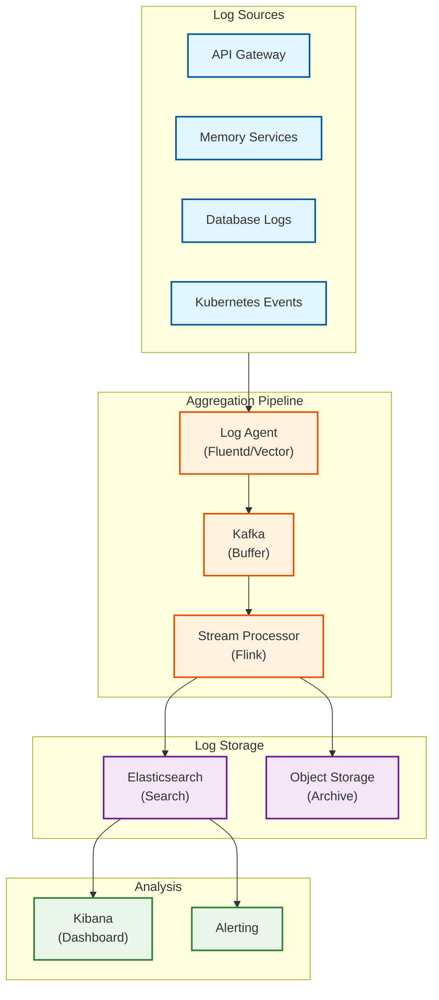
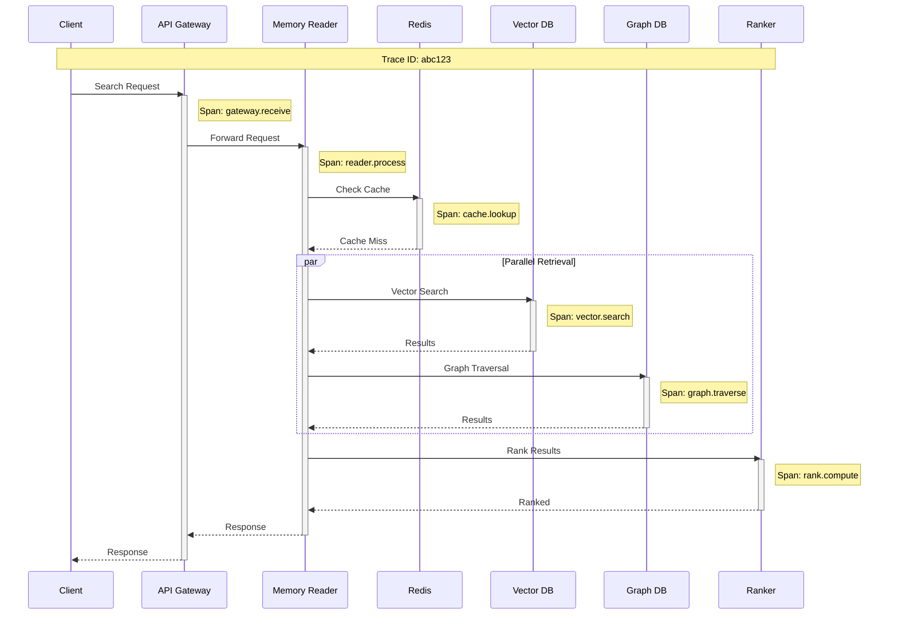

# Observability

## Core Metrics Framework

### RED Metrics (Request-oriented)

| Service | Rate | Errors | Duration |
|---------|------|--------|----------|
| **Memory Retrieval** | `memory_retrieval_total` | `memory_retrieval_errors_total` | `memory_retrieval_duration_ms` |
| **Memory Write** | `memory_write_total` | `memory_write_errors_total` | `memory_write_duration_ms` |
| **Context Injection** | `context_injection_total` | `context_injection_errors_total` | `context_injection_duration_ms` |
| **Consolidation** | `consolidation_jobs_total` | `consolidation_failures_total` | `consolidation_duration_s` |
| **Forgetting** | `forgetting_runs_total` | `forgetting_failures_total` | `forgetting_duration_s` |

### USE Metrics (Resource-oriented)

| Resource | Utilization | Saturation | Errors |
|----------|-------------|------------|--------|
| **Vector DB** | `vector_db_query_utilization` | `vector_db_queue_depth` | `vector_db_errors_total` |
| **Graph DB** | `graph_db_query_utilization` | `graph_db_queue_depth` | `graph_db_errors_total` |
| **Embedding Service** | `embedding_gpu_utilization` | `embedding_queue_depth` | `embedding_errors_total` |
| **Redis Cache** | `redis_memory_utilization` | `redis_connections` | `redis_errors_total` |
| **API Pods** | `pod_cpu_utilization` | `pod_memory_utilization` | `pod_restarts_total` |

---

## Memory-Specific Metrics

### Memory Lifecycle Metrics

```yaml
# Memory volume metrics
memory_count_total:
  labels: [tenant_id, memory_type, status]
  description: Total memories by type and status

memory_tokens_total:
  labels: [tenant_id, memory_type]
  description: Total tokens stored per tenant

memory_age_seconds:
  type: histogram
  buckets: [3600, 86400, 604800, 2592000, 31536000]
  description: Age distribution of active memories

# Formation metrics
memory_extraction_duration_ms:
  type: histogram
  labels: [model, memory_type]
  description: Time to extract memories from conversation

memory_extraction_entities:
  type: histogram
  labels: [tenant_id]
  description: Entities extracted per memory

# Retrieval metrics
memory_retrieval_count:
  type: histogram
  labels: [tenant_id]
  description: Memories returned per query

memory_retrieval_relevance:
  type: histogram
  labels: [tenant_id]
  description: Relevance scores of retrieved memories

memory_cache_hit_rate:
  labels: [cache_tier]
  description: Cache hit rate by tier (L1, L2, L3)

# Consolidation metrics
memory_consolidated_count:
  labels: [tenant_id, strategy]
  description: Memories consolidated per run

memory_consolidation_ratio:
  labels: [tenant_id]
  description: Compression ratio achieved

# Forgetting metrics
memory_decayed_count:
  labels: [tenant_id]
  description: Memories with decayed importance

memory_deleted_count:
  labels: [tenant_id, reason]
  description: Memories deleted (by TTL, importance, user request)
```

### Quality Metrics

```yaml
# Extraction quality (sampled)
extraction_precision:
  labels: [model]
  description: Precision of entity extraction (human-labeled sample)

extraction_recall:
  labels: [model]
  description: Recall of entity extraction

# Retrieval quality (sampled)
retrieval_relevance_at_k:
  labels: [k]
  description: Relevance of top-K results (1, 5, 10)

# Consolidation quality
consolidation_information_loss:
  labels: [strategy]
  description: Estimated information loss from consolidation
```

---

## Logging Strategy

### Log Levels

| Level | Use Case | Example |
|-------|----------|---------|
| **ERROR** | Failures requiring attention | Database connection failed |
| **WARN** | Degraded operation | Cache miss, fallback used |
| **INFO** | Key operations | Memory created, search completed |
| **DEBUG** | Detailed debugging | Query parameters, intermediate results |

### Structured Log Format

```json
{
  "timestamp": "2026-01-28T10:30:00.123Z",
  "level": "INFO",
  "service": "memory-reader",
  "trace_id": "abc123",
  "span_id": "def456",
  "tenant_id": "tenant_123",
  "user_id": "user_456",
  "event": "memory.search.completed",
  "duration_ms": 45,
  "memories_returned": 5,
  "cache_hit": true,
  "metadata": {
    "query_hash": "sha256:...",
    "memory_types": ["SEMANTIC", "EPISODIC"],
    "top_k": 10
  }
}
```

### What to Log vs. NOT Log

| Log | Don't Log |
|-----|-----------|
| Query metadata (hash, type) | Actual query content (PII) |
| Memory IDs | Memory content (PII) |
| Operation durations | Full embeddings |
| Error messages | API keys, tokens |
| User IDs (for debugging) | Passwords, secrets |

### Log Aggregation Pipeline



---

## Distributed Tracing

### Trace Flow



### Key Spans to Instrument

| Span Name | Service | Attributes |
|-----------|---------|------------|
| `gateway.authenticate` | API Gateway | tenant_id, auth_method |
| `reader.search` | Memory Reader | query_hash, top_k |
| `cache.lookup` | Cache | cache_tier, hit/miss |
| `vector.search` | Vector DB | index_name, limit, latency |
| `graph.traverse` | Graph DB | start_nodes, depth, edges_traversed |
| `embedding.generate` | Embedding | model, token_count |
| `extraction.run` | Extractor | model, entities_found |
| `rank.compute` | Ranker | candidates_in, results_out |

### Trace Sampling Strategy

```yaml
sampling:
  # Sample 10% of normal requests
  default_rate: 0.1

  # Always sample errors
  error_rate: 1.0

  # Always sample slow requests (>500ms)
  latency_threshold_ms: 500
  latency_rate: 1.0

  # Higher rate for specific operations
  overrides:
    - operation: "consolidation.*"
      rate: 1.0  # Always sample consolidation
    - operation: "*.error"
      rate: 1.0  # Always sample errors
```

---

## Alerting Rules

### Critical Alerts (P1 - Page Immediately)

| Alert | Condition | Duration | Action |
|-------|-----------|----------|--------|
| **Memory Service Down** | `up{service="memory-*"} == 0` | 1 min | Page on-call, check health |
| **High Error Rate** | `error_rate > 5%` | 5 min | Page on-call, check logs |
| **Database Unavailable** | `vector_db_up == 0 OR graph_db_up == 0` | 2 min | Page on-call, failover |
| **Data Loss Risk** | `replication_lag > 5 min` | 5 min | Page on-call, check replication |

### High Alerts (P2 - Respond Within 1 Hour)

| Alert | Condition | Duration | Action |
|-------|-----------|----------|--------|
| **High Latency** | `p95_latency > 200ms` | 10 min | Investigate, scale if needed |
| **Cache Hit Rate Low** | `cache_hit_rate < 50%` | 15 min | Check cache config, warm cache |
| **Embedding Queue Backing Up** | `embedding_queue_depth > 100` | 10 min | Scale embedding workers |
| **Consolidation Failures** | `consolidation_failure_rate > 10%` | 30 min | Check consolidation jobs |

### Medium Alerts (P3 - Respond Within 24 Hours)

| Alert | Condition | Duration | Action |
|-------|-----------|----------|--------|
| **Storage Approaching Limit** | `storage_used > 80%` | 1 hour | Plan consolidation, add storage |
| **Memory Growth Spike** | `memory_count growth > 50%/day` | 1 day | Check for abuse, adjust limits |
| **Extraction Accuracy Drop** | `extraction_precision < 80%` | 1 day | Review model, retrain |
| **High Forgetting Rate** | `forgetting_rate > expected * 2` | 1 day | Check decay parameters |

### Low Alerts (P4 - Informational)

| Alert | Condition | Duration | Action |
|-------|-----------|----------|--------|
| **Deprecation Warning** | Using deprecated API | Continuous | Plan migration |
| **Certificate Expiring** | Cert expires < 30 days | - | Renew certificate |
| **Cost Anomaly** | Daily cost > 120% average | 1 day | Review usage |

---

## Dashboard Layouts

### System Health Dashboard

```
┌─────────────────────────────────────────────────────────────────────────┐
│                        MEMORY SYSTEM HEALTH                             │
├─────────────────────────────────────────────────────────────────────────┤
│                                                                         │
│  ┌─────────────────┐  ┌─────────────────┐  ┌─────────────────┐         │
│  │   AVAILABILITY  │  │   ERROR RATE    │  │  LATENCY (p95)  │         │
│  │                 │  │                 │  │                 │         │
│  │     99.98%      │  │      0.02%      │  │      45ms       │         │
│  │    ✓ Healthy    │  │    ✓ Healthy    │  │    ✓ Healthy    │         │
│  └─────────────────┘  └─────────────────┘  └─────────────────┘         │
│                                                                         │
│  ┌─────────────────────────────────────────────────────────────────┐   │
│  │                    REQUEST RATE (last 24h)                      │   │
│  │                                                                 │   │
│  │  8K ┤                    ╭───╮                                  │   │
│  │  6K ┤              ╭─────╯   ╰─────╮                            │   │
│  │  4K ┤        ╭─────╯               ╰─────╮                      │   │
│  │  2K ┤  ──────╯                           ╰──────                │   │
│  │   0 ┼────────────────────────────────────────────               │   │
│  │     00:00    06:00    12:00    18:00    00:00                   │   │
│  └─────────────────────────────────────────────────────────────────┘   │
│                                                                         │
│  ┌───────────────────────────┐  ┌───────────────────────────┐          │
│  │     LATENCY HISTOGRAM     │  │      ERROR BREAKDOWN      │          │
│  │                           │  │                           │          │
│  │  <50ms  ████████████ 80%  │  │  4xx  ██████ 60%          │          │
│  │  <100ms ████ 15%          │  │  5xx  ███ 30%             │          │
│  │  <200ms █ 4%              │  │  Timeout █ 10%            │          │
│  │  >200ms  1%               │  │                           │          │
│  └───────────────────────────┘  └───────────────────────────┘          │
│                                                                         │
└─────────────────────────────────────────────────────────────────────────┘
```

### Memory Lifecycle Dashboard

```
┌─────────────────────────────────────────────────────────────────────────┐
│                        MEMORY LIFECYCLE                                 │
├─────────────────────────────────────────────────────────────────────────┤
│                                                                         │
│  ┌─────────────────┐  ┌─────────────────┐  ┌─────────────────┐         │
│  │  TOTAL MEMORIES │  │ MEMORIES/USER   │  │  STORAGE USED   │         │
│  │                 │  │                 │  │                 │         │
│  │    10.2 B       │  │      1,024      │  │    125 TB       │         │
│  │   +2% / week    │  │   (avg)         │  │   80% capacity  │         │
│  └─────────────────┘  └─────────────────┘  └─────────────────┘         │
│                                                                         │
│  ┌─────────────────────────────────────────────────────────────────┐   │
│  │              MEMORY TYPE DISTRIBUTION                           │   │
│  │                                                                 │   │
│  │  Episodic   ██████████████████████████████████████  65%        │   │
│  │  Semantic   ████████████████████  30%                          │   │
│  │  Procedural █████  5%                                          │   │
│  │                                                                 │   │
│  └─────────────────────────────────────────────────────────────────┘   │
│                                                                         │
│  ┌───────────────────────────┐  ┌───────────────────────────┐          │
│  │  CONSOLIDATION (24h)      │  │    FORGETTING (24h)       │          │
│  │                           │  │                           │          │
│  │  Memories: 50M            │  │  Decayed: 100M            │          │
│  │  Compression: 4.2x        │  │  Deleted: 5M              │          │
│  │  Jobs: 1,200              │  │  Avg decay: 0.05          │          │
│  │  Failures: 3              │  │                           │          │
│  └───────────────────────────┘  └───────────────────────────┘          │
│                                                                         │
└─────────────────────────────────────────────────────────────────────────┘
```

### Per-Tenant Dashboard

```
┌─────────────────────────────────────────────────────────────────────────┐
│                    TENANT: tenant_123                                   │
├─────────────────────────────────────────────────────────────────────────┤
│                                                                         │
│  Usage Summary (30 days)                                                │
│  ├── Total Memories: 5.2M                                               │
│  ├── Active Users: 2,100                                                │
│  ├── Avg Memories/User: 2,476                                           │
│  ├── Storage: 1.2 TB                                                    │
│  └── API Calls: 15M                                                     │
│                                                                         │
│  ┌─────────────────────────────────────────────────────────────────┐   │
│  │                    DAILY API USAGE                              │   │
│  │                                                                 │   │
│  │  600K ┤                         ╭─────╮                         │   │
│  │  400K ┤           ╭─────────────╯     ╰─────────                │   │
│  │  200K ┤  ─────────╯                                             │   │
│  │     0 ┼─────────────────────────────────────────                │   │
│  │       Mon   Tue   Wed   Thu   Fri   Sat   Sun                   │   │
│  └─────────────────────────────────────────────────────────────────┘   │
│                                                                         │
│  Top Users by Memory Count                                              │
│  ├── user_456: 15,234 memories                                          │
│  ├── user_789: 12,456 memories                                          │
│  ├── user_012: 10,890 memories                                          │
│  └── ...                                                                │
│                                                                         │
└─────────────────────────────────────────────────────────────────────────┘
```

---

## Runbooks

### Runbook: High Latency Alert

```markdown
# High Latency Runbook

## Trigger
- Alert: `memory_retrieval_latency_p95 > 200ms` for 10 minutes

## Diagnosis Steps

1. Check current latency breakdown:
   ```
   Query: latency_breakdown{service="memory-reader"}
   ```

2. Identify slow component:
   - Vector search > 50ms → Check vector DB
   - Graph traversal > 50ms → Check graph DB
   - Cache miss rate high → Check Redis

3. Check resource utilization:
   ```
   Query: cpu_utilization{service="memory-*"}
   Query: memory_utilization{service="memory-*"}
   ```

## Mitigation

### If Vector DB slow:
- Check index size and shard distribution
- Consider scaling shards
- Tune HNSW parameters (lower ef_search)

### If Graph DB slow:
- Check query complexity
- Reduce traversal depth
- Add indexes for common queries

### If Cache miss rate high:
- Check Redis memory usage
- Increase cache size
- Review TTL settings

### Emergency mitigation:
- Enable graceful degradation (skip slow component)
- Increase pod replicas
```

### Runbook: Memory Service Down

```markdown
# Memory Service Down Runbook

## Trigger
- Alert: `up{service="memory-reader"} == 0` for 2 minutes

## Immediate Actions

1. Check pod status:
   ```bash
   kubectl get pods -l app=memory-reader
   kubectl describe pod <pod-name>
   ```

2. Check recent deployments:
   ```bash
   kubectl rollout history deployment/memory-reader
   ```

3. Check logs for crash reason:
   ```bash
   kubectl logs <pod-name> --previous
   ```

## Recovery

### If OOM killed:
- Increase memory limits
- Check for memory leaks
- Restart pods with higher limits

### If crash loop:
- Check config changes
- Rollback if recent deploy
- Fix code and redeploy

### If external dependency:
- Check Vector DB health
- Check Graph DB health
- Enable fallback mode

## Escalation
- If not resolved in 15 minutes, page secondary on-call
- If customer impact, notify support team
```

---

## SLO Tracking

### SLO Dashboard

| SLO | Target | Current (30d) | Budget Remaining |
|-----|--------|---------------|------------------|
| Availability | 99.95% | 99.98% | 86% |
| Retrieval Latency (p95) | <100ms | 85ms | 100% |
| Write Latency (p95) | <200ms | 120ms | 100% |
| Error Rate | <0.1% | 0.02% | 80% |

### Error Budget Burn Rate

```
Normal burn rate: 1x (consume 100% budget over 30 days)

Alert thresholds:
- 14.4x burn rate for 1 hour = 2% budget consumed = P1 alert
- 6x burn rate for 6 hours = 5% budget consumed = P2 alert
- 3x burn rate for 1 day = 10% budget consumed = P3 alert
```

### Monthly SLO Report

```yaml
month: "2026-01"
tenant: "all"

availability:
  target: 99.95%
  actual: 99.98%
  incidents: 2
  total_downtime_minutes: 8

latency:
  retrieval_p95:
    target: 100ms
    actual: 85ms
  write_p95:
    target: 200ms
    actual: 120ms

error_rate:
  target: 0.1%
  actual: 0.02%

action_items:
  - "Investigate latency spike on 2026-01-15"
  - "Review consolidation job efficiency"
```
