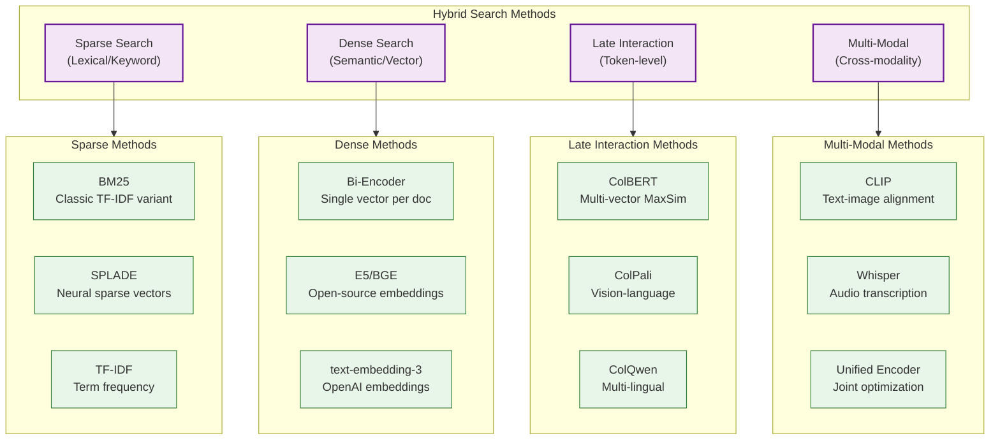
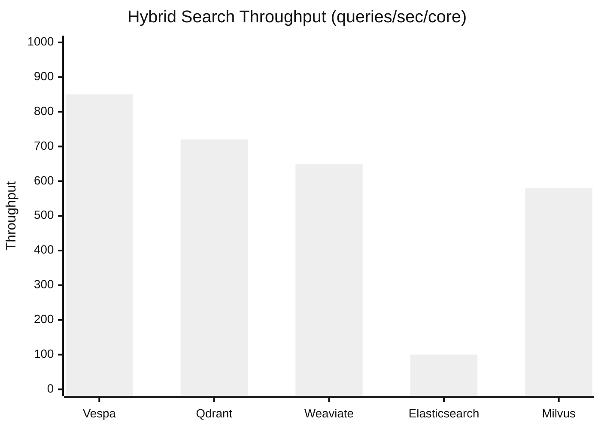
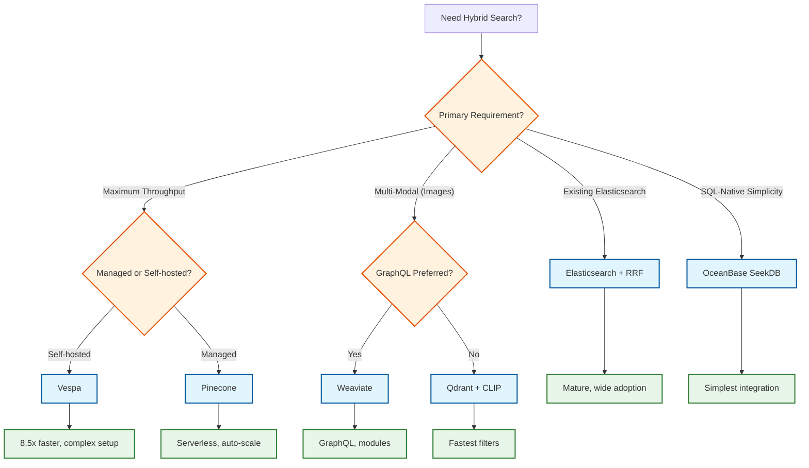
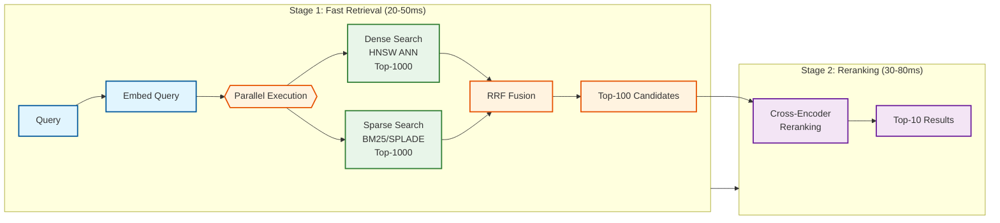

# AI-Native Hybrid Search Engine

## System Overview

An **AI-Native Hybrid Search Engine** combines multiple retrieval methods - dense vector search (semantic), sparse keyword search (BM25), and semantic reranking - to deliver superior search quality compared to single-modal approaches. Unlike traditional keyword-only search or pure vector search, hybrid systems leverage the complementary strengths of each method: dense embeddings capture semantic meaning ("automobile" matches "car"), while sparse search excels at exact keyword matches and rare terms.

The system implements a **two-stage retrieval architecture**: a fast first stage runs dense and sparse search in parallel, fuses results using Reciprocal Rank Fusion (RRF), and an optional second stage uses cross-encoder reranking to re-score top candidates with 20-35% accuracy improvement. Core platforms include Vespa (8.5x throughput over Elasticsearch), Elasticsearch (mature ecosystem), OceanBase SeekDB (SQL-native AI functions), and vector-native databases like Qdrant, Weaviate, and Pinecone.

**Complexity Rating:** `Very High`

This system is complex due to:
- Two-stage retrieval with parallel execution and result fusion
- Multiple index types (HNSW for vectors, inverted index for BM25) requiring synchronization
- Score normalization challenges between incompatible scoring systems
- GPU-accelerated reranking with strict latency budgets
- Multi-modal retrieval (text, images, audio) with different encoders
- Advanced techniques like SPLADE (learned sparse) and ColBERT (late interaction)

---

## Quick Navigation

| Document | Description |
|----------|-------------|
| [01 - Requirements & Estimations](./01-requirements-and-estimations.md) | Functional/Non-functional requirements, capacity planning |
| [02 - High-Level Design](./02-high-level-design.md) | System architecture, data flows, component interactions |
| [03 - Low-Level Design](./03-low-level-design.md) | Data models, API specifications, core algorithms |
| [04 - Deep Dive & Bottlenecks](./04-deep-dive-and-bottlenecks.md) | Critical components, optimizations, failure modes |
| [05 - Scalability & Reliability](./05-scalability-and-reliability.md) | Scaling strategies, fault tolerance, disaster recovery |
| [06 - Security & Compliance](./06-security-and-compliance.md) | Multi-tenant isolation, threat model, compliance |
| [07 - Observability](./07-observability.md) | Metrics, logging, tracing, alerting |
| [08 - Interview Guide](./08-interview-guide.md) | Pacing, trade-offs, trap questions |

---

## Key Characteristics

| Aspect | Description |
|--------|-------------|
| **Two-Stage Retrieval** | Fast first stage (bi-encoder + BM25) followed by precise reranking (cross-encoder) |
| **Hybrid Search** | Combines dense vectors (semantic) + sparse vectors (keyword) for 15-25% quality improvement |
| **Fusion Algorithms** | RRF (parameter-free, robust), linear combination (tunable), learned fusion (optimal) |
| **Cross-Encoder Reranking** | Re-scores top-K candidates with 20-35% accuracy improvement, 50ms latency for 100 docs |
| **Multi-Modal Support** | CLIP for images, Whisper for audio, ColPali for document images |
| **Late Interaction** | ColBERT stores per-token embeddings for fine-grained matching |

---

## Search Method Taxonomy



### Search Method Comparison

| Method | Type | Latency | Quality | Storage | Use Case |
|--------|------|---------|---------|---------|----------|
| **BM25** | Sparse | 5-20ms | Good for keywords | Low | Exact match, rare terms |
| **SPLADE** | Learned Sparse | 10-30ms | Better semantic | Medium | Neural sparse expansion |
| **Bi-Encoder** | Dense | 10-50ms | Good semantic | High | Similarity search |
| **ColBERT** | Late Interaction | 20-80ms | Excellent | Very High | Fine-grained matching |
| **Cross-Encoder** | Reranking | 50-200ms | Best | N/A | Final reranking |

---

## Platform Comparison

| Platform | Search Type | Key Innovation | Throughput | Best For |
|----------|-------------|----------------|------------|----------|
| **Vespa** | Native Hybrid | Tensors, native BM25+vector | 8.5x vs ES | Full hybrid, real-time |
| **Elasticsearch** | Hybrid (bolt-on) | Mature ecosystem, RRF fusion | Baseline | Existing infrastructure |
| **OceanBase SeekDB** | SQL-native AI | AI_EMBED, AI_RERANK functions | Milliseconds on billions | SQL-first, simplicity |
| **Weaviate** | Vector-first | GraphQL, modules, multi-modal | High | Multi-modal, GraphQL |
| **Qdrant** | Vector-first | Rust, Universal Query API | Very High | Performance, filters |
| **Pinecone** | Managed Vector | Serverless, sparse+dense | High | Managed, scale |
| **Milvus** | Vector-first | GPU acceleration, hybrid | High | Large-scale, GPU |

### Platform Performance Comparison



---

## Platform Selection Decision Tree



---

## Two-Stage Retrieval Pipeline



### Why Two Stages?

| Stage | Model Type | Speed | Quality | Purpose |
|-------|------------|-------|---------|---------|
| **Stage 1** | Bi-encoder | Fast (ms) | Good | Retrieve candidates from billions |
| **Stage 2** | Cross-encoder | Slow (50ms/100 docs) | Excellent | Re-score small candidate set |

**Key Insight:** Cross-encoders are 1000x slower than bi-encoders but provide 20-35% quality improvement. Two-stage architecture gets the best of both worlds.

---

## Fusion Strategy Comparison

| Strategy | Formula | Pros | Cons | When to Use |
|----------|---------|------|------|-------------|
| **RRF (k=60)** | `1/(k+rank)` | Parameter-free, robust | No score magnitude | Default choice |
| **Linear** | `α*dense + (1-α)*sparse` | Tunable | Needs calibration | Domain-specific tuning |
| **RelativeScore** | Normalize then combine | Score-aware | Complex normalization | Score interpretability needed |
| **Learned** | ML model | Optimal | Training data needed | High-volume, labeled data |

### RRF Formula Deep Dive

```
RRF_score(doc) = Σ 1/(k + rank_i(doc))
                 i∈retrievers

Where:
- k = 60 (standard, provides good rank compression)
- rank_i(doc) = position of doc in retriever i's results (1-indexed)
- If doc not in retriever's results, skip that term
```

**Example:**
- Document D appears at rank 3 in dense, rank 5 in sparse
- RRF_score(D) = 1/(60+3) + 1/(60+5) = 0.0159 + 0.0154 = 0.0313

---

## Key Metrics Reference

| Metric Category | Metric | Target | Description |
|-----------------|--------|--------|-------------|
| **Latency** | First-stage (p95) | < 50ms | Dense + sparse + fusion |
| **Latency** | Reranking (p95) | < 80ms | Cross-encoder on 100 docs |
| **Latency** | End-to-end (p95) | < 100ms | Full pipeline |
| **Quality** | Recall@100 | > 0.95 | First-stage recall |
| **Quality** | NDCG@10 | > 0.65 | Final ranking quality |
| **Quality** | MRR | > 0.50 | Mean Reciprocal Rank |
| **Quality** | Rerank Lift | +20-35% | Improvement from reranking |
| **Scale** | Documents | 1 billion | Index size target |
| **Scale** | QPS | 10,000 | Query throughput |
| **Benchmark** | Hybrid vs Dense-only | +15-25% | Quality improvement |
| **Benchmark** | Vespa vs ES | 8.5x | Throughput improvement |

---

## Interview Preparation Checklist

### Must Know
- [ ] Why hybrid search beats single-modal (semantic + keyword coverage)
- [ ] Two-stage retrieval: bi-encoder first, cross-encoder second
- [ ] RRF formula: 1/(k+rank), k=60 standard
- [ ] Why cross-encoders are slow (query-doc pair attention)
- [ ] HNSW basics (multi-layer graph, ef_search parameter)
- [ ] Dense vs sparse trade-offs

### Should Know
- [ ] Score normalization challenges (cosine vs BM25 scores)
- [ ] ColBERT late interaction (MaxSim scoring)
- [ ] SPLADE learned sparse vectors
- [ ] Multi-modal search with CLIP
- [ ] Reranking candidate count trade-offs (10 vs 100 vs 1000)
- [ ] Sharding strategies for vector indexes

### Nice to Know
- [ ] Dynamic alpha tuning (per-query fusion weights)
- [ ] ColPali for document image retrieval
- [ ] Quantization for embedding compression
- [ ] Knowledge distillation for smaller rerankers
- [ ] GPU optimization for batch reranking
- [ ] Evaluation metrics (NDCG, MRR, Recall@K)

---

## Related Systems

| System | Relationship |
|--------|--------------|
| [3.14 Vector Database](../3.14-vector-database/00-index.md) | Core dense search backend |
| [3.15 RAG System](../3.15-rag-system/00-index.md) | Primary consumer of hybrid search |
| [3.28 AI Memory Management](../3.28-ai-memory-management-system/00-index.md) | Uses hybrid retrieval for memory lookup |
| [3.21 LLM Gateway](../3.21-llm-gateway-prompt-management/00-index.md) | Semantic cache uses hybrid search |
| [3.24 Multi-Agent Orchestration](../3.24-multi-agent-orchestration-platform/00-index.md) | Tool/knowledge retrieval |

---

## References

### Industry Platforms
- [Vespa Documentation](https://docs.vespa.ai/) - Native hybrid search
- [Elasticsearch Hybrid Search](https://www.elastic.co/guide/en/elasticsearch/reference/current/knn-search.html) - RRF fusion
- [OceanBase SeekDB](https://github.com/oceanbase/seekdb) - SQL-native AI search
- [Pinecone Hybrid Search](https://docs.pinecone.io/guides/search/hybrid-search) - Sparse+dense
- [Weaviate Hybrid](https://weaviate.io/developers/weaviate/search/hybrid) - Alpha parameter tuning

### Research & Papers
- [Reciprocal Rank Fusion](https://plg.uwaterloo.ca/~gvcormac/cormacksigir09-rrf.pdf) - Original RRF paper
- [ColBERT: Efficient and Effective Passage Search](https://arxiv.org/abs/2004.12832) - Late interaction
- [SPLADE: Sparse Lexical and Expansion Model](https://arxiv.org/abs/2107.05720) - Learned sparse
- [Cross-Encoders vs Bi-Encoders](https://www.sbert.net/examples/applications/cross-encoder/README.html) - SBERT comparison

### Engineering Blogs
- [Vespa vs Elasticsearch Performance](https://blog.vespa.ai/elasticsearch-vs-vespa-performance-comparison/) - 8.5x benchmark
- [Pinecone Hybrid Search Guide](https://www.pinecone.io/learn/hybrid-search-intro/) - Production patterns
- [Cohere Rerank Best Practices](https://docs.cohere.com/docs/reranking-best-practices) - Reranking optimization
