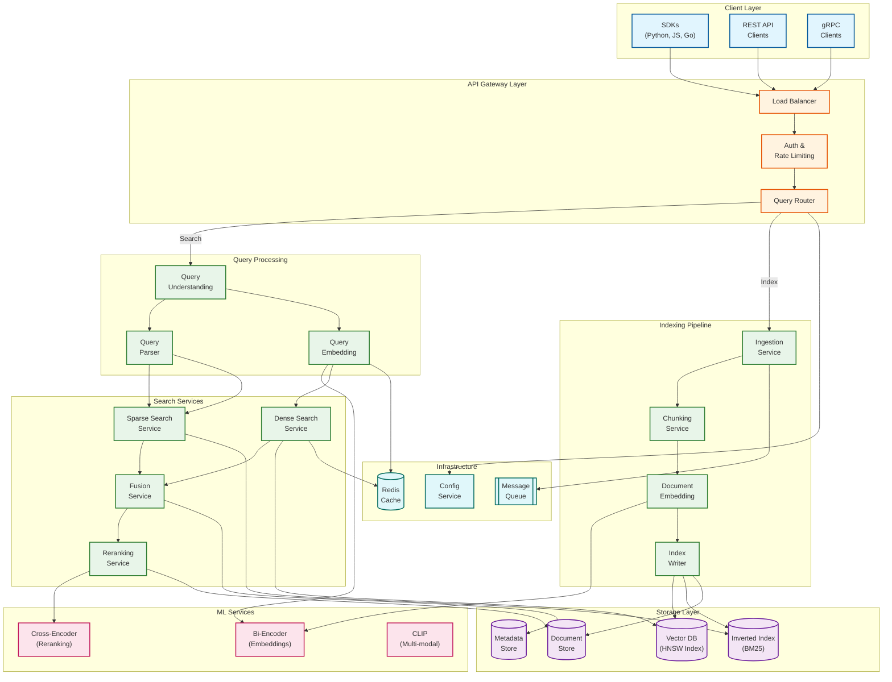
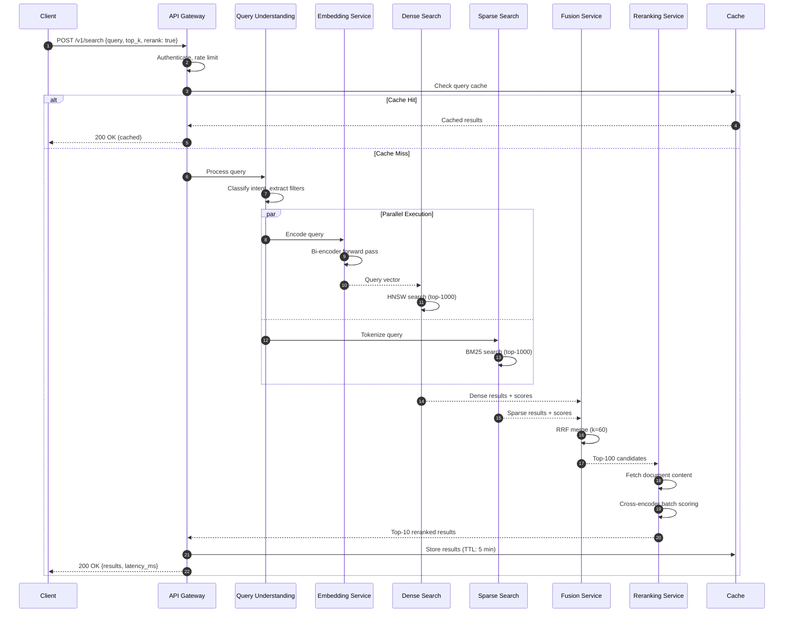
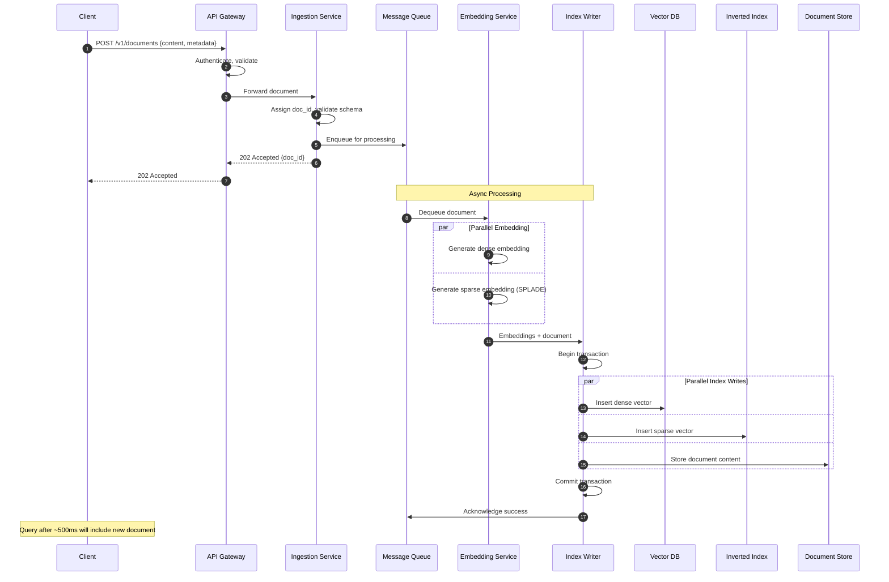
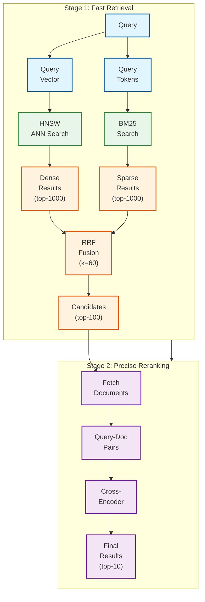
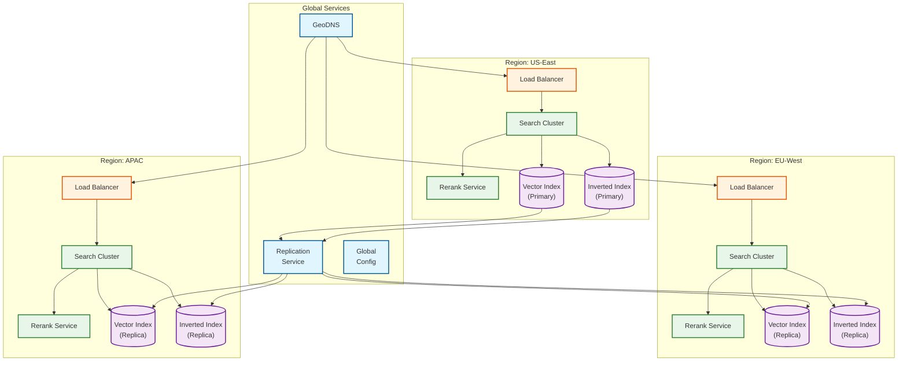

# High-Level Design

## System Architecture



---

## Component Descriptions

### Client Layer

| Component | Responsibility | Technology |
|-----------|----------------|------------|
| **SDKs** | Native client libraries | Python, JavaScript, Go, Java |
| **REST API** | HTTP/JSON interface | OpenAPI 3.0 spec |
| **gRPC** | High-performance streaming | Protocol Buffers |

### Gateway Layer

| Component | Responsibility | Technology |
|-----------|----------------|------------|
| **Load Balancer** | Traffic distribution, health checks | L7 load balancer |
| **Auth & Rate Limiting** | API key validation, quota enforcement | OAuth2, token bucket |
| **Query Router** | Route to search or index path | Content-based routing |

### Query Processing

| Component | Responsibility | Technology |
|-----------|----------------|------------|
| **Query Understanding** | Intent detection, query classification | ML classifier |
| **Query Embedding** | Convert query to vector | Bi-encoder model |
| **Query Parser** | Tokenize for BM25, extract filters | Custom parser |

### Search Services

| Component | Responsibility | Technology |
|-----------|----------------|------------|
| **Dense Search** | HNSW approximate nearest neighbor | Vector DB (Qdrant, Milvus) |
| **Sparse Search** | BM25 inverted index lookup | Elasticsearch, Lucene |
| **Fusion Service** | Combine ranked lists with RRF | In-memory merge |
| **Reranking Service** | Cross-encoder re-scoring | GPU-accelerated inference |

### Indexing Pipeline

| Component | Responsibility | Technology |
|-----------|----------------|------------|
| **Ingestion Service** | Accept documents, validation | Queue-backed |
| **Document Embedding** | Generate dense + sparse vectors | Bi-encoder + SPLADE |
| **Chunking Service** | Split long documents | Sentence/semantic splitter |
| **Index Writer** | Atomic multi-index writes | Transactional writer |

### Storage Layer

| Component | Responsibility | Technology |
|-----------|----------------|------------|
| **Vector DB** | Dense embeddings + HNSW index | Qdrant, Milvus, pgvector |
| **Inverted Index** | Sparse vectors, BM25 | Elasticsearch, OpenSearch |
| **Document Store** | Full document content | PostgreSQL, Object Storage |
| **Metadata Store** | Schemas, tenant config | PostgreSQL |

---

## Data Flow: Hybrid Search Query



### Query Flow Timing Breakdown

| Stage | P50 Latency | P95 Latency | Notes |
|-------|-------------|-------------|-------|
| Auth & routing | 1ms | 3ms | Fast path |
| Query embedding | 5ms | 15ms | Bi-encoder |
| Dense search | 10ms | 30ms | HNSW ANN |
| Sparse search | 5ms | 15ms | Inverted index |
| RRF fusion | 1ms | 3ms | In-memory |
| Document fetch | 5ms | 15ms | Batch fetch |
| Cross-encoder | 25ms | 50ms | GPU batch |
| **Total** | **52ms** | **131ms** | |

---

## Data Flow: Document Indexing



### Indexing Pipeline Timing

| Stage | P50 Latency | P95 Latency | Notes |
|-------|-------------|-------------|-------|
| Validation | 2ms | 5ms | Schema check |
| Queue enqueue | 1ms | 3ms | Fast ack |
| Dense embedding | 30ms | 80ms | Bi-encoder |
| Sparse embedding | 20ms | 50ms | SPLADE |
| Vector DB write | 10ms | 30ms | HNSW insert |
| Inverted index write | 5ms | 15ms | Index update |
| Document store | 5ms | 15ms | Storage write |
| **Total (async)** | **73ms** | **198ms** | |

---

## Two-Stage Retrieval Architecture



### Stage Comparison

| Aspect | Stage 1 (Bi-encoder) | Stage 2 (Cross-encoder) |
|--------|---------------------|------------------------|
| **Model architecture** | Dual encoder, pre-computed | Single encoder, query-doc pairs |
| **Latency** | 20-50ms | 50-200ms (for 100 docs) |
| **Throughput** | 10,000 QPS | 100 QPS (per GPU) |
| **Quality** | Good | Excellent |
| **When to use** | Always (first pass) | When quality matters |

---

## Fusion Strategies

### Reciprocal Rank Fusion (RRF) - Default

```
RRF_score(doc) = Σ 1/(k + rank_i(doc))
                 i∈retrievers
```

**Configuration:**
- k = 60 (standard, provides good rank compression)
- Works with any number of retrievers
- No score normalization needed

### Linear Combination

```
Combined_score(doc) = α × dense_score + (1-α) × sparse_score
```

**Configuration:**
- α = 0.5 default (equal weight)
- Requires score normalization (min-max or z-score)
- Tunable per use case

### Fusion Strategy Comparison

| Strategy | Formula | Pros | Cons | Use Case |
|----------|---------|------|------|----------|
| **RRF (k=60)** | 1/(k+rank) | No tuning, robust | Ignores score magnitude | Default |
| **Linear** | α×dense + (1-α)×sparse | Tunable | Needs calibration | Domain-specific |
| **RelativeScore** | Normalize then combine | Score-aware | Complex | Interpretability |
| **Learned** | ML model | Optimal | Training overhead | High-volume |
| **Max** | max(dense, sparse) | Simple | Loses information | Quick baseline |

---

## Key Architectural Decisions

### Decision 1: Parallel vs Sequential Retrieval

| Option | Pros | Cons | Decision |
|--------|------|------|----------|
| **Parallel (fan-out)** | Lower latency, both signals equally | More resources, complexity | **Selected** |
| **Sequential (cascade)** | Lower cost, can skip sparse if dense sufficient | Higher latency | Not selected |

**Rationale:** Hybrid search value comes from combining both signals. Sequential would defeat the purpose and add latency.

### Decision 2: Fusion Strategy

| Option | Pros | Cons | Decision |
|--------|------|------|----------|
| **RRF** | Parameter-free, robust, no calibration | Ignores score magnitude | **Default** |
| **Linear** | Tunable, interpretable | Requires normalization, tuning | Alternative |
| **Learned** | Optimal for domain | Training data, complexity | Future |

**Rationale:** RRF provides excellent results out-of-the-box. Offer linear combination as configurable option.

### Decision 3: Reranking Placement

| Option | Pros | Cons | Decision |
|--------|------|------|----------|
| **Always-on** | Best quality | Higher latency, cost | Not selected |
| **Optional (configurable)** | Flexibility, cost control | Complexity | **Selected** |
| **Never** | Fastest, cheapest | Lower quality | Not selected |

**Rationale:** Different use cases have different latency/quality trade-offs. Make reranking opt-in.

### Decision 4: Index Synchronization

| Option | Pros | Cons | Decision |
|--------|------|------|----------|
| **Sync (transactional)** | Strong consistency | Higher write latency | Not selected |
| **Async (eventual)** | Lower latency, higher throughput | Temporary inconsistency | **Selected** |
| **Atomic multi-write** | Best-effort consistency | Complexity | **With async** |

**Rationale:** Search can tolerate seconds of index lag. Async with atomic multi-write balances consistency and performance.

---

## Technology Selection

### Vector Database Options

| Technology | Best For | Throughput | Features |
|------------|----------|------------|----------|
| **Qdrant** | Performance | Very High | Rust, filters, payloads |
| **Milvus** | Scale | High | GPU support, hybrid |
| **Weaviate** | Multi-modal | High | Modules, GraphQL |
| **pgvector** | Simplicity | Medium | PostgreSQL integration |
| **Vespa** | Full hybrid | Very High | Native BM25+vector |

**Recommendation:** Vespa for full hybrid, Qdrant for vector-first with external BM25.

### Embedding Model Selection

| Model | Dimensions | Quality | Latency | Use Case |
|-------|------------|---------|---------|----------|
| **text-embedding-3-large** | 3072 | Excellent | 50ms | Quality-first |
| **text-embedding-3-small** | 1536 | Good | 20ms | Balanced |
| **E5-large-v2** | 1024 | Very Good | 30ms | On-prem |
| **BGE-M3** | 1024 | Very Good | 30ms | Multi-lingual |
| **SPLADE** | Variable | Good | 40ms | Learned sparse |

**Recommendation:** E5-large-v2 or BGE-M3 for on-prem, text-embedding-3-small for API.

### Reranking Model Selection

| Model | Latency (100 docs) | Quality Boost | Deployment |
|-------|-------------------|---------------|------------|
| **Cohere Rerank 3** | 50ms | +25% | API |
| **Cohere Rerank 3 Nimble** | 30ms | +20% | API |
| **ms-marco-MiniLM** | 40ms | +15% | Self-hosted |
| **bge-reranker-large** | 60ms | +25% | Self-hosted |
| **ColBERT** | 20ms | +15% | Self-hosted |

**Recommendation:** Cohere Rerank 3 Nimble for API simplicity, bge-reranker-large for self-hosted.

---

## Multi-Region Deployment



### Multi-Region Configuration

| Aspect | Configuration |
|--------|---------------|
| **Routing** | GeoDNS routes to nearest region |
| **Replication** | Async replication with 1-5 second lag |
| **Failover** | Automatic failover to next-nearest region |
| **Write Region** | Single primary, read from any |
| **Consistency** | Eventual (acceptable for search) |

---

## Architecture Pattern Checklist

| Pattern | Decision | Rationale |
|---------|----------|-----------|
| **Sync vs Async** | Async for indexing, sync for search | Write throughput vs read latency |
| **Event-driven vs Request-response** | Request-response for search, event-driven for indexing | User expectation for search |
| **Push vs Pull** | Pull for search, push for index updates | Client-initiated search |
| **Stateless vs Stateful** | Stateless services, stateful storage | Horizontal scaling |
| **Read-heavy vs Write-heavy** | Read-heavy (1000:1 ratio) | Optimize for queries |
| **Real-time vs Batch** | Near real-time indexing, batch embedding | Balance freshness vs cost |
| **Edge vs Origin** | Origin for search, edge for caching | Complex computation at origin |
