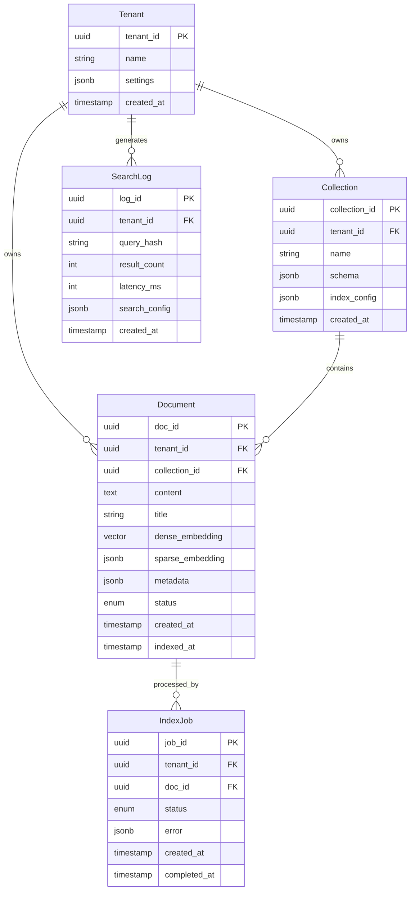

# Low-Level Design

## Data Models

### Document Schema

```yaml
Document:
  doc_id: uuid                    # Primary key, UUID v7 for time-ordering
  tenant_id: uuid                 # Tenant isolation
  collection_id: uuid             # Logical grouping

  # Content
  content: text                   # Main document text (max 100KB)
  title: string                   # Document title (max 1KB)
  url: string                     # Optional source URL

  # Embeddings
  dense_embedding: vector[1024]   # Bi-encoder embedding
  dense_model: string             # Model used (for versioning)
  sparse_embedding: sparse_vector # {token_id: weight} pairs
  sparse_model: string            # SPLADE or BM25 tokenizer

  # Metadata
  metadata: jsonb
    source: string                # Origin system
    language: string              # ISO 639-1 code
    category: string[]            # Classification tags
    created_date: timestamp       # Document creation date
    custom: object                # User-defined fields

  # System fields
  created_at: timestamp
  updated_at: timestamp
  indexed_at: timestamp           # When indexing completed
  status: enum                    # active | deleted | pending

  # Multi-modal (optional)
  image_embedding: vector[512]    # CLIP embedding
  modality: enum                  # text | image | audio | video
```

### Query Schema

```yaml
SearchQuery:
  query_text: string              # User query (required)
  tenant_id: uuid                 # Tenant context (required)
  collection_id: uuid             # Optional: limit to collection

  # Search configuration
  search_type: enum               # hybrid | dense | sparse
    default: hybrid
  top_k: int                      # Number of results (1-1000)
    default: 10

  # Hybrid parameters
  alpha: float                    # Dense weight (0.0-1.0)
    default: 0.5                  # Only for linear fusion
  fusion_method: enum             # rrf | linear | max
    default: rrf
  rrf_k: int                      # RRF constant
    default: 60

  # Reranking
  rerank: boolean                 # Enable cross-encoder
    default: false
  rerank_top_k: int               # Candidates to rerank
    default: 100
  rerank_model: string            # Model name
    default: "default"

  # Filtering
  filters: object
    must: filter[]                # AND conditions
    should: filter[]              # OR conditions
    must_not: filter[]            # NOT conditions

  # Advanced
  include_vectors: boolean        # Return embeddings
    default: false
  include_metadata: boolean       # Return metadata
    default: true
  highlight: boolean              # Highlight matches
    default: false
  min_score: float                # Score threshold
    default: 0.0
```

### Search Result Schema

```yaml
SearchResult:
  doc_id: uuid
  score: float                    # Final combined score

  # Score breakdown
  dense_score: float              # Vector similarity (0-1)
  sparse_score: float             # BM25 score (unbounded)
  rerank_score: float             # Cross-encoder score (0-1)
  rrf_score: float                # RRF combined score

  # Content
  content: text                   # Document content
  title: string
  url: string

  # Highlights
  highlights: object
    content: string[]             # Highlighted snippets
    title: string[]

  # Metadata
  metadata: object

  # Optional
  dense_embedding: vector         # If requested
  sparse_embedding: sparse_vector # If requested
```

### Sparse Vector Schema

```yaml
SparseVector:
  # Efficient representation for high-dimensional sparse data
  indices: int[]                  # Non-zero token IDs
  values: float[]                 # Corresponding weights

  # Example:
  # indices: [1523, 4821, 9012, 15234]
  # values:  [0.85, 0.72, 0.91, 0.65]

  # Equivalent to dense vector with mostly zeros:
  # [0, 0, ..., 0.85, 0, ..., 0.72, ...]
```

---

## Entity Relationship Diagram



---

## Database Indexes

### Vector Index (HNSW)

```sql
-- HNSW index for approximate nearest neighbor search
CREATE INDEX idx_doc_dense_embedding ON documents
USING hnsw (dense_embedding vector_cosine_ops)
WITH (
    m = 16,                    -- Connections per node (higher = better recall, more memory)
    ef_construction = 200      -- Build-time exploration factor
);

-- Partitioned index per tenant for isolation
CREATE INDEX idx_doc_dense_tenant ON documents
USING hnsw (dense_embedding vector_cosine_ops)
WITH (m = 16, ef_construction = 200)
WHERE tenant_id = :tenant_id;
```

### HNSW Parameter Guidelines

| Parameter | Value | Trade-off |
|-----------|-------|-----------|
| **m** | 16 | Connections per node. Higher = better recall, more memory |
| **ef_construction** | 200 | Build quality. Higher = better index, slower build |
| **ef_search** | 64-256 | Query exploration. Higher = better recall, slower query |

### Inverted Index (BM25)

```sql
-- Full-text search index with custom tokenizer
CREATE INDEX idx_doc_content_fts ON documents
USING gin (to_tsvector('english', content));

-- Sparse vector index (for SPLADE)
CREATE INDEX idx_doc_sparse ON documents
USING gin (sparse_embedding jsonb_path_ops);

-- Composite index for filtered search
CREATE INDEX idx_doc_tenant_status ON documents (tenant_id, status)
WHERE status = 'active';

-- Metadata filtering indexes
CREATE INDEX idx_doc_metadata_category ON documents
USING gin ((metadata -> 'category') jsonb_path_ops);

CREATE INDEX idx_doc_metadata_language ON documents ((metadata ->> 'language'));
```

---

## API Design

### Search API

```yaml
POST /v1/search
Content-Type: application/json
Authorization: Bearer {api_key}
X-Tenant-ID: {tenant_id}

Request:
  query: string                   # Required: search query
  top_k: int                      # Default: 10, max: 1000
  search_type: "hybrid" | "dense" | "sparse"
  filters:
    must:
      - field: "metadata.category"
        operator: "in"
        value: ["technology", "science"]
    must_not:
      - field: "metadata.language"
        operator: "eq"
        value: "de"
  rerank: boolean                 # Default: false
  rerank_top_k: int               # Default: 100
  alpha: float                    # Default: 0.5 (for linear fusion)
  include_metadata: boolean       # Default: true

Response:
  results:
    - doc_id: "uuid"
      score: 0.892
      dense_score: 0.85
      sparse_score: 12.4
      rerank_score: 0.91
      content: "..."
      title: "..."
      metadata: {...}
      highlights:
        content: ["<em>matching</em> text"]
  total_count: 1542
  latency_ms: 87
  search_metadata:
    fusion_method: "rrf"
    reranked: true
    dense_candidates: 1000
    sparse_candidates: 1000

Error Responses:
  400: Invalid request (malformed query, invalid filters)
  401: Unauthorized (invalid API key)
  403: Forbidden (tenant mismatch)
  429: Rate limited
  500: Internal error
  503: Service unavailable (index updating)
```

### Document Indexing API

```yaml
POST /v1/documents
Content-Type: application/json
Authorization: Bearer {api_key}
X-Tenant-ID: {tenant_id}

Request:
  documents:
    - id: "optional-client-id"    # Optional: client-provided ID
      content: "Document text..."
      title: "Document Title"
      metadata:
        category: ["tech"]
        language: "en"
        custom_field: "value"
  collection_id: "uuid"           # Optional: target collection
  upsert: boolean                 # Default: false

Response:
  accepted:
    - doc_id: "uuid"
      client_id: "optional-client-id"
      status: "pending"
  failed:
    - client_id: "failed-id"
      error: "Content too long"
  job_id: "uuid"                  # Batch job tracking

---
GET /v1/documents/{doc_id}
Response:
  doc_id: "uuid"
  content: "..."
  title: "..."
  metadata: {...}
  status: "active"
  created_at: "2024-01-15T..."
  indexed_at: "2024-01-15T..."

---
DELETE /v1/documents/{doc_id}
Response:
  doc_id: "uuid"
  status: "deleted"

---
POST /v1/documents/bulk
# Same as POST /v1/documents but optimized for batch
# Accepts up to 1000 documents per request
```

### Collection Management API

```yaml
POST /v1/collections
Request:
  name: "my-collection"
  schema:
    content: {type: "text", required: true}
    title: {type: "string", required: false}
    category: {type: "string[]", filterable: true}
  index_config:
    dense_model: "e5-large-v2"
    sparse_model: "splade-v3"
    hnsw_m: 16
    hnsw_ef_construction: 200

Response:
  collection_id: "uuid"
  name: "my-collection"
  status: "active"
```

### Rate Limiting

| Endpoint | Rate Limit | Burst |
|----------|------------|-------|
| POST /v1/search | 100 req/s | 200 |
| POST /v1/documents | 50 req/s | 100 |
| POST /v1/documents/bulk | 10 req/s | 20 |
| GET /v1/documents | 200 req/s | 400 |
| DELETE /v1/documents | 50 req/s | 100 |

---

## Core Algorithms

### Algorithm 1: Reciprocal Rank Fusion (RRF)

```
ALGORITHM ReciprocalRankFusion(ranked_lists, k=60, top_n=100)
═══════════════════════════════════════════════════════════════

INPUT:
  ranked_lists: list of (doc_id, score) lists from different retrievers
  k: constant (default 60, controls rank sensitivity)
  top_n: number of results to return

OUTPUT:
  fused_results: list of (doc_id, rrf_score) sorted by score

PROCEDURE:

1. INITIALIZE
   scores = {}  // doc_id -> cumulative RRF score

2. FOR EACH retriever_results IN ranked_lists DO
   FOR rank, (doc_id, _) IN enumerate(retriever_results, start=1) DO
     IF doc_id NOT IN scores THEN
       scores[doc_id] = 0.0
     END IF

     // RRF formula: 1/(k + rank)
     scores[doc_id] += 1.0 / (k + rank)
   END FOR
END FOR

3. // Sort by RRF score descending
   sorted_results = SORT(scores.items(), by=score, descending=True)

4. RETURN sorted_results[:top_n]

═══════════════════════════════════════════════════════════════

COMPLEXITY:
  Time: O(n × m) where n = total docs, m = number of retrievers
  Space: O(n) for score accumulation

EXAMPLE:
  Dense results: [A@1, B@2, C@3, D@4]
  Sparse results: [B@1, A@2, E@3, C@4]

  RRF scores (k=60):
  A: 1/(60+1) + 1/(60+2) = 0.0164 + 0.0161 = 0.0325
  B: 1/(60+2) + 1/(60+1) = 0.0161 + 0.0164 = 0.0325
  C: 1/(60+3) + 1/(60+4) = 0.0159 + 0.0156 = 0.0315
  D: 1/(60+4) = 0.0156
  E: 1/(60+3) = 0.0159

  Final ranking: [A, B, C, E, D] (A and B tie, original order preserved)
```

### Algorithm 2: HNSW Search

```
ALGORITHM HNSWSearch(query_vector, index, ef_search, top_k)
═══════════════════════════════════════════════════════════════

INPUT:
  query_vector: query embedding (1024 dimensions)
  index: HNSW graph index
  ef_search: exploration factor (higher = better recall, slower)
  top_k: number of results to return

OUTPUT:
  results: list of (doc_id, distance) sorted by distance

PROCEDURE:

1. INITIALIZE
   entry_point = index.entry_point  // Top layer entry
   current_layer = index.max_layer
   current_node = entry_point

2. // Greedy search through upper layers (layer > 0)
   WHILE current_layer > 0 DO
     // Find closest neighbor in current layer
     changed = True
     WHILE changed DO
       changed = False
       FOR neighbor IN index.get_neighbors(current_node, current_layer) DO
         IF distance(query_vector, neighbor) < distance(query_vector, current_node) THEN
           current_node = neighbor
           changed = True
         END IF
       END FOR
     END WHILE
     current_layer -= 1
   END WHILE

3. // Search base layer (layer 0) with beam search
   candidates = PriorityQueue(maxsize=ef_search)  // Min-heap by distance
   visited = Set()
   results = PriorityQueue(maxsize=top_k)  // Max-heap by distance

   candidates.push((distance(query_vector, current_node), current_node))
   visited.add(current_node)

4. WHILE NOT candidates.empty() DO
     current_dist, current = candidates.pop_min()

     // Stop if current candidate is worse than worst result
     IF results.size() >= top_k AND current_dist > results.peek_max().distance THEN
       BREAK
     END IF

     // Update results
     results.push((current_dist, current))
     IF results.size() > top_k THEN
       results.pop_max()
     END IF

     // Explore neighbors
     FOR neighbor IN index.get_neighbors(current, layer=0) DO
       IF neighbor NOT IN visited THEN
         visited.add(neighbor)
         neighbor_dist = distance(query_vector, neighbor)

         IF candidates.size() < ef_search OR neighbor_dist < candidates.peek_max().distance THEN
           candidates.push((neighbor_dist, neighbor))
         END IF
       END IF
     END FOR
   END WHILE

5. RETURN results.to_sorted_list()

═══════════════════════════════════════════════════════════════

COMPLEXITY:
  Time: O(log(n) × m × ef_search) average case
  Space: O(ef_search) for candidates

  where n = number of vectors, m = average connections per node

PARAMETERS:
  ef_search | Recall@10 | Latency
  32        | 0.90      | 2ms
  64        | 0.95      | 4ms
  128       | 0.98      | 8ms
  256       | 0.99      | 15ms
```

### Algorithm 3: Cross-Encoder Reranking

```
ALGORITHM CrossEncoderRerank(query, candidates, top_k, model)
═══════════════════════════════════════════════════════════════

INPUT:
  query: search query string
  candidates: list of (doc_id, content) tuples from first stage
  top_k: number of results to return
  model: cross-encoder model

OUTPUT:
  reranked: list of (doc_id, score) sorted by relevance

PROCEDURE:

1. INITIALIZE
   batch_size = 32  // GPU batch size
   scored_docs = []

2. // Prepare input pairs
   pairs = []
   FOR doc_id, content IN candidates DO
     // Truncate content to max_length (512 tokens typical)
     truncated = TRUNCATE(content, max_tokens=512)
     pairs.append((query, truncated, doc_id))
   END FOR

3. // Batch inference
   FOR batch IN CHUNK(pairs, batch_size) DO
     // Tokenize batch
     inputs = []
     FOR query, content, _ IN batch DO
       // Cross-encoder input format: [CLS] query [SEP] content [SEP]
       tokenized = TOKENIZE(f"[CLS] {query} [SEP] {content} [SEP]")
       inputs.append(tokenized)
     END FOR

     // Forward pass (GPU)
     scores = model.forward(BATCH(inputs))  // Batch of scores

     // Collect results
     FOR i, (_, _, doc_id) IN enumerate(batch) DO
       // Sigmoid to normalize score to [0, 1]
       normalized_score = SIGMOID(scores[i])
       scored_docs.append((doc_id, normalized_score))
     END FOR
   END FOR

4. // Sort by score descending
   reranked = SORT(scored_docs, by=score, descending=True)

5. RETURN reranked[:top_k]

═══════════════════════════════════════════════════════════════

COMPLEXITY:
  Time: O(n × L² / batch_size) where n = candidates, L = sequence length
  Space: O(batch_size × L) for GPU memory

LATENCY (100 candidates, batch_size=32):
  Model                  | GPU      | Latency
  ms-marco-MiniLM-L-6    | A10G     | 25ms
  bge-reranker-large     | A10G     | 50ms
  bge-reranker-v2-m3     | A10G     | 60ms

QUALITY IMPROVEMENT:
  Rerank top-50:  +15-20% NDCG@10
  Rerank top-100: +20-25% NDCG@10
  Rerank top-200: +22-27% NDCG@10 (diminishing returns)
```

### Algorithm 4: SPLADE Sparse Encoding

```
ALGORITHM SPLADEEncode(text, model, threshold=0.0)
═══════════════════════════════════════════════════════════════

INPUT:
  text: document or query text
  model: SPLADE model (BERT + MLM head)
  threshold: minimum weight to include (default 0.0)

OUTPUT:
  sparse_vector: dict{token_id: weight}

PROCEDURE:

1. // Tokenize input
   tokens = TOKENIZE(text, max_length=512)
   input_ids = tokens.input_ids       // [1, seq_len]
   attention_mask = tokens.attention_mask

2. // Forward pass through BERT
   hidden_states = model.bert(input_ids, attention_mask)
   // hidden_states: [1, seq_len, hidden_dim]

3. // Project to vocabulary size via MLM head
   logits = model.mlm_head(hidden_states)
   // logits: [1, seq_len, vocab_size]

4. // Apply log-saturation for sparsity
   // log(1 + ReLU(x)) encourages sparse, positive weights
   weights = LOG(1 + RELU(logits))
   // weights: [1, seq_len, vocab_size]

5. // Max-pool across sequence positions
   // Each vocabulary term gets its maximum activation
   pooled = MAX(weights, dim=1)
   // pooled: [1, vocab_size]

6. // Extract non-zero weights above threshold
   sparse_vector = {}
   FOR token_id, weight IN enumerate(pooled[0]) DO
     IF weight > threshold THEN
       sparse_vector[token_id] = weight
     END IF
   END FOR

7. RETURN sparse_vector

═══════════════════════════════════════════════════════════════

COMPLEXITY:
  Time: O(L × V) where L = sequence length, V = vocabulary size
  Space: O(V) for output, typically ~100-500 non-zero terms

OUTPUT CHARACTERISTICS:
  - Average non-zero terms: 100-300 per document
  - Vocabulary size: ~30,000 (BERT wordpiece)
  - Weight range: 0.0 - 5.0 typically

EXAMPLE:
  Input: "machine learning algorithms for search"
  Output: {
    "machine": 2.1,
    "learning": 1.9,
    "algorithm": 1.7,
    "search": 1.8,
    "ml": 1.2,          // Expanded term
    "neural": 0.8,      // Expanded term
    "retrieval": 0.9,   // Expanded term
    ...
  }

ADVANTAGE OVER BM25:
  - Learns term importance from data
  - Expands with related terms (query expansion)
  - Better semantic matching while using inverted index
```

### Algorithm 5: Dynamic Alpha Tuning

```
ALGORITHM DynamicAlphaTuning(query, query_features)
═══════════════════════════════════════════════════════════════

INPUT:
  query: search query string
  query_features: extracted features about the query

OUTPUT:
  alpha: fusion weight for dense search (0.0 to 1.0)

PROCEDURE:

1. // Extract query features
   features = {}

   // Length features
   features["query_length"] = LEN(TOKENIZE(query))
   features["word_count"] = LEN(query.split())

   // Lexical features
   features["rare_term_ratio"] = COUNT_RARE_TERMS(query) / features["word_count"]
   features["has_quotes"] = '"' IN query  // Exact phrase
   features["has_numbers"] = REGEX_MATCH(r'\d+', query)

   // Semantic features
   features["entity_count"] = COUNT_NAMED_ENTITIES(query)
   features["is_question"] = ENDS_WITH(query, "?")

   // Query type classification (optional ML model)
   features["query_type"] = CLASSIFY_QUERY_TYPE(query)
   // Types: navigational, informational, transactional

2. // Apply rules or ML model
   IF USE_ML_MODEL THEN
     alpha = alpha_model.predict(features)
   ELSE
     // Rule-based heuristics
     alpha = 0.5  // Default: equal weight

     // Adjust for exact match queries (favor sparse)
     IF features["has_quotes"] THEN
       alpha -= 0.2
     END IF

     // Adjust for rare terms (favor sparse)
     IF features["rare_term_ratio"] > 0.3 THEN
       alpha -= 0.15
     END IF

     // Adjust for semantic queries (favor dense)
     IF features["is_question"] OR features["query_type"] == "informational" THEN
       alpha += 0.15
     END IF

     // Adjust for entity-heavy queries (favor dense)
     IF features["entity_count"] > 2 THEN
       alpha += 0.1
     END IF

     // Clamp to valid range
     alpha = CLAMP(alpha, 0.1, 0.9)
   END IF

3. RETURN alpha

═══════════════════════════════════════════════════════════════

HEURISTICS SUMMARY:
  Condition                  | Alpha Adjustment | Rationale
  Has quotes ("")            | -0.20           | Exact match needed
  High rare term ratio       | -0.15           | BM25 better for rare
  Is question                | +0.15           | Semantic understanding
  Many entities              | +0.10           | Dense captures entities
  Short query (1-2 words)    | +0.10           | Need semantic expansion
  Long query (>10 words)     | -0.10           | More lexical signal

PERFORMANCE:
  Dynamic alpha vs fixed (α=0.5): +6-7% NDCG improvement
  (Based on Weaviate DAT research)
```

---

## Error Handling

### Error Code Taxonomy

| Code | Name | Description | Client Action |
|------|------|-------------|---------------|
| 400 | INVALID_REQUEST | Malformed request body | Fix request format |
| 400 | INVALID_QUERY | Query too long or empty | Adjust query |
| 400 | INVALID_FILTER | Malformed filter syntax | Fix filter |
| 401 | UNAUTHORIZED | Missing or invalid API key | Provide valid key |
| 403 | FORBIDDEN | Tenant mismatch | Use correct tenant |
| 404 | NOT_FOUND | Document not found | Handle gracefully |
| 409 | CONFLICT | Document already exists | Use upsert |
| 422 | VALIDATION_ERROR | Schema validation failed | Fix document |
| 429 | RATE_LIMITED | Too many requests | Backoff and retry |
| 500 | INTERNAL_ERROR | Unexpected server error | Retry with backoff |
| 503 | SERVICE_UNAVAILABLE | Index updating/maintenance | Retry later |
| 504 | TIMEOUT | Request took too long | Reduce scope, retry |

### Error Response Format

```json
{
  "error": {
    "code": "INVALID_FILTER",
    "message": "Invalid filter operator 'contains' for field type 'string'",
    "details": {
      "field": "metadata.category",
      "operator": "contains",
      "expected_operators": ["eq", "in", "prefix"]
    },
    "request_id": "req_abc123",
    "documentation_url": "https://docs.example.com/errors/INVALID_FILTER"
  }
}
```

### Graceful Degradation Strategy

| Failure | Degraded Behavior | User Impact |
|---------|-------------------|-------------|
| Dense search timeout | Return sparse-only results | Lower quality |
| Sparse search timeout | Return dense-only results | May miss keywords |
| Reranking failure | Skip reranking, return fusion results | -20% quality |
| Embedding service down | Use cached embeddings, queue new docs | Stale index |
| Partial shard failure | Return results from healthy shards | Incomplete results |
