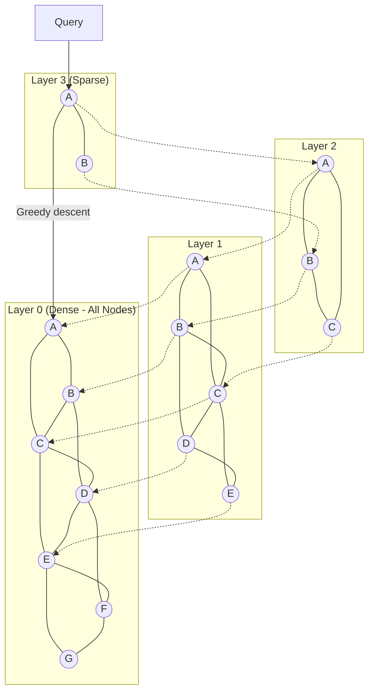

# Deep Dive and Bottlenecks

## Critical Component 1: Fusion Scoring

### The Challenge

Different retrievers produce scores on completely different scales:
- **Dense search**: Cosine similarity returns values in [0, 1] or [-1, 1]
- **Sparse search (BM25)**: Unbounded positive values, typically 5-50
- **SPLADE**: Sparse dot product, typically 10-200

Naively combining these scores (e.g., sum or average) leads to one retriever dominating.

### Score Distribution Analysis

```mermaid
flowchart LR
    subgraph Dense["Dense Scores"]
        D1["Query 1: 0.92"]
        D2["Query 2: 0.45"]
        D3["Range: [0, 1]"]
    end

    subgraph Sparse["BM25 Scores"]
        S1["Query 1: 24.5"]
        S2["Query 2: 8.2"]
        S3["Range: [0, ∞)"]
    end

    subgraph Problem["The Problem"]
        P1["24.5 >> 0.92"]
        P2["BM25 dominates"]
        P3["Dense signal lost"]
    end

    Dense --> Problem
    Sparse --> Problem
```



### Score Normalization Strategies

| Strategy | Formula | Pros | Cons | When to Use |
|----------|---------|------|------|-------------|
| **Min-Max** | `(s - min) / (max - min)` | Simple, bounded [0,1] | Query-dependent | Per-query normalization |
| **Z-Score** | `(s - mean) / std` | Handles outliers | Unbounded output | Statistical normalization |
| **Sigmoid** | `1 / (1 + e^(-s))` | Always [0,1] | Compresses extremes | Fixed normalization |
| **Rank-based (RRF)** | `1 / (k + rank)` | No normalization | Loses score magnitude | Default choice |
| **Percentile** | `percentile_rank(s)` | Robust to outliers | Requires score distribution | Pre-computed percentiles |

### RRF k-Parameter Deep Analysis

The `k` parameter in RRF controls how much weight is given to rank position:

```
RRF_score = 1 / (k + rank)

Low k (e.g., 1):   Top ranks dominate aggressively
                   rank 1: 0.500, rank 2: 0.333, rank 3: 0.250

High k (e.g., 60): More democratic, smaller rank differences
                   rank 1: 0.0164, rank 2: 0.0161, rank 3: 0.0159

Very high k (100+): Nearly uniform weighting
                    rank 1: 0.0099, rank 2: 0.0098, rank 3: 0.0097
```

| k Value | Behavior | Best For |
|---------|----------|----------|
| **k = 1** | Top rank dominates | High-precision tasks |
| **k = 20** | Moderate rank sensitivity | Balanced results |
| **k = 60** | Standard, well-tested | General purpose (default) |
| **k = 100** | Democratic | Diversity-focused results |

**Recommendation:** Use k=60 as default. Only tune if you have labeled data showing improvement.

### Normalization Implementation Pseudocode

```
ALGORITHM LinearFusion(dense_results, sparse_results, alpha)
═══════════════════════════════════════════════════════════════

INPUT:
  dense_results: list of (doc_id, cosine_similarity)
  sparse_results: list of (doc_id, bm25_score)
  alpha: weight for dense (0.0 to 1.0)

OUTPUT:
  combined_results: list of (doc_id, combined_score)

PROCEDURE:

1. // Normalize dense scores (already [0,1] for cosine)
   dense_normalized = {}
   FOR doc_id, score IN dense_results DO
     dense_normalized[doc_id] = score  // Assuming cosine similarity
   END FOR

2. // Min-max normalize sparse scores
   sparse_scores = [score for _, score in sparse_results]
   min_sparse = MIN(sparse_scores)
   max_sparse = MAX(sparse_scores)

   sparse_normalized = {}
   FOR doc_id, score IN sparse_results DO
     IF max_sparse > min_sparse THEN
       sparse_normalized[doc_id] = (score - min_sparse) / (max_sparse - min_sparse)
     ELSE
       sparse_normalized[doc_id] = 1.0
     END IF
   END FOR

3. // Combine scores
   all_docs = SET(dense_normalized.keys()) | SET(sparse_normalized.keys())
   combined = {}

   FOR doc_id IN all_docs DO
     d_score = dense_normalized.get(doc_id, 0.0)
     s_score = sparse_normalized.get(doc_id, 0.0)
     combined[doc_id] = alpha * d_score + (1 - alpha) * s_score
   END FOR

4. RETURN SORT(combined.items(), by=score, descending=True)
```

---

## Critical Component 2: Cross-Encoder Reranking Latency

### The Challenge

Cross-encoders process query-document pairs through full transformer attention, making them 100-1000x slower than bi-encoders:

| Model Type | Throughput | Latency (1 doc) | Latency (100 docs) |
|------------|------------|-----------------|-------------------|
| **Bi-encoder** | 10,000 docs/s | 0.1ms | N/A (pre-computed) |
| **Cross-encoder** | 10-100 docs/s | 5-10ms | 500-1000ms |
| **ColBERT** | 1,000 docs/s | 1ms | 100ms |

### Latency Budget Breakdown

For a p95 latency budget of 100ms:

```
Component              | Allocation | Notes
──────────────────────┼────────────┼────────────────────────
Query encoding         | 15ms      | Bi-encoder
Dense search (HNSW)    | 25ms      | ef_search=128
Sparse search (BM25)   | 15ms      | Inverted index
RRF fusion             | 3ms       | In-memory merge
Document fetch         | 12ms      | Batch fetch from store
Cross-encoder rerank   | 25ms      | 50 docs on GPU
Response formatting    | 5ms       | JSON serialization
──────────────────────┼────────────┼────────────────────────
TOTAL                  | 100ms     | p95 budget
```

### Optimization Strategies

| Strategy | Latency Reduction | Quality Impact | Implementation |
|----------|-------------------|----------------|----------------|
| **Batching** | 3-4x | None | Group docs, single GPU call |
| **Smaller model** | 2x | -5% NDCG | MiniLM vs BERT-base |
| **Fewer candidates** | Linear | -5-10% NDCG | 50 vs 100 candidates |
| **Quantization (INT8)** | 1.5-2x | -1% NDCG | TensorRT, ONNX |
| **Distillation** | 2-3x | -3% NDCG | Train smaller from larger |
| **Early exit** | Variable | Minimal | Stop if confident |
| **Caching** | 10x (cache hit) | None | Query-doc pair cache |

### Candidate Count Trade-offs


| Rerank Top-K | Latency (ms) | NDCG@10 Lift | Recommendation |
|--------------|--------------|--------------|----------------|
| 10 | 5 | +5% | Ultra-low latency |
| 25 | 12 | +12% | Low latency |
| 50 | 25 | +18% | Balanced |
| 100 | 50 | +23% | Quality-focused |
| 200 | 100 | +25% | Diminishing returns |
| 500 | 250 | +26% | Not recommended |

**Sweet spot:** Rerank 50-100 candidates for best quality/latency trade-off.

### GPU Batching Implementation

```
ALGORITHM BatchedReranking(query, candidates, batch_size=32)
═══════════════════════════════════════════════════════════════

// Optimize GPU utilization through batching

1. // Prepare all pairs
   pairs = [(query, doc.content) for doc in candidates]

2. // Batch and process
   all_scores = []
   FOR batch IN CHUNKS(pairs, batch_size) DO
     // Tokenize batch (CPU, parallelizable)
     tokenized = TOKENIZE_BATCH(batch, max_length=512, padding=True)

     // Single GPU forward pass for entire batch
     WITH torch.no_grad() DO
       scores = model(tokenized).logits
     END WITH

     all_scores.extend(scores)
   END FOR

3. RETURN all_scores

// Latency comparison:
// Sequential (100 docs): 100 × 5ms = 500ms
// Batched (batch=32):    4 × 12ms = 48ms (10x faster)
```

---

## Critical Component 3: HNSW Index Quality

### The Challenge

HNSW provides approximate nearest neighbor search with tunable recall vs latency trade-off. Misconfigured parameters lead to either poor recall or excessive latency.

### HNSW Architecture Overview



### HNSW Parameters Explained

| Parameter | Affects | Description |
|-----------|---------|-------------|
| **M** | Build time, memory, recall | Max edges per node |
| **ef_construction** | Build time, index quality | Candidates during build |
| **ef_search** | Query time, recall | Candidates during search |

### Parameter Trade-off Matrix

| M | ef_construction | Memory | Build Time | Notes |
|---|-----------------|--------|------------|-------|
| 8 | 100 | Low | Fast | Lower recall |
| 16 | 200 | Medium | Medium | **Recommended default** |
| 32 | 400 | High | Slow | High recall, expensive |
| 64 | 800 | Very High | Very Slow | Diminishing returns |

### ef_search Tuning Guide

| ef_search | Recall@10 | Latency | QPS | Use Case |
|-----------|-----------|---------|-----|----------|
| 32 | 0.88 | 2ms | 5000 | Ultra-low latency |
| 64 | 0.94 | 4ms | 2500 | Balanced |
| 128 | 0.97 | 8ms | 1250 | **Recommended** |
| 256 | 0.99 | 15ms | 650 | High recall |
| 512 | 0.995 | 30ms | 330 | Maximum recall |

### Memory Estimation Formula

```
Memory per vector ≈ (d × 4) + (M × 2 × 4) + overhead

Where:
  d = embedding dimension
  M = connections per node
  4 = bytes per float32
  2 = bidirectional edges
  overhead ≈ 100 bytes metadata

Example (1024 dim, M=16):
  (1024 × 4) + (16 × 2 × 4) + 100 = 4096 + 128 + 100 = 4324 bytes ≈ 4.2 KB per vector

For 1 billion vectors:
  1B × 4.2 KB = 4.2 TB (before replication)
```

---

## Critical Component 4: Multi-Modal Retrieval

### The Challenge

Enabling search across text, images, and audio requires:
1. Aligned embedding spaces (text query → image results)
2. Different encoder models per modality
3. Unified scoring across modalities

### Unified vs Dual-Encoder Approaches


| Approach | Pros | Cons | Models |
|----------|------|------|--------|
| **Unified (CLIP)** | Simple, well-aligned | Single model for all | CLIP, SigLIP |
| **Dual Encoder** | Better per-modality | Alignment complexity | BLIP-2, LLaVA |
| **Late Fusion** | Modality-specific optimization | Score normalization | Custom pipelines |

### ColBERT Late Interaction for Multi-Modal

ColBERT extends to multi-modal through ColPali:

```
Traditional dense: doc → single vector
ColBERT:          doc → token vectors (d₁, d₂, ..., dₙ)
ColPali:          page_image → patch vectors (p₁, p₂, ..., pₙ)

MaxSim scoring:
score(q, d) = Σ max(qᵢ · dⱼ)  for all query tokens qᵢ
              i  j

Benefits:
- Fine-grained matching (query token to best doc token)
- Pre-compute document embeddings
- Query-time is just MaxSim (fast)
```

### Multi-Modal Indexing Strategy

| Modality | Encoder | Embedding Dim | Index |
|----------|---------|---------------|-------|
| Text | E5/BGE | 1024 | Primary HNSW |
| Image | CLIP ViT-L | 768 | Separate HNSW |
| Audio | Whisper → Text → E5 | 1024 | Shared with text |
| Video | Frame sampling + CLIP | 768 | Same as image |
| PDF | ColPali (page images) | Multi-vector | Late interaction |

---

## Bottleneck Analysis

### Bottleneck 1: Embedding Generation at Index Time

| Symptom | Cause | Impact |
|---------|-------|--------|
| Slow indexing throughput | Sequential embedding | < 10 docs/sec |
| High embedding costs | Too many API calls | Cost overrun |
| Index lag | Processing backlog | Stale search results |

**Mitigations:**

| Strategy | Improvement | Implementation |
|----------|-------------|----------------|
| Batch embedding | 10x | Send 100+ docs per API call |
| GPU parallelism | 20x | Local model on GPU |
| Async processing | 5x | Queue-based, parallel workers |
| Caching | Variable | Skip re-embedding unchanged docs |

### Bottleneck 2: Dense-Sparse Index Synchronization

| Symptom | Cause | Impact |
|---------|-------|--------|
| Missing results | Doc in dense, not in sparse | Incomplete results |
| Duplicate handling | Race condition on update | Inconsistent state |
| Delete lag | Soft delete not propagated | Ghost results |

**Mitigations:**

```
SOLUTION: Atomic Multi-Index Write

1. Write to both indexes in same transaction
2. Use version vector for consistency checks
3. Implement two-phase commit for cross-system writes

Write flow:
  BEGIN TRANSACTION
    write_to_vector_db(doc_id, embedding)
    write_to_inverted_index(doc_id, tokens)
    write_to_metadata_store(doc_id, metadata)
  COMMIT

On failure:
  ROLLBACK all writes
  Retry with exponential backoff
```

### Bottleneck 3: Score Calibration Across Retrievers

| Symptom | Cause | Impact |
|---------|-------|--------|
| One retriever dominates | Score scale mismatch | Lost hybrid benefit |
| Quality varies by query | Fixed alpha | Suboptimal results |
| Fusion unpredictable | No normalization | Inconsistent ranking |

**Mitigations:**

| Strategy | When to Use |
|----------|-------------|
| RRF (default) | Always works, no calibration |
| Per-query normalization | If using linear fusion |
| Dynamic alpha | Query-dependent weighting |
| Learned fusion | Labeled data available |

---

## Race Conditions

### Race Condition 1: Index Update During Search

**Scenario:** Document indexed to dense but not yet to sparse (or vice versa).


**Solution:**

```
1. Atomic multi-index commits (preferred)
   - Write to all indexes in transaction
   - Rollback on any failure

2. Version-based consistency
   - Each doc has version number
   - Search only returns docs where all indexes have same version

3. Read-after-write consistency
   - Writer waits for all indexes to confirm
   - Returns success only when all complete
```

### Race Condition 2: Concurrent Reranking GPU Contention

**Scenario:** Multiple queries compete for limited GPU resources.


**Solution:**

```
1. Request batching
   - Combine multiple queries into single GPU batch
   - Increases throughput, slight latency increase per query

2. Priority queuing
   - Latency-sensitive queries get priority
   - Bulk/batch queries deprioritized

3. Auto-scaling
   - Add GPU nodes when queue depth > threshold
   - Scale down during low traffic

4. Graceful degradation
   - Skip reranking if queue too deep
   - Return first-stage results with warning
```

### Race Condition 3: Stale Cache with Index Update

**Scenario:** Cached search results become stale after document update.

**Solution:**

```
1. Cache invalidation on write
   - Document update triggers cache clear for affected queries
   - Expensive: need to track query-to-document mapping

2. TTL-based cache
   - Short TTL (1-5 minutes)
   - Accept some staleness

3. Version-tagged cache
   - Cache includes index version
   - Query includes index version check
   - Miss if versions don't match

4. Hybrid approach
   - TTL for most queries
   - Immediate invalidation for updated documents
```

---

## Performance Optimization Summary

| Component | Bottleneck | Optimization | Expected Improvement |
|-----------|------------|--------------|---------------------|
| Embedding | Sequential generation | Batch + GPU | 10-20x throughput |
| Dense search | ef_search too high | Tune to 128 | 2x latency reduction |
| Sparse search | Full index scan | Proper indexing | 5-10x latency |
| Fusion | Score normalization | Use RRF | Simpler, more robust |
| Reranking | Too many candidates | Limit to 100 | 2-4x latency |
| Reranking | Sequential inference | GPU batching | 10x throughput |
| Multi-modal | Separate indexes | Unified CLIP space | Simpler queries |
