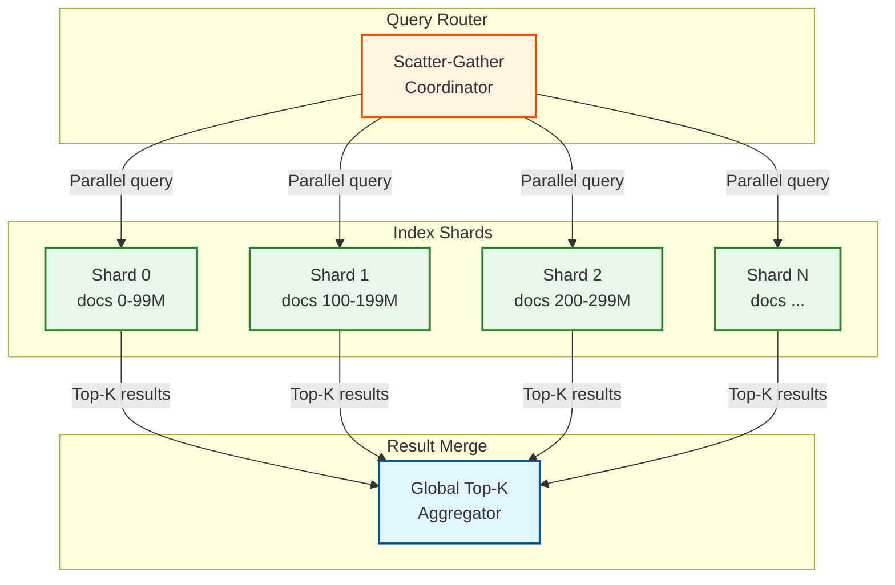
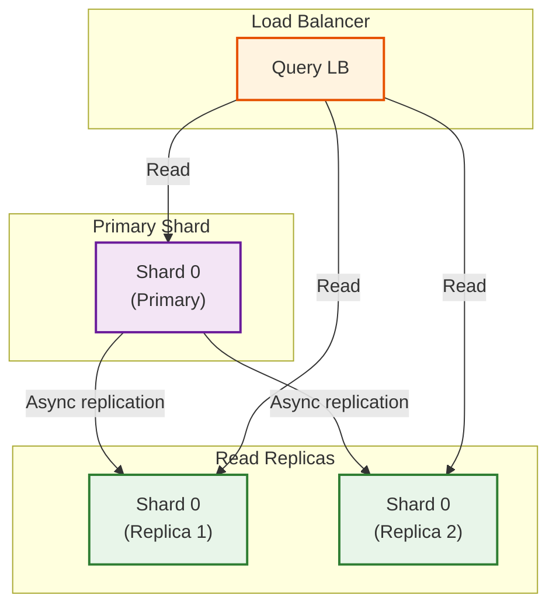
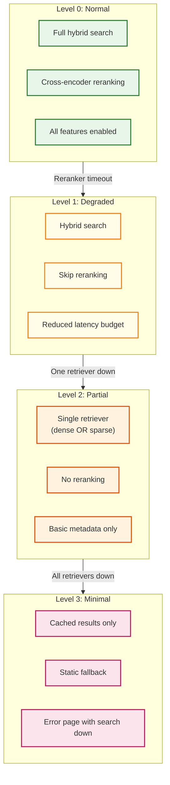
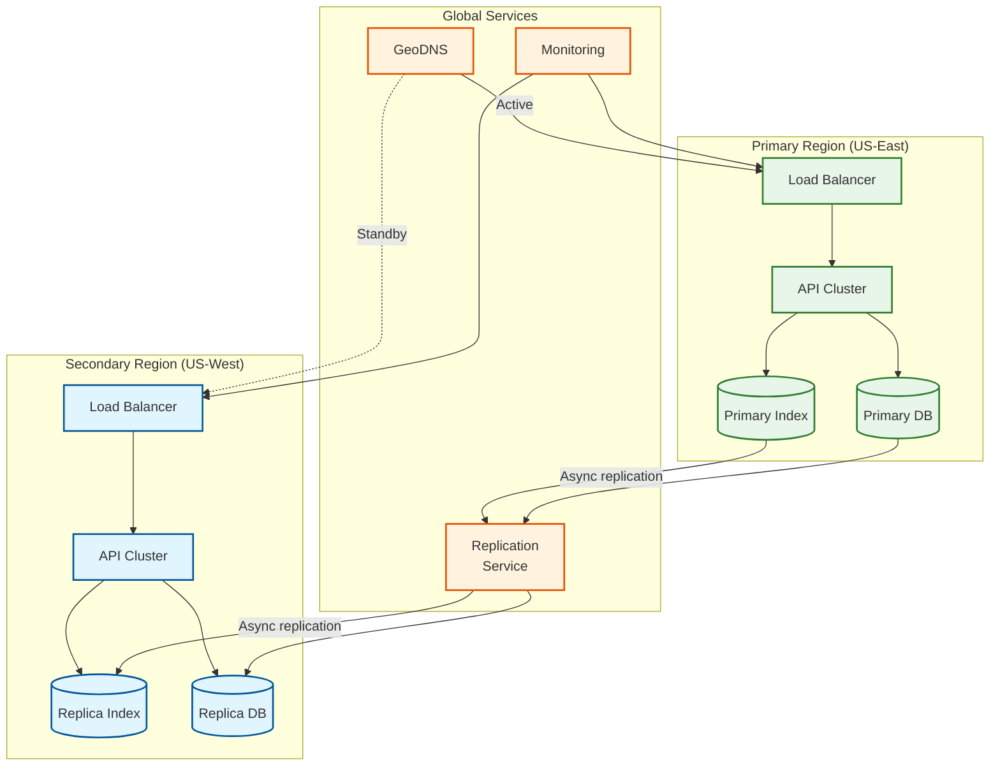
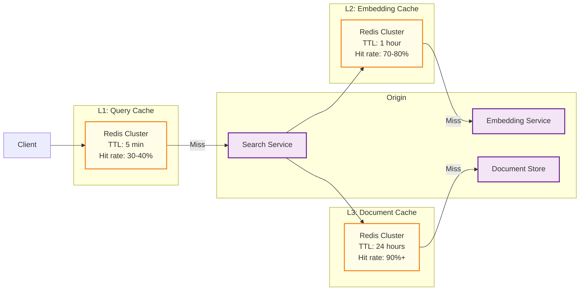

# Scalability and Reliability

## Horizontal Scaling Strategy

### Component-Level Scaling

| Component | Stateless | Scaling Trigger | Strategy | Max Scale |
|-----------|-----------|-----------------|----------|-----------|
| **API Gateway** | Yes | QPS > 1000/node | HPA on CPU | 50 pods |
| **Query Service** | Yes | Latency p95 > 80ms | HPA on latency | 100 pods |
| **Dense Search** | No | Vector count > 100M/shard | Sharding | 100 shards |
| **Sparse Search** | No | Doc count > 50M/shard | Sharding | 50 shards |
| **Reranking** | Yes | GPU utilization > 70% | Add GPU nodes | 20 GPUs |
| **Embedding** | Yes | Queue depth > 50 | Add GPU nodes | 10 GPUs |
| **Fusion** | Yes | CPU > 70% | HPA | 20 pods |

### Auto-Scaling Configuration

```yaml
# Horizontal Pod Autoscaler for Query Service
apiVersion: autoscaling/v2
kind: HorizontalPodAutoscaler
metadata:
  name: query-service-hpa
spec:
  scaleTargetRef:
    apiVersion: apps/v1
    kind: Deployment
    name: query-service
  minReplicas: 3
  maxReplicas: 100
  metrics:
    - type: Resource
      resource:
        name: cpu
        target:
          type: Utilization
          averageUtilization: 70
    - type: Pods
      pods:
        metric:
          name: request_latency_p95
        target:
          type: AverageValue
          averageValue: 80ms
  behavior:
    scaleUp:
      stabilizationWindowSeconds: 60
      policies:
        - type: Percent
          value: 100
          periodSeconds: 60
    scaleDown:
      stabilizationWindowSeconds: 300
      policies:
        - type: Percent
          value: 10
          periodSeconds: 60
```

---

## Sharding Strategies

### Document-Based Sharding (Default)



**Routing Algorithm:**
```
shard_id = hash(doc_id) % num_shards

Pros:
- Even distribution
- Simple routing
- Any doc can be queried

Cons:
- Every query hits all shards
- Higher aggregation overhead
```

### Tenant-Based Sharding

```
shard_id = hash(tenant_id) % num_shards

Pros:
- Query only hits tenant's shard(s)
- Better isolation
- Easier compliance

Cons:
- Hot tenant = hot shard
- Uneven distribution possible
```

### Hybrid Sharding

```
For large tenants:
  Dedicated shard(s) per tenant

For small tenants:
  Shared shards with tenant_id filtering

Query routing:
  IF tenant_size > threshold THEN
    route to tenant's dedicated shard(s)
  ELSE
    route to shared shard with tenant_id filter
```

### Shard Sizing Guidelines

| Metric | Recommendation | Rationale |
|--------|----------------|-----------|
| **Vectors per shard** | 50-100M | HNSW memory limits |
| **Index size per shard** | 100-200 GB | SSD performance |
| **Shards per node** | 1-2 | Memory contention |
| **Replication factor** | 3 | HA requirement |

---

## Index Scaling

### Vector Index Sharding

Each shard maintains its own HNSW graph:

```
Global Index (1B vectors)
├── Shard 0: HNSW(100M vectors)
├── Shard 1: HNSW(100M vectors)
├── ...
└── Shard 9: HNSW(100M vectors)

Query flow:
1. Query embedding generated once
2. Query sent to all shards in parallel
3. Each shard returns local top-K
4. Coordinator merges to global top-K
```

### Inverted Index Sharding

Sharded by document ID (same as vector):

```
Shard 0: Inverted index for docs 0-99M
Shard 1: Inverted index for docs 100-199M
...

Query flow:
1. Query tokenized once
2. Query sent to all shards
3. Each shard returns local BM25 results
4. Coordinator merges results
```

### Index Replication



| Aspect | Configuration |
|--------|---------------|
| **Replication factor** | 3 (1 primary + 2 replicas) |
| **Replication mode** | Async (1-5 second lag) |
| **Read routing** | Any replica (load balanced) |
| **Write routing** | Primary only |
| **Failover** | Automatic promotion of replica |

---

## Replication Strategy

### Replication Configuration by Component

| Component | Replication | Consistency | Failover Time |
|-----------|-------------|-------------|---------------|
| **Vector Index** | 3 replicas | Async | < 30 seconds |
| **Inverted Index** | 3 replicas | Async | < 30 seconds |
| **Document Store** | 3 replicas | Sync | < 10 seconds |
| **Metadata** | 3 replicas | Sync | < 10 seconds |
| **Query Service** | N (stateless) | N/A | Instant |
| **Reranking** | N (stateless) | N/A | Instant |

### Write Path Consistency

```
Write with quorum:
  success = write to primary + W-1 replicas

  Where W = 2 for async (acknowledge from 1 replica)
        W = 3 for sync (acknowledge from all replicas)

Read with quorum:
  R = 1 (read from any replica)

Consistency guarantee:
  W + R > N → strong consistency
  W + R ≤ N → eventual consistency

Our choice: W=2, R=1, N=3 → eventual consistency (AP)
```

---

## Fault Tolerance

### Circuit Breaker Configuration

```yaml
circuit_breakers:
  dense_search:
    failure_rate_threshold: 50%
    slow_call_rate_threshold: 80%
    slow_call_duration: 100ms
    minimum_calls: 10
    wait_duration_in_open_state: 30s
    permitted_calls_in_half_open: 5
    fallback: sparse_only_search

  sparse_search:
    failure_rate_threshold: 50%
    slow_call_rate_threshold: 80%
    slow_call_duration: 50ms
    minimum_calls: 10
    wait_duration_in_open_state: 30s
    fallback: dense_only_search

  reranking:
    failure_rate_threshold: 30%
    slow_call_rate_threshold: 70%
    slow_call_duration: 200ms
    minimum_calls: 5
    wait_duration_in_open_state: 60s
    fallback: skip_reranking

  embedding_service:
    failure_rate_threshold: 50%
    wait_duration_in_open_state: 120s
    fallback: queue_for_retry
```

### Graceful Degradation Levels



| Level | Trigger | Behavior | User Impact |
|-------|---------|----------|-------------|
| **L0 Normal** | All healthy | Full pipeline | Best quality |
| **L1 Degraded** | Reranker slow/down | Skip reranking | -20% quality |
| **L2 Partial** | One retriever down | Single-modal search | -30% quality |
| **L3 Minimal** | All down | Cached/static results | May be stale |
| **L4 Emergency** | Total failure | Error page | No search |

### Retry Strategy

```yaml
retry_config:
  embedding_api:
    max_attempts: 3
    initial_delay: 100ms
    max_delay: 5000ms
    multiplier: 2.0
    retryable_codes: [429, 500, 502, 503, 504]

  database_write:
    max_attempts: 3
    initial_delay: 50ms
    max_delay: 1000ms
    multiplier: 2.0

  search_query:
    max_attempts: 2
    initial_delay: 50ms
    max_delay: 200ms
    # Fail fast for user-facing requests
```

---

## Disaster Recovery

### Recovery Objectives

| Metric | Target | Rationale |
|--------|--------|-----------|
| **RPO (Recovery Point Objective)** | 1 minute | Async replication lag |
| **RTO (Recovery Time Objective)** | 5 minutes | Automatic failover |
| **MTTR (Mean Time To Recovery)** | 15 minutes | Including investigation |

### Multi-Region Architecture



### Failover Procedure

```
AUTOMATIC FAILOVER:

1. Health check fails on primary (3 consecutive failures)
   └── Trigger: No response in 10 seconds

2. Monitoring alerts on-call
   └── PagerDuty notification

3. DNS failover initiated
   └── GeoDNS switches traffic to secondary
   └── TTL: 60 seconds (traffic shift within 2 minutes)

4. Secondary becomes primary
   └── Accept writes
   └── Replication paused from old primary

5. Old primary recovery
   └── Investigate root cause
   └── Resync data if needed
   └── Return to standby mode

MANUAL FAILOVER (planned):

1. Announce maintenance window
2. Stop writes to primary
3. Wait for replication to sync (< 1 minute)
4. Switch DNS
5. Verify secondary
6. Perform maintenance on old primary
7. Reverse failover when ready
```

### Backup Strategy

| Data Type | Backup Frequency | Retention | Storage |
|-----------|------------------|-----------|---------|
| **Documents** | Daily full, hourly incremental | 30 days | Object storage |
| **Embeddings** | Weekly (regeneratable) | 7 days | Object storage |
| **Indexes** | Daily snapshot | 7 days | Object storage |
| **Metadata** | Hourly | 90 days | Object storage |
| **Config** | On change | Indefinite | Git + Object storage |

---

## Caching Strategy

### Cache Tiers



### Cache Configuration

| Cache | Key | Value | TTL | Size |
|-------|-----|-------|-----|------|
| **Query Cache** | `hash(tenant_id, query, config)` | Search results | 5 min | 10 GB |
| **Embedding Cache** | `hash(text, model)` | Vector | 1 hour | 50 GB |
| **Document Cache** | `doc_id` | Content + metadata | 24 hours | 100 GB |
| **Rerank Cache** | `hash(query, doc_ids)` | Reranked scores | 30 min | 5 GB |

### Cache Invalidation

```
On document update:
  1. Invalidate document cache entry
  2. Invalidate all query cache entries containing doc_id
     └── Use inverted index: doc_id → cached_query_keys
  3. Invalidate rerank cache entries containing doc_id

On tenant config change:
  1. Invalidate all query cache for tenant

On model update:
  1. Invalidate embedding cache (full flush)
  2. Re-embed all documents (async)
```

---

## Cost Optimization

### Resource Optimization Strategies

| Strategy | Savings | Trade-off | Implementation |
|----------|---------|-----------|----------------|
| **Spot instances (embedding)** | 70% | Interruption risk | Queue-based, checkpoint |
| **Reserved instances (search)** | 40% | Commitment | 1-3 year terms |
| **Quantized embeddings** | 50% storage | -1% quality | INT8 vectors |
| **Tiered storage** | 60% storage | Higher latency for cold | Hot/warm/cold tiers |
| **Batch reranking** | 30% GPU | Slight latency | Request batching |
| **Model distillation** | 50% compute | -3% quality | Smaller reranker |

### Cost Per Query Breakdown

| Component | Cost/Query | % of Total |
|-----------|------------|------------|
| **Compute (search)** | $0.000005 | 25% |
| **Compute (rerank)** | $0.000010 | 50% |
| **Storage reads** | $0.000002 | 10% |
| **Network** | $0.000002 | 10% |
| **Caching** | $0.000001 | 5% |
| **Total** | **$0.00002** | 100% |

At 100M queries/day: **$2,000/day** or **$60,000/month**

### Cost Optimization Recommendations

1. **Enable query caching** - 30-40% query reduction
2. **Use spot instances for embedding** - 70% savings on GPU
3. **Implement tiered storage** - Move cold data to cheaper storage
4. **Optimize reranking** - Only rerank when needed, fewer candidates
5. **Right-size clusters** - Auto-scaling down during off-peak
