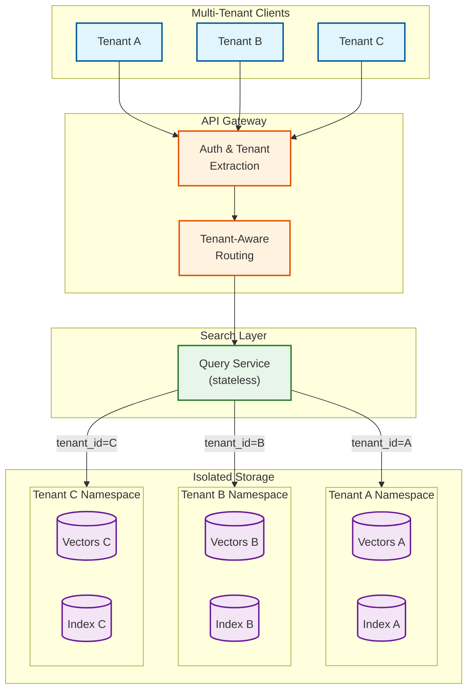
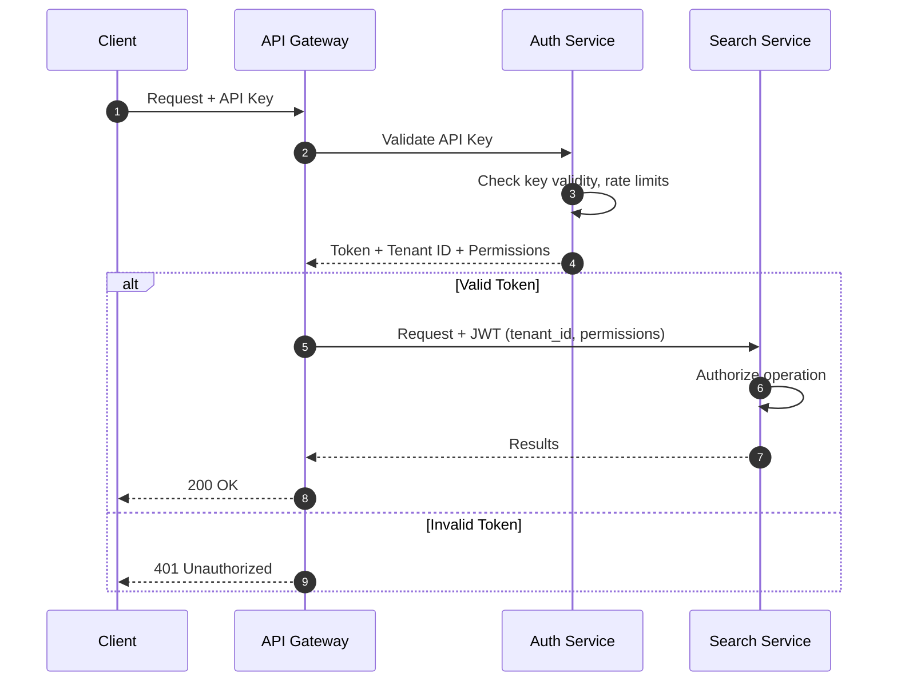
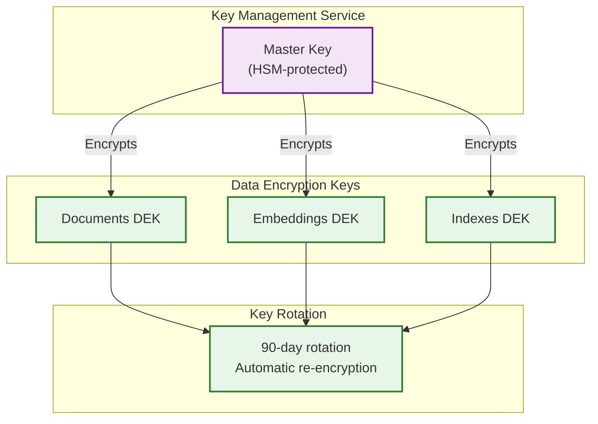

# Security and Compliance

## Data Classification

| Data Type | Classification | PII Risk | Handling Requirements |
|-----------|----------------|----------|----------------------|
| **Query text** | Sensitive | High | Encrypted, anonymized in logs |
| **Document content** | Internal/PII | High | Encrypted at rest, access controlled |
| **Embeddings** | Derived | Low | Cannot reverse to plaintext (lossy) |
| **Search results** | Internal | Medium | Access controlled per tenant |
| **Usage logs** | Internal | Low | Query hashes, no raw queries |
| **Tenant metadata** | Internal | Low | Standard protection |

### Embedding Security Note

Embeddings are **one-way transformations** and cannot be reversed to recover the original text:

```
Text → Embedding → Cannot recover original text

Why:
- Embeddings are lossy (1024 dims cannot encode all information)
- Many different texts map to similar embeddings
- No inverse function exists

However:
- Embeddings can reveal semantic similarity
- Access control still important to prevent inference attacks
```

---

## Multi-Tenant Isolation

### Isolation Architecture



### Isolation Enforcement Layers

| Layer | Mechanism | Enforcement |
|-------|-----------|-------------|
| **API Gateway** | Tenant ID from JWT | Every request validated |
| **Query Service** | Tenant ID in context | Propagated to all calls |
| **Vector DB** | Namespace per tenant | Collection-level isolation |
| **Inverted Index** | Partition per tenant | Index-level isolation |
| **Document Store** | Row-Level Security | tenant_id column filter |
| **Cache** | Tenant-prefixed keys | `{tenant_id}:{key}` |

### Row-Level Security Implementation

```sql
-- Enable RLS on documents table
ALTER TABLE documents ENABLE ROW LEVEL SECURITY;

-- Policy: Users can only see their tenant's documents
CREATE POLICY tenant_isolation ON documents
    FOR ALL
    USING (tenant_id = current_setting('app.tenant_id')::uuid);

-- Set tenant context at connection time
SET app.tenant_id = 'tenant-uuid-here';

-- All queries automatically filtered
SELECT * FROM documents WHERE ...;
-- Becomes: SELECT * FROM documents WHERE ... AND tenant_id = 'tenant-uuid-here';
```

---

## Authentication & Authorization

### Authentication Flow



### Authorization Model

| Role | Permissions | Scope |
|------|-------------|-------|
| **Reader** | Search, Get document | Tenant |
| **Writer** | Reader + Index, Update, Delete | Tenant |
| **Admin** | Writer + Collection management, Settings | Tenant |
| **Super Admin** | All + Cross-tenant operations | Platform |

### Permission Matrix

| Operation | Reader | Writer | Admin | Super Admin |
|-----------|--------|--------|-------|-------------|
| Search | Yes | Yes | Yes | Yes |
| Get document | Yes | Yes | Yes | Yes |
| Index document | No | Yes | Yes | Yes |
| Update document | No | Yes | Yes | Yes |
| Delete document | No | Yes | Yes | Yes |
| Create collection | No | No | Yes | Yes |
| Delete collection | No | No | Yes | Yes |
| Manage settings | No | No | Yes | Yes |
| View other tenants | No | No | No | Yes |

### API Key Structure

```yaml
API Key Format: sk_{tenant_prefix}_{random_32_chars}

Example: sk_acme_abc123def456ghi789jkl012mno345

Stored (hashed):
  key_id: "sk_acme_abc..."  # Prefix for identification
  key_hash: "sha256(...)"   # Full key hash
  tenant_id: "uuid"
  permissions: ["search", "index"]
  rate_limit: 1000  # requests per minute
  created_at: timestamp
  expires_at: timestamp
  last_used: timestamp
```

---

## Security Threats

### Threat 1: Query Injection

**Attack:** Malicious query designed to bypass filters or extract unauthorized data.

```
# Example attack attempts:
query: "* OR tenant_id:other_tenant"
query: "\" OR 1=1 --"
filters: {"$where": "this.tenant_id != current_tenant"}
```

**Mitigations:**

| Mitigation | Implementation |
|------------|----------------|
| **Input sanitization** | Strip special characters, validate format |
| **Parameterized queries** | Never concatenate user input into queries |
| **Query length limits** | Max 1000 characters |
| **Filter validation** | Whitelist allowed operators |
| **Tenant enforcement** | Always add tenant filter server-side |

```python
# SECURE: Parameterized query
def search(query: str, tenant_id: str):
    # Sanitize query
    query = sanitize_query(query)

    # Always enforce tenant isolation
    filters = {
        "must": [
            {"field": "tenant_id", "value": tenant_id}
        ]
    }

    # User filters are validated and appended
    if user_filters:
        validated = validate_filters(user_filters)
        filters["must"].extend(validated)

    return execute_search(query, filters)
```

### Threat 2: Embedding Inversion Attack

**Attack:** Attempt to recover original text from embeddings.

**Risk Assessment:**
- Embeddings are **lossy** - cannot fully reconstruct text
- However, semantic similarity can reveal information
- Nearest neighbor attacks could find similar documents

**Mitigations:**

| Mitigation | Implementation |
|------------|----------------|
| **Access control** | Embeddings API requires authentication |
| **No embedding export** | Don't return embeddings in search results |
| **Noise injection** | Optional: add Gaussian noise to stored embeddings |
| **Tenant isolation** | Never cross-tenant similarity search |

### Threat 3: Denial of Service (DoS)

**Attack:** Resource exhaustion through complex queries or high volume.

**Attack vectors:**
- Very long queries requiring expensive embedding
- Complex filters causing full index scan
- High QPS overwhelming services
- Large reranking requests (thousands of candidates)

**Mitigations:**

| Mitigation | Implementation |
|------------|----------------|
| **Rate limiting** | Per-tenant, per-endpoint limits |
| **Query complexity limits** | Max tokens, max filters |
| **Timeout enforcement** | 30s max per request |
| **Rerank limits** | Max 500 candidates |
| **Priority queuing** | Deprioritize expensive queries |

### Threat 4: Model Poisoning

**Attack:** Index malicious documents to manipulate search results.

**Mitigations:**

| Mitigation | Implementation |
|------------|----------------|
| **Content moderation** | Scan documents before indexing |
| **Rate limit indexing** | Prevent bulk malicious uploads |
| **Audit trail** | Log all indexing operations |
| **Anomaly detection** | Flag unusual embedding distributions |

---

## Encryption

### Encryption Standards

| Layer | Encryption | Algorithm | Key Management |
|-------|------------|-----------|----------------|
| **In transit** | TLS 1.3 | AES-256-GCM | Certificate rotation |
| **At rest (documents)** | AES-256 | GCM mode | HSM-backed KMS |
| **At rest (embeddings)** | AES-256 | GCM mode | HSM-backed KMS |
| **At rest (indexes)** | Volume encryption | AES-256-XTS | Cloud KMS |
| **API keys** | Hash only | SHA-256 + salt | Not stored plaintext |

### Key Hierarchy



---

## Audit Logging

### What to Log

| Event | Logged Fields | Not Logged |
|-------|---------------|------------|
| **Search query** | tenant_id, timestamp, query_hash, result_count, latency | Query text |
| **Document indexed** | tenant_id, doc_id, timestamp, source | Document content |
| **Document deleted** | tenant_id, doc_id, timestamp, deleted_by | N/A |
| **Access denied** | tenant_id, resource, reason, timestamp | N/A |
| **API key created** | tenant_id, key_id, permissions, created_by | API key value |
| **Config changed** | tenant_id, setting, old_value, new_value, changed_by | N/A |

### Audit Log Format

```json
{
  "timestamp": "2024-01-15T10:30:00Z",
  "event_type": "search.query",
  "tenant_id": "tenant-123",
  "user_id": "user-456",
  "request_id": "req-789",
  "source_ip": "192.168.1.1",
  "user_agent": "SearchSDK/1.0",

  "event_data": {
    "query_hash": "sha256:abc123...",
    "collection_id": "col-001",
    "result_count": 10,
    "latency_ms": 87,
    "reranked": true,
    "cache_hit": false
  },

  "security_context": {
    "api_key_id": "sk_acme_abc...",
    "permissions": ["search"],
    "auth_method": "api_key"
  }
}
```

### Log Retention

| Log Type | Retention | Storage |
|----------|-----------|---------|
| **Security events** | 2 years | Immutable storage |
| **Access logs** | 90 days | Log aggregation system |
| **Query logs** | 30 days | Log aggregation system |
| **Error logs** | 90 days | Log aggregation system |

---

## Compliance

### GDPR Compliance

| Requirement | Implementation |
|-------------|----------------|
| **Right to erasure** | Document deletion API removes from all indexes |
| **Data portability** | Export API returns all user documents |
| **Access logging** | Full audit trail of data access |
| **Data minimization** | Only store necessary data, hash queries |
| **Consent** | Tenant responsible for user consent |
| **Breach notification** | Automated detection and alerting |

### GDPR Data Subject Requests

```
DELETE /v1/gdpr/erasure
Request:
  user_id: "user-123"
  tenant_id: "tenant-456"

Actions:
  1. Delete all documents authored by user
  2. Remove from all indexes (vector + inverted)
  3. Clear from all caches
  4. Generate compliance certificate
  5. Log erasure event

Response:
  status: "completed"
  documents_deleted: 42
  completion_time: "2024-01-15T10:30:00Z"
  certificate_id: "gdpr-cert-789"
```

### SOC 2 Controls

| Trust Principle | Control | Implementation |
|-----------------|---------|----------------|
| **Security** | Access control | RBAC + API keys |
| **Security** | Encryption | TLS + AES-256 |
| **Security** | Network security | VPC + firewall rules |
| **Availability** | Redundancy | Multi-AZ deployment |
| **Availability** | Backups | Daily with 30-day retention |
| **Confidentiality** | Data classification | Documented above |
| **Confidentiality** | Tenant isolation | Namespace + RLS |
| **Processing Integrity** | Input validation | Schema validation |
| **Privacy** | Data handling | Anonymization + minimization |

### HIPAA Considerations (if applicable)

| Requirement | Implementation |
|-------------|----------------|
| **PHI encryption** | AES-256 at rest and in transit |
| **Access controls** | RBAC with audit logging |
| **Audit trail** | Immutable logs for 6 years |
| **BAA** | Required with cloud providers |
| **Minimum necessary** | Only index required fields |

---

## Security Checklist

### Infrastructure Security
- [ ] TLS 1.3 for all connections
- [ ] VPC isolation for all components
- [ ] No public internet exposure for databases
- [ ] Regular security patching
- [ ] DDoS protection enabled

### Application Security
- [ ] Input validation on all endpoints
- [ ] Parameterized queries (no SQL/query injection)
- [ ] Rate limiting per tenant
- [ ] API key rotation support
- [ ] Secure defaults (opt-in to sensitive features)

### Data Security
- [ ] Encryption at rest for all data stores
- [ ] No raw queries in logs
- [ ] Tenant isolation enforced at all layers
- [ ] Regular backup testing
- [ ] Data retention policies enforced

### Operational Security
- [ ] Least privilege access for operators
- [ ] Multi-factor authentication for admin access
- [ ] Audit logging for all operations
- [ ] Incident response plan documented
- [ ] Regular security assessments
