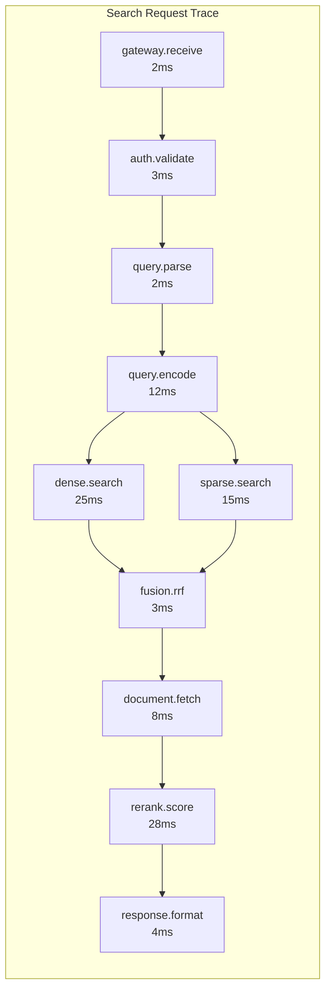

# Observability

## Core Metrics Framework

### RED Metrics (Request-focused)

| Service | Rate | Errors | Duration |
|---------|------|--------|----------|
| **Search API** | `search_requests_total` | `search_errors_total` | `search_latency_ms` |
| **Index API** | `index_requests_total` | `index_errors_total` | `index_latency_ms` |
| **Dense Search** | `dense_search_total` | `dense_search_errors` | `dense_search_latency_ms` |
| **Sparse Search** | `sparse_search_total` | `sparse_search_errors` | `sparse_search_latency_ms` |
| **Reranking** | `rerank_requests_total` | `rerank_errors_total` | `rerank_latency_ms` |
| **Embedding** | `embed_requests_total` | `embed_errors_total` | `embed_latency_ms` |
| **Fusion** | `fusion_operations_total` | `fusion_errors_total` | `fusion_latency_ms` |

### USE Metrics (Resource-focused)

| Resource | Utilization | Saturation | Errors |
|----------|-------------|------------|--------|
| **CPU (Search)** | `cpu_utilization_percent` | `runqueue_length` | `cpu_throttle_count` |
| **Memory (Search)** | `memory_used_bytes` | `memory_pressure` | `oom_kill_count` |
| **GPU (Rerank)** | `gpu_utilization_percent` | `gpu_memory_used` | `cuda_errors` |
| **Disk (Index)** | `disk_utilization_percent` | `io_queue_depth` | `disk_errors` |
| **Network** | `network_bytes_total` | `connection_queue` | `packet_drops` |

---

## Search Quality Metrics

### Retrieval Quality

```yaml
metrics:
  # Recall at K - fraction of relevant docs in top K
  recall_at_k:
    type: gauge
    labels: [k, retriever_type, tenant_id]
    description: "Recall@K for retrieval quality"
    # Measured via labeled test queries

  # Normalized Discounted Cumulative Gain
  ndcg_at_k:
    type: gauge
    labels: [k, tenant_id]
    description: "NDCG@K measuring ranking quality"

  # Mean Reciprocal Rank
  mrr:
    type: gauge
    labels: [tenant_id]
    description: "Mean reciprocal rank of first relevant result"

  # Reranking improvement
  rerank_lift:
    type: histogram
    labels: [tenant_id]
    description: "NDCG improvement from reranking"
    buckets: [0, 0.05, 0.10, 0.15, 0.20, 0.25, 0.30, 0.50]
```

### Latency Breakdown

```yaml
metrics:
  search_stage_latency_ms:
    type: histogram
    labels: [stage]
    stages:
      - query_parsing
      - query_encoding
      - dense_search
      - sparse_search
      - fusion
      - document_fetch
      - reranking
      - response_formatting
    buckets: [1, 5, 10, 25, 50, 100, 250, 500, 1000]

  # End-to-end latency
  search_latency_ms:
    type: histogram
    labels: [search_type, reranked, cache_hit]
    buckets: [10, 25, 50, 75, 100, 150, 200, 300, 500, 1000]
```

### Fusion Quality

```yaml
metrics:
  # Which retriever contributed to final results
  retriever_contribution:
    type: gauge
    labels: [retriever, position]
    description: "Fraction of top-K results from each retriever"

  # Dense vs sparse score distribution
  score_distribution:
    type: histogram
    labels: [retriever]
    description: "Score distribution by retriever"

  # RRF fusion effectiveness
  rrf_coverage:
    type: gauge
    description: "Fraction of results appearing in multiple retrievers"

  # Alpha values (for linear fusion)
  alpha_distribution:
    type: histogram
    labels: [tenant_id]
    description: "Distribution of alpha values if dynamic"
    buckets: [0.1, 0.2, 0.3, 0.4, 0.5, 0.6, 0.7, 0.8, 0.9]
```

---

## Logging Strategy

### Structured Log Format

```json
{
  "timestamp": "2024-01-15T10:30:00.123Z",
  "level": "INFO",
  "service": "search-api",
  "version": "1.2.3",

  "trace_id": "abc123def456",
  "span_id": "789ghi",
  "parent_span_id": "456jkl",

  "tenant_id": "tenant-123",
  "request_id": "req-789",

  "event": "search.completed",

  "search_metadata": {
    "query_hash": "sha256:abc...",
    "search_type": "hybrid",
    "top_k": 10,
    "reranked": true,
    "rerank_candidates": 100
  },

  "timing": {
    "total_ms": 87,
    "query_encoding_ms": 12,
    "dense_search_ms": 25,
    "sparse_search_ms": 15,
    "fusion_ms": 3,
    "reranking_ms": 28,
    "other_ms": 4
  },

  "results": {
    "count": 10,
    "dense_contribution": 0.6,
    "sparse_contribution": 0.4,
    "cache_hit": false
  }
}
```

### Log Levels Strategy

| Level | Usage | Examples |
|-------|-------|----------|
| **ERROR** | Failures requiring attention | Request failed, index corruption |
| **WARN** | Degraded behavior | Slow query, circuit breaker open |
| **INFO** | Normal operations | Request completed, document indexed |
| **DEBUG** | Detailed diagnostics | Score breakdown, candidates list |
| **TRACE** | Very detailed | Individual embedding values |

### What NOT to Log

| Data Type | Reason |
|-----------|--------|
| Raw query text | Privacy, PII risk |
| Document content | Privacy, storage cost |
| Full embeddings | Storage cost, not useful |
| API keys | Security |
| PII fields | Compliance |

---

## Distributed Tracing

### Trace Structure



### Span Definitions

| Span Name | Service | Key Attributes |
|-----------|---------|----------------|
| `gateway.receive` | API Gateway | request_id, tenant_id |
| `auth.validate` | Auth Service | auth_method, key_id |
| `query.parse` | Query Service | query_length, filter_count |
| `query.encode` | Embedding Service | model, dimension |
| `dense.search` | Vector DB | top_k, ef_search, shard_count |
| `sparse.search` | Inverted Index | top_k, token_count |
| `fusion.rrf` | Fusion Service | candidate_count, k_param |
| `document.fetch` | Document Store | doc_count, cache_hits |
| `rerank.score` | Reranking Service | candidate_count, model, batch_size |
| `response.format` | API Gateway | result_count |

### Trace Propagation

```yaml
# W3C Trace Context propagation
headers:
  traceparent: "00-{trace_id}-{span_id}-{flags}"
  tracestate: "vendor=value"

# Example:
traceparent: "00-abc123def456789-789ghi012-01"

# Propagate through:
- HTTP headers (REST)
- gRPC metadata
- Message queue attributes
- Async job context
```

---

## Alerting Rules

### P1 - Critical (Page Immediately)

| Alert | Condition | Duration | Action |
|-------|-----------|----------|--------|
| **SearchDown** | `up{service="search"} == 0` | 1 min | Page on-call |
| **HighErrorRate** | `error_rate > 5%` | 5 min | Page on-call |
| **IndexUnavailable** | `index_health == 0` | 2 min | Page on-call |
| **DatabaseDown** | `db_connections == 0` | 1 min | Page on-call |
| **GPUFailure** | `gpu_available == 0` | 2 min | Page on-call |

### P2 - High (Alert + Investigate)

| Alert | Condition | Duration | Action |
|-------|-----------|----------|--------|
| **HighLatency** | `latency_p95 > 200ms` | 10 min | Alert channel |
| **LowRecall** | `recall_at_100 < 0.90` | 1 hour | Alert channel |
| **RerankerQueueBackup** | `rerank_queue > 100` | 5 min | Alert channel |
| **HighCPU** | `cpu_utilization > 85%` | 10 min | Alert channel |
| **HighMemory** | `memory_utilization > 90%` | 10 min | Alert channel |

### P3 - Medium (Monitor)

| Alert | Condition | Duration | Action |
|-------|-----------|----------|--------|
| **IndexLag** | `replication_lag > 5 min` | 30 min | Ticket |
| **CacheHitRateLow** | `cache_hit_rate < 20%` | 1 hour | Ticket |
| **EmbeddingQueueGrowing** | `embed_queue > 1000` | 15 min | Ticket |
| **SlowQueries** | `slow_query_count > 100/min` | 30 min | Ticket |

### Alert Configuration Example

```yaml
groups:
  - name: search_critical
    rules:
      - alert: SearchHighErrorRate
        expr: |
          sum(rate(search_errors_total[5m])) /
          sum(rate(search_requests_total[5m])) > 0.05
        for: 5m
        labels:
          severity: critical
          team: search-platform
        annotations:
          summary: "Search error rate above 5%"
          description: "Error rate is {{ $value | humanizePercentage }}"
          runbook: "https://wiki/runbooks/search-errors"

      - alert: SearchHighLatency
        expr: |
          histogram_quantile(0.95, sum(rate(search_latency_ms_bucket[5m])) by (le)) > 200
        for: 10m
        labels:
          severity: warning
        annotations:
          summary: "Search p95 latency above 200ms"
          runbook: "https://wiki/runbooks/search-latency"
```

---

## Dashboard Layouts

### System Health Dashboard

```
┌─────────────────────────────────────────────────────────────────┐
│                    SEARCH SYSTEM HEALTH                          │
├─────────────────────────────────────────────────────────────────┤
│                                                                  │
│  ┌──────────────┐  ┌──────────────┐  ┌──────────────┐           │
│  │ Availability │  │   Latency    │  │  Error Rate  │           │
│  │    99.98%    │  │  p95: 87ms   │  │    0.02%     │           │
│  │   ▲ 0.03%    │  │   ▼ 5ms      │  │   ▼ 0.01%    │           │
│  └──────────────┘  └──────────────┘  └──────────────┘           │
│                                                                  │
│  QPS (last hour)                 Latency Distribution            │
│  ┌────────────────────────┐     ┌────────────────────────┐      │
│  │    ╭───╮               │     │  p50: ████████ 52ms    │      │
│  │ ╭──╯   ╰───╮   ╭──     │     │  p95: █████████████ 87ms│     │
│  │─╯          ╰───╯       │     │  p99: █████████████████ 142ms │
│  │ 8K   10K   12K   9K    │     └────────────────────────┘      │
│  └────────────────────────┘                                      │
│                                                                  │
│  Component Status                                                │
│  ┌─────────────────────────────────────────────────────────┐    │
│  │ ● API Gateway    ● Dense Search   ● Sparse Search      │    │
│  │ ● Reranking      ● Embedding      ● Document Store     │    │
│  │ ● Redis Cache    ● Vector DB      ● Inverted Index     │    │
│  └─────────────────────────────────────────────────────────┘    │
│                                                                  │
└─────────────────────────────────────────────────────────────────┘
```

### Search Quality Dashboard

```
┌─────────────────────────────────────────────────────────────────┐
│                    SEARCH QUALITY METRICS                        │
├─────────────────────────────────────────────────────────────────┤
│                                                                  │
│  Retrieval Quality (24h)              Latency by Stage           │
│  ┌────────────────────────┐          ┌────────────────────────┐ │
│  │ Recall@100:    0.96    │          │ Encoding:   ████ 12ms  │ │
│  │ NDCG@10:       0.68    │          │ Dense:      ██████ 25ms│ │
│  │ MRR:           0.54    │          │ Sparse:     ████ 15ms  │ │
│  │ Rerank Lift:   +23%    │          │ Fusion:     █ 3ms      │ │
│  └────────────────────────┘          │ Rerank:     ████████ 28ms│
│                                       │ Other:      █ 4ms      │ │
│  Retriever Contribution               └────────────────────────┘ │
│  ┌────────────────────────┐                                      │
│  │ Dense:  ██████████ 58% │          Cache Performance           │
│  │ Sparse: ████████ 42%   │          ┌────────────────────────┐ │
│  │                        │          │ Query Cache:  32%      │ │
│  │ Overlap: 35%           │          │ Embed Cache:  78%      │ │
│  └────────────────────────┘          │ Doc Cache:    94%      │ │
│                                       └────────────────────────┘ │
│  Score Distribution                                              │
│  ┌────────────────────────────────────────────────────────────┐ │
│  │ Dense Scores    Sparse Scores    Combined Scores            │ │
│  │   ╭╮              ╭╮                ╭╮                       │ │
│  │  ╭╯╰╮           ╭╯ ╰╮             ╭╯╰╮                      │ │
│  │ ╭╯  ╰╮         ╭╯   ╰╮           ╭╯  ╰╮                     │ │
│  │ 0    1         0     50          0     1                    │ │
│  └────────────────────────────────────────────────────────────┘ │
│                                                                  │
└─────────────────────────────────────────────────────────────────┘
```

### Per-Tenant Dashboard

```
┌─────────────────────────────────────────────────────────────────┐
│                    TENANT: ACME CORP                             │
├─────────────────────────────────────────────────────────────────┤
│                                                                  │
│  Usage (This Month)                   Rate Limits                │
│  ┌────────────────────────┐          ┌────────────────────────┐ │
│  │ Queries:    1.2M       │          │ Search:  80/100 req/s  │ │
│  │ Documents:  5.4M       │          │ Index:   40/50 req/s   │ │
│  │ Storage:    12.8 GB    │          │ Status:  ● Healthy     │ │
│  └────────────────────────┘          └────────────────────────┘ │
│                                                                  │
│  Query Volume (7 days)               Top Collections             │
│  ┌────────────────────────┐          ┌────────────────────────┐ │
│  │      ╭─╮    ╭─╮        │          │ products:   2.1M docs  │ │
│  │  ╭───╯ ╰────╯ ╰──╮     │          │ support:    800K docs  │ │
│  │ ─╯               ╰──   │          │ knowledge:  500K docs  │ │
│  │ Mon Tue Wed Thu Fri    │          └────────────────────────┘ │
│  └────────────────────────┘                                      │
│                                                                  │
│  Performance (24h)                    Errors                     │
│  ┌────────────────────────┐          ┌────────────────────────┐ │
│  │ Latency p95:  92ms     │          │ Total:      127        │ │
│  │ Error Rate:   0.03%    │          │ Rate limit: 85         │ │
│  │ Cache Hit:    41%      │          │ Timeout:    32         │ │
│  └────────────────────────┘          │ Other:      10         │ │
│                                       └────────────────────────┘ │
│                                                                  │
└─────────────────────────────────────────────────────────────────┘
```

---

## Runbooks

### Runbook: High Latency

```markdown
# High Latency Runbook

## Symptoms
- Alert: SearchHighLatency triggered
- p95 latency > 200ms for > 10 minutes

## Diagnosis Steps

1. Check which stage is slow:
   ```
   Query: sum by (stage) (rate(search_stage_latency_ms_sum[5m]))
   ```

2. If dense search slow:
   - Check ef_search parameter
   - Check shard distribution
   - Check memory pressure on vector DB

3. If reranking slow:
   - Check GPU utilization
   - Check batch sizes
   - Check queue depth

4. If everything slow:
   - Check network latency between services
   - Check for noisy neighbors
   - Check if traffic spike

## Mitigation

### Quick Fixes
- Reduce ef_search temporarily
- Skip reranking (graceful degradation)
- Enable more aggressive caching

### Medium-term
- Scale out affected component
- Rebalance shards
- Investigate root cause

## Escalation
- If not resolved in 30 minutes, page search-platform team lead
```

### Runbook: Low Recall

```markdown
# Low Recall Runbook

## Symptoms
- Alert: LowRecall triggered
- recall@100 < 0.90 for > 1 hour

## Diagnosis Steps

1. Check if affecting all tenants or specific:
   ```
   Query: recall_at_100 by (tenant_id)
   ```

2. Check index health:
   - Vector index compaction status
   - Inverted index segment count
   - Recent indexing failures

3. Check embedding service:
   - Model version consistent
   - Embedding quality metrics

4. Check recent changes:
   - Model updates
   - Index configuration changes
   - Query routing changes

## Mitigation

### Quick Fixes
- Increase ef_search parameter
- Increase top_k for first stage
- Force index refresh

### Investigation
- Run labeled test queries manually
- Compare dense vs sparse recall separately
- Check for data quality issues

## Escalation
- If not resolved in 2 hours, escalate to ML team
```

---

## SLO Tracking

### SLO Dashboard

| SLO | Target | Current (30d) | Error Budget | Status |
|-----|--------|---------------|--------------|--------|
| **Availability** | 99.95% | 99.98% | 12 min remaining | Good |
| **Latency p95** | < 100ms | 87ms | N/A | Good |
| **Latency p99** | < 200ms | 142ms | N/A | Good |
| **Error Rate** | < 0.1% | 0.02% | 80% remaining | Good |
| **Recall@100** | > 0.95 | 0.96 | N/A | Good |

### Error Budget Policy

```yaml
error_budget_policy:
  availability:
    target: 99.95%
    window: 30 days
    budget_minutes: 21.6  # 0.05% of 30 days

    actions:
      budget_50_percent_consumed:
        - Freeze non-critical deployments
        - Increase monitoring frequency

      budget_75_percent_consumed:
        - Freeze all deployments
        - Assign dedicated engineer

      budget_100_percent_consumed:
        - Incident review required
        - Root cause analysis mandatory
        - Prevent future releases until resolved
```

### SLO Alerting

```yaml
# Alert when burning error budget too fast
- alert: ErrorBudgetBurnRate
  expr: |
    (
      1 - (
        sum(rate(search_requests_total{status="success"}[1h])) /
        sum(rate(search_requests_total[1h]))
      )
    ) > (1 - 0.9995) * 14.4
  # 14.4x burn rate = budget exhausted in ~2 days
  for: 5m
  labels:
    severity: warning
  annotations:
    summary: "Error budget burning too fast"
    description: "At current rate, error budget exhausted in ~2 days"
```
