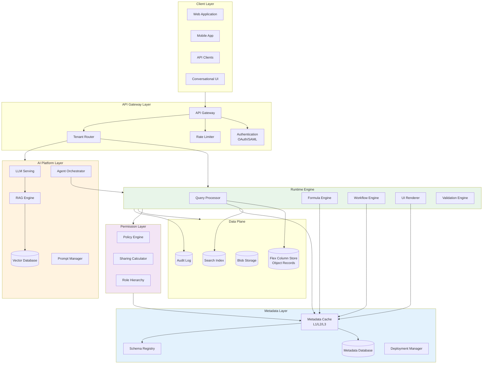

# AI-Native Metadata-Driven Super Framework - System Design

[Back to System Design Index](../README.md)

---

## System Overview

An **AI-Native Metadata-Driven Super Framework** is a Platform-as-a-Platform (PaaP) architecture where all business applications are defined declaratively through metadata, executed by a generic runtime engine, and enhanced with AI-native capabilities. Unlike traditional SaaS applications with fixed schemas and hardcoded logic, this system allows customers to create custom objects, fields, relationships, formulas, workflows, and UIs without any code deployment - everything is metadata that the platform interprets at runtime.

The defining architectural challenges include: (1) **multi-tenant shared-schema with flex columns** enabling instant custom object creation without DDL, (2) **metadata-driven runtime engine** that interprets business logic from configuration rather than code, (3) **formula engine** for calculated fields, validation rules, and workflow criteria, (4) **workflow engine** for automation with triggers, actions, and approval processes, (5) **declarative UI framework** rendering pages from layout metadata, (6) **layered permission system** (RBAC + ABAC + ReBAC) with object, field, and record-level security, and (7) **AI-native capabilities** for natural language schema design, formula generation, and autonomous agent automation.

This architecture powers enterprise platforms like Salesforce, ServiceNow, SAP, Workday, Microsoft Dynamics 365, Oracle Fusion, Zoho, and ERPNext - enabling organizations to build custom applications on a shared, scalable infrastructure without traditional software development.

---

## Key Characteristics

| Characteristic | Value | Implication |
|----------------|-------|-------------|
| **Traffic Pattern** | Mixed (metadata-heavy reads, transaction writes) | Multi-layer metadata caching, CQRS for data operations |
| **Consistency Model** | Strong for metadata, Eventual for analytics | Metadata changes require immediate consistency |
| **Availability Target** | 99.99% platform, 99.9% AI features | Graceful AI degradation, metadata cache resilience |
| **Latency Target** | <50ms metadata read, <200ms record CRUD, <2s AI generation | Aggressive caching, async AI processing |
| **Multi-Tenancy** | Shared-schema with flex columns | No DDL for custom objects, tenant isolation via row filtering |
| **Customization Model** | Declarative (metadata-driven) | Runtime interpretation, no code deployment for changes |
| **AI Integration** | Native - schema generation, formula creation, agents | LLM serving, RAG for documentation, agent orchestration |

---

## Complexity Rating

| Aspect | Rating | Reason |
|--------|--------|--------|
| **Overall** | Very High | Metadata engine + formula interpreter + workflow engine + permission system + AI |
| **Multi-Tenant Data Architecture** | Very High | Flex columns, tenant isolation, schema evolution without DDL |
| **Metadata Runtime Engine** | Very High | Generic interpreter for objects, fields, formulas, workflows |
| **Formula Engine** | High | AST parsing, multiple evaluation contexts, cross-object references |
| **Workflow Engine** | High | State machines, triggers, actions, approval routing |
| **Permission System** | High | RBAC + sharing rules + role hierarchy + OWD |
| **Declarative UI Framework** | Medium | Layout metadata to rendered pages |
| **AI Integration** | High | NL to formula, schema recommendation, autonomous agents |

---

## Quick Navigation

| Document | Description |
|----------|-------------|
| [01 - Requirements & Estimations](./01-requirements-and-estimations.md) | Functional/Non-functional requirements, capacity planning, SLOs |
| [02 - High-Level Design](./02-high-level-design.md) | Architecture, metadata layers, data flows, key decisions |
| [03 - Low-Level Design](./03-low-level-design.md) | Data model, API design, formula/workflow algorithms |
| [04 - Deep Dive & Bottlenecks](./04-deep-dive-and-bottlenecks.md) | Metadata cache, formula engine, permission calculator |
| [05 - Scalability & Reliability](./05-scalability-and-reliability.md) | Scaling strategy, caching layers, fault tolerance |
| [06 - Security & Compliance](./06-security-and-compliance.md) | Multi-layer authorization, tenant isolation, compliance |
| [07 - Observability](./07-observability.md) | Metrics, logging, tracing, alerting |
| [08 - Interview Guide](./08-interview-guide.md) | 45-min pacing, trap questions, trade-offs |

---

## Core Platform Modules

| Module | Responsibility | Key Challenge |
|--------|----------------|---------------|
| **Metadata Repository** | Store object/field/relationship/workflow definitions | Schema evolution, versioning, deployment |
| **Runtime Engine** | Execute CRUD operations using metadata definitions | Performance with dynamic schema resolution |
| **Formula Engine** | Parse and evaluate formula expressions | Cross-object references, circular dependency detection |
| **Workflow Engine** | Execute triggers, actions, approval processes | Cascade prevention, governor limits |
| **UI Renderer** | Generate pages from layout metadata | Profile-based layouts, FLS enforcement |
| **Permission Engine** | Enforce object/field/record-level security | Sharing calculation at scale |
| **Query Processor** | Execute SOQL-like queries with metadata resolution | Query optimization, index usage |
| **AI Platform** | Schema generation, formula creation, agents | LLM serving, prompt management |

---

## AI Capabilities Matrix

| Capability | Technology | Use Cases |
|------------|------------|-----------|
| **Natural Language to Formula** | LLM + Schema Context | "Calculate discount as 10% if quantity > 100" → Formula |
| **Natural Language to Workflow** | LLM + Object Context | "Send email when case priority is high" → Workflow Rule |
| **Schema Recommendation** | LLM + Domain Analysis | "I need to track support tickets" → Suggested Objects/Fields |
| **Natural Language Query** | LLM + SOQL Generation | "Show opportunities closing this month" → Query + Results |
| **Document Processing** | OCR + LLM Extraction | Invoice PDF → Extracted fields → Record creation |
| **Autonomous Agents** | Agent Orchestration | Data entry, approval routing, anomaly detection |
| **Semantic Search** | Vector DB + RAG | Search across all objects with natural language |

---

## Architecture Overview



---

## Metadata-Driven vs Traditional SaaS

| Aspect | Traditional SaaS | Metadata-Driven Platform |
|--------|------------------|--------------------------|
| **Schema Changes** | Code deployment, DDL migrations | Instant - metadata row insertion |
| **Custom Fields** | Feature request → Dev → Release | Self-service via admin UI |
| **Business Logic** | Hardcoded in application | Declarative formulas, validation rules |
| **Workflows** | Custom code per automation | Configurable triggers and actions |
| **UI Customization** | Limited themes/branding | Full layout customization per object |
| **Permissions** | Role-based only | Object + Field + Record level |
| **Time to Customize** | Weeks to months | Minutes to hours |
| **Multi-Tenancy** | Database per tenant or schema per tenant | Shared schema with row-level isolation |
| **Upgrade Impact** | Customizations may break | Customizations preserved across upgrades |

---

## When to Use This Design

**Use Metadata-Driven Super Framework When:**
- Building a platform where customers create their own applications
- Enterprise needs unlimited customization without code
- Multi-tenant SaaS with strong isolation requirements
- Business processes vary significantly across customers
- AI-assisted application building improves user productivity
- Compliance requires detailed audit trails of all changes
- Rapid iteration on business logic without deployments

**Do NOT Use When:**
- Single-purpose application with fixed schema
- Performance-critical systems where metadata lookup overhead matters
- Simple CRUD applications without complex business logic
- Small user base where per-tenant databases are feasible
- Real-time systems requiring sub-10ms latency
- Limited engineering resources for platform complexity

---

## Real-World Implementations

| Platform | Architecture Highlights | AI Innovation |
|----------|------------------------|---------------|
| **Salesforce** | Force.com multi-tenant, flex columns, Apex runtime | Einstein GPT, Agentforce, Data Cloud |
| **ServiceNow** | Now Platform, Flow Designer, UI Builder | Now Assist, Virtual Agent, Predictive Intelligence |
| **SAP S/4HANA** | ABAP, BTP, Fiori UI | Joule AI assistant, Business AI |
| **Workday** | Object Management Services, Workday Studio | Illuminate AI, Skills Cloud |
| **Microsoft Dynamics 365** | Dataverse, Power Platform, Model-driven apps | Copilot, AI Builder |
| **Oracle Fusion** | Oracle Cloud Infrastructure, OTBI | Embedded AI, Adaptive Intelligence |
| **Zoho** | Zoho Creator, Deluge scripting | Zia AI, Custom Functions |
| **ERPNext** | Frappe Framework, DocTypes | Custom Scripts, AI extensions |

---

## Technology Stack (Reference)

| Layer | Technology Options | Selection Criteria |
|-------|-------------------|-------------------|
| **Metadata Database** | PostgreSQL, CockroachDB | ACID, JSON support, partitioning |
| **Metadata Cache** | Redis Cluster, Memcached | Sub-millisecond reads, cluster mode |
| **Flex Column Store** | PostgreSQL, Vitess, CockroachDB | Horizontal scaling, tenant isolation |
| **Search Index** | Elasticsearch, OpenSearch | Full-text search, aggregations |
| **Blob Storage** | Object Storage (S3-compatible) | Attachments, documents |
| **LLM Serving** | vLLM, TensorRT-LLM | Formula/workflow generation |
| **Vector Database** | Milvus, Pinecone, Weaviate | RAG, semantic search |
| **API Gateway** | Kong, Envoy | Rate limiting, tenant routing |
| **Message Queue** | Kafka, Pulsar | Async workflows, events |

---

## Quick Reference Card

```
┌─────────────────────────────────────────────────────────────────────┐
│     AI-NATIVE METADATA-DRIVEN SUPER FRAMEWORK - QUICK REFERENCE     │
├─────────────────────────────────────────────────────────────────────┤
│                                                                     │
│  SCALE TARGETS                 KEY PATTERNS                         │
│  ─────────────                 ────────────                         │
│  • 10,000+ tenants             • Flex columns (no DDL)              │
│  • 1M+ custom objects          • Metadata caching (L1/L2/L3)        │
│  • 100M+ records/tenant        • AST-based formula engine           │
│  • 10B+ metadata ops/day       • State machine workflows            │
│  • 99.99% availability         • RBAC + Sharing rules + Role hier.  │
│                                                                     │
├─────────────────────────────────────────────────────────────────────┤
│                                                                     │
│  CORE ENGINES                  AI CAPABILITIES                      │
│  ────────────                  ───────────────                      │
│  • Metadata Repository         • NL to Formula                      │
│  • Formula Engine              • NL to Workflow                     │
│  • Workflow Engine             • Schema Recommendation              │
│  • Permission Engine           • NL Query (SOQL generation)         │
│  • UI Renderer                 • Document Processing                │
│  • Query Processor             • Autonomous Agents                  │
│                                                                     │
├─────────────────────────────────────────────────────────────────────┤
│                                                                     │
│  PERMISSION LAYERS             METADATA TYPES                       │
│  ─────────────────             ──────────────                       │
│  • Object CRUD                 • Object Definitions                 │
│  • Field-Level Security        • Field Definitions                  │
│  • Sharing Rules               • Relationship Definitions           │
│  • Role Hierarchy              • Layout Definitions                 │
│  • Org-Wide Defaults           • Workflow Rules                     │
│  • Manual Shares               • Validation Rules                   │
│                                                                     │
├─────────────────────────────────────────────────────────────────────┤
│                                                                     │
│  INTERVIEW KEYWORDS                                                 │
│  ─────────────────                                                  │
│  Flex columns, Universal Data Dictionary, Metadata cache,           │
│  AST parsing, Formula evaluation, Governor limits, Order of         │
│  execution, Sharing recalculation, OWD, SOQL, Apex runtime,        │
│  Platform events, Trigger cascade, Multi-tenant isolation,          │
│  Schema-less storage, Declarative development, No-code/Low-code    │
│                                                                     │
└─────────────────────────────────────────────────────────────────────┘
```

---

## Interview Readiness Checklist

| Topic | Must Know | Deep Dive |
|-------|-----------|-----------|
| Multi-Tenant Architecture | Flex columns, tenant isolation | Shard routing, hot tenant handling |
| Metadata Repository | Object/field definitions | Deployment, versioning, dependencies |
| Formula Engine | AST parsing, evaluation | Cross-object refs, circular detection |
| Workflow Engine | Triggers, actions | Governor limits, cascade prevention |
| Permission System | RBAC basics | Sharing rules, role hierarchy, OWD |
| Query Processing | SOQL-like queries | Index selection, query optimization |
| AI Integration | NL to formula concept | Prompt engineering, guardrails |
| Caching Strategy | L1/L2/L3 layers | Invalidation, consistency |

---

## Related Systems

- [Identity & Access Management (IAM)](../2.5-identity-access-management/00-index.md) - AuthN/AuthZ patterns
- [Distributed Job Scheduler](../2.6-distributed-job-scheduler/00-index.md) - Async workflow execution
- [Feature Flag Management](../2.7-feature-flag-management/00-index.md) - Declarative configuration patterns
- [Event Sourcing System](../1.18-event-sourcing-system/00-index.md) - Audit trails, history tracking
- [CQRS Implementation](../1.19-cqrs-implementation/00-index.md) - Read/write separation
- [AI Native Cloud ERP SaaS](../2.18-ai-native-cloud-erp-saas/00-index.md) - AI-native enterprise patterns

---

## References

- Salesforce Platform Multitenant Architecture - Force.com whitepaper, flex columns, Apex runtime
- ServiceNow Platform Technical Overview - Now Platform, Flow Designer patterns
- Gartner Enterprise Low-Code Application Platform (LCAP) - Market definitions, evaluation criteria
- Workday Architecture Overview - Object Management Services, metadata-driven approach
- Microsoft Power Platform Architecture - Dataverse, model-driven apps
- AI-Powered Low-Code 2026 - Industry trends, AI-native development
